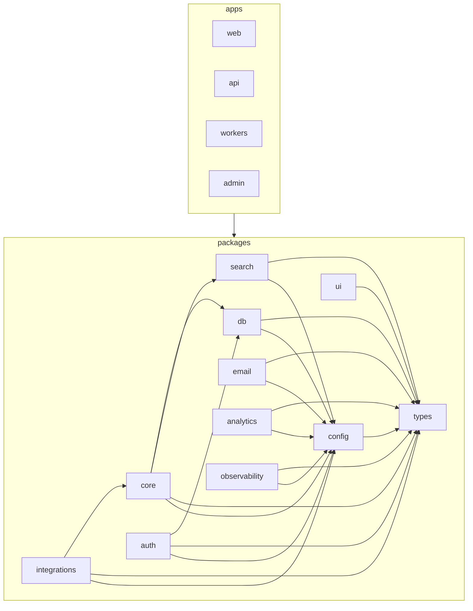

# architecture-contract — the LeadWolf layout & allowed dependency graph

> A **distillation** of [`docs/planning/16-code-organization.md`](../../../../docs/planning/16-code-organization.md)
> and [`02-architecture.md`](../../../../docs/planning/02-architecture.md) for quick reference. Those two
> docs are the **source of truth**. If this file disagrees with them, they win — correct this file.

## 1. The two trees

**Turborepo monorepo** (Bun workspaces, Biome). Two kinds of unit:

- **`apps/*` — deployable processes, thin.** They adapt a transport (HTTP, a queue, the browser) to
  domain logic that lives in `packages/*`. They have their own Dockerfile/lifecycle. They may depend on
  `packages/*` but **never on each other**.
- **`packages/*` — side-effect-free libraries.** Each is exported through exactly one typed `index.ts`.
  Domain logic lives here so `api` and `workers` share one implementation.

```
apps/
  web/      # Next.js 15 (App Router) dashboard — feature-sliced, lazy-loaded
  api/      # Hono on Bun — tRPC (internal) + REST/OpenAPI (public); the only public HTTP surface
  workers/  # Bun + BullMQ processors (one per queue)
  admin/    # internal staff-only super-admin console (separate deploy, privileged role)
packages/
  types/    # Zod schemas + inferred types, DTOs, RFC-9457 error classes  (leaf — imports nothing internal)
  config/   # zod-validated env (appEnvSchema) + shared tsconfig/biome presets
  db/       # Drizzle schema, migrations, RLS SQL, repositories (the ONLY data-access layer)
  core/     # domain logic by domain (reveal/ dedup/ scoring/ entitlements/ ...) + ports/ + tenancy primitives
  auth/     # self-built auth (Lucia + arctic + TOTP + node-saml)
  integrations/  # one folder per provider (salesforce/ hubspot/ apollo/ ...), each implements a core port
  search/   # SearchPort + Typesense impl + Postgres fallback
  email/    # React Email templates + SES send
  ui/       # shadcn primitives + theme tokens (React/styling only)
  analytics/      # PostHog capture
  observability/  # logger/tracing/metrics
```

## 2. Inside an app (feature slice = an adapter, not the home of business rules)

### `apps/api/src/`
```
middleware/          # the uniform chain: authn → tenancy → setGuc → rbac → entitlement → audit → error
features/<domain>/
  routes.ts          # HTTP wiring ONLY: validate input → call a packages/core service → shape response
  schema.ts          # zod-openapi request/response (or re-use packages/types)
  index.ts           # exports the feature's router
app.ts               # compose feature routers + middleware
server.ts            # entry / listen
```
`routes.ts` is the **only** place that touches `req`/`res`/HTTP status. It never touches the DB directly.

### `apps/web/src/`
```
app/                 # Next.js routes (thin): segments per destination, layout.tsx, route handlers
features/<domain>/   # home, prospect, sequences, inbox, reports, settings, ...
  components/         # presentation only — no fetch / business logic
  hooks/             # TanStack Query hooks calling api.ts; local view state
  api.ts             # typed client calls to apps/api (the slice's data access)
  store.ts           # Zustand slice (only if cross-component client state is needed)
  types.ts           # view-model types (domain types come from packages/types)
  index.ts           # public surface (what the app shell / routes may import)
shared/              # cross-feature web-only helpers (layout primitives, formatting)
lib/                 # tRPC/query client, auth client, env access (re-exported from packages/config)
```
A route file renders a feature's public component and is a handful of lines. Slices are lazy-loaded.

### `apps/workers/src/`
```
queues/<queue>.ts    # one processor per queue: enrichment, scoring, imports, crm-sync, outreach,
                     #   webhook, search-sync
register.ts          # wire processors to queues; inject concrete adapters into core (composition root)
index.ts             # entry
```
A processor validates the typed job payload, then calls the **same** `packages/core` services `apps/api`
uses — one implementation, two transports.

## 3. Inside a package

Each package is internally organized **by domain**, one level down, same rules. Key ones:

- **`core`** — `src/<domain>/` (`reveal/`, `dedup/`, `scoring/`, `entitlements/`, `import/`,
  `suppression/`, `audit/`, `outreach/`), plus `src/ports/` (provider interfaces), `requestContext.ts`,
  `withWorkspaceTx.ts`, `index.ts`. Split by domain, not by layer. Declares **ports**; does **not** import
  `integrations`.
- **`db`** — `src/schema/`, `src/migrations/`, `src/rls/*.sql`, `src/repositories/`, `index.ts`.
  Repositories are the only code that writes SQL/Drizzle and applies RLS GUCs; they return typed domain
  objects, not raw rows.
- **`integrations`** — `src/<provider>/` each `{client,mapper,types,index}.ts`; each implements a `core`
  port and maps payloads into `types`.
- **`types`** — leaf. **`config`** — depends only on `types`.

## 4. The allowed dependency graph (16 §5 — enforce in CI)

**Invariants:**
- `apps/*` may depend on `packages/*` but **never on each other**.
- `packages/*` are imported **only through their public `index.ts`** — no deep imports past the barrel.
- No import cycles. Acyclic via the **port pattern**: `core` declares interfaces (`core/ports/`,
  `SearchPort`); adapters (`integrations`, `search/typesense`) implement them; the **app is the
  composition root** that injects the concrete adapter.

| Package | May import |
|---|---|
| `types` | (nothing internal — leaf) |
| `config` | `types` |
| `db` | `types`, `config` |
| `search` | `types`, `config` |
| `email` | `types`, `config` |
| `ui` | `types` (+ React/styling only) |
| `analytics` / `observability` | `types`, `config` |
| `auth` | `db`, `types`, `config` |
| `core` | `db`, `search`, `types`, `config` (declares ports; does **not** import `integrations`) |
| `integrations` | `core` (port interface), `types`, `config` |
| `apps/*` | any `packages/*`; **never** another app |



## 5. Layer separation (the request path)

```
apps/api routes.ts  →  packages/core service  →  packages/db repository  →  Aurora
   (HTTP only)          (domain rules)            (data access only)
```
- HTTP layer (`apps/api`) knows requests, status codes, idempotency headers, the middleware chain — and
  nothing about domain internals.
- Domain layer (`packages/core`) knows the rules + the tenancy contract (`withWorkspaceTx`); knows nothing
  about HTTP. `apps/workers` reuse it unchanged.
- Data layer (`packages/db` repositories) is the only SQL/Drizzle + RLS GUC code; returns typed objects.
- **Validation** at the edge (Zod via tRPC/zod-openapi) **and** at the service boundary for invariants.
  Workspace id comes from the session/key, never the request body.

## 6. Tenant-scoping invariant (LeadWolf-specific — do not drop)

Every workspace-scoped query runs under Postgres **RLS** keyed by `SET LOCAL app.current_workspace_id`
(+ `app.current_tenant_id`), inside the transaction, under a non-`BYPASSRLS` role (RDS Proxy resets the
GUC per checkout, so it must be set in-tx). The app also carries the same IDs in AsyncLocalStorage. A
repository touching workspace-scoped data (`contacts`, `accounts`, `lists`, `contact_reveals`, …) that
does not apply the GUC is an **architecture violation**, not a style nit. (02 §4, 03 §9, ADR-0006.)

## 7. Naming & file-size (16 §8)

| Thing | Convention | Example |
|---|---|---|
| Package | `@leadwolf/<name>`, dir `kebab-case` | `@leadwolf/core` |
| Feature/domain folder | `kebab-case`, singular | `features/reveal/`, `core/dedup/` |
| React component | `PascalCase.tsx`, one per file | `RevealButton.tsx` |
| Hook | `useThing.ts` | `useContactSearch.ts` |
| Service / domain fn | `camelCase.ts`, named for its export | `revealContact.ts` |
| Repository | `<entity>Repository.ts` | `contactRepository.ts` |
| Test | `<name>.test.ts`, co-located | `revealContact.test.ts` |

File-size: evaluate for split at soft ~200 / hard ~300; **escape hatch** — a cohesive single unit may
exceed 300 with a one-line header note saying why. Each file opens with a 1–2 line responsibility comment.

## 8. Mechanical gate (`dependency-cruiser`)

The rules in §4 are enforced by [`../templates/dependency-cruiser.cjs`](../templates/dependency-cruiser.cjs)
(forked from `scalable-architecture`'s
[`import-boundaries.md`](../../scalable-architecture/templates/import-boundaries.md) Option C and
specialized to LeadWolf). Install it when code is first scaffolded:

- Copy `dependency-cruiser.cjs` to the repo root as `.dependency-cruiser.cjs`.
- `npm i -D dependency-cruiser` (or `bun add -d`).
- Add a `lint:boundaries` script (`depcruise apps packages`) and run it in CI so a forbidden import
  **fails the build**.

It encodes: `apps/*` never import another app; no deep imports past a package `index.ts`; no cross-feature
imports inside an app; and the leaf→`core` layering. The Mermaid graph in the navigation map only
*visualizes* these edges — depcruise is what *catches* violations.

## Source links
[16 — Code Organization](../../../../docs/planning/16-code-organization.md) ·
[02 — Architecture](../../../../docs/planning/02-architecture.md) ·
[05 — Features & Modules](../../../../docs/planning/05-features-modules.md) ·
[11 — Information Architecture](../../../../docs/planning/11-information-architecture.md)
