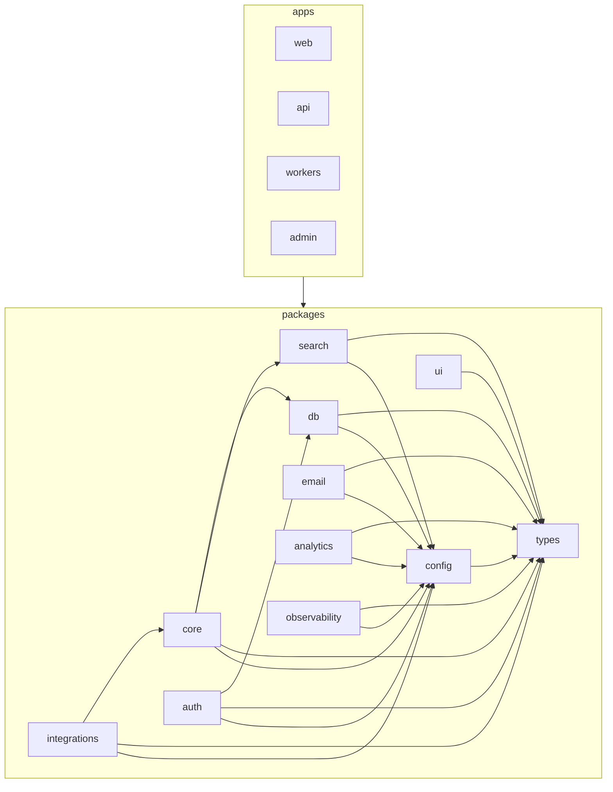

<!--
  TEMPLATE for docs/ARCHITECTURE_MAP.md — authored by Claude from docs/architecture-map.json + the
  navigation-map-spec. Replace every {{PLACEHOLDER}}. Paths come from the generated JSON — do NOT hand-edit
  paths here. Delete this comment after filling in.
-->
# LeadWolf — Architecture Map

> **Status:** {{planned | live}} · **Generated from:** docs/architecture-map.json
> (run `node .claude/hooks/gen-architecture-map.mjs` to refresh paths). One-line purposes and the Mermaid
> graph are maintained by hand here; **paths are owned by the JSON** — if they disagree, regenerate.

<!-- When status is "planned", keep this banner; delete it once code lands and status flips to "live". -->
> ⚠ **Planned — these paths are targets, not locations.** The code does not exist yet. Do not open these
> as real files; they describe where things will go (per docs/planning/16 + 02 + 05 + 11).

## Repo tree (purpose per folder/key file)

```
{{tree — each line: path  # one-line purpose}}
apps/
  api/        # Hono/Bun — the only public HTTP surface; thin transport over packages/core
  web/        # Next.js dashboard — feature-sliced, lazy-loaded
  workers/    # BullMQ processors — one per queue, reuse packages/core
  admin/      # staff-only super-admin console (separate deploy)
packages/
  types/      # Zod schemas + inferred types + RFC-9457 errors (leaf)
  config/     # zod-validated env + shared presets
  db/         # Drizzle schema, migrations, RLS, repositories (only data access)
  core/       # domain logic by domain + ports + tenancy primitives
  …           # auth, integrations, search, email, ui, analytics, observability
```

## FEATURE → FILES index

> One subsection per domain (from `features` in the JSON). List every file across web / admin / api /
> core / db / workers / integrations. Mirror the JSON exactly.

### {{domain}}
- **api:** {{apps/api/src/features/<domain>/...}}
- **core:** {{packages/core/src/<domain>/...}}
- **db:** {{packages/db/src/repositories/<entity>Repository.ts}}
- **web:** {{apps/web/src/features/<destination>/... — note: web is destination-keyed}}
- **workers:** {{apps/workers/src/queues/<queue>.ts}}
- **integrations:** {{packages/integrations/<provider>/...}}

_(repeat per domain)_

## Destinations cross-reference (the 6 web destinations → domains they surface)

> From docs/planning/11 §6. This is where cross-domain relationships live (the index never cross-lists).

| Destination | Surfaces domains | API |
|---|---|---|
| Home | home, notifications | `/home/summary`, `/notifications` |
| Prospect | search, reveal, lists, import, enrichment, scoring | `/search/*`, `/contacts/*`, `/lists`, `/contacts/:id/reveal` |
| Sequences | outreach, templates | `/outreach/*`, `/templates` |
| Inbox | inbox | `/inbox`, `/tasks` |
| Reports | reports, data-health | `/reports/*` |
| Settings | admin-settings, billing, compliance, api-public | `/settings/*`, `/billing`, `/compliance/*` |

## DEPENDENCY section (which features/packages depend on which shared packages)

> From `dependencies` in the JSON (the allowed graph, 16 §5). Enforced by `dependency-cruiser`, not by
> this prose.

{{prose: e.g. "core depends on db, search, types, config; integrations on core, types, config; …"}}

## Allowed module-dependency graph



## Shared / platform areas

{{list shared areas from `shared` in the JSON: packages/types, packages/config, apps/api/middleware, …}}

## Violations to fix

> Only present when the generator reported `unassigned[]` or `warnings[]`. A file here is misplaced or
> misnamed — fix the code, not the map.

{{- path — why it's unassigned / the warning}}
