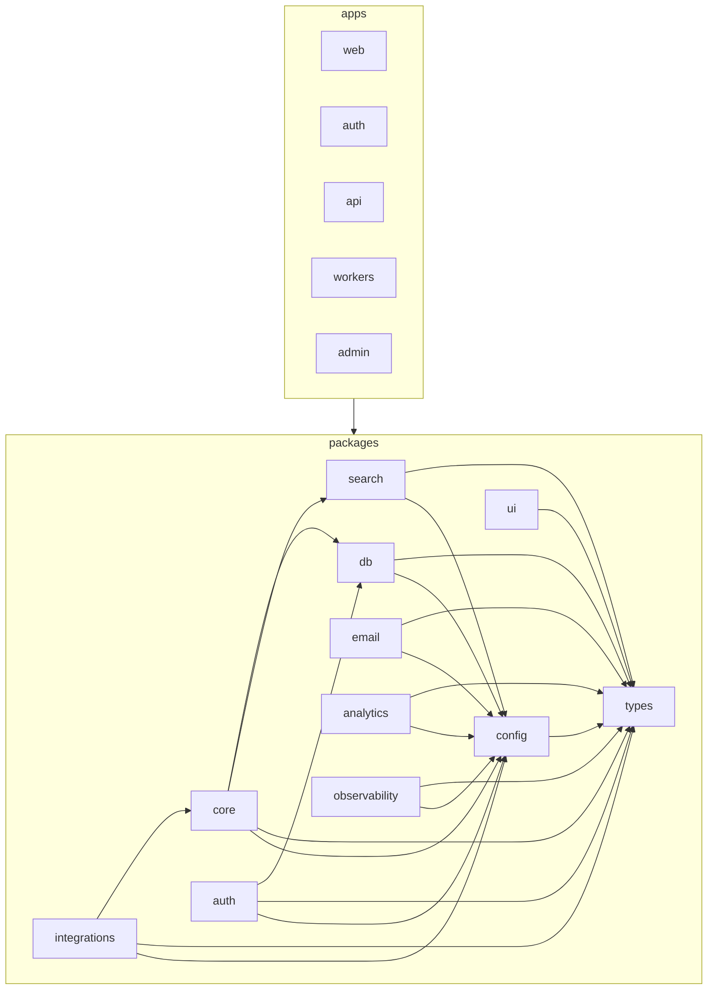

# LeadWolf — Architecture Map

> **Status:** `live` · **Generated from:** [`docs/architecture-map.json`](./architecture-map.json)
> (run `node .claude/hooks/gen-architecture-map.mjs` — or `bun run arch:map` — to refresh). **Paths come
> from the JSON (generated); do not edit paths here by hand.** One-line purposes and the Mermaid graph are
> authored here. Maintained by the [`enterprise-architecture`](../.claude/skills/enterprise-architecture/SKILL.md) skill.

> **Live end-to-end — round-trip + progressive multi-step flow.** 65 source files, 0 warnings, 2
> framework-root files unbucketed (`apps/{auth,web}/next.config.mjs` — see Notes). Login threads password →
> **MFA → workspace** via a Redis login-transaction; `apps/web` hosts the `/auth/callback` exchange +
> in-memory token client. `apps/{workers,admin}` remain **targets**.
> Design: [17-authentication.md](./planning/17-authentication.md), ADR-0016/17/18.

## Repo tree (live; `apps/{web,workers,admin}` are targets)

```
packages/                       # side-effect-free libraries, each exported via one index.ts  [LIVE]
  types/   src/{errors,auth}.ts # RFC-9457 errors + auth Zod contracts (leaf)
  config/  src/env.ts           # zod-validated env (the ONLY process.env reader)
  ui/      src/{tokens.css,cn}  # TruePoint tokens (Cobalt = fill/logo only) + class helper
  db/      src/                 # Drizzle schema + RLS + repositories (the ONLY data access)
    schema/auth.ts rls/auth.sql client.ts(withTenantTx)  repositories/{user,workspace}Repository.ts
  auth/    src/                 # self-built auth primitives (no HTTP)
    identifierLookup password session token code refresh login loginTransaction flow mfaVerify secrets mfa policy
apps/                           # deployable processes (thin transport adapters)
  api/   src/                   # Hono on Bun — validates the access JWT; never issues tokens  [LIVE]
    middleware/{authn,tenancy,error}.ts  features/auth/  app.ts  server.ts
  auth/  src/                   # auth.truepoint.in IdP (Next 15) — screens + /token/* + JWKS  [LIVE]
    middleware.ts(headers)  app/{login,password,mfa,workspace,token/*,.well-known/jwks.json}  shared/  lib/
  web/   src/                   # app.truepoint.in (Next 15) — /auth/callback + in-memory token  [LIVE]
    app/{page,auth/callback}  lib/{authClient,pkce,publicConfig}
  workers/  admin/              # BullMQ · staff console                                        [TARGET]
```

## FEATURE → FILES index (live)

### auth — *M2* ([05 §1](./planning/05-features-modules.md), [17](./planning/17-authentication.md))
- **api:** `apps/api/src/features/auth/{routes,index}.ts` (GET `/api/v1/auth/session` from verified claims)
- **db:** `packages/db/src/repositories/userRepository.ts` (user/identity aggregate: users + sessions)
- **shared primitives:** `packages/auth/*` (identifierLookup · password · session · token · code · refresh ·
  login(authenticatePassword) · loginTransaction · flow · mfa/mfaVerify · secrets · policy) — the self-built auth logic
- **IdP origin (`apps/auth`, dedicated, not a web feature slice):** screens (`login`→`password`→`mfa`→
  `workspace`) + token endpoints under `apps/auth/src/app/*` (see Shared); headers in `apps/auth/src/middleware.ts`
- **app-domain (`apps/web`):** `/auth/callback` code receiver + in-memory token client (see Shared `apps/web`)
- **targets:** `apps/api/src/features/{token,sso,scim}/*` (more auth API)

### workspaces — *M2* ([05 §2](./planning/05-features-modules.md))
- **db:** `packages/db/src/repositories/workspaceRepository.ts` (RLS-scoped list of a user's workspaces —
  drives the login workspace-selection step)
- **targets:** `apps/api/src/features/workspaces/*` + web surfaces in Settings

_Remaining domains (`reveal`, `search`, `lists`, `import`, `enrichment`, `billing`, `outreach`,
`compliance`, … + the 6 web destinations) have **no code yet**; targets in
[05](./planning/05-features-modules.md) + [11 §6](./planning/11-information-architecture.md)._

## Destinations cross-reference (6 web destinations → domains; + the auth origin)

> From [11 §6](./planning/11-information-architecture.md). Auth surfaces on the **dedicated auth origin**
> (`apps/auth`, not one of the 6 app destinations) and inside **Settings** (account security, SSO/SCIM).

| Destination | Surfaces domains | API |
|---|---|---|
| **Home** | home, notifications | `/home/summary`, `/notifications` |
| **Prospect** | search, reveal, lists, import, enrichment, scoring | `/search/*`, `/contacts/*`, `/lists` |
| **Sequences** | outreach, templates | `/outreach/*`, `/templates` |
| **Inbox** | inbox | `/inbox`, `/tasks` |
| **Reports** | reports, data-health | `/reports/*` |
| **Settings** | admin-settings, billing, compliance, api-public, **auth** | `/settings/*`, `/billing` |
| **(auth origin)** | auth | `auth.truepoint.in/login · /password · /token/* · /.well-known/jwks.json` |

## DEPENDENCY section (which packages depend on which)

From [`architecture-map.json`](./architecture-map.json) `dependencies` (the allowed graph, [16 §5](./planning/16-code-organization.md)):

- `types` — leaf. **`config`** → `types`. `ui` → `types`. `db` → `types`, `config`.
- **`auth`** → `db`, `types`, `config` *(live: imports `@leadwolf/db`, `@leadwolf/types`, `@leadwolf/config`)*.
- `core` → `db`, `search`, `types`, `config` (declares ports; not `integrations`). `integrations` → `core`, `types`, `config`.
- **`apps/api`** → `auth`, `config`, `types` (+ `hono`). **`apps/auth`** → `auth`, `db`, `config`, `types`, `ui` (+ `next`/`react`).
  **`apps/web`** → `ui` (+ `next`/`react`; it talks to the api/auth over HTTP, never via imports).
  `apps/*` → any `packages/*`; **never** another app.

Enforced by `dependency-cruiser` ([`.dependency-cruiser.cjs`](../.dependency-cruiser.cjs) at the repo root;
`bun run lint:boundaries`). Imports go only through each package's `index.ts` (no deep imports). The
Mermaid graph only *visualizes* this.

## Allowed module-dependency graph



## Shared / platform areas (live)

- **`packages/types`** — `errors.ts` (RFC-9457), `auth.ts` (auth Zod schemas), `index.ts`.
- **`packages/config`** — `env.ts` (the only `process.env` reader), `index.ts`.
- **`packages/ui`** — `tokens.css` (TruePoint tokens), `cn.ts`, `index.ts`.
- **`packages/db`** — `client.ts` (`withTenantTx` GUC helper), `schema/auth.ts`, `schema/index.ts`,
  `drizzle.config.ts`, `index.ts`. (RLS in `src/rls/auth.sql` — `.sql`, not a counted source file.)
- **`packages/auth`** — `identifierLookup`, `password`, `session`, `token`, `code`, `refresh`, `login`,
  `loginTransaction`, `flow`, `mfaVerify`, `secrets`, `mfa`, `policy`, `index.ts` (the self-built auth
  primitives). *(domain repositories `userRepository`/`workspaceRepository` live under `packages/db`,
  bucketed to the `auth`/`workspaces` features.)*
- **`apps/api`** — `app.ts`, `server.ts`; **`apps/api/middleware`** — `authn.ts` (JWT verify), `tenancy.ts`,
  `error.ts` (RFC-9457).
- **`apps/auth`** — `middleware.ts` (HSTS / XFO=DENY / nonce-CSP / nosniff / Referrer);
  **`apps/auth/app`** — routes + screens (`login`, `password`, `mfa`, `workspace`, `token/exchange`,
  `token/refresh`, `.well-known/jwks.json`, `layout`, root); **`apps/auth/shared`** — `AuthShell`,
  `BrandLockup`, `OtpInput`; **`apps/auth/lib`** — `clientIp`, `cookies`, `cors`, `domainResolver`,
  `finishLogin`.
- **`apps/web/app`** — `layout`, `page` (protected home), `auth/callback` (the code exchange);
  **`apps/web/lib`** — `authClient` (in-memory token + silent refresh), `pkce`, `publicConfig`.

## Notes / unbucketed

- **`apps/auth/next.config.mjs`** and **`apps/web/next.config.mjs`** appear in `unassigned[]`. These are
  **Next.js-mandated app-root files** (they transpile the workspace packages); they cannot live under
  `apps/<app>/src/`, and the generator only classifies files under `apps/<app>/src/`. A **framework
  constraint, not a placement error**. Removing them from `unassigned[]` would need an
  `apps/<app>/<root-config>` rule in the generator (`.claude/hooks/lib/arch-map.mjs`). No code-level
  violations: `warnings[]` is empty.
