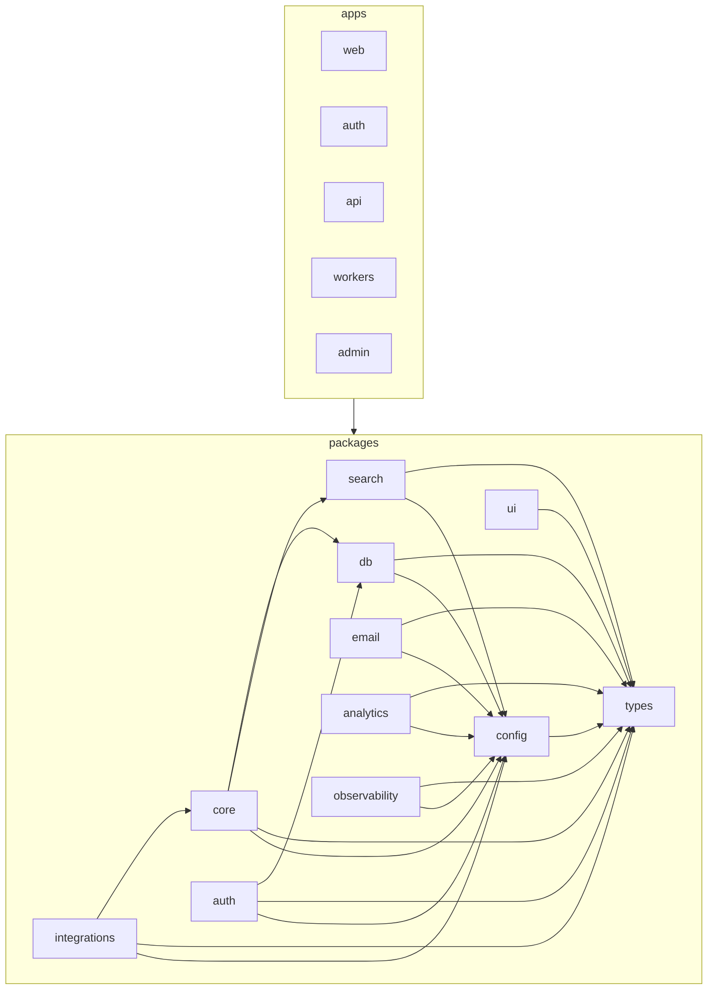

# TruePoint — Architecture Map

> **Status:** `live` · **Generated from:** [`docs/architecture-map.json`](./architecture-map.json)
> (run `node .claude/hooks/gen-architecture-map.mjs` — or `bun run arch:map` — to refresh). **Paths come
> from the JSON (generated); do not edit paths here by hand.** One-line purposes and the Mermaid graph are
> authored here. Maintained by the [`enterprise-architecture`](../.claude/skills/enterprise-architecture/SKILL.md) skill.

> **Live end-to-end — the FULL M0–M5 MVP thin slice + its web UI**, now on the **dashboard-redesign
> foundation (Unit 0)**: a token-driven design system (`packages/ui` `tokens.css` + `primitives.css`), a
> shared **State Kit** (empty/loading/error/`StateSwitch`), an expanded headless UI kit, and a rebuilt
> **AppShell** (auth gate + sidebar + top-bar with global-search/density/shortcuts/notifications/credit
> pill, a ⌘K command palette, and a `lucide-react` nav driven by a single `navConfig`). Backend/contract
> coverage: auth round-trip · M1 import · M3 reveal & credits · M4 enrichment/verification/scoring ·
> **M5 compliance** (DSAR fan-out, consent + global-suppression-on-withdraw, the privileged `leadwolf_admin`
> path, tombstones, public DSAR intake) · **M7–M9** (activity timeline + engagement scoring, Sales-Nav HITL
> capture, the suppression-gated outreach send engine).
> **The web app (`apps/web`)** renders the destinations over a `(shell)` route group: **Prospect** (filter
> rail · masked grid · record slide-over · single + **bulk reveal** with a no-dead-ends money loop · score
> panel), **Home** cockpit (KPI StatTiles + recent reveals/hot-leads/burn-sparkline/imports/enrichment/
> sequence cards + the T3 **quick-actions row, tasks & replies** cards, empty-state-first), **Sequences**
> (builder + enrollment log + send + draft-review/send-status/templates panels), **Reports** (client
> rollups across credit-usage/funnel/data-health/deliverability/intent/lead-score/team-activity), a now-real
> **Inbox** (unified reply **threads** + **tasks**), and a **Settings shell** (nested `SettingsScopeLayout` +
> scope nav over User/Workspace/Tenant/Developer) whose **User** (Profile/Security/Notifications) and
> **Workspace** (General/Members) scopes — joined now by **Tenant** (Organization) and
> **Developer** (API keys / OAuth apps / webhooks / API docs) — are live alongside Billing & Compliance. Import is **async** (API returns `202 + jobId`, the web slice polls; a BullMQ producer
> enqueues the parsed rows).
> **`search` domain (contract-first, now wired through the stack):** query-semantics core (title
> canonicalization + synonym/abbreviation expansion + an engine-agnostic title-filter planner), the
> **`SearchPort` contract** in `@leadwolf/types`, an **in-memory adapter** in `packages/search`, a
> **`/search/*` API** (`searchPortProvider` wires the port), and the **Prospect filter rail + facet
> typeahead** consuming it (OpenSearch/Typesense adapters land behind the same seam — ADR-0035). Auth
> hardening: an Edge-safe **boot self-test** (`instrumentation.ts` → Node-only `bootSelfTest.ts`), typed
> transactional **email templates**, an **infra-vs-credentials** failure classifier, and a client-IP
> **binding** policy.
> **490 source files · 6 domain-vocabulary warnings (`admin`, `settings-shell`, `settings-user`,
> `settings-workspace`, `settings-tenant`, `settings-developer` — see Notes) · 4 unbucketed** (3
> framework-root configs `apps/{auth,web}/next.config.mjs` + `apps/auth/postcss.config.mjs`, plus
> `packages/db/src/repositories/enrichmentJobRepository.ts` — see Notes). `apps/admin` (the staff console app) remains a **target**;
> the `admin` *domain* is the platform-admin **API** + `platformAdmin` middleware. Design:
> [04](./planning/04-ui-ux-design.md), [10-roadmap.md](./planning/10-roadmap.md),
> [11 §6](./planning/11-information-architecture.md), [07 §3](./planning/07-billing-credits.md),
> [08](./planning/08-compliance.md), [29](./planning/29-settings-administration-architecture.md),
> ADR-0006/0007/0008/0009/0013/0016/0035.

## Repo tree (live; `apps/admin` is a target)

```
packages/                       # side-effect-free libraries, each exported via one index.ts  [LIVE]
  types/   src/{errors,auth,contacts,billing,intel,compliance,activity,outreach,home,search}.ts # RFC-9457 errors + Zod contracts (leaf) + SearchPort contract
  config/  src/env.ts           # zod-validated env (ONLY process.env reader); key-material + origin-allowlist tests
  ui/      src/                 # TruePoint design system: tokens.css + primitives.css + theme.css + cn + the headless kit + shadcn-pattern components/ui/*
    components/{StatusBadge,Card,StatTile,Spinner,Avatar,Progress,Pagination,Icon}.tsx  state.tsx (State Kit)
      controls.tsx (Tp* form controls)  form.tsx  Tabs.tsx  overlay.tsx (Dialog/Drawer)  floating.tsx (Popover/DropdownMenu/Tooltip)
      Toast.tsx  DataTable.tsx  Combobox.tsx  ui/{button,input,label,checkbox,radio-group,badge,alert,separator}.tsx
  db/      src/                 # Drizzle schema + RLS + repositories (the ONLY data access)  [LIVE]
    schema/{auth,contacts,billing,intel,compliance,activity,salesnav,outreach}.ts  rls/*.sql (one per schema)
    client.ts(withTenantTx · withPrivilegedTx · closeDb)  applyMigrations.ts  bootstrapAdmin.ts  migrate.ts  seed.ts
    repositories/{user,workspace,account,contact,sourceImport,reveal,credit,suppression,audit,idempotency,
                  score,intentSignal,providerCall,consent,dsar,activity,salesNavLink,sequence,outreachLog}Repository.ts
    test/{import,reveal,intel,compliance,activity,outreach,home,workspaceSwitch,suppressionMgmt,lists,search}.itest.ts + itestDb.ts
  core/    src/                 # domain logic [LIVE]: import · reveal · billing · compliance · enrichment · data-health · scoring · activity · outreach · search · home
  auth/    src/                 # self-built auth primitives (no HTTP): login/mfa/registration/invitations/password/sso/switchWorkspace + ipBinding + log
  search/  src/                 # SearchPort adapters + field projection — inMemorySearchPort (dev/test) now; OpenSearch/Typesense later  [LIVE]
  integrations/ src/enrichment/ # vendor adapters implementing core's enrichment port (httpProvider + apollo/zoominfo/clearbit)  [LIVE]
apps/                           # deployable processes (thin transport adapters)
  api/   src/                   # Hono on Bun — validates the access JWT; never issues tokens  [LIVE]
    middleware/{authn,tenancy,error,rateLimit,idempotency,requireRole,platformAdmin}.ts
    features/{auth,workspaces,import,reveal,billing,enrichment,scoring,compliance,activity,sales-navigator,outreach,home,search,admin}/  app.ts  server.ts
  auth/  src/                   # auth.truepoint.in IdP (Next 15) — screens + /token/* + JWKS + Edge-safe boot self-test  [LIVE]
    instrumentation.ts  bootSelfTest.ts  middleware.ts  app/*  lib/{…,authFailure,emails/*}  shared/*
  web/   src/                   # app.truepoint.in (Next 15) — the AppShell over a (shell) route group  [LIVE]
    app/(shell)/{home,prospect,sequences,inbox,reports,settings/*}  app/{page,import,auth/callback}
    components/{shell/, PageHeader}  features/{import,prospect,home,sequences,inbox,reports,sales-navigator,enrichment-jobs,settings-*}/
    lib/{authClient,pkce,publicConfig}
  workers/ src/                 # Bun + BullMQ — imports · enrichment · scoring · dsar · outreach queues + health/logger  [LIVE]
    index.ts  register.ts  health.ts  logger.ts  queues/{imports,enrichment,scoring,dsar,outreach}.ts
  admin/                        # internal staff console                                          [TARGET]
```

## FEATURE → FILES index (live)

### import — *M1 + async job contract* ([05 §3](./planning/05-features-modules.md), [10 M1](./planning/10-roadmap.md))
- **core (pipeline + primitives):** `packages/core/src/import/` — `runImport.ts` (parse→map→normalize→dedup-
  upsert→provenance), `parseFile.ts` (RFC-4180 CSV; XLSX seam), `columnMap.ts`, `normalize.ts`,
  `blindIndex.ts` (HMAC dedup key), `encryptPii.ts` (AES-GCM, KMS-swappable), `contentHash.ts`; unit tests
  (`normalize`/`parseFile`/`dedupHelpers`)
- **db:** `packages/db/src/repositories/sourceImportRepository.ts` (per-import provenance + content-hash skip)
- **api:** `apps/api/src/features/import/` — `routes.ts` (POST `/api/v1/imports` → `202` + `jobId`; GET
  `/imports/:jobId` status), `queue.ts` (BullMQ producer: parse on the API, enqueue `RunImportInput`)
- **workers:** `apps/workers/src/queues/imports.ts` (the `imports` processor → same `runImport`)
- **web:** `apps/web/src/features/import/` — `ImportWizard`/`ContactsTable`/`ImportPage`, hooks
  (`useImport`/`useContacts`), `importJob.ts` (pure view-model mapping poll results → a discriminated UI
  state so the component never crashes on a job-ref shape), `api.ts`, `types.ts` → route `app/import/page.tsx`

### reveal — *M1 masked reads + M3 money loop* ([05 §7](./planning/05-features-modules.md), [07 §3](./planning/07-billing-credits.md), ADR-0007)
- **core:** `packages/core/src/reveal/revealContact.ts` — THE monetized transaction (07 §3): in-tx
  suppression gate → idempotent claim (`ON CONFLICT DO NOTHING` on unique `(workspace, contact, reveal_type)`)
  → `FOR UPDATE` charge against `tenants.reveal_credit_balance` → same-tx audit; free re-reveal of an owned
  copy; config-injected `revealCostFor`
- **api:** `apps/api/src/features/reveal/{routes,index}.ts` (GET `/contacts` masked list; POST
  `/contacts/:id/reveal` behind the Idempotency-Key replay middleware)
- **db:** `packages/db/src/repositories/{account,contact}Repository.ts` (overlay reads/writes, masked list);
  `revealRepository.ts` (contact-for-reveal + idempotent claim + usage list)

### billing — *M3 credits + Stripe* ([07 §2/§4](./planning/07-billing-credits.md))
- **core:** `packages/core/src/billing/stripeWebhook.ts` (HMAC verify + `signStripePayload` test helper +
  `parseCreditGrantEvent`; `*.test.ts`), `grantFromStripe.ts` (grant exactly once per `stripe_event_id`)
- **api:** `apps/api/src/features/billing/{routes,index}.ts` — POST `/billing/webhook` (signature-verified,
  the ONLY credit-grant path) + GET `/credits/{balance,usage}`
- **db:** `creditRepository.ts` (lock/decrement/read the tenant counter + `grantFromEvent`),
  `idempotencyRepository.ts` (stored-response replay for money endpoints)

### compliance — *M3 gate + audit; M5 DSAR/consent* ([08](./planning/08-compliance.md))
- **core:** `packages/core/src/compliance/` — `assertNotSuppressed.ts` (the unbypassable in-tx DNC gate),
  `writeAudit.ts` (same-tx append; closed enum), `dsarIntake.ts` (public intake: encrypted subject email +
  blind index), `deleteFanout.ts` (08 §4.2 erase-everywhere: tombstone every copy → purge dependents →
  GLOBAL suppression → per-copy audit → verification scan gates `completed`; idempotent),
  `assembleAccessReport.ts` (08 §4.1 enumeration), `consent.ts` (record + withdraw → auto global suppression)
- **db:** `suppressionRepository.ts`, `auditRepository.ts` (append-only), `consentRepository.ts`,
  `dsarRepository.ts` (+ the PRIVILEGED cross-workspace queries); `client.ts` adds **`withPrivilegedTx`**
  (`SET LOCAL ROLE leadwolf_admin`, BYPASSRLS — the one sanctioned cross-workspace path, 03 §9/ADR-0011)
- **api:** `apps/api/src/features/compliance/*` — public POST `/compliance/dsar` (session-less) +
  suppression/consent endpoints · **workers:** `apps/workers/src/queues/dsar.ts` (privileged, VERIFIED only)

### enrichment — *M4 provider waterfall* ([06](./planning/06-enrichment-engine.md))
- **core:** `packages/core/src/enrichment/` — `providerPort.ts` (the 06 §3 contract; core OWNS the port),
  `waterfall.ts` (trust÷cost ordering + per-provider breaker; `*.test.ts`) + `waterfallBulk.test.ts` (bulk
  path), `requestHash.ts`, `enrichContact.ts` (cache-first → budget breaker → waterfall → overlay upsert +
  provenance + cost row, one tx)
- **core (match engine — Wave 2 entity resolution, ADR-0015/0021):** `matchPort.ts` (the match contract),
  `matchKeys.ts` (deterministic match keys; `*.test.ts`), `masterGraphMatcher.ts` (global master-graph
  match), `overlayMatcher.ts` (per-workspace overlay match; `*.test.ts`), `estimate.ts` (bulk match/enrich
  cost estimate; `*.test.ts`)
- **integrations:** `packages/integrations/src/enrichment/{httpProvider,providers}.ts` — Apollo/ZoomInfo/
  Clearbit VendorSpecs over one HTTP shape; injectable `fetchJson` → contract tests, zero live spend
- **db:** `providerCallRepository.ts` (cache lookup + cost ledger + daily-spend sum); `enrichmentJobRepository.ts`
  (bulk-enrichment job rows — **currently `unassigned[]`: `enrichment_job` not in `REPO_DOMAIN` yet**, see Notes)
  · **api:** `apps/api/src/features/enrichment/*` (POST `/enrichment/:entity/:id`) · **workers:** `queues/enrichment.ts`

### data-health — *M4 verification* ([06 §9](./planning/06-enrichment-engine.md), ADR-0013)
- **core:** `packages/core/src/data-health/` — `emailVerifier.ts` (dedicated-verifier port; passThrough +
  static fixture verifier), `chargeFor.ts` (the ADR-0013 charge-by-verified-result mapping; `*.test.ts`),
  `validatePhone.ts` (E.164 sanity)

### scoring — *M4 model + M8 engagement* ([ADR-0008](./planning/decisions/ADR-0008-lead-scoring-model.md))
- **core:** `packages/core/src/scoring/computeScore.ts` (rule-based v1: ICP fit + intent + the M8 engagement
  component; appends a versioned `scores` row; the DB trigger syncs `contacts.priority_score`)
- **db:** `{score,intentSignal}Repository.ts` · **api:** `apps/api/src/features/scoring/*` (GET
  `/contacts/:id/scores`, POST `/contacts/:id/rescore`) · **workers:** `queues/scoring.ts`

### activity — *M8 timeline* ([05 §10](./planning/05-features-modules.md), [03 §7](./planning/03-database-design.md))
- **core:** `packages/core/src/activity/logActivity.ts` (tombstone-aware contact check + append, one tx)
- **db:** `activityRepository.ts` (newest-first timeline + `recentCountsForContact` feeding M8 engagement);
  `schema/activity.ts` + `rls/activity.sql` carry the **`activities_sync_last_activity` trigger**
- **api:** `apps/api/src/features/activity/{routes,index}.ts` — GET/POST `/contacts/:id/activities`

### sales-navigator — *M7 link capture (HITL)* ([05 §5](./planning/05-features-modules.md), ADR-0009)
- **db:** `salesNavLinkRepository.ts`; `schema/salesnav.ts` dedups on (workspace_id, url)
- **api:** `apps/api/src/features/sales-navigator/{routes,index}.ts` — POST/GET `/sales-navigator/links`.
  A human pastes the link; nothing is automated against LinkedIn (assisted capture only).

### outreach — *M9 sequences + the suppression-gated send engine* ([05 §13](./planning/05-features-modules.md), [08 §3/§6](./planning/08-compliance.md), ADR-0009/0013)
- **core:** `packages/core/src/outreach/` — `createSequence.ts` (+ addStep; audits), `enrollContact.ts`
  (revealed-only + **`assertNotSuppressed` in-tx** + idempotent (sequence, contact) + audit), `sendStep.ts`
  (**the compliance-critical send tx**: CAN-SPAM identity BLOCKED-not-warned, suppression re-checked in-tx,
  postal-address + unsubscribe footer auto-appended, audit), `handleBounce.ts` (replay-idempotent: log
  `bounced` + auto-suppression + the **ADR-0013 credit-back**), `senderPort.ts` (`EmailSenderPort`: dev
  `consoleSender` + test `staticSender`; the M12 SES adapter swaps the port without touching the send tx)
- **db:** `{sequence,outreachLog}Repository.ts`; `schema/outreach.ts` (`outreach_sequences` →
  `outreach_steps` → `outreach_log`; unique (sequence_id, contact_id) IS the enrollment-idempotency key)
- **api:** `apps/api/src/features/outreach/{routes,index}.ts` — `/outreach/sequences*` CRUD/enroll/log +
  `/log/:id/send` + `/log/:id/bounce` · **workers:** `queues/outreach.ts` (one step-delivery per job)

### search — *query-semantics core + SearchPort contract + `/search/*` API + Prospect rail* ([05](./planning/05-features-modules.md), [24](./planning/24-advanced-search-exploration-ux.md), ADR-0035)
- **core:** `packages/core/src/search/` — `normalizeTitle.ts` (freetext → stable comparison key:
  lowercase/strip/abbrev-expand so "CEO" ≡ "Chief Executive Officer"), `canonicalizeTitle.ts` (resolve a
  raw title to a canonical occupation, index- and query-time), `expandQuery.ts` (a typed title term →
  its synonym set so every spelling matches), `titleTaxonomy.ts` (curated seed taxonomy: canonical titles +
  seniority + function + aliases; production backfilled from O*NET-SOC/ESCO), `planTitleFilter.ts` (selected/
  typed filter values → an **engine-agnostic match plan** adapters execute without business logic);
  `{canonicalizeTitle,expandQuery,planTitleFilter}.test.ts`
- **search (package):** `packages/search/src/` — `fields.ts` (project contact rows onto searchable facets
  with canonical title normalization), `inMemorySearchPort.ts` (the dev/test adapter proving the contract
  end-to-end: term filters, free-text, suggest, facet counts, keyset paging; `*.test.ts`), `index.ts` (the
  adapter/types seam — OpenSearch global + Typesense overlay land here later, ADR-0002)
- **types:** `packages/types/src/search.ts` — the **`SearchPort` contract** + query/result Zod schemas
  (`FacetKey`, `ContactQuery`, `FilterClause`, `SuggestQuery`, `Suggestion`, `FacetCount`, `ExpandedTerm`)
- **api:** `apps/api/src/features/search/` — `routes.ts` (`GET /search/contacts`, `/search/suggest`,
  `/search/facets`), `searchPortProvider.ts` (composition seam: wires the active SearchPort — the in-memory
  adapter today), `index.ts`
- **web (Prospect rail):** `apps/web/src/features/prospect/` — `searchApi.ts` (typed calls to `/search/*`),
  `FilterRail.tsx` (the facet filter rail), `FacetTypeahead.tsx` (per-facet search-as-you-type), hooks
  `useContactSearch.ts` (run a `ContactQuery`) + `useTypeahead.ts` (debounced suggest). *`navConfig` still
  reserves a standalone **Search** destination; for now search powers the Prospect rail.*

### auth — *M2, global identity* ([05 §1](./planning/05-features-modules.md), [17](./planning/17-authentication.md), ADR-0019/0020)
- **api:** `apps/api/src/features/auth/{routes,index}.ts` (GET `/auth/session` incl. the live workspace
  **role**); RBAC primitives `apps/api/src/middleware/{requireRole,requireOrgRole,requireStaffRole,platformAdmin}.ts`
  — the workspace / org (ADR-0030) / platform-staff (ADR-0011) role tiers + the `pa` gate (+ roleGuards tests)
- **db:** `userRepository.ts` (global users + sessions + email-verification codes); `workspaceRepository.ts`
- **shared primitives:** `packages/auth/*` — login (`identifierLookup`/`login`/`loginTransaction`/`flow` +
  `scopeGuard` — authorizes the client-supplied org/workspace against real memberships before minting the JWT),
  `botCheck`/`rateLimit`/`policy` anti-abuse, **registration** (`registration`/`emailVerification`/
  `signupTransaction`), **invitations**, **password + magic-link** (`password`/`passwordReset`/`refresh`),
  **SSO** (`sso/{types,providers,mockIdp,jit}` + `ssoTransaction`), **workspace + org switch**
  (`switchWorkspace`/`switchOrg`), **session hardening** (`revocation` access-token deny-list +
  `findActiveSessionOrDetectReuse` refresh-reuse detection; ADR-0040), plus **`ipBinding.ts`** (client-IP
  binding policy strict/prefix/off; IPv6-zone/IPv4-mapped aware) and **`log.ts`** (structured JSON-line
  logger, no PII)
- **IdP origin:** `apps/auth/*` — screens (sign-in identifier→password→mfa→org→workspace, signup+verify,
  SSO oidc/saml + mock IdP, forgot/reset/magic; a `redirectIfAuthenticated` guard bounces signed-in visitors
  off the auth screens) + `/token/*` + `/logout` + `/workspace/switch` + `/org/switch` + `/orgs` + JWKS;
  **`instrumentation.ts`** (Next boot hook) conditionally loads Node-only **`bootSelfTest.ts`** (JWT
  signing-key self-test, gated by `NEXT_RUNTIME` to keep ioredis out of the Edge bundle); `lib/authFailure.ts`
  (distinguishes uniform "credentials" rejections from "infra" outages); `lib/emails/*` (typed transactional
  templates — `magicLink`/`passwordReset`/`verificationCode` over a shared branded `layout`);
  `shared/SubmitButton.tsx` (progressive-enhancement submit: pending spinner with JS, native fallback)
- **app-domain:** `apps/web` callback + in-memory token client (`authClient` + `logout()` + `switchWorkspace()`)

### workspaces — *M2* ([05 §2](./planning/05-features-modules.md))
- **api:** `apps/api/src/features/workspaces/{routes,index}.ts` — `GET /workspaces` lists the user's
  workspaces (`{id,name,role}`) for the switcher
- **db:** `workspaceRepository.ts` — RLS-scoped workspaces (+ `getRoleForUser`) + tenant-membership/domain/
  invitation repos + new-org provisioning (`tenant_members`, ADR-0019/0020)

### admin — *platform-admin API (staff/cross-tenant ops)*
- **api:** `apps/api/src/features/admin/{routes,index}.ts` — the platform-admin endpoints, guarded by
  `apps/api/src/middleware/platformAdmin.ts` (privileged staff gate; `*.test.ts`). The **`apps/admin`
  console app remains a target** — this domain is the API surface only. *Folder slug `admin` is not yet in
  `CANONICAL_DOMAINS` — see Notes.*

### Web UI surfaces ([04](./planning/04-ui-ux-design.md), [11](./planning/11-information-architecture.md))
The `apps/web` SPA wraps every destination in the **AppShell** (auth gate + sidebar + top bar) over a
`(shell)` route group. Slices follow the standard pattern (`api.ts` → `fetchWithAuth`; hooks; components;
`index.ts`). Styling: the `--tp-*` token system + `packages/ui` `primitives.css` + the headless kit.
- **shell** (shared): `apps/web/src/components/shell/` — `AppShell.tsx` (auth gate: silent token refresh →
  PKCE redirect if unsigned → composes sidebar+topbar+children; mounts the command palette, shortcuts
  dialog, toasts, density), `Sidebar.tsx` (lucide nav from `navConfig` + Settings pinned + team/workspace/
  user controls), `Logo.tsx` (the Brand-Kit lockup: the three-chevron mark with the Cobalt apex + the
  `True`/`Point` weight-shift wordmark, plus a reversed dark-surface variant; used by the Sidebar brand row
  and the AppShell loading/error states), `TopBar.tsx` (section title + global-search trigger + density toggle + shortcuts +
  notifications bell + credit pill), `navConfig.ts` (**single source of truth**: the destinations Home/
  Prospect/**Search**/Sequences/Inbox/Reports + the pinned Settings + the 4-scope settings sub-nav,
  consumed by rail/title/palette/settings layout), `DensityProvider.tsx` (comfortable⇄compact via a
  `data-density` attribute + localStorage), `CommandPalette.tsx` (⌘/Ctrl-K cmdk: navigate + quick actions +
  a `command:switch-workspace` event + logout), `GlobalSearch.tsx` (top-bar button dispatching
  `command:open`), `ShortcutsDialog.tsx` (the `?`/`command:shortcuts` help modal, built on `@leadwolf/ui`
  `Dialog`), `TeamSwitcher.tsx` (M15 seam; localStorage + `team:changed`, renders nothing if no teams),
  `CreditPill.tsx` (balance link to Billing; amber dot < 20; re-fetches on `credits:changed`),
  `NotificationsBell.tsx` + `useNotifications.ts` (client-DERIVED feed — low credits / recent imports /
  replies from `/home/summary` + balance; no notifications backend), `WorkspaceSwitcher.tsx` (lists
  `/workspaces`, switches via the auth origin), `OrgSwitcher.tsx` (multi-org users only; lists the auth
  origin's `/orgs`, switches via `/org/switch`)
- **prospect** (web): `apps/web/src/features/prospect/*` — masked grid + `RecordDetail` slide-over +
  `RevealDialog` (single reveal); **bulk reveal**: `useBulkSelection` (id-keyed selection that survives
  re-filtering), `BulkActionBar` (sticky count + live balance + reveal/add-to-list/clear), `BulkRevealDialog`
  + `useBulkReveal` (runs the pure `bulkReveal.ts` policy: reveal each id, sum server-reported credits,
  **stop on 402 / skip 403**, fire one `credits:changed` at the end), `useCreditBalance` (synced via
  `credits:changed`); **search filter rail**: `FilterRail` + `FacetTypeahead` (search-as-you-type per facet)
  over `searchApi.ts` (`/search/*`), hooks `useContactSearch` + `useTypeahead` (debounced suggest); routed at
  `(shell)/prospect`
- **home** (web + api + core): `apps/web/src/features/home/*` — cockpit over a single `GET /home/summary`,
  rendering KPI `StatTile`s + co-located cards (recent reveals, hot leads, credit-**burn** sparkline, recent
  imports, enrichment activity, sequence snapshot, activity feed) + the **T3** `QuickActionsRow` (deep-links
  to Prospect/Import/Sequences), `TasksCard` (today's tasks — empty-state-first), `RepliesCard` (recent
  inbound replies, PII-safe: ids/channel/repliedAt only), all wrapped in the shared `WidgetCard`. Endpoint
  `apps/api/src/features/home/{routes,index}.ts` (guarded by `authn`+`tenancy`+`requireRole`), composed by
  `packages/core/src/home/buildHomeSummary.ts` (fan-out over domain repos in `withTenantTx`); shared
  `homeSummarySchema` in `@leadwolf/types`. Routed at `(shell)/home` (`/` redirects to `/prospect`).
- **sequences** (web): `apps/web/src/features/sequences/*` — list + two-phase builder (CAN-SPAM identity up
  front) + enrollment panel (log table + send-next-step with the verbatim 422 CAN-SPAM message + quiet
  `suppressed` notices) + revealed-only enroll picker; plus `DraftReviewPanel` (review queued drafts before
  send, via `useDrafts`), `SendStatusDashboard` (per-step delivery status), and `TemplatesPanel` (reusable
  step templates, via `useTemplates`); `(shell)/sequences`
- **reports** (web): `apps/web/src/features/reports/*` — client-side `rollups.ts` over `/credits/*` +
  `/contacts`: `CreditUsageSection` (tiles + 14-day bars), outreach `FunnelSection`, `DataHealthSection`,
  plus `DeliverabilitySection`, `IntentSection`, `LeadScoreSection`, `TeamActivitySection`; `(shell)/reports`
- **inbox** (web): `apps/web/src/features/inbox/*` — the unified replies + tasks surface: `ThreadList`
  (reply threads) + `ThreadView` (a thread) over `useInbox`/`api.ts`, `TasksPanel` over `useTasks`,
  `InboxPage` composes them; `format.ts` + `types.ts`; `(shell)/inbox`
- **settings shell** (web): `apps/web/src/features/settings-shell/*` — `SettingsScopeLayout` (two-column:
  scope nav left, panel right) wraps all `/settings/*` routes via `app/(shell)/settings/layout.tsx`;
  `SettingsNav` (User/Workspace/Tenant/Developer scopes from `navConfig.SETTINGS_NAV`), `SettingsPlaceholder`.
  **Live scopes** (the route pages now render real panels):
  - **settings-user** (`features/settings-user/*`, User scope) — `ProfilePanel` (via `useProfile`),
    `SecurityPanel`, `NotificationsPanel` (via `useNotificationPrefs`) over `api.ts`; `options.ts` + `types.ts`;
    routes `/settings/{profile,security,notifications}`.
  - **settings-workspace** (`features/settings-workspace/*`, Workspace scope) — `WorkspaceGeneralPanel` (via
    `useWorkspace`) + `MembersPanel` (via `useMembers`) over `api.ts`; routes `/settings/{workspace,members}`.
  - **settings-billing** (`/settings/billing` — balance + `UsageTable`) and **settings-compliance**
    (`/settings/compliance` — `SuppressionForm` + `SuppressionList` + public `DsarForm`).
  - **settings-tenant** (`features/settings-tenant/*`, Tenant scope) — `OrganizationPanel` (via
    `useOrganization`) over `api.ts`; route `/settings/organization`. **Now live** (was a placeholder).
  - **settings-developer** (`features/settings-developer/*`, Developer scope) — `ApiKeysPanel`/`OAuthAppsPanel`/
    `WebhooksPanel`/`ApiDocsPanel` (via `useApiKeys`/`useOAuthApps`/`useWebhooks`) over `api.ts`; route
    `/settings/api-keys`. **Now live** (was a placeholder).
  *Folder slugs `settings-shell`, `settings-user`, `settings-workspace`, `settings-tenant`, `settings-developer`
  are not yet in `CANONICAL_DOMAINS` — see Notes.*
- **`@leadwolf/ui` kit:** see the [Shared / platform areas](#shared--platform-areas-live) section below.

_Remaining domains (`lists`, `crm-sync`, `export`, `api-public`, `ai`, `alerts`, `templates`,
`notifications`, `data-health` UI, …) have **no code yet**; targets in
[05](./planning/05-features-modules.md) + [11 §6](./planning/11-information-architecture.md)._

## Destinations cross-reference (web destinations → domains; + the auth origin)

> From [11 §6](./planning/11-information-architecture.md) + the implemented `navConfig`. The masked contacts
> list + import wizard surface under **Prospect**; auth surfaces on the dedicated origin and inside Settings.

| Destination | Surfaces domains | API | Route |
|---|---|---|---|
| **Home** | home, notifications | `/home/summary` | `(shell)/home` |
| **Prospect** | **reveal**, **import**, **search**, lists, enrichment, scoring | `/imports`, `/contacts`, `/contacts/:id/reveal`, `/search/*` | `(shell)/prospect` |
| **Search** | search | `/search/{contacts,suggest,facets}` *(powers the Prospect rail; standalone surface reserved)* | *reserved in navConfig* |
| **Sequences** | outreach, templates | `/outreach/*` | `(shell)/sequences` |
| **Inbox** | inbox | `/inbox`, `/tasks` | `(shell)/inbox` |
| **Reports** | reports, data-health | `/credits/*`, `/contacts` | `(shell)/reports` |
| **Settings** | admin-settings, billing, compliance, api-public, **auth** | `/settings/*`, `/credits/*`, `/compliance/*` | `(shell)/settings/*` (4 scopes) |
| **(auth origin)** | auth | `auth.truepoint.in/login · /password · /magic · /signup · /verify · /sso{,/oidc,/saml}/callback · /org · /workspace/switch · /token/* · /.well-known/jwks.json` | — |

## DEPENDENCY section (which packages depend on which)

From [`architecture-map.json`](./architecture-map.json) `dependencies` (the allowed graph, [16 §5](./planning/16-code-organization.md)):

- `types` — leaf. **`config`** → `types`. `ui` → `types`. `db` → `types`, `config`.
- **`search`** → `types`, `config` *(now live: query-semantics core + the in-memory SearchPort adapter)*.
- **`core`** → `db`, **`search`**, `types`, `config` *(declares ports — enrichment/sender/SearchPort — never
  imports `integrations`)*. `auth` → `db`, `types`, `config`. `integrations` → `core`, `types`, `config`.
- **`apps/api`** → `core`, `db`, `auth`, `search`, `config`, `types` (+ `hono`). **`apps/workers`** →
  `core`, `config`, `types` (+ `bullmq`/`ioredis`). **`apps/web`** → `types`, `ui` (+ `next`/`react`;
  talks to the api over HTTP, never via imports). `apps/*` → any `packages/*`; **never** another app.

Enforced by `dependency-cruiser` ([`.dependency-cruiser.cjs`](../.dependency-cruiser.cjs); `bun run lint:boundaries`).
Imports go only through each package's `index.ts` (no deep imports). The Mermaid graph only *visualizes* this.

## Allowed module-dependency graph



## Shared / platform areas (live)

- **`packages/types`** — `errors.ts` (RFC-9457 + `ImportValidationError`/`InsufficientCreditsError`/
  `SuppressedError`), `auth.ts`, `contacts.ts` (+ `*.test.ts`), `billing.ts` (`revealType`, suppression
  scopes, the **closed `auditAction` enum**; `*.test.ts`), `activity.ts`, `outreach.ts`, `home.ts`
  (`homeSummarySchema` + the T3 todaysTasks/recentReplies), **`search.ts`** (the SearchPort contract +
  query/result schemas), `index.ts`, and `auditCoverage.test.ts` (the closed-enum **drift guard**).
- **`packages/config`** — `env.ts` (the only `process.env` reader), `index.ts`, and the
  `keyMaterial`/`originAllowlist`/`originConsistency` tests (JWT key material + CORS origin invariants).
- **`packages/ui`** — the TruePoint **design system**: `tokens.css` (the `--tp-*` palette/spacing/z-scale),
  `primitives.css` (the `.tp-ui-*` stylesheet for the headless kit), `theme.css` (Tailwind v4 theme), `cn.ts`.
  Primitives, all exported from `src/index.ts`:
  - *Dashboard surface:* `StatusBadge`, `Card`, `StatTile`, `Spinner`, `Avatar` (grey-initials), `Progress`,
    `Pagination` (cursor pager), `Icon` (lucide wrapper).
  - *State Kit* (`state.tsx`): `Skeleton`, `LoadingState`, `EmptyState`, `ErrorState`, `StateSwitch` (the
    declarative error→loading→empty→children ladder — the redesign's consistency fix).
  - *Form controls* (`controls.tsx`, Tp-prefixed, token + native): `TpButton`/`TpIconButton`/`TpInput`/
    `TpTextarea`/`TpSelect`/`TpCheckbox`/`TpSwitch`/`TpChip`. *Form scaffolding* (`form.tsx`): `FormSection`/
    `FieldGroup`/`FormRow`.
  - *Navigation:* `Tabs` + `SegmentedControl`. *Overlays* (`overlay.tsx`): `Dialog` (centered modal, Esc +
    backdrop close, scroll lock, optional `maxWidth`) + `Drawer` (edge slide-over). *Floating* (`floating.tsx`):
    `Popover` + `DropdownMenu` + `Tooltip` (dependency-free CSS anchoring). *Feedback:* `Toast`
    (`ToastProvider`/`useToast`). *Data display:* `DataTable` (typed columns + client sort) + `Combobox`.
  - *shadcn-pattern* (`components/ui/*`, Tailwind v4, no-JS friendly — used by the auth screens):
    `button`/`input`/`label`/`checkbox`/`radio-group`/`badge`/`alert`/`separator`.
- **`packages/db`** — `client.ts` (`withTenantTx`/`withPrivilegedTx`/`closeDb`), `applyMigrations.ts`
  (bootstrap → drizzle → RLS), `bootstrapAdmin.ts`, `migrate.ts`, `seed.ts`, `schema/{auth,contacts,billing,
  intel,compliance,activity,salesnav,outreach,savedSearches,lists}.ts` (`lists`/`list_members` = static
  prospect lists for bulk add-to-list; `contacts.owner_user_id` = the soft owner for the Prospect search) +
  `schema/index.ts`, `drizzle.config.ts`, `index.ts`, and
  `test/` — `itestDb.ts` (Testcontainers **or** `ITEST_DATABASE_URL`) + the DoD suites
  `{import,reveal,intel,compliance,activity,outreach,home,workspaceSwitch,suppressionMgmt,lists,search}.itest.ts` (run in
  **separate** processes — the db client is a module singleton). RLS in `src/rls/*.sql` (one per schema,
  applied sorted) uses the `NULLIF(current_setting(…, true), '')::uuid` **fail-closed** idiom; triggers:
  reveal-ownership + audit-append (`billing.sql`), `last_activity_at` sync (`activity.sql`), sequences
  `updated_at` (`outreach.sql`).
- **`packages/core`** — `index.ts` is the public surface (import pipeline, `revealContact`,
  `assertNotSuppressed`/`writeAudit`, `grantFromStripe` + stripe helpers, enrichment, `computeScore`,
  `logActivity`, the outreach engine + sender port, the **search** query-semantics, `buildHomeSummary`);
  domain code bucketed per feature above.
- **`packages/auth`** — the self-built auth primitives + `ipBinding`/`log` + `index.ts`.
- **`packages/search`** — `index.ts` (the SearchPort adapter/types seam), `inMemorySearchPort.ts` (dev/test),
  `fields.ts` (facet projection). *Only the in-memory adapter exists so far.*
- **`packages/integrations`** — `enrichment/{httpProvider,providers}.ts` (+ contract test) + `index.ts`.
- **`apps/api`** — `app.ts`, `server.ts`; **`apps/api/middleware`** — `authn`, `tenancy`, `error`,
  `rateLimit`, `idempotency` (Idempotency-Key replay; the DB uniques remain the real double-charge guard),
  `requireRole` (RBAC; `*.test.ts`), `platformAdmin` (privileged staff gate; `*.test.ts`).
- **`apps/auth`** — `instrumentation.ts` + `bootSelfTest.ts` (Edge-safe boot self-test) + `middleware.ts` +
  `app/` screens/token endpoints + `shared/` (AuthShell/BrandLockup/OtpInput/SubmitButton/TurnstileWidget) +
  `lib/` (cookies, cors, mailer, `authFailure`, `completeMagic`/`completeSso`, `emails/*`, …).
- **`apps/web/app`** — `(shell)/layout` (mounts AppShell) + the destination pages + `settings/layout` + the
  8 settings routes; `page`, `import/page`, `auth/callback`. **`apps/web/components/shell`** — the shell
  chrome (see Web UI surfaces). **`apps/web/lib`** — `authClient` (+ `*.test.ts`), `pkce`, `publicConfig`.
- **`apps/workers`** — `index.ts` (entry + graceful drain), `register.ts` (composition root + the
  `enqueueImport`/`enqueueEnrichment`/`enqueueScoring`/`enqueueDsar`/`enqueueOutreach` producers),
  `health.ts` + `logger.ts` (+ tests); each queue processor is bucketed to its feature. Queue itests live in
  `apps/workers/test/imports.{queue,resilience}.itest.ts`.

## Notes / unbucketed & warnings

- **Framework-root files (3, in `unassigned[]`):** `apps/web/next.config.mjs`, `apps/auth/next.config.mjs`,
  `apps/auth/postcss.config.mjs`. These are **framework-mandated app-root files** (the Next configs
  transpile the workspace packages; `postcss.config.mjs` wires the Tailwind v4 pipeline) — none can live
  under `apps/<app>/src/`, and the generator only classifies files under `src/`. A **framework constraint,
  not a placement error** — documented here per the repo's map-hygiene rule (we don't special-case the
  generator for them).
- **Domain-vocabulary warnings (6):** the folder slugs **`admin`** (`apps/api/src/features/admin/`) and the
  five Settings scopes **`settings-shell`**, **`settings-user`**, **`settings-workspace`**, **`settings-tenant`**,
  **`settings-developer`** (under `apps/web/src/features/`) are bucketed correctly but are **not yet in
  `CANONICAL_DOMAINS`** (`lib/arch-map.mjs`). All are real, intentional features (the `settings-*` family are the
  Settings scope slices). Reconcile by either adding the slugs to the canonical list (the same way
  `settings-billing`/`settings-compliance` were declared — a [`plan-weaver`](../.claude/skills/plan-weaver/SKILL.md)
  + generator change) or renaming the folders. Left as flagged warnings (the established handling for the
  pre-existing `admin` warning), not papered over — the `settings-*` slices are a consistent destination-keyed
  family worth declaring together.
- **Unmapped repository (1, in `unassigned[]`):** `packages/db/src/repositories/enrichmentJobRepository.ts`
  — a repository whose entity (`enrichment_job`) isn't in `REPO_DOMAIN` (`lib/arch-map.mjs`), so it can't be
  bucketed to a domain. It belongs to **enrichment**; reconcile by adding `enrichment_job → enrichment` to
  `REPO_DOMAIN` (the spec-sanctioned way to extend the declared maps as the schema grows). Flagged, not papered over.
