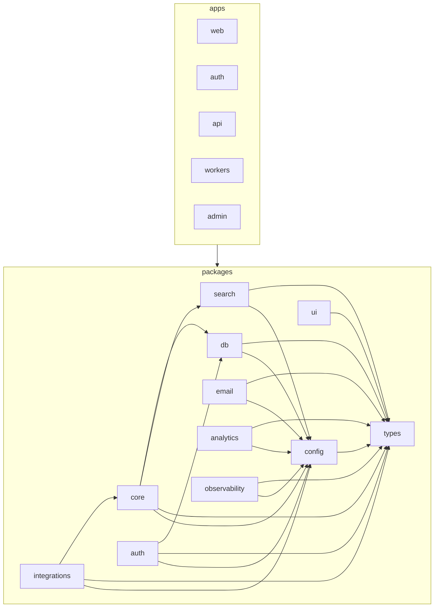

# LeadWolf — Architecture Map

> **Status:** `live` · **Generated from:** [`docs/architecture-map.json`](./architecture-map.json)
> (run `node .claude/hooks/gen-architecture-map.mjs` — or `bun run arch:map` — to refresh). **Paths come
> from the JSON (generated); do not edit paths here by hand.** One-line purposes and the Mermaid graph are
> authored here. Maintained by the [`enterprise-architecture`](../.claude/skills/enterprise-architecture/SKILL.md) skill.

> **Live end-to-end — auth round-trip + the M1 import vertical.** 101 source files, 0 warnings, 2
> framework-root files unbucketed (`apps/{auth,web}/next.config.mjs` — see Notes). **M2 auth** threads
> password → MFA → workspace and mints/validates the access JWT. **M1 Import & Contacts Core** now lands a
> full vertical: a per-workspace CSV import dedupes contacts/accounts (encrypted PII + blind index) with
> `source_imports` provenance, behind RLS, surfaced by a masked contacts list + import wizard. `apps/admin`
> remains a **target**. Design: [10-roadmap.md](./planning/10-roadmap.md) M1,
> [14-phase-1-execution.md §3.2](./planning/14-phase-1-execution.md), [03 §5](./planning/03-database-design.md), ADR-0006.

## Repo tree (live; `apps/admin` is a target)

```
packages/                       # side-effect-free libraries, each exported via one index.ts  [LIVE]
  types/   src/{errors,auth,contacts}.ts # RFC-9457 errors + auth/contacts Zod contracts (leaf)
  config/  src/env.ts           # zod-validated env (the ONLY process.env reader; BLIND_INDEX_KEY lives here)
  ui/      src/{tokens.css,cn}  # TruePoint tokens + class helper
  db/      src/                 # Drizzle schema + RLS + repositories (the ONLY data access)  [LIVE]
    schema/{auth,contacts}.ts  rls/{auth,contacts}.sql  client.ts(withTenantTx)
    applyMigrations.ts migrate.ts seed.ts  repositories/{user,workspace,account,contact,sourceImport}Repository.ts
    test/import.itest.ts        # Testcontainers DoD proof (dedup + isolation)
  core/    src/import/          # domain logic: the import pipeline + dedup/PII primitives             [LIVE]
    runImport · parseFile · columnMap · normalize · blindIndex · encryptPii · contentHash
  auth/    src/                 # self-built auth primitives (no HTTP)
apps/                           # deployable processes (thin transport adapters)
  api/   src/                   # Hono on Bun — validates the access JWT; never issues tokens  [LIVE]
    middleware/{authn,tenancy,error}.ts  features/{auth,import,reveal}/  app.ts  server.ts
  auth/  src/                   # auth.truepoint.in IdP (Next 15) — screens + /token/* + JWKS  [LIVE]
  web/   src/                   # app.truepoint.in (Next 15) — /auth/callback + the import wizard  [LIVE]
    app/{page,import,auth/callback}  features/import/  lib/{authClient,pkce,publicConfig}
  workers/ src/                 # Bun + BullMQ — the imports queue calls core.runImport            [LIVE]
    index.ts  register.ts  queues/imports.ts
  admin/                        # internal staff console                                          [TARGET]
```

## FEATURE → FILES index (live)

### import — *M1, load-bearing* ([05 §3](./planning/05-features-modules.md), [10 M1](./planning/10-roadmap.md))
- **core (pipeline + primitives):** `packages/core/src/import/runImport.ts` (the load-bearing
  parse→map→normalize→dedup-upsert→provenance pipeline), `parseFile.ts` (RFC-4180 CSV; XLSX seam),
  `columnMap.ts`, `normalize.ts`, `blindIndex.ts` (HMAC dedup key), `encryptPii.ts` (AES-GCM, KMS-swappable),
  `contentHash.ts` (idempotency); tests `*.test.ts`
- **db:** `packages/db/src/repositories/sourceImportRepository.ts` (per-import provenance + content-hash skip)
- **api:** `apps/api/src/features/import/{routes,index}.ts` (POST `/api/v1/imports` — multipart → `runImport`)
- **workers:** `apps/workers/src/queues/imports.ts` (the `imports` processor → same `runImport`)
- **web:** `apps/web/src/features/import/*` (ImportWizard + ContactsTable + ImportPage, hooks, api.ts) →
  route `apps/web/src/app/import/page.tsx`

### reveal — *M1 masked reads; reveal tx in M3* ([05 §6/§7](./planning/05-features-modules.md), [03 §5](./planning/03-database-design.md))
- **api:** `apps/api/src/features/reveal/{routes,index}.ts` (GET `/api/v1/contacts` — masked, RLS-scoped list)
- **db:** `packages/db/src/repositories/{account,contact}Repository.ts` (account upsert-by-domain; contact
  dedup lookups/writes + masked list — the only place that touches contact/account SQL)
- **targets:** the reveal transaction + credits (M3) land in this same slice

### auth — *M2* ([05 §1](./planning/05-features-modules.md), [17](./planning/17-authentication.md))
- **api:** `apps/api/src/features/auth/{routes,index}.ts` (GET `/api/v1/auth/session` from verified claims)
- **db:** `packages/db/src/repositories/userRepository.ts` (user/identity aggregate: users + sessions)
- **shared primitives:** `packages/auth/*`; **IdP origin:** `apps/auth/*`; **app-domain:** `apps/web` callback + token client

### workspaces — *M2* ([05 §2](./planning/05-features-modules.md))
- **db:** `packages/db/src/repositories/workspaceRepository.ts` (RLS-scoped list of a user's workspaces)

_Remaining domains (`search`, `lists`, `enrichment`, `scoring`, `billing`, `outreach`, `compliance`, … +
the 6 web destinations) have **no code yet**; targets in [05](./planning/05-features-modules.md) +
[11 §6](./planning/11-information-architecture.md)._

## Destinations cross-reference (6 web destinations → domains; + the auth origin)

> From [11 §6](./planning/11-information-architecture.md). The masked contacts list + import wizard surface
> under **Prospect**; auth surfaces on the dedicated auth origin and inside Settings.

| Destination | Surfaces domains | API |
|---|---|---|
| **Home** | home, notifications | `/home/summary`, `/notifications` |
| **Prospect** | search, **reveal**, lists, **import**, enrichment, scoring | `/api/v1/imports`, `/api/v1/contacts`, `/search/*`, `/lists` |
| **Sequences** | outreach, templates | `/outreach/*`, `/templates` |
| **Inbox** | inbox | `/inbox`, `/tasks` |
| **Reports** | reports, data-health | `/reports/*` |
| **Settings** | admin-settings, billing, compliance, api-public, **auth** | `/settings/*`, `/billing` |
| **(auth origin)** | auth | `auth.truepoint.in/login · /password · /token/* · /.well-known/jwks.json` |

## DEPENDENCY section (which packages depend on which)

From [`architecture-map.json`](./architecture-map.json) `dependencies` (the allowed graph, [16 §5](./planning/16-code-organization.md)):

- `types` — leaf. **`config`** → `types`. `ui` → `types`. `db` → `types`, `config`.
- **`core`** → `db`, `types`, `config` *(live in M1: import pipeline imports `@leadwolf/db`/`@leadwolf/types`/`@leadwolf/config`;
  declares ports, never imports `integrations`)*. `auth` → `db`, `types`, `config`. `integrations` → `core`, `types`, `config`.
- **`apps/api`** → `core`, `db`, `auth`, `config`, `types` (+ `hono`). **`apps/workers`** → `core`, `config`, `types` (+ `bullmq`/`ioredis`).
  **`apps/web`** → `types`, `ui` (+ `next`/`react`; talks to the api over HTTP, never via imports). `apps/*` → any `packages/*`; **never** another app.

Enforced by `dependency-cruiser` ([`.dependency-cruiser.cjs`](../.dependency-cruiser.cjs); `bun run lint:boundaries`).
Imports go only through each package's `index.ts` (no deep imports). The Mermaid graph only *visualizes* this.

## Allowed module-dependency graph



## Shared / platform areas (live)

- **`packages/types`** — `errors.ts` (RFC-9457 + `ImportValidationError`), `auth.ts`, `contacts.ts` (data +
  import Zod schemas: `sourceName`, `emailStatus`, `ColumnMapping`, `ImportSummary`, `MaskedContact`), `index.ts`.
- **`packages/config`** — `env.ts` (the only `process.env` reader; holds `BLIND_INDEX_KEY`), `index.ts`.
- **`packages/ui`** — `tokens.css`, `cn.ts`, `index.ts`.
- **`packages/db`** — `client.ts` (`withTenantTx` GUC helper), `applyMigrations.ts` (bootstrap → drizzle →
  RLS), `migrate.ts`, `seed.ts`, `schema/{auth,contacts}.ts`, `schema/index.ts`, `drizzle.config.ts`, `index.ts`,
  `test/import.itest.ts`. (RLS in `src/rls/{auth,contacts}.sql` — `.sql`, not counted source files.)
- **`packages/core`** — `index.ts` (public surface: `runImport`, `parseImportFile`, `blindIndex`, `encrypt/decryptPii`);
  domain code under `src/import/` is bucketed to the `import` feature.
- **`packages/auth`** — the self-built auth primitives + `index.ts`.
- **`apps/api`** — `app.ts`, `server.ts`; **`apps/api/middleware`** — `authn.ts`, `tenancy.ts`, `error.ts`.
- **`apps/auth`** — `middleware.ts` + `app/` screens/token endpoints + `shared/` + `lib/` (see JSON).
- **`apps/web/app`** — `layout`, `page`, `import/page` (the wizard route), `auth/callback`;
  **`apps/web/lib`** — `authClient`, `pkce`, `publicConfig`. (The import slice lives under `features/import/`.)
- **`apps/workers`** — `index.ts` (entry + graceful drain), `register.ts` (composition root + `enqueueImport`);
  the `imports` queue processor is bucketed to the `import` feature.

## Notes / unbucketed

- **`apps/auth/next.config.mjs`** and **`apps/web/next.config.mjs`** appear in `unassigned[]`. These are
  **Next.js-mandated app-root files** (they transpile the workspace packages); they cannot live under
  `apps/<app>/src/`, and the generator only classifies files under `apps/<app>/src/`. A **framework
  constraint, not a placement error**. No code-level violations: `warnings[]` is empty.
