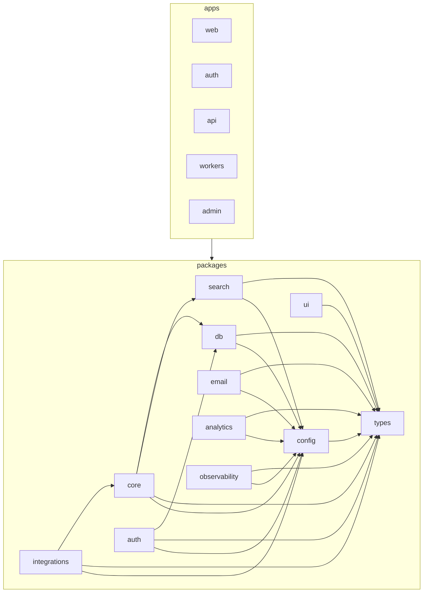

# LeadWolf — Architecture Map

> **Status:** `live` · **Generated from:** [`docs/architecture-map.json`](./architecture-map.json)
> (run `node .claude/hooks/gen-architecture-map.mjs` — or `bun run arch:map` — to refresh). **Paths come
> from the JSON (generated); do not edit paths here by hand.** One-line purposes and the Mermaid graph are
> authored here. Maintained by the [`enterprise-architecture`](../.claude/skills/enterprise-architecture/SKILL.md) skill.

> **Live end-to-end — the FULL M0–M5 MVP thin slice + its web UI** (auth round-trip · M1 import · M3 reveal
> & credits · M4 enrichment/verification/scoring · **M5 compliance hardening**: DSAR fan-out with
> verification scan, consent + global-suppression-on-withdraw, the privileged `leadwolf_admin` path,
> tombstones, public DSAR intake). **The web app (`apps/web`) now renders the surfaces**: a 6-destination
> **AppShell** (sidebar + top-bar credit pill + workspace switcher) over a `(shell)` route group, the
> **Prospect** surface (filter rail · masked results grid · right slide-over record detail · the reveal
> confirmation dialog driving `POST /contacts/:id/reveal` with 402/403 handling · score panel), **Home**
> cockpit (credit/usage StatTiles + recent reveals + quick actions), and **Settings ▸ Billing & Credits**
> (balance + usage history) and **▸ Compliance** (suppression + public DSAR intake) — built on token-driven
> `packages/ui` primitives (`StatusBadge`/`Card`/`StatTile`/`Spinner`), `next build` green (8 routes).
> 226 source files, 0 warnings, 2 framework-root files unbucketed (`apps/{auth,web}/next.config.mjs` — see Notes). **M4** adds the provider-agnostic enrichment engine
> (port in core, Apollo/ZoomInfo/Clearbit adapters in the now-live `packages/integrations`, cache-first +
> budget breaker + waterfall), **verify-on-reveal driving the ADR-0013 charge** (verification runs BEFORE
> the FOR UPDATE window; `valid` charges, `invalid`/`catch_all`/`unknown` charge 0, `risky` configurable),
> and the versioned `scores` + `intent_signals` intelligence layer with the priority_score sync trigger —
> proven by `intel.itest.ts` (6 invariants) with the M3 suite still green under the new flow.
> **M2 auth** is global-identity (`users` global + `tenant_members`): identifier-first sign-in
> (password → MFA → **org** → workspace) or registration with hybrid org placement, minting/validating the
> access JWT. **M1 Import & Contacts Core**: per-workspace CSV import dedupes contacts/accounts (encrypted
> PII + blind index) with `source_imports` provenance, behind RLS, surfaced by a masked list + import
> wizard. **M3 Reveal & Credits** lands the monetized path (07 §3): the suppression-gated, idempotent,
> `FOR UPDATE`-serialized reveal transaction against the tenant credit counter, the append-only `audit_log`
> (closed action enum), the suppression/DNC list, Stripe webhook top-ups (idempotent on
> `stripe_event_id`), the Idempotency-Key replay store, and the credits balance/usage API — proven by the
> Testcontainers/external-PG DoD suite (`reveal.itest.ts`: 9 invariants incl. N-concurrent no-double-charge
> and fail-closed RLS). `apps/admin` remains a **target**. Design: [10-roadmap.md](./planning/10-roadmap.md)
> M1–M3, [14 §3.4](./planning/14-phase-1-execution.md), [07 §3](./planning/07-billing-credits.md),
> [08 §3/§5](./planning/08-compliance.md), ADR-0006/0007.

## Repo tree (live; `apps/admin` is a target)

```
packages/                       # side-effect-free libraries, each exported via one index.ts  [LIVE]
  types/   src/{errors,auth,contacts,billing}.ts # RFC-9457 errors + auth/contacts/billing Zod contracts (leaf)
  config/  src/env.ts           # zod-validated env (ONLY process.env reader; BLIND_INDEX_KEY, REVEAL_COST_*, STRIPE_WEBHOOK_SECRET)
  ui/      src/{tokens.css,cn}  # TruePoint tokens + class helper
  db/      src/                 # Drizzle schema + RLS + repositories (the ONLY data access)  [LIVE]
    schema/{auth,contacts,billing,intel}.ts  rls/{auth,contacts,billing,intel}.sql  client.ts(withTenantTx · closeDb)
    applyMigrations.ts migrate.ts seed.ts
    repositories/{user,workspace,account,contact,sourceImport,reveal,credit,suppression,audit,
                  idempotency,score,intentSignal,providerCall}Repository.ts
    test/{itestDb.ts,import.itest.ts,reveal.itest.ts,intel.itest.ts}  # DoD proofs (Testcontainers or ITEST_DATABASE_URL)
  core/    src/                 # domain logic                                                          [LIVE]
    import/      runImport · parseFile · columnMap · normalize · blindIndex · encryptPii · contentHash
    reveal/      revealContact (verify-first money tx: verify → suppress-gate → claim → charge → audit)
    billing/     stripeWebhook (verify/sign/parse) · grantFromStripe (idempotent grant)
    compliance/  assertNotSuppressed (in-tx DNC gate) · writeAudit (same-tx audit writer)
    enrichment/  providerPort (06 §3 contract) · waterfall (order/breaker) · requestHash · enrichContact
    data-health/ emailVerifier (port + passThrough/static) · chargeFor (ADR-0013) · validatePhone
    scoring/     computeScore (rule-based v1, appends versioned scores — ADR-0008)
  auth/    src/                 # self-built auth primitives (no HTTP)
  integrations/ src/enrichment/ # vendor adapters implementing core's port (httpProvider + apollo/zoominfo/clearbit)  [LIVE]
apps/                           # deployable processes (thin transport adapters)
  api/   src/                   # Hono on Bun — validates the access JWT; never issues tokens  [LIVE]
    middleware/{authn,tenancy,error,rateLimit,idempotency}.ts
    features/{auth,import,reveal,billing,enrichment,scoring}/  app.ts  server.ts
  auth/  src/                   # auth.truepoint.in IdP (Next 15) — screens + /token/* + JWKS  [LIVE]
  web/   src/                   # app.truepoint.in (Next 15) — /auth/callback + the import wizard  [LIVE]
    app/{page,import,auth/callback}  features/import/  lib/{authClient,pkce,publicConfig}
  workers/ src/                 # Bun + BullMQ — imports · enrichment · scoring queues             [LIVE]
    index.ts  register.ts  queues/{imports,enrichment,scoring}.ts
  admin/                        # internal staff console                                          [TARGET]
```

## FEATURE → FILES index (live)

### import — *M1, load-bearing* ([05 §3](./planning/05-features-modules.md), [10 M1](./planning/10-roadmap.md))
- **core (pipeline + primitives):** `packages/core/src/import/runImport.ts` (the load-bearing
  parse→map→normalize→dedup-upsert→provenance pipeline), `parseFile.ts` (RFC-4180 CSV; XLSX seam),
  `columnMap.ts`, `normalize.ts`, `blindIndex.ts` (HMAC dedup key), `encryptPii.ts` (AES-GCM, KMS-swappable),
  `contentHash.ts` (idempotency); tests `*.test.ts`
- **db:** `packages/db/src/repositories/sourceImportRepository.ts` (per-import provenance + content-hash skip)
- **api:** `apps/api/src/features/import/{routes,index}.ts` (POST `/api/v1/imports` — multipart → `runImport`)
- **workers:** `apps/workers/src/queues/imports.ts` (the `imports` processor → same `runImport`)
- **web:** `apps/web/src/features/import/*` (ImportWizard + ContactsTable + ImportPage, hooks, api.ts) →
  route `apps/web/src/app/import/page.tsx`

### reveal — *M1 masked reads + M3 money loop* ([05 §7](./planning/05-features-modules.md), [07 §3](./planning/07-billing-credits.md), ADR-0007)
- **core:** `packages/core/src/reveal/revealContact.ts` — THE monetized transaction (07 §3, H1/H2):
  in-tx suppression gate → idempotent claim (`ON CONFLICT DO NOTHING` on the unique
  `(workspace, contact, reveal_type)`) → `FOR UPDATE` charge against `tenants.reveal_credit_balance` →
  same-tx audit; free re-reveal of an owned copy; config-injected `revealCostFor` (never hardcoded)
- **api:** `apps/api/src/features/reveal/{routes,index}.ts` (GET `/api/v1/contacts` masked list;
  POST `/api/v1/contacts/:id/reveal` behind the Idempotency-Key replay middleware)
- **db:** `packages/db/src/repositories/{account,contact}Repository.ts` (overlay reads/writes, masked list);
  `revealRepository.ts` (contact-for-reveal + the idempotent claim + usage list)

### billing — *M3 credits + Stripe* ([07 §2/§4](./planning/07-billing-credits.md))
- **core:** `packages/core/src/billing/stripeWebhook.ts` (HMAC signature verify + `signStripePayload` test
  helper + `parseCreditGrantEvent`), `grantFromStripe.ts` (grant exactly once per `stripe_event_id`)
- **api:** `apps/api/src/features/billing/{routes,index}.ts` — POST `/api/v1/billing/webhook`
  (signature-verified, the ONLY credit-grant path) + GET `/api/v1/credits/{balance,usage}`
- **db:** `packages/db/src/repositories/creditRepository.ts` (lock/decrement/read the tenant counter +
  `grantFromEvent` system tx), `idempotencyRepository.ts` (stored-response replay for money endpoints)

### compliance — *M3 gate + audit; M5 DSAR/consent (MVP-completing)* ([08](./planning/08-compliance.md))
- **core:** `packages/core/src/compliance/` — `assertNotSuppressed.ts` (the unbypassable in-tx DNC gate),
  `writeAudit.ts` (same-tx audit writer; closed enum), `dsarIntake.ts` (public intake: encrypted subject
  email + blind index), `deleteFanout.ts` (the 08 §4.2 erase-everywhere: tombstone every copy across
  tenants → purge dependents → GLOBAL suppression → per-copy audit → **verification scan gates
  `completed`**; idempotent), `assembleAccessReport.ts` (08 §4.1 enumeration + footprints),
  `consent.ts` (record + withdraw; withdrawal auto-adds global suppression)
- **db:** `suppressionRepository.ts`, `auditRepository.ts` (append-only), `consentRepository.ts`,
  `dsarRepository.ts` (request workflow + the PRIVILEGED `dsarFanoutRepository` cross-workspace queries);
  `client.ts` adds **`withPrivilegedTx`** (`SET LOCAL ROLE leadwolf_admin`, BYPASSRLS — the one sanctioned
  cross-workspace path, 03 §9/ADR-0011; the role is created in the migration bootstrap)
- **api:** `apps/api/src/features/compliance/*` — public POST `/api/v1/compliance/dsar` (session-less,
  registered before the authenticated router) + suppression/consent endpoints
- **workers:** `apps/workers/src/queues/dsar.ts` (privileged processing for VERIFIED requests)

### enrichment — *M4, provider waterfall* ([06](./planning/06-enrichment-engine.md))
- **core:** `packages/core/src/enrichment/providerPort.ts` (the 06 §3 contract — core OWNS the port),
  `waterfall.ts` (trust÷cost ordering + per-provider circuit breaker), `requestHash.ts` (normalized cache
  key), `enrichContact.ts` (cache-first → budget breaker → waterfall → overlay upsert + `source_imports`
  provenance + `provider_calls` cost row, one tx)
- **integrations:** `packages/integrations/src/enrichment/{httpProvider,providers}.ts` — Apollo/ZoomInfo/
  Clearbit VendorSpecs over one HTTP shape; injectable `fetchJson` → contract tests on recorded fixtures,
  zero live spend; a missing API key is a permanent `miss`
- **db:** `packages/db/src/repositories/providerCallRepository.ts` (cache lookup + cost ledger + daily-spend
  sum for the budget breaker)
- **api:** `apps/api/src/features/enrichment/*` (POST `/api/v1/enrichment/:entity/:id`, inline like M1
  import; bulk diverts to the queue) · **workers:** `apps/workers/src/queues/enrichment.ts`

### data-health — *M4 verification* ([06 §9](./planning/06-enrichment-engine.md), ADR-0013)
- **core:** `packages/core/src/data-health/emailVerifier.ts` (the dedicated-verifier port; passThrough until
  a vendor is chosen — 06 §11 Q1 — plus a static fixture verifier), `chargeFor.ts` (the ADR-0013
  charge-by-verified-result mapping, exhaustively unit-tested), `validatePhone.ts` (E.164 sanity)

### scoring — *M4 model (depth/UI M8)* ([ADR-0008](./planning/decisions/ADR-0008-lead-scoring-model.md))
- **core:** `packages/core/src/scoring/computeScore.ts` (rule-based v1: ICP fit + intent signals; appends a
  versioned `scores` row with an explanatory breakdown; the DB trigger syncs `contacts.priority_score`)
- **db:** `packages/db/src/repositories/{score,intentSignal}Repository.ts`
- **api:** `apps/api/src/features/scoring/*` (GET `/contacts/:id/scores`, POST `/contacts/:id/rescore`)
  · **workers:** `apps/workers/src/queues/scoring.ts`

### auth — *M2, global identity* ([05 §1](./planning/05-features-modules.md), [17](./planning/17-authentication.md), ADR-0019/0020)
- **api:** `apps/api/src/features/auth/{routes,index}.ts` (GET `/api/v1/auth/session` from verified claims)
- **db:** `packages/db/src/repositories/userRepository.ts` (global user/identity: users + sessions +
  `authEmailTokenRepository` for email-verification codes); `workspaceRepository.ts` `tenantSsoConfigRepository`
- **shared primitives:** `packages/auth/*` — login (`identifierLookup`/`login`/`flow`), `botCheck`/`rateLimit`
  anti-abuse (Turnstile in `apps/auth/src/shared/TurnstileWidget.tsx`), **registration**
  (`registration` provisioning + `emailVerification` codes + `signupTransaction`), **invitations**
  (`invitations` — mint a link token + accept-by-token; new invitees auto-accept by email at signup), and
  **SSO** (`sso/{types,providers,mockIdp,jit}` + `ssoTransaction` — one provider seam over OIDC/SAML with a
  dev mock IdP; callback JIT-provisions the identity + membership)
- **IdP origin:** `apps/auth/*` screens — sign-in (identifier → password → mfa → **org** → workspace, with
  `app/org/*` the org selector), **registration** (`app/signup/*` + `app/verify`, mailed via `lib/mailer`),
  and **SSO** (`app/sso/*` handoff + `oidc`/`saml` callbacks + dev `mock` IdP, via `lib/{ssoConfig,completeSso}`)
  + `/token/*` + JWKS
- **app-domain:** `apps/web` callback + in-memory token client

### workspaces — *M2* ([05 §2](./planning/05-features-modules.md))
- **db:** `packages/db/src/repositories/workspaceRepository.ts` — RLS-scoped workspaces plus the
  **tenant-membership / domain / invitation** repos and **new-org provisioning** (`tenantRepository`
  + `tenantMemberRepository.joinOrg`) for registration placement (the `tenant_members` model, ADR-0019/0020)

### Web UI surfaces ([04](./planning/04-ui-ux-design.md), [11](./planning/11-information-architecture.md))
The `apps/web` SPA: a `(shell)` route-group layout wraps every destination in the **AppShell** (auth
gate + sidebar + top bar). Slices follow the `import` pattern (`api.ts` → `fetchWithAuth`; hooks;
components; `index.ts`). Styling: shell + Prospect via `--tp-*` classes in `app/globals.css`; other
slices via co-located CSS Modules; primitives in `@leadwolf/ui`.
- **shell** (shared): `apps/web/src/components/shell/{AppShell,Sidebar,TopBar,CreditPill,WorkspaceSwitcher}.tsx`
  — the 6-destination chrome; `CreditPill` polls `/credits/balance` and re-fetches on a `credits:changed`
  window event; `app/(shell)/layout.tsx` mounts it.
- **prospect** (web): `apps/web/src/features/prospect/*` — filter rail + masked grid + `RecordDetail`
  slide-over + `RevealDialog` (`POST /contacts/:id/reveal` with `Idempotency-Key`; branches on
  `insufficient_credits` 402 / `suppressed` 403; dispatches `credits:changed`); routed at `(shell)/prospect`.
- **home** (web): `apps/web/src/features/home/*` — cockpit composing `/credits/balance` + `/credits/usage`
  into `StatTile`s + recent-reveals + quick actions; routed at `(shell)/home` (`/` redirects to `/prospect`).
- **settings-billing** (web): `apps/web/src/features/settings-billing/*` — balance card + usage history
  (`/credits/*`); routed at `(shell)/settings/billing` (the credit-pill deep-link target).
- **settings-compliance** (web): `apps/web/src/features/settings-compliance/*` — `SuppressionForm`
  (`POST /compliance/suppression`) + `DsarForm` (public `POST /compliance/dsar`); `(shell)/settings/compliance`.
- **sequences** (web, groundwork): `apps/web/src/features/sequences/types.ts` — view models +
  status→tone maps for the Sequences destination; the slice + route land with M9.
- **`@leadwolf/ui` primitives:** `packages/ui/src/components/{StatusBadge,Card,StatTile,Spinner}.tsx`
  (token-driven, monochrome, presentational) exported from `packages/ui/src/index.ts`.

_Remaining domains (`search`, `lists`, `outreach`, `sales-navigator`, `crm-sync`, …) and the
Sequences/Inbox/Reports destinations have **no code beyond the above groundwork yet**; targets in
[05](./planning/05-features-modules.md) + [11 §6](./planning/11-information-architecture.md)._

## Destinations cross-reference (6 web destinations → domains; + the auth origin)

> From [11 §6](./planning/11-information-architecture.md). The masked contacts list + import wizard surface
> under **Prospect**; auth surfaces on the dedicated auth origin and inside Settings.

| Destination | Surfaces domains | API |
|---|---|---|
| **Home** | home, notifications | `/home/summary`, `/notifications` |
| **Prospect** | search, **reveal**, lists, **import**, enrichment, scoring | `/api/v1/imports`, `/api/v1/contacts`, `/search/*`, `/lists` |
| **Sequences** | outreach, templates | `/outreach/*`, `/templates` |
| **Inbox** | inbox | `/inbox`, `/tasks` |
| **Reports** | reports, data-health | `/reports/*` |
| **Settings** | admin-settings, billing, compliance, api-public, **auth** | `/settings/*`, `/billing` |
| **(auth origin)** | auth | `auth.truepoint.in/login · /password · /signup · /verify · /sso · /sso/{oidc,saml}/callback · /org · /token/* · /.well-known/jwks.json` |

## DEPENDENCY section (which packages depend on which)

From [`architecture-map.json`](./architecture-map.json) `dependencies` (the allowed graph, [16 §5](./planning/16-code-organization.md)):

- `types` — leaf. **`config`** → `types`. `ui` → `types`. `db` → `types`, `config`.
- **`core`** → `db`, `types`, `config` *(live in M1: import pipeline imports `@leadwolf/db`/`@leadwolf/types`/`@leadwolf/config`;
  declares ports, never imports `integrations`)*. `auth` → `db`, `types`, `config`. `integrations` → `core`, `types`, `config`.
- **`apps/api`** → `core`, `db`, `auth`, `config`, `types` (+ `hono`). **`apps/workers`** → `core`, `config`, `types` (+ `bullmq`/`ioredis`).
  **`apps/web`** → `types`, `ui` (+ `next`/`react`; talks to the api over HTTP, never via imports). `apps/*` → any `packages/*`; **never** another app.

Enforced by `dependency-cruiser` ([`.dependency-cruiser.cjs`](../.dependency-cruiser.cjs); `bun run lint:boundaries`).
Imports go only through each package's `index.ts` (no deep imports). The Mermaid graph only *visualizes* this.

## Allowed module-dependency graph



## Shared / platform areas (live)

- **`packages/types`** — `errors.ts` (RFC-9457 + `ImportValidationError`/`InsufficientCreditsError`/
  `SuppressedError`), `auth.ts`, `contacts.ts`, `billing.ts` (`revealType`, suppression scopes, the **closed
  `auditAction` enum** — source of truth mirrored by the SQL CHECK), `activity.ts` (activity timeline +
  Sales Navigator link vocabularies, M7/M8 groundwork — not yet in the barrel), `outreach.ts` (sequence/
  step/log enums + request schemas, M9 groundwork — not yet in the barrel), `index.ts`.
- **`packages/config`** — `env.ts` (the only `process.env` reader; `BLIND_INDEX_KEY`, the `REVEAL_COST_*`
  placeholders per 07 §1, `STRIPE_WEBHOOK_SECRET`), `index.ts`.
- **`packages/ui`** — `tokens.css`, `cn.ts`, `index.ts`.
- **`packages/db`** — `client.ts` (`withTenantTx` GUC helper + `closeDb` graceful drain), `applyMigrations.ts`
  (bootstrap → drizzle → RLS), `migrate.ts`, `seed.ts`, `schema/{auth,contacts,billing}.ts`, `schema/index.ts`,
  `drizzle.config.ts`, `index.ts`, `test/{itestDb.ts,import.itest.ts,reveal.itest.ts}` (`itestDb` provisions
  Testcontainers **or** an external server via `ITEST_DATABASE_URL`; run itest files in **separate**
  processes — the db client is a module singleton). RLS in `src/rls/{auth,contacts,billing}.sql` — policies
  use the `NULLIF(current_setting(…, true), '')::uuid` idiom so unset/reset GUCs **fail closed** to zero
  rows; `billing.sql` also carries the reveal-ownership trigger + the audit_log append-only trigger.
- **`packages/core`** — `index.ts` (public surface: import pipeline + `revealContact`, `assertNotSuppressed`,
  `writeAudit`, `grantFromStripe`, stripe webhook helpers); domain code bucketed per feature above.
- **`packages/auth`** — the self-built auth primitives + `index.ts`.
- **`apps/api`** — `app.ts`, `server.ts`; **`apps/api/middleware`** — `authn.ts`, `tenancy.ts`, `error.ts`,
  `rateLimit.ts`, `idempotency.ts` (Idempotency-Key stored-response replay for money endpoints; the DB
  uniques remain the real double-charge guard).
- **`apps/auth`** — `middleware.ts` + `app/` screens/token endpoints + `shared/` + `lib/` (see JSON).
- **`apps/web/app`** — `layout`, `page`, `import/page` (the wizard route), `auth/callback`;
  **`apps/web/lib`** — `authClient`, `pkce`, `publicConfig`. (The import slice lives under `features/import/`.)
- **`apps/workers`** — `index.ts` (entry + graceful drain), `register.ts` (composition root + `enqueueImport`);
  the `imports` queue processor is bucketed to the `import` feature.

## Notes / unbucketed

- **`apps/auth/next.config.mjs`** and **`apps/web/next.config.mjs`** appear in `unassigned[]`. These are
  **Next.js-mandated app-root files** (they transpile the workspace packages); they cannot live under
  `apps/<app>/src/`, and the generator only classifies files under `apps/<app>/src/`. A **framework
  constraint, not a placement error**. No code-level violations: `warnings[]` is empty.
