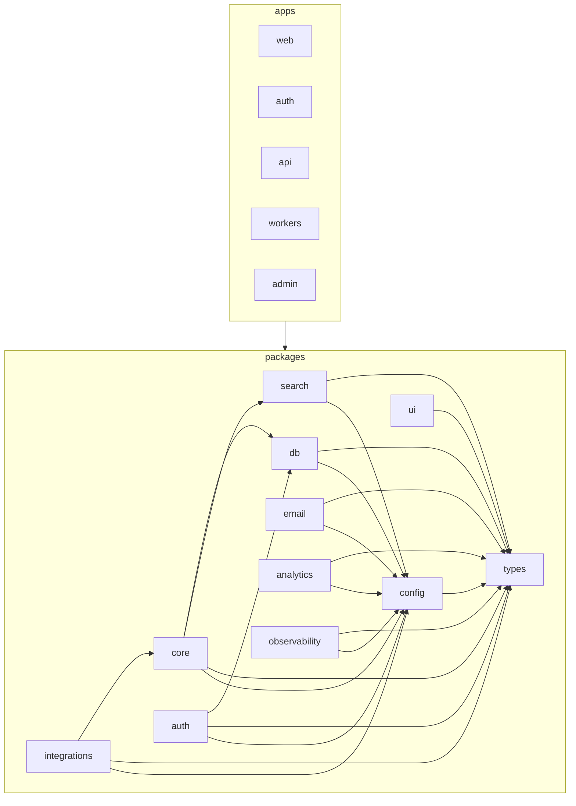

# TruePoint — Architecture Map

> **Status:** `live` · **Generated from:** [`docs/architecture-map.json`](./architecture-map.json)
> (run `node .claude/hooks/gen-architecture-map.mjs` — or `bun run arch:map` — to refresh). **Paths come
> from the JSON (generated); do not edit paths here by hand.** One-line purposes and the Mermaid graph are
> authored here. Format spec: `enterprise-architecture/reference/navigation-map-spec.md`.

> **Live end-to-end — the customer app, the dedicated auth IdP, the platform-admin console, and the worker
> tier are all real code.** Backend/contract coverage now spans the M0–M5 MVP (auth round-trip · import ·
> reveal & credits · enrichment/verification/scoring · compliance) **plus** M7–M9 (activity timeline +
> engagement scoring, Sales-Nav HITL capture, the suppression-gated outreach send engine), and the later
> waves: **search** (query-semantics core + `SearchPort` + `/search/*` + the Prospect rail, ADR-0035),
> **record customization** (custom fields, tags, pipeline stages — ADR-0028), **saved searches**,
> **account/company search + firmographics**, **bulk enrichment** (match-first `MatchPort`: overlay real +
> master-graph stub, ADR-0037/0038), **bulk contact actions** + **XLSX/template import**, the **M12 email
> subsystem** (per-tenant sending domains + DNS auth, connected mailboxes, send-gate over the M9 engine,
> tracking + deliverability + warmup + governance), the **AI intelligence layer** (NL→`ContactQuery`
> compile with prompt-injection + budget guards, ADR-0023), **webhooks** (HMAC-signed outbound + SSRF
> guard), **feature flags** (global + per-tenant override), **enterprise identity** (SSO config, **SCIM 2.0**
> provisioning — ADR-0019, IP-allowlist/MFA-policy/session-timeout auth hardening — ADR-0018/0040, account
> self-service security UI), and the **`apps/admin` staff console** (tenants · users · staff RBAC ·
> provider budgets · feature flags · audit log · system health · time-boxed audited impersonation —
> ADR-0011/0034).
> **The two-layer data model is the spine** ([ADR-0021](./planning/decisions/ADR-0021-global-master-graph-and-overlay.md)):
> the per-workspace **overlay** (`contacts`/`accounts`, RLS-FORCED) is built, and the global **master graph**
> (Layer 0) is now **shipped too** — `schema/masterGraph.ts` (7 tables), the field-grain partitioned
> `provenance_event` (`schema/provenanceEvent.ts`, migration 0089), and the Layer-0 technology/product catalog
> + adoption edge (`schema/masterTechnology.ts`, `schema/masterTechnologyAdoption.ts`, migrations 0100–0102)
> and the canonical signal store (`schema/masterSignals.ts`, migration 0103 — distinct from the tenant-scoped
> `intent_signals`, which it does not replace).
> **Migration 0108 re-plans the graph around one idea: an institution is an institution.** `master_companies`
> gained `org_kind`, so a school is an organization rather than a separate subsystem, and `master_education`
> (`schema/masterEducation.ts`) is the person→organization edge that had nowhere to live — the sibling of
> `master_employment` over the same catalog, kept a separate table because the payloads genuinely differ
> (degree/fields/years vs title/seniority). Alumnus is **derived** from `ended_on`, never a stored flag. The
> same migration dropped the dead `master_companies.technographics` blob (no reader, no writer), leaving
> `master_technology_adoptions` as the single technographics store. `account-intelligence` is the first
> customer-facing read surface over any of it.
> See the prospect↔company initiative in [`docs/planning/prospect-company-data/`](./planning/prospect-company-data/)
> and the intelligence-platform program in
> [`docs/planning/intelligence-platform/`](./planning/intelligence-platform/).
> **The MV3 browser extension** (`apps/extension`, `@leadwolf/extension`) is the newest surface — a thin,
> least-privilege, compliant-capture client (Vite + CRXJS), built dark, that reuses the shipped `/api/v1`
> ingestion/reveal seam and holds no DB/provider access. Its LinkedIn→contact seam is
> `features/contacts-resolve` (`GET /contacts/by-linkedin/:publicId` — masked, RLS-scoped) + `features/identity`
> (`GET /me`, `/orgs` — display identity + org switcher); companion-tab auth is ADR-0045. Design in
> [`docs/planning/chrome-extension/`](./planning/chrome-extension/) (00–14, incl. `14-implementation-audit` —
> the living shipped-status record) + [ADR-0043](./planning/decisions/ADR-0043-chrome-extension-architecture.md)
> /0044/0045. Build rules live in the three `.claude/skills/truepoint-extension-{architecture,linkedin,auth}` skills.
> **2000 source files · 85 code-bearing domains · 38 shared areas · 54 domain-vocabulary warnings · 7
> unbucketed.** Four of the seven are framework-root configs (`next.config.mjs` × 3, `postcss.config.mjs`),
> which have no domain by nature and are expected to stay here. **The other three are unregistered
> repositories** — `entitlementRepository`, `outcomeMetricsRepository`, `usageEventRepository` — which have a
> domain but no `REPO_DOMAIN` entry in the generator. That is a registration gap, not misplaced code, and it
> is the same class of backlog described below; fixing it is a generator edit, left as a tracked follow-up
> rather than folded into an unrelated change. (`provenanceBadgeRepository` left this list when the
> intelligence-platform work registered it under `data-health`, beside the freshness half of the same badge —
> the other three are not registered here because no existing domain is clearly right for them, and the
> generator's own rule is that a confidently wrong home is worse than an honest gap.)
>
> That is down from 155. The backlog was never misplaced code: it was **unregistered** code. The map keys a
> repository off `REPO_DOMAIN`, a queue off `QUEUE_DOMAIN` and a package off an explicit leaf-package list,
> and 151 files simply had no entry — 58 repositories, 13 queue files, and the whole of the **nested TruePoint
> Forge** (the `apps/forge` console + `apps/forge-api` capture-ingest/BFF + `apps/forge-worker` DAG,
> `@leadwolf/forge-core` + `@leadwolf/forge-capture-sdk`, the Forge repos under `repositories/forge/`, and the
> isolated `forge` Postgres schema owned by `leadwolf_forge`), plus `@leadwolf/auth-client` and
> `@leadwolf/identity`.
>
> `forge` is now a declared canonical domain — it has its own apps, its own package and its own Postgres
> schema, so scattering its files across neighbouring domains would have been the dishonest option. The Forge
> console's slices are bucketed as SHARED (like `apps/extension`) rather than minting five new domains
> (overview/captures/parsers/review/sync-status) that would pollute the vocabulary the rest of the map
> navigates by. The leaf-package list stays explicit rather than a catch-all, so a genuinely new package
> shows up unassigned and gets a deliberate decision instead of silently becoming "shared".
> See the generated [`architecture-map.json`](./architecture-map.json) `unassigned[]` / `warnings[]` for the
> current set. Counts reflect the merged tree including the parallel `feat/data-mgmt` work; its new domains'
> prose is owned by that track. Design refs: [04](./planning/04-ui-ux-design.md),
> [10-roadmap.md](./planning/10-roadmap.md), [11 §6](./planning/11-information-architecture.md),
> [16 §5](./planning/16-code-organization.md), ADR-0006/0007/0008/0009/0011/0013/0016/0018/0019/0021/0023/0028/0035/0037/0040.

## Repo tree (live)

```
packages/                       # side-effect-free libraries, each exported via one index.ts  [LIVE]
  types/   src/                 # RFC-9457 errors + Zod contracts (leaf): auth, contacts, billing, intel, compliance,
                                #   activity, outreach, home, search, accountsSearch, aiSearch, bulkActions, bulkEnrichment,
                                #   customFields, dataHealth, email, enrichmentPolicy, featureFlags, identityProvisioning,
                                #   importTemplates, listGovernance, pipelineStages, platformAudit, providerConfigs,
                                #   savedSearch, scim, sso, staffAdmin, tags, webhooks (+ drift-guard tests)
  config/  src/env.ts           # zod-validated env (ONLY process.env reader); key-material + origin-allowlist tests
  identity/ src/                # canonical identity primitives — HMAC blind index · email/domain normalization · stable content hash (dedup kill-list #1/#9)  [LIVE]
  ui/      src/                 # TruePoint design system: tokens/primitives/theme.css + cn + headless kit + shadcn-pattern ui/*
  db/      src/                 # Drizzle schema + RLS + repositories (the ONLY data access)  [LIVE]
    schema/{auth,contacts,billing,intel,compliance,activity,salesnav,outreach,lists,savedSearches,customFields,
            tags,pipelineStages,email,enrichmentJobs,enrichmentPolicy,importMappingTemplates,importPolicy,
            featureFlags,platformOps,scim,webhooks}.ts  rls/*.sql (one per schema, applied sorted)
    client.ts (withTenantTx · withPrivilegedTx · withPlatformTx · closeDb)  applyMigrations.ts  bootstrapAdmin.ts
    repositories/*.ts (one per entity)   test/*.itest.ts (per-DoD, run in separate processes)
  core/    src/                 # domain logic [LIVE]: import · reveal · billing · compliance · enrichment(+bulk) ·
                                #   data-health · scoring · activity · outreach · email · search · ai · home · prospect ·
                                #   customFields · pipelineStages · savedSearches · webhooks · featureFlags · auth · sales-navigator
  auth/    src/                 # self-built auth primitives (no HTTP): login/mfa/registration/invitations/password(+policy/breach) /
                                #   sso/switchWorkspace + ipBinding/ipAllowlist + sessionTimeout + revocation + auditEvent + log
  search/  src/                 # SearchPort adapters + field projection — inMemorySearchPort (dev/test); OpenSearch/Typesense later
  integrations/ src/            # vendor adapters: enrichment (apollo/zoominfo/clearbit over httpProvider) + anthropic NL-search adapter
apps/                           # deployable processes (thin transport adapters)
  api/   src/                   # Hono on Bun — validates the access JWT; never issues tokens  [LIVE]
    middleware/{requestId,authn,tenancy,error,rateLimit,revealRateLimit,idempotency,jobViewer,extensionScope,
                requireRole,requireOrgRole,requireStaffRole,requireCapability,platformAdmin,syncPrincipal}.ts
    lifecycle.ts                  # drain state shared by server.ts (SIGTERM) and the readiness endpoint
    features/{auth,workspaces,settings,scim,import,import-mapping-templates,reveal,billing,enrichment,enrichment via jobs,
              scoring,compliance,activity,sales-navigator,outreach,email,home,search,account-search,saved-searches,
              tags,pipeline-stages,custom-fields,contacts-bulk,lists,ai,webhooks,admin}/  app.ts  server.ts  instrumentation.ts
  auth/  src/                   # auth.truepoint.in IdP (Next 15) — screens + /token/* + JWKS + account self-service security  [LIVE]
    app/{login,password,magic,mfa(+enroll),signup,verify,sso,org,workspace,forgot,reset,account/security,token,logout}  shared/*  lib/*
  web/   src/                   # app.truepoint.in (Next 15) — AppShell over a (shell) route group  [LIVE]
    app/(shell)/{home,prospect,sequences,inbox,reports,lists,enrichment/jobs,sales-navigator,settings/*}  app/{import,auth/callback}
    components/{shell/*,PageHeader}  features/{import,prospect,home,sequences,inbox,reports,lists,sales-navigator,
                                              enrichment-jobs,settings-*}/   lib/{authClient,pkce,publicConfig}
  admin/ src/                   # admin.truepoint.in internal staff console (Next 15)  [LIVE — was a target]
    components/shell/{AdminShell,Sidebar,TopBar,navConfig,Brandmark}  components/{ImpersonationBanner,EntityPicker,TenantPicker,UserPicker}  lib/{adminGate,authClient,pkce}
    app/(shell)/{tenants,users,billing,plans,pricing,provider-configs,feature-flags,content,retention,staff,compliance,audit-log,imports,system-health}  features/*
  workers/ src/                 # Bun + BullMQ — imports · enrichment · scoring · dsar · outreach · firmographics ·
                                #   dedup · retentionSweep · sequenceTick · tokenRefresh queues + leaderLock +
                                #   mailboxThrottle (Redis token-bucket) + health/logger  [LIVE]
  extension/ src/               # MV3 browser extension (Vite + CRXJS) — thin compliant prospect capture  [LIVE]
    background/{index,bus,api,auth,queue,config,telemetry,eventStream,events}  # SW hub: bus·ApiClient·PKCE·IndexedDB queue·SSE
    content/{index,observer,adapters/linkedin,extract,hovercard}              # isolated world: adapter + shadow-DOM hover-card
    ui/{popup,panel}  shared/{messages,storage,idb,client,env,types}  i18n/   # React surfaces · Zod bus · storage · i18n
    manifest.config.ts  vite.config.ts  scripts/gen-icons.mjs                 # least-privilege manifest + build
```

## FEATURE → FILES index (live)

> The JSON currently buckets **86** code-bearing domains; this prose curates **37** subsections over them,
> grouping the small/adjacent ones under the section they serve. The JSON is the complete enumeration — if a
> domain is not written up here, look it up there rather than assuming it does not exist. Paths are authoritative in
> [`architecture-map.json`](./architecture-map.json); the purposes are here. Web slices are
> **destination-keyed** (prospect/sequences/settings-\*), api/core/db are **resource-keyed** (reveal/email/admin)
> — a file has exactly one home; the [Destinations](#destinations-cross-reference) section is where the cross-links live.

### A. Data ingestion, identity & enrichment

#### import — *M1 + XLSX/template/preview expansion* ([05 §3](./planning/05-features-modules.md), ADR-0036)
- **core:** `packages/core/src/import/` — `runImport.ts` (parse→map→normalize→dedup-upsert→provenance),
  `parseFile.ts` (RFC-4180 CSV) + `parseXlsx.ts` (XLSX with ZIP-magic + formula-injection guard + 100K-row/25 MiB caps),
  `columnMap.ts`, `validateRow.ts` (pure per-row verdict, reused by preview + run), `preview.ts` (valid/rejected/duplicate
  counts + bounded sample), `rejectedRowsCsv.ts`, `templates.ts` (save/load reusable column mappings),
  `encryptPii.ts` (AES-GCM, KMS-swappable). Normalization, the HMAC blind index and the stable content hash
  come from `@leadwolf/identity` directly — the old `core/import` re-export shims are deleted
- **db:** `sourceImportRepository.ts` (per-import provenance + content-hash skip); `importMappingTemplateRepository.ts`;
  `importPolicyRepository.ts` (per-workspace `who_can_import` + strategy defaults, P0 of
  [import-and-data-model-redesign](./planning/import-and-data-model-redesign/README.md)); `jobVisibility.ts`
  (`JobViewer` owner/elevated predicate shared by import/reveal/enrichment job reads — dual-gated
  `JOB_VISIBILITY_SCOPED` + `job_visibility_scoped`, flag-off = workspace-wide as before)
- **api:** `features/import/` (POST `/imports` → `202` + `jobId`; preview; `queue.ts` BullMQ producer; creates gated by
  `requireImportCreateGrant`) · `features/import-mapping-templates/` (mapping-template CRUD, role-gated manage) ·
  `features/settings/` (GET/PUT `/settings/import-policy`, owner/admin + in-tx audit) · `features/import/artifactRoutes.ts`
  (gated proxied download of the repair-CSV/error-report pair) · `middleware/jobViewer.ts` (builds the viewer, fail-closed
  dual gate) · **workers:** `queues/imports.ts` · `queues/bulkImports.ts` (fast kind) · `queues/importReaperSweep.ts`
  (orphan recovery + stall) · `queues/importPromotionSweep.ts` (deferred→queued) · `queues/importNotify.ts` (outbox
  `import.notify` consumer → in-app notification, S-Q4) · `queues/importArtifactSweep.ts` (artifact TTL key-nulling,
  S-S7). Import lifecycle now rides the ADR-0027 transactional outbox
  (`import.rollups`/`import.notify`, G06) — all Phase-1 additions dark behind `IMPORT_V2_ENABLED`. **Phase-2 gate
  code (dark, env-selected):** `packages/integrations/src/storage/s3FileStore.ts` (dependency-free SigV4
  S3-compatible FileStore — Gate B) · `packages/core/src/security/malwareScanner.ts` +
  `packages/integrations/src/security/clamdScanner.ts` (MalwareScannerPort, fail-closed — Gate C) · the Gate-A COPY
  spike in `packages/db/test/bulkImport.pipeline.itest.ts` + nightly soaks (S-P1/S-P4)
- **web:** `features/import/` — `ImportWizard` (file→map→preview→confirm; the dead-end "Large file" toggle is gone —
  server will decide the path), `ImportsLanding` (`/imports` scaffold; `/import` → redirect `/imports/new`),
  `ContactsTable`, `importJob.ts` (poll→UI state), `rejectedRowsCsv.ts`; root `providers.tsx` (TanStack Query seam)

#### enrichment — *M4 provider waterfall + bulk match-first + waterfall v2* ([06](./planning/06-enrichment-engine.md), ADR-0037/0038, 0109)
- **core:** `enrichment/` — `providerPort.ts` (the 06 §3 contract; core OWNS the port), `waterfall.ts` (legacy trust÷cost
  ordering + per-process breaker; still the bulk residual path), `enrichContact.ts` (dual-gated: legacy single-tx body OR
  the v2 branch), `requestHash.ts`, `policy.ts` (auto-enrich guard: trigger + field-allowlist + budget), `jobStatus.ts`
- **core (waterfall v2, 0109 — dark behind `WATERFALL_V2_ENABLED` + tenant flag):** `fieldWaterfall.ts` (PER-FIELD cascade,
  one memoized call per provider, capability filter, verify-before-accept w/ catch-all policy), `enrichContactV2.ts`
  (tx-split orchestration + `resolveProviderOrder`: per-run override → workspace prefs → default), `breakerStore.ts` +
  `providerGate.ts` (injectable ports; in-memory/pass-through defaults), `enrichmentEvidence.ts` (Layer-0 source_records +
  provenance events per winning provider, own withErTx, flag-gated), `sourceImports.ts` (one row per winning provider)
- **core (bulk, ADR-0037):** `enrichment/bulk/` — `matchPort.ts` (the `MatchPort` seam; injects a CandidateFinder, never
  imports db), `overlayMatcher.ts` (real Layer-1 matcher: deterministic ladder → fuzzy_name_company → review/unmatched),
  `masterGraphMatcher.ts` (Layer-0 **stub** until the Citus/OpenSearch/Spark candidate index lands), `estimate.ts`
  (pre-flight cost forecast: sample → extrapolate charged rows × hit rate, a range never a guarantee)
- **integrations:** `enrichment/{httpProvider,providers}.ts` (Apollo/ZoomInfo/Clearbit **+ PDL/Coresignal (dark until DPA'd
  keys)** VendorSpecs over one HARDENED HTTP shape: https+host-allowlist, timeout, size cap, Retry-After; injectable fetch) +
  `redisBreakerStore.ts`/`redisProviderGate.ts` (fleet-shared breaker + per-provider rate/budget gate enforcing
  `provider_configs`)
- **db:** `providerCallRepository.ts` (cache + cost ledger; 0109 unique `(ws,hash,provider)` + per-field `filled_fields` —
  the old unique silently dropped multi-attempt rows); `enrichmentJobRepository.ts`, `enrichmentPolicyRepository.ts`
  (+`provider_prefs` jsonb + same-tx audit) (*both unassigned — entity not in `REPO_DOMAIN`*) ·
  **api:** `features/enrichment/*` (+ 202 producer behind `ENRICHMENT_ASYNC_ENABLED`) · **workers:** `queues/enrichment.ts`
  (factory w/ Redis deps + throttle deferral) · **web:** `settings-enrichment/ProviderPriorityPanel` (arrow-reorder per-field
  priority + verification knobs) · **admin:** provider stats block (30d hit/verified-valid/latency/cost per provider)

#### enrichment-jobs — *bulk enrichment job UI* (web; ADR-0039)
- **web:** `features/enrichment-jobs/` — `EnrichmentJobsPage` + `JobDetailDrawer` over `useEnrichmentJobs`/`useEnrichmentJobDetail`;
  GET-only surface (read the per-job ledger; the surface never mutates). Routed at `(shell)/enrichment/jobs`.

#### data-health — *M4 verification + data-quality score + freshness re-verification* ([06 §9](./planning/06-enrichment-engine.md), ADR-0013/0025)
- **core:** `data-health/` — `emailVerifier.ts` (verifier port; passthrough + fixture + `hybridVerifier`),
  `reacherVerifier.ts` (Reacher adapter + `defaultEmailVerifier` config-gated factory; injectable fetch),
  `emailPrescreen.ts` (`localPrescreenVerifier` — zero-network role/disposable short-circuit wrapped around the verifier to skip paid probes),
  `reverifyContacts.ts` (`runReverification` — re-grade revealed, past-SLA contacts via the configured verifier),
  `validatePhone.ts` (E.164), `phoneVerifier.ts` (phone verifier port + format-only default),
  `twilioPhoneVerifier.ts` (Twilio Lookup adapter + `defaultPhoneVerifier` config-gated factory; carrier-confirmed valid/invalid),
  `chargeFor.ts` (ADR-0013 charge-by-verified-result), `dataQualityScore.ts`
  (the 0.4·completeness + 0.3·verification + 0.3·freshness formula; cold-start rules for imports),
  `dataQualitySummary.ts` (`buildDataQualitySummary` — the per-workspace fill/verification/freshness count rollup the Data Health dashboard reads),
  `dataQualitySnapshot.ts` (`captureDataQualitySnapshot` — persists a daily WorkspaceDataQuality trend point),
  `badgeV1.ts` (confidence badge v0 over provenance aggregates; `now` injected so it stays pure),
  `jobChange.ts` (`detectJobChange` — compares CONFIDENCES, not timestamps; a departure is held to the same
  bar as a move) + `recordJobChange.ts` (the producer: intent_signal + alerts to users who SAVED the contact),
  `successor.ts` (`rankSuccessors` — who now holds a departed contact's role; seniority is a DISTANCE on the
  ladder, unknown scores neutral, and weak suggestions are dropped rather than shown),
  `runJobChangeSweep.ts` (the per-workspace runner behind the job-change sweep — composes detect + record and
  re-decides nothing; the tenant-side PRIOR is priced with the default method prior and one source, so a
  strong new claim clears the bar and a weak one cannot)
- **workers:** `reverification.ts` (per-workspace re-verification job), `reverificationSweep.ts` (leader-locked
  daily fan-out enqueuing a per-workspace re-verification for every workspace with stale revealed contacts),
  `dataQualitySnapshotSweep.ts` (leader-locked daily capture of a per-workspace Data Health trend point),
  `jobChangeSweep.ts` (leader-locked S-13 fan-out, DARK behind `JOB_CHANGE_SWEEP_ENABLED` — owner-conn census
  of workspaces whose Layer-0 employment moved since a Redis watermark, then per-workspace `withTenantTx`
  batches. An ABSENT watermark starts at NOW and fans out nothing, so a Redis loss misses changes rather than
  replaying history as an alert storm; the watermark advances only on a fully drained tick)
- **db:** `verification_jobs` (the re-verification audit ledger — one row per completed run, workspace-scoped RLS;
  `verificationJobRepository` record/listRecent; migration 0022) — written by `runReverification` (PLAN_06);
  `data_quality_snapshots` (the Data Health TREND store — `dataQualitySnapshotRepository`; migration 0023);
  `jobChangeSweepRepository` (no tables of its own — the sweep's data access: the owner-conn cross-tenant
  census and Layer-0 fact read, kept apart from the RLS-enforcing tenant read because "which workspaces hold
  this person" is a question no tenant role may ask);
  `provenanceBadgeRepository` (`badgeFor` — the corroboration half of the S-10 badge, aggregated under
  `withErTx`; `contributor_ref` is counted inside the SQL and never returned)
- **tests:** `jobChangeAlerts.itest.ts` (the producer: watcher fan-out, dedup, unsaved-contact signal) +
  `jobChangeSweep.itest.ts` (the layer above it: the watermark bounds the census, the owner-conn fact read is
  workspace-scoped where RLS is NOT the wall, only primary+current edges count, and the runner composes end
  to end against real columns)

#### reveal — *M1 masked reads + M3 money loop + no-charge revealed reads + in-list reveal + async bulk* ([07 §3](./planning/07-billing-credits.md), ADR-0007/0013/0029)
- **core:** `reveal/revealContact.ts` — the monetized tx: in-tx suppression gate → cross-`reveal_type` dedup
  (`revealCharge.ts` — charge only the NEWLY-uncovered field(s)) → idempotent claim (unique
  `(workspace, contact, reveal_type)`) → `FOR UPDATE` charge against `tenants.reveal_credit_balance` → same-tx
  audit; `reveal/getRevealedContact.ts` — the NO-CHARGE, ownership-checked read (single + batch) that decrypts
  ONLY the fields the workspace owns a claim for
- **db:** `{account,contact}Repository.ts` (overlay reads/writes, masked list — `searchRepository` projects
  `revealedTypes`); `revealRepository.ts` (claim + usage + owned-field / claim reads + batched hydration)
- **multi-value channels (import-and-data-model-redesign Phase 3 — dark behind the `CHANNEL_DUAL_WRITE` /
  `CHANNEL_READ_FROM_CHILD` dual-gate pairs):** `contact_emails`/`contact_phones` child tables
  (`schema/contactChannels.ts`, encrypted + blind-indexed, one-live-primary, E.164 on phones) ·
  `contactChannelRepository.ts` + `packages/core/src/channels/` (`applyChannelWrite` = the CH-INV-1 single
  write path: child upsert + flat primary-cache projection in one tx; backfill + reconcile runners) · worker
  sweeps `queues/channelBackfillSweep.ts` (flat→child projection, WHERE-missing watermark) and
  `queues/channelReconcileSweep.ts` (permanent drift repair, phase-rule direction). Gate-on, masked contact
  DTOs carry channel summaries, `has_email`/`has_phone` count secondaries, the dedup email rung reads
  `contact_emails.blind_index`, and reveal/export go primary-first — uniformly across search/count/resolve/
  dynamic-list membership. Flat columns remain the permanent primary-value cache (never dropped)
- **company children (Phase 4, DDL landed dark — migration 0061):** `account_domains` (clear citext,
  live-unique per workspace) + `account_locations` (hq/branch/office) child tables (`schema/accountChildren.ts`)
  + `accounts.parent_account_id`/`root_account_id` (composite same-workspace FK) + `accounts.deleted_at` (G18);
  write paths/backfills ride the in-flight S-A2 train
- **api:** `features/reveal/*` (masked `/contacts` list; POST `/contacts/:id/reveal` behind Idempotency-Key
  replay, role-gated + burst-limited; GET `/contacts/:id/revealed` + POST `/contacts/revealed/batch` no-charge
  reads; `/credits/reveal-costs`)
- **web (prospect):** `RevealCell.tsx` in-grid reveal (value + copy + badge, or a cost-labelled reveal button) +
  `useRevealStore.tsx` (optimistic single source of truth) + `useRevealedContact.ts` / `CopyButton.tsx` in the
  detail drawer
- **async bulk (Phase 3, ADR-0029/0036; dark behind `BULK_REVEAL_ENABLED`):** `reveal_jobs`/`reveal_job_rows`
  (migration 0050) + `revealJobRepository` + credit `leaseForJob`/`releaseForJob` (recon-safe
  lease→settle→release; pure `leaseAccounting.computeReleaseSplit`); core `reveal/bulk/*` (estimate ·
  create/confirm · drive/chunk runner in `lease` settle-mode + finalize/release); worker `queues/bulkReveal.ts`;
  api `/reveal-jobs/*` (create · confirm-lease · cancel · pause/resume · download); web `BulkRevealJobDialog.tsx`
  (select-all → job → live progress → CSV). See `docs/planning/reveal-experience/` + ADR-0042.
- **realtime (Phase 4, ADR-0027; dark behind `REALTIME_SSE_ENABLED`):** the domain-event transactional outbox
  (`event_outbox` migration 0051 + `eventOutboxRepository`, appended IN the reveal tx) → the leaderless relay
  (`apps/workers/realtimeRelay.ts`, outbox → Redis pub/sub) → the authenticated SSE gateway (`features.events`
  api `GET /events/stream`, streamSSE, workspace-scoped) → the web `lib/eventStream` fetch-reader + shell
  `RealtimeBridge` that reconciles balance + reveal state live. Shared contract: `@leadwolf/types/realtimeEvents`.

### B. Prospect & account data surface

#### prospect — *the find-anyone destination (contacts + accounts)* ([05](./planning/05-features-modules.md), ADR-0035)
- **core:** `prospect/` — `dedup.ts` (per-workspace soft-pointer dedup: canonicalName + registrableDomain grouping),
  `accountSearch.ts` (workspace-visible account result count), `firmographics.ts` (roll intent_signals → account facets:
  technologies from tech_install slugs, fundingStage from latest funding_round), `bulkActions.ts` (batch apply to
  workspace-visible ids + audit), `tags.ts`, `lists.ts`,
  `contributionGate.ts` (`evaluateContribution` — may this row MINT a node in the SHARED graph? Gates the
  mint only: a denied row still LINKs to what the graph already holds. An opt-OUT over the ADR-0021 identity
  mint, not an opt-in — decisions.md D13), `backfillMaster.ts` (applies that gate per row)
- **web:** `features/prospect/` — masked grid + `RecordDetail`/`QuickViewDrawer` slide-overs + `RevealDialog`; **bulk
  reveal** (`useBulkSelection`, `BulkActionBar`, `BulkRevealDialog`, pure `bulkReveal.ts` policy: stop on 402 / skip 403);
  **filter rail** (`FilterRail` + `FilterPanel`/`AccountFilterPanel` over `filterGroups.ts`/`accountFilterGroups.ts`, with
  `FacetTypeahead` (server-backed value picker over `searchApi.ts`) + the shared progressive-exclude pattern
  `TermFacetField` (include by default, exclusion opens its own labelled block) + `TermOptionChips`);
  **AI search** (`AiSearchBox` + `ParsedFilterPreview`);
  **accounts** (`AccountsTable`/`AccountFilterPanel`/`AccountDetailDrawer` over `accountSearchApi.ts`); **stages/tags**
  (`StageSelector`/`StageManagementPanel`, `TagChip`/`TagPicker`/`tagColors`); `export.ts` (masked CSV, no PII);
  `searchUrlState.ts` (shareable/bookmarkable query); `savedSearchApi.ts` + `RecentSearches`/`SaveSearchPanel`; routed at `(shell)/prospect`

#### account-search — *company-side search/facets API* (ADR-0035)
- **api:** `features/account-search/*` — `GET` account search / facets / typeahead (firmographic facets: industry,
  technologies, employee_band, funding). Backed by `accountSearchRepository.ts` (*unassigned repo*).

#### scoring — *M4 model + M8 engagement* ([ADR-0008](./planning/decisions/ADR-0008-lead-scoring-model.md))
- **core:** `scoring/computeScore.ts` (ICP fit + intent + engagement → versioned `scores` row; trigger syncs `contacts.priority_score`)
- **db:** `{score,intentSignal}Repository.ts` · **api:** `features/scoring/*` · **workers:** `queues/scoring.ts`

#### activity — *M8 timeline* ([03 §7](./planning/03-database-design.md))
- **core:** `activity/logActivity.ts` (tombstone-aware append, one tx) · **db:** `activityRepository.ts` (+ `last_activity_at` trigger)
- **api:** `features/activity/*` (GET/POST `/contacts/:id/activities`)

#### sales-navigator — *M7 HITL link capture* (ADR-0009)
- **core:** `sales-navigator/{captureLink,parseLink}.ts` · **db:** `salesNavLinkRepository.ts` (dedup on workspace+url)
- **api:** `features/sales-navigator/*` · **web:** `features/sales-navigator/` (`CaptureForm` + `LinksTable`; a human pastes the link)

#### lists — *static prospect lists + bulk add-to-list* ([list-plan](./planning/list-plan/00-overview.md))
- **db:** `listRepository.ts` (owner-gated mutations; `visibleContactIds` cross-workspace guard); `schema/lists.ts` (`lists`/`list_members`)
- **api:** `features/lists/*` · **web:** `features/lists/` (`ListsPage`/`ListDetailPage`/`ListFormDialog`/`ImportIntoListDialog`); `(shell)/lists`

#### tags — *cross-list record labels* (ADR-0028)
- **core:** `prospect/tags.ts` (case-insensitive per-workspace name uniqueness) · **db:** `tagRepository.ts` (*unassigned*),
  `schema/tags.ts` (`tags` + `record_tags`; color is a brand-palette KEY, not hex) · **api:** `features/tags/*`

#### pipeline-stages — *workspace deal stages mapped to outreach_status* (ADR-0028)
- **core:** `pipelineStages/manageStages.ts` (one-to-one map to the canonical `outreach_status`; at-most-one default)
- **db:** `pipelineStageRepository.ts` (*unassigned*), `schema/pipelineStages.ts` (`maps_to_status` CHECK mirrors the enum)
- **api:** `features/pipeline-stages/*` · **web:** in `features/prospect/` (`StageManagementPanel`/`StageSelector`/`stagesApi`)

#### custom-fields / customFields — *typed record customization (jsonb, not EAV)* (ADR-0028)
- **core:** `customFields/` — `manageDefinitions.ts` (immutable key/entity/type), `setValues.ts` (validate + merge into jsonb),
  `validateValue.ts` (pure per-type validation, reused by import) · **db:** `customFieldRepository.ts` (*unassigned*),
  `schema/customFields.ts` (`custom_field_definitions` + `custom_fields` jsonb on contacts/accounts)
- **api:** `features/custom-fields/*` · **web:** `features/settings-custom-fields/` (`CustomFieldsPanel`)

#### saved-searches / savedSearches — *persisted ContactQuery filters* (M8, ADR-0035)
- **core:** `savedSearches/savedSearches.ts` (thin; most logic in db) · **db:** `savedSearchRepository.ts` (*unassigned*),
  `schema/savedSearches.ts` (filters as jsonb ContactQuery, re-run never SQL-parsed; visibility private/workspace)
- **api:** `features/saved-searches/*` · **web:** in `features/prospect/` (`savedSearchApi`/`SaveSearchPanel`/`RecentSearches`)

#### contacts-bulk — *batch actions on search results* (ADR-0036)
- **api:** `features/contacts-bulk/*` — bulk tag/owner/status/archive/enroll/add-to-list/enrich/reveal over
  workspace-visible ids (core logic in `prospect/bulkActions.ts`; audited per closed enum) · **web:** `prospect/bulkActionsApi.ts` + `BulkActionBar`

### C. Outreach & email

#### outreach — *M9 sequences + the suppression-gated send engine* ([08 §3/§6](./planning/08-compliance.md), ADR-0009/0013)
- **core:** `outreach/` — `createSequence.ts`, `enrollContact.ts` (revealed-only + `assertNotSuppressed` in-tx + idempotent),
  `sendStep.ts` (the compliance-critical send tx: CAN-SPAM identity BLOCKED-not-warned, suppression re-checked, footer
  appended, audit), `handleBounce.ts` (replay-idempotent + auto-suppress + ADR-0013 credit-back), `senderPort.ts`
  (`EmailSenderPort`: dev console + test static; the M12 dispatch swaps the port without touching the send tx)
- **db:** `{sequence,outreachLog}Repository.ts`; `schema/outreach.ts` (sequences→steps→log; unique (sequence,contact) = enrollment idempotency)
- **api:** `features/outreach/*` · **workers:** `queues/outreach.ts`

#### sequences — *outreach builder + enrollment + send UI* (web; ADR-0009)
- **web:** `features/sequences/` — `SequenceList`/`SequenceBuilder` (CAN-SPAM identity up front), `EnrollmentPanel` +
  `EnrollmentLogTable`, `DraftReviewPanel`, `SendStatusDashboard`, `TemplatesPanel`; `(shell)/sequences`

#### email — *M12 email subsystem (sending domains, mailboxes, send-gate, tracking, deliverability)* ([14](./planning/14-phase-1-execution.md), email-planning)
- **core:** `email/` — `sendingDomains.ts` (create + DNS-verify SPF/DKIM/DMARC per-tenant domains) + `dnsAuth.ts`
  (verify against an injected DnsResolverPort), `connectMailbox.ts` (workspace mailbox + KMS-envelope-encrypted credential)
  + `secretStore.ts` (AES-256-GCM versioned envelope), `resolveSendingIdentity.ts` (own mailbox + verified domain or refuse),
  `dispatchOutreachSend.ts` (P1 send-gate: verify identity + consume tenant send-quota in tx + per-mailbox
  rate-throttle check, then M9 `sendStep` unchanged; a throttle denial refunds the quota and defers the send),
  `providerAdapter.ts` (ESP adapter seam — **dark default `consoleSender`, no network until an SES/Google/SMTP adapter is wired**),
  `templates.ts` + `renderTemplate.ts` (**P2 editor:** versioned owner-scoped templates — create/update +
  `getTemplate`/`listTemplateVersions`/`restoreVersion` (immutable append-only versions) + keyset-paginated
  `listTemplates` + `previewTemplate` (server-side safe render: HTML-escaped single-pass `{{merge}}`, canonical
  `allowedKeys` whitelist); D8 owner-only edits, IDOR→404),
  `sequenceScheduler.ts` (leader-locked tick: claim due enrollments `FOR UPDATE SKIP LOCKED`), `trackingToken.ts`
  (signed opaque open-pixel/click token), `ingestTrackingEvent.ts` (idempotent event → projects open/click to activities),
  `deliveryWebhook.ts` (HMAC-verified ESP webhook → delivery/bounce/complaint), `deliverabilityAnalytics.ts`
  (workspace aggregates; reply-rate primary, opens MPP-inflated), `warmup.ts` (deterministic ramp curve), `governance.ts`
  (staff-only global suppression + per-tenant send-quota); **P1 OAuth + Gmail send (new):** `signingKeys.ts` (P0
  per-tenant webhook/tracking key derivation — closes the global-secret forgery), `pkce.ts` + `oauthProvider.ts`
  (provider-agnostic connect seam + registry + injectable HTTP port) + `googleOAuth.ts` (Gmail OAuth:
  authorize/exchange/refresh/revoke/identity; scopes `gmail.send`+`gmail.readonly`), `mailboxConnectFlow.ts`
  (start/complete connect handshake — single-use state, send-scope-downgrade reject, encrypted token vault),
  `gmailSend.ts` + `mimeMessage.ts` (Gmail `messages.send` adapter realizing the M9 `EmailSenderPort`: RFC 5322
  build + stable Message-ID threading key + CR/LF header-injection guard), `mailboxTokenProvider.ts`
  (send-time token loader — the D7-sanctioned server-side credential read-back: decrypt + proactive-refresh +
  rotate, `invalid_grant`→`reauth_required`), `registerProviders.ts` (`registerEmailProviders` — wires the
  OAuth provider + Gmail send adapter at api/worker boot; `resolveSender` falls back to dark `consoleSender`
  until then), `recordOutboundMessage.ts` (best-effort, post-`sendStep`: find-or-create the conversation thread +
  persist the outbound `email_message` w/ the rfc822 Message-ID — never fails a sent email; outbound rows store
  the tenant's own from-address, recipient via `contact_id`); **per-mailbox throttle + token refresh (new):**
  `tokenBucket.ts` (pure refill-then-consume token-bucket algorithm) + `mailboxThrottle.ts` (the
  `MailboxThrottlePort` seam + `allowAllThrottle` default + `MailboxThrottledError`), `refreshDueMailboxTokens.ts`
  (the leader-locked sweep body: owner-connection id-only scan of mailboxes near expiry → per-mailbox
  tenant-scoped refresh, each failure isolated)
- **db:** `schema/email.ts` (`sending_domain` TENANT-scoped + globally unique; `mailbox_integration` WORKSPACE-scoped +
  encrypted credential **+ P1 OAuth token-lifecycle cols** `oauth_expires_at`/`oauth_scopes`/`provider_account_id`/
  `reauth_required`/`reauth_reason`; `oauth_connect_state` **(new, P1)** short-lived CSRF+PKCE handshake, RLS
  ENABLE-not-FORCE for the session-less callback; `email_thread`+`email_message` **(new, P1/P3)** the conversation +
  per-message store — workspace+owner-scoped (D8), encrypted body (D7), `rfc822_message_id` reply-threading key;
  `email_event` firehose **+ `reply`/`auto_reply` event types**; `outreach_log.last_reply_at` cache) + migrations
  `0020_new_patriot`/`0021_far_blob` (additive); repos `mailboxRepository`/`sendingDomainRepository`/
  `emailEventRepository`/`emailTemplateRepository`/`emailAnalyticsRepository`/`sendQuotaRepository`/
  `oauthConnectStateRepository`/`emailThreadRepository`/`emailMessageRepository` (*all unassigned*)
- **api:** `features/email/` — `routes.ts` (mailboxes **+ `POST /mailboxes/connect/start`**, sending-domains, verify,
  reports), `templateRoutes.ts` (**P2: GET `/`(paginated)·`/:id`·`/:id/versions` + POST `/`·`/:id/preview`·`/:id/restore` + PATCH `/:id`**),
  `webhookRoutes.ts` (PUBLIC session-less: ESP delivery webhook + open-pixel +
  click-redirect), `connectRoutes.ts` **(new, P1: PUBLIC session-less OAuth `connect/callback`)**, `oauthProviders.ts`
  (side-effect provider registration from env)
- **workers:** `queues/outreach.ts` (real-send path: flag-gated `dispatchOutreachSend`, `MailboxThrottledError`
  → clamped re-enqueue, never a double-send) + `queues/tokenRefresh.ts` (leader-locked `email_token_refresh`
  repeatable sweep, every 2 min) + `mailboxThrottle.ts` (Redis atomic-Lua token-bucket adapter realizing
  `MailboxThrottlePort`, keyed `email:throttle:{mailboxId}`); both wired in `register.ts`
- **web:** `features/settings-mailboxes/` (connect mailbox + sending-domain DNS records + send-quota) + `features/settings-enrichment/` (auto-enrich policy)

#### inbox — *M9 unified replies + tasks* (web)
- **web:** `features/inbox/` — `ThreadList` + `ThreadView` over `useInbox`, `TasksPanel` over `useTasks`; `(shell)/inbox`

#### crm-sync — *bidirectional Salesforce/HubSpot sync — DARK by four gates* ([crm-sync plan](./planning/crm-sync/00-enterprise-implementation-plan.md), [runbooks](./planning/crm-sync/_runbooks/crm-sync-operations.md))
- **core:** `crm-sync/` — `port.ts` (`CrmConnector`: OAuth + data plane + webhook verify; injectable `CrmFetch`),
  `connectCrm.ts` (auth-code + PKCE; the callback compares the handshake's tenant against the VERIFIED session,
  SSRF- **and** allow-list-validates the provider-returned `instanceUrl`, refuses a broadened scope grant),
  `crmSecretStore.ts` (AES-256-GCM versioned envelope under its OWN `CRM_SECRET_KEY` — one key per credential
  class), `transforms.ts` (CLOSED registry — a name, never code; an unknown name REFUSES rather than passing
  the raw value through), `planInboundMerge.ts`/`planOutboundPush.ts` (pure per-field ladders),
  `runCrmPush.ts`/`applyInboundEvent.ts`/`runCrmPull.ts`/`runCrmErase.ts` (the IO shells: gate ladder,
  suppression walls both directions, content-hash loop guard, monotonic watermarks),
  `crmBudgetGuard.ts` (proactive per-connection API budget — shared store, FAILS CLOSED),
  `evaluateCrmAlerts.ts` (what does NOT alert is most of it), `publishCrmPushIntent.ts` (outbox intent)
- **db:** `crm{Connection,OauthState,FieldMapping,RecordLink,SyncState,SyncRun,SyncConflict,DeadLetter,Health}Repository.ts`;
  `schema/crm.ts` + `rls/crm.sql` (nine workspace-scoped tables, ENABLE+FORCE RLS; three append-only by
  policy-absence) · migration `0087_crm_sync.sql`
- **api:** `features/crm-sync/*` — the authed router (connect/callback/sync-mode/backfill/health reads/mapping
  editor/conflict queue) **plus** the PUBLIC signature-verified provider webhook, mounted BEFORE it
- **workers:** `queues/crmSync.ts` (pull·inbound·push·backfill), `queues/crmSyncSweep.ts` (leader-locked
  delta·reconcile·refresh·alert ticks), `queues/crmErase.ts` (outbound DSAR erase); `crm-sync/` deps factory
  + alert tick + durable dead-letter writer
- **integrations:** `crm-sync/` — HubSpot + Salesforce adapters, the Redis budget store
- **web:** `features/crm-sync/` — connections + sync activity + mapping editor + conflict review; `(shell)/crm-sync`
- **admin:** `features/crm-sync/` — the cross-tenant fleet monitor + the poison-job triage console

### D. Intelligence & reporting

#### search — *query-semantics core + SearchPort + `/search/*` + Prospect rail* ([24](./planning/24-advanced-search-exploration-ux.md), ADR-0035)
- **core:** `search/` — `normalizeTitle.ts` (freetext → stable key: "CEO" ≡ "Chief Executive Officer"), `canonicalizeTitle.ts`,
  `expandQuery.ts` + `expandTitleFilters.ts` (synonym sets), `titleTaxonomy.ts` (seed taxonomy; prod backfilled from O*NET/ESCO),
  `planTitleFilter.ts` (selected values → an engine-agnostic match plan)
- **search (pkg):** `fields.ts` (project rows → searchable facets), `inMemorySearchPort.ts` (dev/test adapter proving the
  contract: term filters, free-text, suggest, facet counts, keyset paging) · **types:** `search.ts` (the `SearchPort` contract)
- **api:** `features/search/` — `routes.ts` (`/search/{contacts,suggest,facets}`), `searchPortProvider.ts` (wires the active port)

#### ai — *NL→ContactQuery compile with guards* (M14, ADR-0023)
- **core:** `ai/` — `aiPort.ts` (the `parseSearchQuery` contract; core owns the port), `compileSearchQuery.ts`
  (inject-guard → budget-reserve → port → re-validate against `contactQuery` schema), `promptGuard.ts` (`sanitizeNlQuery` +
  cheap `looksLikeInjection` no-spend gate), `budgetGuard.ts` (per-tenant daily ceiling, reserve-before-call + refund-on-failure)
- **integrations:** `anthropic/nlSearchAdapter.ts` (the provider adapter behind the port)
- **api:** `features/ai/` — POST `/ai-search` (returns a validated `query` + notes; human confirms before applying), `aiPortProvider.ts`
- **metering (M14 / 13a Area 14):** `ai_requests` table (mig 0039 + rls/aiRequests.sql) + `aiRequestRepository` (append + `usageSince` platform rollup); `/ai-search` logs each call best-effort (task/model/outcome/latency/tokens — NL text never stored; the Anthropic adapter surfaces `usage`) · **types:** `aiUsage.ts` (`aiRequestOutcome`). Staff `GET /admin/ai-usage` (audited `admin.ai_usage`, coarse-gated) + admin `ai-usage` cockpit (window + per-tenant table).

#### home — *the cockpit destination* (web + api + core)
- **core:** `home/buildHomeSummary.ts` (fan-out over domain repos in one `withTenantTx`) + `data-health/dataQualitySummary.ts`/`dataQualitySnapshot.ts` · **api:** `features/home/*` (GET `/home/summary`, `/home/data-quality`, `/data-quality/history`, `/data-quality/reverification-runs`)
- **web:** `features/home/` — KPI tiles + cards (recent reveals, hot leads, **data health** + freshness trend, burn sparkline, imports, enrichment, sequence
  snapshot, activity feed) + `QuickActionsRow`/`TasksCard`/`RepliesCard`; `(shell)/home`

#### account-intelligence — *the customer READ surface over the Layer-0 graph* (mig 0108)
- **types:** `accountIntelligence.ts` — the contract both sides derive from. The develops/uses split is a
  **discriminated union on `relationship`** with genuinely different arms (ownership/started_on vs
  detection_method/first_seen/last_seen/source_count), so code that conflates the two facts cannot typecheck;
  both responses are egress-validated with `.parse()`. `master_company_id` is deliberately absent from the
  education row — nothing renders it, and a stable Layer-0 id handed to every tenant is a cross-tenant
  correlation key for no gain (a `resolved` boolean carries what the UI needs)
- **web:** the UI lives in `features.prospect.web` (destination-keyed — see
  [Destinations](#destinations-cross-reference)): `accountIntelligenceApi.ts` (both reads), and per surface —
  `hooks/useAccountTechnologies.ts` + `components/AccountTechnologySections.tsx` for the ACCOUNT drawer (one
  cache entry PER relationship, so develops and uses can never overwrite each other; two sections, "Builds"
  and "Runs", never one merged list), and `hooks/useContactEducation.ts` +
  `components/EducationSection.tsx` for the CONTACT drawer. Unmatched records render an explicit
  "not matched to the graph yet" rather than an empty list — "we hold nothing" and "we have not identified
  this record" are different facts and the UI never asserts the first when only the second is true
- **api:** `features/account-intelligence/` — `routes.ts` (GET `/accounts/:accountId/technologies?relationship=develops|uses`,
  `?fields=vendors` expands each technology's creator). **Two transactions, in order:** `withTenantTx` resolves the account
  inside the caller's workspace (RLS decides visibility, and yields `master_company_id` — the only bridge into Layer 0), then
  `withErTx` reads Layer 0 for that one resolved id. The client never supplies a master id, which is what keeps the shared
  graph un-addressable. `relationship` is **required**: "what does this company build" (`master_technology_vendors`) and
  "what does it run" (`master_technology_adoptions`) are different facts from different tables, so the ambiguous question
  is a 400, never a merged list. An account ER has not yet bridged returns `resolved:false` rather than a bare empty list
- Opposite direction from `master-sync` across the same wall: that domain is the Forge→Layer-0 **write** ingress, this is
  the tenant-facing **read**. Reads only — no credit spend, no personal data (technology/vendor rows describe organizations)

#### reports — *client rollups + XLSX export* (web)
- **web:** `features/reports/` — `rollups.ts` over `/credits/*` + `/contacts`; sections (CreditUsage, Funnel, DataHealth,
  Deliverability, Intent, LeadScore, TeamActivity); `charts/` (Bar/Line/Distribution/Funnel); `export/` (dependency-free
  OOXML `xlsxWriter` + `exportData` + `downloadXlsx`); `(shell)/reports`

### E. Identity, access, billing & developer

#### auth — *M2 global identity + ADR-0040 hardening* ([17](./planning/17-authentication.md), ADR-0019/0020/0040)
- **api:** `features/auth/*` (GET `/auth/session` incl. live workspace role) · `features/identity/*` (GET
  `/me`, `/orgs` — the extension's display identity + org switcher, each token-`sub`-scoped); RBAC middleware
  `{requireRole,requireOrgRole,requireStaffRole,platformAdmin}.ts` (workspace / org / platform tiers)
- **core:** `auth/members.ts` (workspace member lifecycle: invite/change-role/remove, owner non-removable, audited),
  `auth/adminSessions.ts` (list/revoke member sessions, force-reauth) · **db:** `userRepository.ts`
- **shared primitives:** `packages/auth/*` — login (`identifierLookup`/`login`/`loginTransaction`/`flow` + `scopeGuard`),
  `botCheck`/`rateLimit`/`policy`, **registration** (`registration`/`emailVerification`/`signupTransaction`), **invitations**,
  **password** (`password` + `passwordPolicy` NIST 800-63B + `breachCheck` HIBP k-anonymity + `passwordReset`/`refresh`),
  **MFA** (`mfa`/`mfaVerify`), **SSO** (`sso/{types,providers,mockIdp,jit}` + `ssoTransaction`), **switch** (`switchWorkspace`/`switchOrg`),
  **session hardening** (`revocation` deny-list, `findActiveSessionOrDetectReuse`, `sessionTimeout` policy cap — ADR-0018/0040),
  **client-IP** (`ipBinding` token-exchange binding + `ipAllowlist` CIDR tenant gate), `auditEvent` (tenant + platform audit), `log`
- **IdP origin:** `apps/auth/*` — screens (sign-in/signup/verify/sso/forgot/reset/magic/org/workspace) + **account self-service
  security** (`app/account/security/` PasswordSection/MfaSection/SessionsSection/HistorySection + `actions`/`data`/`status`/`stepUp`
  re-auth gate + one-time `enrollCookie`; `app/mfa/enroll/`) + `/token/*` + JWKS + `instrumentation`/`bootSelfTest`; `lib/*`
  (cookies, cors, mailer, `authFailure`, `domainResolver`, `finishLogin`, `requireUser`, `completeMagic`/`completeSso`, `emails/*`)

#### workspaces — *M2 + member/session admin* ([05 §2](./planning/05-features-modules.md))
- **api:** `features/workspaces/` — `routes.ts` (`GET /workspaces` for the switcher), `memberRoutes.ts` (list/invite/
  change-role/remove, RLS-scoped + re-verified), `sessionRoutes.ts` (member sessions: revoke / force-reauth-all)
- **db:** `workspaceRepository.ts` (RLS-scoped workspaces + role + tenant-membership/domain/invitation + new-org provisioning)
- **web:** `features/settings-workspace/` (`WorkspaceGeneralPanel` + `MembersPanel` + `SessionsPanel`)

#### settings — *tenant identity / SSO config API*
- **api:** `features/settings/` — `routes.ts`, `identityRoutes.ts` (domain claim/verify for SSO routing + SCIM token
  mint/list/revoke, plaintext shown once), `ssoRoutes.ts` (SAML/OIDC config upsert; OIDC secret write-only, encrypted)
- **db:** `domainRepository`/`ssoConfigRepository`/`authPolicyRepository`/`scimTokenRepository` (*all unassigned*)

#### scim — *SCIM 2.0 provisioning* (ADR-0019; RFC 7643/7644)
- **api:** `features/scim/` — `index.ts` (mounts `/scim/v2`), `scimAuth.ts` (bearer-token middleware → resolves tenant,
  gates every route), `scimService.ts` (provision/deprovision/read; ADR-0019 global-identity ↔ SCIM mapping; idempotent +
  session revocation + bounded stale-access window), `userRoutes.ts` (/Users list/get/post/put/patch/delete; Zod + tenancy
  from the token, never the body), `scimError.ts` (RFC 7644 error envelope — never RFC-9457 on this surface)
- **types:** `scim.ts` (the wire contract) · **db:** `schema/scim.ts` (`scim_tokens` — hash only; tenant-scoped)

#### billing — *M3 credits + Stripe; the plans-pricing-credits self-serve slice* ([07 §2/§4](./planning/07-billing-credits.md), [plans-pricing-credits/05](./planning/plans-pricing-credits/05_Implementation_Roadmap.md), ADR-0012)
- **core:** `billing/stripeWebhook.ts` (HMAC verify) + `grantFromStripe.ts` (grant once per `stripe_event_id`)
- **db:** `creditRepository.ts` (lock/decrement counter), `idempotencyRepository.ts`, `revealRepository.ts` (usage keyset/filter/CSV reads), `tenantRepository.getBillingProfile` (plan envelope), `planTemplateRepository` (+`trial_bonus_credits`, mig 0037); `client.withPlatformReadTx` (non-auditing owner catalog read)
- **api:** `features/billing/*` (signature-verified webhook + `/credits/{balance,usage,me}`), `features/pricing/*` (**PUBLIC** unauth `/pricing/{credit-packs,plans}` — ADR-0012 transparent pricing)
- **web:** `features/settings-billing/` (the tabbed billing **hub**: Plan/Credits/Usage + defer-honest Invoices/Subscription), `features/public-pricing/` + `app/(public)/pricing` (the unauth pricing page), `lib/useSessionRole.ts` (OD-8 workspace-admin gate)
- **admin:** `features/tenants/` per-tenant economics panel (`TenantEconomics` over `GET /admin/tenants/:id/economics`) + refund-reason taxonomy + plan-template `trial_bonus_credits` field; `features/billing/` economics rollup + `EconomicsTrend` revenue sparkline (`/economics/trend`); `features/{plans,pricing}/` catalog CRUD
- **workers:** `lowBalanceNotifierSweep.ts` (dark, read-only low-balance detector — env-gated off)
- **types:** `pricing.ts` (public catalog + plan envelope), `billing.ts` (+usage page/query/`dataSource`), `planTemplateAdmin.ts` (+`trialBonusCredits`)
- *(generator flags two net-new domains — `pricing` (api) + `public-pricing` (web) — distinct commercial concerns not yet in the canonical list; folded here for readability)*

#### notifications — *in-app feed (G-NTF-1); LIVE end-to-end*
- **db:** `schema/notifications.ts` (`notifications` table — workspace/user-scoped, `read_at`; mig 0038 + rls/notifications.sql),
  `notificationRepository.ts` (create/listForUser keyset/unreadCount/existsUnreadOfType/markRead/markAllRead — RLS bounds the workspace, repo enforces per-user)
- **api:** `features/notifications/*` (`GET /notifications` feed+unreadCount · `/unread-count` · `POST /:id/read` · `/read-all`)
- **web:** shell `NotificationsBell` + `useNotifications` (real feed, poll, mark-read/mark-all) + `features/notifications` history page (`(shell)/notifications`, keyset paging + per-item mark-read) · **types:** `notifications.ts`
- **producers:** welcome-on-signup (`workspaceRepository.provisionNewOrg`) + low-credits (`workers/lowBalanceNotifierSweep`, deduped, dark-gated). Follow-ups: import-complete, reply-received.

#### compliance — *M3 gate + audit; M5 DSAR/consent* ([08](./planning/08-compliance.md), ADR-0011)
- **core:** `compliance/` — `assertNotSuppressed.ts` (unbypassable in-tx DNC gate), `writeAudit.ts` (same-tx append),
  `dsarIntake.ts`, `deleteFanout.ts` (erase-everywhere: tombstone every copy → purge dependents → GLOBAL suppression →
  **suppress the Layer-0 golden node + append a tombstone `provenance_event`** → per-copy audit → verification scan
  that now counts Layer 0, so a request cannot report `completed` while the shared graph still holds the subject),
  `assembleAccessReport.ts`, `consent.ts` (record + withdraw → auto global suppression).
  Both DSAR entrypoints take a request id ONLY and read the blind index from the row — the subject's plaintext
  email never enters a job payload, job log or dead-letter record.
- **db:** `{suppression,audit,consent,dsar}Repository.ts` (+ `contributionPolicyRepository.ts` — the customer's
  contribution controls: workspace policy, domain/account/contact exclusion list, per-CRM-object opt-in);
  `client.ts` `withPrivilegedTx`/`withPlatformTx` (the sanctioned
  cross-workspace `leadwolf_admin` paths) · **api:** `features/compliance/*` (public session-less `/compliance/dsar`) ·
  **workers:** `queues/dsar.ts` (privileged, VERIFIED only) · **web:** `features/settings-compliance/` (`SuppressionForm`/`SuppressionList`/`DsarForm`)
- **schema/RLS:** `migrations/0097_contribution_controls.sql` + `rls/contributionControls.sql` (read/write for the
  app role, unlike `entitlement` next door — a restriction the CUSTOMER imposes on us must be self-service, or the
  revocation 09 rule 5 requires is not a revocation); `migrations/0099_*` adds `dsar_requests.due_at` (the ≤72h SLA
  clock; `findOverdue` is what makes a missed SLA visible)

#### webhooks — *outbound event delivery* (M10)
- **core:** `webhooks/` — `dispatch.ts` (deliver + retry), `sign.ts` (HMAC payload signature), `ssrfGuard.ts` (block
  internal/metadata targets), `webhooks.ts` (subscription logic) · **db:** `webhookRepository.ts` (*unassigned*),
  `schema/webhooks.ts` (`webhook_subscriptions` + `webhook_deliveries`; secret encrypted, recoverable for replay)
- **api:** `features/webhooks/*` (subscribe/list/delete + replay/self-test) · **web:** `features/settings-developer/` (`WebhooksPanel`)

#### featureFlags — *global flags + per-tenant override* (ADR-0011)
- **core:** `featureFlags/` — `evaluateFlag.ts` (pure precedence: tenant override > global > default > **OFF/unknown**),
  `flagsForTenant.ts` · **db:** `featureFlagRepository.ts` (*unassigned*), `schema/featureFlags.ts` (`feature_flags` global +
  `tenant_feature_flags` override) · **admin UI:** see `feature-flags` below

### F. Platform-admin (`apps/admin` console + admin API)

> The internal staff console at `admin.truepoint.in`. Gated two ways: PKCE auth **and** a platform-admin probe of the API
> (the API gate is the source of truth, never a client flag). Every cross-tenant action runs under `withPlatformTx`
> (owner role, RLS bypass, immutable `platform_audit_log` write). ADR-0011/0034.

#### admin — *platform-admin API surface* ([13](./planning/13-platform-admin.md), ADR-0011/0032)
- **api:** `features/admin/` — `routes.ts` (`/workspaces`, `/users`, `/tenants`, `/tenants/:id`), `auditLog.ts` (GET
  `/audit-log`, itself audited), `impersonation.ts` (start w/ reason + end + active; time-boxed, banner-flagged),
  `providerConfigs.ts` (toggle + monthly budget), `staff.ts` (grant/revoke staff roles),
  `compliance.ts` (DSAR queue + transitions, retention policies, sub-processors, global suppression),
  `dsarQueue.ts` (the `dsar` queue producer — dispatch fires on the staff transition to `processing`, never
  from the session-less public intake, which would let anyone erase anyone by typing their address)
- **db:** `platformAdminReads.ts` + `platformAuditReads.ts` (bounded reads); `impersonationRepository`/`platformStaffRepository`/
  `providerConfigRepository`/`staffRepository` (*unassigned*); `schema/platformOps.ts` (`impersonation_sessions`) + `platformStaff`
  in `schema/auth.ts` (deny-all to app role); `platform_audit_log` (raw table, `rls/platform.sql`, owner-insert only)

#### apps/admin shell + features (web)
- **shell/lib:** `components/shell/` (`AdminShell` two-stage gate, `Sidebar`/`TopBar`/`navConfig`/`Brandmark`),
  `ImpersonationBanner` (polls `/admin/impersonation/active`), `EntityPicker` + `TenantPicker`/`UserPicker` presets (async typeahead over `/admin/{tenants,users}?search=`, replaces raw-UUID entry), `lib/` (`adminGate` API probe, `authClient`, `pkce`, `publicConfig`)
- **tenants** — directory (plan/status/seats/credits) + detail (workspaces/members/usage; plan overrides, suspend, credit grants)
- **users** — cross-tenant user search; deactivate; reset MFA / force reset; revoke sessions
- **staff** — grant/revoke platform staff roles (super_admin/support/billing_ops/compliance_officer/read_only)
- **provider-configs** — enrichment provider enable/disable + monthly budget + rate-limit (mtd spend masked)
- **feature-flags** — create/list/toggle global flags + per-tenant overrides (`NewFlagDialog`/`OverrideDialog`)
- **audit-log** — read-only append-only privileged-action log viewer
- **system-health** — service indicators (ECS/Aurora/Redis/Typesense/OpenSearch) + queue depth + worker status

### G. Web settings scopes (`apps/web/src/features/settings-*`)
The `(shell)/settings/*` routes mount a two-column `SettingsScopeLayout` (scope nav + panel) driven by `navConfig`.
- **settings-shell** — `SettingsScopeLayout` + `SettingsNav` + `SettingsPlaceholder` (the chrome for all scopes)
- **settings-user** (User) — `ProfilePanel`, `NotificationsPanel`, `SecurityPanel` (status map deep-linking to the auth-origin account-security flows)
- **settings-workspace** (Workspace) — `WorkspaceGeneralPanel`, `MembersPanel`, `SessionsPanel`
- **settings-tenant** (Tenant/Org) — `OrganizationPanel`, `IdentityPanel` (domains + SCIM tokens), `SsoConfigPanel`,
  `SecurityAccessPanel` (MFA enforcement / allowed methods / enforce-SSO / session timeout / IP allowlist), `AuthAuditList`
- **settings-developer** (Developer) — `ApiKeysPanel`/`OAuthAppsPanel`/`WebhooksPanel`/`ApiDocsPanel`
- **settings-billing** — `BillingPage` + `UsageTable` · **settings-compliance** — `SuppressionForm`/`SuppressionList`/`DsarForm`
- **settings-custom-fields** — `CustomFieldsPanel` · **settings-enrichment** — `AutoEnrichPanel` · **settings-mailboxes** — mailbox + sending-domain + send-quota config

## Destinations cross-reference (web destinations → domains)

> From [11 §6](./planning/11-information-architecture.md) + the implemented `navConfig`. The index never cross-lists a file;
> this is where a destination's surfaced resource-domains are noted (the reveal domain's API is `features.reveal.api`; its UI lives under Prospect).
> `account-intelligence` is the newest instance of that split and a clean illustration of it: the API is
> `features.account-intelligence.api`, while its UI — `accountIntelligenceApi.ts`, `useAccountTechnologies.ts`,
> `AccountTechnologySections.tsx` — lives in `features.prospect.web`, because the drawer it renders into is a
> Prospect surface. One file, one home; the cross-link lives here rather than in the index.

| Destination | Surfaces domains | Route |
|---|---|---|
| **Home** | home, notifications | `(shell)/home` |
| **Prospect** | reveal, import, search, account-search, ai, lists, tags, pipeline-stages, custom-fields, saved-searches, enrichment, scoring, contacts-bulk, **account-intelligence** | `(shell)/prospect` |
| **Sequences** | outreach, email, templates | `(shell)/sequences` |
| **Inbox** | inbox | `(shell)/inbox` |
| **Reports** | reports, data-health | `(shell)/reports` |
| **Lists** | lists | `(shell)/lists` |
| **Enrichment jobs** | enrichment-jobs | `(shell)/enrichment/jobs` |
| **Settings** | settings (identity/SSO), workspaces (members/sessions), billing, compliance, webhooks/api-public, custom-fields, enrichment, email/mailboxes, **auth** | `(shell)/settings/*` |
| **(auth origin)** | auth | `auth.truepoint.in/{login,password,magic,mfa,signup,verify,sso,org,workspace,account/security,token/*,.well-known/jwks.json}` |
| **(admin origin)** | admin, tenants, users, staff, provider-configs, feature-flags, audit-log, system-health | `admin.truepoint.in/(shell)/*` |

## DEPENDENCY section (which packages depend on which)

From [`architecture-map.json`](./architecture-map.json) `dependencies` (the **allowed** graph, [16 §5](./planning/16-code-organization.md)):

- `types` — leaf. `config` → `types`. `ui` → `types`. `db` → `types`, `config`. `search` → `types`, `config`.
  `email` → `types`, `config` *(allowed seam; the email logic currently lives in `packages/core/src/email`, not a separate package)*.
  `analytics`/`observability` → `types`, `config`.
- `core` → `db`, `search`, `types`, `config` *(declares ports — enrichment/sender/SearchPort/AiPort/MatchPort — never imports `integrations`)*.
  `auth` → `db`, `types`, `config`. `integrations` → `core`, `types`, `config`.
- `apps/api` → `core`, `db`, `auth`, `search`, `config`, `types` (+ hono). `apps/workers` → `core`, `config`, `types` (+ bullmq/ioredis).
  `apps/{web,admin}` → `types`, `ui` (+ next/react; talk to the api over HTTP, never via imports). `apps/auth` → `auth`, `db`, `config`, `types`.
  `apps/*` → any `packages/*`; **never** another app.

Enforced by `dependency-cruiser` ([`.dependency-cruiser.cjs`](../.dependency-cruiser.cjs); `bun run lint:boundaries`).
Imports go only through each package's `index.ts` (no deep imports). The Mermaid graph only *visualizes* this.

## Allowed module-dependency graph


```mermaid
flowchart TD
  subgraph apps
    web; auth; api; workers; admin
  end
  subgraph packages
    core; db; authpkg["auth"]; integrations; search; email; ui; analytics; observability; config; types
  end
  apps --> packages
  core --> db; core --> search; core --> types; core --> config
  db --> types; db --> config
  authpkg --> db; authpkg --> types; authpkg --> config
  integrations --> core; integrations --> types; integrations --> config
  search --> types; search --> config
  email --> types; email --> config
  ui --> types
  analytics --> types; analytics --> config
  observability --> types; observability --> config
  config --> types
```

## Shared / platform areas (live)

- **`packages/types`** — RFC-9457 `errors.ts` + the Zod contract surface (one file per domain, listed in the tree); closed-enum
  **drift guards** (`auditCoverage.test.ts`, `platformAuditCoverage.test.ts`). Single source of truth for request/response types.
- **`packages/config`** — `env.ts` (the only `process.env` reader) + key-material / origin-allowlist / origin-consistency tests.
- **`packages/ui`** — the TruePoint **design system**: `tokens/primitives/theme.css` + `cn`; dashboard primitives (StatusBadge,
  Card, StatTile, Spinner, Avatar, Progress, Pagination, Icon), **State Kit** (`state.tsx`: Skeleton/Loading/Empty/Error/StateSwitch),
  Tp-prefixed form `controls.tsx` + `form.tsx`, `Tabs`, overlays (`overlay.tsx` Dialog/Drawer; `floating.tsx` Popover/DropdownMenu/Tooltip),
  `Toast`, `DataTable`, `Combobox`, `PageHeader` (the one destination header all three frontends render), and
  shadcn-pattern `components/ui/*` (used by the auth screens).
- **`packages/app-shell`** — the **shared Next.js app chrome** consumed by `apps/web`, `apps/admin` and
  `apps/forge`: `AppShellFrame` (rail column + sticky top bar + internally-scrolling content, owning mobile
  sidebar state, the desktop rail pin and the density context), `Sidebar`/`NavItem`/`UserRow`, `TopBar` (+
  `DensityToggle`, `ShortcutsButton`), `CommandPalette` (⌘K), `ShortcutsDialog`, `Brandmark`/`Wordmark`/`Logo`,
  and one `shell.css` carrying the `.tp-shell`/`.tp-sidebar`/`.tp-topbar`/`.tp-nav-*` chrome plus the console
  page scaffold. Each app keeps only its own auth/staff gate, destination list, and app-specific widgets — this
  package exists because those three shells had drifted into three near-identical copies. `next` and `react`
  are peer deps so nothing Next-coupled leaks into `packages/ui` (which is esbuild-bundled for claude.ai/design).
- **`packages/db`** — `drizzle.config.ts` + `drizzle.worktree.config.ts` (the worktree-scoped variant, for
  running migrations against a per-worktree database); `client.ts` (`withTenantTx`/`withPrivilegedTx`/`withPlatformTx`/`closeDb`), `applyMigrations.ts`
  (bootstrap → drizzle → RLS sorted → grants → **partition-ACL mirror, which must run last**), `bootstrapAdmin.ts`,
  `migrate.ts`, `seed.ts`; `schema/*.ts` (schema files incl.
  the system-owned **Layer-0 master graph** `masterGraph.ts` — ADR-0021, walled off from `leadwolf_app` by the
  `applyMigrations` grant-off, no RLS — plus the Layer-0 technology/product catalog `masterTechnology.ts`, whose
  tables all take the `master_` prefix so the generator's `^master_` REVOKE loop makes them fail closed by
  default), one RLS `.sql` each, `NULLIF(current_setting(…, true), '')::uuid` fail-closed idiom); `repositories/*.ts`; `test/*.itest.ts`
  (35+ DoD suites, run in **separate** processes — the db client is a module singleton; isolation itests prove cross-tenant invisibility) +
  `test/migrationSeedLengths.test.ts` (static, DB-free: every migration flag-seed description must fit `feature_flags.description varchar(500)` — a longer one kills the prod migrate).
- **`packages/core`** — `index.ts` is the public surface; domain code bucketed per feature above. Owns all ports
  (enrichment/sender/SearchPort/AiPort/MatchPort/DnsResolverPort) — never imports `integrations`.
- **`packages/auth`** — the self-built auth primitives (login/registration/invitations/password+policy+breach/MFA/SSO/switch/
  session-hardening) + `ipBinding`/`ipAllowlist`/`sessionTimeout`/`revocation`/`auditEvent`/`log`.
- **`packages/search`** — `index.ts` (the SearchPort adapter/types seam), `inMemorySearchPort.ts` (dev/test), `fields.ts`
  (facet projection). *Only the in-memory adapter exists; OpenSearch/Typesense land behind the same seam (ADR-0002/0035).*
- **`packages/integrations`** — `enrichment/{httpProvider,providers}.ts` (Apollo/ZoomInfo/Clearbit) + `anthropic/nlSearchAdapter.ts` (the AI port adapter).
- **`apps/api`** — `app.ts`, `server.ts`, `instrumentation.ts`; **`apps/api/middleware`** — `authn`, `tenancy`, `error`,
  `rateLimit`, `idempotency` (the DB uniques remain the real double-charge guard), `requireRole`/`requireOrgRole`/`requireStaffRole`, `platformAdmin`.
- **`apps/auth`** — `instrumentation` + `bootSelfTest` + `middleware`; `app/*` screens + token endpoints + account-security;
  `shared/*` (AuthShell/AccountShell/BrandLockup/OtpInput/SubmitButton/TurnstileWidget); `lib/*` (cookies, cors, mailer,
  `authFailure`, `domainResolver`, `finishLogin`, `requireUser`, `bootstrapAdmin`, `clientIp`, `completeMagic`/`completeSso`, `emails/*`).
- **`apps/web`** — `app/(shell)/*` destinations + `settings/*` routes (+ `import`, `auth/callback`); `components/shell/*`
  (AppShell auth gate, Sidebar/TopBar/navConfig, CommandPalette, DensityProvider, CreditPill, NotificationsBell,
  WorkspaceSwitcher/OrgSwitcher/TeamSwitcher, useSidebarPin); `lib/` (`authClient`, `pkce`, `publicConfig`).
- **`apps/admin`** — `app/(shell)/*` staff pages + `components/shell/*` (AdminShell two-stage gate, Sidebar/TopBar/navConfig,
  Brandmark) + `ImpersonationBanner` + `EntityPicker`/`TenantPicker`/`UserPicker`; `lib/` (`adminGate`, `authClient`, `pkce`, `publicConfig`).
- **`apps/workers`** — `index.ts` (entry + bounded graceful drain), `register.ts` (composition root + producers +
  `/metrics` collection), `leaderLock.ts` (single-runner election for scheduled ticks), `health` (liveness/readiness w/
  bounded Redis probe + `/metrics`)/`logger`; the worker-platform hardening layer (`retryPolicies`, `deadLetter`,
  `tuning`, `withDeadline`, `metrics`, `outboxRelay` — the leaderless ADR-0027 outbox drainer; see
  `docs/planning/worker-platform/`); queue processors bucketed to their feature (imports/enrichment/scoring/dsar/
  outreach) — see Notes for the undeclared queues. Queue itests in `apps/workers/test/`.
- **`apps/extension`** (MV3 browser extension, Vite + CRXJS; areas `apps/extension` · `…/background` · `…/content` ·
  `…/ui` · `…/shared` · `…/i18n`) — **`background/`** the service-worker hub (Zod message bus, `ApiClient` over `/api/v1`
  with RFC-9457 + Idempotency-Key, PKCE `AuthModule` with in-memory token, IndexedDB capture queue + alarm-driven
  scheduler with backoff, `RemoteConfig` + kill switch, telemetry, fetch-stream SSE consumer); **`content/`**
  isolated-world adapter registry + LinkedIn adapter (**visible-DOM only, no network patching**), debounced navigation
  observer, shadow-DOM hover-card; **`ui/`** React popup + four-state side panel; **`shared/`** Zod message contracts +
  typed `chrome.storage`/IndexedDB + env; **`i18n/`** message catalog; root `manifest.config.ts`/`vite.config.ts` +
  icon script. **Thin producer** — no `@leadwolf/db`/`@leadwolf/integrations` (enforced by the `extension-stays-thin`
  dependency-cruiser rule); depends only on `@leadwolf/types` (+ `@leadwolf/ui` tokens). Design:
  [`docs/planning/chrome-extension/`](./planning/chrome-extension/) + ADR-0043.

## Notes / unbucketed & warnings

- **Framework-root files (4, in `unassigned[]`):** `apps/{admin,auth,web}/next.config.mjs` + `apps/auth/postcss.config.mjs`
  — framework-mandated app-root files that cannot live under `src/` (the generator only classifies under `src/`). A framework
  constraint, not a placement error.
- **Unmapped repositories (3, in `unassigned[]`):** `entitlementRepository`, `outcomeMetricsRepository`,
  `usageEventRepository` — the Phase-1 metering spine. (`provenanceBadgeRepository` was listed here and is no
  longer unassigned; `masterEducationRepository` never joined the list — 0108 added it to `REPO_DOMAIN` under
  `master-sync` in the same change, per the rule that a Layer-0 repository belongs to the one system-owned graph.)
  Each is real and
  intentional; none has an entity in `REPO_DOMAIN` yet because none has an obvious existing domain (they are
  cross-cutting: entitlements sit above billing without being it, usage events meter every domain, the badge reads
  Layer 0). Left honestly unassigned rather than filed under a confidently wrong home — the rule `REPO_DOMAIN`'s own
  header states. Reconcile by extending `REPO_DOMAIN` once the metering surface has a settled domain name.
  (The previously-listed 8 undeclared queues and 30 unmapped repositories are **resolved** — `QUEUE_DOMAIN` and
  `REPO_DOMAIN` were extended; this note had gone stale against the JSON.)
- **Domain-vocabulary warnings (54):** folder slugs not yet in `CANONICAL_DOMAINS` (`lib/arch-map.mjs`) — the new feature
  families since the canonical list was last edited: `account-search`, `admin`, `audit-log`, `contacts-bulk`,
  `custom-fields`/`customFields`, `email`, `enrichment-jobs`, `feature-flags`/`featureFlags`, `import-mapping-templates`,
  `pipeline-stages`/`pipelineStages`, `provider-configs`, `saved-searches`/`savedSearches`, `scim`, the `settings-*` family
  (`-custom-fields`/`-developer`/`-enrichment`/`-mailboxes`/`-shell`/`-tenant`/`-user`/`-workspace`), `staff`, `system-health`,
  `tags`, `tenants`, `users`, `webhooks`. All bucket correctly (nothing is lost); they surface as warnings so the canonical
  list can be reconciled (add the slugs, the way `settings-billing`/`settings-compliance` were declared) or the folders renamed.
  Left as flagged warnings — the established handling — not papered over.
- **Map hygiene:** this prose was last refreshed from the **2006-file** JSON (86 domains with code, 38 shared areas,
  **7** unassigned, **54** warnings) after migration 0108 — `org_kind` on `master_companies`, the `master_education`
  edge, the dropped `technographics` blob, and the `account-intelligence` read surface end to end (contract in
  `packages/types`, two routers in `apps/api`, drawer sections in `apps/web`). The web files bucketed to
  `features.prospect.web` and added no new unassigned entries or warnings. Both signals that refresh
  raised were **fixed rather than flagged**: `masterEducation → master-sync` was added to `REPO_DOMAIN` (following
  the existing rule that every Layer-0 repository belongs to the one system-owned graph), and `account-intelligence`
  was added to `CANONICAL_DOMAINS` — so unassigned went 8→7 and warnings 55→54. The prose subsection count was also
  corrected: it had claimed 55 while the file held 37 and the JSON 86.
  When the source set changes again, re-run `node .claude/hooks/gen-architecture-map.mjs` (the Stop hook compares
  the `fileSetHash`) and refresh these purposes.
```
