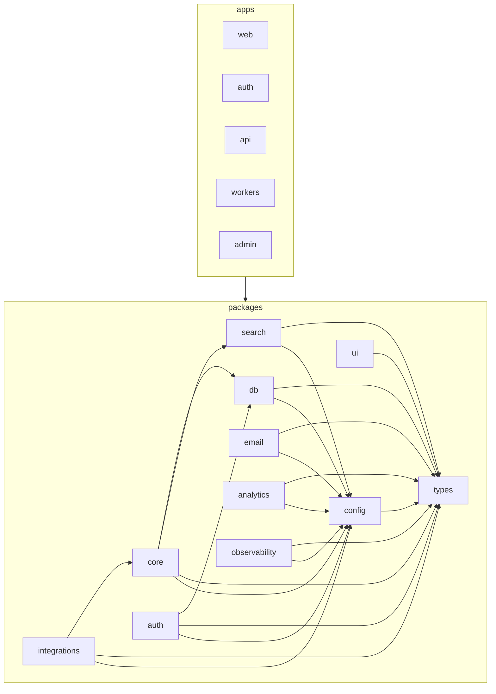

# TruePoint — Architecture Map

> **Status:** `live` · **Generated from:** [`docs/architecture-map.json`](./architecture-map.json)
> (run `node .claude/hooks/gen-architecture-map.mjs` — or `bun run arch:map` — to refresh). **Paths come
> from the JSON (generated); do not edit paths here by hand.** One-line purposes and the Mermaid graph are
> authored here. Format spec: `enterprise-architecture/reference/navigation-map-spec.md`.

> **Live end-to-end — the customer app, the dedicated auth IdP, the platform-admin console, and the worker
> tier are all real code.** Backend/contract coverage now spans the M0–M5 MVP (auth round-trip · import ·
> reveal & credits · enrichment/verification/scoring · compliance) **plus** M7–M9 (activity timeline +
> engagement scoring, Sales-Nav HITL capture, the suppression-gated outreach send engine), and the later
> waves: **search** (query-semantics core + `SearchPort` + `/search/*` + the Prospect rail, ADR-0035),
> **record customization** (custom fields, tags, pipeline stages — ADR-0028), **saved searches**,
> **account/company search + firmographics**, **bulk enrichment** (match-first `MatchPort`: overlay real +
> master-graph stub, ADR-0037/0038), **bulk contact actions** + **XLSX/template import**, the **M12 email
> subsystem** (per-tenant sending domains + DNS auth, connected mailboxes, send-gate over the M9 engine,
> tracking + deliverability + warmup + governance), the **AI intelligence layer** (NL→`ContactQuery`
> compile with prompt-injection + budget guards, ADR-0023), **webhooks** (HMAC-signed outbound + SSRF
> guard), **feature flags** (global + per-tenant override), **enterprise identity** (SSO config, **SCIM 2.0**
> provisioning — ADR-0019, IP-allowlist/MFA-policy/session-timeout auth hardening — ADR-0018/0040, account
> self-service security UI), and the **`apps/admin` staff console** (tenants · users · staff RBAC ·
> provider budgets · feature flags · audit log · system health · time-boxed audited impersonation —
> ADR-0011/0034).
> **The two-layer data model is the spine** ([ADR-0021](./planning/decisions/ADR-0021-global-master-graph-and-overlay.md)):
> the per-workspace **overlay** (`contacts`/`accounts`, RLS-FORCED) is built, and the global **master graph**
> (Layer 0) is now **shipped too** — `schema/masterGraph.ts` (7 tables), the field-grain partitioned
> `provenance_event` (`schema/provenanceEvent.ts`, migration 0089), and the Layer-0 technology/product catalog
> + adoption edge (`schema/masterTechnology.ts`, `schema/masterTechnologyAdoption.ts`, migrations 0100–0102)
> and the canonical signal store (`schema/masterSignals.ts`, migration 0103 — distinct from the tenant-scoped
> `intent_signals`, which it does not replace).
> **Migration 0108 re-plans the graph around one idea: an institution is an institution.** `master_companies`
> gained `org_kind`, so a school is an organization rather than a separate subsystem, and `master_education`
> (`schema/masterEducation.ts`) is the person→organization edge that had nowhere to live — the sibling of
> `master_employment` over the same catalog, kept a separate table because the payloads genuinely differ
> (degree/fields/years vs title/seniority). Alumnus is **derived** from `ended_on`, never a stored flag. The
> same migration dropped the dead `master_companies.technographics` blob (no reader, no writer), leaving
> `master_technology_adoptions` as the single technographics store. `account-intelligence` is the first
> customer-facing read surface over any of it.
> **Migrations 0112–0115 add the `linkedin_api` source program** ([`docs/planning/linkedin-source-ingestion/`](./planning/linkedin-source-ingestion/README.md)):
> firmographic + profile columns, `master_company_identifiers` (the company twin of the 0104 person table),
> the HASH-partitioned `master_company_headcount` monthly series (`schema/masterHeadcount.ts` — growth is
> DERIVED via `lag()`, never stored), and the dark end-to-end landing
> (`core/src/sourceLanding/landSourcePayload.ts`, one `withErTx`: evidence → resolve → suppression guard →
> provenance fold → stints/education/identifiers/series → same-tx events → `job_change`/`headcount_*`
> signals — the first real `master_signals` producer). All default-off behind `LINKEDIN_*` env gates; the
> vendor key itself is a HUMAN GATE. **Amended same day (0116, user instruction):** multi-value
> `master_person_skills`/`master_person_languages` (`schema/masterPersonAttributes.ts` — the C6 gate,
> opened) and typed multi-channel contribution (`master_emails.email_type`; encrypted multi-row
> emails/phones behind `LINKEDIN_CHANNELS_ENABLED`). **Second amendment (0117, the real vendor contract):**
> the `provider_origins` FAILOVER FLEET (`schema/providerOrigins.ts`, app-REVOKEd — sealed per-origin keys)
> + core's origin router/`linkedinSourceClient` (POST `/api/linkedin/{profile,company}`), the customer
> account-refresh lane (`account_refresh` queue behind `LINKEDIN_ACCOUNT_REFRESH_ENABLED`), the
> attributes/headcount read surfaces + prospect-drawer UI, and the admin **data-sources** console.
> **Third amendment (classification-aware failover):** the chain walk (`walkOriginChain`) now classifies
> every failure via `core/reliability/sourceErrorClassifier` (the expo proxy's error contract —
> VALIDATION/REQUEST_ERROR/QUEUE_*/POOL_DEAD/SHUTDOWN/AUTH/… + the LINKEDIN_* capture family), honors
> Retry-After (seconds AND HTTP-date) as a per-origin in-process cooldown (`sourceLanding/originCooldowns.ts`,
> clamped by `ENRICH_ORIGIN_COOLDOWN_MAX_MS`), gives 502-class faults one cheap jittered same-origin retry
> (`ENRICH_ORIGIN_TRANSIENT_RETRIES`), fails over on AUTH/FORBIDDEN instead of stopping the chain, and
> surfaces the smallest horizon as `unavailable{retryAfterMs}` so `fetchAndLandUrl`, the link-fetch sweep
> (hinted skip-flag), and `linkedinApiProvider` (→ `rate_limited` into the waterfall + breaker horizon)
> defer instead of burning attempts. `[CLASSIFICATION] http N retry_after cid` lands in
> `provider_origins.last_error` for the console.
> See the prospect↔company initiative in [`docs/planning/prospect-company-data/`](./planning/prospect-company-data/)
> and the intelligence-platform program in
> [`docs/planning/intelligence-platform/`](./planning/intelligence-platform/).
> **The MV3 browser extension** (`apps/extension`, `@leadwolf/extension`) is the newest surface — a thin,
> least-privilege, compliant-capture client (Vite + CRXJS), built dark, that reuses the shipped `/api/v1`
> ingestion/reveal seam and holds no DB/provider access. Its LinkedIn→contact seam is
> `features/contacts-resolve` (`GET /contacts/by-linkedin/:publicId` — masked, RLS-scoped) + `features/identity`
> (`GET /me`, `/orgs` — display identity + org switcher); companion-tab auth is ADR-0045. Design in
> [`docs/planning/chrome-extension/`](./planning/chrome-extension/) (00–14, incl. `14-implementation-audit` —
> the living shipped-status record) + [ADR-0043](./planning/decisions/ADR-0043-chrome-extension-architecture.md)
> /0044/0045. Build rules live in the three `.claude/skills/truepoint-extension-{architecture,linkedin,auth}` skills.
> **2387 source files · 93 code-bearing domains · 44 shared areas · 0 domain-vocabulary warnings · 2
> unbucketed** (plus the 4 framework-root configs — `next.config.mjs` × 3, `postcss.config.mjs` — which have
> no domain by nature and are expected). **The two unbucketed repositories** —
> `outcomeMetricsRepository`, `usageEventRepository` — are the **deliberate** gaps described under
> "Notes / unbucketed", not a registration backlog: `usageEventRepository` is written by three domains and
> read by the entitlement gate, so any single home would be wrong, and `REPO_DOMAIN`'s own rule is that a
> confidently wrong home is worse than an honest gap. *(This paragraph previously called them a registration
> gap awaiting a generator edit, contradicting the section that explains why they are left alone. Corrected
> 2026-08-22 — the reasoned entry is the one that holds.)* (`provenanceBadgeRepository` left this list
> when the intelligence-platform work registered it under `data-health`; `entitlementRepository` left it
> when the entitlement work registered it; `masterProfileRepository` and the `linkedinCompanyRefresh` queue
> never joined — the 0112–0115 change registered both under `master-sync` in the same commit, per the rule
> that a Layer-0 module belongs to the one system-owned graph; `masterConfidencePolicyRepository` was
> registered under `master-sync` in the same commit that created it, C9. The remaining two are not registered because
> no existing domain is clearly right for them, and the generator's own rule is that a confidently wrong
> home is worse than an honest gap.)
>
> That is down from 155. The backlog was never misplaced code: it was **unregistered** code. The map keys a
> repository off `REPO_DOMAIN`, a queue off `QUEUE_DOMAIN` and a package off an explicit leaf-package list,
> and 151 files simply had no entry — 58 repositories, 13 queue files, and the whole of the **nested TruePoint
> Forge** (the `apps/forge` console + `apps/forge-api` capture-ingest/BFF + `apps/forge-worker` DAG,
> `@leadwolf/forge-core` + `@leadwolf/forge-capture-sdk`, the Forge repos under `repositories/forge/`, and the
> isolated `forge` Postgres schema owned by `leadwolf_forge`), plus `@leadwolf/auth-client` and
> `@leadwolf/identity`.
>
> `forge` is now a declared canonical domain — it has its own apps, its own package and its own Postgres
> schema, so scattering its files across neighbouring domains would have been the dishonest option. The Forge
> console's slices are bucketed as SHARED (like `apps/extension`) rather than minting six new domains
> (overview/captures/source-fetches/parsers/review/sync-status) that would pollute the vocabulary the rest of the map
> navigates by. The leaf-package list stays explicit rather than a catch-all, so a genuinely new package
> shows up unassigned and gets a deliberate decision instead of silently becoming "shared".
> See the generated [`architecture-map.json`](./architecture-map.json) `unassigned[]` / `warnings[]` for the
> current set. Counts reflect the merged tree including the parallel `feat/data-mgmt` work; its new domains'
> prose is owned by that track. Design refs: [04](./planning/04-ui-ux-design.md),
> [10-roadmap.md](./planning/10-roadmap.md), [11 §6](./planning/11-information-architecture.md),
> [16 §5](./planning/16-code-organization.md), ADR-0006/0007/0008/0009/0011/0013/0016/0018/0019/0021/0023/0028/0035/0037/0040.

## Repo tree (live)

```
packages/                       # side-effect-free libraries, each exported via one index.ts  [LIVE]
  types/   src/                 # RFC-9457 errors + Zod contracts (leaf): auth, contacts, billing, intel, compliance,
                                #   activity, outreach, home, search, accountsSearch, aiSearch, bulkActions, bulkEnrichment,
                                #   customFields, dataHealth, email, enrichmentPolicy, featureFlags, identityProvisioning,
                                #   importTemplates, listGovernance, pipelineStages, platformAudit, providerConfigs,
                                #   savedSearch, scim, sso, staffAdmin, tags, webhooks (+ drift-guard tests)
  config/  src/env.ts           # zod-validated env (ONLY process.env reader); key-material + origin-allowlist tests
  identity/ src/                # canonical identity primitives — HMAC blind index · email/domain normalization · stable content hash (dedup kill-list #1/#9)  [LIVE]
  ui/      src/                 # TruePoint design system: tokens/primitives/theme.css + cn + headless kit + shadcn-pattern ui/*
  db/      src/                 # Drizzle schema + RLS + repositories (the ONLY data access)  [LIVE]
    schema/{auth,contacts,billing,intel,compliance,activity,salesnav,outreach,lists,savedSearches,customFields,
            tags,pipelineStages,email,enrichmentJobs,enrichmentPolicy,importMappingTemplates,importPolicy,
            featureFlags,platformOps,scim,webhooks}.ts  rls/*.sql (one per schema, applied sorted)
    client.ts (withTenantTx · withPrivilegedTx · withPlatformTx · closeDb)  applyMigrations.ts  bootstrapAdmin.ts
    repositories/*.ts (one per entity)   test/*.itest.ts (per-DoD, run in separate processes)
  core/    src/                 # domain logic [LIVE]: import · reveal · billing · compliance · enrichment(+bulk) ·
                                #   data-health · scoring · activity · outreach · email · search · ai · home · prospect ·
                                #   sourceLanding (linkedin_api payload→Layer-0 landing, dark; + originCooldowns for the failover chain) ·
                                #   reliability (Retry-After parser · source-error classifier · capped backoff) ·
                                #   customFields · pipelineStages · savedSearches · webhooks · featureFlags · auth · sales-navigator
  auth/    src/                 # self-built auth primitives (no HTTP): login/mfa/registration/invitations/password(+policy/breach) /
                                #   sso/switchWorkspace + ipBinding/ipAllowlist + sessionTimeout + revocation + auditEvent + log
  search/  src/                 # SearchPort adapters + field projection — inMemorySearchPort (dev/test); OpenSearch/Typesense later
  integrations/ src/            # vendor adapters: enrichment (apollo/zoominfo/clearbit/pdl/coresignal/linkedin_api over
                                #   httpProvider — the last three dark until their ToS/DPA reviews) + anthropic NL-search adapter
apps/                           # deployable processes (thin transport adapters)
  api/   src/                   # Hono on Bun — validates the access JWT; never issues tokens  [LIVE]
    middleware/{requestId,authn,tenancy,error,rateLimit,revealRateLimit,idempotency,jobViewer,extensionScope,
                requireRole,requireOrgRole,requireCapability,platformAdmin,syncPrincipal}.ts
    lifecycle.ts                  # drain state shared by server.ts (SIGTERM) and the readiness endpoint
    features/{auth,workspaces,settings,scim,import,import-mapping-templates,reveal,billing,enrichment,enrichment via jobs,
              scoring,compliance,activity,sales-navigator,outreach,email,home,search,account-search,saved-searches,
              tags,pipeline-stages,custom-fields,contacts-bulk,lists,ai,webhooks,admin}/  app.ts  server.ts  instrumentation.ts
  auth/  src/                   # auth.truepoint.in IdP (Next 15) — screens + /token/* + JWKS + account self-service security  [LIVE]
    app/{login,password,magic,mfa(+enroll),signup,verify,sso,org,workspace,forgot,reset,account/security,token,logout}  shared/*  lib/*
  web/   src/                   # app.truepoint.in (Next 15) — AppShell over a (shell) route group  [LIVE]
    app/(shell)/{home,search(+markets),signals,sequences,inbox,reports,lists,imports,data-health,crm-sync,
                 enrichment/jobs,sales-navigator,companies/[accountId],settings/*}  app/{import,prospect,auth/callback}
                                  #   prospect + companies(+markets) are one-release redirect pages — the
                                  #   search-consolidation cutover renamed the destination to /search
    components/{shell/*,search/*} features/{import,prospect,accounts,search,home,sequences,inbox,reports,
                                              lists,signals,notifications,announcements,crm-sync,data-health,
                                              sales-navigator,enrichment-jobs,settings-*}/
                                              lib/{authClient,pkce,publicConfig,problemMessage,maybeList,queryKeys}
                                  #   components/search = the Search shell (drawer · People/Accounts tabs ·
                                  #   ?tab codec). It lives outside features/ so both panes and the composer
                                  #   can import it without closing a cycle (lint:boundaries no-circular).
  admin/ src/                   # admin.truepoint.in internal staff console (Next 15)  [LIVE — was a target]
    components/shell/{AdminShell,Sidebar,TopBar,navConfig,Brandmark}  components/{ImpersonationBanner,EntityPicker,TenantPicker,UserPicker}  lib/{adminGate,authClient,pkce}
    app/(shell)/{tenants,users,billing,plans,pricing,provider-configs,feature-flags,content,retention,staff,compliance,audit-log,imports,extension,system-health}  features/*
  workers/ src/                 # Bun + BullMQ — imports · enrichment · scoring · dsar · outreach · firmographics ·
                                #   dedup · retentionSweep · sequenceTick · tokenRefresh queues + leaderLock +
                                #   mailboxThrottle (Redis token-bucket) + health/logger  [LIVE]
  extension/ src/               # MV3 browser extension (Vite + CRXJS) — thin compliant prospect capture  [LIVE]
  extension/ scripts/           # gen-icons + pack-zip (portable forward-slash zip packer for the admin download)
    background/{index,bus,api,auth,queue,config,telemetry,eventStream,events}  # SW hub: bus·ApiClient·PKCE·IndexedDB queue·SSE
    content/{index,observer,adapters/linkedin,extract,hovercard}              # isolated world: adapter + shadow-DOM hover-card
    ui/{popup,panel}  shared/{messages,storage,idb,client,env,types}  i18n/   # React surfaces · Zod bus · storage · i18n
    manifest.config.ts  vite.config.ts  scripts/gen-icons.mjs                 # least-privilege manifest + build
```

## FEATURE → FILES index (live)

> The JSON currently buckets **89** code-bearing domains; this prose curates **39** subsections over them,
> grouping the small/adjacent ones under the section they serve. The JSON is the complete enumeration — if a
> domain is not written up here, look it up there rather than assuming it does not exist. Paths are authoritative in
> [`architecture-map.json`](./architecture-map.json); the purposes are here. Web slices are
> **destination-keyed** (prospect/sequences/settings-\*), api/core/db are **resource-keyed** (reveal/email/admin)
> — a file has exactly one home; the [Destinations](#destinations-cross-reference) section is where the cross-links live.

### A. Data ingestion, identity & enrichment

#### import — *M1 + XLSX/template/preview expansion* ([05 §3](./planning/05-features-modules.md), ADR-0036)
- **core:** `packages/core/src/import/` — `runImport.ts` (parse→map→normalize→dedup-upsert→provenance),
  `parseFile.ts` (RFC-4180 CSV) + `parseXlsx.ts` (XLSX with ZIP-magic + formula-injection guard + 100K-row/25 MiB caps),
  `columnMap.ts`, `validateRow.ts` (pure per-row verdict, reused by preview + run), `preview.ts` (valid/rejected/duplicate
  counts + bounded sample), `rejectedRowsCsv.ts`, `templates.ts` (save/load reusable column mappings),
  `encryptPii.ts` (AES-GCM, KMS-swappable; `encryptPii.test.ts` pins the roundtrip + the corruption-tolerance
  contract `decryptPiiOrNull` carries for the reveal reads — a poisoned blob masks a field, never throws).
  Normalization, the HMAC blind index and the stable content hash
  come from `@leadwolf/identity` directly — the old `core/import` re-export shims are deleted;
  `piiLogTripwire.test.ts` — guards **`scripts/lint-import-pii-logs.mjs`** (the S-S6 gate, `bun run
  lint:import-pii`), which enforces 13 §3.5: an import- or ingest-path log call carries codes/ids/counts,
  never a raw row. The test pins the gate's ability to FAIL — every `FORBIDDEN` carrier still matches its
  shape, permitted shapes stay unmatched, and roots and carriers stay in step. It lives HERE, not beside the
  script, because CI discovers unit tests with `find packages apps` and anything under `scripts/` would never
  run — worth knowing before adding tooling tests
- **db:** `sourceImportRepository.ts` (per-import provenance + content-hash skip); `importMappingTemplateRepository.ts`;
  `importPolicyRepository.ts` (per-workspace `who_can_import` + strategy defaults, P0 of
  [import-and-data-model-redesign](./planning/import-and-data-model-redesign/README.md)); `jobVisibility.ts`
  (`JobViewer` owner/elevated predicate shared by import/reveal/enrichment job reads — dual-gated
  `JOB_VISIBILITY_SCOPED` + `job_visibility_scoped`, flag-off = workspace-wide as before)
- **api:** `features/import/` (POST `/imports` → `202` + `jobId`; preview; `queue.ts` BullMQ producer; creates gated by
  `requireImportCreateGrant`) · `features/import-mapping-templates/` (mapping-template CRUD, role-gated manage) ·
  `features/settings/` (GET/PUT `/settings/import-policy`, owner/admin + in-tx audit) · `features/import/artifactRoutes.ts`
  (gated proxied download of the repair-CSV/error-report pair) · `middleware/jobViewer.ts` (builds the viewer, fail-closed
  dual gate) · **workers:** `queues/imports.ts` · `queues/bulkImports.ts` (fast kind) · `queues/importReaperSweep.ts`
  (orphan recovery + stall) · `queues/importPromotionSweep.ts` (deferred→queued) · `queues/importNotify.ts` (outbox
  `import.notify` consumer → in-app notification, S-Q4) · `queues/importArtifactSweep.ts` (artifact TTL key-nulling,
  S-S7). Import lifecycle now rides the ADR-0027 transactional outbox
  (`import.rollups`/`import.notify`, G06) — all Phase-1 additions dark behind `IMPORT_V2_ENABLED`. **Phase-2 gate
  code (dark, env-selected):** `packages/integrations/src/storage/s3FileStore.ts` (dependency-free SigV4
  S3-compatible FileStore — Gate B) · `packages/core/src/security/malwareScanner.ts` +
  `packages/integrations/src/security/clamdScanner.ts` (MalwareScannerPort, fail-closed — Gate C) · the Gate-A COPY
  spike in `packages/db/test/bulkImport.pipeline.itest.ts` + nightly soaks (S-P1/S-P4)
- **web:** `features/import/` — `ImportWizard` (file→map→preview→confirm; the dead-end "Large file" toggle is gone —
  server will decide the path), `ImportsLanding` (`/imports` scaffold; `/import` → redirect `/imports/new`),
  `ContactsTable`, `importJob.ts` (poll→UI state), `rejectedRowsCsv.ts`; root `providers.tsx` (TanStack Query seam)

#### enrichment — *M4 provider waterfall + bulk match-first + waterfall v2* ([06](./planning/06-enrichment-engine.md), ADR-0037/0038, 0111)
- **core:** `enrichment/` — `providerPort.ts` (the 06 §3 contract; core OWNS the port), `waterfall.ts` (legacy trust÷cost
  ordering + per-process breaker; still the bulk residual path), `enrichContact.ts` (dual-gated: legacy single-tx body OR
  the v2 branch), `requestHash.ts`, `policy.ts` (auto-enrich guard: trigger + field-allowlist + budget), `jobStatus.ts`
- **core (waterfall v2, 0111 — dark behind `WATERFALL_V2_ENABLED` + tenant flag):** `fieldWaterfall.ts` (PER-FIELD cascade,
  one memoized call per provider, capability filter, verify-before-accept w/ catch-all policy), `enrichContactV2.ts`
  (tx-split orchestration + `resolveProviderOrder`: per-run override → workspace prefs → default), `breakerStore.ts` +
  `providerGate.ts` (injectable ports; in-memory/pass-through defaults), `enrichmentEvidence.ts` (Layer-0 source_records +
  provenance events per winning provider, own withErTx, flag-gated), `sourceImports.ts` (one row per winning provider)
- **core (bulk, ADR-0037):** `enrichment/bulk/` — `matchPort.ts` (the `MatchPort` seam; injects a CandidateFinder, never
  imports db), `overlayMatcher.ts` (real Layer-1 matcher: deterministic ladder → fuzzy_name_company → review/unmatched),
  `masterGraphMatcher.ts` (Layer-0 **stub** until the Citus/OpenSearch/Spark candidate index lands), `estimate.ts`
  (pre-flight cost forecast: sample → extrapolate charged rows × hit rate, a range never a guarantee)
- **core (reliability — shared retry/wait primitives, consumed by enrichment + sourceLanding):** `reliability/` —
  `retryAfter.ts` (the ONE Retry-After parser: delta-seconds AND HTTP-date, injected clock),
  `sourceErrorClassifier.ts` (pure verdict table over the expo proxy's error contract — classification +
  bare-status → permanent(request|origin) | provider_miss | throttled(retryAfterMs) | transient |
  source_down(cooldownMs)), `backoff.ts` (capped exponential, moved from crm-sync/reliability.ts which
  re-exports it)
- **integrations:** `enrichment/{httpProvider,providers}.ts` (Apollo/ZoomInfo/Clearbit **+ PDL/Coresignal/linkedin_api (dark
  until DPA'd keys; linkedin_api's base URL is env-supplied and joins the host allowlist at config time)** VendorSpecs over
  one HARDENED HTTP shape: https+host-allowlist, timeout, size cap; injectable fetch. Status taxonomy:
  429 → rate_limited + Retry-After via core's parser; a vendor-DECLARED no-match status
  (`VendorSpec.noMatchStatuses` — 404 on PDL/Clearbit/Coresignal; never blanket, ZoomInfo/Apollo no-match
  is a 200 body) → definitive zero-cost miss (answered, no breaker strike, no re-buy); other 4xx/5xx → error) +
  `redisBreakerStore.ts`/`redisProviderGate.ts` (fleet-shared breaker + per-provider rate/budget gate enforcing
  `provider_configs`; the breaker also holds the 429 HORIZON key `enrich:breaker:limited:{p}` — a vendor
  Retry-After blocks the provider fleet-wide without an error strike, capped by
  `ENRICH_BREAKER_RATE_LIMIT_HORIZON_CAP_S`) + `zoominfoAuth.ts` (ZoomInfo alone authenticates with a ~60-min MINTED jwt from
  `/authenticate` — PKI-signed assertion or username/password — cached and re-minted pre-expiry behind the
  VendorSpec `resolveApiKey` seam; unconfigured ⇒ the same zero-cost `miss` as an absent key)
- **core (linkedin_api landing, 0112-0115 — dark behind `LINKEDIN_SOURCE_LANDING_ENABLED`):** `sourceLanding/` —
  `mapLinkedinPayload.ts` (pure mapper; the raw-only compliance boundary: pronoun/photos/skills etc. never leave
  `source_records.raw_data`) + `landSourcePayload.ts` (one withErTx: evidence chokepoint → resolve → suppression guard →
  provenance fold → stints/education/identifiers/headcount → same-tx events (D7) → `job_change` +
  `exec_hired`/`exec_departed` (company-subject leadership signals when the title infers c_suite/vp) +
  `headcount_*` signals);
  hooked post-evidence in `enrichContactV2` and driven fleet-wide by `queues/linkedinCompanyRefresh.ts` (leader-locked,
  25/tick @ 6h). db writers: `masterProfileRepository` (master-sync); `masterConfidencePolicyRepository` (master-sync)
  reads the 0107 policy constants for the badge (C9). Design:
  [`linkedin-source-ingestion/`](./planning/linkedin-source-ingestion/README.md) +
  [`market-intelligence/`](./planning/market-intelligence/README.md)
- **THE PRODUCT DATABASE (Layer-0 read seams — `docs/planning/` Layer-0-as-database):** the same graph, read by
  customers. `masterPersonReadRepository` owns `MASTER_PERSON_VISIBLE` (visibility `licensed|coop` + unsuppressed +
  unmerged) — the read-side policy every seam inherits, materialized by 0121's `master_persons.visibility`;
  `masterPersonSearchRepository` is the global keyset/trgm search behind `POST /search/database`;
  `masterChannelReadRepository` serves LICENSED channel values to reveal (pay-once copy onto the overlay).
  core: `prospect/searchDatabase.ts` (withErTx search → withTenantTx `inWorkspace` flags),
  `ingestion/materializeFromMaster.ts` ("Add to workspace" → `landOverlayPerson`), `reveal/masterChannelFallback.ts`.
  web: ONE prospect search covers both — `databaseRows.ts` maps the workspace ContactQuery onto the graph's
  facets and adapts a database person into a grid row; `useProspectSearch` merges owned rows first, then
  people the workspace does not hold, each carrying an `Add` action (`AddToWorkspaceButton`). There is no
  separate Database tab: "already in my workspace" is a state of a row, not another surface.
  api: `features/contacts-from-database/` — `POST /contacts/from-database`, the workspace-scoped write the `Add`
  action posts to (transport only; the visibility policy and write discipline live in core's materializer, and one
  row per explicit user gesture). Its own slice, so the read path `POST /search/database` and the write stay apart.
- **db:** `providerCallRepository.ts` (cache + cost ledger; 0111 unique `(ws,hash,provider)` + per-field `filled_fields` —
  the old unique silently dropped multi-attempt rows); `enrichmentJobRepository.ts`, `enrichmentPolicyRepository.ts`
  (+`provider_prefs` jsonb + same-tx audit) (*both unassigned — entity not in `REPO_DOMAIN`*) ·
  **api:** `features/enrichment/*` (+ 202 producer behind `ENRICHMENT_ASYNC_ENABLED`) · **workers:** `queues/enrichment.ts`
  (factory w/ Redis deps + throttle deferral — jittered UP over the vendor delay, capped at
  `ENRICH_MAX_DEFERRALS`, PARKED past `ENRICH_DEFER_MAX_DELAY_MS` so a daily-budget 86400s Retry-After
  never piles up delayed jobs) · **web:** `settings-enrichment/ProviderPriorityPanel` (arrow-reorder per-field
  priority + verification knobs) · **admin:** provider stats block (30d hit/verified-valid/latency/cost per provider)

#### enrichment-jobs — *bulk enrichment job UI* (web; ADR-0039)
- **web:** `features/enrichment-jobs/` — `EnrichmentJobsPage` + `JobDetailDrawer` over `useEnrichmentJobs`/`useEnrichmentJobDetail`;
  GET-only surface (read the per-job ledger; the surface never mutates). Routed at `(shell)/enrichment/jobs`.

#### data-health — *M4 verification + data-quality score + freshness re-verification* ([06 §9](./planning/06-enrichment-engine.md), ADR-0013/0025)
- **core:** `data-health/` — `emailVerifier.ts` (verifier port; passthrough + fixture + `hybridVerifier`),
  `reacherVerifier.ts` (Reacher adapter + `defaultEmailVerifier` config-gated factory; injectable fetch),
  `emailPrescreen.ts` (`localPrescreenVerifier` — zero-network role/disposable short-circuit wrapped around the verifier to skip paid probes),
  `reverifyContacts.ts` (`runReverification` — re-grade revealed, past-SLA contacts via the configured verifier),
  `validatePhone.ts` (E.164), `phoneVerifier.ts` (phone verifier port + format-only default),
  `twilioPhoneVerifier.ts` (Twilio Lookup adapter + `defaultPhoneVerifier` config-gated factory; carrier-confirmed valid/invalid),
  `chargeFor.ts` (ADR-0013 charge-by-verified-result), `dataQualityScore.ts`
  (the 0.4·completeness + 0.3·verification + 0.3·freshness formula; cold-start rules for imports),
  `dataQualitySummary.ts` (`buildDataQualitySummary` — the per-workspace fill/verification/freshness count rollup the Data Health dashboard reads),
  `dataQualitySnapshot.ts` (`captureDataQualitySnapshot` — persists a daily WorkspaceDataQuality trend point),
  `badgeV1.ts` (confidence badge v0 over provenance aggregates; `now` injected so it stays pure),
  `confidencePolicy.ts` (C9, decisions.md 2026-08-19: `badgeHalfLifePolicy` — the badge's table-sourced
  half-life constants; gated `CONFIDENCE_POLICY_BADGE_ENABLED`, 5-min cached, undefined-on-failure so the
  hardcoded constants always remain the fallback),
  `jobChange.ts` (`detectJobChange` — compares CONFIDENCES, not timestamps; a departure is held to the same
  bar as a move) + `recordJobChange.ts` (the producer: intent_signal + alerts to users who SAVED the contact),
  `successor.ts` (`rankSuccessors` — who now holds a departed contact's role; seniority is a DISTANCE on the
  ladder, unknown scores neutral, and weak suggestions are dropped rather than shown),
  `runJobChangeSweep.ts` (the per-workspace runner behind the job-change sweep — composes detect + record and
  re-decides nothing; the tenant-side PRIOR is priced with the default method prior and one source, so a
  strong new claim clears the bar and a weak one cannot)
- **workers:** `reverification.ts` (per-workspace re-verification job), `reverificationSweep.ts` (leader-locked
  daily fan-out enqueuing a per-workspace re-verification for every workspace with stale revealed contacts),
  `dataQualitySnapshotSweep.ts` (leader-locked daily capture of a per-workspace Data Health trend point),
  `jobChangeSweep.ts` (leader-locked S-13 fan-out, DARK behind `JOB_CHANGE_SWEEP_ENABLED` — owner-conn census
  of workspaces whose Layer-0 employment moved since a Redis watermark, then per-workspace `withTenantTx`
  batches. An ABSENT watermark starts at NOW and fans out nothing, so a Redis loss misses changes rather than
  replaying history as an alert storm; the watermark advances only on a fully drained tick)
- **db:** `verification_jobs` (the re-verification audit ledger — one row per completed run, workspace-scoped RLS;
  `verificationJobRepository` record/listRecent; migration 0022) — written by `runReverification` (PLAN_06);
  `data_quality_snapshots` (the Data Health TREND store — `dataQualitySnapshotRepository`; migration 0023);
  `jobChangeSweepRepository` (no tables of its own — the sweep's data access: the owner-conn cross-tenant
  census and Layer-0 fact read, kept apart from the RLS-enforcing tenant read because "which workspaces hold
  this person" is a question no tenant role may ask);
  `provenanceBadgeRepository` (`badgeFor` — the corroboration half of the S-10 badge, aggregated under
  `withErTx`; `contributor_ref` is counted inside the SQL and never returned)
- **tests:** `jobChangeAlerts.itest.ts` (the producer: watcher fan-out, dedup, unsaved-contact signal) +
  `jobChangeSweep.itest.ts` (the layer above it: the watermark bounds the census, the owner-conn fact read is
  workspace-scoped where RLS is NOT the wall, only primary+current edges count, and the runner composes end
  to end against real columns)

#### reveal — *M1 masked reads + M3 money loop + no-charge revealed reads + in-list reveal + async bulk* ([07 §3](./planning/07-billing-credits.md), ADR-0007/0013/0029)
- **core:** `reveal/revealContact.ts` — the monetized tx: in-tx suppression gate → cross-`reveal_type` dedup
  (`revealCharge.ts` — charge only the NEWLY-uncovered field(s)) → idempotent claim (unique
  `(workspace, contact, reveal_type)`) → `FOR UPDATE` charge against `tenants.reveal_credit_balance` → same-tx
  audit; `reveal/getRevealedContact.ts` — the NO-CHARGE, ownership-checked read (single + batch) that decrypts
  ONLY the fields the workspace owns a claim for
- **db:** `{account,contact}Repository.ts` (overlay reads/writes, masked list — `searchRepository` projects
  `revealedTypes`); `revealRepository.ts` (claim + usage + owned-field / claim reads + batched hydration)
- **multi-value channels (import-and-data-model-redesign Phase 3 — dark behind the `CHANNEL_DUAL_WRITE` /
  `CHANNEL_READ_FROM_CHILD` dual-gate pairs):** `contact_emails`/`contact_phones` child tables
  (`schema/contactChannels.ts`, encrypted + blind-indexed, one-live-primary, E.164 on phones) ·
  `contactChannelRepository.ts` + `packages/core/src/channels/` (`applyChannelWrite` = the CH-INV-1 single
  write path: child upsert + flat primary-cache projection in one tx; backfill + reconcile runners) · worker
  sweeps `queues/channelBackfillSweep.ts` (flat→child projection, WHERE-missing watermark) and
  `queues/channelReconcileSweep.ts` (permanent drift repair, phase-rule direction). Gate-on, masked contact
  DTOs carry channel summaries, `has_email`/`has_phone` count secondaries, the dedup email rung reads
  `contact_emails.blind_index`, and reveal/export go primary-first — uniformly across search/count/resolve/
  dynamic-list membership. Flat columns remain the permanent primary-value cache (never dropped)
- **company children (Phase 4, DDL landed dark — migration 0061):** `account_domains` (clear citext,
  live-unique per workspace) + `account_locations` (hq/branch/office) child tables (`schema/accountChildren.ts`)
  + `accounts.parent_account_id`/`root_account_id` (composite same-workspace FK) + `accounts.deleted_at` (G18);
  write paths/backfills ride the in-flight S-A2 train
- **api:** `features/reveal/*` (masked `/contacts` list; POST `/contacts/:id/reveal` behind Idempotency-Key
  replay, role-gated + burst-limited; GET `/contacts/:id/revealed` + POST `/contacts/revealed/batch` no-charge
  reads; `/credits/reveal-costs`)
- **web (prospect):** `RevealCell.tsx` in-grid reveal (value + copy + badge, or a cost-labelled reveal button) +
  `useRevealStore.tsx` (optimistic single source of truth) + `useRevealedContact.ts` / `CopyButton.tsx` in the
  detail drawer
- **async bulk (Phase 3, ADR-0029/0036; dark behind `BULK_REVEAL_ENABLED`):** `reveal_jobs`/`reveal_job_rows`
  (migration 0050) + `revealJobRepository` + credit `leaseForJob`/`releaseForJob` (recon-safe
  lease→settle→release; pure `leaseAccounting.computeReleaseSplit`); core `reveal/bulk/*` (estimate ·
  create/confirm · drive/chunk runner in `lease` settle-mode + finalize/release); worker `queues/bulkReveal.ts`;
  api `/reveal-jobs/*` (create · confirm-lease · cancel · pause/resume · download); web `BulkRevealJobDialog.tsx`
  (select-all → job → live progress → CSV). See `docs/planning/reveal-experience/` + ADR-0042.
- **realtime (Phase 4, ADR-0027; dark behind `REALTIME_SSE_ENABLED`):** the domain-event transactional outbox
  (`event_outbox` migration 0051 + `eventOutboxRepository`, appended IN the reveal tx) → the leaderless relay
  (`apps/workers/realtimeRelay.ts`, outbox → Redis pub/sub) → the authenticated SSE gateway (`features.events`
  api `GET /events/stream`, streamSSE, workspace-scoped) → the web `lib/eventStream` fetch-reader + shell
  `RealtimeBridge` that reconciles balance + reveal state live. Shared contract: `@leadwolf/types/realtimeEvents`.

### B. Prospect & account data surface

#### prospect — *the People pane of the Search destination* ([05](./planning/05-features-modules.md), ADR-0035)
> **Renamed surface, same slice.** The destination is now **`/search`** ([search-consolidation](./planning/search-consolidation/README.md),
> operator decision 2026-08-21): `ProspectPage` became `PeoplePane` and the folder keeps its `prospect`
> name because the JSON buckets by path and the slice's contents did not move. `/prospect` is a one-release
> redirect page.
- **core:** `prospect/` — `dedup.ts` (per-workspace soft-pointer dedup: canonicalName + registrableDomain grouping),
  `accountSearch.ts` (workspace-visible account result count), `firmographics.ts` (roll intent_signals → account facets:
  technologies from tech_install slugs, fundingStage from latest funding_round), `bulkActions.ts` (batch apply to
  workspace-visible ids + audit), `tags.ts`, `lists.ts`,
  `contributionGate.ts` (`evaluateContribution` — may this row MINT a node in the SHARED graph? Gates the
  mint only: a denied row still LINKs to what the graph already holds. An opt-OUT over the ADR-0021 identity
  mint, not an opt-in — decisions.md D13), `backfillMaster.ts` (applies that gate per row),
  `confidence.ts` — ⚠ **the DORMANT confidence engine** (Noisy-OR over `master_confidence_policy`; zero
  production callers. The LIVE one customers see is `packages/types/src/confidence.ts` via
  `buildConfidenceBadgeV1` — audit 32 §9D) + `confidenceDivergence.test.ts`, which measures the two against the
  real seeded 0107 policy rows: switching engines is a **redistribution**, provider-sourced records +0.20 to
  +0.26 and crawl-sourced −0.10, not a uniform lift. **Read that test before proposing to unify them**;
  `fieldProvenance.ts` (the pure provenance fold)
- **web:** `features/prospect/` — masked grid + `RecordDetail`/`QuickViewDrawer` slide-overs + `RevealDialog` (`entries/bulk.ts` +
  `entries/accounts.ts` are the slice's NAMED public entry points — perf-checklist PA-2: borrowers (/lists, /companies) import
  through them instead of the 39-export main barrel, sanctioned by depcruise's `entries/*` allowance); **bulk
  reveal** (`useBulkSelection` — an external useSyncExternalStore store so a checkbox toggle re-renders 1-2
  subscribing checkboxes (`SelectionControls.tsx`) instead of the page, `BulkActionBar` (mounted via a
  subscribing host), `BulkRevealDialog`, pure `bulkReveal.ts` policy: stop on 402 / skip 403);
  **filter rail** (`FilterPanel`/`AccountFilterPanel` over `filterGroups.ts`/`accountFilterGroups.ts` — the
  MVP-era client-side `FilterRail` was deleted by the search-consolidation cutover, dead since the
  server-search rewrite; both panels now render inside the shared `components/search` drawer, with
  `FacetTypeahead` (server-backed value picker over `searchApi.ts`) + the shared progressive-exclude pattern
  `TermFacetField` (include by default, exclusion opens its own labelled block) + `TermOptionChips` +
  `hooks/useDraftRange.ts` (keystroke buffer for both panels' range/date inputs — commits to the query, i.e. the
  cache key for search/facets/count, after a quiet 400ms or on blur, so typing a bound is 1 search, not one per digit));
  **AI search** (`AiSearchBox` + `ParsedFilterPreview`);
  **accounts** (`AccountsTable`/`AccountFilterPanel`/`AccountDetailDrawer` over `accountSearchApi.ts`); **stages/tags**
  (`StageSelector`/`StageManagementPanel`, `TagChip`/`TagPicker`/`tagColors`); `export.ts` (masked CSV, no PII);
  `searchUrlState.ts` (shareable/bookmarkable query, `q`/`sort`/`f`); `savedSearchApi.ts` +
  `RecentSearches`/`SaveSearchPanel`; mounted by `features/search` at `(shell)/search`

#### search (web) — *the Search destination's composer* ([search-consolidation](./planning/search-consolidation/README.md))
- **web:** `features/search/` — `SearchSurface.tsx` only. It owns the active tab (URL) + the drawer's
  collapsed state (localStorage) and mounts **one** pane: `PeoplePane` (`features/prospect`) or
  `AccountsPane` (`features/accounts`). Mounting one rather than both is the point — the retired
  two-scopes-mounted arrangement needed an `enabled` flag threaded through every hook to stop the hidden
  scope firing four wasted round-trips per visit.
- **shared:** `components/search/` — `SearchDrawer` (collapsible rail; 40px strip collapsed, off-canvas
  overlay ≤768px with scrim + focus return + `inert`), `SearchTabs`, `useDrawerCollapsed`
  (localStorage `tp.search.drawer`, read in an effect — reading at render is a hydration mismatch),
  `useSearchTab` + `searchTabUrlState` (the `?tab` codec, which writes without touching either pane's
  query params — the property `searchTabUrlState.test.ts` asserts). It sits outside `features/` so both
  panes and the composer can import it without closing an import cycle.

#### accounts — *the Accounts pane + the routed company profile* (was `features/companies`, MI-1)
- **web:** `features/accounts/` — `AccountsPane.tsx` (the Accounts tab: firmographic filter panel in the
  shared drawer + results grid, over the `aq`/`asort`/`af` codec), `CompanyPage.tsx` (`/companies/:accountId`,
  still a route until the profile drawer lands), `MarketsBoard.tsx` (`/search/markets`), `PostingsSection.tsx`,
  `hooks/useCompany.ts`, `api.ts`. **STAGE 1 SCOPE:** the pane searches the WORKSPACE's `accounts`; searching
  the global `master_companies` graph is stage 2, behind `DATABASE_COMPANY_SEARCH_ENABLED`.
- **core:** `accounts/` — `accountBackfill.ts`, `accountDualWrite.ts`, `accountRead.ts`, `countryToIso.ts`

#### account-search — *company-side search/facets API* (ADR-0035)
- **api:** `features/account-search/*` — `GET` account search / facets / typeahead (firmographic facets: industry,
  technologies, employee_band, funding). Backed by `accountSearchRepository.ts` (*unassigned repo*).

#### scoring — *M4 model + M8 engagement* ([ADR-0008](./planning/decisions/ADR-0008-lead-scoring-model.md))
- **core:** `scoring/computeScore.ts` (ICP fit + intent + engagement → versioned `scores` row; trigger syncs `contacts.priority_score`)
- **db:** `{score,intentSignal}Repository.ts` · **api:** `features/scoring/*` · **workers:** `queues/scoring.ts`

#### activity — *M8 timeline* ([03 §7](./planning/03-database-design.md))
- **core:** `activity/logActivity.ts` (tombstone-aware append, one tx) · **db:** `activityRepository.ts` (+ `last_activity_at` trigger)
- **api:** `features/activity/*` (GET/POST `/contacts/:id/activities`)

#### sales-navigator — *M7 HITL link capture* (ADR-0009)
- **core:** `sales-navigator/{captureLink,parseLink}.ts` · **db:** `salesNavLinkRepository.ts` (dedup on workspace+url)
- **api:** `features/sales-navigator/*` · **web:** `features/sales-navigator/` (`CaptureForm` + `LinksTable`; a human pastes the link)

#### lists — *static prospect lists + bulk add-to-list* ([list-plan](./planning/list-plan/00-overview.md))
- **db:** `listRepository.ts` (owner-gated mutations; `visibleContactIds` cross-workspace guard); `schema/lists.ts` (`lists`/`list_members`)
- **api:** `features/lists/*` · **web:** `features/lists/` (`ListsPage`/`ListDetailPage`/`ListFormDialog`/`ImportIntoListDialog`); `(shell)/lists`

#### tags — *cross-list record labels* (ADR-0028)
- **core:** `prospect/tags.ts` (case-insensitive per-workspace name uniqueness) · **db:** `tagRepository.ts` (*unassigned*),
  `schema/tags.ts` (`tags` + `record_tags`; color is a brand-palette KEY, not hex) · **api:** `features/tags/*`

#### pipeline-stages — *workspace deal stages mapped to outreach_status* (ADR-0028)
- **core:** `pipelineStages/manageStages.ts` (one-to-one map to the canonical `outreach_status`; at-most-one default)
- **db:** `pipelineStageRepository.ts` (*unassigned*), `schema/pipelineStages.ts` (`maps_to_status` CHECK mirrors the enum)
- **api:** `features/pipeline-stages/*` · **web:** in `features/prospect/` (`StageManagementPanel`/`StageSelector`/`stagesApi`)

#### custom-fields / customFields — *typed record customization (jsonb, not EAV)* (ADR-0028)
- **core:** `customFields/` — `manageDefinitions.ts` (immutable key/entity/type), `setValues.ts` (validate + merge into jsonb),
  `validateValue.ts` (pure per-type validation, reused by import) · **db:** `customFieldRepository.ts` (*unassigned*),
  `schema/customFields.ts` (`custom_field_definitions` + `custom_fields` jsonb on contacts/accounts)
- **api:** `features/custom-fields/*` · **web:** `features/settings-custom-fields/` (`CustomFieldsPanel`)

#### saved-searches / savedSearches — *persisted ContactQuery filters* (M8, ADR-0035)
- **core:** `savedSearches/savedSearches.ts` (thin; most logic in db) · **db:** `savedSearchRepository.ts` (*unassigned*),
  `schema/savedSearches.ts` (filters as jsonb ContactQuery, re-run never SQL-parsed; visibility private/workspace)
- **api:** `features/saved-searches/*` · **web:** in `features/prospect/` (`savedSearchApi`/`SaveSearchPanel`/`RecentSearches`)

#### contacts-bulk — *batch actions on search results* (ADR-0036)
- **api:** `features/contacts-bulk/*` — bulk tag/owner/status/archive/enroll/add-to-list/enrich/reveal over
  workspace-visible ids (core logic in `prospect/bulkActions.ts`; audited per closed enum) · **web:** `prospect/bulkActionsApi.ts` + `BulkActionBar`

### C. Outreach & email

#### outreach — *M9 sequences + the suppression-gated send engine* ([08 §3/§6](./planning/08-compliance.md), ADR-0009/0013)
- **core:** `outreach/` — `createSequence.ts`, `enrollContact.ts` (revealed-only + `assertNotSuppressed` in-tx + idempotent),
  `sendStep.ts` (the compliance-critical send tx: CAN-SPAM identity BLOCKED-not-warned, suppression re-checked, footer
  appended, audit), `handleBounce.ts` (replay-idempotent + auto-suppress + ADR-0013 credit-back), `senderPort.ts`
  (`EmailSenderPort`: dev console + test static; the M12 dispatch swaps the port without touching the send tx)
- **db:** `{sequence,outreachLog}Repository.ts`; `schema/outreach.ts` (sequences→steps→log; unique (sequence,contact) = enrollment idempotency)
- **api:** `features/outreach/*` · **workers:** `queues/outreach.ts`

#### sequences — *outreach builder + enrollment + send UI* (web; ADR-0009)
- **web:** `features/sequences/` — `SequenceList`/`SequenceBuilder` (CAN-SPAM identity up front), `EnrollmentPanel` +
  `EnrollmentLogTable`, `DraftReviewPanel`, `SendStatusDashboard`, `TemplatesPanel`; `(shell)/sequences`

#### email — *M12 email subsystem (sending domains, mailboxes, send-gate, tracking, deliverability)* ([14](./planning/14-phase-1-execution.md), email-planning)
- **core:** `email/` — `sendingDomains.ts` (create + DNS-verify SPF/DKIM/DMARC per-tenant domains) + `dnsAuth.ts`
  (verify against an injected DnsResolverPort), `connectMailbox.ts` (workspace mailbox + KMS-envelope-encrypted credential)
  + `secretStore.ts` (AES-256-GCM versioned envelope), `resolveSendingIdentity.ts` (own mailbox + verified domain or refuse),
  `dispatchOutreachSend.ts` (P1 send-gate: verify identity + consume tenant send-quota in tx + per-mailbox
  rate-throttle check, then M9 `sendStep` unchanged; a throttle denial refunds the quota and defers the send),
  `providerAdapter.ts` (ESP adapter seam — **dark default `consoleSender`, no network until an SES/Google/SMTP adapter is wired**),
  `templates.ts` + `renderTemplate.ts` (**P2 editor:** versioned owner-scoped templates — create/update +
  `getTemplate`/`listTemplateVersions`/`restoreVersion` (immutable append-only versions) + keyset-paginated
  `listTemplates` + `previewTemplate` (server-side safe render: HTML-escaped single-pass `{{merge}}`, canonical
  `allowedKeys` whitelist); D8 owner-only edits, IDOR→404),
  `sequenceScheduler.ts` (leader-locked tick: claim due enrollments `FOR UPDATE SKIP LOCKED`), `trackingToken.ts`
  (signed opaque open-pixel/click token), `ingestTrackingEvent.ts` (idempotent event → projects open/click to activities),
  `deliveryWebhook.ts` (HMAC-verified ESP webhook → delivery/bounce/complaint), `deliverabilityAnalytics.ts`
  (workspace aggregates; reply-rate primary, opens MPP-inflated), `warmup.ts` (deterministic ramp curve), `governance.ts`
  (staff-only global suppression + per-tenant send-quota); **P1 OAuth + Gmail send (new):** `signingKeys.ts` (P0
  per-tenant webhook/tracking key derivation — closes the global-secret forgery), `pkce.ts` + `oauthProvider.ts`
  (provider-agnostic connect seam + registry + injectable HTTP port) + `googleOAuth.ts` (Gmail OAuth:
  authorize/exchange/refresh/revoke/identity; scopes `gmail.send`+`gmail.readonly`), `mailboxConnectFlow.ts`
  (start/complete connect handshake — single-use state, send-scope-downgrade reject, encrypted token vault),
  `gmailSend.ts` + `mimeMessage.ts` (Gmail `messages.send` adapter realizing the M9 `EmailSenderPort`: RFC 5322
  build + stable Message-ID threading key + CR/LF header-injection guard), `mailboxTokenProvider.ts`
  (send-time token loader — the D7-sanctioned server-side credential read-back: decrypt + proactive-refresh +
  rotate, `invalid_grant`→`reauth_required`), `registerProviders.ts` (`registerEmailProviders` — wires the
  OAuth provider + Gmail send adapter at api/worker boot; `resolveSender` falls back to dark `consoleSender`
  until then), `recordOutboundMessage.ts` (best-effort, post-`sendStep`: find-or-create the conversation thread +
  persist the outbound `email_message` w/ the rfc822 Message-ID — never fails a sent email; outbound rows store
  the tenant's own from-address, recipient via `contact_id`); **per-mailbox throttle + token refresh (new):**
  `tokenBucket.ts` (pure refill-then-consume token-bucket algorithm) + `mailboxThrottle.ts` (the
  `MailboxThrottlePort` seam + `allowAllThrottle` default + `MailboxThrottledError`), `refreshDueMailboxTokens.ts`
  (the leader-locked sweep body: owner-connection id-only scan of mailboxes near expiry → per-mailbox
  tenant-scoped refresh, each failure isolated)
- **db:** `schema/email.ts` (`sending_domain` TENANT-scoped + globally unique; `mailbox_integration` WORKSPACE-scoped +
  encrypted credential **+ P1 OAuth token-lifecycle cols** `oauth_expires_at`/`oauth_scopes`/`provider_account_id`/
  `reauth_required`/`reauth_reason`; `oauth_connect_state` **(new, P1)** short-lived CSRF+PKCE handshake, RLS
  ENABLE-not-FORCE for the session-less callback; `email_thread`+`email_message` **(new, P1/P3)** the conversation +
  per-message store — workspace+owner-scoped (D8), encrypted body (D7), `rfc822_message_id` reply-threading key;
  `email_event` firehose **+ `reply`/`auto_reply` event types**; `outreach_log.last_reply_at` cache) + migrations
  `0020_new_patriot`/`0021_far_blob` (additive); repos `mailboxRepository`/`sendingDomainRepository`/
  `emailEventRepository`/`emailTemplateRepository`/`emailAnalyticsRepository`/`sendQuotaRepository`/
  `oauthConnectStateRepository`/`emailThreadRepository`/`emailMessageRepository` (*all unassigned*)
- **api:** `features/email/` — `routes.ts` (mailboxes **+ `POST /mailboxes/connect/start`**, sending-domains, verify,
  reports), `templateRoutes.ts` (**P2: GET `/`(paginated)·`/:id`·`/:id/versions` + POST `/`·`/:id/preview`·`/:id/restore` + PATCH `/:id`**),
  `webhookRoutes.ts` (PUBLIC session-less: ESP delivery webhook + open-pixel +
  click-redirect), `connectRoutes.ts` **(new, P1: PUBLIC session-less OAuth `connect/callback`)**, `oauthProviders.ts`
  (side-effect provider registration from env)
- **workers:** `queues/outreach.ts` (real-send path: flag-gated `dispatchOutreachSend`, `MailboxThrottledError`
  → clamped re-enqueue, never a double-send) + `queues/tokenRefresh.ts` (leader-locked `email_token_refresh`
  repeatable sweep, every 2 min) + `mailboxThrottle.ts` (Redis atomic-Lua token-bucket adapter realizing
  `MailboxThrottlePort`, keyed `email:throttle:{mailboxId}`); both wired in `register.ts`
- **web:** `features/settings-mailboxes/` (connect mailbox + sending-domain DNS records + send-quota) + `features/settings-enrichment/` (auto-enrich policy)

#### inbox — *M9 unified replies + tasks* (web)
- **web:** `features/inbox/` — `ThreadList` + `ThreadView` over `useInbox`, `TasksPanel` over `useTasks`; `(shell)/inbox`

#### crm-sync — *bidirectional Salesforce/HubSpot sync — DARK by four gates* ([crm-sync plan](./planning/crm-sync/00-enterprise-implementation-plan.md), [runbooks](./planning/crm-sync/_runbooks/crm-sync-operations.md))
- **core:** `crm-sync/` — `port.ts` (`CrmConnector`: OAuth + data plane + webhook verify; injectable `CrmFetch`),
  `connectCrm.ts` (auth-code + PKCE; the callback compares the handshake's tenant against the VERIFIED session,
  SSRF- **and** allow-list-validates the provider-returned `instanceUrl`, refuses a broadened scope grant),
  `crmSecretStore.ts` (AES-256-GCM versioned envelope under its OWN `CRM_SECRET_KEY` — one key per credential
  class), `transforms.ts` (CLOSED registry — a name, never code; an unknown name REFUSES rather than passing
  the raw value through), `planInboundMerge.ts`/`planOutboundPush.ts` (pure per-field ladders),
  `runCrmPush.ts`/`applyInboundEvent.ts`/`runCrmPull.ts`/`runCrmErase.ts` (the IO shells: gate ladder,
  suppression walls both directions, content-hash loop guard, monotonic watermarks),
  `crmBudgetGuard.ts` (proactive per-connection API budget — shared store, FAILS CLOSED),
  `evaluateCrmAlerts.ts` (what does NOT alert is most of it), `publishCrmPushIntent.ts` (outbox intent)
- **db:** `crm{Connection,OauthState,FieldMapping,RecordLink,SyncState,SyncRun,SyncConflict,DeadLetter,Health}Repository.ts`;
  `schema/crm.ts` + `rls/crm.sql` (nine workspace-scoped tables, ENABLE+FORCE RLS; three append-only by
  policy-absence) · migration `0087_crm_sync.sql`
- **api:** `features/crm-sync/*` — the authed router (connect/callback/sync-mode/backfill/health reads/mapping
  editor/conflict queue) **plus** the PUBLIC signature-verified provider webhook, mounted BEFORE it
- **workers:** `queues/crmSync.ts` (pull·inbound·push·backfill), `queues/crmSyncSweep.ts` (leader-locked
  delta·reconcile·refresh·alert ticks), `queues/crmErase.ts` (outbound DSAR erase); `crm-sync/` deps factory
  + alert tick + durable dead-letter writer
- **integrations:** `crm-sync/` — HubSpot + Salesforce adapters, the Redis budget store, `connectorsFromEnv` (the one env→credential composition point all three roots build from)
- **web:** `features/crm-sync/` — connections + sync activity + mapping editor + conflict review; `(shell)/crm-sync`
- **admin:** `features/crm-sync/` — the cross-tenant fleet monitor + the poison-job triage console

### D. Intelligence & reporting

#### search — *query-semantics core + SearchPort + `/search/*` + Prospect rail* ([24](./planning/24-advanced-search-exploration-ux.md), ADR-0035)
- **core:** `search/` — `normalizeTitle.ts` (freetext → stable key: "CEO" ≡ "Chief Executive Officer"), `canonicalizeTitle.ts`,
  `expandQuery.ts` + `expandTitleFilters.ts` (synonym sets), `titleTaxonomy.ts` (seed taxonomy; prod backfilled from O*NET/ESCO),
  `planTitleFilter.ts` (selected values → an engine-agnostic match plan)
- **search (pkg):** `fields.ts` (project rows → searchable facets), `inMemorySearchPort.ts` (dev/test adapter proving the
  contract: term filters, free-text, suggest, facet counts, keyset paging) · **types:** `search.ts` (the `SearchPort` contract)
- **api:** `features/search/` — `routes.ts` (`/search/{contacts,suggest,facets}`), `searchPortProvider.ts` (wires the active port),
  `searchReadCache.ts` (+test — the S5 generation-keyed read-through for facets/count/suggest; TTLs in env, keys fold
  `v{N}` from `lib/searchVersion.ts`, whose `bumpSearchVersion` binds @leadwolf/integrations `searchCacheBump.ts`
  (+test) — the shared fail-open INCR the workers also emit from register.ts on completed search-mutating jobs)

#### ai — *NL→ContactQuery compile with guards* (M14, ADR-0023)
- **core:** `ai/` — `aiPort.ts` (the `parseSearchQuery` contract; core owns the port), `compileSearchQuery.ts`
  (inject-guard → budget-reserve → port → re-validate against `contactQuery` schema), `promptGuard.ts` (`sanitizeNlQuery` +
  cheap `looksLikeInjection` no-spend gate), `budgetGuard.ts` (per-tenant daily ceiling, reserve-before-call + refund-on-failure)
- **integrations:** `anthropic/nlSearchAdapter.ts` (the provider adapter behind the port)
- **api:** `features/ai/` — POST `/ai-search` (returns a validated `query` + notes; human confirms before applying), `aiPortProvider.ts`
- **metering (M14 / 13a Area 14):** `ai_requests` table (mig 0039 + rls/aiRequests.sql) + `aiRequestRepository` (append + `usageSince` platform rollup); `/ai-search` logs each call best-effort (task/model/outcome/latency/tokens — NL text never stored; the Anthropic adapter surfaces `usage`) · **types:** `aiUsage.ts` (`aiRequestOutcome`). Staff `GET /admin/ai-usage` (audited `admin.ai_usage`, coarse-gated) + admin `ai-usage` cockpit (window + per-tenant table).

#### home — *the cockpit destination* (web + api + core)
- **core:** `home/buildHomeSummary.ts` (fan-out over domain repos in one `withTenantTx`) + `data-health/dataQualitySummary.ts`/`dataQualitySnapshot.ts` · **api:** `features/home/*` (GET `/home/summary`, `/home/data-quality`, `/data-quality/history`, `/data-quality/reverification-runs`)
- **web:** `features/home/` — KPI tiles + cards (recent reveals, hot leads, **data health** + freshness trend, burn sparkline, imports, enrichment, sequence
  snapshot, activity feed) + `QuickActionsRow`/`TasksCard`/`RepliesCard`; `(shell)/home`

#### account-intelligence — *the customer READ surface over the Layer-0 graph* (mig 0108)
- **types:** `accountIntelligence.ts` — the contract both sides derive from. The develops/uses split is a
  **discriminated union on `relationship`** with genuinely different arms (ownership/started_on vs
  detection_method/first_seen/last_seen/source_count), so code that conflates the two facts cannot typecheck;
  both responses are egress-validated with `.parse()`. `master_company_id` is deliberately absent from the
  education row — nothing renders it, and a stable Layer-0 id handed to every tenant is a cross-tenant
  correlation key for no gain (a `resolved` boolean carries what the UI needs)
- **api (contact side):** `/contacts/:id/{education,employment,provenance,signals}` — same two-transaction
  shape (tenant resolve under RLS → `withErTx`), except `signals`, which reads the TENANT-private
  `intent_signals` and so crosses no wall at all. `/accounts/:id/{displacement,alumni}` and
  `/accounts/:id/technologies/:techId/peers` add a THIRD leg: traverse Layer 0, then map the result back
  through the overlay under RLS, so a graph-wide answer becomes "which of MY records" and Layer-0 ids never
  leave the server
- **web:** the UI lives in `features.prospect.web` (destination-keyed — see
  [Destinations](#destinations-cross-reference)): `accountIntelligenceApi.ts` (every read), plus per surface —
  ACCOUNT drawer: `hooks/useAccountTechnologies.ts` + `components/AccountTechnologySections.tsx` (one cache
  entry PER relationship, so develops and uses can never overwrite each other; "Builds" and "Runs", never one
  merged list) and `components/AccountGraphSections.tsx` (displacement + alumni, which HIDE themselves when
  they have nothing to report — a permanent empty panel on every account is noise, and "0 alumni" on a
  company is nonsense rather than emptiness); CONTACT drawer: `EducationSection`, `EmploymentSection` (a
  company LIST, not a timeline — the import mints a bare edge with no title or dates), `ProvenanceSection`
  (the confidence model, free, on a record you already own) and `SignalsSection`, each with its hook.
  `orgKindCopy.ts` keeps the drawer from calling a university a company. Unmatched records render an explicit
  "not matched to the graph yet" rather than an empty list — "we hold nothing" and "we have not identified
  this record" are different facts and the UI never asserts the first when only the second is true
- **api:** `features/account-intelligence/` — `routes.ts` (GET `/accounts/:accountId/technologies?relationship=develops|uses`,
  `?fields=vendors` expands each technology's creator). **Two transactions, in order:** `withTenantTx` resolves the account
  inside the caller's workspace (RLS decides visibility, and yields `master_company_id` — the only bridge into Layer 0), then
  `withErTx` reads Layer 0 for that one resolved id. The client never supplies a master id, which is what keeps the shared
  graph un-addressable. `relationship` is **required**: "what does this company build" (`master_technology_vendors`) and
  "what does it run" (`master_technology_adoptions`) are different facts from different tables, so the ambiguous question
  is a 400, never a merged list. An account ER has not yet bridged returns `resolved:false` rather than a bare empty list
- Opposite direction from `master-sync` across the same wall: that domain is the Forge→Layer-0 **write** ingress, this is
  the tenant-facing **read**. Reads only — no credit spend, no personal data (technology/vendor rows describe organizations)

#### alerts — *the tenant signal feed substrate* (market-intelligence MI-S5/S6, [S-13][S-09][S-14]; DARK behind `SIGNAL_FANOUT_ENABLED`)
- **api:** `features/alerts/` — `watchlistRoutes.ts` (/api/v1/watchlists: CRUD + members + PUT
  /:id/subscription — the CALLER's subscription only, claims.sub, never a body-supplied user) ·
  `signalRoutes.ts` (GET /api/v1/signals — the tenant_signals feed read, optional accountId filter;
  never Layer 0)
- **web (destination-keyed siblings):** `features/signals/` — the `/signals` rail destination:
  family-filtered feed + watchlists panel (create/delete, per-user family subscription chips hydrated
  from `myFamilies`); honest empty states while the pipeline is dark; `account_signal` notifications
  deep-link here · `features/accounts/` (was `features/companies` — renamed by the search-consolidation
  cutover) — the routed `/companies/:accountId` page (MI-1): the account drawer's content on a canonical
  URL — firmographic header + Watch toggle (auto-created "Watched accounts" list) + the SAME prospect-slice
  sections (headcount, technologies, displacement, alumni, re-exported via the prospect barrel) + the
  account signal timeline. `GET /api/v1/accounts/:accountId` (account-intelligence routes,
  `accountSearchRepository.getMaskedById` — search's own SELECTION, so page and grid never disagree) is its
  base read. **The `/companies` rail destination is RETIRED** (operator decision 2026-08-21,
  [search-consolidation](./planning/search-consolidation/README.md)): its index became the **Accounts tab**
  on `/search` (`AccountsPane`), its markets board moved to `/search/markets`, and `/companies` +
  `/companies/markets` are one-release redirect pages. `/companies/:accountId` survives as a route until
  the profile drawer lands. `contactsHrefForCompany` (prospect `searchUrlState`) is the cross-surface
  "view contacts" deep-link builder, now pointing at `/search`
- **core:** `alerts/fanoutSignals.ts` (`fanoutSignalsToWorkspace` — the per-workspace delivery half: one
  `withTenantTx`, RLS ENFORCING, redeliveries collapse on the `(workspace, master_signal_id)` unique wall)
- **db:** `signalFanoutRepository.ts` (owner-conn census — new company-subject `master_signals` since a
  recorded_at watermark + the workspaces holding a bridged account, ids only, the C-02 boundary) ·
  `tenantSignalsRepository.ts` (tenant-side INSERT..SELECT projection onto bridged accounts + the feed read) ·
  `schema/tenantSignals.ts` + `rls/tenantSignals.sql` (0125: Layer-1 projection of `master_signals`;
  family CHECK mirrors 0103 incl. NO 'intent'; `account_id OR contact_id` subject guard)
- **db (MI-S5):** `watchlistRepository.ts` + `schema/watchlists.ts` + `rls/watchlists.sql` (0126:
  `watchlists` / `watchlist_members` / `signal_subscriptions` — per-user family opt-in, families CHECK
  `<@` the 0103 vocabulary; `subscribersFor` is the dispatch join)
- **workers:** `signalFanout.ts` (leader-locked 15-min sweep, `jobChangeSweep` sibling — absent watermark
  claims NOW and fans out nothing, the alert-storm defence; watermark advances only on a drained tick)
- Dispatch: delivery notifies exactly the subscribed users (`account_signal` notification type), and only
  for FRESHLY written rows — the unique wall doubles as the notification dedup
- Layer 0 = the shared fact; `tenant_signals` = the delivered copy scoring and the (future MI-P2 watchlist)
  feed read. `intent_signals`' shipped job_change path is unchanged — new company-fact families land here.

#### reports — *client rollups + XLSX export* (web)
- **web:** `features/reports/` — `rollups.ts` over `/credits/*` + `/contacts`; sections (CreditUsage, Funnel, DataHealth,
  Deliverability, Intent, LeadScore, TeamActivity); `charts/` (Bar/Line/Distribution/Funnel); `export/` (dependency-free
  OOXML `xlsxWriter` + `exportData` + `downloadXlsx`); `(shell)/reports`

### E. Identity, access, billing & developer

#### auth — *M2 global identity + ADR-0040 hardening* ([17](./planning/17-authentication.md), ADR-0019/0020/0040)
- **api:** `features/auth/*` (GET `/auth/session` incl. live workspace role) · `features/identity/*` (GET
  `/me`, `/orgs` — the extension's display identity + org switcher, each token-`sub`-scoped); RBAC middleware
  `{requireRole,requireOrgRole,requireCapability,platformAdmin}.ts` (workspace / org / platform tiers — `requireCapability` is the ONE staff guard since C8 retired `requireStaffRole`)
- **core:** `auth/members.ts` (workspace member lifecycle: invite/change-role/remove, owner non-removable, audited),
  `auth/adminSessions.ts` (list/revoke member sessions, force-reauth) · **db:** `userRepository.ts`
- **shared primitives:** `packages/auth/*` — login (`identifierLookup`/`login`/`loginTransaction`/`flow` + `scopeGuard`),
  `botCheck`/`rateLimit`/`policy`, **registration** (`registration`/`emailVerification`/`signupTransaction`), **invitations**,
  **password** (`password` + `passwordPolicy` NIST 800-63B + `breachCheck` HIBP k-anonymity + `passwordReset`/`refresh`),
  **MFA** (`mfa`/`mfaVerify`), **SSO** (`sso/{types,providers,mockIdp,jit}` + `ssoTransaction`), **switch** (`switchWorkspace`/`switchOrg`),
  **session hardening** (`revocation` deny-list, `findActiveSessionOrDetectReuse`, `sessionTimeout` policy cap — ADR-0018/0040),
  **client-IP** (`ipBinding` token-exchange binding + `ipAllowlist` CIDR tenant gate), `auditEvent` (tenant + platform audit), `log`
- **IdP origin:** `apps/auth/*` — screens (sign-in/signup/verify/sso/forgot/reset/magic/org/workspace) + **account self-service
  security** (`app/account/security/` PasswordSection/MfaSection/SessionsSection/HistorySection + `actions`/`data`/`status`/`stepUp`
  re-auth gate + one-time `enrollCookie`; `app/mfa/enroll/`) + `/token/*` + JWKS + `instrumentation`/`bootSelfTest`; `lib/*`
  (cookies, cors, mailer, `authFailure`, `domainResolver`, `finishLogin`, `requireUser`, `completeMagic`/`completeSso`, `emails/*`)

#### workspaces — *M2 + member/session admin* ([05 §2](./planning/05-features-modules.md))
- **api:** `features/workspaces/` — `routes.ts` (`GET /workspaces` for the switcher), `memberRoutes.ts` (list/invite/
  change-role/remove, RLS-scoped + re-verified), `sessionRoutes.ts` (member sessions: revoke / force-reauth-all)
- **db:** `workspaceRepository.ts` (RLS-scoped workspaces + role + tenant-membership/domain/invitation + new-org provisioning)
- **web:** `features/settings-workspace/` (`WorkspaceGeneralPanel` + `MembersPanel` + `SessionsPanel`)

#### settings — *tenant identity / SSO config API*
- **api:** `features/settings/` — `routes.ts`, `identityRoutes.ts` (domain claim/verify for SSO routing + SCIM token
  mint/list/revoke, plaintext shown once), `ssoRoutes.ts` (SAML/OIDC config upsert; OIDC secret write-only, encrypted)
- **db:** `domainRepository`/`ssoConfigRepository`/`authPolicyRepository`/`scimTokenRepository` (*all unassigned*)

#### scim — *SCIM 2.0 provisioning* (ADR-0019; RFC 7643/7644)
- **api:** `features/scim/` — `index.ts` (mounts `/scim/v2`), `scimAuth.ts` (bearer-token middleware → resolves tenant,
  gates every route), `scimService.ts` (provision/deprovision/read; ADR-0019 global-identity ↔ SCIM mapping; idempotent +
  session revocation + bounded stale-access window), `userRoutes.ts` (/Users list/get/post/put/patch/delete; Zod + tenancy
  from the token, never the body), `scimError.ts` (RFC 7644 error envelope — never RFC-9457 on this surface)
- **types:** `scim.ts` (the wire contract) · **db:** `schema/scim.ts` (`scim_tokens` — hash only; tenant-scoped)

#### billing — *M3 credits + Stripe; the plans-pricing-credits self-serve slice* ([07 §2/§4](./planning/07-billing-credits.md), [plans-pricing-credits/05](./planning/plans-pricing-credits/05_Implementation_Roadmap.md), ADR-0012)
- **core:** `billing/stripeWebhook.ts` (HMAC verify) + `grantFromStripe.ts` (grant once per `stripe_event_id`)
- **db:** `creditRepository.ts` (lock/decrement counter), `idempotencyRepository.ts`, `revealRepository.ts` (usage keyset/filter/CSV reads), `tenantRepository.getBillingProfile` (plan envelope), `planTemplateRepository` (+`trial_bonus_credits`, mig 0037); `client.withPlatformReadTx` (non-auditing owner catalog read)
- **api:** `features/billing/*` (signature-verified webhook + `/credits/{balance,usage,me}`), `features/pricing/*` (**PUBLIC** unauth `/pricing/{credit-packs,plans}` — ADR-0012 transparent pricing)
- **web:** `features/settings-billing/` (the tabbed billing **hub**: Plan/Credits/Usage + defer-honest Invoices/Subscription), `features/public-pricing/` + `app/(public)/pricing` (the unauth pricing page), `lib/useSessionRole.ts` (OD-8 workspace-admin gate)
- **admin:** `features/tenants/` per-tenant economics panel (`TenantEconomics` over `GET /admin/tenants/:id/economics`) + refund-reason taxonomy + plan-template `trial_bonus_credits` field; `features/billing/` economics rollup + `EconomicsTrend` revenue sparkline (`/economics/trend`); `features/{plans,pricing}/` catalog CRUD
- **workers:** `lowBalanceNotifierSweep.ts` (dark, read-only low-balance detector — env-gated off)
- **types:** `pricing.ts` (public catalog + plan envelope), `billing.ts` (+usage page/query/`dataSource`), `planTemplateAdmin.ts` (+`trialBonusCredits`)
- *(generator flags two net-new domains — `pricing` (api) + `public-pricing` (web) — distinct commercial concerns not yet in the canonical list; folded here for readability)*

#### notifications — *in-app feed (G-NTF-1); LIVE end-to-end*
- **db:** `schema/notifications.ts` (`notifications` table — workspace/user-scoped, `read_at`; mig 0038 + rls/notifications.sql),
  `notificationRepository.ts` (create/listForUser keyset/unreadCount/existsUnreadOfType/markRead/markAllRead — RLS bounds the workspace, repo enforces per-user)
- **api:** `features/notifications/*` (`GET /notifications` feed+unreadCount · `/unread-count` · `POST /:id/read` · `/read-all`)
- **web:** shell `NotificationsBell` + `useNotifications` (real feed, poll, mark-read/mark-all) + `features/notifications` history page (`(shell)/notifications`, keyset paging + per-item mark-read) · **types:** `notifications.ts`
- **producers:** welcome-on-signup (`workspaceRepository.provisionNewOrg`) + low-credits (`workers/lowBalanceNotifierSweep`, deduped, dark-gated). Follow-ups: import-complete, reply-received.

#### compliance — *M3 gate + audit; M5 DSAR/consent* ([08](./planning/08-compliance.md), ADR-0011)
- **core:** `compliance/` — `assertNotSuppressed.ts` (unbypassable in-tx DNC gate), `writeAudit.ts` (same-tx append),
  `dsarIntake.ts`, `deleteFanout.ts` (erase-everywhere: tombstone every copy → purge dependents → GLOBAL suppression →
  **suppress the Layer-0 golden node + append a tombstone `provenance_event`** → per-copy audit → verification scan
  that now counts Layer 0, so a request cannot report `completed` while the shared graph still holds the subject),
  `assembleAccessReport.ts`, `consent.ts` (record + withdraw → auto global suppression).
  Both DSAR entrypoints take a request id ONLY and read the blind index from the row — the subject's plaintext
  email never enters a job payload, job log or dead-letter record.
- **db:** `{suppression,audit,consent,dsar}Repository.ts` (+ `contributionPolicyRepository.ts` — the customer's
  contribution controls: workspace policy, domain/account/contact exclusion list, per-CRM-object opt-in);
  `client.ts` `withPrivilegedTx`/`withPlatformTx` (the sanctioned
  cross-workspace `leadwolf_admin` paths) · **api:** `features/compliance/*` (public session-less `/compliance/dsar`) ·
  **workers:** `queues/dsar.ts` (privileged, VERIFIED only) · **web:** `features/settings-compliance/` (`SuppressionForm`/`SuppressionList`/`DsarForm`)
- **schema/RLS:** `migrations/0097_contribution_controls.sql` + `rls/contributionControls.sql` (read/write for the
  app role, unlike `entitlement` next door — a restriction the CUSTOMER imposes on us must be self-service, or the
  revocation 09 rule 5 requires is not a revocation); `migrations/0099_*` adds `dsar_requests.due_at` (the ≤72h SLA
  clock; `findOverdue` is what makes a missed SLA visible)

#### webhooks — *outbound event delivery* (M10)
- **core:** `webhooks/` — `dispatch.ts` (deliver + retry), `sign.ts` (HMAC payload signature), `ssrfGuard.ts` (block
  internal/metadata targets), `webhooks.ts` (subscription logic) · **db:** `webhookRepository.ts` (*unassigned*),
  `schema/webhooks.ts` (`webhook_subscriptions` + `webhook_deliveries`; secret encrypted, recoverable for replay)
- **api:** `features/webhooks/*` (subscribe/list/delete + replay/self-test) · **web:** `features/settings-developer/` (`WebhooksPanel`)

#### featureFlags — *global flags + per-tenant override* (ADR-0011)
- **core:** `featureFlags/` — `evaluateFlag.ts` (pure precedence: tenant override > global > default > **OFF/unknown**),
  `flagsForTenant.ts` · **db:** `featureFlagRepository.ts` (*unassigned*), `schema/featureFlags.ts` (`feature_flags` global +
  `tenant_feature_flags` override) · **admin UI:** see `feature-flags` below

### F. Platform-admin (`apps/admin` console + admin API)

> The internal staff console at `admin.truepoint.in`. Gated two ways: PKCE auth **and** a platform-admin probe of the API
> (the API gate is the source of truth, never a client flag). Every cross-tenant action runs under `withPlatformTx`
> (owner role, RLS bypass, immutable `platform_audit_log` write). ADR-0011/0034.

#### admin — *platform-admin API surface* ([13](./planning/13-platform-admin.md), ADR-0011/0032)
- **api:** `features/admin/` — `routes.ts` (`/workspaces`, `/users`, `/tenants`, `/tenants/:id`), `auditLog.ts` (GET
  `/audit-log`, itself audited), `impersonation.ts` (start w/ reason + end + active; time-boxed, banner-flagged),
  `providerConfigs.ts` (toggle + monthly budget), `staff.ts` (grant/revoke staff roles),
  `compliance.ts` (DSAR queue + transitions, retention policies, sub-processors, global suppression),
  `dsarQueue.ts` (the `dsar` queue producer — dispatch fires on the staff transition to `processing`, never
  from the session-less public intake, which would let anyone erase anyone by typing their address)
- **db:** `platformAdminReads.ts` + `platformAuditReads.ts` (bounded reads); `impersonationRepository`/`platformStaffRepository`/
  `providerConfigRepository`/`staffRepository` (*unassigned*); `schema/platformOps.ts` (`impersonation_sessions`) + `platformStaff`
  in `schema/auth.ts` (deny-all to app role); `platform_audit_log` (raw table, `rls/platform.sql`, owner-insert only)

#### apps/admin shell + features (web)
- **shell/lib:** `components/shell/` (`AdminShell` two-stage gate, `Sidebar`/`TopBar`/`navConfig`/`Brandmark`),
  `ImpersonationBanner` (polls `/admin/impersonation/active`), `EntityPicker` + `TenantPicker`/`UserPicker` presets (async typeahead over `/admin/{tenants,users}?search=`, replaces raw-UUID entry), `lib/` (`adminGate` API probe, `authClient`, `pkce`, `publicConfig`)
- **tenants** — directory (plan/status/seats/credits) + detail (workspaces/members/usage; plan overrides, suspend, credit grants)
- **users** — cross-tenant user search; deactivate; reset MFA / force reset; revoke sessions
- **staff** — grant/revoke platform staff roles (super_admin/support/billing_ops/compliance_officer/read_only)
- **provider-configs** — enrichment provider enable/disable + monthly budget + rate-limit (mtd spend masked)
- **feature-flags** — create/list/toggle global flags + per-tenant overrides (`NewFlagDialog`/`OverrideDialog`)
- **extension** — Chrome-extension distribution surface: packaged build version/pinned id + zip download (static `public/downloads/`, no API)
- **audit-log** — read-only append-only privileged-action log viewer
- **system-health** — service indicators (ECS/Aurora/Redis/Typesense/OpenSearch) + queue depth + worker status

### G. Web settings scopes (`apps/web/src/features/settings-*`)
The `(shell)/settings/*` routes mount a two-column `SettingsScopeLayout` (scope nav + panel) driven by `navConfig`.
- **settings-shell** — `SettingsScopeLayout` + `SettingsNav` + `SettingsPlaceholder` (the chrome for all scopes)
- **settings-user** (User) — `ProfilePanel`, `NotificationsPanel`, `SecurityPanel` (status map deep-linking to the auth-origin account-security flows)
- **settings-workspace** (Workspace) — `WorkspaceGeneralPanel`, `MembersPanel`, `SessionsPanel`
- **settings-tenant** (Tenant/Org) — `OrganizationPanel`, `IdentityPanel` (domains + SCIM tokens), `SsoConfigPanel`,
  `SecurityAccessPanel` (MFA enforcement / allowed methods / enforce-SSO / session timeout / IP allowlist), `AuthAuditList`
- **settings-developer** (Developer) — `ApiKeysPanel`/`OAuthAppsPanel`/`WebhooksPanel`/`ApiDocsPanel`
- **settings-billing** — `BillingPage` + `UsageTable` · **settings-compliance** — `SuppressionForm`/`SuppressionList`/`DsarForm`
- **settings-custom-fields** — `CustomFieldsPanel` · **settings-enrichment** — `AutoEnrichPanel` · **settings-mailboxes** — mailbox + sending-domain + send-quota config

## Destinations cross-reference (web destinations → domains)

> From [11 §6](./planning/11-information-architecture.md) + the implemented `navConfig`. The index never cross-lists a file;
> this is where a destination's surfaced resource-domains are noted (the reveal domain's API is `features.reveal.api`; its UI lives under Prospect).
> `account-intelligence` is the newest instance of that split and a clean illustration of it: the API is
> `features.account-intelligence.api`, while its UI — `accountIntelligenceApi.ts`, `useAccountTechnologies.ts`,
> `AccountTechnologySections.tsx` — lives in `features.prospect.web`, because the drawer it renders into is a
> Prospect surface. One file, one home; the cross-link lives here rather than in the index.
>
> **`Prospect` and `Companies` are gone as destinations** (operator decision 2026-08-21,
> [search-consolidation](./planning/search-consolidation/README.md)). One **Search** destination now hosts
> both as tabs, so the two rows below are two *tabs of one route*, not two routes. `/prospect`,
> `/companies` and `/companies/markets` are one-release redirect pages. Note the folder names deliberately
> did **not** all follow: the People slice stays `features/prospect` (the JSON buckets by path and nothing
> in it moved), while `features/companies` → `features/accounts` because its contents genuinely changed.

| Destination | Surfaces domains | Route |
|---|---|---|
| **Home** | home, notifications | `(shell)/home` |
| **Search** — People tab | reveal, import, search, ai, lists, tags, pipeline-stages, custom-fields, saved-searches, enrichment, scoring, contacts-bulk | `(shell)/search` |
| **Search** — Accounts tab | account-search, **account-intelligence**, alerts (watchlists), market rollups | `(shell)/search?tab=accounts` · board at `(shell)/search/markets` |
| **Sequences** | outreach, email, templates | `(shell)/sequences` |
| **Inbox** | inbox | `(shell)/inbox` |
| **Reports** | reports, data-health | `(shell)/reports` |
| **Lists** | lists | `(shell)/lists` |
| **Enrichment jobs** | enrichment-jobs | `(shell)/enrichment/jobs` |
| **Settings** | settings (identity/SSO), workspaces (members/sessions), billing, compliance, webhooks/api-public, custom-fields, enrichment, email/mailboxes, **auth** | `(shell)/settings/*` |
| **(auth origin)** | auth | `auth.truepoint.in/{login,password,magic,mfa,signup,verify,sso,org,workspace,account/security,token/*,.well-known/jwks.json}` |
| **(admin origin)** | admin, tenants, users, staff, provider-configs, feature-flags, audit-log, system-health | `admin.truepoint.in/(shell)/*` |

## DEPENDENCY section (which packages depend on which)

From [`architecture-map.json`](./architecture-map.json) `dependencies` (the **allowed** graph, [16 §5](./planning/16-code-organization.md)):

- `types` — leaf. `config` → `types`. `ui` → `types`. `db` → `types`, `config`. `search` → `types`, `config`.
  `email` → `types`, `config` *(allowed seam; the email logic currently lives in `packages/core/src/email`, not a separate package)*.
  `analytics`/`observability` → `types`, `config`.
- `core` → `db`, `search`, `types`, `config` *(declares ports — enrichment/sender/SearchPort/AiPort/MatchPort — never imports `integrations`)*.
  `auth` → `db`, `types`, `config`. `integrations` → `core`, `types`, `config`.
- `apps/api` → `core`, `db`, `auth`, `search`, `config`, `types` (+ hono). `apps/workers` → `core`, `config`, `types` (+ bullmq/ioredis).
  `apps/{web,admin}` → `types`, `ui` (+ next/react; talk to the api over HTTP, never via imports). `apps/auth` → `auth`, `db`, `config`, `types`.
  `apps/*` → any `packages/*`; **never** another app.

Enforced by `dependency-cruiser` ([`.dependency-cruiser.cjs`](../.dependency-cruiser.cjs); `bun run lint:boundaries`).
Imports go only through each package's `index.ts` (no deep imports). The Mermaid graph only *visualizes* this.

## Allowed module-dependency graph


```mermaid
flowchart TD
  subgraph apps
    web; auth; api; workers; admin
  end
  subgraph packages
    core; db; authpkg["auth"]; integrations; search; email; ui; analytics; observability; config; types
  end
  apps --> packages
  core --> db; core --> search; core --> types; core --> config
  db --> types; db --> config
  authpkg --> db; authpkg --> types; authpkg --> config
  integrations --> core; integrations --> types; integrations --> config
  search --> types; search --> config
  email --> types; email --> config
  ui --> types
  analytics --> types; analytics --> config
  observability --> types; observability --> config
  config --> types
```

## Shared / platform areas (live)

- **`packages/types`** — RFC-9457 `errors.ts` + the Zod contract surface (one file per domain, listed in the tree); closed-enum
  **drift guards** (`auditCoverage.test.ts`, `platformAuditCoverage.test.ts`). Single source of truth for request/response types.
- **`packages/config`** — `env.ts` (the only `process.env` reader) + key-material / origin-allowlist / origin-consistency tests.
- **`packages/ui`** — the TruePoint **design system**: `tokens/primitives/theme.css` + `cn`; dashboard primitives (StatusBadge,
  Card, StatTile, Spinner, Avatar, Progress, Pagination, Icon), **State Kit** (`state.tsx`: Skeleton/Loading/TableSkeleton/Empty/Error/StateSwitch),
  Tp-prefixed form `controls.tsx` + `form.tsx`, `Tabs`, overlays (`overlay.tsx` Dialog/Drawer; `floating.tsx` Popover/DropdownMenu/Tooltip),
  `Toast`, `DataTable`, `Combobox`, the page-scaffolding pair `PageHeader` (the one destination header) +
  `PageContainer` (the one page container — `width="fluid"|"default"|"narrow"`, always centred, so no surface can
  re-invent its own max-width), and shadcn-pattern `components/ui/*` (now used by ALL four frontends: the auth
  screens moved onto the shared tokens + primitives and no longer carry Tailwind utilities in app JSX).
- **`packages/app-shell`** — the **shared Next.js app chrome** consumed by `apps/web`, `apps/admin` and
  `apps/forge`: `AppShellFrame` (rail column + sticky top bar + internally-scrolling content, owning mobile
  sidebar state, the desktop rail pin and the density context), `Sidebar`/`NavItem`/`UserRow`, `TopBar` (+
  `DensityToggle`, `ShortcutsButton`), `CommandPalette` (⌘K), `ShortcutsDialog`, `Brandmark`/`Wordmark`/`Logo`,
  and one `shell.css` carrying the `.tp-shell`/`.tp-sidebar`/`.tp-topbar`/`.tp-nav-*` chrome, the console
  page scaffold (`.tp-page`, now a centred alias of the `PageContainer` contract), the `.tp-palette-*` command
  palette, and the base layer — `box-sizing`, `body`, the thin token-coloured scrollbars and `.app-button` —
  which the three apps had each been carrying byte-identically in their own `globals.css`. Each app keeps only
  its own auth/staff gate, destination list, and app-specific widgets — this package exists because those three
  shells had drifted into three near-identical copies. `next` and `react` are peer deps so nothing Next-coupled
  leaks into `packages/ui` (which is esbuild-bundled for claude.ai/design).
- **`packages/db`** — `drizzle.config.ts` + `drizzle.worktree.config.ts` (the worktree-scoped variant, for
  running migrations against a per-worktree database); `client.ts` (`withTenantTx`/`withPrivilegedTx`/`withPlatformTx`/`closeDb`), `applyMigrations.ts`
  (bootstrap → drizzle → RLS sorted → grants → **partition-ACL mirror, which must run last**), `bootstrapAdmin.ts`,
  `migrate.ts`, `seed.ts`; `schema/*.ts` (schema files incl.
  the system-owned **Layer-0 master graph** `masterGraph.ts` — ADR-0021, walled off from `leadwolf_app` by the
  `applyMigrations` grant-off, no RLS — plus the Layer-0 technology/product catalog `masterTechnology.ts`, whose
  tables all take the `master_` prefix so the generator's `^master_` REVOKE loop makes them fail closed by
  default), one RLS `.sql` each, `NULLIF(current_setting(…, true), '')::uuid` fail-closed idiom); `repositories/*.ts`; `test/*.itest.ts`
  (35+ DoD suites, run in **separate** processes — the db client is a module singleton; isolation itests prove cross-tenant invisibility) +
  `test/migrationSeedLengths.test.ts` (static, DB-free: every migration flag-seed description must fit `feature_flags.description varchar(500)` — a longer one kills the prod migrate)
  + `rawClientRatchet.test.ts` (static, DB-free: pins the **25** files under `repositories/` that use the
  module-level `db` client instead of a seam — audit 32 §6.4. The seam is what SETS the RLS GUCs, so a raw
  client runs with no tenant. Several are deliberate and documented at their call site (retention purge,
  scheduler lease, partition DDL, the pre-tenant auth reads); fixing the list is a project, so this only stops
  it GROWING. **The audit said ~18 — the real count is 25**, because a grep for `db.` on one line misses a
  chained call split across lines. Refactor one onto a seam and DELETE it from the set; a third assertion
  catches stale entries.)
  + `dataAccessBoundary.test.ts` (static, DB-free: enforces CLAUDE.md's "repositories are the ONLY data-access
  layer" — no `drizzle-orm`/`postgres` import outside `packages/db`, because a raw client skips the tenancy
  seams that SET the RLS GUCs. **Note for anyone reaching for dependency-cruiser instead: it cannot express
  this here.** Bun's `node_modules/.bun/` layout means the cruise records no npm dependency for `drizzle-orm`
  at all — a rule written there passes on a planted violation. itests are exempt; they hold raw connections on
  purpose to prove RLS blocks a foreign tenant.)
  + `grantOrder.test.ts` (static, DB-free: guards two things in `applyMigrations`' grant block that only a
  comment held. **The partition-ACL mirror must run LAST** — partition ACLs do not inherit, so a parent REVOKE
  says nothing about `provenance_event_2026_08`, and `mirror_partition_acl` has to follow every GRANT/REVOKE
  that could change a parent. That ordering has already failed once (the mirror sat above the `leadwolf_er`
  grants; fresh databases mirrored a parent ACL that did not yet carry them). **Anything appended to that block
  goes ABOVE the mirror.** Also pins the forge firewall in both directions — `leadwolf_forge` gets nothing in
  `public`, `leadwolf_app` nothing in `forge` — with a positive control, since granting nothing at all would
  satisfy both negatives.)
  + `layerZeroWall.test.ts` (static, DB-free: Layer 0 has no tenant column so it cannot have an RLS predicate —
  its isolation is the REVOKE in `applyMigrations`, "grant-off is the wall". The `^master_` catch-all covers
  future `master_*` tables; an EXPLICIT list is the only thing covering `source_records`, `match_links`,
  `projection_outbox`, `provenance_event`, and nothing enforced that list. Delete a name and `leadwolf_app`
  regains DML on Layer 0 — `provenance_event` carries `contributor_ref`, so that reaches contributor identity
  (C-02). Also pins that `leadwolf_er` never gets DELETE and no GRANT pairs `leadwolf_app` with a `master_`
  table. **Adding a non-`master_`-prefixed Layer-0 table means adding it here AND to the REVOKE.**)
  + `rlsCoverage.test.ts` (static, DB-free: compares the tenant-scoped tables declared in `schema/*.ts` against
  the `CREATE POLICY` statements in `rls/*.sql`. The isolation itests prove the policies that EXIST work; this
  proves the SET is complete — add a table with a `tenant_id` and forget its policy and every isolation itest
  still passes, because they assert about the tables they name. Current: 85 tenant-scoped, 82 policied, 3
  documented exceptions — `account_holds`/`support_notes` (platform-owned, REVOKE'd instead) and `user_sessions`
  (audit 32 §9.3-1, a known gap kept countable rather than silently tolerated). **A new tenant table needs a
  policy in `rls/` or an entry there with its reason.**)
  + `repositories/arrayParamBinding.test.ts` (static, DB-free: renders repository SQL through `PgDialect` offline and
  asserts array binds are ONE parameter. Drizzle's `sql` template SPREADS a bare JS array into one bind per element,
  so `ANY(${ids})` becomes the row constructor `ANY(($1,$2))` and Postgres fails at runtime with 22P02 — invisible to
  types, lint and unit tests. Use `sql.param(arr)` + a cast, or hand-build the `'{a,b}'` literal as `dsarRepository`
  documents. **If you write a raw `sql` query binding an array, add it to this test.**).
- **`packages/core`** — `index.ts` is the public surface; domain code bucketed per feature above. Owns all ports
  (enrichment/sender/SearchPort/AiPort/MatchPort/DnsResolverPort) — never imports `integrations`.
- **`packages/auth`** — the self-built auth primitives (login/registration/invitations/password+policy+breach/MFA/SSO/switch/
  session-hardening) + `ipBinding`/`ipAllowlist`/`sessionTimeout`/`revocation`/`auditEvent`/`log`; plus
  `guardDegradedLog.ts` — the one marker shape every FAIL-OPEN guard emits (both rate limiters, the reveal limiter,
  `apps/api`'s entitlement gate), so a single alert expression `] DEGRADED ` catches all of them and two firing in one
  window is the composite "Redis down ⇒ guards open" condition. Defined in `docs/planning/19-observability-reliability.md` §3.
  `revocationLog.ts` is the older sibling marker and keeps its own prefix (its shape is test-pinned); and
  `tenantSuspension.ts` — the audit-32 §9E gate, a PURE decision (`tenantSuspensionDecision` + the
  `[tenant-suspension]` marker) with no env read, consumed today only by `switchOrg.ts`. It ships **DISARMED**:
  `TENANT_SUSPENSION_ENFORCED` must be the literal `"true"` before it refuses anything, because `tenants.status`
  had NO runtime reader at all and enforcing on deploy would eject every currently-suspended tenant. Shadow
  lines (`mode=shadow … ALLOWED (would refuse once armed)`) are how the affected set gets sized first.
  **All four tenant-selection paths now consult it** — `flow.ts` (finalizeLogin's org pick), `switchOrg`,
  `switchWorkspace` and `refresh` — and `tenantSuspensionCoverage.test.ts` PINS that: it strips imports, asserts
  each file makes the call (not merely imports it), and fails if a path inlines its own `tenantStatus !==
  "active"`. **Adding a fifth path that mints a session for a tenant means adding it to that list**, or the gate
  ships with a hole that stays silent until the day someone arms enforcement.
- **`packages/search`** — `index.ts` (the SearchPort adapter/types seam), `inMemorySearchPort.ts` (dev/test), `fields.ts`
  (facet projection). *Only the in-memory adapter exists; OpenSearch/Typesense land behind the same seam (ADR-0002/0035).*
- **`packages/integrations`** — `enrichment/{httpProvider,providers}.ts` (Apollo/ZoomInfo/Clearbit) + `enrichment/zoominfoAuth.ts` (the minted-jwt credential for ZoomInfo) + `anthropic/nlSearchAdapter.ts` (the AI port adapter).
- **`apps/api`** — `app.ts`, `server.ts`, `instrumentation.ts`; `lib/gateMemo.ts` (30s in-process memos for
  per-tenant gate reads on hot paths — flag gates + the entitlement basis — invalidated synchronously by the
  admin flag/plan writes; the spend-release gates stay live on purpose); **`apps/api/middleware`** — `authn`
  (per-subject request budget charged post-verify; failed verifies billed to the IP backstop), `tenancy`,
  `error`, `rateLimit` (the unauthenticated per-IP backstop), `idempotency` (the DB uniques remain the real
  double-charge guard), `requireRole`/`requireOrgRole`/`requireCapability`, `platformAdmin`.
- **`apps/auth`** — `instrumentation` (Sentry init per runtime, then `bootSelfTest` under Node only — Sentry
  first so a signing self-test failure is reported rather than lost) + `bootSelfTest` + `middleware`; `sentry.shared.ts` (the one options object — PII off: no user info, no HTTP bodies, no local variables, no replay) + `instrumentation-client`/`sentry.server.config`/`sentry.edge.config` (one Sentry init per runtime) + `app/global-error.tsx` (last-resort App Router boundary); `app/*` screens + token endpoints + account-security;
  `shared/*` (AuthShell/AccountShell/BrandLockup/OtpInput/SubmitButton/TurnstileWidget); `lib/*` (cookies, cors, mailer,
  `authFailure`, `domainResolver`, `finishLogin`, `requireUser`, `bootstrapAdmin`, `clientIp`, `completeMagic`/`completeSso`, `emails/*`).
- **`apps/web`** — `instrumentation` + `sentry.shared.ts` (the one options object — PII off: no user info, no HTTP bodies, no local variables, no replay) + `instrumentation-client`/`sentry.server.config`/`sentry.edge.config` (one Sentry init per runtime) + `app/global-error.tsx` (last-resort App Router boundary); `app/(shell)/*` destinations + `settings/*` routes (+ `import`, `prospect`, `companies`,
  `auth/callback` — the last three are one-release redirect pages from the search-consolidation cutover);
  `components/shell/*`
  (AppShell auth gate, Sidebar/TopBar/navConfig, CommandPalette, DensityProvider, CreditPill, NotificationsBell,
  WorkspaceSwitcher/OrgSwitcher/TeamSwitcher, useSidebarPin); **`components/search/*`** — the Search
  destination's shell (`SearchDrawer`, `SearchTabs`, `useDrawerCollapsed`, `useSearchTab` +
  `searchTabUrlState`). It is deliberately *not* a feature: both panes (`features/prospect`,
  `features/accounts`) and the composer (`features/search`) import it, and a feature-resident drawer would
  close an import cycle that `bun run lint:boundaries` rejects (`no-circular`); `lib/` (`authClient`, `pkce`, `publicConfig`,
  `queryKeys`, plus the two seams every slice's `api.ts` uses: **`problemMessage`** — the single RFC 9457
  problem-body→sentence reader, and **`maybeList`** — the `{items, available}` envelope with the
  `isUnavailable` 404/501 predicate that tells a dark backend apart from a real failure. Both were private
  per-slice copies (24 and 11 of them) until audit 32 F4; a new slice's data layer should import these
  rather than re-declare them.
- **`apps/admin`** — `instrumentation` + `sentry.shared.ts` (the one options object — PII off: no user info, no HTTP bodies, no local variables, no replay) + `instrumentation-client`/`sentry.server.config`/`sentry.edge.config` (one Sentry init per runtime) + `app/global-error.tsx` (last-resort App Router boundary); `app/(shell)/*` staff pages + `components/shell/*` (AdminShell two-stage gate, Sidebar/TopBar/navConfig,
  Brandmark) + `ImpersonationBanner` + `EntityPicker`/`TenantPicker`/`UserPicker`; `lib/` (`adminGate`, `authClient`, `pkce`, `publicConfig`).
- **`apps/workers`** — `index.ts` (entry + bounded graceful drain), `register.ts` (composition root + producers +
  `/metrics` collection), `leaderLock.ts` (single-runner election for scheduled ticks), `health` (liveness/readiness w/
  bounded Redis probe + `/metrics`)/`logger`; the worker-platform hardening layer (`retryPolicies`, `deadLetter`,
  `tuning`, `withDeadline`, `metrics`, `outboxRelay` — the leaderless ADR-0027 outbox drainer; see
  `docs/planning/worker-platform/`); queue processors bucketed to their feature (imports/enrichment/scoring/dsar/
  outreach) — see Notes for the undeclared queues. Queue itests in `apps/workers/test/`.
- **`apps/forge`** — the operator console's app-root files: `instrumentation` + `sentry.shared.ts` (the one options object — PII off: no user info, no HTTP bodies, no local variables, no replay) + `instrumentation-client`/`sentry.server.config`/`sentry.edge.config` (one Sentry init per runtime) + `app/global-error.tsx` (last-resort App Router boundary).
- **`apps/extension`** (MV3 browser extension, Vite + CRXJS; areas `apps/extension` · `…/background` · `…/content` ·
  `…/ui` · `…/shared` · `…/i18n`) — **`background/`** the service-worker hub (Zod message bus, `ApiClient` over `/api/v1`
  with RFC-9457 + Idempotency-Key, PKCE `AuthModule` with in-memory token, IndexedDB capture queue + alarm-driven
  scheduler with backoff + a `recent`-store TTL reaper, `lookup/` single-flight LOOKUP warm cache (coalesces the
  observer's nav+settle re-fires), `RemoteConfig` local UX flags (no client kill switch — X09; the real kill
  is server-side), telemetry, fetch-stream SSE consumer); **`content/`**
  isolated-world adapter registry + LinkedIn adapter (**visible-DOM only, no network patching**), debounced navigation
  observer, shadow-DOM hover-card; **`ui/`** React popup + four-state side panel; **`shared/`** Zod message contracts +
  typed `chrome.storage`/IndexedDB + env; **`i18n/`** message catalog; root `manifest.config.ts`/`vite.config.ts` +
  icon script. **Thin producer** — no `@leadwolf/db`/`@leadwolf/integrations` (enforced by the `extension-stays-thin`
  dependency-cruiser rule); depends only on `@leadwolf/types` (+ `@leadwolf/ui` tokens). Design:
  [`docs/planning/chrome-extension/`](./planning/chrome-extension/) + ADR-0043.

- **`apps/doc`** (`@leadwolf/doc`, `doc.truepoint.in`, port 3007; areas `apps/doc/app` · `…/components` ·
  `…/content` · `…/features`) — the **public developer portal**: landing, `/pricing`, `/datasets`,
  `/docs` (quickstart + guides + a generated endpoint reference), `/trust`, `/changelog`. Anonymous and
  fully prerendered — no session, and each of its three route handlers (`app/llms.txt/route.ts`,
  `app/openapi.json/route.ts`, `app/changelog.xml/route.ts`) is pinned `force-static` so the build never
  opts into a server runtime. Its substance lives in typed content
  modules under `src/content/` (endpoint specs, plan and credit tables, dataset field lists, the trust
  statement) which `src/features/*` render; there is no MDX and no `dangerouslySetInnerHTML` anywhere in the
  app. **Site search is a fold over those same modules** (`content/searchIndex.ts` → `features/search`),
  not a service: the app cannot reach `packages/search` (Postgres-backed, and the boundary rule forbids it)
  and would not want to — a 24-document corpus scans faster in the browser than a round trip, and nothing a
  prospect types leaves it. **Holds no data path at all** — it may import `@leadwolf/ui` and `@leadwolf/app-shell` (brand lockup)
  and nothing else from `packages/*`, enforced by the `doc-app-holds-no-data-path` dependency-cruiser rule,
  which is what lets it build with **zero environment** while every other Next app needs one. Deliberately
  absent from `APP_ORIGINS`: it has no session, so adding it would widen the CORS/token-audience surface for
  nothing. Its compliance invariants (no earned-credit copy, fabricated sample rows only) are asserted in
  `src/content/content.test.ts`. Design: ADR-0048 +
  [`docs/planning/34-public-developer-portal.md`](./planning/34-public-developer-portal.md).

## Notes / unbucketed & warnings

- **`cascade/` is TRACKED but deliberately OUTSIDE this map (34 files).** The generator’s roots are `apps`
  and `packages`, so a reader of this index would not learn it exists. It is a self-contained sub-project —
  its own workspace, its own Postgres schema, no imports from `apps/*` or `packages/*`, prefixed ULIDs and
  no tenancy where TruePoint uses uuid-v7 + RLS — documented in [`cascade/README.md`](../cascade/README.md)
  and built by its own CI job (`cascade:`, `working-directory: cascade`, its own `bun install` then
  `bun test`). Fusing it with TruePoint’s Layer-0 is an open decision recorded there, not an oversight.
  Practical consequence: a bare `bun test` AT THE REPO ROOT fails with `Cannot find module
  @electric-sql/pglite`, because cascade’s dependencies install under `cascade/`. That is the separation
  working, not a broken gate — run its suite with `cd cascade && bun install && bun test`. The monorepo’s
  own CI unit step globs `find packages apps`, so the two never collide there.
- **Framework-root files (5, NOT unassigned):** `apps/{admin,auth,web,forge}/next.config.mjs` +
  `apps/auth/postcss.config.mjs` — framework-mandated app-root files that cannot live under `src/`. The
  generator now buckets them into `shared["apps/<app>"]`, so they no longer appear in `unassigned[]`; this
  note previously claimed they did. A framework constraint either way, never a placement error.
- **Unmapped repositories (2, in `unassigned[]`):** `outcomeMetricsRepository`,
  `usageEventRepository` — the Phase-1 metering spine. (`provenanceBadgeRepository` and
  `entitlementRepository` were listed here and are no longer unassigned; `masterEducationRepository` never
  joined the list — 0108 added it to `REPO_DOMAIN` under `master-sync` in the same change, per the rule that
  a Layer-0 repository belongs to the one system-owned graph; `masterProfileRepository` and the
  `linkedinCompanyRefresh` queue followed the same rule in the 0112–0115 change and never joined either.)
  Each is real and
  intentional; neither has an entity in `REPO_DOMAIN` yet because neither has an obvious existing domain
  (they are cross-cutting: usage events meter every domain, outcome metrics read across them). Left honestly
  unassigned rather than filed under a confidently wrong home — the rule `REPO_DOMAIN`'s own
  header states. Reconcile by extending `REPO_DOMAIN` once the metering surface has a settled domain name.
  (The previously-listed 8 undeclared queues and 30 unmapped repositories are **resolved** — `QUEUE_DOMAIN` and
  `REPO_DOMAIN` were extended; this note had gone stale against the JSON.)
- **Domain-vocabulary warnings (0, as of 2026-08-22 — previously 58).** The canonical list had fallen further behind
  the code than it covered: 58 shipped folders were undeclared, more slugs than the declared list itself held. At that
  ratio the channel stopped being a drift detector — 58 lines of "undeclared domain" on every run are
  indistinguishable from none, and the one genuinely new folder tomorrow arrives as warning #59 where nobody looks.
  All 58 are now declared in `CANONICAL_DOMAINS`, in a separate block below the planning-doc entries so the
  provenance distinction survives: above the divider is *planned* vocabulary (docs/planning/05 + 11), below it is
  *shipped* vocabulary. When a planning doc next enumerates modules, that block is the diff it owes.
  Verified the channel still fires rather than assuming it: a throwaway `packages/core/src/zzProbeDomain/` produced
  exactly one warning, and removing it returned the count to zero.
  **One entry is a rename waiting to happen, not a declaration.** `packages/core/src/sourceLanding/` is the only
  camelCase folder among ~40 in that directory — every sibling is kebab-case, so `source-landing` is the consistent
  name. It is declared only so it stops drowning the other 57. The rename is 5 files and 11 import specifiers, but one
  of them is `packages/core/src/prospect/profileIntel.ts`, which is live work on another branch as of 2026-08-22;
  doing it underneath that session would trade a naming nit for a merge conflict. The generator comment says the same,
  next to the entry, so whoever picks it up deletes the entry in the same commit.
  *(This entry previously listed `custom-fields`/`customFields`, `feature-flags`/`featureFlags`,
  `saved-searches`/`savedSearches` and `pipeline-stages`/`pipelineStages` as case-variant PAIRS. Checked against the
  JSON: no such pairs exist — every slug appears exactly once. The prose had gone stale against the generator.)*
- **Three "domains" were never features (86 → 82 domains, 53 → 51 warnings).** `packages/core/src/{cache,security,
  storage}` bucketed as feature domains because the core rule turns any folder name into one. That is right for
  `scoring/` or `retention/`, which have api/web/db counterparts — and wrong for PORTS. CLAUDE.md says core "owns
  all ports", and `storage/fileStore.ts` and `security/malwareScanner.ts` describe themselves as siblings in
  exactly that role; `cache/readThrough` is a tier in front of other domains' reads. Listing them as domains made
  the map claim three features that do not exist and diluted the list a newcomer reads to learn what the product
  DOES. `CORE_SHARED_FOLDERS` now routes them to the `packages/core` shared area. Kept short and explicit on
  purpose: a NEW core folder still surfaces as a domain and gets a deliberate decision rather than being silently
  absorbed into "shared".

- **One warning WAS a real defect, and is fixed (54 → 53).** `ingest` and `ingestion` were two domains for one
  concept, because `apps/api/src/features/ingest/` and `packages/core/src/ingestion/` are spelled differently and a
  folder-derived slug inherits whatever the folder is called. A reader asking "where does ingestion live" was shown
  half of it. `DOMAIN_ALIAS` in `lib/arch-map.mjs` now folds `ingestion → ingest` — applied at the folder rule AND at
  the `REPO_DOMAIN`/`QUEUE_DOMAIN` lookups, so there is one normalisation authority rather than two. Aliased rather
  than renaming the folder: a rename touches every importer for a cosmetic gain, and structure rules never justify
  churn in correctness-bearing code.
- **Map hygiene:** this prose was last refreshed from the **2030-file** JSON (82 domains with code, 39 shared areas,
  **2** unassigned, **51** warnings) after migration 0108 — `org_kind` on `master_companies`, the `master_education`
  edge, the dropped `technographics` blob, and the `account-intelligence` read surface end to end (contract in
  `packages/types`, two routers in `apps/api`, drawer sections in `apps/web`) — then plan 33's Tracks A–C
  (provenance, employment, org-kind, signals, displacement, alumni, peer adopters) and audit 32's Waves 1/3
  (the CRM queue-name fix, the RFC-9457 404, 29 role-gated writes, migration 0111's FK indexes, `withSystemTx`,
  the retired `requireStaffRole`, and the configuration-list safety cap). The web files bucketed to
  `features.prospect.web` and added no new unassigned entries or warnings.
  **Added since that refresh** (+4 files, no new unassigned entries or warnings): `apps/web/src/lib/problemMessage.ts`
  and `apps/web/src/lib/maybeList.ts`, closing audit 32 · F4; and `packages/auth/src/guardDegradedLog.ts` (+ test)
  closing C11's observability half — the one marker shape every fail-open guard emits, so a single alert
  expression (`] DEGRADED `) catches all four. Its alert is defined in `docs/planning/19-observability-reliability.md` §3;
  and `packages/db/src/repositories/arrayParamBinding.test.ts`, which converts a CI-only failure class into a
  DB-free unit test after migration 0108's repositories cost three CI round-trips (a missing `leadwolf_er` GRANT,
  then bare-JS-array binds). Both defects were invisible to typecheck, biome and every unit test — the standing
  hazard on a host with no Docker, where "local gates green" is not the same claim as "CI green". Then
  `packages/auth/src/tenantSuspension.ts` (+ test) for §9E — the highest-severity finding of the audit:
  `tenants.status` is written by staff break-glass AND by the dunning ladder, and nothing read it, so a
  suspended tenant kept full API access. USER suspension was enforced correctly all along; the TENANT-level
  control was not. Shipped observe-first and still disarmed, now across all four paths with a coverage guard; §9C/§9D/§9E together are one pattern worth
  remembering — **staff-facing configuration that configures nothing** (`retention_policies`,
  `master_confidence_policy`, `tenants.status`) — plus the audit-register cleanup that came with it
  (C7's last 50 inline workspace guards folded into the one `requireWorkspace`, and C9's extension grant for a
  contact-detail endpoint that does not exist). §9B of plan 32 now records the **seven** audit findings that did
  not survive contact with the code; read it before acting on that register, particularly §6.4, §9.4, C6 and C10.

  **Unassigned went 7 → 2, and the four config files that left were never violations.** `next.config.mjs` (×3) and
  `postcss.config.mjs` sat permanently in `unassigned`, which the navigation-map spec renders as *"Violations
  to fix"* — but a Next config is at exactly the path Next requires. `classify()` now places root-level
  `*.config.*` as shared tooling. The point is not the number: a violations list that can never reach zero
  trains readers to ignore it, and a genuinely misplaced file then hides among the furniture. The remaining
  **2** are honest gaps. *(I first wrote 3, claiming `entitlementRepository` had no clearly-right domain. Wrong:
  I checked `CANONICAL_DOMAINS` — the declared vocabulary — when `REPO_DOMAIN`'s rule is "a domain that ALREADY
  has code in the map". `entitlements` has code, `packages/core/src/entitlements/*`, so the repository is simply
  that domain's db layer and is now mapped. Still deliberately NOT `billing`: decision D2 makes entitlements a cap
  layer ABOVE credits that never reads a balance, and filing it under billing would encode in the map the exact
  conflation the code refuses to make.)* The two that remain are genuinely ambiguous, not un-triaged:
  `usageEventRepository` is WRITTEN by three domains (contacts-resolve, prospect, reveal) and read by the
  entitlement gate — cross-cutting metering, where any single home would be wrong; `outcomeMetricsRepository` has
  no production caller at all, only an itest. `REPO_DOMAIN`'s header — a confidently wrong home is worse than an
  honest gap — is why these two stay put.

  **Deleted this cycle:** `apps/api/src/middleware/requireStaffRole.ts` — audit 32 · C8 migrated every endpoint
  to `requireCapability`, so `StaffRoleVariables` now lives with the guard that sets it. Three references to
  the retired module elsewhere in this file were corrected at the same time; if you find another, it is stale. Both signals that refresh
  raised were **fixed rather than flagged**: `masterEducation → master-sync` was added to `REPO_DOMAIN` (following
  the existing rule that every Layer-0 repository belongs to the one system-owned graph), and `account-intelligence`
  was added to `CANONICAL_DOMAINS` — so unassigned went 8→7 and warnings 55→54. The prose subsection count was also
  corrected: it had claimed 55 while the file held 37 and the JSON 86.
  When the source set changes again, re-run `node .claude/hooks/gen-architecture-map.mjs` (the Stop hook compares
  the `fileSetHash`) and refresh these purposes.

  2026-08-12 refresh (waterfall v2, 0111): the new enrichment files all bucketed into their existing domains —
  `core/enrichment/{fieldWaterfall,enrichContactV2,breakerStore,providerGate,enrichmentEvidence,sourceImports}`
  → the core enrichment domain, `integrations/enrichment/{redisBreakerStore,redisProviderGate}` → integrations,
  the api 202 producer + web ProviderPriorityPanel → their feature buckets. The enrichment section's
  one-line purposes above were updated for the v2 split (legacy waterfall vs the flag-gated per-field
  engine). Post-merge with main's concurrent hook fixes (edf64d2d…27578b28) the regenerated map reads
  unassigned 2 / warnings 51 — main's REPO_DOMAIN/config-placement fixes absorbed the earlier seven.

  2026-08-18 refresh (ZoomInfo enrich, a2ea62f1): 2133 → 2135 files, both in
  `shared["packages/integrations"]` — `enrichment/zoominfoAuth.ts` and its test. `PROVIDER_DOMAIN` maps
  `zoominfo → enrichment`, but that rule keys on a top-level `packages/integrations/<provider>/` folder,
  and these live under the existing `enrichment/` area alongside `httpProvider`/`providers`/the Redis
  stores — so the placement is the rule working, not a gap. No new domain and no new warning (55 before
  and after this change — the 51 recorded in the entry above is stale, not a regression here). Unassigned
  holds at **2** (`usageEventRepository`, `outcomeMetricsRepository` — the two honest gaps described
  above, unchanged by this work).

  2026-08-19 refresh (extension LOOKUP coalescing, dbb2f07b): 2199 → 2201 files, both in
  `shared["apps/extension/background"]` — `lookup/cache.ts` (the single-flight warm cache for LOOKUP) and
  its test. A new `background/lookup/` submodule under the existing extension background area, so no new
  domain and no new warning; unassigned holds at **2** (the same two repositories). Doc-15 P1 SW-half.

  2026-08-20 refresh (extension lookup-updated producer, next commit): 2201 → 2203 files, both in the
  existing `sourceLanding` core domain — `lookupInterest.ts` (the Redis interested-set helpers + PII-free
  payload builder the 30-day sweep uses to notify the extension) and its test. No new domain/warning;
  unassigned holds at **2**. Doc-15 §13 option D, producer step.

  2026-08-20 refresh (extension lookup-updated consumer, next commit): 2203 → 2205 files, both in
  `shared["apps/extension/background"]` — `lookup/resolver.ts` (the shared warm-cache singleton + DB-first
  resolver + the SSE push handler that turns `contact.lookup_updated` into a fresh `SUBJECT_STATUS`) and its
  test; the bus router now imports the singleton instead of holding its own. No new domain/warning;
  unassigned holds at **2**. Doc-15 §13 option D, consumer step (P2 step 4).

  2026-08-21 refresh (search consolidation, stage 1 — [`docs/planning/search-consolidation/`](./planning/search-consolidation/README.md)):
  2205 → 2216 files, 90 → **89** code-bearing domains. The operator retired the `Companies` destination and
  renamed `Prospect` to **Search**, one surface with People and Accounts as tabs. This partially reverses
  **D-9** (the MI-1 IA regroup ratified 2026-08-19) and is recorded in `docs/strategy/decisions.md` per
  rule 6 — a ratified decision is never reversed silently.

  What moved, and the one thing that did not:
  - `features/companies` → **`features/accounts`** (`CompaniesIndexPage` → `AccountsPane`,
    `companies.module.css` → `accounts.module.css`). The domain count DROPS by one because `accounts`
    already existed as a core-only domain (`packages/core/src/accounts/*`) and the web slice merged into
    it rather than minting a new one — `companies` disappeared entirely.
  - `features/prospect` **kept its name** (`ProspectPage` → `PeoplePane` inside it). The JSON buckets by
    path, nothing in the slice moved, and renaming a 95-file folder to match a destination label is churn
    in correctness-bearing code for a cosmetic gain — the same reasoning that aliased `ingestion → ingest`
    instead of renaming the folder.
  - New `features/search` (composer, one file) and new **`shared["apps/web/components"]/search/*`** (the
    drawer, tabs, `?tab` codec, drawer-preference hook). The shell sits in `components/` rather than a
    feature **because `lint:boundaries` enforces `no-circular`**: both panes and the composer import it, and
    a feature-resident drawer closes a cycle through the barrels. Boundary run after the change: **0 errors.**
  - Routes: `(shell)/search` + `(shell)/search/markets` are real; `(shell)/prospect`, `(shell)/companies`
    and `(shell)/companies/markets` are `redirect()` pages carrying their query strings forward (both URL
    codecs survive the move). `(shell)/companies/[accountId]` is still a real route until the profile
    drawer lands. All four are `REMOVE AFTER` one release.
  - **Deleted:** `features/prospect/components/FilterRail.tsx` — the MVP client-side-filter rail, dead since
    the server-search rewrite: exported from the barrel, rendered nowhere.

  No new unassigned entries and no new warnings; unassigned holds at **2** (the same two repositories).

  2026-08-21 refresh (search consolidation, stage 2 — the GLOBAL company search): 2216 → 2225 files, no
  new domain. The Accounts tab now searches `master_companies` as well as the workspace's own `accounts`,
  merged into one list where "already in my workspace" is a state of a row — the shape the People tab has
  had since Layer-0-as-database. Gated behind `DATABASE_COMPANY_SEARCH_ENABLED` (default off).

  New Layer-0 seams, both bucketed to **`features.master-sync.db`**:
  - `masterCompanyReadRepository.ts` — `MASTER_COMPANY_VISIBLE` + the masked company projection. The
    predicate is `org_kind = 'company' AND primary_domain IS NOT NULL AND field_provenance <> '{}'`, and
    the third clause is the load-bearing one: `fillCompanyPrimaryDomain` back-fills domains onto
    position-minted stubs, so measured against production 3,747 rows pass the first two clauses and only
    **231** carry any firmographics.
  - `masterCompanySearchRepository.ts` — keyset search across four sorts + the capped count + facet counts.

  `REPO_DOMAIN` in `.claude/hooks/lib/arch-map.mjs` gained `masterCompanyRead`/`masterCompanySearch` →
  `master-sync`, following the rule that put `masterEducation` there: every Layer-0 repository belongs to
  the one system-owned graph regardless of direction. Without it both showed as **unassigned**, i.e. as
  placement violations, which they are not. Unassigned is back to **2** — the same two metering
  repositories that have no settled domain.

  Also new: `packages/types/src/databaseCompanySearch.ts` (the contract, including the shared
  `DATABASE_COUNT_CAP` both global counts now stop at), `packages/core/src/prospect/searchDatabaseCompanies.ts`
  (the two-transaction orchestration — the `leadwolf_app` REVOKE wall makes a single join impossible), the
  four `/search/database/companies*` routes, migration **0134** (partial indexes on the visibility
  predicate), and in `apps/web` the `features/accounts` half: `accountRows.ts` (+ test),
  `databaseCompanyApi.ts`, `hooks/useAccountsSearch.ts`.

  One shared-code change worth noting: `lib/problemMessage.ts` grew a body-taking sibling,
  `problemMessageFromBody`. Slices that throw a typed `ApiError` need `code` off the same body and a
  Response can only be read once, so they were each re-deriving the detail→title→fallback precedence by
  hand — the exact drift that module exists to prevent. `problemMessage` is now a thin wrapper over it.

  2026-08-21 refresh (search consolidation, stage 3 — profiles un-gated, + the bundle budget): 2225 → 2239
  files, no new domain. A search row now opens the FULL masked Layer-0 profile of a person or a company
  without the record first being materialized into a workspace. Behind `DATABASE_PROFILE_ENABLED`.

  This is **net-new read surface, not a relaxed check** — there has never been a `GET /contacts/:id`, and
  the old "add it first" behaviour was three lines of frontend with nothing to open. Two invariants hold
  structurally rather than by convention: no channel VALUE is in a profile response (presence bits only —
  `hasEmail`/`hasPhone`/`hasMobile`), and no workspace-overlay fact is either, because Layer 0 has no
  workspace column. Reveal is untouched: credit-gated, workspace-scoped.

  - `masterProfileReadRepository.ts` (→ `features.master-sync.db`, `REPO_DOMAIN` extended again) — the
    composed collection reads, each BOUNDED at the source. It also owns the `'-infinity'` sentinel
    translation: `master_employment.started_on` defaults to that sentinel meaning "start unknown", and
    rendering it as a date reads as ~2000 years of tenure. Mapped to NULL in SQL so no caller can forget.
  - `core/prospect/databaseProfile.ts` — the same two-transaction shape the searches use, with the Layer-0
    collection reads run CONCURRENTLY inside one `withErTx` (five independent SELECTs keyed by one slug).
  - `packages/types/src/databaseProfile.ts`, the two `GET /search/database/{people,companies}/:key` routes,
    and `rl:dbprofile` in `packages/auth/src/rateLimit.ts` — a slug and a domain are guessable, so the
    routes are an enumeration surface and carry their own per-caller cap.
  - `apps/web`: `components/search/useProfileParam.ts` (+ test) puts the open profile in a URL param, so a
    drawer is shareable without navigating away from the list; `features/accounts/components/
    DatabaseProfileDrawer.tsx` + `databaseProfileApi.ts`; `features/search/components/SearchProfileHost.tsx`.

  **Bundle budget.** `/search` hosts two panes and measured 214kB against the perf-checklist's 200kB
  target. Now **197-198kB**: People stays eager (it is the page, not an intent — deferring it buys 80kB with a
  round trip before the first search can be issued), Accounts and both profile drawers are `next/dynamic`.
  New `entries/pane.ts` in both feature slices, because a dynamic import of a MAIN barrel splits nothing —
  the PA-2 lesson applied to PA-3's mechanism. Every web route is now under target.

  2026-08-21 refresh (search consolidation, stages 4 + 5 — the surface is complete): 2239 → 2245 files, no
  new domain. Stage 4 added the applied-filter chip row and Clear all (`components/search/
  AppliedFilterChips.tsx`), the All / In-workspace / New-to-me scope (`WorkspaceScopeControl.tsx` +
  `useWorkspaceScope.ts`), include/exclude on the GLOBAL people contract, migration `0135`, and the
  `/companies` removal sweep. Stage 5 added the Accounts CSV export and migration `0136`.

  Three notes a later reader will want:

  - **`databaseQuery` gained `op`.** It had none, so `toDatabaseQuery` returned null for ANY excluding
    query — one "not in Recruiting" clause and the database half of the People grid silently vanished.
    Both global repositories now apply an exclude as `NOT COALESCE(cond, false)`, so it keeps rows whose
    column is NULL; a bare `NOT (…)` evaluates to NULL for those and drops them, which reads as the filter
    being far more aggressive than the user asked for.
  - **The workspace scope resolves into WHICH ENGINE RUNS**, not into a filter clause, so its two
    non-default modes query exactly one population and their sort and count are exact. It is deliberately
    not a field on the global contract: "is this in MY workspace" is a fact about the caller, and the
    global population has no workspace column to hang it on.
  - **`0136` materializes three DERIVED person facets** — `title_function`, `career_started_on`,
    `primary_started_on` (`masterPersonDerivedRepository.ts` → `features.master-sync.db`). Computed per row
    at query time none of them is indexable, so a filter on them would scan the visible population. The
    landing recomputes them in the SAME transaction that writes the stints they derive from. Their shared
    correctness is the `'-infinity'` sentinel exclusion: `master_employment.started_on` defaults to it
    meaning "start unknown", and a naive `min()` turns one undated stint into ~2,000 years of experience.

  One design-system change: `TpChip` gained an optional `removeLabel`. Its remove control had a hardcoded
  `aria-label="Remove"`, so an applied-filter row announced eight identical buttons and a screen-reader user
  could not tell which filter they were about to drop. Default unchanged.

  2026-08-22 refresh (doc-portal API-reference redesign, 763584eb): 2328 → 2329 files — one new file,
  `apps/doc/src/features/api-reference/components/ApiFactsStrip.tsx` (the docs-index facts strip:
  base URL · bearer scheme · problem+json · key scope, every value verified against `apps/api`), bucketed
  into the existing `shared["apps/doc/features"]` area. The rest of the change restyled files in place
  (masthead, docs rail, split endpoint pages, twilight code samples), so the tree shape moved by exactly
  one path. No new domain and no new warning; unassigned holds at **2** (the same two metering
  repositories). The `apps/doc` purpose paragraph above still describes the app correctly — the redesign
  changed how the portal looks, not what it holds.
  2026-08-22 refresh (doc-portal playground, 94748416): 2329 → 2335 files — a new
  `apps/doc/src/features/playground/` slice (the pure request simulator `sandbox.ts`, its fabricated
  fixtures, 17 contract tests, the client console and its stylesheet) plus the `/docs/playground` route,
  bucketed into the existing `shared["apps/doc/features"]` and `shared["apps/doc/app"]` areas. No new
  domain and no new warning; unassigned holds at **2** (the same two metering repositories).

  The playground is a **simulator, not a client**: `sandbox.ts` is a pure function from a composed request
  to the response the service would return, so the portal keeps the property that makes it unusual in the
  fleet — no data client, no env, CSP `connect-src 'self'` — and the page does not contradict its own
  authentication guide, which tells a reader never to put a key in a browser. Its fixtures are the same
  fictional firms on reserved `example.com` domains the `/datasets` sample rows use (ADR-0048 §D5),
  asserted in `sandbox.test.ts` beside the contract behaviours.

  **Generated from a clean worktree at 94748416, not from the working tree.** A concurrent session on
  `feat/extension-profile-intel-panel` had uncommitted files in this shared checkout
  (`packages/{core/src/prospect,types/src}/profileIntel.ts`, `apps/api/src/features/contacts-resolve/
  intel.test.ts`), and a filesystem scan would have stamped paths into this map that main does not
  contain. Expect the next refresh from that branch to add them for real.
  2026-08-22 refresh (machine reference, c8def679): 2335 → 2341 files — a new
  `apps/doc/src/features/machine-reference/` slice and `content/machineReference.ts` (+ its test), the
  `/docs/machine-reference` page and `app/llms.txt/route.ts`. All bucket into the existing
  `shared["apps/doc/features"]`, `shared["apps/doc/content"]` and `shared["apps/doc/app"]` areas; no new
  domain, no new warning, unassigned holds at **2**.

  `/llms.txt` is the whole published contract as one plain-text document, GENERATED from the same typed
  content the pages render. It is the app's first route handler, and the `force-static` export is what
  keeps ADR-0048 §D2 intact — Next prerenders it to a file at build time, so the zero-env, fully-prerendered
  property survives. The `apps/doc` paragraph above was corrected for that: the old "no route handlers"
  wording is no longer true, and the route-count claim was dropped rather than re-counted, since it was the
  kind of number that silently ages.

  Generated from a clean worktree at c8def679 for the same reason as the previous two entries — the
  concurrent `feat/extension-profile-intel-panel` session still has uncommitted files in this shared
  checkout.
  2026-08-22 refresh (concurrent profile-intel landing, 99b5a3d8): 2341 → 2345 files. That commit landed
  between the two above, so the map published a moment earlier did not yet list its four files:
  `packages/types/src/profileIntel.ts`, `packages/core/src/prospect/profileIntel.ts`,
  `apps/api/src/features/contacts-resolve/intel.test.ts` and `packages/db/test/profileIntel.itest.ts`.
  The index is corrected here so the tree hash matches main again; the one-line PURPOSES for that work
  belong to its own author and are not invented here.
  2026-08-22 refresh (OpenAPI document, 4f36c290): 2345 → 2352 files. Three are this change —
  `content/openapi.ts` (+ its test)
  and `app/openapi.json/route.ts`, into the existing `shared["apps/doc/content"]` and
  `shared["apps/doc/app"]` areas. The other four arrived with 1f0ec555 (extension service-worker
  plumbing for the Profile Intelligence Panel), which landed on main between the two refreshes; its files
  are indexed here and its one-line purposes belong to its own author. No new domain, no new warning,
  unassigned holds at **2**.

  The portal now publishes TWO generated machine artifacts from one source, and the split is the point:
  `/llms.txt` is prose that can label a planned endpoint in words, while `/openapi.json` EXCLUDES planned
  endpoints entirely — a spec has no register for "planned" that a client generator respects, so an
  operation in `paths` that was never built becomes a shipped client that 404s. The spec names what it
  withheld in its own description. Both routes are `force-static`.
  2026-08-22 refresh (derived snippets + example corrections, b5b90020): 2352 → 2365 files. Three are this
  change — `content/snippets.ts` (+ its test) and `api-reference/components/SnippetTabs.tsx`; the other
  ten arrived with 69b84da6 (the extension Profile Intelligence Panel), which landed on main in between.
  No new domain, no new warning, unassigned holds at **2**.

  `snippets.ts` derives the Node and Python examples FROM the reviewed cURL rather than asking each endpoint
  spec to carry three hand-written copies of one request. The parser is deliberately narrow — it reads the
  flags our own examples use and nothing else — and `snippets.test.ts` is the seam that keeps it honest:
  every example must still parse into a request whose method, URL and body match the endpoint's declared
  contract. The same commit corrected two content defects the audit surfaced: the quickstart was teaching a
  retired opaque-id body that the shipped endpoint answers 422 to, and every example implicated a real
  domain with fabricated firmographics attached. Both are now assertions in `content.test.ts`.
  2026-08-22 refresh (changelog feed, 799a92c5): 2365 → 2368 files — `content/feed.ts` (+ its test) and
  `app/changelog.xml/route.ts`, into the existing `shared["apps/doc/content"]` and `shared["apps/doc/app"]`
  areas. No new domain, no new warning, unassigned holds at **2**. (19fedcb7 and e1a25dda landed alongside
  and changed files in place rather than adding any, so the count moved only by this change.)

  The portal now serves THREE generated artifacts from the content layer — `/llms.txt`, `/openapi.json`,
  `/changelog.xml` — all `force-static`. The feed's own `updated` is the newest ENTRY date rather than the
  build clock, deliberately: a build-stamped feed marks itself changed on every redeploy, which trains
  subscribers to ignore it.

  The same commit closed a third documentation defect the audit surfaced: the pagination guide told readers
  to back off by a `Retry-After` HEADER, which `apps/api/src/middleware/error.ts` does not send — the
  interval is a `retryAfterSeconds` body member. A client written from that sentence waits zero seconds.
  2026-08-22 refresh (versioning guide, 53e3c14c): 2368 → 2369 files — one new content module,
  `content/guides/versioning.ts`, into the existing `shared["apps/doc/content"]` area. No new domain, no
  new warning, unassigned holds at **2**.

  The guide closes a gap the site had been implying rather than stating: four mechanisms (`/v1` in every
  path, the availability badge, the changelog, `x-availability` in the OpenAPI document) all pointed at a
  change policy that existed nowhere — not in the strategy pack, not in an ADR. It publishes the technical
  half (what is additive, what is breaking, how a change is announced) and deliberately withholds the
  commercial half: no notice period is quantified, because that belongs in an agreement and a number
  invented on a documentation page reads as decided. A test forbids one from appearing anywhere on the site.

  The same commit corrected two documentation defects the audit surfaced on `/trust` — the per-field
  provenance promise (ADR-0048 C5) — and recorded a third it could not fix: the sourcing statement describes
  a crawler this repository does not contain (ADR-0048 C6), left untouched because rule 3 forbids an agent
  quietly narrowing a lawful-basis claim.
  2026-08-22 refresh (docs-vs-code contract test, a0eff37a): 2369 → 2370 files — one new test,
  `content/shippedContract.test.ts`, in the existing `shared["apps/doc/content"]` area. Unassigned holds
  at **2**.

  It is the systemic answer to the four documentation defects this sweep found by hand. It asserts the
  documented company fields equal `PublicCompanyPayload`, that both routes are mounted behind
  `requireScope("search:read")` with idempotency on the billable one, that every published error code is one
  the platform can emit, and that a miss is a 200 in the code as well as on the page. It reads `apps/api` as
  TEXT via `fs` rather than importing it — `doc-app-holds-no-data-path` is what gives this app its zero-env
  build, and a file read creates no module edge (`lint:boundaries` confirms). Verified by mutation rather
  than assumed: renaming one documented field to something the serializer does not emit fails the suite.
  2026-08-22 refresh (landing-page status line, b1788986): 2370 → 2371 files — `content/endpointStatus.ts`,
  in the existing `shared["apps/doc/content"]` area. Unassigned holds at **2**.

  It exists because the landing page said "It is not callable yet" for as long as the two company endpoints
  had been live — the only surface on the site claiming there was nothing to try. The sentence survived
  every content test because it was prose in JSX rather than a content module, so it now derives from the
  availability each endpoint declares and is asserted like the rest. That gap is worth remembering when
  adding copy: a claim written directly into a component is a claim nothing checks.
  2026-08-22 refresh (access gating, 5f1bfca7): 2371 → 2372 files — `content/access.ts`, in the existing
  `shared["apps/doc/content"]` area. Unassigned holds at **2**.

  The portal had been publishing one axis and calling it two. `beta` answers whether the CONTRACT is
  settled; the company router is mounted inside `if (env.PUBLIC_DATA_API_ENABLED)`, which
  `deploy/env.production.template` ships OFF, so nothing on the site answered whether the DOOR is open. Key
  creation stays live either way by design, which is what made the failure reachable: mint a key, curl the
  base URL, get a 404 from a route that was never mounted. The access sentence now rides on every callable
  endpoint page, the docs facts strip and the landing status line, and `shippedContract.test.ts` reads the
  deployment template so the copy and the posture cannot drift apart. Recorded as ADR-0048 C7.
  2026-08-22 refresh (portal search, 3ce92ae1): 2372 → 2376 files — `content/searchIndex.ts` and its test
  into the existing `shared["apps/doc/content"]` area, `features/search/{index.ts,components/DocsSearch.tsx}`
  into `shared["apps/doc/features"]`. No new domain and no new area. Unassigned holds at **2**.

  The portal had no search at all, so a reader whose question did not match a nav label had to guess which
  of four sections held the answer — "why did I get a 429" is Guides/Errors, "which field carries the
  LinkedIn URL" is a returns table inside one endpoint page. The index is a fold over the same typed
  constants the pages render from, so an endpoint added to `ENDPOINTS` becomes searchable in the commit
  that gives it a route; `searchIndex.test.ts` asserts every href resolves to a real page, which is what
  stops a renamed slug leaving a searchable link pointing at nothing. Note for anyone adding to this app:
  the corpus is ~37 kB and the masthead lives in the root layout, so it is imported dynamically on first
  focus rather than statically — a static import puts every guide's prose in the chunk that the landing
  page loads. The a11y pattern is `aria-activedescendant` rather than roving tabindex, chosen because the
  playground had just shipped the roving half without a key handler and made its own control unreachable
  (`scripts/lint-roving-tabindex.mjs` now gates that class repo-wide).
  2026-08-22 refresh (contrast guards, 256d54a4 + follow-ups): 2376 → 2380 files —
  `apps/web/src/contrast.test.ts`, `apps/admin/src/contrast.test.ts`,
  `packages/ui/src/inkFourContrast.test.ts` and `packages/ui/src/primitivesContrast.test.ts`, into the
  existing `shared["apps/web"]`, `shared["apps/admin"]` and `shared["packages/ui"]` areas. Unassigned holds
  at **2**.

  2026-08-22 refresh (owner-connection ratchet, 3dc0ff69 + follow-up): 2380 → 2381 files —
  `packages/db/src/ownerConnectionRatchet.test.ts`, in the existing `shared["packages/db"]` area.

  2026-08-22 refresh (bind-parameter ceiling, 80ffa065): 2385 → 2387 files —
  `packages/db/src/repositories/bindLimit.{ts,test.ts}`, into the existing `shared["packages/db"]` area
  (a util living beside the repositories, not an `<Entity>Repository`, so it is shared-area rather than a
  domain slice).

  **Read this before writing any multi-row INSERT in `packages/db`.** PostgreSQL addresses bind parameters
  with a 16-bit count — 65,534 max per statement — and Drizzle emits ONE statement for `.values(array)`,
  binding a parameter per present key per row. Four batch inserts sent a whole 10,000-row import band as a
  single statement (`contacts` ~19 params/row = ~190,000; `source_imports` 8; `import_job_rows` 7;
  `enrichment_job_rows`), so every bulk import of a chunk with more than ~3,400 new contacts threw
  MAX_PARAMETERS_EXCEEDED. Route batch inserts through `sliceForBindLimit` — it derives the width from the
  widest row rather than a hardcoded count, because a fixed limit breaks the day a column is added, and it
  returns the array untouched when the batch already fits.

  Why it survived this long: bulk import is dark behind `BULK_IMPORT_ENABLED`, and the soak suite written to
  catch it gates on `NIGHTLY_SOAK`, which no workflow set — so it had never executed anywhere.
  `.github/workflows/nightly.yml` now runs it (outside these roots, so it does not appear in the file count).

  2026-08-22 refresh (rate-limiter discrimination, 1087694e): 2384 → 2385 files —
  `packages/auth/src/rateLimit.test.ts`, into the existing `shared["packages/auth"]` area.

  Two files now share the name `rateLimit.test.ts` and they cover different layers — worth knowing before
  concluding either one is redundant. `apps/api/src/middleware/rateLimit.test.ts` (pre-existing) covers WHICH
  bucket a request is charged to and the `X-Forwarded-For` resolver; the new `packages/auth` one covers the
  limiter module's rejection-vs-outage discrimination — a limiter rejection must throw, an infra error must
  fail OPEN, and both mistakes are silent. So "rate limiting was untested" would be wrong; the limiter module
  was, the middleware that calls it was not. Most of that module still has no coverage and cannot get it here:
  every limiter needs a live Redis.

  2026-08-22 refresh (re-verification deadline contract, 807bff14): 2383 → 2384 files —
  `packages/db/test/reverificationDeadline.itest.ts`, in the existing `shared["packages/db"]` area.

  Pins the abort/checkpoint half of `runReverification`. Worth reading before changing that loop: `aborted`
  is latched immediately AFTER the bounded verify fan-out (not only at the top of the batch loop), which is
  what keeps the cursor from advancing past rows a killed wave never graded. Reading only the top-of-loop
  check makes it look like a skip bug; it is not, and a probe said so before the claim was written.

  2026-08-22 refresh (S-09 re-verification cover, 0f7a32a0): 2382 → 2383 files —
  `packages/db/test/reverification.itest.ts`, into the existing `shared["packages/db"]` area. (Not
  `features["data-health"].db`, which is where I first assumed it would land and where it reads like it
  belongs: the bucketing rule keys on the file's own PATH, and `packages/db/test/**` is not a repository, so
  every itest in that directory is shared-area regardless of the domain it exercises.)

  `runReverification` had no test of any kind, and it is both the S-09 freshness loop and a money-spending
  one. Two things a future session should know before seeding contacts in an itest, learned the hard way
  here: `feature_flags`' primary key column is **`key`** (only the OVERRIDE table uses `flag_key`), and
  `is_revealed = true` alone is REJECTED — `contacts_reveal_by` / `contacts_reveal_at` require
  `revealed_by_user_id` and `revealed_at` to be non-null exactly when it is. Not covered, deliberately: the
  deadline/abort + checkpoint-cursor contract, which wants its own file.

  2026-08-22 refresh (title-taxonomy integrity, 091e9e44): 2381 → 2382 files —
  `packages/core/src/search/titleTaxonomy.test.ts`, into the existing `features["search"].core` slice.

  `titleTaxonomy.ts` is marked "Data only — no logic" and had no test of any kind. The data still has
  invariants and every way of breaking them is silent: `canonicalizeTitle`'s `buildLookup()` states that
  "first writer wins on collisions", so two titles sharing a normalized surface form do not error — the
  earlier one takes the key and the other becomes unreachable through that spelling. Worth knowing before
  extending the list (its header says the production taxonomy is backfilled from O*NET-SOC/ESCO): compare
  aliases **normalized**, never raw. `normalizeTitle` expands tokens, so "chief exec" and "chief executive"
  are different strings and the same key — a raw-duplicate check reports clean over exactly that collision.

  Two guards on the tenancy wall landed together and are worth knowing about before touching
  `packages/db`. `rlsCoverage.test.ts` no longer reads only `pgTable` — it reads the MIGRATIONS too, so a
  tenant-keyed table that exists purely as hand-authored SQL must be policied, REVOKE'd, or listed with a
  reason. And the raw owner handle (`db`, `client.ts:179` — **not** `leadwolf_app`, so RLS does not apply to
  it) is now counted: audit 32 §9.3-2 recorded ~40 call sites across 18 repositories, and it had drifted to
  **49 across 20** with nothing enforcing it. Adding one is still allowed and costs a deliberate budget bump.

  apps/doc has had a WCAG contrast guard since its redesign and apps/web, apps/admin and apps/forge have
  never had one — the three surfaces a paying user is actually in all day. This is the first of the three,
  and it is a RATCHET rather than a wall because the first run measured something too big to fix as a side
  effect: `--tp-ink-4` is the TEXT colour in **97** places across apps/web, apps/admin, apps/auth and
  packages/ui, at 2.54:1 on white — below the AA floor for normal text (4.5) AND for large text (3.0), so no
  text size rescues it. (First measured as 74: the scan matched only the stylesheet spelling `color:
  var(--tp-ink-4)` and could not see `color: "var(--tp-ink-4)"`, the inline-JSX form, which is 23 more usages
  and every one in admin and auth — those two apps had looked clean. The ratchet now matches both and lives in
  `packages/ui/src/inkFourContrast.test.ts`, beside the token.) The
  selectors are `.note`, `.footnote`, `.kpiLabel`, `.timelineTime`, `.sectionHint` and friends: informational
  text, not decoration, though the set does contain genuinely exempt placeholder and icon-glyph cases. The
  migration is a per-surface design decision rather than a find-and-replace, because ink-3 clears AA on white
  and surface-2 but fails on surface-3 and nav-hover-fill. Worth knowing before styling anything in this app:
  reach for `--tp-ink-3`, and if the surface underneath is tinted, check the pair rather than assuming.
```
