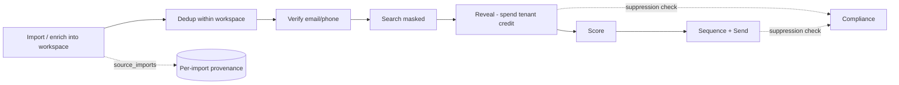

# 00 — Overview

## 1. Vision

LeadWolf is a **multi-tenant sales-intelligence prospecting CRM**. Each customer (**tenant**) works in
one or more **workspaces**; each workspace builds and owns its **own** book of contacts (people) and
accounts (companies) — imported and enriched from external sources (Apollo, ZoomInfo, LinkedIn/Sales
Navigator, CSV, CRM) — then scores, reveals, and runs outreach against them on a **credit** basis. The
product wins on three things:

1. **End-to-end prospecting in one place** — find → reveal verified email/phone → score → sequence →
   send, without stitching five tools together ([ADR-0009](./decisions/ADR-0009-outreach-engine-enroll-and-send.md)).
2. **Compliance as a feature** — GDPR + CCPA suppression, consent tracking, and DSAR are first-class,
   and the Do-Not-Contact list gates both reveals **and** outbound sending.
3. **Per-workspace control** — separate ICPs, notes, scores, and outreach state per team/brand/client,
   with hard RLS isolation ([ADR-0006](./decisions/ADR-0006-per-workspace-multitenant-model.md)).

> **Repositioning note (2026-05-29):** LeadWolf moved from a *global data-vendor* model (one shared,
> de-duplicated golden contact DB) to a *per-workspace prospecting CRM*. The shared golden record,
> field-level provenance, and double-entry credit ledger were consciously traded away — see superseded
> [ADR-0003](./decisions/ADR-0003-three-layer-data-model.md) / [ADR-0005](./decisions/ADR-0005-multi-tenancy-and-global-contact-db.md)
> and amended [ADR-0004](./decisions/ADR-0004-credit-ledger-idempotency.md).
>
> **Update (2026-06-09):** the shared asset is **back as Layer 0** — a **global master graph** (an
> entity-resolved universe of people + companies that every tenant searches and reveals from) now sits
> *beneath* the per-workspace overlay, a deliberate **two-layer hybrid**
> ([ADR-0021](./decisions/ADR-0021-global-master-graph-and-overlay.md), reopening ADR-0006 and reviving the
> spirit of ADR-0003/0005). This makes LeadWolf squarely a **data broker** — see [08 §15](./08-compliance.md).

## 2. Who it's for (personas)

| Persona | Goal | Key workflows |
|---|---|---|
| **SDR / AE (primary user)** | Find and reach the right prospects fast | Search → filter → reveal → export/CRM, build lists, draft outreach |
| **Sales / RevOps manager** | Manage seats, credits, data hygiene | Tenant/workspace admin, credit allocation, usage reporting, suppression management |
| **Data/compliance officer (buyer-side)** | Ensure lawful use | Review DSAR handling, suppression, audit trail |
| **Developer (customer)** | Integrate data into their stack | Public REST API (post-MVP), CSV/CRM sync |

## 3. The core loop

Per workspace: import/enrich contacts from external sources → dedup within the workspace → verify →
users search a **masked** list → spend a **tenant credit** to **reveal** a contact (first reveal in a
workspace wins ownership) → score → enroll in a sequence and **send**. Every reveal **and** send passes
a suppression check; every action is audited.

## 4. Scope

### In scope for the MVP
Import (CSV/manual + first enrichment provider) → per-workspace dedup → verify → masked search →
per-workspace reveal with tenant credits → lists/saved searches → CSV export — behind tenant/workspace
auth (self-built) + workspace RBAC, with GDPR/CCPA suppression + DSAR.

### Planned (post-MVP, sequenced in [10](./10-roadmap.md))
Sales Navigator integration, intelligence/lead-scoring, activity timeline, **outreach sequencing + send
engine** ([ADR-0009](./decisions/ADR-0009-outreach-engine-enroll-and-send.md)), HubSpot/Salesforce/Pipedrive
sync, Public REST API, AI NL-search + AI outreach drafting, ClickHouse analytics, EU data-residency split.
Beyond the MVP we also build the **AI intelligence layer** ([23](./23-ai-intelligence-layer.md)),
**department/team experiences** ([25](./25-departments-teams-workspaces.md)), a **workflow-automation
engine** ([27](./27-workflow-automation-engine.md)), the **real-time/event backbone**
([20](./20-event-driven-realtime-backbone.md)), **scale-hardening + SRE**
([18](./18-scalability-performance.md)/[19](./19-observability-reliability.md)), deeper **data
acquisition/freshness** ([21](./21-data-acquisition-sourcing.md)/[22](./22-data-quality-freshness-lifecycle.md)),
**advanced search UX** ([24](./24-advanced-search-exploration-ux.md)), and **integrations breadth**
([26](./26-integrations-data-delivery.md)).

### Explicitly out of scope (for now)
Dialer/telephony, a data-marketplace storefront beyond in-app credit purchase, mobile apps. *(Note: an
email/sequencing send engine is now IN scope — see ADR-0009 — reversing the earlier no-send stance.)*

## 5. Non-goals & principles

- **We are not a spam tool.** Suppression and lawful basis gate every reveal **and** every send.
- **Workspace isolation is absolute.** The shared **master graph** is system-owned Layer 0; each
  workspace's **overlay** contacts/accounts are the RLS-scoped Layer 1 ([ADR-0021](./decisions/ADR-0021-global-master-graph-and-overlay.md)).
- **Credits are simple and tenant-level.** A tenant pool funds reveals across its workspaces (counter
  model — [ADR-0007](./decisions/ADR-0007-per-workspace-reveal-and-credit-counter.md)).
- **We bill fairly and never lock you in.** Charge only for **verified** data, **credit back** bounces, and
  let customers **export and leave** without penalty — no auto-renew traps, no data-destroy on churn
  ([ADR-0012](./decisions/ADR-0012-transparent-no-lock-in-commercial-policy.md),
  [ADR-0013](./decisions/ADR-0013-charge-for-verified-data-credit-back.md)).
- **AWS-native, self-hosted** ([ADR-0010](./decisions/ADR-0010-aws-native-self-hosted-stack.md)); design
  for **billions** (master graph) / 100M+ (overlay) from day one, ship the simplest correct thing first.
- **Every externally-observable action is auditable.**

## 6. Glossary

| Term | Meaning |
|---|---|
| **Tenant** | The paying customer org; owns the plan, seat/workspace limits, and the **credit pool**. |
| **Workspace** | Collaboration + isolation scope within a tenant (team/brand/region/client). All contacts/accounts/activities/reveals live in exactly one workspace. |
| **Contact / Account** | A workspace's **overlay** copy (notes/scores/reveal state) of a person/company, linked to a Layer-0 master entity ([ADR-0021](./decisions/ADR-0021-global-master-graph-and-overlay.md)). |
| **Master graph (Layer 0)** | The system-owned, billions-scale, globally entity-resolved universe of people + companies (golden records + `source_records` evidence) everyone searches (masked) and reveals from ([ADR-0021](./decisions/ADR-0021-global-master-graph-and-overlay.md)). |
| **Golden record** | The survivorship-merged master person/company that a cluster of source records resolves to. |
| **Overlay (Layer 1)** | A workspace's private copy + curation over a master entity; what RLS isolates. |
| **Entity resolution (ER)** | Matching source records to golden records: deterministic keys + blocking/LSH + Splink + survivorship ([ADR-0015](./decisions/ADR-0015-entity-resolution-dedup-engine.md) / [ADR-0021](./decisions/ADR-0021-global-master-graph-and-overlay.md)). |
| **Source import** | A record of one import of a contact from a source, storing the raw payload — the provenance under this model (no field-level lineage). |
| **Reveal** | Unlocking a contact's email/phone; spends **tenant** credits. First reveal in a workspace sets ownership; re-revealing the **same workspace copy** is free (a different workspace pays again). |
| **Lead score** | Prospect quality (icp_fit/intent/engagement/composite), workspace-private — distinct from `email_status` (field correctness) ([ADR-0008](./decisions/ADR-0008-lead-scoring-model.md)). |
| **Sequence / outreach** | A multi-step send workflow; LeadWolf enrolls contacts and sends ([ADR-0009](./decisions/ADR-0009-outreach-engine-enroll-and-send.md)). |
| **Suppression / DNC** | Do-not-contact / do-not-sell list; suppressed subjects are never revealed **or sent to**. |
| **DSAR** | Data Subject Access Request (GDPR/CCPA): access, deletion, or rectification — fans out across every per-workspace copy. |
| **Workspace role** | `owner`/`admin`/`member`/`viewer`, per workspace (on `workspace_members`); distinct from the **tenant-level** billing/owner capability. |
| **Command palette** | Keyboard-driven (`cmdk`) launcher to jump to any record/destination or run any action ([11](./11-information-architecture.md)). |
| **Sequence / Template** | A multi-step send workflow and its reusable message bodies (merge fields) ([ADR-0009](./decisions/ADR-0009-outreach-engine-enroll-and-send.md)). |
| **Inbox / Task** | Unified replies + reminders; the rep's daily driver ([11 §4.4](./11-information-architecture.md)). |
| **Staff / platform role** | Internal LeadWolf operator identity & role (`super_admin`/`support`/…) — *not* a customer user ([13](./13-platform-admin.md), [ADR-0011](./decisions/ADR-0011-platform-admin-and-privileged-access.md)). |
| **Impersonation** | Audited, time-boxed, banner-flagged staff "login-as" a tenant user for support. |
| **Feature flag** | Platform-controlled toggle (global or per-tenant) for gating/rolling out features. |
| **Data Health** | Customer-facing view of record quality (verification status, staleness, duplicates). |
| **Auth origin (IdP)** | The dedicated `auth.truepoint.in` service that authenticates users and issues tokens; the app domain holds no credentials ([17](./17-authentication.md), [ADR-0016](./decisions/ADR-0016-dedicated-auth-origin-and-cross-domain-token-exchange.md)). |
| **Access / refresh token** | Short-lived in-memory **access JWT** (15 min) used by the app; long-lived **refresh** token (rotating, HttpOnly cookie) held only on the auth origin ([17 §5](./17-authentication.md#5-session-token--device-architecture)). |
| **Auth policy** | Per-scope (tenant/workspace) MFA-enforcement / allowed-methods / IP-allowlist / session-timeout rules, resolved **strictest-wins** ([ADR-0018](./decisions/ADR-0018-auth-policy-and-mfa-enforcement-model.md)). |
| **Trusted device** | A device a user marks trusted (30-day MFA-skip window) in the device registry ([17 §5](./17-authentication.md#5-session-token--device-architecture)). |
| **Global identity** | One `users` row per person (global-unique email + optional username + credentials/MFA) that belongs to many orgs via `tenant_members` ([ADR-0019](./decisions/ADR-0019-global-identity-and-tenant-membership.md)). |
| **Tenant member** | A person's membership in an org (`tenant_members`); carries `is_tenant_owner` + status. The tenant-level capability moved here from `users`. |
| **Org / workspace selection** | Post-auth steps: pick org (if in >1 `tenant_member`) then workspace (if >1) before the cross-domain code is issued ([17 §4](./17-authentication.md#4-multi-tenancy-auth-model)). |
| **Team / Department** | An **intra-workspace** grouping (`teams`, `department_type`) with a persona, team role, and credit budget — the unit of department experience; shares the workspace data pool ([ADR-0022](./decisions/ADR-0022-departments-teams-intra-workspace-segmentation.md), [25](./25-departments-teams-workspaces.md)). |
| **Persona** | The department-tailored view (default dashboard/filters/tabs) a member's **active team** selects over the 6-destination surface ([25 §3](./25-departments-teams-workspaces.md)). |
| **Record visibility** | `workspace`/`team`/`owner` scope on an overlay record; restricts read/write *within* the shared workspace pool (`H18`, [ADR-0022](./decisions/ADR-0022-departments-teams-intra-workspace-segmentation.md)). |
| **AI copilot** | The grounded, human-reviewed assistant (NL search, drafting, summarize, research) on **Anthropic Claude** behind `AiPort` ([23](./23-ai-intelligence-layer.md)). |
| **Automation play** | A **trigger → condition → action** rule (signal-to-play) run by the automation engine; suppression-gated + audited ([27](./27-workflow-automation-engine.md)). |
| **SLO / error budget** | A latency/availability target + its monthly failure allowance; budget burn gates risky releases ([18](./18-scalability-performance.md), [19](./19-observability-reliability.md)). |
| **Freshness SLA** | Per-field re-verify cadence (e.g. email 90d) driving `freshness_status` + scheduled re-verification ([22](./22-data-quality-freshness-lifecycle.md), [ADR-0025](./decisions/ADR-0025-data-freshness-decay-and-reverification-lifecycle.md)). |
| **Domain event / outbox** | A versioned fact published via a **transactional outbox**; the source of truth for async consumers + real-time ([20](./20-event-driven-realtime-backbone.md)). |
| **Custom field / Stage / Tag** | Workspace-defined record customization: typed custom fields (jsonb values), pipeline **stages** mapping onto the canonical `outreach_status`, and tags ([ADR-0028](./decisions/ADR-0028-record-customization-layer.md)). |
| **Credit ledger / lease** | The M11 append-only `credit_ledger` (`balance == SUM(delta)`; counter becomes a derived cache) and the M12 workspace/team **credit leases** that relieve the tenant-counter hot row ([ADR-0029](./decisions/ADR-0029-credit-ledger-and-lease-decrement.md)). |
| **Org role** | A member's tenant-scope capability — `owner`/`billing_admin`/`security_admin`/`compliance_admin`/`member` on `tenant_members.org_role` ([ADR-0030](./decisions/ADR-0030-granular-tenant-org-roles.md)); orthogonal to workspace + team roles. |

## 7. Decision log

Every choice below was confirmed with the user. Rationale for load-bearing ones lives in
[decisions/](./decisions/).

| Area | Decision | Why / ADR |
|---|---|---|
| Language | TypeScript (strict) everywhere | One language across web/api/workers |
| Monorepo | Turborepo + **Bun workspaces**, Biome | → [01](./01-tech-stack.md), [ADR-0010](./decisions/ADR-0010-aws-native-self-hosted-stack.md) |
| Backend | **Hono on Bun** (tRPC + REST/OpenAPI) | Light, fast, container-native → [01](./01-tech-stack.md), [ADR-0010](./decisions/ADR-0010-aws-native-self-hosted-stack.md) |
| Web | Next.js 15 + React 19 on S3+CloudFront/ECS | → [01](./01-tech-stack.md) |
| ORM | Drizzle | SQL control for RLS/partitioning → [ADR-0001](./decisions/ADR-0001-orm-drizzle.md) |
| DB | **Aurora PostgreSQL Serverless v2 + RDS Proxy** | Auto-scale, Multi-AZ, CDC → [ADR-0010](./decisions/ADR-0010-aws-native-self-hosted-stack.md), [03](./03-database-design.md) |
| Queue/cache/realtime | ElastiCache Redis + BullMQ; LISTEN/NOTIFY + SSE | → [01](./01-tech-stack.md) |
| Search | **OpenSearch** for the global master graph (billions) + **Typesense** for the overlay, behind SearchPort | Scale + facets → [ADR-0002](./decisions/ADR-0002-search-postgres-then-engine.md) (amended by [ADR-0021](./decisions/ADR-0021-global-master-graph-and-overlay.md)) |
| Analytics | ClickHouse (self-hosted) via CDC when needed | → [ADR-0010](./decisions/ADR-0010-aws-native-self-hosted-stack.md) |
| Hosting | **AWS-native, self-hosted** (ECS Fargate, S3, SES, Terraform) | Control + cost at scale → [ADR-0010](./decisions/ADR-0010-aws-native-self-hosted-stack.md) |
| UI | shadcn/ui + Tailwind, clean light theme | Distinctive minimal brand → [04](./04-ui-ux-design.md) |
| Auth | **Self-built on Lucia** (password/OAuth/MFA/SAML); served from a dedicated **`auth.truepoint.in`** IdP origin | Data ownership, no per-MAU cost → [ADR-0010](./decisions/ADR-0010-aws-native-self-hosted-stack.md), [17](./17-authentication.md), [03 §4](./03-database-design.md) |
| Auth origin & tokens | Dedicated `auth.truepoint.in` IdP/BFF; single-use PKCE code → in-memory 15-min access JWT + rotating refresh cookie on the auth origin | Cross-domain auth boundary; minimal app-domain credential exposure; **amends [ADR-0010](./decisions/ADR-0010-aws-native-self-hosted-stack.md) auth transport** → [ADR-0016](./decisions/ADR-0016-dedicated-auth-origin-and-cross-domain-token-exchange.md), [17](./17-authentication.md) |
| Login UX | **Progressive (identifier-first)** — **email or username**; resolves existence → SSO/password/passkey/magic or **registration**; verified-domain SSO routing | Adapts per org; enforced-SSO; enumeration **revealed-but-throttled** (Turnstile + rate-limit) → [ADR-0017](./decisions/ADR-0017-progressive-identifier-first-login-and-domain-tenant-routing.md), [ADR-0020](./decisions/ADR-0020-existence-revealing-identifier-first-and-registration.md), [17 §2](./17-authentication.md) |
| Auth policy | MFA enforcement + allowed methods + IP allowlist + session timeout (tenant/workspace, **strictest-wins**) | One predictable composition; a parent policy is a hard floor → [ADR-0018](./decisions/ADR-0018-auth-policy-and-mfa-enforcement-model.md), [17 §4](./17-authentication.md) |
| Identity model | **Global `users` identity + `tenant_members`** (one login across many orgs); per-workspace data unchanged | Slack/Notion-style multi-org login → [ADR-0019](./decisions/ADR-0019-global-identity-and-tenant-membership.md) (amends [ADR-0006](./decisions/ADR-0006-per-workspace-multitenant-model.md)) |
| Registration | **Hybrid**: verified-domain join / pending invite / new org; identifier reveals existence | Real signup branch; enumeration throttled → [ADR-0020](./decisions/ADR-0020-existence-revealing-identifier-first-and-registration.md) |
| Tenancy | **Global identity ↔ `tenant_members` ↔ workspaces**; per-workspace data; RLS via GUC | → [ADR-0006](./decisions/ADR-0006-per-workspace-multitenant-model.md) (supersedes ADR-0005; user identity amended by [ADR-0019](./decisions/ADR-0019-global-identity-and-tenant-membership.md)) |
| Data model | **Two-layer: per-workspace overlay copies over a global master graph**; provenance via `source_records` (master) + `source_imports` (overlay) | → [ADR-0006](./decisions/ADR-0006-per-workspace-multitenant-model.md) + [ADR-0021](./decisions/ADR-0021-global-master-graph-and-overlay.md) |
| Master data graph | **Global master graph (Layer 0) + per-workspace overlay (Layer 1)**; billions-scale shared universe everyone searches/reveals | Shared asset + per-team curation → [ADR-0021](./decisions/ADR-0021-global-master-graph-and-overlay.md) (reopens ADR-0006; revives ADR-0005/0003) |
| Credit model | **Tenant credit counter + per-workspace first-reveal** | → [ADR-0007](./decisions/ADR-0007-per-workspace-reveal-and-credit-counter.md) (supersedes ADR-0004), [07](./07-billing-credits.md) |
| Commercial policy | **Transparent pricing; no auto-renew traps; no data-destroy (export-on-exit)** | Trust wedge → [ADR-0012](./decisions/ADR-0012-transparent-no-lock-in-commercial-policy.md), [07 §1A](./07-billing-credits.md) |
| Charge & credit-back | **Charge only for `valid` data; credit back on bounce** | Honest billing → [ADR-0013](./decisions/ADR-0013-charge-for-verified-data-credit-back.md), [07 §3](./07-billing-credits.md) |
| Lead scoring | Versioned scores + intent signals (≠ data confidence) | → [ADR-0008](./decisions/ADR-0008-lead-scoring-model.md) |
| Outreach | **LeadWolf enrolls & sends** (sequences) | → [ADR-0009](./decisions/ADR-0009-outreach-engine-enroll-and-send.md), [05](./05-features-modules.md) |
| Compliance | GDPR + CCPA; suppression gates reveal **and** send | Regulated buyers → [08](./08-compliance.md) |
| Trust & certs | **SOC 2 / ISO 27001 + data-broker registration + Trust Center** | Make the compliance wedge verifiable → [ADR-0014](./decisions/ADR-0014-trust-and-certification-program.md), [08 §15](./08-compliance.md) |
| Residency | US region first, region-tagged | Migration path → [08](./08-compliance.md) |
| Enrichment | Apollo, ZoomInfo, Clearbit (per-workspace import) | → [06](./06-enrichment-engine.md) |
| Data quality | Email verify on reveal + phone validation | Deliverable data → [06](./06-enrichment-engine.md) |
| Entity resolution | **Global/cross-source: deterministic keys + blocking/LSH + Splink + survivorship** | Dedup the universe, risk #1 → [ADR-0015](./decisions/ADR-0015-entity-resolution-dedup-engine.md) (amended by [ADR-0021](./decisions/ADR-0021-global-master-graph-and-overlay.md)), [06 §9](./06-enrichment-engine.md) |
| Email verification | **Dedicated, provider-independent verifier** (e.g. ZeroBounce/NeverBounce) | Backs credit-back → [ADR-0013](./decisions/ADR-0013-charge-for-verified-data-credit-back.md), [06 §9](./06-enrichment-engine.md) |
| Intent & technographic data | **Bombora/G2/6sense** (intent); **BuiltWith/HG Insights** (technographic) | Feeds intent_signals/scoring → [06 §2](./06-enrichment-engine.md), [ADR-0008](./decisions/ADR-0008-lead-scoring-model.md) |
| Scale | **Billions** (master) / 100M+ (overlay) → partitioning + **Citus** + **OpenSearch** + ClickHouse + S3/Iceberg lake | → [03 §12](./03-database-design.md), [01](./01-tech-stack.md), [ADR-0021](./decisions/ADR-0021-global-master-graph-and-overlay.md) |
| GTM | Public self-serve + abuse guards | Fast adoption → [07](./07-billing-credits.md) |
| Navigation | 6-destination single-page command center; Credits not a tab | Modern, lean, panel-driven → [11](./11-information-architecture.md) |
| Settings | Tiered user/workspace/tenant/developer | → [12](./12-settings.md) |
| Platform admin | Separate internal console (`apps/admin`) + privileged audited access | → [ADR-0011](./decisions/ADR-0011-platform-admin-and-privileged-access.md), [13](./13-platform-admin.md) |
| Execution (Phase 1) | **Phase 1 = M0 foundation + M1–M5 MVP**; **local-first infra** (author Terraform, defer live AWS); one migration per milestone | → [14](./14-phase-1-execution.md), [10](./10-roadmap.md), [ADR-0010](./decisions/ADR-0010-aws-native-self-hosted-stack.md) |
| Code organization | **Feature-based, layered, small-file**; per-package public `index.ts`; enforced import graph (apps never import apps; no deep imports; acyclic via ports) | Maintainable & AI-friendly → [16](./16-code-organization.md), [02 §1](./02-architecture.md) |
| Departments & teams | **Teams inside one workspace** — department personas, team roles, record-visibility, per-team credit budgets (no new tenancy tier) | Department UX, reuses RLS/roles → [ADR-0022](./decisions/ADR-0022-departments-teams-intra-workspace-segmentation.md), [25](./25-departments-teams-workspaces.md) |
| AI & intelligence | **Anthropic Claude** behind `AiPort`; assistive + agentic, **human-in-the-loop**, grounded, metered | AI is table-stakes; safe + swappable → [ADR-0023](./decisions/ADR-0023-ai-provider-and-intelligence-architecture.md), [23](./23-ai-intelligence-layer.md) |
| Performance & scale | **Explicit SLOs + error budgets + capacity model** (latency budgets, cache policy, Citus cutover) | Testable "fast at scale" → [ADR-0024](./decisions/ADR-0024-performance-slos-and-capacity-model.md), [18](./18-scalability-performance.md) |
| Observability & SRE | SLOs/error budgets, alerting, incident + DR runbooks, chaos, FinOps cost attribution | Keep it up at scale → [19](./19-observability-reliability.md) |
| Event & real-time | **Transactional outbox + idempotent consumers + SSE/WebSocket gateway** | Reliable async + live UI → [ADR-0027](./decisions/ADR-0027-real-time-delivery-and-event-backbone.md), [20](./20-event-driven-realtime-backbone.md) |
| Data freshness | **Per-field freshness SLAs + scheduled re-verify + `data_quality_score` formula** | Deliverable data; honest credit-back → [ADR-0025](./decisions/ADR-0025-data-freshness-decay-and-reverification-lifecycle.md), [22](./22-data-quality-freshness-lifecycle.md) |
| Data acquisition | Provider waterfall + public registries + opt-in co-op; vetting/DPA + **lawful-basis lineage** | Lawful, defensible coverage → [21](./21-data-acquisition-sourcing.md) |
| Automation | **Trigger→condition→action engine** (signal-to-play); suppression-gated, idempotent, audited | Cross-module + department workflows → [ADR-0026](./decisions/ADR-0026-workflow-automation-engine.md), [27](./27-workflow-automation-engine.md) |
| Search UX | Advanced faceted filters (incl. **intent**), saved views, smart segments, instant masked search | Apollo/ZoomInfo-grade exploration → [24](./24-advanced-search-exploration-ux.md) |
| Integrations & delivery | Bidirectional CRM + native apps, webhooks, **reverse-ETL**, Chrome ext, SMS, export center | No-lock-in delivery → [26](./26-integrations-data-delivery.md), [ADR-0012](./decisions/ADR-0012-transparent-no-lock-in-commercial-policy.md) |
| Record customization | **Custom fields (typed-jsonb values) + pipeline-stage layer + tags**, workspace-defined, M8 | CRM-grade modeling without opening shared vocab → [ADR-0028](./decisions/ADR-0028-record-customization-layer.md), [05 §7](./05-features-modules.md) |
| Billing hardening | **Append-only `credit_ledger` at M11** (counter → derived cache) + **credit leases at M12** | Provable accounting + hot-row relief; executes ADR-0007's revisit path → [ADR-0029](./decisions/ADR-0029-credit-ledger-and-lease-decrement.md), [07 §2](./07-billing-credits.md) |
| Tenant org roles | **`tenant_members.org_role`** — `owner`/`billing_admin`/`security_admin`/`compliance_admin`/`member` (M11) | Delegated administration → [ADR-0030](./decisions/ADR-0030-granular-tenant-org-roles.md), [03 §4](./03-database-design.md) |
| Auth-event audit | **Auth events split by tenant-resolvability** — resolved → `audit_log`; tenant-less → `platform_audit_log` (preserves the `NOT NULL`+RLS invariant) | Write the closed-enum auth actions without weakening RLS → [ADR-0031](./decisions/ADR-0031-auth-event-audit-tenancy.md), [audit-log-enum.md](./audit-log-enum.md) |

## 8. Open questions (tracked, resolved during doc review or early milestones)

1. **Reveal pricing by `reveal_type`** — credit cost for email vs phone vs full_profile; pack sizes; signup bonus. (Placeholders in [07](./07-billing-credits.md).) *Pricing **policy** is now decided — transparent, no-lock-in ([ADR-0012](./decisions/ADR-0012-transparent-no-lock-in-commercial-policy.md)) + charge-only-for-`valid` with credit-back ([ADR-0013](./decisions/ADR-0013-charge-for-verified-data-credit-back.md)); the concrete **numbers** stay placeholders.*
2. **PII uniqueness over encryption** — confirm the `email_blind_index` (HMAC) approach for per-workspace dedup ([03 §13](./03-database-design.md)).
3. **Global entity-resolution quality** — deterministic keys + blocking/LSH + Splink at billions ([ADR-0021](./decisions/ADR-0021-global-master-graph-and-overlay.md), [06 §9](./06-enrichment-engine.md), [03 §13](./03-database-design.md)).
4. ~~**Billing hardening** — when to reintroduce an append-only ledger over the counter~~ — **Resolved:**
   `credit_ledger` at **M11** (counter → derived cache) + lease-based decrement at **M12**
   ([ADR-0029](./decisions/ADR-0029-credit-ledger-and-lease-decrement.md), [07 §2](./07-billing-credits.md)).
5. **DSAR fan-out** procedure + SLA across N per-workspace copies ([08 §4](./08-compliance.md)).
6. **Outreach sending compliance/deliverability** — sending domains, CAN-SPAM/GDPR consent, LinkedIn/SN ToS for automated send ([ADR-0009](./decisions/ADR-0009-outreach-engine-enroll-and-send.md)).
7. ~~Cross-workspace "tenant search" read layer~~ — **Resolved:** the global master graph **is** the shared search layer; every tenant searches the universe (masked) and reveals into its overlay ([ADR-0021](./decisions/ADR-0021-global-master-graph-and-overlay.md)).
8. ~~**AI provider**~~ — **Resolved:** Anthropic Claude behind `AiPort` (Opus 4.8 / Sonnet 4.6 / Haiku 4.5), assistive + agentic with human-in-the-loop, grounding/RAG, eval/safety, and per-tenant metering ([ADR-0023](./decisions/ADR-0023-ai-provider-and-intelligence-architecture.md), [23](./23-ai-intelligence-layer.md)).
9. **Self-built auth hardening** — credential-stuffing monitoring, key rotation ([ADR-0010](./decisions/ADR-0010-aws-native-self-hosted-stack.md)). *The auth **security layers** (progressive lockout, bot detection, impossible-travel, no-enumeration) and **JWKS key rotation** are now specified in [17 §5/§6](./17-authentication.md#6-security-layers); the cross-domain token boundary is [ADR-0016](./decisions/ADR-0016-dedicated-auth-origin-and-cross-domain-token-exchange.md), with residual auth Qs in [17 open questions](./17-authentication.md#open-questions). SOC 2 / ISO 27001 scope is owned by the **Trust & certification program** ([ADR-0014](./decisions/ADR-0014-trust-and-certification-program.md), [08 §15](./08-compliance.md)).*
10. **Gap remediation** — the market-gap analysis ([../market-analysis/](../market-analysis/)) is translated into corpus changes in [15 — Gap Remediation](./15-gap-remediation.md); residual GTM items (support SLAs, credit-back window, cert sequencing) are tracked there. *The 2026-06-10 **enterprise audit** ([28](./28-enterprise-readiness-audit.md)) extends this: its Pass-1 remediation landed as [ADR-0028](./decisions/ADR-0028-record-customization-layer.md)/[0029](./decisions/ADR-0029-credit-ledger-and-lease-decrement.md)/[0030](./decisions/ADR-0030-granular-tenant-org-roles.md) + the audit-enum/breach-notification amendments; remaining High/Medium gaps are tracked in [28 §12](./28-enterprise-readiness-audit.md).*
11. **Reply-ingestion approach (M9 gate)** — direct Gmail API / Microsoft Graph mailbox sync vs a unified
    email-API vendor for capturing replies into Inbox (`mailbox_connections`, [03 §14](./03-database-design.md);
    [28 §3.11](./28-enterprise-readiness-audit.md) G-INT-1). Decide before the M9 build.
12. **i18n/l10n architecture + GA locales** — message-catalog stack, locale formats, template
    localization; decide by **M11** ([28 §3.25](./28-enterprise-readiness-audit.md) G-UX-1).
13. **Telephony / dialer** — schedule a CPaaS-based calling module (behind a `CallPort`, reusing the
    suppression/consent/audit/budget rails) or re-affirm the [§4](#4-scope) exclusion
    ([28 §3.24](./28-enterprise-readiness-audit.md) G-TEL-1). The exclusion stands until decided.
