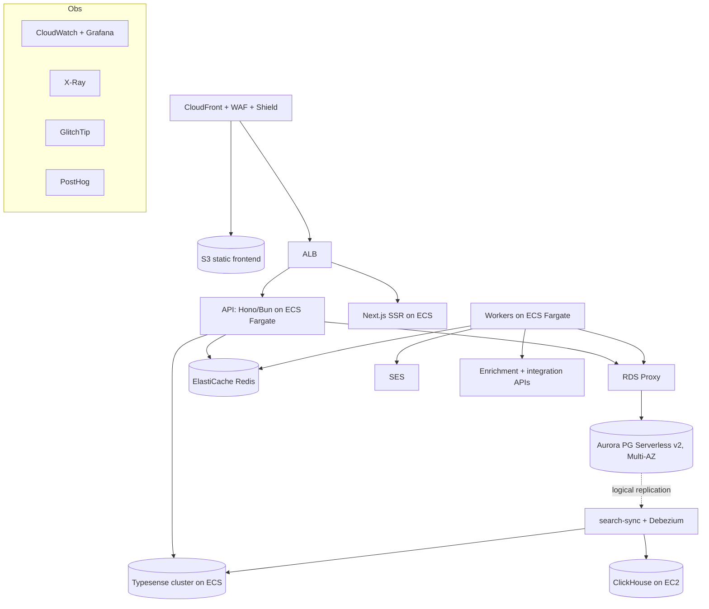

# 01 — Tech Stack

> **AWS-native, self-hosted.** If AWS offers a managed equivalent, use it; otherwise self-host on AWS.
> External SaaS is limited to what the product needs (Stripe; customer-system integrations; GitHub).
> Rationale + trade-offs: [ADR-0010](./decisions/ADR-0010-aws-native-self-hosted-stack.md).

## 1. At a glance

| Layer | Choice | Hosting |
|---|---|---|
| Frontend | Next.js 15 (App Router) + React 19 | S3 + CloudFront (+ ECS for dynamic SSR) |
| Language | TypeScript (strict) | — |
| Styling/UI | Tailwind v4 + shadcn/ui | — |
| Client state | Zustand; **TanStack** Query/Table/Form; cmdk; next-themes | — |
| Backend | **Hono on Bun** | ECS Fargate behind ALB |
| API style | **tRPC** (internal app) + **REST/OpenAPI** (`@hono/zod-openapi`, public) | — |
| ORM | **Drizzle** ([ADR-0001](./decisions/ADR-0001-orm-drizzle.md)) | — |
| Primary DB | PostgreSQL 16 on **Aurora Serverless v2** (**Citus**-sharded for the billions-row master graph — [ADR-0021](./decisions/ADR-0021-global-master-graph-and-overlay.md)) | Managed |
| Pooling | **RDS Proxy** (transaction pooling, IAM auth) | Managed |
| Search | **OpenSearch** (global master graph) + **Typesense** (overlay), self-hosted ([ADR-0002](./decisions/ADR-0002-search-postgres-then-engine.md) amended by [ADR-0021](./decisions/ADR-0021-global-master-graph-and-overlay.md)) | ECS Fargate |
| Cache/queue | **Redis 7** (ElastiCache, cluster mode) + **BullMQ** | Managed |
| Realtime | Postgres LISTEN/NOTIFY + SSE; Redis pub/sub fan-out | API service |
| Event analytics + facet counts | **ClickHouse, self-hosted** (event tables >~50M rows; high-cardinality master-graph facet counts) via CDC | EC2 |
| Data lake / batch ER | **S3 + Iceberg/Parquet**; Splink on **Spark/Athena** over raw `source_records` ([ADR-0021](./decisions/ADR-0021-global-master-graph-and-overlay.md)) | Native |
| Auth | **Self-built on Lucia** + Postgres + Redis ([ADR-0010](./decisions/ADR-0010-aws-native-self-hosted-stack.md)) | API service |
| Files | S3 (pre-signed up/download; CloudFront for public) | Native |
| Email | SES (React Email; SNS→SQS bounce/complaint) | Native |
| CDN/DDoS | CloudFront + WAF + Shield | Native |
| DNS/TLS | Route 53 + ACM | Native |
| Secrets | Secrets Manager + Parameter Store (KMS) | Native |
| Errors | **GlitchTip** (self-hosted, Sentry-protocol) | ECS |
| Product analytics | **PostHog** (self-hosted) | EC2 |
| Metrics/logs/trace | CloudWatch + **Grafana** + X-Ray | Native + EC2 |
| Heavy batch jobs | **AWS Batch** (Fargate) | Native |
| IaC | **Terraform** (separate infra repo; state in S3 + DynamoDB) | — |
| CI/CD | GitHub Actions → **ECR** → **CodeDeploy** blue/green | — |
| Monorepo | **Turborepo + Bun workspaces**; **Biome** lint/format | — |

## 2. Why the load-bearing picks

- **Hono on Bun (not NestJS/Fastify):** lighter, faster, container-friendly; tRPC gives end-to-end types to the Next.js app, `@hono/zod-openapi` serves the public REST API. DI/guard concerns (tenancy, RBAC, audit) become middleware. (Supersedes the earlier NestJS rationale.)
- **Aurora Serverless v2 + RDS Proxy:** PG16-compatible (our schema runs unchanged), auto-scaling ACUs, Multi-AZ, PITR, logical replication for CDC; RDS Proxy gives PgBouncer-style transaction pooling so ephemeral ECS tasks don't exhaust connections. **RLS** is set per request via `SET LOCAL app.current_workspace_id` (see [03 §9](./03-database-design.md)).
- **OpenSearch (global master graph, billions) + Typesense (overlay)** behind `SearchPort`, fed by Aurora logical-replication CDC ([ADR-0002](./decisions/ADR-0002-search-postgres-then-engine.md) amended by [ADR-0021](./decisions/ADR-0021-global-master-graph-and-overlay.md)); ClickHouse backs high-cardinality facet counts.
- **Self-built auth (Lucia):** zero per-MAU cost + full data ownership, at the cost of ~6–12 eng-weeks + ongoing security upkeep ([ADR-0010](./decisions/ADR-0010-aws-native-self-hosted-stack.md)). Tables in [03 §4](./03-database-design.md).
- **Drizzle retained** ([ADR-0001](./decisions/ADR-0001-orm-drizzle.md)): SQL-first control for RLS, partial indexes, partitioning.

## 3. AWS topology



VPC per env (3 AZs): ALB + NAT in public subnets; ECS/Aurora/ElastiCache/Typesense/ClickHouse in private subnets; VPC endpoints for S3/ECR/Secrets. Spot instances for non-critical workers.

The internal **`apps/admin`** console (separate ECS service) connects under a **dedicated privileged DB role** that bypasses workspace RLS — **distinct** from the app's non-`BYPASSRLS` role — for audited cross-tenant access ([13](./13-platform-admin.md), [ADR-0011](./decisions/ADR-0011-platform-admin-and-privileged-access.md)).

## 4. Background workers

Separate ECS Fargate service (same codebase, different entry point), consuming **BullMQ** on Redis; auto-scales on queue-depth metric. Worker types: **enrichment** (Apollo/ZoomInfo/Clearbit), **entity-resolution** (global ER: normalize → blocking/MinHash-LSH → Splink → survivorship — [ADR-0021](./decisions/ADR-0021-global-master-graph-and-overlay.md)), **scoring**, **imports** (CSV/XLSX → dedup → insert), **CRM sync** (Salesforce/HubSpot/Pipedrive), **outreach delivery** (→ SES or external sequencer), **webhook delivery**, **search-sync** (CDC → OpenSearch + Typesense + ClickHouse). One-off heavy jobs (full re-score, bulk re-enrich, **batch ER on Spark/Athena over the lake**) run on **AWS Batch**.

## 5. Repositories (two)

**App monorepo** (Turborepo + Bun workspaces, Biome):
```
crm/
  apps/{web (Next.js), auth (auth.truepoint.in IdP — dedicated origin, [17](./17-authentication.md), [ADR-0016](./decisions/ADR-0016-dedicated-auth-origin-and-cross-domain-token-exchange.md)),
        api (Hono tRPC+REST), workers (BullMQ),
        admin (internal super-admin console — own staff auth/RBAC, separate ECS service [13](./13-platform-admin.md), [ADR-0011](./decisions/ADR-0011-platform-admin-and-privileged-access.md))}
  packages/{db (Drizzle), core (scoring/dedup/reveal), auth (Lucia/OAuth/SAML),
            integrations (SF/HubSpot/Apollo/ZoomInfo), ui (shadcn), email (React Email+SES),
            search (Typesense client+sync), analytics (PostHog), observability (X-Ray/CW/GlitchTip),
            config (tsconfig/biome), types (Zod)}
  Dockerfile.{api,web,worker}  turbo.json  package.json
```
**Infra repo** (Terraform modules: network/ecs/aurora/elasticache/s3/cloudfront/ses/observability/secrets/alb; environments dev/staging/production; state in S3 + DynamoDB locking).

## 6. Environments & CI/CD

One AWS account per environment via AWS Organizations. GitHub Actions: PR → lint (Biome) + typecheck + test + build images → ECR (PR tag) → ephemeral env in `dev`; merge → staging + smoke tests; tagged release → **CodeDeploy blue/green** to prod with 15-min CloudWatch alarm watch + auto-rollback. Migrations: Drizzle Kit → per-PR test DB → staging on merge → prod on release. Images signed (AWS Signer); prod pulls signed images only.

## 7. Operational reality (summary; detail in [10](./10-roadmap.md))

- Needs ≥1 DevOps-fluent engineer (Terraform/ECS/Aurora/IAM); platform team by ~15 engineers.
- **Budget (approx AWS/mo):** MVP $400–800 · Growth $1.5–3K · Scale-up $5–12K · Scale-out $25–60K.
- **Compliance burden is ours** above the AWS layer (SOC2/ISO/GDPR): 3–6 months pre-audit, $30–100K/cert.
- **DR:** Aurora PITR + cross-region warm standby; S3 CRR; RTO 1h / RPO 5m; quarterly drills.

## 8. Necessary external services

Stripe (payments); customer-system integration APIs (Salesforce, HubSpot, Apollo, ZoomInfo, Pipedrive, LinkedIn); GitHub (code + CI). Everything else runs on AWS or is self-hosted on AWS.

## 9. Local development

`docker-compose` brings up Postgres 16 (+ extensions), Redis, Typesense, LocalStack (S3/SES), MailHog. `bun run dev` runs web/api/workers via Turbo; `bun run db:migrate`/`db:seed`. Stripe via Stripe CLI. Config is zod-validated at boot in `packages/config`; `.env.example` documents shape only.
