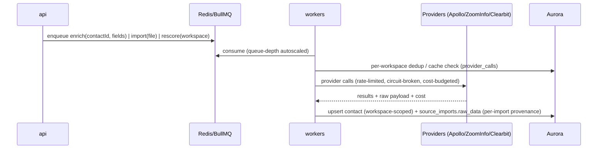

# 02 — Architecture

> How LeadWolf is laid out and how a request becomes data: two repos, a handful of ECS services, and
> hard per-workspace isolation. Stack rationale in [ADR-0010](./decisions/ADR-0010-aws-native-self-hosted-stack.md);
> tenancy model in [ADR-0006](./decisions/ADR-0006-per-workspace-multitenant-model.md).

## 1. Repositories & layout

**Two repos** ([01 §5](./01-tech-stack.md)): the application monorepo and a separate Terraform infra
repo. App monorepo is **Turborepo + Bun workspaces**, **Biome** for lint/format.

```
crm/                              # app monorepo (Turborepo + Bun workspaces, Biome)
  turbo.json
  package.json                    # root: dev tooling + scripts only
  Dockerfile.{api,web,worker}     # one image per deployable app
  docker-compose.yml              # postgres, redis, typesense, localstack (S3/SES), mailhog
  .github/workflows/              # CI pipelines
  apps/
    web/        # Next.js 15 (App Router) dashboard + SSR — feature-sliced, lazy-loaded modules
    api/        # Hono on Bun — tRPC (internal) + REST/OpenAPI (public); the only public HTTP surface
    workers/    # BullMQ processors (single image, queue-typed entry points)
    admin/      # internal super-admin console (staff-only, privileged role) — see 13 / ADR-0011
  packages/
    db/             # Drizzle schema, migrations, RLS policies, repositories
    core/           # domain logic: scoring, dedup, reveal transaction, entitlements
    auth/           # self-built auth (Lucia + arctic OAuth + TOTP MFA + node-saml SSO)
    integrations/   # Salesforce / HubSpot / Apollo / ZoomInfo / Pipedrive / LinkedIn adapters
    ui/             # shared React components / shadcn primitives (theme tokens)
    email/          # React Email templates + SES send + SNS→SQS bounce/complaint
    search/         # SearchPort interface + Typesense client + CDC sync helpers
    analytics/      # PostHog event capture (product analytics)
    observability/  # X-Ray tracing, CloudWatch metrics/logs, GlitchTip error reporting
    config/         # zod-validated env loading; shared tsconfig/biome presets
    types/          # Zod schemas + inferred TS types (single source of truth)
```

**Infra repo** (Terraform): modules for network / ecs / aurora / elasticache / s3 / cloudfront / ses /
observability / secrets / alb; environments `dev`/`staging`/`production`; state in S3 + DynamoDB locking.

**Invariants**
- `apps/*` are **deployable processes** with their own Dockerfile/lifecycle. They may depend on
  `packages/*` but **never on each other**.
- `packages/*` are **side-effect-free libraries** exported via a typed `index.ts`. Domain logic lives
  here so `api` and `workers` share one implementation.
- `packages/types` has no runtime dependencies beyond Zod and is imported almost everywhere.
- **Frontend is modular too — not a monolith.** `apps/web` is composed of **feature-sliced, lazy-loaded
  SPA modules** (per domain area) assembled in **one app shell**, mirroring the modular backend
  (`packages/*`). The internal console (`apps/admin`) is a wholly separate frontend.

The **on-disk layout** — what goes inside each `app`/`package`, the import/dependency graph, the
barrel/public-interface strategy, naming, and file-size targets — is specified in
[16 — Code Organization](./16-code-organization.md) (slice internals in
[16 §3.3](./16-code-organization.md#33-appsweb-nextjs-15-app-router--feature-slice-internals)).

## 2. Runtime services

All run on **ECS Fargate** behind an ALB ([01 §3](./01-tech-stack.md)). There is **no standalone
scraper service** — the proprietary collection engine was removed; data enters per workspace via import
+ enrichment providers ([ADR-0006](./decisions/ADR-0006-per-workspace-multitenant-model.md)).

| Service | Runtime | Responsibility | Scales on |
|---|---|---|---|
| **web** | Next.js 15 (S3+CloudFront + ECS SSR) | Dashboard UI, dynamic SSR, auth pages | Request volume |
| **api** | Hono on Bun | The public HTTP surface; tRPC (internal) + REST/OpenAPI; auth, tenancy, validation, SSE, enqueues jobs | Request volume |
| **workers** | Bun + BullMQ | Async work (queue-depth autoscaled) | Queue depth |
| **admin** | Hono/Next on Bun (ECS) | Internal super-admin console + `/admin/*` API: staff auth/RBAC, cross-tenant ops, audited to `platform_audit_log` | Staff usage |

`web` talks to `api` over HTTP/tRPC (no direct DB access from the browser tier). `api` and `workers`
share `packages/db` and enqueue/consume BullMQ on ElastiCache Redis. Heavy one-off jobs (full re-score,
bulk re-enrich) run on **AWS Batch** ([01 §4](./01-tech-stack.md)).

**admin** is a **separate ECS Fargate deploy** with its **own staff auth** (SSO + MFA, IP-allowlist, JIT
elevation) and a **dedicated privileged DB role**. It is **staff-only, not customer-facing** (separate
domain, separate ALB target) and is *never* the customer app behind a flag — see
[13](./13-platform-admin.md) and [ADR-0011](./decisions/ADR-0011-platform-admin-and-privileged-access.md).

**Worker queues:** **enrichment** (Apollo/ZoomInfo/Clearbit), **scoring** (lead scores + intent
signals), **imports** (CSV/XLSX → per-workspace dedup → insert), **CRM sync** (Salesforce/HubSpot/
Pipedrive), **outreach delivery/send** (sequences → SES; LinkedIn/Sales-Nav human-in-the-loop),
**webhook delivery**, **search-sync** (Aurora logical-replication CDC → Typesense).

## 3. Request & job flow

### 3.1 The reveal transaction (synchronous, H1)

The reveal is the load-bearing money path. It is described identically here, in
[07 §3](./07-billing-credits.md), [08 §3](./08-compliance.md), and [09 §3](./09-api-design.md).
Credits are a **tenant counter** (`tenants.reveal_credit_balance`); reveal is **per-workspace,
first-reveal-wins** ([ADR-0007](./decisions/ADR-0007-per-workspace-reveal-and-credit-counter.md)).

```
BEGIN;  -- SET LOCAL app.current_tenant_id + app.current_workspace_id already applied
assertNotSuppressed(contact, workspace);            -- in-tx, unbypassable suppression/DNC gate
INSERT INTO contact_reveals (...) VALUES (...)
  ON CONFLICT (workspace_id, contact_id, reveal_type) DO NOTHING;
-- already present  -> return owned fields, charge 0, COMMIT
-- else (new reveal):
SELECT reveal_credit_balance FROM tenants WHERE id = :tenant FOR UPDATE;
--   if balance < cost -> ROLLBACK (INSUFFICIENT_CREDITS)
--   else              -> UPDATE tenants SET reveal_credit_balance = balance - cost;
COMMIT;  -- AFTER INSERT trigger sets contacts.is_revealed/revealed_by/revealed_at (first wins)
-- audit_log(reveal)
```

```mermaid
sequenceDiagram
  participant U as User (web)
  participant API as api (Hono/Bun)
  participant DB as Aurora (via RDS Proxy)
  U->>API: POST /contacts/:id/reveal (Idempotency-Key)
  API->>API: auth → tenancy (SET LOCAL GUC) → entitlement middleware
  API->>DB: BEGIN; assertNotSuppressed; INSERT contact_reveals ON CONFLICT DO NOTHING
  alt already owned (same workspace copy)
    DB-->>API: return owned fields, charge 0
  else new reveal
    DB->>DB: SELECT balance FOR UPDATE; if < cost ROLLBACK; else balance -= cost
  end
  API->>DB: COMMIT; audit_log(reveal)
  API-->>U: contact { email, phone } or INSUFFICIENT_CREDITS
```

**Known risks (per [ADR-0007](./decisions/ADR-0007-per-workspace-reveal-and-credit-counter.md)):** a
bare counter lacks the ledger's reconciliation/refund history. The required mitigations are the
`FOR UPDATE` + `CHECK (reveal_credit_balance >= 0)` + the `(workspace_id, contact_id, reveal_type)`
unique constraint + the client `Idempotency-Key` header. Pricing per `reveal_type` is a placeholder —
reference [07 §1](./07-billing-credits.md), never hardcode it.

### 3.2 Asynchronous (import / enrichment / scoring)



There is **no golden-record merge and no field-level provenance**: each import appends a
`source_imports` row holding the raw payload, and contacts are per-workspace copies
([ADR-0006](./decisions/ADR-0006-per-workspace-multitenant-model.md)).

### 3.3 CDC, search & analytics

Aurora **logical replication** feeds a **search-sync** worker that indexes contacts/accounts into
**Typesense** (behind `SearchPort`) from day one ([ADR-0002](./decisions/ADR-0002-search-postgres-then-engine.md)).
When an event table (e.g. `activities`) crosses ~50M rows, the same CDC stream (Debezium) fans out to
**self-hosted ClickHouse** for event analytics. Search returns **masked** rows; PII unmasks only through
the reveal transaction (§3.1).

### 3.4 Realtime

The `api` service emits **Postgres LISTEN/NOTIFY** events (e.g. reveal completed, import progress, new
activity), bridged to clients over **SSE**; **Redis pub/sub** fans the notifications across ECS
instances so any connected `api` task can serve a given subscriber.

## 4. Multi-tenancy model

See [ADR-0006](./decisions/ADR-0006-per-workspace-multitenant-model.md) for the full rationale
(supersedes ADR-0005).

- **Tenancy chain:** `tenant → workspace → workspace_member → user`. A **tenant** is the paying org
  (plan, `seat_limit`, `workspace_limit`, `reveal_credit_balance`). A **workspace** is the
  data-isolation + collaboration scope. A **user** belongs to one tenant and is granted per-workspace
  access via `workspace_members`.
- **Per-workspace data, no global contact DB.** Each workspace owns its **own** copies of `contacts`
  and `accounts` (carrying both `tenant_id` and `workspace_id`); they are **not** shared across
  workspaces. There is no shared golden record. Provenance is per-import via `source_imports.raw_data`
  (no field-level lineage, no cross-source dedup/merge, no replay). Dedup is per-workspace via unique
  `(workspace_id, email_blind_index)` / `(workspace_id, linkedin_public_id)` / `(workspace_id,
  sales_nav_lead_id)`.
- **Isolation:** Postgres **Row-Level Security**. Workspace-scoped tables use
  `USING (workspace_id = current_setting('app.current_workspace_id')::uuid)`; tenant-scoped tables
  (`tenants`, `users`, `api_keys`, `purchases`, tenant-level `audit_log`) use `app.current_tenant_id`.
  The `api` runs `SET LOCAL app.current_tenant_id` + `app.current_workspace_id` per request under a
  non-`BYPASSRLS` role. **RDS Proxy** transaction pooling resets the GUC per checkout, so it must be set
  inside the transaction. App-layer **AsyncLocalStorage** context carries the same IDs as
  belt-and-suspenders ([03 §9](./03-database-design.md#9-row-level-security)).
- **Privileged cross-tenant path (staff only).** `apps/admin` reaches across tenants under a **dedicated
  privileged role that bypasses workspace RLS — distinct from the app's non-`BYPASSRLS` role** above and
  used by nothing else. Every such access is written to the immutable **`platform_audit_log`**
  ([13](./13-platform-admin.md), [ADR-0011](./decisions/ADR-0011-platform-admin-and-privileged-access.md)).

```
Tenant-scoped:    tenants, users, api_keys, purchases, stripe_customers, tenant_sso_configs,
                  user_sessions / user_oauth_accounts / user_mfa / user_password_resets,
                  tenant-level audit_log rows
Workspace-scoped: workspaces, workspace_members, contacts, accounts, source_imports,
                  contact_reveals, activities, scores, intent_signals, lists, saved_searches,
                  outreach_sequences / outreach_steps / outreach_log, suppression_list (workspace),
                  provider_calls, workspace-level audit_log rows
```

## 5. Cross-cutting concerns (where they live)

Authorization splits in two: a **workspace role** (`owner`/`admin`/`member`/`viewer` on
`workspace_members`) governs data access within a workspace, while the distinct **tenant-level**
capability (`users.is_tenant_owner`) governs billing, workspace creation, and seat/workspace limits.

| Concern | Mechanism | Package / where |
|---|---|---|
| AuthN | Self-built auth: Lucia sessions + OAuth/MFA/SAML; hashed API keys | `auth`, `api` middleware |
| Workspace AuthZ | Role check (`owner`/`admin`/`member`/`viewer`) on `workspace_members` | `api` middleware |
| Tenant AuthZ | `users.is_tenant_owner` for billing / workspace / seat-limit actions | `api` middleware, `core` |
| Tenancy isolation | `SET LOCAL` GUC (RLS) + AsyncLocalStorage context | `api`, `db` |
| Entitlements/quota | Middleware runs *before* the credit check | `core` |
| Idempotency | `Idempotency-Key` header + DB unique keys | `api`, `core` |
| Audit logging | Middleware writes `audit_log` for mutating actions | `core` |
| Suppression / DNC | `assertNotSuppressed()` inside the reveal **and** send tx | `core`, `email` |
| Validation | Zod at the edge (tRPC/zod-openapi) + payload validation in queue | `types` |
| Observability | X-Ray traces + CloudWatch logs + correlation id via ALS | `observability` |
| Rate limiting | Redis token buckets (per provider + per API key) | `integrations`, `api` |

The "Package / where" column names the home package; how each is organized **inside** that package, and
the rule that domain logic stays in `core` (HTTP-agnostic) while `apps/api` stays thin, is detailed in
[16 §4/§7](./16-code-organization.md#4-inside-a-package).

## 6. Data flow guarantees (the contract)

1. **Every contact carries its workspace and a per-import provenance row.** All writes to `contacts`/
   `accounts` are workspace-scoped; each import appends `source_imports.raw_data`. There is no golden
   record and no field-level lineage ([ADR-0006](./decisions/ADR-0006-per-workspace-multitenant-model.md)).
2. **Import, manual entry, and provider enrichment share one path** — `normalize → per-workspace dedup
   → upsert` (see [03](./03-database-design.md) and [06](./06-enrichment-engine.md)).
3. **Money mutations are transactional and idempotent.** The reveal decrements the tenant counter under
   `FOR UPDATE` in one transaction (§3.1), keyed by `(workspace_id, contact_id, reveal_type)` +
   `Idempotency-Key`; Stripe top-ups are idempotent on `purchases.stripe_event_id`
   ([ADR-0007](./decisions/ADR-0007-per-workspace-reveal-and-credit-counter.md)).
4. **Suppression gates both reveal and send.** No reveal and no outbound send bypasses
   `assertNotSuppressed()` ([ADR-0009](./decisions/ADR-0009-outreach-engine-enroll-and-send.md)).
5. **Every mutating, externally-meaningful action is audited.**

## 7. Failure & resilience

- **Workers:** at-least-once delivery; all consumers idempotent (keyed by `request_hash` /
  `(workspace_id, contact_id, reveal_type)`). Retries with backoff; dead-letter queue for poison jobs;
  alert on DLQ depth.
- **Providers:** per-provider circuit breaker (open after N consecutive failures), cost budgets with
  alerts, cache-first (`provider_calls`) to survive outages. See [06](./06-enrichment-engine.md).
- **DB:** Aurora Serverless v2, Multi-AZ, PITR; long transactions avoided (the reveal tx is tiny and
  `FOR UPDATE`d). RDS Proxy absorbs connection churn from ephemeral Fargate tasks.
- **Sending:** bounce/complaint (SNS→SQS) feed back into `suppression_list`; warm-up and per-domain
  throttling protect deliverability ([ADR-0009](./decisions/ADR-0009-outreach-engine-enroll-and-send.md)).
- **Graceful degradation:** if enrichment providers are down, search + reveal of already-owned data
  still works; new enrichment simply queues.

## 8. Security posture (summary; detail in [08](./08-compliance.md))

- PII columns (`email`, `phone`) encrypted at rest (KMS-wrapped); never returned by search until reveal.
- Least-privilege IAM per service; secrets via Secrets Manager + Parameter Store; no secrets in images
  or repo.
- API keys hashed at rest with scopes; sessions httpOnly/secure; CSRF protection on web mutations;
  RLS under a non-`BYPASSRLS` role as the last line of isolation.
- All inter-service traffic within the VPC (private subnets, VPC endpoints); public surface limited to
  `web` + `api` behind CloudFront + WAF + Shield.

## 9. Observability & SLOs (initial targets, refine post-MVP)

Observability is **self-hosted / AWS-native** ([ADR-0010](./decisions/ADR-0010-aws-native-self-hosted-stack.md)).

| Signal | Tool | Example target |
|---|---|---|
| Logs | CloudWatch Logs → **Grafana** | Structured, correlation-id on every line |
| Traces | **X-Ray** | api → queue → worker → provider spans |
| Metrics | CloudWatch → **Grafana** | reveal latency p95 < 300ms; queue depth; provider hit-rate/cost |
| Errors | **GlitchTip** (self-hosted) | unhandled errors + release tracking |
| Product analytics | **PostHog** (self-hosted, EC2) | activation, reveal/send funnels, feature usage |
| Business | **Grafana** dashboards | cost-per-reveal, credit-balance drift, daily reveals, verify pass-rate |
| Uptime | CloudWatch Synthetics | public-surface canaries |

## 10. Build & deploy

- **Turborepo** caches `lint/typecheck/test/build` by content hash (local + remote cache in CI);
  **Biome** for lint/format.
- **CI (GitHub Actions):** PR → lint + typecheck + tests (Testcontainers) → build images → **ECR** (PR
  tag) → ephemeral `dev` env; merge → `staging` + smoke tests; tagged release → **CodeDeploy blue/green**
  to prod with a 15-min CloudWatch-alarm watch + auto-rollback. Images signed (AWS Signer); prod pulls
  signed images only.
- **Migrations:** Drizzle Kit generates SQL migrations; per-PR test DB → `staging` on merge → prod on
  release; expand/contract for zero-downtime schema changes at scale.
- **Partitioning:** high-volume tables are **range-partitioned by month** — `activities`, `audit_log`,
  `contact_reveals`, `intent_signals`, `scores`, `source_imports`, `outreach_log`, `provider_calls`
  ([03 §11](./03-database-design.md)).
- **Infra:** all AWS resources defined in the **Terraform** infra repo (state in S3 + DynamoDB); one
  AWS account per environment via AWS Organizations ([ADR-0010](./decisions/ADR-0010-aws-native-self-hosted-stack.md)).