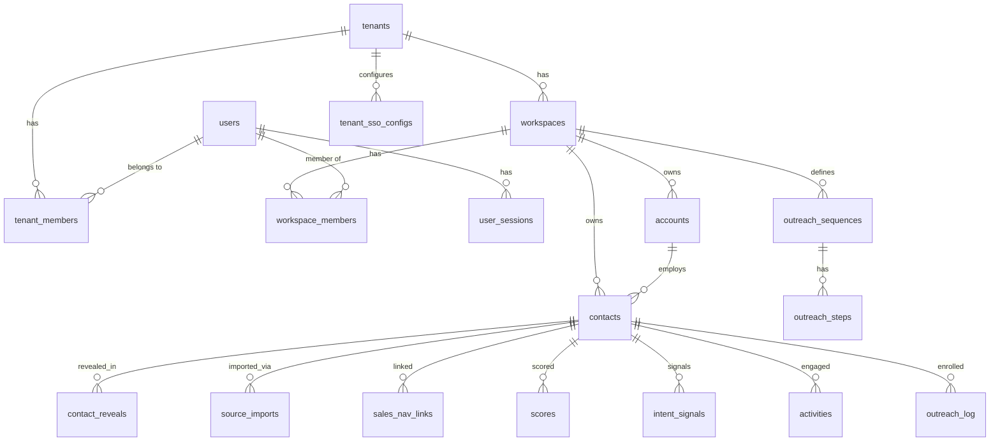

# 03 — Database Design

> **Model:** a **two-layer** data design ([ADR-0021](./decisions/ADR-0021-global-master-graph-and-overlay.md)).
> **Layer 0 — global master graph** (§5.1): a system-owned, **billions-scale**, globally entity-resolved
> universe of people + companies (golden records + the raw evidence behind them) that every tenant searches
> (masked) and reveals from. **Layer 1 — per-workspace overlay** (§5.2): each **workspace** owns its curated
> copy (notes/scores/reveal state), referencing a master entity, isolated by RLS
> ([ADR-0006](./decisions/ADR-0006-per-workspace-multitenant-model.md)). PostgreSQL 16 on **Aurora
> Serverless v2 + RDS Proxy** ([ADR-0010](./decisions/ADR-0010-aws-native-self-hosted-stack.md)), the master
> graph **Citus-sharded** at the top end (§12); Drizzle ORM ([ADR-0001](./decisions/ADR-0001-orm-drizzle.md)).
> DDL is illustrative; Drizzle defs live in `packages/db`.
>
> **Revives the global / three-layer design as Layer 0.** [ADR-0021](./decisions/ADR-0021-global-master-graph-and-overlay.md)
> reopens ADR-0006's *no-global-golden-record* clause and brings back the spirit of
> [ADR-0003](./decisions/ADR-0003-three-layer-data-model.md) (raw→provenance→golden) /
> [ADR-0005](./decisions/ADR-0005-multi-tenancy-and-global-contact-db.md) (global contact DB) — now as one
> layer of a hybrid, not the exclusive model.

## 1. Layers

- **Tenancy:** `tenants`, **`users`** (global identity — [ADR-0019](./decisions/ADR-0019-global-identity-and-tenant-membership.md)),
  `tenant_members`, `workspaces`, `workspace_members`, `invitations` (+ auth: `user_sessions`,
  `user_oauth_accounts`, `user_mfa`/`user_mfa_methods`, `user_password_resets`, `tenant_sso_configs`;
  **auth-origin extension** — `tenant_domains`, `trusted_devices`, `webauthn_credentials`,
  `auth_email_tokens`, `tenant_auth_policies`, `workspace_auth_policies`, `scim_tokens`,
  `oauth_app_clients` — [17](./17-authentication.md),
  [ADR-0016](./decisions/ADR-0016-dedicated-auth-origin-and-cross-domain-token-exchange.md)).
- **Global master graph (Layer 0 — system-owned, [ADR-0021](./decisions/ADR-0021-global-master-graph-and-overlay.md)):** `master_persons`, `master_companies`, `master_emails`, `master_phones`, `master_employment`, `source_records`, `match_links`.
- **Per-workspace overlay (Layer 1):** `accounts`, `contacts`, `contact_reveals`, `sales_nav_links`, `source_imports`,
  `lists`, `list_members`, `saved_searches`, `api_keys`.
- **Intelligence:** `scores`, `intent_signals`.
- **Activity & outreach:** `activities`, `outreach_sequences`, `outreach_steps`, `outreach_log`,
  `audit_log`.
- **Billing:** credit balance lives on `tenants`; `stripe_customers`, `purchases`.
- **Compliance:** `suppression_list`, `consent_records`, `dsar_requests`.
- **Enrichment cost/cache:** `provider_calls` (optional, for worker cost tracking).

## 2. Conventions (binding for all tables)

| Convention | Choice |
|---|---|
| Primary keys | **UUID v7** (time-ordered; overrides the proposal's v4 for index locality at 100M+) |
| `tenant_id` | **denormalized on every data/intelligence/activity row** (fast RLS + per-tenant billing/export without joins) |
| `workspace_id` | on every workspace-scoped row; the RLS key |
| Tenancy isolation | RLS via `SET LOCAL app.current_workspace_id` (+ `app.current_tenant_id` for tenant tables), under a non-`BYPASSRLS` role; GUC reset per pooled connection (RDS Proxy / transaction pooling) |
| Case-insensitive text | `citext` for emails/domains/slugs |
| PII | `email`/`phone` **encrypted at rest** (KMS envelope) + **masked until reveal**; `email_domain` kept as a non-PII facet; per-workspace uniqueness uses a hashed **blind index** (`email_blind_index`), since unique constraints can't run on ciphertext — see [08](./08-compliance.md) |
| Money/credits | integer **credits**; provider cost in `cost_micros` (bigint) |
| Scores/confidence | integers `0–100`; signal `weight` `1–10` |
| Enums | Postgres `enum`/`CHECK` for closed sets |
| Timestamps | `timestamptz`, default `now()`; soft-delete via `deleted_at` where needed |
| High-volume tables | **range-partitioned by month**: `activities`, `audit_log`, `contact_reveals`, `intent_signals`, `scores`, `source_imports`, `outreach_log`, `provider_calls` |
| Extensions | `pgcrypto`, `citext`, `pg_trgm`, `pg_uuidv7` (or app v7); `pgvector` later for semantic search |
| Global master graph (Layer 0) | **system-owned** (not workspace-RLS, §9); reached only via masked search + paid reveal; **hash-sharded** (Citus) by entity / blocking key at billions; raw `source_records` offload to an S3/Iceberg lake (§12) — [ADR-0021](./decisions/ADR-0021-global-master-graph-and-overlay.md) |

## 3. ER overview



Three clusters: **tenancy/auth** (global `users` ↔ `tenant_members` ↔ tenant→workspace→workspace_member, + sessions/SSO — [ADR-0019](./decisions/ADR-0019-global-identity-and-tenant-membership.md)), the **per-workspace data graph** (accounts/contacts and everything hanging off a contact), and **billing/compliance** (tenant-level credits + suppression/consent/DSAR).

## 4. Tenancy & auth

```sql
CREATE EXTENSION IF NOT EXISTS pgcrypto;
CREATE EXTENSION IF NOT EXISTS citext;

CREATE TABLE tenants (
  id                    uuid PRIMARY KEY DEFAULT uuid_generate_v7(),
  name                  varchar(255) NOT NULL,
  slug                  citext NOT NULL UNIQUE,
  plan                  varchar(50) NOT NULL DEFAULT 'free',   -- free|starter|growth|enterprise
  seat_limit            int NOT NULL DEFAULT 1,
  workspace_limit       int,                                   -- null = unlimited
  reveal_credit_balance int NOT NULL DEFAULT 0 CHECK (reveal_credit_balance >= 0),
  features              jsonb NOT NULL DEFAULT '{}',           -- entitlement flags
  status                varchar(50) NOT NULL DEFAULT 'active', -- active|suspended|churned
  region_default        char(2) NOT NULL DEFAULT 'US',
  created_at            timestamptz NOT NULL DEFAULT now(),
  updated_at            timestamptz NOT NULL DEFAULT now()
);

-- users is the GLOBAL identity — one row per person ([ADR-0019]). Org membership lives in tenant_members.
CREATE TABLE users (
  id            uuid PRIMARY KEY DEFAULT uuid_generate_v7(),
  email         citext NOT NULL UNIQUE,                        -- GLOBAL unique (was UNIQUE(tenant_id,email))
  username      citext UNIQUE,                                 -- optional global-unique login alias
  full_name     varchar(255),
  avatar_url    varchar(500),
  password_hash varchar(255),                                  -- Argon2id; null if SSO-only / passkey-only
  auth_provider varchar(50) NOT NULL DEFAULT 'password',       -- password|google|microsoft|saml|oidc
  email_verified_at timestamptz,                               -- required before status='active'
  scim_external_id varchar(255),                               -- set by SCIM provisioning (see 17 §8)
  last_login_at timestamptz,
  status        varchar(50) NOT NULL DEFAULT 'active',         -- active|pending|suspended
  created_at    timestamptz NOT NULL DEFAULT now(),
  updated_at    timestamptz NOT NULL DEFAULT now()
);

-- A person's membership in an org (the user↔tenant link; carries the tenant-level owner capability — H8).
CREATE TABLE tenant_members (
  id                 uuid PRIMARY KEY DEFAULT uuid_generate_v7(),
  tenant_id          uuid NOT NULL REFERENCES tenants(id) ON DELETE CASCADE,
  user_id            uuid NOT NULL REFERENCES users(id) ON DELETE CASCADE,
  is_tenant_owner    boolean NOT NULL DEFAULT false,           -- billing/admin capability (moved off users)
  status             varchar(50) NOT NULL DEFAULT 'active'     -- active|invited|removed
                       CHECK (status IN ('active','invited','removed')),
  invited_by_user_id uuid REFERENCES users(id),
  created_at         timestamptz NOT NULL DEFAULT now(),
  UNIQUE (tenant_id, user_id)
);

CREATE TABLE workspaces (
  id                 uuid PRIMARY KEY DEFAULT uuid_generate_v7(),
  tenant_id          uuid NOT NULL REFERENCES tenants(id) ON DELETE CASCADE,
  name               varchar(255) NOT NULL,
  slug               citext NOT NULL,
  is_default         boolean NOT NULL DEFAULT false,
  created_by_user_id uuid REFERENCES users(id),
  settings           jsonb NOT NULL DEFAULT '{}',
  created_at         timestamptz NOT NULL DEFAULT now(),
  updated_at         timestamptz NOT NULL DEFAULT now(),
  UNIQUE (tenant_id, slug)
);
CREATE UNIQUE INDEX one_default_workspace_per_tenant
  ON workspaces (tenant_id) WHERE is_default;

CREATE TABLE workspace_members (
  id                 uuid PRIMARY KEY DEFAULT uuid_generate_v7(),
  workspace_id       uuid NOT NULL REFERENCES workspaces(id) ON DELETE CASCADE,
  user_id            uuid NOT NULL REFERENCES users(id) ON DELETE CASCADE,
  role               varchar(50) NOT NULL DEFAULT 'member'
                       CHECK (role IN ('owner','admin','member','viewer')),
  invited_by_user_id uuid REFERENCES users(id),
  invited_at         timestamptz NOT NULL DEFAULT now(),
  joined_at          timestamptz,
  status             varchar(50) NOT NULL DEFAULT 'invited'
                       CHECK (status IN ('active','invited','removed')),
  CHECK ((status = 'active') = (joined_at IS NOT NULL)),
  UNIQUE (workspace_id, user_id)
);

-- Departments/teams INSIDE a workspace (intra-workspace segmentation — ADR-0022, H18). NOT a tenancy tier.
CREATE TABLE teams (
  id              uuid PRIMARY KEY DEFAULT uuid_generate_v7(),
  tenant_id       uuid NOT NULL REFERENCES tenants(id) ON DELETE CASCADE,
  workspace_id    uuid NOT NULL REFERENCES workspaces(id) ON DELETE CASCADE,
  department_type varchar(40) NOT NULL                                        -- shared vocab (00 §6, 25)
                    CHECK (department_type IN ('sales','sdr','bdr','marketing','customer_success',
                      'support','operations','compliance','finance','people_hr','administration','custom')),
  name            varchar(255) NOT NULL,
  parent_team_id  uuid REFERENCES teams(id) ON DELETE SET NULL,               -- optional nesting (25)
  settings        jsonb NOT NULL DEFAULT '{}',
  created_at      timestamptz NOT NULL DEFAULT now(),
  UNIQUE (workspace_id, name)
);

CREATE TABLE team_members (
  id           uuid PRIMARY KEY DEFAULT uuid_generate_v7(),
  team_id      uuid NOT NULL REFERENCES teams(id) ON DELETE CASCADE,
  workspace_id uuid NOT NULL REFERENCES workspaces(id) ON DELETE CASCADE,
  user_id      uuid NOT NULL REFERENCES users(id) ON DELETE CASCADE,          -- implies a workspace_member
  team_role    varchar(20) NOT NULL DEFAULT 'member'                          -- orthogonal to workspace role (H8)
                 CHECK (team_role IN ('manager','lead','member','viewer')),
  created_at   timestamptz NOT NULL DEFAULT now(),
  UNIQUE (team_id, user_id)
);

-- Per-team slice of the TENANT credit pool (soft/hard allocation — ADR-0022/ADR-0007, H2/H18).
CREATE TABLE team_credit_budgets (
  id             uuid PRIMARY KEY DEFAULT uuid_generate_v7(),
  team_id        uuid NOT NULL REFERENCES teams(id) ON DELETE CASCADE,
  workspace_id   uuid NOT NULL REFERENCES workspaces(id) ON DELETE CASCADE,
  period         char(7) NOT NULL,                                            -- 'YYYY-MM'
  budget_credits int NOT NULL CHECK (budget_credits >= 0),
  spent_credits  int NOT NULL DEFAULT 0 CHECK (spent_credits >= 0),
  hard_cap       boolean NOT NULL DEFAULT false,                              -- true → block at budget
  UNIQUE (team_id, period)
);
```

**Auth tables** (self-built Lucia — [ADR-0010](./decisions/ADR-0010-aws-native-self-hosted-stack.md)):

```sql
CREATE TABLE user_sessions (
  id                varchar(255) PRIMARY KEY,          -- Lucia session id (durable, on auth origin)
  user_id           uuid NOT NULL REFERENCES users(id) ON DELETE CASCADE,
  device_id         uuid,                              -- per-device tracking (→ trusted_devices)
  refresh_token_hash varchar(255),                     -- opaque refresh token, rotating + reuse-detected
  rotated_from      varchar(255),                      -- prior session id in the refresh family
  app_origin        varchar(255),                      -- originating app origin for this session
  expires_at        timestamptz NOT NULL,
  last_seen_at      timestamptz,
  revoked_at        timestamptz,                       -- set on logout / admin revoke / reuse-detection
  ip_address        inet,
  user_agent        varchar(500),
  created_at        timestamptz NOT NULL DEFAULT now()
);
CREATE TABLE user_oauth_accounts (
  id               uuid PRIMARY KEY DEFAULT uuid_generate_v7(),
  user_id          uuid NOT NULL REFERENCES users(id) ON DELETE CASCADE,
  provider         varchar(50) NOT NULL,
  provider_user_id varchar(255) NOT NULL,
  access_token     text, refresh_token text, expires_at timestamptz,
  created_at       timestamptz NOT NULL DEFAULT now(),
  UNIQUE (provider, provider_user_id)
);
CREATE TABLE user_mfa (
  user_id      uuid PRIMARY KEY REFERENCES users(id) ON DELETE CASCADE,
  totp_secret  varchar(255), backup_codes text[], verified_at timestamptz
);
CREATE TABLE user_password_resets (
  token_hash varchar(255) PRIMARY KEY,
  user_id    uuid NOT NULL REFERENCES users(id) ON DELETE CASCADE,
  expires_at timestamptz NOT NULL, used_at timestamptz
);
CREATE TABLE tenant_sso_configs (
  tenant_id        uuid PRIMARY KEY REFERENCES tenants(id) ON DELETE CASCADE,
  protocol         varchar(10) NOT NULL DEFAULT 'saml' CHECK (protocol IN ('saml','oidc')),
  provider         varchar(50) NOT NULL,
  metadata_url     text, metadata_xml text,             -- SAML
  oidc_issuer      text, oidc_client_id varchar(255), oidc_client_secret_enc bytea, -- OIDC (secret encrypted)
  attribute_mapping jsonb NOT NULL DEFAULT '{}',         -- email|name|role|department → assertion claims
  jit_enabled      boolean NOT NULL DEFAULT true,        -- provision users on first SSO login
  default_role     varchar(50) NOT NULL DEFAULT 'member',-- JIT default workspace role
  enabled          boolean NOT NULL DEFAULT false, enforced boolean NOT NULL DEFAULT false,
  created_at       timestamptz NOT NULL DEFAULT now(), updated_at timestamptz NOT NULL DEFAULT now()
);
```
> OAuth/refresh tokens, OIDC client secrets, and TOTP/WebAuthn secrets are encrypted at rest (KMS
> envelope), like PII.

**Auth-origin extension tables** ([17](./17-authentication.md);
[ADR-0016](./decisions/ADR-0016-dedicated-auth-origin-and-cross-domain-token-exchange.md),
[ADR-0017](./decisions/ADR-0017-progressive-identifier-first-login-and-domain-tenant-routing.md),
[ADR-0018](./decisions/ADR-0018-auth-policy-and-mfa-enforcement-model.md)):

```sql
-- Domain claiming → tenant + SSO routing + registration placement (ADR-0017, ADR-0020)
CREATE TABLE tenant_domains (
  id                 uuid PRIMARY KEY DEFAULT uuid_generate_v7(),
  tenant_id          uuid NOT NULL REFERENCES tenants(id) ON DELETE CASCADE,
  domain             citext NOT NULL UNIQUE,             -- verified domain → exactly one tenant
  verification_token varchar(255), dns_txt_record text,
  status             varchar(20) NOT NULL DEFAULT 'pending' CHECK (status IN ('pending','verified','failed')),
  join_policy        varchar(20) NOT NULL DEFAULT 'sso_only'   -- how a new matching email is placed (ADR-0020)
                       CHECK (join_policy IN ('sso_only','auto_join','request_access')),
  verified_at        timestamptz, created_at timestamptz NOT NULL DEFAULT now()
);

-- Pending invitations to join an org/workspace (accepted at registration → tenant_member + workspace_member)
CREATE TABLE invitations (
  id                 uuid PRIMARY KEY DEFAULT uuid_generate_v7(),
  tenant_id          uuid NOT NULL REFERENCES tenants(id) ON DELETE CASCADE,
  workspace_id       uuid REFERENCES workspaces(id) ON DELETE CASCADE,  -- null = tenant-level invite
  email              citext NOT NULL,
  role               varchar(50) NOT NULL DEFAULT 'member'
                       CHECK (role IN ('owner','admin','member','viewer')),
  is_tenant_owner    boolean NOT NULL DEFAULT false,
  token_hash         varchar(255) NOT NULL UNIQUE,
  invited_by_user_id uuid REFERENCES users(id),
  expires_at         timestamptz NOT NULL,
  accepted_at        timestamptz, created_at timestamptz NOT NULL DEFAULT now()
);

-- Trusted-device registry ("trust this device 30 days") + per-device session metadata
CREATE TABLE trusted_devices (
  id                 uuid PRIMARY KEY DEFAULT uuid_generate_v7(),
  user_id            uuid NOT NULL REFERENCES users(id) ON DELETE CASCADE,
  fingerprint_hash   varchar(255) NOT NULL,
  name               varchar(255), last_ip inet, last_geo varchar(100),
  trusted_until      timestamptz,                        -- MFA-skip window
  revoked_at         timestamptz, created_at timestamptz NOT NULL DEFAULT now(),
  UNIQUE (user_id, fingerprint_hash)
);

-- Multiple MFA methods per user (generalizes single-secret user_mfa) + recovery codes
CREATE TABLE user_mfa_methods (
  id           uuid PRIMARY KEY DEFAULT uuid_generate_v7(),
  user_id      uuid NOT NULL REFERENCES users(id) ON DELETE CASCADE,
  type         varchar(20) NOT NULL CHECK (type IN ('totp','sms','email','webauthn')),
  secret_enc   bytea, label varchar(100),               -- TOTP/SMS/email secret (encrypted)
  verified_at  timestamptz, last_used_at timestamptz, created_at timestamptz NOT NULL DEFAULT now()
);
CREATE TABLE user_mfa_recovery_codes (
  id          uuid PRIMARY KEY DEFAULT uuid_generate_v7(),
  user_id     uuid NOT NULL REFERENCES users(id) ON DELETE CASCADE,
  code_hash   varchar(255) NOT NULL, used_at timestamptz, created_at timestamptz NOT NULL DEFAULT now()
);
CREATE TABLE webauthn_credentials (
  id            uuid PRIMARY KEY DEFAULT uuid_generate_v7(),
  user_id       uuid NOT NULL REFERENCES users(id) ON DELETE CASCADE,
  credential_id bytea NOT NULL UNIQUE, public_key bytea NOT NULL,
  sign_count    bigint NOT NULL DEFAULT 0, transports varchar(100), aaguid uuid,
  name          varchar(255), created_at timestamptz NOT NULL DEFAULT now(), last_used_at timestamptz
);

-- Magic-link + email-OTP tokens (generalizes user_password_resets; resolves on auth.*/verify)
CREATE TABLE auth_email_tokens (
  token_hash varchar(255) PRIMARY KEY,
  user_id    uuid REFERENCES users(id) ON DELETE CASCADE,  -- null for pre-signup verification
  email      citext NOT NULL,
  purpose    varchar(20) NOT NULL CHECK (purpose IN ('magic_link','email_otp','verify')),
  expires_at timestamptz NOT NULL, consumed_at timestamptz, ip_address inet,
  created_at timestamptz NOT NULL DEFAULT now()
);

-- Per-scope auth policy (strictest-wins; workspace may only tighten — ADR-0018)
CREATE TABLE tenant_auth_policies (
  tenant_id       uuid PRIMARY KEY REFERENCES tenants(id) ON DELETE CASCADE,
  mfa_enforcement varchar(10) NOT NULL DEFAULT 'optional' CHECK (mfa_enforcement IN ('off','optional','required')),
  allowed_methods jsonb NOT NULL DEFAULT '["password","oauth","magic_link","sso","passkey"]',
  disable_social  boolean NOT NULL DEFAULT false, require_sso boolean NOT NULL DEFAULT false,
  ip_allowlist    cidr[], session_timeout interval, updated_at timestamptz NOT NULL DEFAULT now()
);
CREATE TABLE workspace_auth_policies (
  workspace_id    uuid PRIMARY KEY REFERENCES workspaces(id) ON DELETE CASCADE,
  tenant_id       uuid NOT NULL REFERENCES tenants(id) ON DELETE CASCADE,
  mfa_enforcement varchar(10) CHECK (mfa_enforcement IN ('off','optional','required')), -- may only tighten tenant
  allowed_methods jsonb, ip_allowlist cidr[], session_timeout interval,
  updated_at      timestamptz NOT NULL DEFAULT now()
);

-- SCIM provisioning bearer tokens (tenant-scoped) + OAuth/dev app clients (CORS allow-list source)
CREATE TABLE scim_tokens (
  id         uuid PRIMARY KEY DEFAULT uuid_generate_v7(),
  tenant_id  uuid NOT NULL REFERENCES tenants(id) ON DELETE CASCADE,
  token_hash varchar(255) NOT NULL, scopes jsonb NOT NULL DEFAULT '[]',
  last_used_at timestamptz, revoked_at timestamptz, created_at timestamptz NOT NULL DEFAULT now()
);
CREATE TABLE oauth_app_clients (
  id                 uuid PRIMARY KEY DEFAULT uuid_generate_v7(),
  tenant_id          uuid NOT NULL REFERENCES tenants(id) ON DELETE CASCADE,
  name               varchar(255) NOT NULL,
  client_id          varchar(255) NOT NULL UNIQUE, client_secret_hash varchar(255),
  redirect_uris      text[] NOT NULL,                    -- must be auth.truepoint.in origins
  allowed_origins    text[] NOT NULL,                    -- CORS allow-list for /token/* (no wildcard)
  scopes             jsonb NOT NULL DEFAULT '[]', created_at timestamptz NOT NULL DEFAULT now()
);
```
> The **cross-domain authorization code** and the **refresh-token lookup** are **ephemeral, held in Redis**
> with a TTL (code 60 s; refresh per `session_timeout`) — **not** Postgres tables — so issuance/validation
> scale horizontally at 1M DAU ([ADR-0016](./decisions/ADR-0016-dedicated-auth-origin-and-cross-domain-token-exchange.md),
> [17 §3/§5](./17-authentication.md#3-cross-domain-token-contract)). JWT signing keys live in Secrets
> Manager (KMS) and rotate; the public set is served at `auth.truepoint.in/.well-known/jwks.json`.

## 5. Data layer

Two layers ([ADR-0021](./decisions/ADR-0021-global-master-graph-and-overlay.md)): the **global master
graph** (§5.1) is the system-owned shared universe; the **per-workspace overlay** (§5.2) is each workspace's
curated copy referencing it. A workspace reaches the master graph only through **masked search** (§9,
[09 §3](./09-api-design.md)) and the **paid reveal** path ([07 §3](./07-billing-credits.md)).

### 5.1 Global master graph (Layer 0 — system-owned)

The globally entity-resolved universe of people + companies: **golden records** + the raw evidence behind
them. Built and owned by the entity-resolution pipeline ([06 §9](./06-enrichment-engine.md)); **not**
workspace-RLS-scoped (§9). Encrypted contact channels (`master_emails`/`master_phones`) are never returned by
search — only by a paid reveal, which copies the value into the calling workspace's overlay.

```sql
-- prospect↔company linking lives in master_employment (current + past); the strongest match key is
-- email-domain → company primary_domain/alt_domains (registrable domain via the Public Suffix List).

CREATE TABLE master_companies (
  id                  uuid PRIMARY KEY DEFAULT uuid_generate_v7(),
  primary_domain      citext UNIQUE,                  -- registrable domain (PSL); the strongest company key
  alt_domains         citext[] NOT NULL DEFAULT '{}', -- redirects, acquired brands, country TLDs
  name                varchar(255) NOT NULL,
  name_normalized     citext,                         -- legal-suffix-stripped + casefolded (no-domain fallback)
  linkedin_company_id varchar(255) UNIQUE,
  parent_company_id   uuid REFERENCES master_companies(id),     -- subsidiary → parent hierarchy
  industry varchar(100), sub_industry varchar(100),
  employee_count int, employee_band varchar(20),      -- band ('11-50','51-200',…) is the search facet
  revenue_range varchar(50),
  technographics jsonb NOT NULL DEFAULT '{}',          -- detected tech stack (BuiltWith/HG Insights)
  hq_country varchar(100), hq_city varchar(100),
  data_quality_score int CHECK (data_quality_score BETWEEN 0 AND 100),
  region char(2), jurisdiction char(2),
  created_at timestamptz NOT NULL DEFAULT now(), updated_at timestamptz NOT NULL DEFAULT now()
);
CREATE INDEX gin_master_companies_name ON master_companies USING gin (name_normalized gin_trgm_ops);

CREATE TABLE master_persons (
  id                  uuid PRIMARY KEY DEFAULT uuid_generate_v7(),
  linkedin_public_id  varchar(255) UNIQUE,            -- strongest person key
  full_name           varchar(255), first_name varchar(100), last_name varchar(100),
  current_company_id  uuid REFERENCES master_companies(id),     -- denormalized from the current employment edge
  job_title varchar(255),
  seniority_level varchar(50) CHECK (seniority_level IS NULL OR seniority_level IN
                    ('c_suite','vp','director','manager','ic','other')),
  department varchar(100), location_country varchar(100), location_city varchar(100),
  has_email boolean NOT NULL DEFAULT false,           -- precomputed search facets (no join at query time)
  has_phone boolean NOT NULL DEFAULT false,
  data_quality_score int CHECK (data_quality_score BETWEEN 0 AND 100),
  is_suppressed boolean NOT NULL DEFAULT false,       -- global suppression/objection mirror; gates reveal (08 §3)
  region char(2), jurisdiction char(2),
  created_at timestamptz NOT NULL DEFAULT now(), updated_at timestamptz NOT NULL DEFAULT now()
);
CREATE INDEX gin_master_persons_name ON master_persons USING gin (full_name gin_trgm_ops);
CREATE INDEX idx_master_persons_company ON master_persons (current_company_id);

CREATE TABLE master_employment (                       -- person↔company link, current + past
  id                uuid PRIMARY KEY DEFAULT uuid_generate_v7(),
  master_person_id  uuid NOT NULL REFERENCES master_persons(id) ON DELETE CASCADE,
  master_company_id uuid NOT NULL REFERENCES master_companies(id) ON DELETE CASCADE,
  title varchar(255), department varchar(100), seniority_level varchar(50),
  is_current boolean NOT NULL DEFAULT true, started_on date, ended_on date,
  UNIQUE (master_person_id, master_company_id, started_on)
);
CREATE INDEX idx_employment_current ON master_employment (master_person_id) WHERE is_current;

CREATE TABLE master_emails (                           -- verifiable channel, separated from the person record
  id                uuid PRIMARY KEY DEFAULT uuid_generate_v7(),
  master_person_id  uuid NOT NULL REFERENCES master_persons(id) ON DELETE CASCADE,
  email_enc         bytea NOT NULL,                    -- encrypted; revealed only via the paid reveal path
  email_blind_index bytea NOT NULL UNIQUE,             -- HMAC; GLOBAL dedup + DSAR/suppression lookup key
  email_domain      citext,
  email_status      varchar(20) NOT NULL DEFAULT 'unverified'
                      CHECK (email_status IN ('unverified','valid','risky','invalid','catch_all','unknown')),
  source_count int NOT NULL DEFAULT 1,                 -- corroboration (survivorship input)
  last_verified_at timestamptz, verification_source varchar(50), is_primary boolean NOT NULL DEFAULT false,
  created_at timestamptz NOT NULL DEFAULT now()
);

CREATE TABLE master_phones (
  id                uuid PRIMARY KEY DEFAULT uuid_generate_v7(),
  master_person_id  uuid NOT NULL REFERENCES master_persons(id) ON DELETE CASCADE,
  phone_enc         bytea NOT NULL,
  phone_blind_index bytea NOT NULL UNIQUE,             -- HMAC over E.164 (libphonenumber-normalized)
  line_type varchar(20), phone_status varchar(50),
  source_count int NOT NULL DEFAULT 1, last_verified_at timestamptz,
  created_at timestamptz NOT NULL DEFAULT now()
);

CREATE TABLE source_records (                          -- immutable per-source raw evidence feeding ER (lineage)
  id                  uuid PRIMARY KEY DEFAULT uuid_generate_v7(),
  source_name         varchar(50) NOT NULL,            -- apollo|zoominfo|clearbit|coop|public_registry|…
  content_hash        bytea NOT NULL UNIQUE,           -- sha256(canonical payload) → idempotent ingest
  raw_data            jsonb NOT NULL,                  -- verbatim source payload
  match_keys          jsonb NOT NULL DEFAULT '{}',     -- extracted normalized keys (email_bi, domain, li_id, phone)
  resolved_person_id  uuid REFERENCES master_persons(id),       -- set by the ER pipeline
  resolved_company_id uuid REFERENCES master_companies(id),
  lawful_basis_snapshot jsonb, region char(2),
  ingested_at         timestamptz NOT NULL DEFAULT now()        -- range-partitioned by month; bulk to S3/Iceberg lake
);

CREATE TABLE match_links (                             -- ER output: which source_records form which golden entity
  id                uuid PRIMARY KEY DEFAULT uuid_generate_v7(),
  entity_type       varchar(10) NOT NULL CHECK (entity_type IN ('person','company')),
  cluster_id        uuid NOT NULL,                     -- the golden entity id (master_persons/master_companies.id)
  source_record_id  uuid NOT NULL REFERENCES source_records(id) ON DELETE CASCADE,
  match_probability numeric(4,3) CHECK (match_probability BETWEEN 0 AND 1),  -- Splink (Fellegi-Sunter)
  match_method      varchar(20) NOT NULL,              -- deterministic|splink|manual
  is_duplicate_of   uuid,                              -- survivor link when two clusters merge
  review_status     varchar(20) NOT NULL DEFAULT 'auto'
                      CHECK (review_status IN ('auto','pending','confirmed','rejected')),  -- low-confidence → review queue
  resolved_at       timestamptz NOT NULL DEFAULT now()
);
CREATE INDEX idx_match_links_cluster ON match_links (entity_type, cluster_id);
```

### 5.2 Per-workspace overlay (Layer 1)

```sql
CREATE TABLE accounts (
  id                    uuid PRIMARY KEY DEFAULT uuid_generate_v7(),
  tenant_id             uuid NOT NULL REFERENCES tenants(id) ON DELETE CASCADE,
  workspace_id          uuid NOT NULL REFERENCES workspaces(id) ON DELETE CASCADE,
  master_company_id     uuid REFERENCES master_companies(id),   -- overlay → Layer-0 golden company (ADR-0021)
  name                  varchar(255) NOT NULL,
  domain                citext,
  linkedin_company_url  varchar(500), sales_nav_account_url varchar(500),
  industry varchar(100), sub_industry varchar(100),
  employee_count int, revenue_range varchar(50),
  hq_country varchar(100), hq_city varchar(100),
  icp_fit_score int CHECK (icp_fit_score BETWEEN 0 AND 100),
  owner_user_id uuid REFERENCES users(id),                     -- record owner (ADR-0022, H18)
  assigned_team_id uuid REFERENCES teams(id) ON DELETE SET NULL,
  visibility varchar(20) NOT NULL DEFAULT 'workspace'          -- record_visibility (ADR-0022, H18)
                CHECK (visibility IN ('workspace','team','owner')),
  data_quality_score int CHECK (data_quality_score BETWEEN 0 AND 100),  -- freshness/quality (ADR-0025, 22)
  created_at timestamptz NOT NULL DEFAULT now(), updated_at timestamptz NOT NULL DEFAULT now()
);
CREATE UNIQUE INDEX uniq_accounts_ws_domain ON accounts (workspace_id, domain) WHERE domain IS NOT NULL;
CREATE INDEX idx_accounts_master ON accounts (master_company_id) WHERE master_company_id IS NOT NULL;

CREATE TABLE contacts (
  id                    uuid PRIMARY KEY DEFAULT uuid_generate_v7(),
  tenant_id             uuid NOT NULL REFERENCES tenants(id) ON DELETE CASCADE,
  workspace_id          uuid NOT NULL REFERENCES workspaces(id) ON DELETE CASCADE,
  account_id            uuid REFERENCES accounts(id) ON DELETE SET NULL,
  master_person_id      uuid REFERENCES master_persons(id),     -- overlay → Layer-0 golden person (ADR-0021)
  first_name varchar(100), last_name varchar(100),
  email_enc             bytea,                                  -- encrypted; masked until reveal
  email_blind_index     bytea,                                  -- HMAC(email) for uniqueness/lookups
  email_domain          citext,                                 -- non-PII facet
  email_status          varchar(20) NOT NULL DEFAULT 'unverified'
                          CHECK (email_status IN ('unverified','valid','risky','invalid','catch_all','unknown')),
  linkedin_url varchar(500), linkedin_public_id varchar(255),
  sales_nav_profile_url varchar(500), sales_nav_lead_id varchar(255),
  job_title varchar(255),
  seniority_level varchar(50) CHECK (seniority_level IS NULL OR seniority_level IN
                    ('c_suite','vp','director','manager','ic','other')),
  department varchar(100),
  phone_enc             bytea,                                  -- encrypted; masked until reveal
  phone_status varchar(50) CHECK (phone_status IS NULL OR phone_status IN ('direct','mobile','hq','unknown','valid','invalid')),
  location_country varchar(100), location_city varchar(100),
  priority_score int CHECK (priority_score BETWEEN 0 AND 100),  -- cache of latest scores.composite_score
  outreach_status varchar(50) NOT NULL DEFAULT 'new'
                    CHECK (outreach_status IN ('new','in_sequence','replied','meeting_booked','disqualified','nurture','unsubscribed')),
  is_revealed boolean NOT NULL DEFAULT false,
  revealed_by_user_id uuid REFERENCES users(id),               -- first revealer (per-workspace ownership)
  revealed_at timestamptz,
  owner_user_id uuid REFERENCES users(id),                     -- record owner (assignment/territory — ADR-0022, H18)
  assigned_team_id uuid REFERENCES teams(id) ON DELETE SET NULL,
  visibility varchar(20) NOT NULL DEFAULT 'workspace'          -- record_visibility (ADR-0022, H18)
                CHECK (visibility IN ('workspace','team','owner')),
  last_verified_at timestamptz,                                -- per-record freshness (ADR-0025, 22)
  data_quality_score int CHECK (data_quality_score BETWEEN 0 AND 100),
  freshness_status varchar(20) CHECK (freshness_status IS NULL OR freshness_status IN ('fresh','aging','stale','expired')),
  jurisdiction char(2), region char(2) NOT NULL DEFAULT 'US',
  last_activity_at timestamptz,
  created_at timestamptz NOT NULL DEFAULT now(), updated_at timestamptz NOT NULL DEFAULT now(),
  CHECK (is_revealed = (revealed_by_user_id IS NOT NULL)),
  CHECK (is_revealed = (revealed_at IS NOT NULL))
);
CREATE UNIQUE INDEX uniq_contacts_ws_email ON contacts (workspace_id, email_blind_index) WHERE email_blind_index IS NOT NULL;
CREATE UNIQUE INDEX uniq_contacts_ws_linkedin ON contacts (workspace_id, linkedin_public_id) WHERE linkedin_public_id IS NOT NULL;
CREATE UNIQUE INDEX uniq_contacts_ws_salesnav ON contacts (workspace_id, sales_nav_lead_id) WHERE sales_nav_lead_id IS NOT NULL;
CREATE INDEX idx_contacts_master ON contacts (master_person_id) WHERE master_person_id IS NOT NULL;
```

**`contact_reveals`** (event log; first per `(workspace_id,contact_id)` sets ownership — [ADR-0007](./decisions/ADR-0007-per-workspace-reveal-and-credit-counter.md)):
`id · tenant_id · workspace_id · contact_id · revealed_by_user_id · reveal_type(email|phone|full_profile) · data_source(apollo|zoominfo|linkedin|internal) · credits_consumed int(default 1,>=0) · revealed_fields jsonb · revealed_at`. **Unique `(workspace_id, contact_id, reveal_type)`** for reveal idempotency (the app guard ADR-0007 requires).

**`source_imports`** (provenance under this model): `id · tenant_id · workspace_id · contact_id · imported_by_user_id · source_name(apollo|zoominfo|linkedin|sales_navigator|hubspot|salesforce|clearbit|manual) · source_file · raw_data jsonb · content_hash bytea · imported_at`. (`content_hash` lets us dedup identical payloads — answers an open question.)

**`sales_nav_links`**: `id · tenant_id · workspace_id · contact_id? · account_id? · link_type(profile|account|saved_search|lead_list|account_list|inmail_thread) · url text · title · notes · created_by_user_id · last_synced_at · created_at · updated_at` + CHECK tying `link_type` to contact/account presence.

**`lists` / `list_members` / `saved_searches`**: workspace-scoped (static + dynamic lists, saved filters). **`api_keys`**: tenant-scoped, hashed + scoped (public API).

## 6. Intelligence layer ([ADR-0008](./decisions/ADR-0008-lead-scoring-model.md))

- **`scores`** (versioned, append-per-rescore): `id · tenant_id · workspace_id · contact_id · icp_fit · intent_score · engagement_score · composite_score (all 0–100) · score_breakdown jsonb · scored_at`. A trigger syncs `contacts.priority_score = composite_score`.
- **`intent_signals`**: `id · tenant_id · workspace_id · contact_id · signal_type · signal_source · detail · weight(1–10) · detected_at`.
- **Lead score (prospect quality) is distinct from `email_status` (field correctness)** — never conflate.

## 7. Activity & outreach layer ([ADR-0009](./decisions/ADR-0009-outreach-engine-enroll-and-send.md))

- **`activities`**: `id · tenant_id · workspace_id · contact_id · performed_by_user_id · activity_type · channel(email|phone|linkedin|sales_navigator|in-person) · subject · body · outcome · metadata jsonb · occurred_at · created_at`.
- **`outreach_sequences`** (workspace-scoped definitions) → **`outreach_steps`** (ordered steps: channel, delay, template) — the **send engine** definitions.
- **`outreach_log`** (enrollment + status): `id · tenant_id · workspace_id · contact_id · sequence_id? · enrolled_by_user_id · campaign_name · platform(klaviyo|apollo|salesloft|outreach|linkedin|ses|manual) · external_campaign_id · status(enrolled|active|replied|completed|unsubscribed|bounced) · enrolled_at · sent_at · replied_at`.
- **`audit_log`**: `id · tenant_id · workspace_id?(null=tenant-level) · actor_user_id?(null=system) · action · entity_type · entity_id · metadata jsonb · ip_address inet · user_agent · origin_domain · occurred_at` (append-only, monthly-partitioned). **`origin_domain`** records the acting origin (`auth.truepoint.in` vs the originating app origin) per event ([17 §9](./17-authentication.md#9-audit--events)). The closed `action` enum additionally covers **auth events** — `login.success/failure/locked`, `mfa.challenge/success/failure`, `password.reset.request/complete`, `sso.initiated/callback`, `token.issued/refresh/revoke`, `device.trusted/revoked`, `session.revoked`, `code.issued/exchanged`, `signup`, `oauth.link` — alongside the reveal/send/suppression/DSAR/credit actions ([08 §5](./08-compliance.md)).

## 8. Billing & compliance

- **Credits:** `tenants.reveal_credit_balance` (counter, `CHECK >= 0`) is authoritative ([ADR-0007](./decisions/ADR-0007-per-workspace-reveal-and-credit-counter.md)); decremented inside the reveal transaction with `FOR UPDATE`. `stripe_customers` (tenant↔Stripe), `purchases` (`stripe_event_id` unique → idempotent top-ups). The charge amount is set by the **verified result** — `valid` charges, `invalid`/`catch_all`/`unknown` → `contact_reveals.credits_consumed = 0`; a hard bounce within the guarantee window **credits the balance back** via an audited counter adjustment (audit action `credit.adjust`, [08 §5](./08-compliance.md)) — **no new table** ([ADR-0013](./decisions/ADR-0013-charge-for-verified-data-credit-back.md)).
- **Compliance ([08](./08-compliance.md)):** `suppression_list` (scope global|tenant|workspace; match email|domain|phone|contact_id) — **now gates both reveals and outreach sending** ([ADR-0009](./decisions/ADR-0009-outreach-engine-enroll-and-send.md)); `consent_records` (lawful basis per subject/jurisdiction); `dsar_requests` (access/delete/rectify; delete fans out across all per-workspace copies).
- **`provider_calls`** (optional, enrichment cost/cache): `provider_name · request_hash unique · cost_micros · cache_hit · called_at` — workspace-scoped cost tracking for the enrichment workers ([06](./06-enrichment-engine.md)).

## 9. Row-level security

RLS on every workspace-scoped table; policy `USING (workspace_id = current_setting('app.current_workspace_id')::uuid)`. Tenant-scoped tables (tenants/api_keys/purchases/audit_log tenant rows, the membership table `tenant_members`, plus the auth-origin tenant tables `tenant_domains`/`invitations`/`tenant_auth_policies`/`tenant_sso_configs`/`scim_tokens`/`oauth_app_clients`) use `app.current_tenant_id`; `workspace_auth_policies` is workspace-scoped. **`users` is the GLOBAL identity** ([ADR-0019](./decisions/ADR-0019-global-identity-and-tenant-membership.md)) — **not** tenant-RLS-scoped; it and the **user-scoped auth tables** (`user_sessions`/`trusted_devices`/`user_mfa_methods`/`user_mfa_recovery_codes`/`webauthn_credentials`/`auth_email_tokens`) are owned by the auth service (`apps/auth`) and accessed by `user_id`, before any tenant/workspace is selected. The API sets `SET LOCAL app.current_tenant_id` + `app.current_workspace_id` per request after auth; queries run as a non-`BYPASSRLS` role; **RDS Proxy** (transaction pooling) requires the GUC be set within the transaction and reset on checkout.

**Intra-workspace team visibility** (departments — [ADR-0022](./decisions/ADR-0022-departments-teams-intra-workspace-segmentation.md), **H18**). Departments are **not** a new RLS scope — workspace RLS still isolates by `app.current_workspace_id`. Records with `visibility IN ('team','owner')` are **further** restricted *within* the workspace by an app-layer authz filter (and an optional supplementary RLS predicate keyed on `assigned_team_id`/`owner_user_id` against the request's team context), used by Finance/HR/Compliance ([25 §4](./25-departments-teams-workspaces.md)). Default `visibility='workspace'` is readable by the whole workspace; `teams`/`team_members` themselves are workspace-RLS-scoped.

**Layer-0 master graph is system-owned** ([ADR-0021](./decisions/ADR-0021-global-master-graph-and-overlay.md)). The `master_*` / `source_records` / `match_links` tables are **not** workspace-RLS-scoped — no customer-facing query reads them directly. Only the **ER pipeline**, **search-sync**, and the **reveal** service touch them (under their own least-privilege roles); customers reach the universe solely through **masked global search** (no PII leaves the index) and the **paid reveal** path, which decrypts a `master_emails`/`master_phones` channel only inside the reveal transaction (§10, [09 §3](./09-api-design.md)).

**Privileged staff path (internal only).** The super-admin console `apps/admin` ([13](./13-platform-admin.md)) performs audited cross-tenant reads under a **dedicated privileged role** that **bypasses workspace RLS** — *distinct* from the app's non-`BYPASSRLS` role and used by no customer-facing service. Every such access is written to an immutable **`platform_audit_log`**; impersonation is time-boxed and banner-flagged ([ADR-0011](./decisions/ADR-0011-platform-admin-and-privileged-access.md)).

## 10. Triggers & DB-side logic

Convention: keep business logic in the app; use triggers only for invariants that must hold regardless of caller.
1. **Reveal ownership** — `AFTER INSERT ON contact_reveals`: set `contacts.is_revealed/revealed_by_user_id/revealed_at` `WHERE id = NEW.contact_id AND is_revealed = FALSE` (idempotent; first reveal wins). **The credit charge is NOT in this trigger** — it happens in the app reveal transaction against `tenants.reveal_credit_balance` ([07 §3](./07-billing-credits.md)).
2. **Score sync** — `AFTER INSERT ON scores`: `contacts.priority_score = NEW.composite_score`.
3. **`updated_at`** — `BEFORE UPDATE` on tenants/users/workspaces/accounts/contacts/sales_nav_links.

`provision_new_signup(identity, ...)` creates (or reuses) the global `users` identity → tenant → default workspace → **owner `tenant_member`** (`is_tenant_owner = true`) → owner `workspace_member` → audit row, in one transaction ([ADR-0019](./decisions/ADR-0019-global-identity-and-tenant-membership.md), [ADR-0020](./decisions/ADR-0020-existence-revealing-identifier-first-and-registration.md)).

## 11. Integrity rules

- `tenants.reveal_credit_balance >= 0` (CHECK) — overdraft impossible.
- Unique `contact_reveals (workspace_id, contact_id, reveal_type)` — reveal idempotency (app also sends `Idempotency-Key`).
- Unique `(workspace_id, email_blind_index)` / `(workspace_id, linkedin_public_id)` / `(workspace_id, sales_nav_lead_id)` — per-workspace overlay dedup.
- **Master graph (global) dedup keys** ([ADR-0021](./decisions/ADR-0021-global-master-graph-and-overlay.md)): unique `master_companies.primary_domain` / `master_companies.linkedin_company_id` / `master_persons.linkedin_public_id` / `master_emails.email_blind_index` / `master_phones.phone_blind_index`; unique `source_records.content_hash` — idempotent ingest.
- Unique `purchases.stripe_event_id` — idempotent top-ups.
- One default workspace per tenant (partial unique).
- RLS on all workspace-scoped tables.

## 12. Indexing, partitioning & scale (overlay 100M+, master graph billions)

**Indexing strategy.** UUID v7 PKs everywhere for append locality. Beyond the PKs: **B-tree** on every
match/dedup key and FK; **GIN + `pg_trgm`** for fuzzy name/company search (`master_persons.full_name`,
`master_companies.name_normalized`) so typo-tolerant lookups don't table-scan (a trigram GIN index turns an
unindexed wildcard scan from seconds into low-ms); **composite** indexes for the hot multi-attribute filter
combos (e.g. `(workspace_id, outreach_status, priority_score)`); **partial** indexes where a predicate is
always present (the per-workspace dedup uniques `WHERE … IS NOT NULL`, `idx_employment_current WHERE
is_current`, `idx_*_master WHERE … IS NOT NULL`); **covering** (`INCLUDE`) indexes for the masked list
projection so result reads are index-only. ER **blocking keys** (e.g. `metaphone(last_name)+domain`) are
materialized columns with their own indexes. Heavy faceted filtering is **not** served from Postgres — it
lives in the search index (below).

**Partitioning.** Range-partition by month: `activities`, `audit_log`, `contact_reveals`, `intent_signals`,
`scores`, `source_imports`, `outreach_log`, `provider_calls`, `source_records` (the master evidence
log), **and the new event/AI/automation logs `outbox`, `ai_requests`, `automation_runs`** (§14).

**Master-graph scale (billions, [ADR-0021](./decisions/ADR-0021-global-master-graph-and-overlay.md)).** The
golden tables outgrow a single Aurora writer, so **shard horizontally with Citus** by a hash of the entity /
blocking key — co-locating a cluster's `source_records` + `match_links` + golden row on one shard so
resolution and reveal stay node-local. Bulk raw evidence lives in an **S3 + Iceberg** lake; batch ER (Splink)
runs on **Spark/Athena** over the lake and writes golden rows back. The **masked search index** is
**OpenSearch** (sharded inverted index, facet/range aggregations, `search_after` cursoring) behind
`SearchPort` ([ADR-0002](./decisions/ADR-0002-search-postgres-then-engine.md) amended); **ClickHouse** serves
high-cardinality facet counts at billions. Aurora Serverless v2 auto-scales the overlay; the **search-sync**
worker fans Aurora logical-replication CDC out to OpenSearch + ClickHouse
([02 §3.3](./02-architecture.md#33-cdc-search--analytics)).

## 13. Open questions

1. **PII vs proposal's plaintext:** we keep `email_enc/phone_enc` + `email_blind_index` for GDPR/CCPA; confirm the blind-index (HMAC w/ KMS key) approach for per-workspace uniqueness.
2. **Reveal pricing by `reveal_type`** (email vs phone vs full_profile) — final credit costs ([07 §1](./07-billing-credits.md)).
3. **Global entity-resolution quality** ([ADR-0021](./decisions/ADR-0021-global-master-graph-and-overlay.md), [06 §9](./06-enrichment-engine.md)) — deterministic keys + blocking/MinHash-LSH + Splink at billions; blocking-rule + match-threshold tuning per dataset and the manual-review-queue workflow are **now specified** in [22 §6](./22-data-quality-freshness-lifecycle.md) (quality targets in [22 §5](./22-data-quality-freshness-lifecycle.md)).
4. ~~Cross-workspace "tenant search" read layer~~ — **Resolved:** the global master graph ([ADR-0021](./decisions/ADR-0021-global-master-graph-and-overlay.md)) **is** the shared search layer; every tenant searches the universe (masked) and reveals into its overlay.
5. **DSAR fan-out** now deletes the **golden identity + its `source_records` + every overlay copy** — procedure + SLA ([08 §4](./08-compliance.md)); the golden identity makes "find everywhere" provable.
6. **Billing hardening:** ADR-0007 counter risks — when to reintroduce an append-only ledger.
7. **Citus sharding cutover** — at what master-graph size do we move the golden tables from a single Aurora writer to Citus shards? (the overlay stays on Aurora.) **Threshold specified** in [18 §8](./18-scalability-performance.md) (~500M golden rows or sustained writer pressure).
8. **Co-op / contributory ingestion** — if/when workspace-imported data feeds the master graph, the opt-in + disclosure model ([06 §1](./06-enrichment-engine.md)); **off by default**.

## 14. Planned schema additions (app-surface & platform)

These tables/fields are implied by the app surface ([11](./11-information-architecture.md)),
settings ([12](./12-settings.md)), and platform console ([13](./13-platform-admin.md)). **Flagged here as
forthcoming** (their own migration) — not yet defined above, not silently assumed.

**Customer app:** `tasks` (Inbox reminders, manual + system), `templates` (+ snippets/merge fields),
`notifications` (or `users.settings` jsonb for prefs), `webhooks` (+ delivery log), `integrations`
(CRM/Slack connections + encrypted OAuth tokens), `sending_identities` (per-user/workspace send-from
addresses + DKIM status).

**Data quality & entity resolution:** record-level fields (`last_verified_at`, `verification_source`,
`data_quality_score` 0–100 — distinct from lead score and `email_status`) live on the **master** records
(§5.1) and mirror onto overlay copies; tables `data_quality_rules`, `verification_jobs`. **Global entity
resolution** is the `source_records` → `match_links` → golden-record pipeline (§5.1): deterministic keys +
**blocking / MinHash-LSH** candidate generation + **Splink** probabilistic scoring + **survivorship**, run as
batch jobs (Spark/Athena over the lake — [ADR-0015](./decisions/ADR-0015-entity-resolution-dedup-engine.md)
amended by [ADR-0021](./decisions/ADR-0021-global-master-graph-and-overlay.md), [06 §9](./06-enrichment-engine.md)).
`match_links.is_duplicate_of` links merged survivors; low-confidence merges route to a manual review queue.
(The overlay still dedups within a workspace on its blind-index uniques, §11.)

**Platform scope** ([13](./13-platform-admin.md), [ADR-0011](./decisions/ADR-0011-platform-admin-and-privileged-access.md)):
`staff_users`, `staff_roles`/`staff_permissions`, `impersonation_sessions`, **`platform_audit_log`**
(immutable, separate from tenant `audit_log`), `feature_flags` (+ per-tenant overrides),
`plan_templates`/`pricing`, `provider_configs`, `announcements`, `abuse_flags`/`account_holds`,
`system_status`. Time-based partitioning applies to `platform_audit_log` and `verification_jobs`
(per §12). DB-management views read from Postgres catalogs / Performance Insights / CloudWatch — mostly
dashboards, not new schema.

**Departments & teams** ([25](./25-departments-teams-workspaces.md), [ADR-0022](./decisions/ADR-0022-departments-teams-intra-workspace-segmentation.md)):
`teams`, `team_members`, `team_credit_budgets` (defined in §4); overlay rows carry
`owner_user_id`/`assigned_team_id`/`visibility` (`record_visibility`, §5.2). New shared-vocab enums:
`department_type`, `team_role`, `record_visibility`.

**Events & real-time** ([20](./20-event-driven-realtime-backbone.md), [ADR-0027](./decisions/ADR-0027-real-time-delivery-and-event-backbone.md)):
`outbox` (transactional outbox — append a row in the writer's tx; relay publishes; month-partitioned, §12).

**AI & intelligence** ([23](./23-ai-intelligence-layer.md), [ADR-0023](./decisions/ADR-0023-ai-provider-and-intelligence-architecture.md)):
`ai_requests` (metered call log: task/model/tokens/cost/grounded-sources/review-status; month-partitioned),
`ai_evals` (eval/safety golden sets), `ai_cache` (prompt+grounding-hash keyed). **`embeddings`** uses the
`pgvector` extension for semantic retrieval. New enum: `ai_task_type`.

**Automation** ([27](./27-workflow-automation-engine.md), [ADR-0026](./decisions/ADR-0026-workflow-automation-engine.md)):
`automation_rules` (trigger + JSON conditions + ordered actions, workspace/team-scoped, dry-run),
`automation_runs` (append-only execution log; month-partitioned). New enums: `automation_trigger`,
`automation_action`.

**Search / exploration** ([24](./24-advanced-search-exploration-ux.md)): `saved_views` (per-user/team column
+ sort layouts, shareable) and `segments` (dynamic smart segments with scheduled refresh) — alongside the
existing `lists`/`saved_searches` (§5.2).

**Data freshness** ([22](./22-data-quality-freshness-lifecycle.md), [ADR-0025](./decisions/ADR-0025-data-freshness-decay-and-reverification-lifecycle.md)):
`data_quality_score = round(100 × (0.4·completeness + 0.3·verification + 0.3·freshness))`; per-record
`last_verified_at` + `freshness_status` (`fresh|aging|stale|expired`) on master + overlay (§5.2);
`verification_jobs`/`data_quality_rules` (above) drive scheduled re-verify by per-field SLA.
