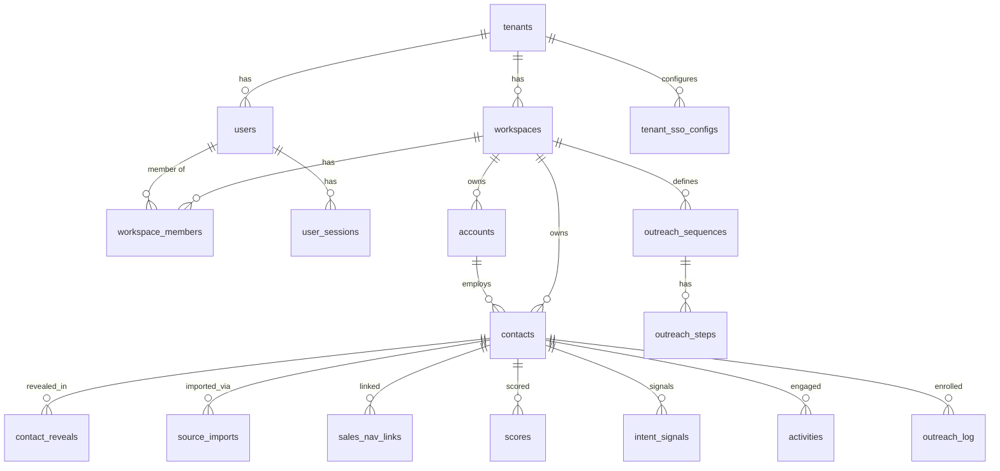

# 03 — Database Design

> **Model:** per-workspace multi-tenant CRM ([ADR-0006](./decisions/ADR-0006-per-workspace-multitenant-model.md)).
> Each **tenant** has **workspaces**; each workspace owns its **own** contacts/accounts. There is **no
> global golden record** — provenance is per-import (`source_imports`). PostgreSQL 16 on **Aurora
> Serverless v2 + RDS Proxy** ([ADR-0010](./decisions/ADR-0010-aws-native-self-hosted-stack.md)),
> Drizzle ORM ([ADR-0001](./decisions/ADR-0001-orm-drizzle.md)). DDL is illustrative; Drizzle defs live
> in `packages/db`.
>
> **Supersedes the prior three-layer/global design.** See superseded
> [ADR-0003](./decisions/ADR-0003-three-layer-data-model.md) /
> [ADR-0005](./decisions/ADR-0005-multi-tenancy-and-global-contact-db.md) for what was traded away.

## 1. Layers

- **Tenancy:** `tenants`, `users`, `workspaces`, `workspace_members` (+ auth: `user_sessions`,
  `user_oauth_accounts`, `user_mfa`, `user_password_resets`, `tenant_sso_configs`).
- **Data:** `accounts`, `contacts`, `contact_reveals`, `sales_nav_links`, `source_imports`,
  `lists`, `list_members`, `saved_searches`, `api_keys`.
- **Intelligence:** `scores`, `intent_signals`.
- **Activity & outreach:** `activities`, `outreach_sequences`, `outreach_steps`, `outreach_log`,
  `audit_log`.
- **Billing:** credit balance lives on `tenants`; `stripe_customers`, `purchases`.
- **Compliance:** `suppression_list`, `consent_records`, `dsar_requests`.
- **Enrichment cost/cache:** `provider_calls` (optional, for worker cost tracking).

## 2. Conventions (binding for all tables)

| Convention | Choice |
|---|---|
| Primary keys | **UUID v7** (time-ordered; overrides the proposal's v4 for index locality at 100M+) |
| `tenant_id` | **denormalized on every data/intelligence/activity row** (fast RLS + per-tenant billing/export without joins) |
| `workspace_id` | on every workspace-scoped row; the RLS key |
| Tenancy isolation | RLS via `SET LOCAL app.current_workspace_id` (+ `app.current_tenant_id` for tenant tables), under a non-`BYPASSRLS` role; GUC reset per pooled connection (RDS Proxy / transaction pooling) |
| Case-insensitive text | `citext` for emails/domains/slugs |
| PII | `email`/`phone` **encrypted at rest** (KMS envelope) + **masked until reveal**; `email_domain` kept as a non-PII facet; per-workspace uniqueness uses a hashed **blind index** (`email_blind_index`), since unique constraints can't run on ciphertext — see [08](./08-compliance.md) |
| Money/credits | integer **credits**; provider cost in `cost_micros` (bigint) |
| Scores/confidence | integers `0–100`; signal `weight` `1–10` |
| Enums | Postgres `enum`/`CHECK` for closed sets |
| Timestamps | `timestamptz`, default `now()`; soft-delete via `deleted_at` where needed |
| High-volume tables | **range-partitioned by month**: `activities`, `audit_log`, `contact_reveals`, `intent_signals`, `scores`, `source_imports`, `outreach_log`, `provider_calls` |
| Extensions | `pgcrypto`, `citext`, `pg_trgm`, `pg_uuidv7` (or app v7); `pgvector` later for semantic search |

## 3. ER overview



Three clusters: **tenancy/auth** (tenant→workspace→member→user + sessions/SSO), the **per-workspace data graph** (accounts/contacts and everything hanging off a contact), and **billing/compliance** (tenant-level credits + suppression/consent/DSAR).

## 4. Tenancy & auth

```sql
CREATE EXTENSION IF NOT EXISTS pgcrypto;
CREATE EXTENSION IF NOT EXISTS citext;

CREATE TABLE tenants (
  id                    uuid PRIMARY KEY DEFAULT uuid_generate_v7(),
  name                  varchar(255) NOT NULL,
  slug                  citext NOT NULL UNIQUE,
  plan                  varchar(50) NOT NULL DEFAULT 'free',   -- free|starter|growth|enterprise
  seat_limit            int NOT NULL DEFAULT 1,
  workspace_limit       int,                                   -- null = unlimited
  reveal_credit_balance int NOT NULL DEFAULT 0 CHECK (reveal_credit_balance >= 0),
  features              jsonb NOT NULL DEFAULT '{}',           -- entitlement flags
  status                varchar(50) NOT NULL DEFAULT 'active', -- active|suspended|churned
  region_default        char(2) NOT NULL DEFAULT 'US',
  created_at            timestamptz NOT NULL DEFAULT now(),
  updated_at            timestamptz NOT NULL DEFAULT now()
);

CREATE TABLE users (
  id            uuid PRIMARY KEY DEFAULT uuid_generate_v7(),
  tenant_id     uuid NOT NULL REFERENCES tenants(id) ON DELETE CASCADE,
  email         citext NOT NULL,
  full_name     varchar(255),
  avatar_url    varchar(500),
  password_hash varchar(255),                                  -- Argon2id; null if SSO-only
  auth_provider varchar(50) NOT NULL DEFAULT 'password',       -- password|google|microsoft|saml
  is_tenant_owner boolean NOT NULL DEFAULT false,              -- tenant-level billing/admin capability
  last_login_at timestamptz,
  status        varchar(50) NOT NULL DEFAULT 'active',         -- active|invited|suspended
  created_at    timestamptz NOT NULL DEFAULT now(),
  updated_at    timestamptz NOT NULL DEFAULT now(),
  UNIQUE (tenant_id, email)
);

CREATE TABLE workspaces (
  id                 uuid PRIMARY KEY DEFAULT uuid_generate_v7(),
  tenant_id          uuid NOT NULL REFERENCES tenants(id) ON DELETE CASCADE,
  name               varchar(255) NOT NULL,
  slug               citext NOT NULL,
  is_default         boolean NOT NULL DEFAULT false,
  created_by_user_id uuid REFERENCES users(id),
  settings           jsonb NOT NULL DEFAULT '{}',
  created_at         timestamptz NOT NULL DEFAULT now(),
  updated_at         timestamptz NOT NULL DEFAULT now(),
  UNIQUE (tenant_id, slug)
);
CREATE UNIQUE INDEX one_default_workspace_per_tenant
  ON workspaces (tenant_id) WHERE is_default;

CREATE TABLE workspace_members (
  id                 uuid PRIMARY KEY DEFAULT uuid_generate_v7(),
  workspace_id       uuid NOT NULL REFERENCES workspaces(id) ON DELETE CASCADE,
  user_id            uuid NOT NULL REFERENCES users(id) ON DELETE CASCADE,
  role               varchar(50) NOT NULL DEFAULT 'member'
                       CHECK (role IN ('owner','admin','member','viewer')),
  invited_by_user_id uuid REFERENCES users(id),
  invited_at         timestamptz NOT NULL DEFAULT now(),
  joined_at          timestamptz,
  status             varchar(50) NOT NULL DEFAULT 'invited'
                       CHECK (status IN ('active','invited','removed')),
  CHECK ((status = 'active') = (joined_at IS NOT NULL)),
  UNIQUE (workspace_id, user_id)
);
```

**Auth tables** (self-built Lucia — [ADR-0010](./decisions/ADR-0010-aws-native-self-hosted-stack.md)):

```sql
CREATE TABLE user_sessions (
  id         varchar(255) PRIMARY KEY,                 -- session token id
  user_id    uuid NOT NULL REFERENCES users(id) ON DELETE CASCADE,
  expires_at timestamptz NOT NULL,
  ip_address inet,
  user_agent varchar(500),
  created_at timestamptz NOT NULL DEFAULT now()
);
CREATE TABLE user_oauth_accounts (
  id               uuid PRIMARY KEY DEFAULT uuid_generate_v7(),
  user_id          uuid NOT NULL REFERENCES users(id) ON DELETE CASCADE,
  provider         varchar(50) NOT NULL,
  provider_user_id varchar(255) NOT NULL,
  access_token     text, refresh_token text, expires_at timestamptz,
  created_at       timestamptz NOT NULL DEFAULT now(),
  UNIQUE (provider, provider_user_id)
);
CREATE TABLE user_mfa (
  user_id      uuid PRIMARY KEY REFERENCES users(id) ON DELETE CASCADE,
  totp_secret  varchar(255), backup_codes text[], verified_at timestamptz
);
CREATE TABLE user_password_resets (
  token_hash varchar(255) PRIMARY KEY,
  user_id    uuid NOT NULL REFERENCES users(id) ON DELETE CASCADE,
  expires_at timestamptz NOT NULL, used_at timestamptz
);
CREATE TABLE tenant_sso_configs (
  tenant_id    uuid PRIMARY KEY REFERENCES tenants(id) ON DELETE CASCADE,
  provider     varchar(50) NOT NULL, metadata_url text, metadata_xml text,
  enabled      boolean NOT NULL DEFAULT false, enforced boolean NOT NULL DEFAULT false,
  created_at   timestamptz NOT NULL DEFAULT now(), updated_at timestamptz NOT NULL DEFAULT now()
);
```
> OAuth/refresh tokens and TOTP secrets are encrypted at rest (KMS envelope), like PII.

## 5. Data layer

```sql
CREATE TABLE accounts (
  id                    uuid PRIMARY KEY DEFAULT uuid_generate_v7(),
  tenant_id             uuid NOT NULL REFERENCES tenants(id) ON DELETE CASCADE,
  workspace_id          uuid NOT NULL REFERENCES workspaces(id) ON DELETE CASCADE,
  name                  varchar(255) NOT NULL,
  domain                citext,
  linkedin_company_url  varchar(500), sales_nav_account_url varchar(500),
  industry varchar(100), sub_industry varchar(100),
  employee_count int, revenue_range varchar(50),
  hq_country varchar(100), hq_city varchar(100),
  icp_fit_score int CHECK (icp_fit_score BETWEEN 0 AND 100),
  created_at timestamptz NOT NULL DEFAULT now(), updated_at timestamptz NOT NULL DEFAULT now()
);
CREATE UNIQUE INDEX uniq_accounts_ws_domain ON accounts (workspace_id, domain) WHERE domain IS NOT NULL;

CREATE TABLE contacts (
  id                    uuid PRIMARY KEY DEFAULT uuid_generate_v7(),
  tenant_id             uuid NOT NULL REFERENCES tenants(id) ON DELETE CASCADE,
  workspace_id          uuid NOT NULL REFERENCES workspaces(id) ON DELETE CASCADE,
  account_id            uuid REFERENCES accounts(id) ON DELETE SET NULL,
  first_name varchar(100), last_name varchar(100),
  email_enc             bytea,                                  -- encrypted; masked until reveal
  email_blind_index     bytea,                                  -- HMAC(email) for uniqueness/lookups
  email_domain          citext,                                 -- non-PII facet
  email_status          varchar(20) NOT NULL DEFAULT 'unverified'
                          CHECK (email_status IN ('unverified','valid','risky','invalid','catch_all','unknown')),
  linkedin_url varchar(500), linkedin_public_id varchar(255),
  sales_nav_profile_url varchar(500), sales_nav_lead_id varchar(255),
  job_title varchar(255),
  seniority_level varchar(50) CHECK (seniority_level IS NULL OR seniority_level IN
                    ('c_suite','vp','director','manager','ic','other')),
  department varchar(100),
  phone_enc             bytea,                                  -- encrypted; masked until reveal
  phone_status varchar(50) CHECK (phone_status IS NULL OR phone_status IN ('direct','mobile','hq','unknown','valid','invalid')),
  location_country varchar(100), location_city varchar(100),
  priority_score int CHECK (priority_score BETWEEN 0 AND 100),  -- cache of latest scores.composite_score
  outreach_status varchar(50) NOT NULL DEFAULT 'new'
                    CHECK (outreach_status IN ('new','in_sequence','replied','meeting_booked','disqualified','nurture','unsubscribed')),
  is_revealed boolean NOT NULL DEFAULT false,
  revealed_by_user_id uuid REFERENCES users(id),               -- first revealer (per-workspace ownership)
  revealed_at timestamptz,
  jurisdiction char(2), region char(2) NOT NULL DEFAULT 'US',
  last_activity_at timestamptz,
  created_at timestamptz NOT NULL DEFAULT now(), updated_at timestamptz NOT NULL DEFAULT now(),
  CHECK (is_revealed = (revealed_by_user_id IS NOT NULL)),
  CHECK (is_revealed = (revealed_at IS NOT NULL))
);
CREATE UNIQUE INDEX uniq_contacts_ws_email ON contacts (workspace_id, email_blind_index) WHERE email_blind_index IS NOT NULL;
CREATE UNIQUE INDEX uniq_contacts_ws_linkedin ON contacts (workspace_id, linkedin_public_id) WHERE linkedin_public_id IS NOT NULL;
CREATE UNIQUE INDEX uniq_contacts_ws_salesnav ON contacts (workspace_id, sales_nav_lead_id) WHERE sales_nav_lead_id IS NOT NULL;
```

**`contact_reveals`** (event log; first per `(workspace_id,contact_id)` sets ownership — [ADR-0007](./decisions/ADR-0007-per-workspace-reveal-and-credit-counter.md)):
`id · tenant_id · workspace_id · contact_id · revealed_by_user_id · reveal_type(email|phone|full_profile) · data_source(apollo|zoominfo|linkedin|internal) · credits_consumed int(default 1,>=0) · revealed_fields jsonb · revealed_at`. **Unique `(workspace_id, contact_id, reveal_type)`** for reveal idempotency (the app guard ADR-0007 requires).

**`source_imports`** (provenance under this model): `id · tenant_id · workspace_id · contact_id · imported_by_user_id · source_name(apollo|zoominfo|linkedin|sales_navigator|hubspot|salesforce|clearbit|manual) · source_file · raw_data jsonb · content_hash bytea · imported_at`. (`content_hash` lets us dedup identical payloads — answers an open question.)

**`sales_nav_links`**: `id · tenant_id · workspace_id · contact_id? · account_id? · link_type(profile|account|saved_search|lead_list|account_list|inmail_thread) · url text · title · notes · created_by_user_id · last_synced_at · created_at · updated_at` + CHECK tying `link_type` to contact/account presence.

**`lists` / `list_members` / `saved_searches`**: workspace-scoped (static + dynamic lists, saved filters). **`api_keys`**: tenant-scoped, hashed + scoped (public API).

## 6. Intelligence layer ([ADR-0008](./decisions/ADR-0008-lead-scoring-model.md))

- **`scores`** (versioned, append-per-rescore): `id · tenant_id · workspace_id · contact_id · icp_fit · intent_score · engagement_score · composite_score (all 0–100) · score_breakdown jsonb · scored_at`. A trigger syncs `contacts.priority_score = composite_score`.
- **`intent_signals`**: `id · tenant_id · workspace_id · contact_id · signal_type · signal_source · detail · weight(1–10) · detected_at`.
- **Lead score (prospect quality) is distinct from `email_status` (field correctness)** — never conflate.

## 7. Activity & outreach layer ([ADR-0009](./decisions/ADR-0009-outreach-engine-enroll-and-send.md))

- **`activities`**: `id · tenant_id · workspace_id · contact_id · performed_by_user_id · activity_type · channel(email|phone|linkedin|sales_navigator|in-person) · subject · body · outcome · metadata jsonb · occurred_at · created_at`.
- **`outreach_sequences`** (workspace-scoped definitions) → **`outreach_steps`** (ordered steps: channel, delay, template) — the **send engine** definitions.
- **`outreach_log`** (enrollment + status): `id · tenant_id · workspace_id · contact_id · sequence_id? · enrolled_by_user_id · campaign_name · platform(klaviyo|apollo|salesloft|outreach|linkedin|ses|manual) · external_campaign_id · status(enrolled|active|replied|completed|unsubscribed|bounced) · enrolled_at · sent_at · replied_at`.
- **`audit_log`**: `id · tenant_id · workspace_id?(null=tenant-level) · actor_user_id?(null=system) · action · entity_type · entity_id · metadata jsonb · ip_address inet · user_agent · occurred_at` (append-only, monthly-partitioned).

## 8. Billing & compliance

- **Credits:** `tenants.reveal_credit_balance` (counter, `CHECK >= 0`) is authoritative ([ADR-0007](./decisions/ADR-0007-per-workspace-reveal-and-credit-counter.md)); decremented inside the reveal transaction with `FOR UPDATE`. `stripe_customers` (tenant↔Stripe), `purchases` (`stripe_event_id` unique → idempotent top-ups). The charge amount is set by the **verified result** — `valid` charges, `invalid`/`catch_all`/`unknown` → `contact_reveals.credits_consumed = 0`; a hard bounce within the guarantee window **credits the balance back** via an audited counter adjustment (audit action `credit.adjust`, [08 §5](./08-compliance.md)) — **no new table** ([ADR-0013](./decisions/ADR-0013-charge-for-verified-data-credit-back.md)).
- **Compliance ([08](./08-compliance.md)):** `suppression_list` (scope global|tenant|workspace; match email|domain|phone|contact_id) — **now gates both reveals and outreach sending** ([ADR-0009](./decisions/ADR-0009-outreach-engine-enroll-and-send.md)); `consent_records` (lawful basis per subject/jurisdiction); `dsar_requests` (access/delete/rectify; delete fans out across all per-workspace copies).
- **`provider_calls`** (optional, enrichment cost/cache): `provider_name · request_hash unique · cost_micros · cache_hit · called_at` — workspace-scoped cost tracking for the enrichment workers ([06](./06-enrichment-engine.md)).

## 9. Row-level security

RLS on every workspace-scoped table; policy `USING (workspace_id = current_setting('app.current_workspace_id')::uuid)`. Tenant-scoped tables (tenants/users/api_keys/purchases/audit_log tenant rows) use `app.current_tenant_id`. The API sets `SET LOCAL app.current_tenant_id` + `app.current_workspace_id` per request after auth; queries run as a non-`BYPASSRLS` role; **RDS Proxy** (transaction pooling) requires the GUC be set within the transaction and reset on checkout.

**Privileged staff path (internal only).** The super-admin console `apps/admin` ([13](./13-platform-admin.md)) performs audited cross-tenant reads under a **dedicated privileged role** that **bypasses workspace RLS** — *distinct* from the app's non-`BYPASSRLS` role and used by no customer-facing service. Every such access is written to an immutable **`platform_audit_log`**; impersonation is time-boxed and banner-flagged ([ADR-0011](./decisions/ADR-0011-platform-admin-and-privileged-access.md)).

## 10. Triggers & DB-side logic

Convention: keep business logic in the app; use triggers only for invariants that must hold regardless of caller.
1. **Reveal ownership** — `AFTER INSERT ON contact_reveals`: set `contacts.is_revealed/revealed_by_user_id/revealed_at` `WHERE id = NEW.contact_id AND is_revealed = FALSE` (idempotent; first reveal wins). **The credit charge is NOT in this trigger** — it happens in the app reveal transaction against `tenants.reveal_credit_balance` ([07 §3](./07-billing-credits.md)).
2. **Score sync** — `AFTER INSERT ON scores`: `contacts.priority_score = NEW.composite_score`.
3. **`updated_at`** — `BEFORE UPDATE` on tenants/users/workspaces/accounts/contacts/sales_nav_links.

`provision_new_signup(...)` creates tenant → owner user → default workspace → owner membership → audit row in one transaction.

## 11. Integrity rules

- `tenants.reveal_credit_balance >= 0` (CHECK) — overdraft impossible.
- Unique `contact_reveals (workspace_id, contact_id, reveal_type)` — reveal idempotency (app also sends `Idempotency-Key`).
- Unique `(workspace_id, email_blind_index)` / `(workspace_id, linkedin_public_id)` / `(workspace_id, sales_nav_lead_id)` — per-workspace dedup.
- Unique `purchases.stripe_event_id` — idempotent top-ups.
- One default workspace per tenant (partial unique).
- RLS on all workspace-scoped tables.

## 12. Partitioning & scale (100M+)

UUID v7 keys for append locality. Range-partition by month: `activities`, `audit_log`, `contact_reveals`, `intent_signals`, `scores`, `source_imports`, `outreach_log`, `provider_calls`. Aurora Serverless v2 auto-scales compute; read replica/reader endpoint for analytics; search offloaded to **Typesense** ([ADR-0002](./decisions/ADR-0002-search-postgres-then-engine.md)); heavy event analytics offloaded to **ClickHouse** via CDC ([ADR-0010](./decisions/ADR-0010-aws-native-self-hosted-stack.md)).

## 13. Open questions

1. **PII vs proposal's plaintext:** we keep `email_enc/phone_enc` + `email_blind_index` for GDPR/CCPA; confirm the blind-index (HMAC w/ KMS key) approach for per-workspace uniqueness.
2. **Reveal pricing by `reveal_type`** (email vs phone vs full_profile) — final credit costs ([07 §1](./07-billing-credits.md)).
3. **Per-workspace dedup quality** without a global identity — match-on-import heuristics (email blind index, linkedin id, sales_nav id).
4. **Cross-workspace / cross-tenant "tenant search"** read layer — in scope? ([10 Beyond](./10-roadmap.md)).
5. **DSAR fan-out** across N per-workspace copies + `source_imports`/`contact_reveals`/`activities` — deletion procedure + SLA ([08 §4](./08-compliance.md)).
6. **Billing hardening:** ADR-0007 counter risks — when to reintroduce an append-only ledger.

## 14. Planned schema additions (app-surface & platform)

These tables/fields are implied by the app surface ([11](./11-information-architecture.md)),
settings ([12](./12-settings.md)), and platform console ([13](./13-platform-admin.md)). **Flagged here as
forthcoming** (their own migration) — not yet defined above, not silently assumed.

**Customer app:** `tasks` (Inbox reminders, manual + system), `templates` (+ snippets/merge fields),
`notifications` (or `users.settings` jsonb for prefs), `webhooks` (+ delivery log), `integrations`
(CRM/Slack connections + encrypted OAuth tokens), `sending_identities` (per-user/workspace send-from
addresses + DKIM status).

**Data quality:** record-level fields on `contacts`/`accounts` — `last_verified_at`,
`verification_source`, `data_quality_score` (0–100, distinct from lead score and `email_status`),
`is_duplicate_of`; tables `data_quality_rules`, `verification_jobs`, `dedupe_candidates` (the last
populated by **Splink** probabilistic record linkage — [ADR-0015](./decisions/ADR-0015-entity-resolution-dedup-engine.md))
([06](./06-enrichment-engine.md)).

**Platform scope** ([13](./13-platform-admin.md), [ADR-0011](./decisions/ADR-0011-platform-admin-and-privileged-access.md)):
`staff_users`, `staff_roles`/`staff_permissions`, `impersonation_sessions`, **`platform_audit_log`**
(immutable, separate from tenant `audit_log`), `feature_flags` (+ per-tenant overrides),
`plan_templates`/`pricing`, `provider_configs`, `announcements`, `abuse_flags`/`account_holds`,
`system_status`. Time-based partitioning applies to `platform_audit_log` and `verification_jobs`
(per §12). DB-management views read from Postgres catalogs / Performance Insights / CloudWatch — mostly
dashboards, not new schema.
