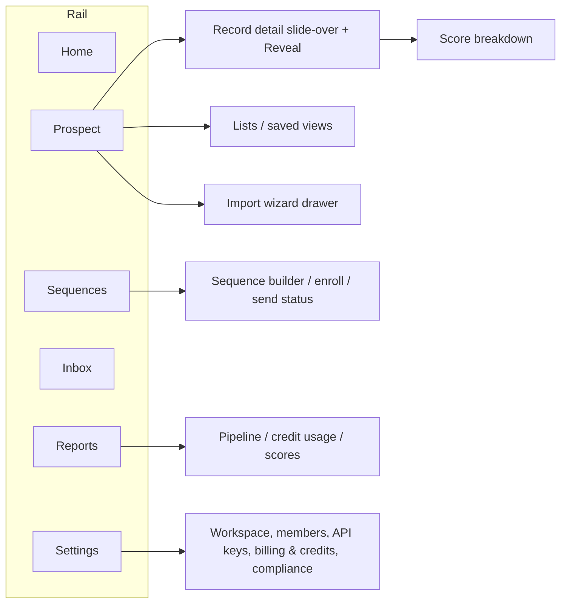

# 04 — UI / UX Design

> Built with **shadcn/ui + Tailwind CSS** on Next.js (App Router). The aesthetic is **clean, light,
> near-monochrome** — Vercel/Linear-dashboard calm, not a colorful SaaS. Color is rare and intentional.

## 1. North-star design spec (authoritative — from the user)

| Element | Spec |
|---|---|
| **Sidebar background** | `#f9fafb` |
| **Sidebar border** | hairline **right** border only (`#f0f0f0` / 1px) |
| **Sidebar text** | dark text on light (no inversion) |
| **Active nav state** | subtle `#e8e8e8` fill — **no** colored indicators, bars, or glows |
| **Nav icons** | muted grey, matching the sidebar text weight (not heavier) |
| **Section dividers** | thin `#f0f0f0` lines — **not** heavy uppercase section labels |
| **User row** | grey **initials** avatar (no color), with a workspace-role sub-label; sits below the **workspace switcher** |
| **Content area** | pure white `#ffffff`, blends with the sidebar |
| **Separation** | handled **only** by the hairline border — no shadows between sidebar and content |
| **Overall feel** | minimal, monochrome, calm; whitespace does the work |

This spec governs the whole app. Any new surface must read as part of this same quiet system.

## 2. Design tokens

Tailwind theme + CSS variables (light is the default and primary theme; a dark theme is a later option).

```css
:root {
  /* surfaces */
  --bg-sidebar:      #f9fafb;
  --bg-content:      #ffffff;
  --border-hairline: #f0f0f0;
  --border-default:  #e5e7eb;

  /* nav states */
  --nav-active-fill: #e8e8e8;
  --nav-hover-fill:  #f3f4f6;

  /* text */
  --text-primary:   #111827;   /* near-black */
  --text-secondary: #6b7280;   /* muted grey (nav icons, sub-labels) */
  --text-tertiary:  #9ca3af;

  /* avatars */
  --avatar-bg:      #e5e7eb;
  --avatar-text:    #6b7280;

  /* rare, intentional accents only */
  --accent:         #4f46e5;   /* used sparingly: primary actions */
  --success:        #16a34a;   /* verified email */
  --warning:        #d97706;   /* low credits / risky email */
  --danger:         #dc2626;   /* destructive / invalid */

  --radius: 8px;
}
```

**Typography:** Inter (or Geist). Sizes: 13px body in dense tables, 14px default, 16–20px headings.
Weights: 400 body, 500 labels, 600 headings. Tight, consistent line-heights.

**Spacing:** 4px base scale. Generous padding in content; compact rows in data tables.

**Elevation:** almost none. Dropdowns/popovers/modals get a single soft shadow; layout separation is
borders + whitespace, never drop shadows.

## 3. Information architecture

The app is a **single-page command center**: a compact **6-destination** left rail; most work happens
on one surface via panels, not page-hops. Full IA in [11](./11-information-architecture.md); settings in
[12](./12-settings.md).



**Sidebar nav (top → bottom), 6 destinations:**
1. **Home** — workspace cockpit: today's tasks, recent replies, hot leads, sequence/credit snapshot.
2. **Prospect** (default work surface) — the unified page: **Search + Contacts + Accounts + Lists**.
   Filter rail + results grid (**Contacts ⇄ Accounts** toggle) + right slide-over record detail +
   sticky bulk-action bar; import/templates open as drawers.
3. **Sequences** — outreach sequence builder, enrollment, and send status
   (see [ADR-0009](./decisions/ADR-0009-outreach-engine-enroll-and-send.md)).
4. **Inbox** — unified replies (email + LinkedIn) + tasks/reminders.
5. **Reports** — analytics dashboards including **lead scores** (icp_fit/intent/engagement/composite)
   and intent signals (see [ADR-0008](./decisions/ADR-0008-lead-scoring-model.md)); score breakdown
   also lives in the Prospect detail slide-over.
6. **Settings** — workspace, members & roles, API keys, **billing & credits**, compliance
   (suppression, DSAR).

**Credits is not a nav item:** the **tenant** reveal-credit balance shows as a **top-bar pill** that
deep-links into **Settings ▸ Billing & Credits** ([12](./12-settings.md)). Detail, reveal, enroll,
import, templates, and settings all open as **panels/drawers**, never pages; a `cmdk` command palette +
global search live in the top bar.

Sidebar bottom — above the user row — a **workspace switcher** (a user belongs to multiple
**workspaces** within a **tenant**; see
[ADR-0006](./decisions/ADR-0006-per-workspace-multitenant-model.md)): shows the
current workspace name with a dropdown to switch workspaces or create a new one. Switching workspaces
re-scopes all data (contacts, accounts, lists) — each workspace owns its own copies. The **user row**
sits beneath it (grey initials avatar + name + workspace-role sub-label) with an account menu that also
exposes tenant-level billing for the **tenant owner**.

## 4. Layout shell

```
┌────────────┬───────────────────────────────────────────────────────┐
│            │ Top bar: title · ⌘search · palette · 🔔 · [● credits]   │
│  Sidebar   ├───────────────────────────────────────────────────────┤
│  #f9fafb   │ ┌─ filter rail ─┬─ results grid ──────┬─ detail panel ┐ │
│  hairline  │ │ facets        │ Contacts ⇄ Accounts  │ (slide-over)  │ │
│  border →  │ │ saved views   │ masked rows + glyphs │ score/reveal  │ │
│            │ │ lists         │ [☐ bulk select]      │ provenance    │ │
│  ────────  │ └───────────────┴──────────────────────┴───────────────┘ │
│  workspace │ ┌─ sticky bulk-action bar: reveal(N)·list·enroll·CSV ───┐ │
│  switcher  │ └───────────────────────────────────────────────────────┘ │
│  user row  │                                                           │
└────────────┴───────────────────────────────────────────────────────┘
```

- **Top bar:** current section title, a global quick-search + `cmdk` command palette, a notifications
  bell, and a compact **credit balance pill** showing the **tenant** reveal-credit balance — **not** a
  Credits tab; the pill deep-links into Settings ▸ Billing & Credits (the one place a subtle
  accent/warning color is allowed when credits run low).
- **Master–detail shell:** the content area is a single surface — a collapsible filter rail, a results
  grid, and a **right slide-over** record detail that preserves the grid context; a **sticky
  bulk-action bar** pins to the bottom while rows are selected. Reveal/enroll/import/templates open as
  drawers over this same shell.
- **Content:** white, edge-to-edge; the only visible boundary from the sidebar is the 1px hairline.

## 5. Key screen — Search & Results (specified first)

The most-used screen and the first we fully design/build. The **full advanced-exploration spec** — facet
interactions (multi-select, AND/OR, preset bundles, recent searches), **search-box typeahead from indexed
values** and **abbreviation/synonym expansion** (type `CEO`, match "Chief Executive Officer"),
**intent/technographic facets**, instant search, **saved views**, and **smart segments** — is
[24](./24-advanced-search-exploration-ux.md) (query/filter architecture: [ADR-0035](./decisions/ADR-0035-search-query-and-filter-architecture.md));
**department personas** set default filters/views per team
([25 §3](./25-departments-teams-workspaces.md)).

```
┌─ Filters (rail) ─┐ ┌─ Results ─────────────────────────────────────────────┐
│ Job title        │ │ [ ] Name        Title         Company     Email  Phone │
│ Seniority        │ │ [ ] Jane Doe    VP Eng        Acme        •••• ✓ ••••  │
│ Department       │ │ [ ] John Smith  Director Sales Globex      •••• ? ──    │
│ Company          │ │ ...                                                     │
│ Headcount        │ │                                                         │
│ Industry         │ │ Bulk: [Reveal selected (N credits)] [Add to list] [CSV]│
│ Location         │ └─────────────────────────────────────────────────────────┘
│ Has email/phone  │   Pagination · result count · saved-search "Save" action
└──────────────────┘
```

**Behaviors**
- **Masked by default:** email/phone show as `••••` with a status glyph (✓ valid, ? risky/unknown,
  — none). No PII is fetched to the client until reveal.
- **Email status** uses the tiny status glyph, not row color — keeps the table monochrome.
- **Row click → detail drawer/page** (record detail + reveal).
- **Bulk actions:** select rows → "Reveal selected (N credits)" shows the exact cost and remaining
  balance before confirming; "Add to list"; "Export CSV" (only revealed rows export contact fields).
- **Filters** map to the structured search query (and to AI natural-language → filters, [23](./23-ai-intelligence-layer.md)).
- **Saved search:** persist the current filter set (`saved_searches`); **saved views** + **smart segments** in [24](./24-advanced-search-exploration-ux.md).
- **Empty/zero states:** quiet, instructional; no illustrations heavier than a single muted glyph.

### Reveal interaction (within detail or bulk)
1. User clicks **Reveal** → confirmation shows cost (varies by `reveal_type`; see [07 §1](./07-billing-credits.md))
   and the post-reveal **tenant** credit balance.
2. On confirm → API reveal call (idempotent; client sends an `Idempotency-Key`). Reveal is
   **per-workspace, first-reveal-wins**
   ([ADR-0007](./decisions/ADR-0007-per-workspace-reveal-and-credit-counter.md)): the
   first reveal of a contact in **this workspace** spends tenant credits and makes the workspace own
   that copy. **Re-revealing the same workspace copy is free (0 credits)** and shows instantly. (The
   same human in a *different* workspace is a separate copy and is charged again.)
3. Revealed fields appear inline with a **provenance affordance**: hover/expand shows the import
   **source** and last-verified date for that workspace copy (provenance is per-import via
   `source_imports`, not field-level). Email shows verified status from the on-reveal check.
4. Insufficient credits → inline prompt linking to **Settings ▸ Billing & Credits ▸ Top-up**
   ([12](./12-settings.md)) — no dead ends.

## 6. Record detail

- **Contact:** name, title, account (linked), seniority/department, location, masked→revealed
  email/phone with status, lead **score** (icp_fit/intent/engagement/composite) and `outreach_status`,
  and a **provenance panel** (per-import source + observed/verified date, from `source_imports` — not
  per-field). Actions: Reveal, Add to list, **Enroll in sequence**, Draft outreach (AI → review →
  send), Export.
- **Account:** firmographics (industry, headcount, HQ, funding, tech stack), contacts at the account,
  intent signals (news/funding, web visits). Actions: Add to list, view contacts.

### New: Sequences screens

LeadWolf now **enrolls and sends** outreach
([ADR-0009](./decisions/ADR-0009-outreach-engine-enroll-and-send.md)), so the
**Sequences** area adds three screens to design in a later milestone: a **sequence builder**
(`outreach_sequences` → `outreach_steps`, multi-channel: email/linkedin), an **enrollment** view
(add contacts → `outreach_log`, with suppression/DNC gating sends just as it gates reveals), and a
**send status** dashboard (per-step delivery/open/click/reply from `activities`). AI drafting feeds a
**draft → review → send** flow; automated LinkedIn/Sales-Nav sends prefer human-in-the-loop.

## 7. Component inventory (shadcn/ui based)

| Component | Use |
|---|---|
| `Sidebar` (custom) | Nav per spec above |
| `DataTable` (TanStack Table + shadcn) | Results, lists, usage history — virtualized for large sets |
| `FilterRail` | Faceted filters bound to the search query |
| `Drawer` / `Sheet` | Record detail without losing the result context |
| `Dialog` | Reveal confirmation, destructive confirmations |
| `Badge` / status glyph | Email/phone status, credit state |
| `CommandPalette` (`cmdk`) | Quick navigation/search (power-user, later) |
| `Toast` | Action feedback (revealed, added to list, exported) |
| `Tabs`, `Form`, `Select`, `Combobox` | Settings, filters, forms |
| `CreditPill` (custom) | Top-bar **tenant** credit-balance indicator |
| `WorkspaceSwitcher` (custom) | Sidebar dropdown to switch/create workspaces (re-scopes all data) |
| `ProvenancePopover` (custom) | Per-import source + last-verified date (from `source_imports`) |

## 8. Interaction & accessibility principles

- **Keyboard-first:** full keyboard nav, `cmdk` palette, focus-visible rings (subtle grey, not glowing).
- **WCAG AA contrast** despite the light palette — verify the muted greys meet contrast on white.
- **No surprise spend:** every credit-spending action shows cost + resulting balance before confirm.
- **Reversible where possible:** lists, saved searches editable; destructive actions confirmed.
- **Latency honesty:** skeleton rows for search; optimistic UI only where safe (never for reveal/spend).
- **Density toggle** (comfortable/compact) for the data table.

## 9. Responsive

Desktop-first (the core user is at a desk). Sidebar collapses to icons on narrow widths; tables
horizontally scroll with sticky first column. A trimmed mobile read-only view is post-MVP.

## 10. Deliverables for the build phase

- Tailwind config + CSS variables encoding the tokens above (in `packages/ui`).
- The app shell (sidebar + top bar + content) as the first UI built in **M2**.
- The Search & Results screen as the first feature screen (also M2/M3).
- A small **Storybook** (or shadcn registry) documenting the components and the monochrome rules.
