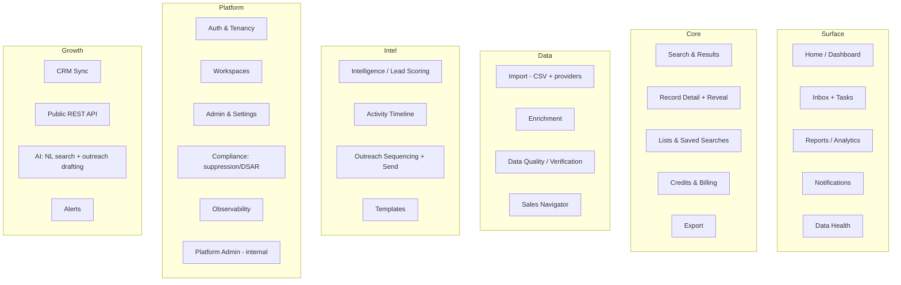

# 05 — Features & Modules

> **Model:** per-workspace multi-tenant prospecting CRM
> ([ADR-0006](./decisions/ADR-0006-per-workspace-multitenant-model.md)). Each **tenant** has
> **workspaces**; each workspace curates its **own overlay** contacts/accounts — imported + enriched, then
> scored, revealed, and sequenced — over a system-owned **global master graph** (an entity-resolved universe
> everyone searches and reveals from). Two layers, [ADR-0021](./decisions/ADR-0021-global-master-graph-and-overlay.md).

Each module below lists its purpose, key behaviors, the data it touches, and which milestone it lands
in. "MVP" = the full thin slice (M1–M5). See [10-roadmap.md](./10-roadmap.md) for sequencing.

## Module map

> **App surface** is specified in [11](./11-information-architecture.md) (single-page command center,
> 6 destinations: Home · Prospect · Sequences · Inbox · Reports · Settings), tiered settings in
> [12](./12-settings.md), and a **separate internal super-admin console** in
> [13](./13-platform-admin.md) ([ADR-0011](./decisions/ADR-0011-platform-admin-and-privileged-access.md)).
> Modules below are panel-driven and modular; **Credits is not a tab** — see §11.

---

## 1. Auth & Tenancy — *MVP (M2)*

- **Dedicated auth origin (`auth.truepoint.in`).** Authentication runs as an internal **IdP/BFF** on a
  separate origin ([17](./17-authentication.md),
  [ADR-0016](./decisions/ADR-0016-dedicated-auth-origin-and-cross-domain-token-exchange.md)): the durable
  **Lucia** session + a rotating refresh cookie stay there; after login the app domain gets a single-use
  60 s **PKCE code** exchanged for a short-lived in-memory **access JWT**. Login is **progressive
  (identifier-first)** — the identifier accepts **email or username**, resolves whether the identity
  **exists** (Turnstile + rate-limit gated), and branches to SSO / password / passkey / magic, or to
  **registration** ([ADR-0017](./decisions/ADR-0017-progressive-identifier-first-login-and-domain-tenant-routing.md),
  [ADR-0020](./decisions/ADR-0020-existence-revealing-identifier-first-and-registration.md)).
- **Global identity, many orgs** ([ADR-0019](./decisions/ADR-0019-global-identity-and-tenant-membership.md)):
  a person is **one** `users` identity (global-unique email + optional username) that belongs to many
  tenants via **`tenant_members`**; after primary auth they pick **org** then **workspace** (single options
  auto-select).
- **Self-built auth on Lucia** ([ADR-0010](./decisions/ADR-0010-aws-native-self-hosted-stack.md)):
  email/password (Argon2id) + OAuth (Google/Microsoft via `arctic`); **MFA** (TOTP / SMS / email /
  **WebAuthn passkey** + recovery codes, `user_mfa_methods`) and **SAML 2.0 / OIDC** SSO (via `node-saml`,
  per-tenant `tenant_sso_configs`) with **JIT provisioning** + **SCIM** (`scim_tokens`) for enterprise.
  **Trusted-device** registry ("trust 30 days") and per-scope **auth policy** (MFA enforcement / allowed
  methods / IP allowlist / session timeout, strictest-wins,
  [ADR-0018](./decisions/ADR-0018-auth-policy-and-mfa-enforcement-model.md)). Sessions in `user_sessions`
  (Postgres + Redis).
- **Hybrid registration** ([ADR-0020](./decisions/ADR-0020-existence-revealing-identifier-first-and-registration.md)):
  after email verification (`auth_email_tokens`), a new identity is placed by **verified company domain**
  (`tenant_domains.join_policy` — `auto_join`/`request_access`), else a **pending invite** (`invitations`)
  → accept, else **`provision_new_signup`** creates a new org (tenant → default workspace → owner
  `tenant_member` → owner `workspace_member` → audit) ([03 §10](./03-database-design.md#10-triggers--db-side-logic)).
- **Tenant vs workspace authority:** a **tenant** is the paying org (plan, `seat_limit`,
  `workspace_limit`, `reveal_credit_balance`). The **tenant-level capability** lives on
  **`tenant_members.org_role`** (`owner|billing_admin|security_admin|compliance_admin|member` —
  [ADR-0030](./decisions/ADR-0030-granular-tenant-org-roles.md); `is_tenant_owner` is the compat alias
  for `owner` during migration) and governs billing, security/SSO, compliance, workspace creation,
  limits, and suspension — **distinct** from a user's per-workspace role.
- **Per-workspace roles** (on `workspace_members`): `owner`/`admin`/`member`/`viewer`.
  - workspace **owner/admin:** manage members, workspace settings, suppression, API keys, CRM connections.
  - **member:** import, search, reveal (spends **tenant** credits), score, sequence, export.
  - **viewer:** search + view revealed data; no reveal/send/export.
- **Abuse guards (self-serve):** email verification, disposable-domain blocking, signup-velocity
  limits, optional payment-before-reveal for fresh tenants.
- **Data:** `tenants`, `users` (global identity), `tenant_members`, `workspaces`, `workspace_members`,
  `invitations`, `user_sessions`,
  `user_oauth_accounts`, `user_mfa`/`user_mfa_methods`, `user_mfa_recovery_codes`, `webauthn_credentials`,
  `trusted_devices`, `user_password_resets`, `auth_email_tokens`, `tenant_domains`, `tenant_sso_configs`,
  `tenant_auth_policies`/`workspace_auth_policies`, `scim_tokens`, `oauth_app_clients`, `api_keys`. See
  [03 §4](./03-database-design.md#4-tenancy--auth) and the full design in [17](./17-authentication.md).

## 2. Workspaces — *MVP (M2)*

- **Create / switch / rename** workspaces within a tenant (subject to `tenant.workspace_limit`); one
  `is_default` workspace per tenant. A workspace is the **data-isolation + collaboration** scope —
  contacts, accounts, lists, scores, activities, and outreach all live in exactly one workspace.
- **Members:** invite a tenant user into a workspace, set/change their per-workspace role, remove them.
  Invitations and role changes are audited.
- **Isolation:** every workspace-scoped query runs under Postgres **RLS** keyed by
  `SET LOCAL app.current_workspace_id` (+ `app.current_tenant_id`), under a non-`BYPASSRLS` role, with
  the GUC reset per pooled checkout (RDS Proxy transaction pooling); the app sets the same context in
  AsyncLocalStorage ([ADR-0006](./decisions/ADR-0006-per-workspace-multitenant-model.md),
  [03 §9](./03-database-design.md#9-row-level-security)).
- **Data:** `workspaces`, `workspace_members`.

## 3. Import (CSV + providers) — *MVP (M1)*

- **Per-workspace import**, not a shared pipeline. Sources: **CSV/XLSX upload** + **manual entry**, and
  **enrichment providers** (Apollo/ZoomInfo/Clearbit) — plus Sales Navigator (§5) and CRM sync (§14)
  later. Column-mapping UI → canonical contact/account shape; rows land in the importing workspace only.
- Each import writes a **`source_imports`** row per contact: `source_name`
  (`apollo|zoominfo|linkedin|sales_navigator|hubspot|salesforce|clearbit|manual`), `source_file`,
  the full `raw_data` jsonb payload, and a `content_hash` for identical-payload dedup. This is the
  **only** provenance under this model — **no field-level lineage, no cross-source merge, no replay**
  ([ADR-0006](./decisions/ADR-0006-per-workspace-multitenant-model.md)).
- **Per-workspace dedup on import** (no global identity): match within the workspace on
  `email_blind_index`, `linkedin_public_id`, or `sales_nav_lead_id`; the unique indexes
  `(workspace_id, email_blind_index)` / `(workspace_id, linkedin_public_id)` /
  `(workspace_id, sales_nav_lead_id)` make duplicates impossible. The importer sees a summary
  (new vs matched-existing-in-workspace).
- **Data:** `contacts`, `accounts`, `source_imports`. Runs on the **imports** worker
  ([01 §4](./01-tech-stack.md#4-background-workers)).

## 4. Enrichment — *MVP (M4)*

- On-demand and background enrichment that **calls external providers** (Apollo/ZoomInfo/Clearbit) to
  fill or refresh fields on a workspace's contacts/accounts, cache-first. Design in
  [06](./06-enrichment-engine.md).
- Enrichment is a **system cost**, never charged to users directly — users pay only on **reveal** (§8).
  Optional **`provider_calls`** tracks provider cost/cache-hit per call.
- Enrichment writes the **workspace overlay** copy (+ per-import `source_imports`) **and** a `source_records`
  row that the **global entity-resolution** pipeline merges into a golden record
  ([ADR-0021](./decisions/ADR-0021-global-master-graph-and-overlay.md)); cross-source survivorship is the
  master graph's job, not a per-workspace merge ([ADR-0006](./decisions/ADR-0006-per-workspace-multitenant-model.md)).
- **Bulk CSV enrichment** *(M17 — [30](./30-bulk-enrichment-pipeline.md))*: the enterprise-scale batch
  surface — a customer uploads a **sparse CSV** (just names/companies/emails), the rows are
  **matched-first** against our own data (overlay + global master graph) rather than blindly calling
  providers, the customer sees a **credit estimate** for the matchable/enrichable rows, then runs the
  job to **enrich + verify** matched rows and **downloads** the completed file. Match-first
  (upload → column-map → estimate → run → progress → download) keeps cost and provider spend bounded at
  millions of rows; large jobs are chunked and run on **AWS Batch** off the request path, charged on
  **verified results** with credit-back ([ADR-0013](./decisions/ADR-0013-charge-for-verified-data-credit-back.md)).
  Lives under **Prospect ▸ Import** in the app surface, not a new destination ([11 §4.2](./11-information-architecture.md)).
  Full design — chunking, match/estimate engine, job lifecycle, and the
  ADR-0036/0037/0038 decisions — in [30](./30-bulk-enrichment-pipeline.md).

## 5. Sales Navigator integration — *Post-MVP (M7)*

- **Connect** a Sales Navigator workflow and capture **links** to LinkedIn/Sales-Nav entities:
  `sales_nav_links` with `link_type` ∈
  `profile|account|saved_search|lead_list|account_list|inmail_thread`. Imports leads/accounts into the
  workspace (source `sales_navigator`/`linkedin`), keyed on `sales_nav_lead_id` for dedup.
- **Channel ToS caution:** automated LinkedIn/Sales-Nav actions carry account-risk; **human-in-the-loop**
  (assisted) capture and send is the default ([ADR-0009](./decisions/ADR-0009-outreach-engine-enroll-and-send.md)).
- **Data:** `sales_nav_links`, `contacts`, `accounts`, `source_imports`.

## 6. Search & Results — *MVP (M2/M3)*

- Faceted **masked** search — at MVP over the workspace's overlay; on the scale track over the **global
  master graph** (the shared universe — [ADR-0021](./decisions/ADR-0021-global-master-graph-and-overlay.md)):
  title, seniority, department, company, headcount band, industry, location, technologies,
  has-email/has-phone, `outreach_status`, `priority_score`; results flag which hits are already revealed in
  the workspace. UI spec in [04 §5](./04-ui-ux-design.md).
- Results table: masked contact columns + status glyphs; bulk select. **Saved searches** persisted and
  re-runnable.
- Backed by `packages/search` (`SearchPort`): **Typesense** (overlay, day one) + **OpenSearch** (global
  master graph, scale track), fed by Aurora logical-replication CDC
  ([ADR-0002](./decisions/ADR-0002-search-postgres-then-engine.md) amended by
  [ADR-0021](./decisions/ADR-0021-global-master-graph-and-overlay.md), [01 §1](./01-tech-stack.md#1-at-a-glance)).
  Overlay queries are workspace-scoped via RLS; universe search returns masked rows only.

## 7. Record Detail + Reveal — *MVP (M3)*

- Contact/account detail with **per-import provenance** (the `source_imports` payload list — source,
  imported-by, when), plus `email_status`, lead score / `priority_score`, and activity.
- **Reveal** unlocks email/phone for a contact (`reveal_type` ∈ `email|phone|full_profile`); cost
  varies by `reveal_type` (pricing in [07 §1](./07-billing-credits.md) — **never hardcoded** here) and
  is charged against the **tenant** `reveal_credit_balance`. **First reveal in a workspace wins** and
  sets `is_revealed`/`revealed_by_user_id`/`revealed_at`; re-revealing the **same workspace copy** is
  free; the **same human in another workspace is charged again**
  ([ADR-0007](./decisions/ADR-0007-per-workspace-reveal-and-credit-counter.md)).
- **The reveal transaction** is idempotent and suppression-checked **inside** the transaction (the
  identical description appears in [07 §3](./07-billing-credits.md), [08 §3](./08-compliance.md),
  [09 §3](./09-api-design.md)):
  `BEGIN` → `assertNotSuppressed(contact, workspace)` (in-tx, unbypassable) →
  `INSERT contact_reveals ON CONFLICT (workspace_id, contact_id, reveal_type) DO NOTHING` → if already
  present, return owned fields and **charge 0** → else
  `SELECT reveal_credit_balance FROM tenants WHERE id=tenant FOR UPDATE`; if `< cost`, `ROLLBACK`
  (`INSUFFICIENT_CREDITS`); else `UPDATE tenants SET reveal_credit_balance = balance - cost`; `COMMIT`;
  audit. Clients also send an **`Idempotency-Key`** header.
- **Known risks** ([ADR-0007](./decisions/ADR-0007-per-workspace-reveal-and-credit-counter.md)): a bare
  counter lacks a ledger's reconciliation/refund-history; the `FOR UPDATE` + `CHECK >= 0` + unique
  `(workspace_id, contact_id, reveal_type)` + `Idempotency-Key` are the required mitigations.
- **Charge by verified result + credit-back** ([ADR-0013](./decisions/ADR-0013-charge-for-verified-data-credit-back.md)):
  only `valid` data is charged (`invalid`/`catch_all`/`unknown` → **0**); a charged email that hard-bounces in the
  guarantee window is **credited back**. Surfaced in the reveal confirmation + usage history ([04 §5](./04-ui-ux-design.md)).
- **Data:** `contacts`, `contact_reveals`, `tenants.reveal_credit_balance`, `source_imports`.
- **Record customization** *(M8 —
  [ADR-0028](./decisions/ADR-0028-record-customization-layer.md))*: workspaces define **custom fields**
  (`custom_field_definitions` + typed-jsonb values on `contacts`/`accounts`), **pipeline stages**
  (workspace-named stages each mapping to one canonical `outreach_status` value — the enum stays the
  system vocabulary), and **tags** (`tags`/`record_tags`). All three are first-class in search facets,
  import column mapping, CRM-sync field mapping, automation conditions, exports, and the public API
  ([03 §14](./03-database-design.md)).

## 8. Lists & Saved Searches — *MVP (M2/M3)*

- **Static lists** (manually curated) and **dynamic lists** (defined by a saved filter), workspace-scoped.
- Add from search results (bulk) or detail. Lists feed export, outreach enrollment (§13), CRM sync (§14),
  and (later) alerts (§17).
- **Data:** `lists`, `list_members`, `saved_searches`.

## 9. Intelligence / Lead Scoring — *scoring model M4; depth + UI M8*

> The scoring **model/engine** (versioned `scores` + `intent_signals` + `priority_score` sync) ships in
> **M4** alongside enrichment; the **depth + UI surfacing** (dashboards, signal sourcing, tuning) is
> **M8**. Matches [10 M4/M8](./10-roadmap.md).

- **Versioned lead scoring** ([ADR-0008](./decisions/ADR-0008-lead-scoring-model.md)): each re-score
  appends a `scores` row with `icp_fit`/`intent_score`/`engagement_score`/`composite_score` (0–100) +
  `score_breakdown` jsonb. `contacts.priority_score` is a **cache** of the latest composite, synced by
  an `AFTER INSERT ON scores` trigger.
- **`intent_signals`**: typed `signal_type` ∈
  `job_change|new_hire|funding_round|tech_install|web_visit|content_engagement|keyword_search|linkedin_activity|sales_nav_view`,
  each with a `weight` (1–10), feeding the intent component.
- **Lead score (prospect quality) is distinct from `email_status` (field correctness)** — never
  conflate. Scoring is workspace-private and is **not** a billable reveal event.
- **Data:** `scores`, `intent_signals`, `contacts.priority_score`. Runs on the **scoring** worker.

## 10. Activity Timeline — *Post-MVP (M8)*

- A unified **per-contact timeline** of every interaction: `activities` with `activity_type` ∈
  `email_sent|email_opened|email_clicked|email_replied|call_made|call_connected|linkedin_message|`
  `linkedin_connected|sales_nav_inmail|meeting_held|note_added` over `channel` ∈
  `email|phone|linkedin|sales_navigator|in-person`.
- Activities are written by the outreach send engine (§13), manual logging (notes/calls/meetings), and
  Sales Nav (§5). `contacts.last_activity_at` is maintained for sorting/recency.
- **Data:** `activities` (monthly-partitioned).

## 11. Credits & Billing — *MVP (M3)*

- **Not a standalone tab.** Credits & billing live in **Settings ▸ Billing & Credits**
  ([11 §4.6](./11-information-architecture.md), [12 §4](./12-settings.md)); the only top-level surface is
  a **top-bar balance pill** that deep-links into that settings area. There is no "Credits" destination
  in the 6-destination rail.
- **Tenant credit counter:** `tenants.reveal_credit_balance` (`CHECK >= 0`) is authoritative — **not** an
  append-only ledger ([ADR-0007](./decisions/ADR-0007-per-workspace-reveal-and-credit-counter.md)).
  Decremented inside the reveal transaction with `FOR UPDATE` (§7). The append-only **`credit_ledger`**
  lands at **M11** (the counter becomes a derived cache) with **lease-based decrement** at M12 for
  high-concurrency tenants ([ADR-0029](./decisions/ADR-0029-credit-ledger-and-lease-decrement.md)).
- **Top-ups:** Stripe credit-pack checkout grants credits to the tenant counter; `purchases.stripe_event_id`
  unique → idempotent grants. **Usage history** from `contact_reveals` + `purchases`.
- Pricing varies by `reveal_type` and is a **placeholder** — see
  [07 §1](./07-billing-credits.md), never hardcoded here. Entitlements/quotas per plan via
  `tenants.features`.
- **Commercial policy** ([ADR-0012](./decisions/ADR-0012-transparent-no-lock-in-commercial-policy.md),
  [07 §1A](./07-billing-credits.md)): transparent self-serve pricing, no auto-renew traps, **no data-destroy on
  churn (export-on-exit)**, credits don't expire at MVP; **charge only for `valid` data + credit-back on bounce**
  ([ADR-0013](./decisions/ADR-0013-charge-for-verified-data-credit-back.md)).

## 12. Export — *MVP (M3)*

- **CSV export** of revealed records (only **owned** contact fields export). Export passes a
  **suppression check** and is audit-logged; files stored in S3 with signed, expiring URLs.
- CRM push lives in **CRM Sync** (§14).

## 13. Outreach Sequencing + Send Engine — *Post-MVP (M9)*

- LeadWolf **enrolls** contacts and **sends** ([ADR-0009](./decisions/ADR-0009-outreach-engine-enroll-and-send.md)
  — this **supersedes** the earlier "no email send at MVP / AI-draft-only" stance; **AI drafting now
  feeds the send engine**). `outreach_sequences` → `outreach_steps` (ordered: channel, delay, template);
  `outreach_log` records per-contact enrollment + status (`enrolled/active/replied/completed/`
  `unsubscribed/bounced`). Each send/open/click/reply lands in `activities`.
- **Flow:** draft (AI or manual, §16) → **review** → **send**. `contacts.outreach_status` advances
  (`new`→`in_sequence`→`replied`/`meeting_booked`/`disqualified`/`nurture`/`unsubscribed`).
- **Suppression/DNC gates sending**, not just reveals; sending is suppression-checked before each send
  ([08](./08-compliance.md)).
- **Compliance is first-class:** CAN-SPAM (US) + GDPR/ePrivacy consent + unsubscribe + physical-address
  footer; **deliverability** (sending domains, DKIM/SPF/DMARC, warm-up, bounce/complaint → suppression).
  Email sends via **SES** (SNS→SQS bounce/complaint feedback). LinkedIn/Sales-Nav automated send carries
  **ToS risk** — **human-in-the-loop** is the safer default.
- **Data:** `outreach_sequences`, `outreach_steps`, `outreach_log`, `activities`,
  `suppression_list`. Runs on the **outreach delivery** worker ([01 §4](./01-tech-stack.md#4-background-workers)).

## 14. CRM Sync — *Post-MVP (M10)*

- **HubSpot**, **Salesforce**, then **Pipedrive**: OAuth connect, field mapping, push revealed
  contacts/accounts (and lists), with optional one-way sync. Sync log + conflict handling. Built behind
  an `IntegrationProvider` interface in `packages/integrations`. Workspace-scoped connections.
- **Build approach (open):** the `IntegrationProvider` is custom per CRM; a **unified integration API**
  (e.g. **Merge.dev**) is the documented alternative — one integration covering Salesforce/HubSpot/Pipedrive
  to ship breadth faster, with custom connectors where depth differentiates ([09 §11 Q5](./09-api-design.md)).

## 15. Public REST API — *Post-MVP (M10)*

- API-key-authenticated endpoints (tenant-scoped, hashed/scoped `api_keys`) to search, reveal (metered
  against the **tenant** credit counter, `Idempotency-Key` honored), and pull records. Usage metering,
  rate limits, OpenAPI docs. Seams (API keys, idempotency, metering) exist from MVP. See
  [09](./09-api-design.md).

## 16. AI features — *Post-MVP (M14)*

Full design — `AiPort` (Anthropic Claude), model routing, conversational **copilot**, **semantic search**,
agentic research, **guardrails + eval/safety**, and per-tenant metering — is
[23](./23-ai-intelligence-layer.md) ([ADR-0023](./decisions/ADR-0023-ai-provider-and-intelligence-architecture.md),
resolving the provider open question). Highlights:

- **Natural-language search:** "VPs of Eng at 50–200 person EU fintechs" → a validated structured query
  object (LLM never emits raw SQL); runs against the workspace's own data. Recommended provider:
  **Anthropic Claude**. Optional `pgvector` for semantic ranking.
- **AI outreach drafting:** generate a personalized first-touch from a contact's (revealed) profile +
  intent signals. Guardrails: only on revealed contacts, content-safety filter, **human review before
  send**. Drafting **feeds the send engine** (§13) — it is no longer export-only
  ([ADR-0009](./decisions/ADR-0009-outreach-engine-enroll-and-send.md)).
- **Augmented-human, not autonomous.** LeadWolf's stance is that AI **assists the rep** (draft → human review →
  send), positioned as a strength as the autonomous-AI-SDR hype unwinds — while matching autonomous tools on
  research/draft quality so "human-in-the-loop" never reads as "slow" ([15 §3](./15-gap-remediation.md)).
- **Agentic account research** *(future differentiator):* configurable, reusable agents that research the web
  per account/contact (news, funding, hiring, tech stack) and assemble a brief — the 2026 edge (cf. Clay's
  Claygent). Same guardrails: agent outputs are **verified before they become fields/signals**, and any
  drafting stays **human-reviewed** ([10 Beyond](./10-roadmap.md); data-side research
  [../research/sales-intelligence-data-research.md](../research/sales-intelligence-data-research.md) §5).

## 17. Alerts — *Post-MVP (Beyond)*

- New-match / new-signal alerts: notify in-app/email when fresh prospects match a saved search or a new
  `intent_signal` fires for a tracked contact. A background watcher compares new/changed workspace rows
  against stored saved-search queries.

## 18. Compliance (suppression / consent / DSAR) — *MVP (M5)*

- **Suppression/DNC** gates **both reveals and outreach sending**
  ([ADR-0009](./decisions/ADR-0009-outreach-engine-enroll-and-send.md)); `suppression_list` scope ∈
  `global|tenant|workspace`. Suppression management UI.
- **Consent/lawful-basis** records (`consent_records`); **DSAR** access + delete + rectify workflows.
  Under the per-workspace model, **delete fans out** across every workspace copy + `source_imports` +
  `contact_reveals` + `activities`, then verifies.
- Full design in [08](./08-compliance.md).

## 19. Admin & Settings — *MVP (M2) + growth*

- **Tenant settings:** name, plan, seat/workspace limits, default region (tenant-owner only).
- **Workspace settings & members:** rename, invite/role/remove (DSAR-aware on user deletion) — see §2.
- **API keys:** create/revoke scoped keys for the public API (UI in M2, API surface §15 later).
- **Billing:** Stripe customer-portal link, invoices, credit top-up (tenant-owner).
- **Compliance:** suppression UI, DSAR intake/status, audit-log viewer.

---

## 20. App-surface modules (Home · Reports · Inbox+Tasks · Templates · Notifications · Data Health)

Surfaces introduced by the IA ([11](./11-information-architecture.md)) — panel/segment-driven, within the 6 destinations (not extra tabs).

- **Home** *(M3→)* — workspace cockpit: today's tasks, recent replies, hot leads, sequence snapshot, credit balance/burn, recent imports, activity feed, quick actions ([11 §4.1](./11-information-architecture.md)).
- **Reports / Analytics** *(M8)* — pipeline/funnel, credit usage, sending & deliverability, team activity, Data Health, lead-score views; ClickHouse/PostHog-backed ([ADR-0010](./decisions/ADR-0010-aws-native-self-hosted-stack.md), [11 §4.5](./11-information-architecture.md)).
- **Inbox + Tasks** *(M9)* — unified replies (email/LinkedIn) + tasks/reminders; assign/snooze/done; quick reply; convert reply → task / meeting / disqualify ([11 §4.4](./11-information-architecture.md)). Replies enter via the **mailbox-sync** ingestion path (`mailbox_connections`, [03 §14](./03-database-design.md); build-vs-vendor decided before the M9 build — [00 §8](./00-overview.md), [10 M9](./10-roadmap.md)).
- **Templates** *(M9)* — message templates + snippets + merge fields + AI draft + deliverability lint; a panel within Sequences ([11 §4.3](./11-information-architecture.md)).
- **Notifications** *(M3→)* — in-app/email notices (replies, tasks, low credits, imports done, DSAR); prefs in user settings ([12 §2](./12-settings.md)).
- **Data Health** *(M4/M8)* — customer view of data quality (verification status, staleness, duplicates) in Reports + a per-record badge; deepened in [06](./06-enrichment-engine.md), platform DQ ops in [13](./13-platform-admin.md).
- **Platform admin (internal)** — *not a customer module*; a separate staff console ([13](./13-platform-admin.md), [ADR-0011](./decisions/ADR-0011-platform-admin-and-privileged-access.md)).

## 21. Feature → milestone matrix

| Module | M1 | M2 | M3 | M4 | M5 | Post-MVP |
|---|:--:|:--:|:--:|:--:|:--:|:--:|
| Auth & tenancy (auth.* IdP, progressive login) | | ● | | | | SSO/SCIM/passkey depth (M11) |
| Workspaces | | ● | | | | |
| Import (CSV + providers) | ● | | | | | more sources |
| Enrichment | | | | ● | | more providers |
| Bulk CSV enrichment ([30](./30-bulk-enrichment-pipeline.md)) | | | | | | ● (M17) |
| Sales Navigator | | | | | | ● (M7) |
| Search & results (+ advanced faceted UX [24](./24-advanced-search-exploration-ux.md)) | | ● | | | | adv. UX + NL (M8/M14) |
| Record detail + reveal | | | ● | | | |
| Lists & saved searches | | ● | ● | | | alerts |
| Intelligence / lead scoring | | | | ● (model) | | ● depth/UI (M8) |
| Activity timeline | | | | | | ● (M8) |
| Record customization (custom fields, stages, tags — [ADR-0028](./decisions/ADR-0028-record-customization-layer.md)) | | | | | | ● (M8) |
| Credits & billing | | | ● | | | seat billing |
| Export | | | ● | | | |
| Outreach sequencing + send | | | | | | ● (M9) |
| CRM sync | | | | | | ● (M10) |
| Public API | | (seams) | (seams) | | | ● (M10) |
| AI intelligence — NL/semantic search, copilot, drafting, research ([23](./23-ai-intelligence-layer.md)) | | | | | | ● (M14) |
| Compliance/DSAR | | scaffold | suppression check | | ● | |
| Admin/settings | | ● | billing | | compliance UI | |
| Home (dashboard) | | | ● | | | widgets grow |
| Reports / analytics | | | | | | ● (M8) |
| Inbox + Tasks | | | | | | ● (M9) |
| Templates | | | | | | ● (M9) |
| Notifications | | | ● | | | |
| Data Health | | | | ● | | ● depth (M8) |
| Enterprise settings (SSO/SCIM/auth-policy/residency) | | | | | | ● (M11) |
| Platform admin (internal, separate track) | | | ops | | ops | ● depth (parallel) |
| Trust & certification program (SOC 2/ISO/registration — separate track) | | | | | ● readiness | ● certs + registration |
| Alerts | | | | | | Beyond |
| Scalability, SRE & event backbone (SLOs, caching, outbox, SSE, FinOps — [18](./18-scalability-performance.md)/[19](./19-observability-reliability.md)/[20](./20-event-driven-realtime-backbone.md)) | | | ops | | ops | ● (M12) |
| Data acquisition & freshness (registries, co-op, DPAs, re-verify, coverage — [21](./21-data-acquisition-sourcing.md)/[22](./22-data-quality-freshness-lifecycle.md)) | ● (base) | | | ● (verify) | | ● (M13) |
| Departments & teams (personas, record-visibility, per-team budgets — [25](./25-departments-teams-workspaces.md)) | | | | | | ● (M15) |
| Workflow automation engine (signal-to-play, recipes — [27](./27-workflow-automation-engine.md)) | | | | | | ● (M16) |
| Integrations breadth (reverse-ETL, native CRM apps, Chrome ext, SMS — [26](./26-integrations-data-delivery.md)) | | | | | | ● (M16) |

> Data quality / email-phone verification on reveal lands with **Enrichment (M4)** and is detailed in
> [06](./06-enrichment-engine.md); it feeds `email_status`/`phone_status` (correctness), distinct from
> lead score (quality).
