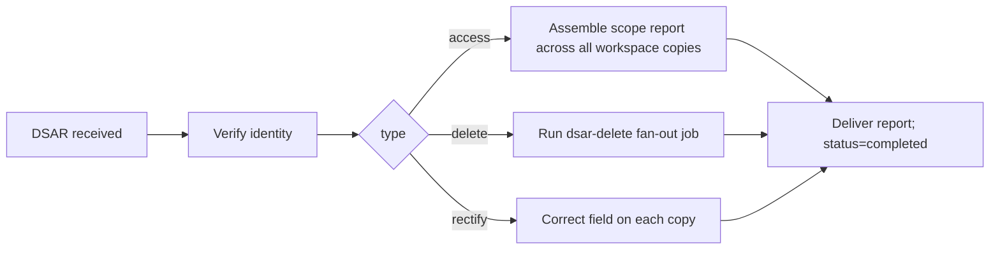

# 08 — Compliance (GDPR + CCPA)

> Selling personal contact data is legally sensitive. LeadWolf treats compliance as **core
> infrastructure**, not a bolt-on. GDPR + CCPA are designed in from day one. Implemented in
> `packages/compliance`. **This document is a design for engineering controls, not legal advice — a
> qualified privacy lawyer must review before any production launch with real data.**

## 1. Principles

1. **Suppression is unbypassable.** The suppression check runs **inside** the reveal **and the outbound
   send** transaction, not merely as a guard — no code path can reveal *or message* a suppressed
   contact ([ADR-0009](./decisions/ADR-0009-outreach-engine-enroll-and-send.md)).
2. **Two-layer provenance ([ADR-0021](./decisions/ADR-0021-global-master-graph-and-overlay.md)).** The
   **master graph** holds the golden identity + immutable `source_records` (per-source evidence); each
   workspace **overlay** keeps its per-import `source_imports.raw_data`. DSAR is answered by resolving the
   **one golden identity** and then purging it + its `source_records` + **every overlay copy** — the golden
   identity makes "find everywhere" *provable* (a strength the per-workspace-only model lacked).
3. **Lawful basis is recorded, per subject, per jurisdiction.**
4. **Deletion is complete and verifiable** by resolving the **golden identity**, then purging it + its
   `source_records` + **every overlay copy** (with `source_imports`/`contact_reveals`/`activities`/
   `outreach_log`), then a verification scan ([§4.2](#42-delete-the-hard-one--fans-out-across-every-copy)).
5. **Everything meaningful is audited**, append-only.
6. **Storage limitation:** retain only what we can justify; re-verify or purge.

## 2. Lawful basis & consent

- **EU (GDPR / ePrivacy):** B2B prospecting typically relies on **legitimate interest** (Art. 6(1)(f))
  with a documented balancing test, *or* explicit consent where required (and consent is generally
  required for the *send* itself under ePrivacy — see [§6](#6-sending-compliance-can-spam--gdpreprivacy)).
  We store a `consent_records` row per contact × jurisdiction capturing `lawful_basis`, `source`,
  validity window, and any withdrawal.
- **Objection / opt-out:** a data subject's objection (GDPR) or opt-out (CCPA "Do Not Sell/Share")
  **auto-inserts a `global`-scope suppression row** (gating reveals **and** sending) and withdraws the
  consent record.
- **Right to be informed:** a public privacy notice explains sources, purposes, lawful basis, and how
  to exercise rights (link to a self-serve DSAR intake).
- Data: `consent_records` ([03 §8](./03-database-design.md#8-billing--compliance)).

## 3. Suppression / Do-Not-Contact (DNC)

The suppression / DNC list gates **two** monetized/risky paths — **revealing** a contact and **sending**
to one — and is checked **inside** each path's DB transaction so no code can bypass it
([ADR-0009](./decisions/ADR-0009-outreach-engine-enroll-and-send.md)).

- **Scopes:** `global` (applies to everyone — e.g. a subject's GDPR objection / CCPA opt-out, or a
  bounce/complaint), `tenant` (the paying org's account-wide DNC), and `workspace` (a single
  workspace's own DNC, e.g. existing customers that team won't re-contact).
- **Match types:** `email`, `domain`, `phone`, `contact_id`.
- **Enforced where it matters** — the same `assertNotSuppressed` runs in-transaction for **both** the
  reveal path and the **outbound-send** path:

```ts
// Runs INSIDE the reveal-tx (07 §3) AND the send-tx (09 §3) — unbypassable
async function assertNotSuppressed(contact, workspaceId, tenantId, tx) {
  // checks global + tenant + workspace suppression by email/domain/phone/contact_id
  const hit = await tx.query(/* ... scopes: global | tenant | workspace ... */);
  if (hit) {
    await audit({ action: 'reveal.blocked', entityType: 'contact', entityId: contact.id,
                  workspaceId, metadata: { reason: hit.reason } });
    throw new SuppressedError(hit.reason);   // reveal aborts (no credit charged) / send is dropped
  }
}
```

- Suppressed contacts are **never revealed, exported, or sent to**, regardless of credit balance.
  Attempts are audit-logged. A **bounce or spam-complaint** from the send pipeline (and an email-
  verification `bounce`) **auto-adds a suppression row** ([§6](#6-sending-compliance-can-spam--gdpreprivacy)).
- Data: `suppression_list` ([03 §8](./03-database-design.md#8-billing--compliance)).

## 4. DSAR — Data Subject Access Requests

Self-serve intake (public page) + admin workflow. Identity of the requester is verified before acting.



### 4.1 Access
We resolve the subject to a **single golden identity** in the master graph (by
`master_emails.email_blind_index` / `master_phones.phone_blind_index` / `linkedin_public_id`), then assemble
the `scope_report` from **both layers**: the **master** record + its `source_records` (every source that
contributed) + `master_emails`/`master_phones`; **and** every per-workspace **overlay** `contacts` copy
linked to that `master_person_id` (or matching by blind index), joining each copy's `source_imports` (the raw
payload + `source_name` that brought it in), `contact_reveals` (who revealed it, when, which fields),
`activities` (sends/opens/clicks/replies), and relevant `audit_log` rows. The golden identity makes the
enumeration **complete and provable**. Delivered to the verified subject. *(Cross-workspace + master
enumeration runs as a privileged DSAR job — it reads across RLS boundaries and the system-owned master graph,
see [§9](#9-security-controls-supporting-compliance).)*

### 4.2 Delete (the hard one — fans out across every copy)
Deletion targets the **one golden identity** and cascades; a single `dsar-delete` BullMQ job is idempotent
and verifiable:
1. **Resolve the golden identity** in the master graph (by blind index / LinkedIn id) → `master_person_id`.
2. **Purge the master record:** delete/tombstone `master_persons` + `master_emails`/`master_phones` (the
   encrypted channels) + its `source_records` + `match_links` — so the universe no longer holds the subject
   and the ER pipeline can't re-form the cluster.
3. **Cascade to every overlay copy** linked to that `master_person_id` (or matching by blind index) across
   **all workspaces/tenants**: tombstone + null PII (`deleted_at`, null `email_enc`/`phone_enc`/name), purge
   its `source_imports`, `contact_reveals`, `activities`, `outreach_log`, Redis entries, and `provider_calls`.
4. **Add a `global`-scope suppression row** (and set `master_persons.is_suppressed`) so no source, co-op, or
   re-enrichment re-imports the subject, and no send can reach them.
5. **Audit** the deletion (append-only proof; one row per master + overlay touched).
6. **Verification scan** confirms no residual PII across the master record + `source_records` + **all** overlay
   copies + their dependents + caches; the job isn't `completed` until the scan passes.

> Deletion completeness now comes from the **single golden identity** (find-everywhere is *provable*) plus the
> overlay cascade — not from enumerating copies blind. **Cost & SLA** still scale with the number of overlay
> copies + master shards the scan must sweep; track the SLA as an open question ([§13](#13-open-questions)).

### 4.3 Rectify
Correct the field on **each per-workspace copy** that holds it (there is no merge step under the
per-workspace model) and audit each correction.

### 4.4 California DROP (data-broker deletion platform)
As a registered **data broker** ([§15](#15-trust--certification-program-adr-0014),
[ADR-0014](./decisions/ADR-0014-trust-and-certification-program.md)), LeadWolf must honour deletion requests
submitted through California's centralized **DROP** platform — a **second deletion intake channel** alongside
self-serve DSAR and the CCPA "Do Not Sell/Share" opt-out. A scheduled job **polls DROP at least every 45 days**
(broker processing required from **2026-08-01**), matches each requesting consumer against per-workspace
`contacts` copies, and **routes matches into the same `dsar-delete` fan-out** ([§4.2](#42-delete-the-hard-one--fans-out-across-every-copy))
— so DROP deletions get the same tombstone + global-suppression + verification-scan + audit treatment as any
DSAR delete. Tracked in platform compliance ops ([13 §3](./13-platform-admin.md)); misses accrue per-request-per-day
penalties (data-side research
[../research/sales-intelligence-data-research.md](../research/sales-intelligence-data-research.md) §2).

- Data: `dsar_requests` ([03 §8](./03-database-design.md#8-billing--compliance)).

## 5. Audit logging

- Append-only `audit_log` records every reveal, send/enroll, export, suppression change, consent
  change, DSAR action, role/member change, API-key use, and **auth event** (login/MFA/SSO/token/device —
  [17 §9](./17-authentication.md#9-audit--events)). **Monthly range-partitioned**, append-only
  (no UPDATE/DELETE); retained per the retention schedule; tamper-evident hash-chaining optional
  (post-MVP).
- **Shape** ([03 §7](./03-database-design.md#7-activity--outreach-layer-adr-0009)): `id`, `tenant_id`,
  `workspace_id` **(nullable — null = tenant-level action)**, `actor_user_id` **(nullable — null =
  system/automation)**, `action`, `entity_type`, `entity_id`, `metadata jsonb`, `ip_address inet`,
  `user_agent`, `origin_domain` **(auth origin vs originating app origin per event —
  [17 §9](./17-authentication.md#9-audit--events))**, `occurred_at`.
- **Closed `action` enum** (one value set, no free-text): `reveal`, `reveal.blocked`, `export`,
  `send`, `enroll`, `unsubscribe`, `suppression.add`, `suppression.remove`, `consent.record`,
  `consent.withdraw`, `dsar.access`, `dsar.delete`, `dsar.rectify`, `member.add`, `member.update`,
  `member.remove`, `apikey.use`, `credit.adjust`, plus the **auth events** `login.success`,
  `login.failure`, `login.locked`, `mfa.challenge`, `mfa.success`, `mfa.failure`,
  `password.reset.request`, `password.reset.complete`, `sso.initiated`, `sso.callback`, `token.issued`,
  `token.refresh`, `token.revoke`, `device.trusted`, `device.revoked`, `session.revoked`, `code.issued`,
  `code.exchanged`, `signup`, `oauth.link` ([17 §9](./17-authentication.md#9-audit--events)).
  `entity_type` names the target table (`contact`, `workspace`, `suppression_list`, `dsar_request`,
  `tenant`, `user`, `session`, …); `entity_id` is its UUID.
- **`credit.adjust`** records every change to `tenants.reveal_credit_balance` that is **not** a normal
  reveal/top-up: admin grants/adjustments + chargeback reversals ([07 §6/§7](./07-billing-credits.md)) and the
  automated **credit-back-on-bounce** ([ADR-0013](./decisions/ADR-0013-charge-for-verified-data-credit-back.md)).
  This closes a prior gap where credit corrections were "audit-logged" with no dedicated action value.

## 6. Sending compliance (CAN-SPAM + GDPR/ePrivacy)

LeadWolf now **enrolls and sends** outreach ([ADR-0009](./decisions/ADR-0009-outreach-engine-enroll-and-send.md)),
so the outbound path carries its own first-class compliance surface, distinct from the reveal/data path.

- **Consent / lawful basis (GDPR + ePrivacy):** EU sends generally require a lawful basis for the
  message itself (ePrivacy consent, or a narrow legitimate-interest B2B carve-out where available).
  The `consent_records` row ([§2](#2-lawful-basis--consent)) is checked before enrollment; a withdrawal
  pulls the contact out of any active sequence.
- **CAN-SPAM (US):** every email must carry a **truthful from/subject**, a **valid physical postal
  address**, and a **functioning unsubscribe** honored promptly. The send templates inject a
  **physical-address + unsubscribe footer** automatically — sends with a missing footer are blocked at
  the send-tx, not merely warned.
- **Unsubscribe handling:** one-click unsubscribe (and List-Unsubscribe headers) → writes a
  `global`-scope (or workspace-scope, per policy) **suppression row** and flips the contact's
  `outreach_status` to `unsubscribed`; subsequent sends are gated by `assertNotSuppressed` ([§3](#3-suppression--do-not-contact-dnc)).
- **Deliverability infrastructure (a first-class subsystem, not a side-effect of sending):** per-workspace
  **sending domains** with **DKIM/SPF/DMARC** aligned, domain/IP **warm-up**, and engagement throttling. SES
  bounce/complaint notifications (SNS→SQS) feed a worker that **auto-adds suppression rows** on hard bounce or
  spam complaint — protecting sender reputation and honoring opt-outs in one path. Per-domain **reputation,
  bounce/complaint rate, and warm-up state** are monitored with thresholds that **throttle or pause** sending,
  surfaced in Reports/Data-Health ([11 §4.5](./11-information-architecture.md)) and platform deliverability ops
  ([13 §3](./13-platform-admin.md)). Google/Yahoo bulk-sender rules structurally reward this low-volume,
  verified, consent-aware posture — it is the mitigation for the owned-and-unproven deliverability risk
  ([10 risk #6](./10-roadmap.md)).
- **LinkedIn / Sales Navigator ToS:** automated sending on LinkedIn/Sales-Nav carries **ToS and
  account-ban risk**; the **default is human-in-the-loop** (assisted send, queued for a human to
  confirm), not unattended automation. Per-channel ToS review is required before enabling
  ([§11](#11-collection--channel-legality-ties-to-06-2)).
- Data: `outreach_sequences`/`outreach_steps`/`outreach_log`/`activities`
  ([03 §7](./03-database-design.md#7-activity--outreach-layer-adr-0009)); SES (SNS→SQS bounce/complaint)
  ([01](./01-tech-stack.md)).

## 7. Data retention (storage-limitation)

Chosen policy: **retain per-workspace copies while lawful + in use, with periodic re-verification;
purge on DSAR/suppression.**

| Data class | Retention | Mechanism |
|---|---|---|
| `contacts` / `accounts` (per-workspace copies) | Retained while lawful + valuable | Periodic re-verification; purge on DSAR/suppression |
| `source_imports` (per-import provenance) | Retained for provenance | Older monthly partitions archived to S3 (encrypted); purge PII on DSAR |
| `contact_reveals` / `activities` / `outreach_log` | Per policy (audit + analytics value) | Monthly partitions aged out; PII purged on DSAR |
| `provider_calls` | Rolling window (cache TTL + analytics) | Time partitions aged out |
| `audit_log` | Long retention (compliance) | Monthly partitions; policy-defined window |
| Export files (S3) | Short-lived | Signed expiring URLs + lifecycle deletion |

Re-verification keeps data accurate (accuracy principle); suppression + DSAR provide the deletion path
(storage-limitation + erasure). *Confirm exact windows with legal.*

## 8. Data residency

- **MVP:** single US region (`us-east-1`). Every PII-bearing record is **tagged** with `region` and
  `jurisdiction` so a future EU region can be introduced without reshaping the schema.
- **Future EU split:** route EU data subjects' PII to an EU region; the tags + lawful-basis records
  make the routing decision deterministic. Designed-for, not built-at-MVP.

## 9. Security controls supporting compliance

- **Encryption:** PII (`email_enc`, `phone_enc`) encrypted at rest (KMS-wrapped key / envelope
  encryption); TLS in transit; the DB ideally never sees plaintext PII (app-layer envelope — see
  [03 §13](./03-database-design.md#13-open-questions)).
- **Isolation:** Postgres **RLS** keyed by `SET LOCAL app.current_workspace_id`
  (+ `app.current_tenant_id`) under a non-`BYPASSRLS` role ([03 §9](./03-database-design.md#9-row-level-security));
  the **DSAR cross-workspace enumeration** ([§4](#4-dsar--data-subject-access-requests)) is the one
  privileged job that must read across workspaces, and runs with audited, tightly-scoped elevation.
- **Access control:** RBAC (per-workspace roles + tenant-owner); least-privilege IAM per service; PII
  decryption only in the reveal and **send** paths.
- **Masking:** search/list views never carry PII to the client; only reveals do.
- **Secrets:** Secrets Manager + KMS; no secrets in repo/images.

## 10. Vendor / sub-processor management

- Maintain a **sub-processor list** (enrichment providers — Apollo/ZoomInfo/Clearbit; Stripe; AWS
  incl. SES; LinkedIn/Sales Navigator) with DPAs in place.
- Per-import provenance lives in `source_imports.source_name` + `raw_data`; if a provider is dropped,
  we identify affected copies by `source_name` and (if required) purge `raw_data` and the derived
  contact fields **across every per-workspace copy** — there is no `field_provenance`/golden graph to
  consult.
- **LinkedIn / Sales Navigator** are both a *source* and an *outbound channel* — each requires its own
  ToS / acceptable-use review before enabling, and the data they surface
  (`sales_nav_links`, `activities` of `channel = sales_navigator|linkedin`) is a **PII/DSAR surface**
  that the access/delete fan-out must cover ([§4](#4-dsar--data-subject-access-requests)).

## 11. Collection & channel legality (ties to [06 §2](./06-enrichment-engine.md#2-source-channels-how-data-enters-a-workspace))

The proprietary web-**scraper** stays **removed**, but LeadWolf now **builds a global master graph**
([ADR-0021](./decisions/ADR-0021-global-master-graph-and-overlay.md)) from **import + enrichment providers
(Apollo/ZoomInfo/Clearbit) + public registries + Sales Navigator + CSV/CRM + a future opt-in co-op** — so it
is squarely a **data broker / vendor** (see [§15](#15-trust--certification-program-adr-0014)), not only a
per-workspace CRM. Data still also lands in each workspace overlay
([ADR-0010](./decisions/ADR-0010-aws-native-self-hosted-stack.md), [ADR-0006](./decisions/ADR-0006-per-workspace-multitenant-model.md)).

- **Per-source legal / ToS review** before enabling any source in production — each provider's licence
  and each channel's ToS (notably **LinkedIn / Sales Navigator**, both source *and* send channel) is
  reviewed and independently pausable.
- **Lawful-basis snapshot** captured per import in `source_imports` at ingest time.
- No collection of **special-category** data; B2B contact data only.
- **`activities` and `outreach_log` are PII/DSAR surfaces too:** message bodies, recipients, and
  engagement events hold personal data and are covered by the DSAR access/delete fan-out
  ([§4](#4-dsar--data-subject-access-requests)).

## 12. Compliance checklist (gates before production launch)

- [ ] Privacy notice published; lawful-basis balancing test documented (EU).
- [ ] Self-serve DSAR intake (access/delete/rectify) live and tested end-to-end.
- [ ] Suppression (global/tenant/workspace) enforced inside the reveal-tx **and the send-tx**
      (tested unbypassable).
- [ ] CCPA "Do Not Sell/Share" opt-out honored (→ suppression).
- [ ] DSAR delete **fan-out** + verification scan passes; no residual PII across **all per-workspace
      copies** + `source_imports`/`contact_reveals`/`activities`/`outreach_log` + caches.
- [ ] **Sending:** CAN-SPAM footer (physical address + working unsubscribe) injected on every email;
      DKIM/SPF/DMARC aligned per sending domain; bounce/complaint → suppression wired (SES SNS→SQS).
- [ ] **Channel ToS:** LinkedIn/Sales-Nav send defaults to human-in-the-loop; per-channel ToS sign-off.
- [ ] Audit log covers all listed actions (closed `action` enum).
- [ ] **Staff access:** privileged cross-tenant access via the audited role only; impersonation
      time-boxed + banner-flagged + reason-logged; staff SSO+MFA; `platform_audit_log` immutable (§14).
- [ ] DPAs signed with all sub-processors; sub-processor list published.
- [ ] PII encryption + key management reviewed.
- [ ] Per-source collection/ToS legal sign-off.
- [ ] Retention windows configured and enforced by jobs.
- [ ] **Trust & certification ([§15](#15-trust--certification-program-adr-0014)):** SOC 2 Type II / ISO 27001
      readiness underway; **US data-broker registration** (CA DROP/Delete Act + applicable states) filed before
      GA in those markets; public **Trust Center** (sub-processor list, DPA, security whitepaper, cert status) live.
- [ ] **Privacy counsel review of the whole program.**

## 13. Open questions

1. Exact retention windows per data class (legal input needed).
2. App-layer envelope encryption vs `pgcrypto` for PII (leaning envelope; see DB doc).
3. EU residency timeline — tag-now is done; when do we stand up the EU region?
4. Hash-chained/tamper-evident audit log — MVP or later?
5. **DSAR fan-out SLA & cost** across N per-workspace copies — what completion window can we promise,
   and how do we bound the verification-scan cost? ([§4.2](#42-delete-the-hard-one--fans-out-across-every-copy))
6. **ePrivacy consent vs B2B legitimate-interest** for the *send* itself, per jurisdiction — counsel
   input on where consent is mandatory.
7. **Staff-access data-residency** — may non-EU staff view EU-tenant data, and under what controls? (§14)
8. **Data-broker registration scope** — which US states' registrations are GA-blocking, and the SOC 2-vs-ISO
   sequencing, for the trust program ([§15](#15-trust--certification-program-adr-0014),
   [ADR-0014](./decisions/ADR-0014-trust-and-certification-program.md)).

## 14. Staff access & platform oversight

The internal super-admin console ([13](./13-platform-admin.md), [ADR-0011](./decisions/ADR-0011-platform-admin-and-privileged-access.md))
is the one place staff cross the per-workspace boundary, so it carries its own compliance controls.

- **Privileged cross-tenant access.** Staff reads bypass workspace RLS via a **dedicated audited role**
  (distinct from the app's non-`BYPASSRLS` role, [03 §9](./03-database-design.md#9-row-level-security)); every
  access is written to an immutable **`platform_audit_log`** (separate from tenant `audit_log`).
- **Impersonation policy.** "Login-as" is **read-only or full**, **time-boxed**, **banner-flagged** in
  the impersonated session, and **reason-logged**. Document a customer-visibility/consent stance (notify
  and/or allow opt-out for support access) before GA.
- **Platform DSAR oversight.** Cross-tenant DSAR access/delete is coordinated from the console by a
  `compliance_officer`; it triggers and monitors the per-workspace **fan-out delete** ([§4.2](#42-delete-the-hard-one--fans-out-across-every-copy)).
- **Staff identity.** Staff SSO + mandatory MFA + IP-allowlist + just-in-time elevation for sensitive
  actions; periodic access reviews ([13 §2](./13-platform-admin.md)).
- **Open item:** staff-access data-residency (above, §13 Q7).

## 15. Trust & certification program ([ADR-0014](./decisions/ADR-0014-trust-and-certification-program.md))

Compliance is LeadWolf's flagship differentiator, but pre-launch it is **a promise until it is attested**
(market-gap analysis [../market-analysis/04-product-market-fit.md](../market-analysis/04-product-market-fit.md)).
A formal program converts the wedge — *gating the buyer's **own** compliant use end-to-end* (suppression on
reveal **and** send [§3](#3-suppression--do-not-contact-dnc) + DSAR fan-out [§4](#4-dsar--data-subject-access-requests)
+ append-only audit [§5](#5-audit-logging)) — from a claim into a **moat**, and satisfies data-broker law.

- **SOC 2 Type II + ISO 27001** — controls mapped to the existing design (self-built auth, RLS isolation
  [03 §9](./03-database-design.md#9-row-level-security), audit-log [§5](#5-audit-logging), KMS encryption
  [§9](#9-security-controls-supporting-compliance)). **Readiness begins at M5** (compliance hardening); external
  audit follows post-MVP ([10](./10-roadmap.md)). This owns what was the SOC2-scope open question
  ([00 §8.9](./00-overview.md#8-open-questions)).
- **US data-broker registration + DROP processing** — operating a **global master graph**
  ([ADR-0021](./decisions/ADR-0021-global-master-graph-and-overlay.md)) makes data-broker status **core, not
  contingent**. The California **Delete Act / DROP** (live 2026-01-01,
  per-day penalties) and applicable state laws require a contact-data business to **register**; registration is a
  **GA gate** in those markets. Beyond registering, brokers must **process DROP deletion requests from
  2026-08-01** (poll ≥ every 45 days) — wired into the DSAR delete fan-out
  ([§4.4](#44-california-drop-data-broker-deletion-platform)). Tracked in platform compliance ops
  ([13 §3](./13-platform-admin.md)). *(Confirm the binding state list with counsel — [§13](#13-open-questions).)*
- **Public Trust Center** — sub-processor list ([§10](#10-vendor--sub-processor-management)), DPA, security
  whitepaper, certification status, and self-serve suppression/DSAR links — surfaced in tenant compliance
  settings ([12 §4](./12-settings.md)).
- **Attest the wedge** — the "we govern *your* compliant use end-to-end" positioning is mapped to the published
  attestations so it is **verifiable**, not asserted.
