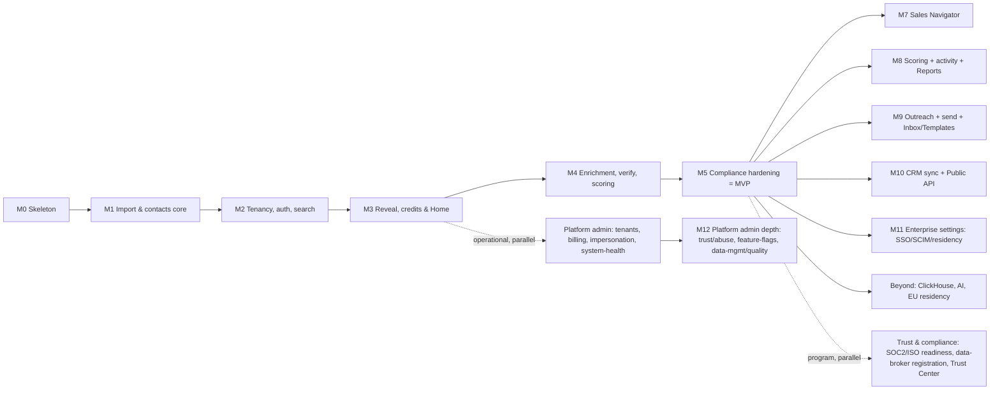

# 10 — Roadmap

> Phased delivery. The MVP is the **full thin slice** (M1–M5): per-workspace import → dedup → verify →
> masked search → reveal/export, behind self-built auth + tenant-level credits + GDPR/CCPA suppression.
> M0 is the foundation; M7+ extends with Sales Navigator, scoring, outreach/send, integrations, and AI.
> The customer app surface is **6-destination nav** ([11](./11-information-architecture.md)) + **tiered
> settings** ([12](./12-settings.md)); the internal staff console is a **separate `apps/admin`** with a
> privileged, audited cross-tenant path ([13](./13-platform-admin.md),
> [ADR-0011](./decisions/ADR-0011-platform-admin-and-privileged-access.md)) and ships on a **parallel,
> operational track** (M3–M5 basics, M12 depth). **Credits is not a milestone** — it's a Settings area +
> top-bar pill ([11 §1](./11-information-architecture.md), [12 §4](./12-settings.md)).

> **Execution overlay:** the build-level sequencing of Phase 1 (the M0 foundation + M1–M5 MVP) —
> scaffold order, per-milestone build breakdown, critical path, and risk call-outs — is detailed in
> [14 — Phase 1 Execution](./14-phase-1-execution.md). This doc remains the source of truth for *what*
> lands *when*; doc 14 only sequences *how* it gets built.

## Milestone overview

**Critical path:** M1 (schema + per-workspace import/dedup) → M2 (tenancy + RLS + auth) → M3
(reveal/billing) gates the money loop. M4 layers enrichment/verification/scoring on M1's contacts. M7+
extend the post-MVP surface and don't block the MVP. M-numbers match the modules in
[05 §21](./05-features-modules.md#21-feature--milestone-matrix) (H10).

---

## M0 — Skeleton
**Goal:** a runnable, CI-backed AWS-native foundation across **two repos**.
- **App monorepo** (Turborepo + **Bun workspaces**, **Biome** lint/format): `apps/{web,auth,api,workers}`
  boot (`auth` = the dedicated **`auth.truepoint.in`** IdP origin — [17](./17-authentication.md),
  [ADR-0016](./decisions/ADR-0016-dedicated-auth-origin-and-cross-domain-token-exchange.md));
  `packages/{db,core,auth,integrations,ui,email,search,analytics,observability,config,types}`
  scaffolded ([01 §5](./01-tech-stack.md#5-repositories-two)); strict TS.
- **Infra repo** (Terraform; state in S3 + DynamoDB locking): network/VPC, **Aurora PostgreSQL
  Serverless v2 + RDS Proxy**, **ElastiCache Redis**, **Typesense cluster** (ECS), **ECS Fargate**
  services (api/web/workers), ALB, S3, SES, ECR, observability ([01 §3](./01-tech-stack.md#3-aws-topology)).
- **Self-built auth scaffold** ([Lucia](./decisions/ADR-0010-aws-native-self-hosted-stack.md)): session
  middleware + `packages/auth` skeleton (password/OAuth/MFA wiring stubbed) + the **`apps/auth`** origin
  shell with `/token/exchange`·`/token/refresh`·`/.well-known/jwks.json` stubbed, so M1/M2 build on it
  ([17 §3](./17-authentication.md#3-cross-domain-token-contract)).
- Drizzle wired; first migration; `bun run db:migrate`/`db:seed`.
- **CI/CD:** GitHub Actions → lint (Biome) → typecheck → test → build images → **ECR**; merge → staging;
  release → **CodeDeploy** blue/green ([01 §6](./01-tech-stack.md#6-environments--cicd)).
- `docker-compose` local: Postgres 16 (+ extensions), Redis, **Typesense**, LocalStack (S3/SES), MailHog.
- **DoD:** `bun run dev` brings up the local stack; `/health` green on `api`; CI passes and pushes an
  image to ECR; `bun run build` clean; `terraform plan` clean for `dev`.

## M1 — Import & contacts core *(load-bearing)*
**Goal:** per-workspace import lands deduped **overlay** contacts/accounts (the global master graph + cross-source ER are a later scale track — [ADR-0021](./decisions/ADR-0021-global-master-graph-and-overlay.md)).
- Schema: `accounts`, `contacts`, `source_imports` (jsonb `raw_data` provenance), plus the dedup
  unique indexes `(workspace_id, email_blind_index)` / `(workspace_id, linkedin_public_id)` /
  `(workspace_id, sales_nav_lead_id)` (see [03](./03-database-design.md),
  [ADR-0006](./decisions/ADR-0006-per-workspace-multitenant-model.md)).
- `packages/core` import pipeline: **CSV/XLSX + manual + first enrichment provider** → column-map →
  canonical shape → **per-workspace dedup on import** (overlay match-within-workspace; global cross-source ER
  is the master-graph track — [ADR-0021](./decisions/ADR-0021-global-master-graph-and-overlay.md)) → insert
  into the importing workspace only. Runs on the **imports** worker.
- Each imported contact writes one `source_imports` row (`source_name` ∈
  `apollo|zoominfo|linkedin|sales_navigator|hubspot|salesforce|clearbit|manual`, full `raw_data`,
  `content_hash`). The overlay has **no field-level lineage**; the master graph's `source_records` adds it on
  the later track ([ADR-0006](./decisions/ADR-0006-per-workspace-multitenant-model.md), [ADR-0021](./decisions/ADR-0021-global-master-graph-and-overlay.md)).
- **DoD:** import a fixture CSV with deliberate duplicates **into one workspace** → one contact per
  identity (unique index enforced), each with ≥1 `source_imports` row; the importer sees a new-vs-matched
  summary; the **same** payload imported into a **second** workspace creates a **separate** copy.

## M2 — Tenancy, auth & search
**Goal:** users sign up, get a workspace, log in, and search their masked book.
- **Auth origin & progressive login:** authentication is served from **`auth.truepoint.in`** (the IdP/BFF,
  `apps/auth`); login is **identifier-first** with domain→tenant/SSO routing
  ([ADR-0017](./decisions/ADR-0017-progressive-identifier-first-login-and-domain-tenant-routing.md)). After
  login the app domain receives a single-use 60 s **PKCE code** exchanged (`/token/exchange`) for a 15 min
  in-memory **access JWT**; the rotating refresh cookie + Lucia session stay on the auth origin; `apps/api`
  validates the JWT via JWKS ([ADR-0016](./decisions/ADR-0016-dedicated-auth-origin-and-cross-domain-token-exchange.md),
  [17](./17-authentication.md)). Security headers (HSTS / XFO=DENY / nonce-CSP / nosniff / Referrer) on `auth.*`.
- **Self-built auth on Lucia** ([ADR-0010](./decisions/ADR-0010-aws-native-self-hosted-stack.md)):
  email/password (Argon2id) + OAuth (Google/Microsoft via `arctic`) + **MFA (TOTP**; SMS/email/WebAuthn +
  recovery codes land with the M11 depth**)**; SAML/OIDC seam (`tenant_sso_configs`). Tables `user_sessions`,
  `user_oauth_accounts`, `user_mfa`/`user_mfa_methods`, `user_password_resets`, `auth_email_tokens`,
  `tenant_domains` ([03 §4](./03-database-design.md#4-tenancy--auth)).
- Tenancy tree: `tenants`, **global** `users`, `tenant_members` (incl. `is_tenant_owner`), `workspaces`, `workspace_members`, `invitations`
  (roles `owner`/`admin`/`member`/`viewer`); `api_keys` seam. **`provision_new_signup(...)`** creates
  tenant → owner user → default workspace → owner membership → audit row in one transaction
  ([03 §10](./03-database-design.md#10-triggers--db-side-logic)).
- **RLS via GUC:** every workspace-scoped query runs under `SET LOCAL app.current_workspace_id`
  (+ `app.current_tenant_id`) on a non-`BYPASSRLS` role, GUC reset per RDS-Proxy checkout; the app sets
  the same context in AsyncLocalStorage ([03 §9](./03-database-design.md#9-row-level-security)).
- `packages/search` (`SearchPort`) over **Typesense self-hosted from day one** (overlay search), fed by Aurora
  logical-replication CDC ([ADR-0002](./decisions/ADR-0002-search-postgres-then-engine.md)); faceted
  **masked** search, workspace-scoped — the billions-row **global master-graph search runs on OpenSearch** on
  the later scale track ([ADR-0021](./decisions/ADR-0021-global-master-graph-and-overlay.md)). App shell +
  Search/Results + basic lists/saved searches + Admin/Settings shell ([04](./04-ui-ux-design.md)).
- **DoD:** sign up → tenant + default workspace provisioned → **log in (with MFA) on `auth.truepoint.in`**
  → the app domain **exchanges the 60 s code for an access JWT** (refresh cookie scoped to the auth origin;
  **silent refresh** works without re-login) → search → see **masked** results; cross-workspace isolation
  verified at the **DB** layer (RLS denies foreign `workspace_id`); audit entries written with
  `origin_domain`. **Auth-security gates (risk #5/#9/#17):** password hashing is Argon2id; session rotation
  + password-reset flow verified; signup **velocity / disposable-domain** limits trip; `api_keys` stored
  **hashed + scoped**; a **reused / expired / wrong-IP code is rejected**, no account enumeration, and
  progressive lockout trips. *(Full pen-test is a global GA gate at M5.)*

## M3 — Reveal & credits *(money loop)*
**Goal:** buy credits, reveal a contact, export.
- **Tenant credit counter:** `tenants.reveal_credit_balance` (`CHECK >= 0`) — **not** an append-only
  ledger ([ADR-0007](./decisions/ADR-0007-per-workspace-reveal-and-credit-counter.md)).
- **Per-workspace first-reveal** reveal transaction in `packages/core`, identical to
  [07 §3](./07-billing-credits.md): `BEGIN` → `assertNotSuppressed(contact, workspace)` (in-tx,
  unbypassable) → `INSERT contact_reveals ON CONFLICT (workspace_id, contact_id, reveal_type) DO NOTHING`
  → if present, return owned fields and **charge 0** → else
  `SELECT reveal_credit_balance ... FOR UPDATE`; if `< cost`, `ROLLBACK` (`INSUFFICIENT_CREDITS`); else
  decrement; `COMMIT`; audit. Clients send an **`Idempotency-Key`** header. Pricing varies by
  `reveal_type` and is a **placeholder** — reference [07 §1](./07-billing-credits.md), never hardcoded.
- **Stripe top-ups:** credit-pack checkout grants credits to the tenant counter;
  `purchases.stripe_event_id` unique → idempotent grants. Usage history from `contact_reveals` +
  `purchases`.
- **Suppression gate** wired live into the reveal tx; Record-detail + reveal UI; **CSV export** of
  **owned** revealed fields (S3 signed URLs), suppression-checked + audited.
- **Home dashboard** (first widgets): credit balance/burn, recent reveals, quick actions
  ([11 §4.1](./11-information-architecture.md)); more widgets fill in as later surfaces land.
- **Commercial policy** ([ADR-0012](./decisions/ADR-0012-transparent-no-lock-in-commercial-policy.md),
  [07 §1A](./07-billing-credits.md)): transparent self-serve pricing, no auto-renew traps, credits don't expire,
  and an **account-closure export-on-exit** (no data-destroy on churn).
- **DoD:** top up via Stripe CLI → reveal a contact once (free re-reveal in the same workspace; charged
  again in another workspace) → export; double-webhook grants credits **once**; concurrent reveals never
  double-charge; a reveal below balance returns `INSUFFICIENT_CREDITS` and `balance` is unchanged.
  **Abuse gate (risk #9):** a fresh tenant is held to **payment-before-reveal** beyond the signup bonus.

## M4 — Enrichment, verification & scoring
**Goal:** thin records become rich, verified, scored records.
- `packages/integrations` enrichment: provider adapters for **Apollo, ZoomInfo, Clearbit**, cache-first,
  Redis rate limits + circuit breakers + cost budgets; optional **`provider_calls`** (cost/cache).
  Writes **per-workspace** copies — **no golden-merge / confidence-waterfall** ([06](./06-enrichment-engine.md),
  [ADR-0006](./decisions/ADR-0006-per-workspace-multitenant-model.md)).
- **Email verification on reveal** + **phone validation** feeding `email_status`
  (`unverified|valid|risky|invalid|catch_all|unknown`)/`phone_status`. Verification **drives the charge**
  ([ADR-0013](./decisions/ADR-0013-charge-for-verified-data-credit-back.md)): `valid` charges;
  `invalid`/`catch_all`/`unknown` → **0 credits**; `risky` → charged-but-flagged.
- **Lead scoring** ([ADR-0008](./decisions/ADR-0008-lead-scoring-model.md)): versioned `scores`
  (`icp_fit`/`intent_score`/`engagement_score`/`composite_score` 0–100 + `score_breakdown` jsonb,
  append per re-score) + **`intent_signals`** (weighted `signal_type` ∈
  `job_change|new_hire|funding_round|tech_install|web_visit|content_engagement|keyword_search|`
  `linkedin_activity|sales_nav_view`). `contacts.priority_score` is a **cache** of the latest composite
  via an `AFTER INSERT ON scores` trigger. Runs on the **enrichment**/**scoring** workers.
- **DoD:** enrich a thin contact via a provider → fields land per-workspace with a `source_imports` row +
  recorded cost; cache hit on repeat; reveal still charges **exactly once**; verify-on-reveal sets
  `email_status` **and the charge follows the result** (an `invalid` reveal charges **0**,
  [ADR-0013](./decisions/ADR-0013-charge-for-verified-data-credit-back.md)); a re-score appends a `scores` row
  and `priority_score` reflects the new composite.
  Provider contract tests on recorded fixtures (no live spend in CI). **Lead score (quality) stays
  distinct from `email_status` (correctness)** — never conflated.

## M5 — Compliance hardening = **MVP complete**
**Goal:** the full thin slice, launch-grade on privacy.
- **Suppression management UI** (`suppression_list` scope ∈ `global|tenant|workspace`); the gate already
  guards reveals (M3) and will guard sending (M9).
- **`consent_records`**; **DSAR** intake → **access** report + **delete** workflow that resolves the
  **golden identity** then purges the master record (+ `source_records`/`match_links`/channels) and
  **cascades** across **every overlay copy** + `source_imports` + `contact_reveals` + `activities`, then runs
  a **verification scan** ([08 §4](./08-compliance.md)). The golden identity makes find-everywhere provable;
  cost still scales with overlay copies + master shards (see register).
- Full audit coverage; retention jobs; PII encryption finalized; compliance launch checklist green
  (incl. **privacy-counsel review**).
- **DoD:** Playwright e2e of the entire loop (sign up → buy credits → search → reveal → export); a DSAR
  delete removes the subject across **all** workspace copies + imports + reveals + caches (verification
  passes); a suppressed contact never reveals even with credits.

## M7 — Sales Navigator integration
**Goal:** capture LinkedIn / Sales Navigator entities into a workspace.
- `sales_nav_links` with `link_type` ∈
  `profile|account|saved_search|lead_list|account_list|inmail_thread`; import leads/accounts (source
  `sales_navigator`/`linkedin`), deduped on `sales_nav_lead_id` per workspace ([05 §5](./05-features-modules.md)).
- **ToS caution:** automated LinkedIn/SN actions carry account-risk; **human-in-the-loop** capture is the
  default ([ADR-0009](./decisions/ADR-0009-outreach-engine-enroll-and-send.md)).
- **DoD:** connect → capture a profile/lead-list → leads land in the workspace deduped on
  `sales_nav_lead_id` with `source_imports` rows; assisted (non-automated) flow by default.

## M8 — Lead scoring depth + activity timeline
**Goal:** prioritize prospects and see every interaction.
- Scoring/intent-signal surfacing in UI (model shipped in M4); re-score jobs on the **scoring** worker
  ([ADR-0008](./decisions/ADR-0008-lead-scoring-model.md)). **Intent signals are sourced** from **Bombora/G2/6sense**
  feeds (`intent_signals.signal_source`) and **technographic** providers (BuiltWith/HG Insights) ([06 §2](./06-enrichment-engine.md)).
- **Activity timeline:** `activities` (monthly-partitioned) with `activity_type` ∈
  `email_sent|email_opened|email_clicked|email_replied|call_made|call_connected|linkedin_message|`
  `linkedin_connected|sales_nav_inmail|meeting_held|note_added` over `channel` ∈
  `email|phone|linkedin|sales_navigator|in-person`; `contacts.last_activity_at` maintained.
- **Reports / analytics** ([11 §4.5](./11-information-architecture.md)): pipeline/funnel, credit usage,
  sending & deliverability, team activity, **Data Health**, and lead-score views — ClickHouse/PostHog-backed.
- **DoD:** a contact shows a sorted timeline of logged + system-written activities; manual note/call/
  meeting logging works; `priority_score` and intent signals render on detail; the Reports dashboards
  render with date/member filters and CSV export.

## M9 — Outreach sequencing + send engine
**Goal:** LeadWolf **enrolls** contacts and **sends** ([ADR-0009](./decisions/ADR-0009-outreach-engine-enroll-and-send.md)).
- `outreach_sequences` → `outreach_steps` (ordered: channel, delay, template); `outreach_log`
  (enrollment + status); each send/open/click/reply lands in `activities`. `contacts.outreach_status`
  advances (`new`→`in_sequence`→`replied`/`meeting_booked`/`disqualified`/`nurture`/`unsubscribed`).
  Runs on the **outreach delivery** worker.
- **Flow:** draft (AI or manual) → **review** → **send**. AI drafting **feeds the send engine** (reverses
  the old "no email send at MVP / draft-only" stance).
- **Templates** (library, snippets, **merge fields**, AI draft, deliverability lint) and the **Inbox +
  Tasks** surface (unified replies + reminders) ship with the send engine ([11 §4.3/§4.4](./11-information-architecture.md)).
- **Suppression/DNC gates sending**, suppression-checked before each send ([08](./08-compliance.md)).
- **Sending compliance is first-class:** CAN-SPAM + GDPR/ePrivacy consent + unsubscribe +
  physical-address footer; **deliverability** (sending domains, DKIM/SPF/DMARC, warm-up,
  bounce/complaint → suppression). Email via **SES** (SNS→SQS feedback). LinkedIn/SN automated send
  carries **ToS risk** — human-in-the-loop default.
- **DoD:** enroll a revealed contact in a 2-step sequence → review → send via SES → open/click/reply
  recorded in `activities`; every send passes suppression + appends an unsubscribe link + footer; a
  bounce/complaint auto-suppresses the address **and credits back the original reveal if within the guarantee
  window** ([ADR-0013](./decisions/ADR-0013-charge-for-verified-data-credit-back.md)). **Deliverability gate
  (risk #6):** the sending domain is authenticated (**DKIM/SPF/DMARC** aligned), a **warm-up** schedule is active
  before volume sends, and per-domain **reputation thresholds throttle/pause** sending ([08 §6](./08-compliance.md)).

## M10 — CRM sync + Public REST API
**Goal:** push data out and open the platform.
- **CRM sync** behind `IntegrationProvider` (`packages/integrations`): **HubSpot**, **Salesforce**, then
  **Pipedrive** — OAuth connect, field mapping, push revealed contacts/accounts/lists, sync log +
  conflict handling; workspace-scoped connections. Runs on the **CRM sync** worker. *(Build approach open:
  custom connectors vs a **unified integration API** like Merge.dev — [09 §11 Q5](./09-api-design.md).)*
- **Public REST API** (`@hono/zod-openapi`): API-key-authenticated, tenant-scoped (hashed/scoped
  `api_keys`) search/reveal/pull; reveal metered against the **tenant** counter with `Idempotency-Key`
  honored; rate limits, usage metering, OpenAPI docs ([09](./09-api-design.md)).
- **DoD:** connect HubSpot → push a list of revealed contacts (re-push is idempotent); an API key reveals
  a contact metered against the tenant counter, honoring `Idempotency-Key`; OpenAPI spec published.

## M11 — Enterprise settings
**Goal:** unlock the Enterprise tier controls ([12 §4](./12-settings.md)).
- **SSO** (SAML 2.0 / OIDC via `tenant_sso_configs`) with **JIT provisioning** + **enforce-SSO**; **SCIM**
  provisioning (`scim_tokens`); **domain claiming/verification** (`tenant_domains`); **WebAuthn passkeys**
  + **trusted devices**; per-scope **auth policy** (MFA enforcement / allowed methods / IP allowlist /
  session timeout, strictest-wins — `tenant_auth_policies`/`workspace_auth_policies`,
  [ADR-0018](./decisions/ADR-0018-auth-policy-and-mfa-enforcement-model.md)); **OAuth apps**
  (`oauth_app_clients`); **data-residency** controls; **audit-log export**. Design [17](./17-authentication.md).
- **DoD:** an enterprise tenant claims + verifies a domain, enables SAML/OIDC SSO + SCIM (a deprovision
  via SCIM revokes access), registers a passkey, and sets MFA-required; non-SSO logins are blocked when
  enforced; a workspace policy can only **tighten** the tenant policy; admin exports the audit log; the IP
  allowlist denies out-of-range access.

## M12 — Scale-hardening, SRE & event backbone
**Goal:** meet the performance contract at scale and operate it ([18](./18-scalability-performance.md),
[19](./19-observability-reliability.md), [20](./20-event-driven-realtime-backbone.md)).
- **SLOs + error budgets** ([ADR-0024](./decisions/ADR-0024-performance-slos-and-capacity-model.md)):
  per-endpoint latency budgets ([18 §2](./18-scalability-performance.md)); k6 load/soak/spike tests;
  caching tiers + **invalidate-on-write**; read replicas + ClickHouse for analytics; **Citus cutover**
  threshold ([18 §8](./18-scalability-performance.md)).
- **Event backbone** ([ADR-0027](./decisions/ADR-0027-real-time-delivery-and-event-backbone.md)):
  transactional `outbox` (commit⇒publish) + idempotent consumers + DLQ/retry + **backpressure**;
  **SSE/WebSocket** real-time gateway (RLS/visibility-scoped).
- **Observability/SRE**: metrics/logs/traces, alerting, on-call, **DR runbook + verified restore**,
  chaos/game-days, **FinOps** cost attribution ([19](./19-observability-reliability.md)).
- **DoD:** load test meets the [18 §2](./18-scalability-performance.md) p95 budgets at target concurrency;
  a crash between commit and publish loses **no** event (outbox) and re-delivery is idempotent; DLQ +
  backpressure demoed; a DR drill restores within **RTO 1h / RPO 5m**; SLO dashboards + error-budget
  alerts live; per-tenant cost attribution reported.

## M13 — Data intelligence (acquisition + quality & freshness)
**Goal:** lawful coverage and fresh, defensible data ([21](./21-data-acquisition-sourcing.md),
[22](./22-data-quality-freshness-lifecycle.md)).
- **Acquisition breadth:** public registries + EU providers + **opt-in co-op**; **provider vetting/DPA**
  + sub-processor register + **lawful-basis lineage** ([21](./21-data-acquisition-sourcing.md)).
- **Freshness lifecycle** ([ADR-0025](./decisions/ADR-0025-data-freshness-decay-and-reverification-lifecycle.md)):
  per-field freshness SLAs + `verification_jobs` (re-verify/re-enrich, priority by decay/use);
  `data_quality_score` formula; decay + purge.
- **Coverage/ER quality:** email/phone coverage + match-precision/false-merge targets
  ([22 §5](./22-data-quality-freshness-lifecycle.md)); **manual-review queue** + merge/unmerge UI.
- **DoD:** a scheduled re-verify run updates `freshness_status` and **credits back** confirmed bounces;
  coverage/match-rate dashboards meet [22 §5](./22-data-quality-freshness-lifecycle.md) thresholds (alert
  on breach); the ER manual-review queue operates with audit; a DSAR shows the lawful-basis lineage.

## M14 — AI intelligence layer
**Goal:** ship the assistive AI surface ([23](./23-ai-intelligence-layer.md),
[ADR-0023](./decisions/ADR-0023-ai-provider-and-intelligence-architecture.md)).
- `AiPort` (**Anthropic Claude**) + model router; **NL→structured search**; **conversational copilot**
  (grounded, cited); **generative drafting** (human-review-before-send); **summarization**; **semantic
  search** (pgvector); **agentic research** (verify-before-write); **AI extraction**; **signal-to-play**
  (via `27`).
- **Guardrails:** content safety + prompt-injection mitigations; **eval/safety harness** gating releases;
  per-tenant budgets + metering (`ai_requests`); AI audit + DSAR scope.
- **DoD:** NL search returns a **validated** query run under RLS + team visibility; the copilot answers
  with citations and never surfaces **unrevealed** PII; a drafted message **requires approval** before
  send (suppression-checked); the eval harness blocks a seeded regression in CI; AI spend is metered per
  tenant; AI artifacts appear in DSAR scope.

## M15 — Departments & teams
**Goal:** department-tailored experiences ([25](./25-departments-teams-workspaces.md),
[departments/](./departments/), [ADR-0022](./decisions/ADR-0022-departments-teams-intra-workspace-segmentation.md)).
- `teams`/`team_members`/`team_role`/`department_type`; **personas** over the 6 destinations (**H11**
  intact); **record-visibility** (`workspace|team|owner`); **per-team credit budgets** enforced at reveal
  (next to the tenant counter); department **dashboards + report packs**; the 11 department modules.
- **DoD:** a workspace runs ≥2 department personas with distinct dashboards/default views; a `team`/`owner`
  -visibility record is **hidden from other teams** while default `workspace` records stay shared; a
  `hard_cap` team is **blocked at budget** while the tenant pool still has credits; a manager sees the team
  rollup + per-member; every department action is audited.

## M16 — Automation & integrations breadth
**Goal:** signal-to-play automation + open delivery ([27](./27-workflow-automation-engine.md),
[26](./26-integrations-data-delivery.md)).
- **Automation engine** ([ADR-0026](./decisions/ADR-0026-workflow-automation-engine.md)):
  trigger→condition→action; recipe library; per-team policies; **dry-run**;
  **suppression-gated + idempotent + audited** (`automation_runs`).
- **Integrations:** bidirectional CRM + **native apps**, **reverse-ETL**/warehouse, **Chrome extension**,
  **SMS** channel, Slack/Teams app, **export center + limits/policies**.
- **DoD:** a funding-signal play routes + enrolls a contact — suppression-respected, **idempotent on
  re-delivery**, logged to `automation_runs`; a smart segment reverse-ETLs to a warehouse; the Chrome
  extension reveals + adds a contact under budget; an export over the cap requires approval.

## Platform admin — *parallel operational track* (`apps/admin`)
**Goal:** internal staff operate the platform ([13](./13-platform-admin.md),
[ADR-0011](./decisions/ADR-0011-platform-admin-and-privileged-access.md)) — a **separate app** on its
own track (ops need basics during M3–M5; depth runs in parallel post-MVP), never blocking the customer MVP.
- **Early (≈M3–M5):** tenants directory + suspend / credit-grant; global user admin; **impersonation**
  (time-boxed/banner/audited); billing oversight; **system health** (queues/DLQ/CDC/backups);
  immutable `platform_audit_log`; staff SSO+MFA+IP-allowlist+JIT.
- **Depth (parallel, post-MVP):** trust/abuse + deliverability dashboards; **feature flags** (global + per-tenant);
  provider configs; **data management & quality** (DQ scorecards, bulk re-verify/re-enrich on AWS Batch,
  DB-ops); content/comms.
- **DoD (early):** a `super_admin` (SSO+MFA) suspends a tenant and grants credits — both audited to
  `platform_audit_log`; a `support` user starts a time-boxed, banner-flagged impersonation; system-health
  shows queue depth + CDC lag; the customer app/API cannot reach `/admin/*`.

## Trust & compliance program — *parallel track* ([ADR-0014](./decisions/ADR-0014-trust-and-certification-program.md))
**Goal:** make the compliance differentiator **verifiable** (turn the wedge from promise to moat) and satisfy
data-broker law — the remediation for the analysis' execution-risk drag ([15 §2](./15-gap-remediation.md)).
- **Readiness (≈M5):** map **SOC 2 Type II / ISO 27001** controls to the existing auth/RLS/audit/encryption
  design ([08 §15](./08-compliance.md)); publish the **Trust Center** (sub-processor list, DPA, security
  whitepaper, cert status) in tenant compliance settings ([12 §4](./12-settings.md)).
- **GA gate:** **US data-broker registration** (California DROP/Delete Act + applicable states) filed before GA
  in those markets ([13 §3](./13-platform-admin.md)); from **2026-08-01**, **process DROP deletion requests**
  (poll ≥ every 45 days) via the DSAR fan-out ([08 §4.4](./08-compliance.md#44-california-drop-data-broker-deletion-platform)).
- **Post-MVP:** external SOC 2 / ISO audits; expand registrations; align with the EU residency posture
  ([08 §8](./08-compliance.md)).
- **DoD (readiness):** controls documented + mapped; Trust Center live; data-broker registration filed where
  required; privacy-counsel sign-off ([08 §12](./08-compliance.md)).

## Beyond (prioritized backlog)
- **AI:** now a **scheduled track — M14** ([23](./23-ai-intelligence-layer.md),
  [ADR-0023](./decisions/ADR-0023-ai-provider-and-intelligence-architecture.md)): NL → validated
  structured query (never raw SQL), conversational copilot, AI drafting (human-reviewed) feeding the send
  engine, **agentic per-account research** (verify-before-write), `pgvector` semantic search — on
  **Anthropic Claude** behind `AiPort` ([05 §16](./05-features-modules.md)).
- **ClickHouse event analytics:** self-hosted, fed by CDC (Debezium) once an event table (e.g.
  `activities`) exceeds ~50M rows ([01 §1](./01-tech-stack.md#1-at-a-glance),
  [ADR-0010](./decisions/ADR-0010-aws-native-self-hosted-stack.md)).
- **Global master graph at scale ([ADR-0021](./decisions/ADR-0021-global-master-graph-and-overlay.md)):** the
  billions-row shared universe — **Citus**-sharded golden store + **S3/Iceberg** lake + batch **ER**
  (blocking/MinHash-LSH/Splink on Spark/Athena) + **OpenSearch** masked search + **ClickHouse** facet counts;
  built on this scale track once volume + the data-broker posture ([08 §15](./08-compliance.md)) warrant it
  (scale-hardening sequenced in **M12** — [18 §8](./18-scalability-performance.md)).
- **Alerts:** new-match / new-signal notifications on saved searches and tracked contacts.
- **EU data-residency** region split (region-tagged from day one; full split when demand warrants).
- **Seat-based subscriptions** atop credits; periodic re-verification at scale; tamper-evident audit log.

---

## Risk register (carried across milestones)

| # | Risk | Impact | Mitigation | Owner milestone |
|---|---|---|---|---|
| 1 | **Entity-resolution quality at billions** — weak blocking/thresholds let duplicates or **false merges** into the global master graph (and dupes into a workspace overlay) | High (data trust + wasted reveals) | Deterministic keys (email blind index/domain/LinkedIn id/phone) + **blocking + MinHash/LSH** + **Splink** scoring + **survivorship**; manual-review queue for low-confidence merges; reversible merges via `source_records`; overlay unique `(workspace_id, …)` indexes for exact dupes; importer new-vs-matched summary ([ADR-0015](./decisions/ADR-0015-entity-resolution-dedup-engine.md) amended by [ADR-0021](./decisions/ADR-0021-global-master-graph-and-overlay.md), [06 §9](./06-enrichment-engine.md)) | M1 (overlay exact) / master-graph ER track |
| 2 | **Double-charge** — a bare tenant counter lacks a ledger's reconciliation/refund history | High (trust + money) | `FOR UPDATE` on `tenants.reveal_credit_balance` + `CHECK >= 0` + unique `(workspace_id, contact_id, reveal_type)` + client `Idempotency-Key` (the required mitigations per [ADR-0007](./decisions/ADR-0007-per-workspace-reveal-and-credit-counter.md)); revisit append-only ledger if reconciliation gaps appear | M3 |
| 3 | **Incomplete DSAR deletion** — must purge the golden identity **and** every overlay copy | High (legal) | Resolve the **golden identity** (provable find-everywhere) → delete master record + `source_records` + `match_links` + channels, then **cascade** to all overlay `contacts` + `source_imports` + `contact_reveals` + `activities` + caches; verification scan; global suppression; audit proof ([08 §4](./08-compliance.md)) | M5 |
| 4 | Enrichment cost blowout / provider outage | Med | Cache-first, Redis rate limits, circuit breakers, daily cost budgets, charge-on-reveal; `provider_calls` cost tracking | M4 |
| 5 | **Self-built auth** security defects (session/MFA/OAuth/SAML) | High | Lucia primitives (not hand-rolled crypto), Argon2id, rotation + reset flows, MFA, **progressive lockout + bot detection at the identifier step + impossible-travel detection + no account enumeration**, credential-stuffing/velocity monitoring, pen-test before GA, scoped/hashed `api_keys` ([ADR-0010](./decisions/ADR-0010-aws-native-self-hosted-stack.md), [17 §6](./17-authentication.md#6-security-layers)) | M2 |
| 6 | **Sending compliance / deliverability** failure (spam complaints, blocklisting, CAN-SPAM/GDPR breach) | High (legal + domain reputation) | Suppression gate before every send; CAN-SPAM + GDPR/ePrivacy consent + unsubscribe + physical-address footer; DKIM/SPF/DMARC + warm-up; bounce/complaint → auto-suppression via SES SNS→SQS feedback | M9 |
| 7 | **LinkedIn / Sales Navigator ToS** exposure from automated actions | High (account bans) | Human-in-the-loop (assisted) capture/send as default; no headless automation of LinkedIn/SN; rate-respecting; per-feature legal review ([ADR-0009](./decisions/ADR-0009-outreach-engine-enroll-and-send.md)) | M7 / M9 |
| 8 | Search strain / drift between Aurora and the search indexes (**OpenSearch** global, **Typesense** overlay) at billions | Med | `SearchPort` abstraction; CDC search-sync worker with lag monitoring + reindex; sharded OpenSearch + ClickHouse for facet counts; defined scale headroom ([ADR-0021](./decisions/ADR-0021-global-master-graph-and-overlay.md)) | M2 |
| 9 | Self-serve abuse/fraud | Med | Signup verification, disposable-domain blocking, velocity limits, payment-before-reveal for fresh tenants, Stripe Radar | M2 / M3 |
| 10 | **Impersonation misuse / over-broad staff access** | High (privacy + trust) | Time-boxed + banner-flagged + reason-logged impersonation; least-privilege staff RBAC + JIT elevation; immutable `platform_audit_log`; periodic access reviews; customer-visibility/consent policy ([ADR-0011](./decisions/ADR-0011-platform-admin-and-privileged-access.md), [08 §14](./08-compliance.md)) | Platform admin |
| 11 | **Privileged-role blast radius** — the RLS-bypass cross-tenant role is a high-value target | High | Dedicated role used **only** by `apps/admin`, distinct from the app's non-`BYPASSRLS` role; staff SSO+MFA + IP allowlist; secrets in Secrets Manager + rotation; every access audited | Platform admin |
| 12 | **Webhook delivery** failures / SSRF / secret leakage | Med | Signed payloads + delivery log + retries/backoff; egress controls/allowlist; per-tenant signing-secret rotation | M10 |
| 13 | **Incumbent feature absorption** — CRMs/Clay fold enrichment + sequencing + compliance into the seat price (the market analysis' sole *Critical* risk) | **Critical** (existential) | Wedge discipline (stay narrow on honest + compliant + all-in-one); **CRM-neutral open API** ([09 §8](./09-api-design.md), M10); certs as a moat ([ADR-0014](./decisions/ADR-0014-trust-and-certification-program.md)); fair-billing wedge ([ADR-0012](./decisions/ADR-0012-transparent-no-lock-in-commercial-policy.md)) | Strategic / M10 |
| 14 | **No proprietary data asset** — inherits providers' accuracy ceiling; can't win raw accuracy outright | High | Verify-on-reveal + **charge-only-for-`valid` + credit-back** ([ADR-0013](./decisions/ADR-0013-charge-for-verified-data-credit-back.md)); multi-provider waterfall; optional dedicated verification provider ([06 §11](./06-enrichment-engine.md)); over time the **global master graph** + opt-in co-op build toward a proprietary asset ([ADR-0021](./decisions/ADR-0021-global-master-graph-and-overlay.md)) | M4 |
| 15 | **Data-broker compliance** — operating a global universe makes CA Delete Act/DROP registration + state broker laws **core and GA-gating** | High (legal/GA) | Broker registration before GA; DROP polling → DSAR fan-out ([08 §4.4](./08-compliance.md)); global suppression at both layers; opt-in/disclosed co-op; counsel review ([08 §15](./08-compliance.md), [ADR-0021](./decisions/ADR-0021-global-master-graph-and-overlay.md)) | M5 / Trust track |
| 16 | **Billions-scale infra cost/ops** — Citus shards + S3/Iceberg lake + OpenSearch + ClickHouse + ER pipeline are a large surface | Med | Staged by milestone (single-writer Aurora + Typesense until volume warrants); `SearchPort`/lake abstractions; cost dashboards; shard cutover tracked as an open question ([03 §13](./03-database-design.md), [ADR-0021](./decisions/ADR-0021-global-master-graph-and-overlay.md)) | Post-MVP |
| 15 | **Compliance wedge unproven / cert-dependent / US-only** — the differentiator is a promise until attested | High | **Trust & certification program** ([ADR-0014](./decisions/ADR-0014-trust-and-certification-program.md)): SOC 2 / ISO readiness at M5, **data-broker registration a GA gate**, public Trust Center ([08 §15](./08-compliance.md)) | M5 / Trust track |
| 16 | **Placeholder pricing unvalidated** vs real willingness-to-pay | Med | Transparent no-lock-in policy ([ADR-0012](./decisions/ADR-0012-transparent-no-lock-in-commercial-policy.md)); validate prices in early access before GA; non-expiring credits reduce commitment risk | M3 |
| 17 | **Cross-domain token exchange / IdP boundary** — code interception/replay, open redirect, CSRF, refresh-token theft across `auth.*`↔`app.*` | High (account takeover) | Single-use 60 s **IP-bound + PKCE** code validated server-side before any token; access JWT **in memory only**; refresh token **HttpOnly/Secure/SameSite=Strict** cookie scoped to the auth origin, **rotated + reuse-detected** (family revoke); CORS **allow-list, no wildcard**; `sid` denylist for fast revoke; auth security headers (HSTS / XFO=DENY / nonce-CSP / nosniff / Referrer) ([ADR-0016](./decisions/ADR-0016-dedicated-auth-origin-and-cross-domain-token-exchange.md), [17 §3/§6](./17-authentication.md#3-cross-domain-token-contract)) | M2 |
| 18 | **AI safety / cost** — hallucination, **prompt-injection** on agentic browsing, runaway LLM spend | High (trust + cost) | Grounded RAG with **cited sources**; **human-in-the-loop** before any send/persist; treat fetched web text as untrusted; **eval/safety harness** gates releases in CI; per-tenant budgets + circuit breakers + prompt caching ([ADR-0023](./decisions/ADR-0023-ai-provider-and-intelligence-architecture.md), [23](./23-ai-intelligence-layer.md)) | M14 |
| 19 | **Stale data / decay** — data ages, bounce rate rises, the credit-back guarantee erodes margin | High (trust + money) | Per-field **freshness SLAs** + scheduled re-verify (priority by decay/use); `data_quality_score` + Data Health; coverage/bounce dashboards with alerts ([ADR-0025](./decisions/ADR-0025-data-freshness-decay-and-reverification-lifecycle.md), [22](./22-data-quality-freshness-lifecycle.md)) | M13 |
| 20 | **Department permission complexity** — record-visibility + team budgets add authz surface and bug risk | Med (privacy + correctness) | Default `visibility=workspace`; app-layer filter + **optional** RLS predicate (no new RLS scope); budgets checked **in-tx** next to the counter; tests + audit ([ADR-0022](./decisions/ADR-0022-departments-teams-intra-workspace-segmentation.md), [25](./25-departments-teams-workspaces.md), [03 §9](./03-database-design.md)) | M15 |
| 21 | **Automation loops / abuse** — a rule's action re-triggers itself or floods sends | Med | **Idempotency** on `(rule_id,event_id,entity_id)`; loop/recursion guards; per-workspace rate limits; **suppression gate** on every contact action; dry-run + staged enable; `automation_runs` observability ([ADR-0026](./decisions/ADR-0026-workflow-automation-engine.md), [27](./27-workflow-automation-engine.md)) | M16 |
| 22 | **Event-backbone reliability** — dropped events or unbounded queue growth break the freshness SLOs | High | **Transactional outbox** (commit⇒publish) + idempotent consumers; **DLQ** + alerts; **backpressure** (shed/slow producers); per-entity ordering ([ADR-0027](./decisions/ADR-0027-real-time-delivery-and-event-backbone.md), [20](./20-event-driven-realtime-backbone.md)) | M12 |

## Definition of done (global)
A milestone is done when: code merged + reviewed, tests green in CI (unit + integration; e2e where
applicable), migrations applied to staging, the milestone's DoD demo passes, docs updated, and (for
M5+) the relevant compliance checklist items are satisfied.

## Sequencing notes
- **Estimates intentionally omitted** until team size/pacing is set (an open item). The *order* and the
  DoD gates are the commitment; durations get attached when we staff it.
- Each milestone ends in a runnable, demoable increment — no big-bang integration.
- M-numbers are kept in lockstep with [05 §21](./05-features-modules.md#21-feature--milestone-matrix);
  if a module's milestone moves, update both.
