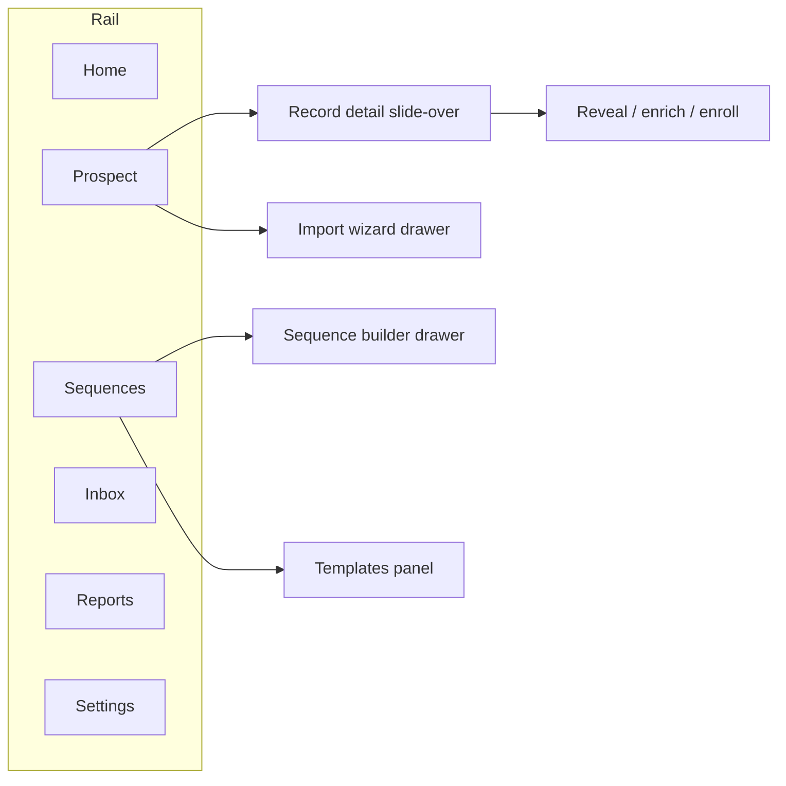

# 11 — Information Architecture (customer app)

> The customer-facing app surface: a **modern, single-page command center**. Few top-level
> destinations; most work happens on one screen via **master–detail + slide-over panels + a bulk-action
> bar + a `cmdk` command palette**. Light/monochrome theme ([04](./04-ui-ux-design.md)); per-workspace
> data ([ADR-0006](./decisions/ADR-0006-per-workspace-multitenant-model.md)). The internal operator
> console is separate — see [13](./13-platform-admin.md).

## 1. Design philosophy

- **Single-page command center.** An SPA shell (Next.js client routing, no full reloads). Search →
  reveal → list → enroll happens on **one surface** via panels, not page-hops. Detail, reveal, enroll,
  import, template edit, and settings open as **drawers/panels** that preserve context.
- **Command-first.** A `cmdk` palette + global search reaches any record or action from anywhere.
- **Modern, minimal nav.** A compact icon+label rail with **6 destinations** — depth lives in segmented
  controls + panels, not nested tabs.
- **Not a monolith.** Frontend = feature-sliced, lazy-loaded modules (each destination is a
  self-contained module) composed in one shell; backend already modular ([02](./02-architecture.md)).
- **Credits is not a tab.** Balance shows as a **top-bar pill** that deep-links into
  Settings ▸ Billing & Credits ([12](./12-settings.md)).

## 2. Navigation — 6 destinations



Compact left rail (collapsible to icons): **Home · Prospect · Sequences · Inbox · Reports**, with
**Settings** + **workspace switcher** + **user row** pinned at the bottom. **Top bar** (always on):
global search · `cmdk` palette · **credit-balance pill** (→ Settings ▸ Billing & Credits) ·
notifications bell.

Everything else is a **panel/drawer/segment**, never a tab: record detail · reveal · enrich · enroll ·
import wizard · template editor · score breakdown · list management · saved views · settings.

**Departments/teams** layer on as **personas**, not new destinations ([25 §3](./25-departments-teams-workspaces.md),
**H11**): a **team switcher** sits beside the workspace switcher, and a member's active team sets the
default Home dashboard, Prospect filters/saved-views/segments ([24](./24-advanced-search-exploration-ux.md)),
and Reports pack. The **AI copilot** is a top-bar/`cmdk` surface ([23](./23-ai-intelligence-layer.md));
**automation** build + run-status live in Settings and per-surface panels ([27](./27-workflow-automation-engine.md)) —
the six destinations and **Credits-not-a-tab** stand.

## 3. Layout shell

```
┌──────────┬──────────────────────────────────────────────────────────┐
│  Rail    │ Top bar: title · ⌘search · palette · 🔔 · [● 1,240 credits]│
│ (icons+  ├──────────────────────────────────────────────────────────┤
│  labels) │  ┌─ filter rail ─┬─ results grid ───────┬─ detail panel ─┐ │
│          │  │ facets        │ Contacts ⇄ Accounts   │ (slide-over)   │ │
│ Home     │  │ Saved Views   │ masked rows + glyphs  │ score/reveal   │ │
│ Prospect │  │ Lists         │ [☐ bulk select]       │ provenance     │ │
│ Sequences│  └───────────────┴───────────────────────┴────────────────┘ │
│ Inbox    │  ┌─ sticky bulk-action bar: reveal(N) · list · enroll · CSV ┐│
│ Reports  │  └──────────────────────────────────────────────────────────┘│
│ ──────── │                                                              │
│ Settings │                                                              │
│ [WS ▾]   │                                                              │
│ [user]   │                                                              │
└──────────┴──────────────────────────────────────────────────────────┘
```

Separation is the hairline border + whitespace only (per [04 §1](./04-ui-ux-design.md)); panels get a
single soft shadow.

## 4. Destinations (surfaces + their panels)

### 4.1 Home — *command center* (widgets land M3→M9)
Workspace cockpit: **today's tasks**, **recent replies**, hot leads (top scores), sequence-performance
snapshot, **credit balance + burn**, recent imports/enrichment, activity feed. Quick actions: new
search · import · start sequence.

### 4.2 Prospect — *the single page* (M1–M3)
One surface = **Search + Contacts + Accounts + Lists**.
- **Left rail:** filter facets (title, seniority, department, account, headcount, industry, location,
  has-email/phone, **lead score**, `outreach_status`, list membership) + **Saved Views / Lists**
  (static & dynamic) selector. High-cardinality facets are **search-box typeahead** suggesting real indexed
  values, with **abbreviation/synonym expansion** (type `CEO` → "Chief Executive Officer") — spec in
  [24 §3–§4](./24-advanced-search-exploration-ux.md), architecture [ADR-0035](./decisions/ADR-0035-search-query-and-filter-architecture.md).
- **Center grid:** virtualized; **segmented toggle Contacts ⇄ Accounts**; masked email/phone with
  **status + score glyphs**; column config + density toggle. Backed by `SearchPort` — **OpenSearch**
  (global master graph) + **Typesense** (overlay), masked ([ADR-0002](./decisions/ADR-0002-search-postgres-then-engine.md)
  amended by [ADR-0021](./decisions/ADR-0021-global-master-graph-and-overlay.md)).
- **Right slide-over — record detail:** identity · **score + breakdown** ([ADR-0008](./decisions/ADR-0008-lead-scoring-model.md))
  · **per-import provenance** (`source_imports`) + a **Data Health badge** (verification status,
  staleness, duplicate flag — see [06](./06-enrichment-engine.md)) · **reveal** (inline, spends tenant
  credit, [07 §3](./07-billing-credits.md)) · activity timeline · notes · add-to-list · **enroll in
  sequence**.
- **Sticky bulk-action bar:** reveal selected (shows cost + balance) · add to list · enroll · export CSV.
- **Import** opens as a wizard drawer (CSV/XLSX · provider · Sales Nav) with a history panel.
- **Bulk CSV enrichment** *(M17 — [31](./31-bulk-enrichment-pipeline.md))* extends the same Import
  drawer: upload a **sparse CSV** → **column-map** → **estimate** (match-first against our data, shows
  matchable rows + credit cost before any spend) → **run** → **progress** (large jobs run async on AWS
  Batch off the request path) → **download** the enriched/verified file. It is a **mode of the Import
  surface under Prospect**, not a new destination (Credits-not-a-tab discipline, **H11**); the jobs/history
  panel lists past runs with status and re-downloadable outputs. Full design in [31](./31-bulk-enrichment-pipeline.md).

### 4.3 Sequences — *outreach* (M9 — [ADR-0009](./decisions/ADR-0009-outreach-engine-enroll-and-send.md))
List (status, enrolled, performance) · **builder drawer** (ordered `outreach_steps`: channel, delay,
template, conditions) · enrollment view · send schedule/throttle · per-step stats
(sent/open/click/reply/bounce/unsub) · pause/resume · **sending-identity** pick · suppression-gated
sends. **Templates** = a panel/sub-route here (library, snippets, **merge fields**, AI draft
[05 §16](./05-features-modules.md), deliverability lint).

### 4.4 Inbox — *replies + tasks* (M9)
Unified **replies** (email + LinkedIn) **+ tasks/reminders** — the rep's daily driver. Threads ·
assign/snooze/done · quick reply (template) · convert reply → task / book-meeting / disqualify · filters
(mine / unassigned / by sequence). Tasks: manual + system-generated (reply received, follow-up due).

### 4.5 Reports — *analytics* (M8; ClickHouse/PostHog, [ADR-0010](./decisions/ADR-0010-aws-native-self-hosted-stack.md))
Dashboards: **Pipeline/funnel** (`outreach_status`, meetings) · **Credit usage** (reveals by
user/type/time, cost-per-reveal) · **Sending & deliverability** (open/click/reply/bounce/complaint/unsub,
domain health) · **Team activity** · **Data Health** (verification pass-rate, coverage, staleness,
duplicates — customer view of [06](./06-enrichment-engine.md)) · **Lead-score / intent** views.
Date/member filters; CSV export.

### 4.6 Settings — *configuration*
Four scopes (user/workspace/tenant/developer), tiered by plan — full spec in [12](./12-settings.md).
**Billing & Credits** lives here; the top-bar pill deep-links into it.

## 5. Cross-cutting surfaces

`cmdk` command palette (jump to record/tab, run actions) · global top-bar search · **credit pill** ·
**notifications center** (replies, tasks, low credits, imports done, DSAR) · **onboarding** (create
workspace → connect/import source → first search → first reveal) + quiet empty states · workspace
switcher · keyboard shortcuts · density toggle. All in the light/monochrome system, all as
panels/overlays on the single shell.

## 6. Destination → module → API map (wiring)

| Destination | Modules ([05](./05-features-modules.md)) | API ([09](./09-api-design.md)) |
|---|---|---|
| Home | Home/Dashboard, Notifications | `/home/summary`, `/notifications` |
| Prospect | Search, Contacts, Accounts, Lists, Import, Bulk CSV enrichment ([31](./31-bulk-enrichment-pipeline.md)), Record-detail+reveal, Enrichment, Scoring | `/search/*`, `/contacts/*`, `/accounts/*`, `/lists`, `/imports`, `/contacts/:id/reveal` |
| Sequences | Outreach send engine, Templates | `/outreach/*`, `/templates` |
| Inbox | Inbox+Tasks | `/inbox`, `/tasks` |
| Reports | Reports/Analytics, Data Health | `/reports/*` |
| Settings | Admin & Settings, Credits/Billing, Integrations, API keys, Webhooks, Compliance | `/settings/*`, `/credits`, `/billing`, `/integrations`, `/webhooks`, `/compliance/*` |

## 7. Open questions
1. Is **Lists** a left-rail panel inside Prospect only, or also a shallow standalone route? (Default: panel + deep-link route.)
2. Mobile/responsive depth beyond the desktop-first shell ([04 §9](./04-ui-ux-design.md)).
3. Multi-workspace "all workspaces" cross-view for power users (ties to tenant-search, [10 Beyond](./10-roadmap.md)).
