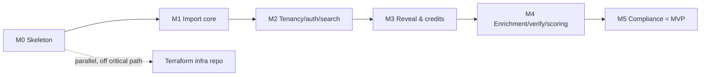

# 14 — Phase 1 Execution Plan (MVP)

> The build plan that turns the locked design into a runnable app. **Phase 1** bundles the **M0**
> foundation and the **M1–M5** MVP thin slice ([10](./10-roadmap.md)). This doc is an **execution
> overlay** — it *sequences* the existing design (scaffold order, per-milestone build breakdown, DoD
> verification, critical path, risk call-outs); it introduces **no new milestone scope** and defers to
> [05 §21](./05-features-modules.md#21-feature--milestone-matrix) + [10](./10-roadmap.md) for *what*
> lands *when*, and to [01](./01-tech-stack.md)/[02](./02-architecture.md)/[03](./03-database-design.md)
> for *how* the system is built.

## 1. Scope & phase decisions

**Phase 1 = M0 foundation + M1–M5 MVP.** At the end of Phase 1 a customer can self-serve the whole core
loop — sign up → import → masked search → reveal (credits + Stripe) → export — hardened with enrichment/
scoring (M4) and GDPR/CCPA compliance/DSAR (M5). The milestone definitions and DoDs are unchanged from
[10](./10-roadmap.md); this doc only sequences them. The new post-MVP tracks (**M12** scale/SRE, **M13**
data-intelligence, **M14** AI, **M15** departments, **M16** automation/integrations — [10](./10-roadmap.md))
are **out of Phase-1 scope** and do not alter the M0–M5 plan below.

Two phase-level decisions (logged in [00 §7](./00-overview.md#7-decision-log)):

- **Local-first infrastructure.** Build the monorepo + `docker-compose` local stack + GitHub Actions CI
  now; **author** the Terraform modules and keep `terraform plan` clean for `dev`, but **defer standing
  up a live AWS environment** to a later phase. Local docker-compose is the dev/CI target; AWS is never
  on the application critical path this phase. This is consistent with — not a reversal of — the
  AWS-native self-hosted stack ([ADR-0010](./decisions/ADR-0010-aws-native-self-hosted-stack.md)); it
  is a *phasing* choice about **when** the live environment is provisioned.
- **One migration per milestone** (`0000`–`0005`) so each milestone owns its DDL, is independently
  demoable, and the schema history maps to the roadmap.

**Brand.** The geometric wolf-head mark (`logo/LeadWolf_icon.png`) is the monochrome logo — app logo,
favicon, and auth/empty-state branding — per the brand system ([brand-identity.md](./brand-identity.md))
and the light/monochrome design tokens ([04 §1–§2](./04-ui-ux-design.md)): the single **Wolf-Indigo**
accent (`#4F46E5`) used sparingly, **Geist/Inter** type, **Lucide** icons. Producing the logo/favicon/
brand-kit assets is the M0 `packages/ui` task (brand-identity §12 open item).

## 2. Cross-cutting foundations (stand up in M0, reuse everywhere)

| Concern | Home | What |
|---|---|---|
| **Config & env** | `packages/config` | One zod `appEnvSchema` validated at boot (fail-fast); per-app slices extend a `baseEnv` (DB/Redis/Typesense, KMS key alias, S3/SES/LocalStack endpoints, session secret, **HMAC blind-index key**, Stripe keys + webhook secret). Exports the shared `tsconfig`/`biome` presets; `.env.example` documents shape only. |
| **Shared vocabulary** | `packages/types` | The `z.enum`s mirrored from [03](./03-database-design.md)/[08](./08-compliance.md) (`reveal_type`, `source_name`, `email_status`, `phone_status`, workspace roles, audit actions, suppression scope, `signal_type`, DSAR type), DTOs, and RFC-9457 error classes (`InsufficientCreditsError` 402, `SuppressedError` 403, …). |
| **Audit** | `packages/core` | `writeAudit(tx, …)` called **inside the same tx** as each mutation; `action` constrained to the closed enum ([03 §7](./03-database-design.md), [08 §5](./08-compliance.md)). |
| **Observability** | `packages/observability` | Logger keyed by correlation id from AsyncLocalStorage; console/no-op backend for local + CI (no live AWS dependency). |
| **Testing** | (all) | Bun unit; **Testcontainers** integration (real PG16 + Redis + Typesense, real migrations + RLS — the workhorse for reveal/RLS/dedup/DSAR proofs); **provider contract tests on recorded cassettes** (no live spend); Stripe CLI fixture replays; **Playwright** e2e vs docker-compose. |
| **Seed** | `packages/db` | `db:seed` runs the *real* `provision_new_signup`; creates two tenants/workspaces for isolation demos + dedup fixtures. |

Each foundation is *placed* per the on-disk conventions in [16 — Code Organization](./16-code-organization.md)
(config in [16 §10](./16-code-organization.md#10-config--secrets), testing layout in
[16 §9](./16-code-organization.md#9-testing-layout)).

## 3. Milestone build sequence

Scaffold order is **dependency-first**: `config` + `types` → `db` → `core` → `auth`/`search`/stub
packages → `apps/api` + `apps/workers` → `apps/web` + `apps/admin`. Monorepo + package layout per
[01 §5](./01-tech-stack.md) / [02](./02-architecture.md); the in-disk layout *inside* each app/package
(the dependency graph, barrels, naming) follows [16 — Code Organization](./16-code-organization.md).

### 3.1 M0 — Skeleton

- **Tooling & local stack:** Bun workspaces + Turborepo + Biome + strict TS; `docker-compose` with
  `postgres:16` (extensions `pgcrypto`/`citext`/`pg_trgm`/`pg_uuidv7` + the two DB roles), `redis:7`,
  `typesense`, `localstack` (S3+SES+KMS), `mailhog`.
- **Migration `0000_init`:** extensions; the two roles; **tenancy + auth tables only**
  (`tenants`, `users`, `workspaces`, `workspace_members`, `user_sessions`, `user_oauth_accounts`,
  `user_mfa`, `user_password_resets`, `tenant_sso_configs`); `updated_at` trigger fn;
  `provision_new_signup()`. RLS policy SQL as raw SQL in `packages/db/src/rls/*.sql`.
- **The two DB roles:** `leadwolf_app` (**non-`BYPASSRLS`**; all customer api/workers; `withWorkspaceTx`
  sets `SET LOCAL` GUCs per tx) and `leadwolf_admin` (`BYPASSRLS`, distinct secret — wired to nothing
  until M5) ([03 §9](./03-database-design.md#9-row-level-security),
  [ADR-0006](./decisions/ADR-0006-per-workspace-multitenant-model.md)).
- **`packages/core`:** `requestContext.ts` (AsyncLocalStorage) + `withWorkspaceTx.ts` (the RLS contract)
  + audit writer. **`packages/auth`:** Lucia adapter over `user_sessions`; Argon2id + session
  create/validate/rotate; OAuth/TOTP/SAML seams stubbed. **`packages/ui`:** Tailwind v4 preset +
  `tokens.css` ([04 §2](./04-ui-ux-design.md), [brand-identity §7](./brand-identity.md)) + wolf-head
  logo/favicon/brand kit. **`packages/search`:**
  `SearchPort` + Typesense impl + a **Postgres fallback impl** so dev/CI never depend on CDC
  ([ADR-0002](./decisions/ADR-0002-search-postgres-then-engine.md)).
- **Apps:** `apps/api` (`/health`; the uniform middleware chain `authn → tenancy → setGuc → rbac →
  entitlement → audit → error` as pass-throughs; tRPC + REST/OpenAPI); `apps/workers` (BullMQ, one
  image, queue-typed entry points + DLQ); `apps/web` (Next.js 15 page hitting `/health`); `apps/admin`
  (separate skeleton, stub staff-auth, no privileged role yet).
- **CI + infra:** GitHub Actions `lint → typecheck → test (Testcontainers) → build`; Terraform modules
  **authored, plan-clean, not applied**.
- **DoD:** `bun run dev` brings up the local stack; `/health` green; `db:migrate` + `db:seed` succeed;
  `bun run build` clean; CI green; `terraform plan` clean for `dev`.

### 3.2 M1 — Import & contacts core *(load-bearing)*

- **Migration `0001_data_core`:** `accounts`, `contacts` (+ `email_enc`/`email_blind_index`/`email_domain`/
  `email_status`, `is_revealed`/`revealed_*` + CHECKs), `source_imports` (`raw_data jsonb`,
  `content_hash`), the **three dedup partial-unique indexes** `(workspace_id, email_blind_index)` /
  `(workspace_id, linkedin_public_id)` / `(workspace_id, sales_nav_lead_id)`; monthly partitions on
  `source_imports`; RLS ([03 §5](./03-database-design.md)).
- **`packages/core`:** `dedup/normalize.ts` (normalize **before** hashing), `dedup/blindIndex.ts`
  (`HMAC-SHA256(normalized email, config key)`), `dedup/encryptPii.ts` (KMS envelope), `import/columnMap.ts`,
  and the pipeline `import/runImport.ts` (parse → map → normalize → blind index + `content_hash` →
  per-workspace dedup upsert `ON CONFLICT … DO UPDATE` → always append one `source_imports` row → tally
  new-vs-matched, in `withWorkspaceTx()`). **Worker** `imports`. **UI:** import wizard drawer + history.
- **DoD:** import the dupes fixture into workspace A → one contact per identity, each with ≥1
  `source_imports` row, summary matches known dupes; the same payload into workspace B → a separate copy,
  A untouched; re-run into A → idempotent.

### 3.3 M2 — Tenancy, auth & search

- **Migration `0002_auth_search_app`:** `api_keys` (hashed + scoped), `lists`/`list_members`/
  `saved_searches` + RLS; confirm `provision_new_signup()` (tenant → owner user → default workspace →
  owner membership → audit) in one tx.
- **`packages/auth` (full):** Argon2id `password.ts`; `session.ts` (create/validate/**rotate**);
  `oauth.ts` (arctic Google/Microsoft); `mfa.ts` (TOTP + backup codes); `passwordReset.ts`; `saml.ts`
  seam; `signupGuards.ts` (disposable-domain + velocity). **API middleware filled in** (tenant/workspace
  resolved from session/`X-Workspace-Id` or key→workspace, **never from body**). **`packages/search`:**
  Typesense collections carrying **non-PII facets only**; `searchSync` worker (Aurora logical-replication
  CDC → Typesense, lag-monitored); dev/CI use the Postgres fallback `SearchPort`.
- **UI (first real surfaces):** the app shell (sidebar + 6-destination rail + workspace switcher + top
  bar) and the Prospect Search & Results page with masked rows ([04 §5](./04-ui-ux-design.md),
  [11 §4.2](./11-information-architecture.md)); Settings/Admin shells.
- **DoD:** sign up → provision → login + MFA → masked search; **DB-layer isolation proof** (as
  `leadwolf_app`: GUC=A can't see B; foreign-`workspace_id` write denied; unset GUC → zero rows,
  fail-closed); auth-security gates (Argon2id, session rotation, one-time reset token, velocity +
  disposable-domain, hashed+scoped `api_keys`).

### 3.4 M3 — Reveal & credits *(money loop)*

- **Migration `0003_billing_reveal`:** `contact_reveals` (**unique `(workspace_id, contact_id,
  reveal_type)`**; partitioned; RLS) + `AFTER INSERT` ownership trigger (first-wins, idempotent, **no
  charge in trigger**); `stripe_customers`; `purchases` (`stripe_event_id` **unique**);
  `suppression_list`; idempotency-key store.
- **`packages/core`:** `suppression/assertNotSuppressed.ts` (in-tx, unbypassable) and the load-bearing
  `reveal/revealContact.ts` implementing the [07 §3](./07-billing-credits.md) transaction exactly
  (suppression gate → `INSERT … ON CONFLICT DO NOTHING` → free if owned → else `SELECT
  reveal_credit_balance … FOR UPDATE`, decrement under `CHECK >= 0`, else `INSUFFICIENT_CREDITS`) — cost
  injected from `packages/config` ([07 §1](./07-billing-credits.md)), **never hardcoded**. Stripe
  `grantFromStripe.ts` (idempotent on `stripe_event_id`) + `abuseGate.ts`; `idempotency` middleware;
  `export/createExport.ts` (owned fields, suppression-checked, S3 signed URL).
- **UI:** reveal confirmation shows cost + post-reveal balance before confirm; bulk reveal; Home widgets;
  live credit pill; Settings ▸ Billing.
- **DoD:** top up via Stripe CLI; **double webhook grants once**; reveal in A charged once / free
  re-reveal / charged again in B; **N concurrent reveals never double-charge or overdraw**; below-balance
  → 402 with balance unchanged; suppressed → 403 + `reveal.blocked` audited even with credits.

### 3.5 M4 — Enrichment, verification & scoring

- **Migration `0004_intel_enrichment`:** `scores` (append-per-rescore; partitioned; RLS) + `AFTER INSERT
  ON scores` trigger syncing `contacts.priority_score`; `intent_signals`; `provider_calls`
  (`request_hash` unique, `cost_micros`, `cache_hit`).
- **`packages/integrations`:** `EnrichmentProvider` contract + `apollo`/`zoominfo`/`clearbit` adapters,
  cache-first, Redis rate limits, circuit breakers, cost budgets, `waterfall.ts` ([06](./06-enrichment-engine.md)).
  **Verify-on-reveal** (`verifyEmail` → `email_status`; `validatePhone` → `phone_status`) **must not
  lengthen the `FOR UPDATE` window**. `scoring/computeScore.ts` **appends** a `scores` row (lead score
  stays distinct from `email_status`). Workers: `enrichment`, `scoring`.
- **DoD:** enrich a thin contact → fields land per-workspace + `source_imports` row + recorded
  `cost_micros`; repeat → cache hit; reveal still charges exactly once; `invalid` not charged; a re-score
  appends `scores` and `priority_score` reflects the new composite; provider contract tests on cassettes
  (no live spend).

### 3.6 M5 — Compliance hardening = MVP complete

- **Migration `0005_compliance`:** `consent_records`; `dsar_requests`; finalize `audit_log` (append-only
  — revoke UPDATE/DELETE at the role level); retention partition-aging.
- **`packages/core/src/dsar`:** `findCopies.ts` (enumerate every per-workspace copy by blind index /
  `linkedin_public_id` / `sales_nav_lead_id` / phone — runs under `leadwolf_admin`, audited),
  `assembleAccessReport.ts`, and `deleteFanout.ts` (idempotent, verifiable: tombstone + null PII across
  every copy + `source_imports` + `contact_reveals` + `activities` + caches → global suppression →
  per-copy audit → verification scan gates `completed`) ([08 §4](./08-compliance.md)). Consent/retention
  helpers + new worker entry points. **UI:** suppression management, DSAR intake + status, consent
  records, audit-log viewer.
- **DoD:** Playwright e2e of the whole loop; **DSAR delete fan-out proof** (multi-workspace
  Testcontainers: zero residual PII across all copies + dependents + caches, global suppression added,
  per-copy audit, verification scan passes before `completed`); a suppressed contact never reveals even
  with credits; `audit_log` rejects UPDATE/DELETE.

## 4. Critical path & parallelism

- **Hard blockers:** `config`+`types` block everything; the first migration + the two roles +
  `withWorkspaceTx` block M1 inserts and M2 RLS; M1 `contacts`/`source_imports` block M3 reveal and M4
  enrichment; M2 tenancy context blocks M3 and the M5 cross-RLS DSAR job; the M3 suppression gate is
  re-asserted at M5.
- **Parallelizable:** the Terraform infra repo (dev is docker-compose); within M2, UI shell vs search/CDC
  vs RLS hardening; provider adapters contract-tested on fixtures during M3 ahead of M4 wiring; the Stripe
  top-up path vs the reveal tx; `apps/admin` ops basics across M3–M5 without blocking the MVP.

## 5. Sequencing risks & call-outs

These elaborate the [10 risk register](./10-roadmap.md#risk-register-carried-across-milestones) at the
*build* level (no new risks introduced):

1. **RLS + RDS-Proxy GUC reset (H9, [risk 5])** — GUCs are not sticky under transaction pooling;
   `SET LOCAL` inside *every* tx. Add a Testcontainers test that reuses a connection across two
   workspace GUCs and proves no leakage; `leadwolf_app` is non-`BYPASSRLS` so an unset GUC yields zero
   rows (fail-closed). *Pull into M0.*
2. **Blind-index dedup (H4, [risk 1])** — normalize before HMAC; the HMAC key is stable + secret
   (rotating it breaks dedup); uniqueness is `(workspace_id, …)`, never global.
3. **Reveal concurrency / double-charge (H2, [risk 2])** — `FOR UPDATE` + `CHECK >= 0` + unique
   `(workspace_id, contact_id, reveal_type)` + `Idempotency-Key` are **all** required
   ([ADR-0007](./decisions/ADR-0007-per-workspace-reveal-and-credit-counter.md)); write the N-parallel
   test before the happy path; keep the tx tiny (no provider calls inside the lock window).
4. **CDC search drift (H1 search; [risk 8])** — Postgres `SearchPort` fallback in M0 so dev/CI never
   depend on CDC; index **non-PII facets only** (a test must reject PII fields).
5. **DSAR fan-out completeness (H6, [risk 3])** — no golden record means a missed copy is legal
   exposure; `deleteFanout` is idempotent, re-runnable, verification-gated; runs under `leadwolf_admin`.
6. **Privileged-role blast radius (H12, [risk 11])** — `leadwolf_admin` authored in M0 but wired to
   nothing until M5 / `apps/admin`; distinct secret; every use audited.
7. **Pricing is config, never code** — reveal cost/pack/bonus are placeholders
   ([07 §1](./07-billing-credits.md)) injected from `packages/config`; a hardcoded constant is a defect.

## Links
- **Links to:** [10](./10-roadmap.md) (milestones + risk register), [05 §21](./05-features-modules.md#21-feature--milestone-matrix)
  (feature↔milestone matrix), [01](./01-tech-stack.md) (stack + repos), [02](./02-architecture.md)
  (services + tenancy), [03](./03-database-design.md) (schema, RLS, partitions), [04](./04-ui-ux-design.md)
  (design tokens), [brand-identity.md](./brand-identity.md) (logo/accent/type),
  [07 §3](./07-billing-credits.md) (reveal tx), [08 §4](./08-compliance.md) (DSAR),
  [ADR-0002](./decisions/ADR-0002-search-postgres-then-engine.md),
  [ADR-0006](./decisions/ADR-0006-per-workspace-multitenant-model.md),
  [ADR-0007](./decisions/ADR-0007-per-workspace-reveal-and-credit-counter.md),
  [ADR-0010](./decisions/ADR-0010-aws-native-self-hosted-stack.md).
- **Linked from:** [README](./README.md) (index), [00 §7](./00-overview.md#7-decision-log) (decision log),
  [10](./10-roadmap.md) (execution-sequencing pointer).

## Open questions
1. **Team size / pacing** — durations and parallel-track staffing are deferred (mirrors
   [10 sequencing notes](./10-roadmap.md)); the *order* and DoD gates are the commitment.
2. **Live-AWS cutover** — the milestone at which the deferred AWS `dev`/`staging` environments are first
   applied (Terraform is authored + plan-clean from M0) is left to a later phase.
