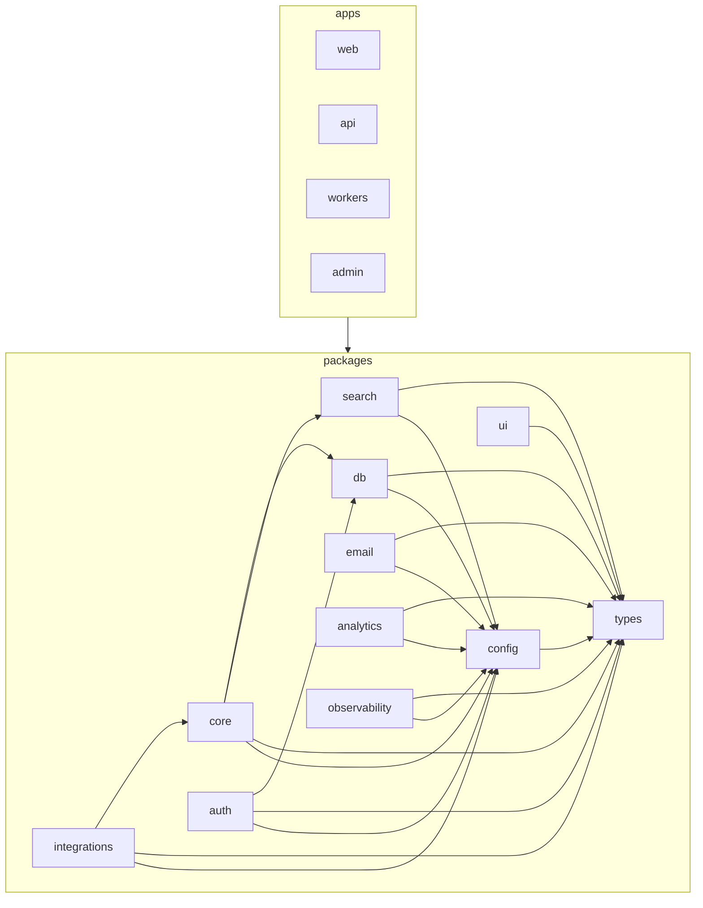

# 16 — Code Organization

> How TruePoint's source code is laid out **on disk** and what may import what. This is the operational
> contract a developer (or an AI assistant) follows when writing the first — and every — line of code.
> It details the structure that [02 §1](./02-architecture.md) only sketches ("feature-sliced,
> lazy-loaded"), under the locked Turborepo monorepo + per-workspace model
> ([ADR-0010](./decisions/ADR-0010-aws-native-self-hosted-stack.md),
> [ADR-0006](./decisions/ADR-0006-per-workspace-multitenant-model.md)).

## 1. Principles

The codebase is **feature-based, layered, typed, and small-file**. The goal is a tree that is easy to
extend, low-error, and that an AI assistant can hold in context:

1. **Organize by feature/domain, not by file type.** No top-level `controllers/`, `models/`, `views/`
   buckets — group code by what it *does* (reveal, dedup, billing), not by what it *is*.
2. **Separate the layers** inside each unit: presentation (UI) · business logic (services) · data
   access (repositories). Logic never lives in a component or an HTTP handler.
3. **One job per file/module** (single responsibility).
4. **Boundaries are mechanical, not cultural.** The import rules in §5 are enforced by lint/CI, not by
   reviewer goodwill.
5. **Each unit exposes a public interface** via a typed `index.ts` barrel; internals stay hidden.
6. **Type everything** — strict TypeScript, no `any`; domain types come from `packages/types`.
7. **No secrets in code** — env only, via `packages/config` (§10).
8. **Small files** — soft cap ~200 lines, hard cap ~300; past that, split by responsibility.
9. **Consistent, descriptive naming** across every app and package (§8).

These elaborate the modular invariants already stated in [02 §1](./02-architecture.md); the generic,
stack-agnostic version of the same rules ships as the `scalable-architecture` skill (outside the
planning corpus) — this doc is the TruePoint-specific application.

## 2. The two trees (recap)

The monorepo layout (`apps/*` deployables, `packages/*` libraries) is defined in
[02 §1](./02-architecture.md) and [01 §5](./01-tech-stack.md); the **scaffold order** (`config` +
`types` → `db` → `core` → `auth`/`search` → `apps/api` + `apps/workers` → `apps/web` + `apps/admin`) is
in [14 §3](./14-phase-1-execution.md). This doc specifies what goes **inside** each `app` and `package`,
and the dependency rules between them.

## 3. Inside an app

Apps are **thin**. They adapt a transport (HTTP, a queue, the browser) to domain logic that lives in
`packages/*`. An app is feature-sliced; a feature slice in an app is an *adapter*, not the home of
business rules.

### 3.1 `apps/api` (Hono on Bun)

```
apps/api/src/
  middleware/        # the uniform chain: authn → tenancy → setGuc → rbac → entitlement → audit → error
  features/<domain>/ # contacts, reveal, billing, search, lists, auth, ... (one slice per resource group)
    routes.ts        # HTTP wiring ONLY: validate input → call a packages/core service → shape response
    schema.ts        # zod-openapi request/response (or re-use packages/types)
    index.ts         # exports the feature's router
  app.ts             # compose feature routers + middleware into the server
  server.ts          # entry / listen
```
`routes.ts` is the **only** place that knows about `req`/`res`/HTTP status. It calls a `packages/core`
service and never touches the DB directly. The reveal route, for example, parses the `Idempotency-Key`
and body, then calls `core`'s reveal service ([02 §3.1](./02-architecture.md), [09 §3](./09-api-design.md)).

### 3.2 `apps/workers` (Bun + BullMQ)

```
apps/workers/src/
  queues/<queue>.ts  # one processor per queue: enrichment, scoring, imports, crm-sync,
                     #   outreach, webhook, search-sync (queue names per 02 §2)
  register.ts        # wire processors to queues; inject concrete adapters into core (composition root)
  index.ts           # entry
```
A processor validates the typed job payload, then calls the same `packages/core` services `apps/api`
uses — one implementation, two transports.

### 3.3 `apps/web` (Next.js 15, App Router) — feature-slice internals

This is the detail [02 §1](./02-architecture.md) defers. `app/` holds **routing only**; real code lives
in feature slices that map to the **6 destinations** ([11 §2](./11-information-architecture.md)).

```
apps/web/src/
  app/                 # Next.js routes (thin): segments per destination, layout.tsx, route.ts handlers
  features/<domain>/   # home, prospect, sequences, inbox, reports, settings, admin-shell, ...
    components/        # presentation only — no fetch/business logic
    hooks/             # TanStack Query hooks calling the api client; local view state
    api.ts             # typed client calls to apps/api (tRPC/REST) — the slice's data access
    store.ts           # Zustand slice (only if the feature needs cross-component client state)
    types.ts           # view-model types (domain types come from packages/types)
    index.ts           # public surface (what the app shell / routes may import)
  shared/              # cross-feature web-only helpers (layout primitives, formatting)
  lib/                 # tRPC/query client, auth client, env access (re-exported from packages/config)
```
- A route file is a handful of lines: it renders a feature's public component. Slices are
  **lazy-loaded** so the shell stays light.
- Shared UI primitives come from `packages/ui`; shared domain types from `packages/types`. A web
  feature **never** imports another web feature's internals (§5).

### 3.4 `apps/admin`

A **separate** frontend + `/admin/*` API (staff-only, privileged role —
[13](./13-platform-admin.md), [ADR-0011](./decisions/ADR-0011-platform-admin-and-privileged-access.md)).
Same feature-slice discipline as `web`/`api`; it is *never* the customer app behind a flag.

## 4. Inside a package

Packages are **side-effect-free libraries**, each exported through one typed `index.ts`
([02 §1](./02-architecture.md)). Each is internally organized by domain, same rules one level down.

| Package | Internal layout | Holds |
|---|---|---|
| `types` | `src/<area>.ts` + `index.ts` | Zod schemas + inferred types, DTOs, RFC-9457 error classes. Leaf. |
| `config` | `src/env.ts`, `src/presets/` | `appEnvSchema` (Zod) + `baseEnv` slices; shared tsconfig/biome presets. |
| `db` | `src/schema/`, `src/migrations/`, `src/rls/*.sql`, `src/repositories/`, `index.ts` | Drizzle schema, migrations, RLS SQL, repositories (the only data-access layer). |
| `core` | `src/<domain>/` (`reveal/`, `dedup/`, `scoring/`, `entitlements/`, `import/`, `suppression/`, `audit/`, `outreach/`), `src/ports/`, `requestContext.ts`, `withWorkspaceTx.ts`, `index.ts` | Domain logic + the cross-cutting tenancy/audit primitives. Declares provider **ports** (interfaces). |
| `auth` | `src/{password,session,oauth,mfa,passwordReset,saml,signupGuards}.ts`, `index.ts` | Self-built auth over `user_sessions` (Lucia + arctic + TOTP + node-saml). |
| `integrations` | `src/<provider>/` (`salesforce/`, `hubspot/`, `apollo/`, `zoominfo/`, `pipedrive/`, `linkedin/`), each `{client,mapper,types,index}.ts`; `index.ts` | One folder per provider; each implements a `core` port and maps payloads into `types`. |
| `search` | `src/SearchPort.ts`, `src/typesense/`, `src/postgres/` (fallback), `index.ts` | `SearchPort` interface + Typesense impl + PG fallback ([ADR-0002](./decisions/ADR-0002-search-postgres-then-engine.md)). |
| `email` | `src/templates/` (React Email), `src/send.ts`, `index.ts` | Templates + SES send + SNS→SQS feedback. |
| `ui` | `src/components/`, `src/tokens.css`, `index.ts` | shadcn primitives + theme tokens. React/styling only. |
| `analytics` | `src/capture.ts`, `index.ts` | PostHog event capture. |
| `observability` | `src/{logger,tracing,metrics}.ts`, `index.ts` | X-Ray/CloudWatch/GlitchTip; no-op backend for local/CI. |

`core` is split **by domain**, not by layer — `reveal/` contains its service and helpers together; the
reveal transaction itself is the load-bearing money path (H1, [02 §3.1](./02-architecture.md)).

## 5. Dependency graph (what may import what)

**Invariants (enforced in CI):**
- `apps/*` may depend on `packages/*` but **never on each other**.
- `packages/*` are imported **only through their public `index.ts`** — no deep imports past the barrel.
- No import cycles between packages.
- The graph is acyclic via the **port pattern**: `core` declares interfaces (`core/ports/`,
  `SearchPort`); adapters (`integrations`, `search/typesense`) implement them; the **app is the
  composition root** that injects the concrete adapter. So orchestration depends on an interface, never
  the other way into a cycle.



| Package | May import |
|---|---|
| `types` | (nothing internal — leaf) |
| `config` | `types` |
| `db` | `types`, `config` |
| `search` | `types`, `config` |
| `email` | `types`, `config` |
| `ui` | `types` (+ React/styling only) |
| `analytics` / `observability` | `types`, `config` |
| `auth` | `db`, `types`, `config` |
| `core` | `db`, `search`, `types`, `config` (declares ports; does **not** import `integrations`) |
| `integrations` | `core` (port interface), `types`, `config` |
| `apps/*` | any `packages/*` (compose them); **never** another app |

## 6. Public interface / barrel strategy

- Every package and every feature slice exposes exactly one entry: its `index.ts`. It re-exports **only**
  the public surface (a few services, public types, a router/component) — barrels hold re-exports, no
  logic, named exports preferred.
- A package's `package.json` `exports`/`main` points at that `index.ts`. Importing
  `@leadwolf/core/src/reveal/...` directly is a lint error; import `@leadwolf/core` and use what it
  exports.
- Anything not re-exported is **internal** and may change freely without a cross-package ripple.

## 7. Separation of concerns (the request path)

```
apps/api routes.ts  →  packages/core service  →  packages/db repository  →  Aurora
   (HTTP only)          (domain rules)            (data access only)
```
- The **HTTP layer** (`apps/api`) knows about requests, status codes, idempotency headers, and the
  middleware chain — and nothing about domain internals.
- The **domain layer** (`packages/core`) knows the rules (reveal, dedup, scoring, entitlements) and the
  tenancy contract (`withWorkspaceTx`); it knows nothing about HTTP. `apps/workers` reuse it unchanged.
- The **data layer** (`packages/db` repositories) is the only code that writes SQL/Drizzle queries and
  applies RLS GUCs; it returns typed domain objects, not raw rows.
- **Validation** happens at the edge (Zod via tRPC/zod-openapi) **and** at the service boundary for
  invariants. Input is never trusted from the request body (e.g. workspace id comes from the session/
  key, not the payload — [14 §3.3](./14-phase-1-execution.md)).

## 8. Naming & file-size

| Thing | Convention | Example |
|---|---|---|
| Package | `@leadwolf/<name>`, dir `kebab-case` | `@leadwolf/core` |
| Feature/domain folder | `kebab-case`, singular | `features/reveal/`, `core/dedup/` |
| React component file | `PascalCase.tsx`, one per file | `RevealButton.tsx` |
| Hook | `useThing.ts` | `useContactSearch.ts` |
| Service / domain fn file | `camelCase.ts`, named for its export | `revealContact.ts` |
| Repository | `<entity>Repository.ts` | `contactRepository.ts` |
| Types | from `packages/types`; local view types in `types.ts` | — |
| Test | `<name>.test.ts`, co-located (§9) | `revealContact.test.ts` |
| SQL/RLS | `packages/db/src/rls/<table>.sql` | `contacts.sql` |

File-size targets: soft ~200, hard ~300 lines; one React component per file; split a service when it
grows past one responsibility. Small files keep each unit fully loadable by an AI assistant.

## 9. Testing layout

Per [14 §2](./14-phase-1-execution.md):

- **Unit tests are co-located** with the code: `packages/core/src/reveal/revealContact.test.ts`. Run
  with `bun test`. Test services/repositories (the logic), not UI pixels.
- **Integration tests** use **Testcontainers** (real PG16 + Redis + Typesense, real migrations + RLS) —
  the workhorse for reveal / RLS / dedup / DSAR proofs. They live beside the package they exercise (e.g.
  `packages/db/test/` or `*.itest.ts`) and are gated behind the integration test task.
- **Provider contract tests** run against **recorded cassettes** (no live spend) in
  `packages/integrations/<provider>/__cassettes__/`.
- **E2E** uses **Playwright** against `docker-compose`, in a top-level `e2e/` package.

## 10. Config & secrets

- `packages/config` owns env: one Zod `appEnvSchema` validated **at boot** (fail-fast); per-app slices
  extend a `baseEnv` (DB/Redis/Typesense, KMS key alias, S3/SES/LocalStack endpoints, session secret,
  **HMAC blind-index key**, Stripe keys + webhook secret) — see [14 §2](./14-phase-1-execution.md).
- Code reads config **only** through `packages/config`'s typed export — never scattered `process.env.X`.
- `.env.example` documents the **shape only** (names + placeholders, no values). Real secrets live in
  Secrets Manager / Parameter Store and never enter the repo or an image ([02 §8](./02-architecture.md)).

## 11. AI / LLM isolation

The AI features ([23](./23-ai-intelligence-layer.md)) call an LLM provider — **now decided: Anthropic
Claude behind an `AiPort`** ([ADR-0023](./decisions/ADR-0023-ai-provider-and-intelligence-architecture.md),
resolving [00 §8 #8](./00-overview.md#8-open-questions-tracked-resolved-during-doc-review-or-early-milestones)).
Isolate it so it stays testable and swappable:

- The provider sits **behind a `core` port** (`core/ports/AiPort`), implemented by a dedicated
  **`packages/ai`** adapter (a model router over Opus 4.8 / Sonnet 4.6 / Haiku 4.5) and injected at the
  app composition root — same pattern as `SearchPort`.
- **Prompts are versioned artifacts**, not inline string literals: keep them in files/constants under
  the owning domain (e.g. `core/<domain>/prompts/`) with a version tag, so changes are reviewable.
- Tests run against **mocked/recorded** provider responses (cassettes, like enrichment providers) — no
  live spend, deterministic CI. An **eval/safety harness** (`ai_evals`) gates prompt/model changes
  ([23 §6](./23-ai-intelligence-layer.md)).
- **New domains** keep the same boundaries: `packages/ai` (AI), `packages/automation` (the rules engine,
  [27](./27-workflow-automation-engine.md)), `packages/realtime` (SSE + outbox relay,
  [20](./20-event-driven-realtime-backbone.md)), `packages/dataops` (freshness/ER jobs,
  [22](./22-data-quality-freshness-lifecycle.md)); **departments/teams** are a `core` domain (no new app)
  with persona config in `apps/web` ([25](./25-departments-teams-workspaces.md)).

## Links
- **Links to:** [00 §7/§8](./00-overview.md), [01 §5](./01-tech-stack.md),
  [02 §1/§5](./02-architecture.md), [11 §2](./11-information-architecture.md),
  [13](./13-platform-admin.md), [14 §2/§3](./14-phase-1-execution.md),
  [ADR-0002](./decisions/ADR-0002-search-postgres-then-engine.md),
  [ADR-0006](./decisions/ADR-0006-per-workspace-multitenant-model.md),
  [ADR-0010](./decisions/ADR-0010-aws-native-self-hosted-stack.md),
  [ADR-0011](./decisions/ADR-0011-platform-admin-and-privileged-access.md).
- **Linked from:** [README](./README.md), [00 §7](./00-overview.md), [02 §1/§5](./02-architecture.md),
  [14 §2/§3](./14-phase-1-execution.md).

## Open questions
1. **`@leadwolf/*` package scope name** — confirm the npm scope used in `package.json`/import paths
   (placeholder `@leadwolf` used here).
2. ~~**AI provider & home**~~ — **Resolved:** Anthropic Claude behind `AiPort` in a dedicated
   **`packages/ai`** ([ADR-0023](./decisions/ADR-0023-ai-provider-and-intelligence-architecture.md), [23](./23-ai-intelligence-layer.md)).
