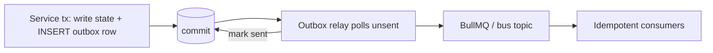

# 20 — Event-Driven & Real-Time Backbone

> The reliable async + real-time substrate: domain events, a **transactional outbox**, queue topology
> with DLQ/retry, an idempotency contract, backpressure, CDC projections, and an **SSE/WebSocket** live
> gateway. Formalizes the seams in [02 §3](./02-architecture.md);
> [ADR-0027](./decisions/ADR-0027-real-time-delivery-and-event-backbone.md) locks the design.

## 1. Why a backbone

The monolith stays simple synchronously and pushes everything else onto events: search indexing, scoring,
enrichment, automation (`27`), webhooks (`26`), AI indexing (`23`), and live UI. The contract is **"DB
commit ⇒ event published, exactly the consumers that should react do, at-least-once, idempotently."**

## 2. Domain events catalog (versioned)

| Event | Emitted when | Key consumers |
|---|---|---|
| `record.created` / `record.updated` | overlay contact/account written | search-sync, scoring, automation, AI index |
| `reveal.completed` | reveal tx commits (H1) | activity, automation, webhooks, cache invalidation |
| `score.updated` | a new `scores` row lands | Home/Reports, automation, alerts |
| `signal.received` | intent signal ingested | scoring, automation (signal-to-play) |
| `outreach.status_changed` | send/open/click/reply/bounce | inbox, automation, webhooks, suppression (bounce) |
| `import.completed` / `export.completed` | a bulk import/export job finishes | dedup/ER, Data Health, notifications, download-ready (export) |
| `import.progress` / `export.progress` | a bulk job crosses a progress checkpoint (**best-effort**) | live UI progress bar only |
| `records.bulk_changed` | a bulk import/export job commits a row-range (§10) | search-sync, scoring, automation, AI index (expanded in bounded batches) |
| `verification.completed` | a `verification_jobs` run finishes (`22`) | Data Health, credit-back (H13) |

Events carry `event_id` (UUID v7), `tenant_id`, `workspace_id`, entity id(s), `version`, `occurred_at`.
They are the **single source of truth** for async consumers — no consumer reaches into another's tables.
**Two emission modes** exist: the default **per-record** mode above, and a **bulk** mode (§10) that
coalesces million-row jobs so they don't melt the outbox/relay or the index. **Progress events are
best-effort** (lossy, coalesced) — never a correctness source; the terminal `*.completed` event is the
durable signal consumers key off.

## 3. Transactional outbox

A writer appends an `outbox` row **in the same transaction** as the state change; a **relay** publishes it
and marks it sent. This guarantees commit⇒publish without distributed transactions and survives crashes
(at-least-once). `outbox` is month-partitioned and pruned after sent + retention.

## 4. Queue topology, retries & DLQ

- **Per-domain BullMQ queues** (one worker image, queue-typed processors — `02 §2`, `16 §3.2`): enrichment,
  scoring, imports, search-sync, outreach-delivery, webhook-delivery, automation, ai-index, verification.
- **Retries:** bounded with exponential backoff + jitter; poison messages → **dead-letter queue** with
  alerts (`19 §3`).
- **Priority:** money/real-time paths (reveal side-effects, automation reactions) outrank bulk
  (re-enrichment) so the freshness SLOs (`18 §2`) hold under load.

## 5. Idempotency contract

- Consumers are **idempotent** on `event_id` + natural keys (e.g. `(workspace_id, contact_id,
  reveal_type)`), reusing the money-path pattern (`H2`, [09 §5](./09-api-design.md)). Re-delivery is a
  no-op, not a double-effect.
- Actions with external side-effects (CRM push, webhook, send) carry an idempotency key so retries don't
  duplicate downstream.

## 6. Backpressure & flow control

- Each queue exposes **depth + age**; thresholds trigger worker autoscale, then **shedding/slowing of
  non-urgent producers** (defer bulk re-enrichment, batch search-sync) before SLOs break (`18 §9`).
- Producers respect per-workspace/tenant rate limits so one tenant can't swamp shared workers.

## 7. CDC projections

Aurora **logical replication** → search-sync worker → **Typesense** (overlay) / **OpenSearch** (global
master graph) / **ClickHouse** (analytics) within the search-sync SLO (`18 §2`). CDC builds **projections**
(read models); the **outbox** carries **semantics** (what happened, for whom) — they are complementary,
not redundant ([ADR-0021](./decisions/ADR-0021-global-master-graph-and-overlay.md), [ADR-0002](./decisions/ADR-0002-search-postgres-then-engine.md)).

## 8. Real-time delivery (live UI)

- An authenticated **SSE** stream per user/workspace (WebSocket where bidirectional) delivers live updates:
  search-sync ready, new inbox replies, score changes, notifications, automation/AI run status.
- Fan-out across stateless ECS instances via **Redis pub/sub** (`02 §3.4`); channels are **RLS + team
  visibility scoped** (`H18`) so a user only receives events for data they may see.
- Connection limits per task + horizontal scale; clients reconnect with last-event-id for gap-free resume.

## 9. Ordering & delivery guarantees

- **At-least-once**, **idempotent**, **per-entity ordering** (events for one entity processed in commit
  order via partition keys); **no global ordering** guarantee. Consumers tolerate out-of-order across
  entities. Exactly-once is achieved at the **effect** layer via idempotency, not the transport.

## 10. Bulk-emission mode (million-row import/export)

A bulk import/export is a **job** (`03` owns the job/staging tables; the pipeline lives in
[30](./30-bulk-import-export-pipeline.md), [ADR-0036](./decisions/ADR-0036-bulk-async-job-and-staging-pipeline.md)).
Emitting one `record.created` **per row** would write millions of `outbox` rows, flood the relay, and fan
out to every per-record consumer (search-sync, scoring, automation, AI index — §2) at once, melting the
outbox/relay and the index. Bulk jobs therefore switch the writer into **bulk-emission mode**:

- **Coalesced, not per-row.** The job commits rows in staged batches and emits **one
  `records.bulk_changed` event per committed row-range** (a **manifest**: `job_id`, `entity_type`,
  `row_range`/PK bounds or a staging-batch id, `change_kind`, count) — not one event per record. The
  outbox grows by **batches, not rows** (a million-row import emits ~ thousands of manifest rows, not a
  million), so the relay and queues stay bounded.
- **Consumers expand in bounded batches.** Each per-record consumer reads the manifest and **pulls the
  affected rows itself in bounded chunks** (keyset over the row-range), applying its normal idempotent
  per-entity logic. This keeps the at-least-once + idempotency contract (§5, §9) while moving the fan-out
  cost off the outbox/relay and under each consumer's own backpressure (§6).
- **Back-pressure on the indexing pipeline.** Bulk manifests enter search-sync/AI-index as **low-priority**
  work behind real-time traffic (§4 priority): a bulk import never starves reveal/automation reactions.
  Search-sync drains manifests at a rate that holds the CDC→index freshness SLO; if index lag rises, bulk
  expansion **slows/sheds first** (§6) — index throughput and that SLO are owned by
  [18 §2/§9](./18-scalability-performance.md) and [24 §1](./24-advanced-search-exploration-ux.md), not here.
- **Progress + completion.** The job emits coalesced **`import.progress`/`export.progress`** events
  (best-effort, for the live progress bar over SSE, §8) and a durable terminal
  **`import.completed`/`export.completed`** (export carries the signed download URL — `05 §12`, `18 §6`).
  Only the terminal event is a correctness source; progress is lossy by design.

### 10.1 Bulk reindex (custom-fields definition change)

When a `custom_field_definitions` change remaps search facets
([ADR-0028](./decisions/ADR-0028-record-customization-layer.md)), reindexing every affected
`contacts`/`accounts` row is itself a bulk operation. It runs as a **bulk reindex job** on the same
mechanism: emit a single job-level manifest over the affected entity scope (not one event per row),
which search-sync expands in **bounded, low-priority batches** under the §6 backpressure rules so a
large workspace's definition change can't melt the index or breach the freshness SLO ([18 §2](./18-scalability-performance.md),
[24 §1](./24-advanced-search-exploration-ux.md)). The job is tracked and observable like any other bulk
job (`03`, [30](./30-bulk-import-export-pipeline.md)); `19` alerts on reindex backlog.

## Links
- **Links to:** [02 §2/§3](./02-architecture.md), [03 §12](./03-database-design.md), [09 §5/§10](./09-api-design.md),
  [18 §2/§9](./18-scalability-performance.md), [19](./19-observability-reliability.md), [23](./23-ai-intelligence-layer.md),
  [24 §1](./24-advanced-search-exploration-ux.md), [26](./26-integrations-data-delivery.md), [27](./27-workflow-automation-engine.md),
  [30](./30-bulk-import-export-pipeline.md), [ADR-0027](./decisions/ADR-0027-real-time-delivery-and-event-backbone.md),
  [ADR-0028](./decisions/ADR-0028-record-customization-layer.md), [ADR-0036](./decisions/ADR-0036-bulk-async-job-and-staging-pipeline.md),
  [ADR-0021](./decisions/ADR-0021-global-master-graph-and-overlay.md)
- **Linked from:** [00 §7](./00-overview.md#7-decision-log), [02 §3](./02-architecture.md), [27](./27-workflow-automation-engine.md), README

## Open questions
1. Outbox relay mechanism: polling relay vs. Debezium-on-`outbox` vs. pg `LISTEN/NOTIFY` trigger.
2. SSE vs. WebSocket per surface; managed push (AWS IoT/AppSync) vs. self-hosted gateway.
3. When event volume justifies a log bus (Kafka/Kinesis) behind the same catalog (`ADR-0027` revisit).
4. Bulk-emission manifest granularity: row-range/PK bounds vs. staging-batch id, and the per-consumer
   expansion chunk size that holds the index freshness SLO under a million-row import (`30`, `ADR-0036`, `18 §2`).
