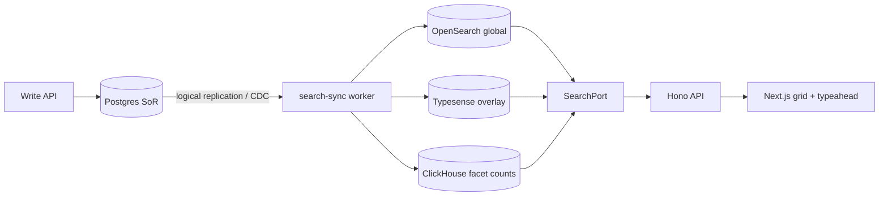

# 24 — Advanced Search & Exploration UX

> The Apollo/ZoomInfo/Lusha-grade exploration surface **in depth**: a faceted **filter rail** built from
> **search boxes that suggest real indexed values**, **query semantics** that understand abbreviations
> (type `CEO` → matches "Chief Executive Officer"), **instant** masked search over **billions** of records,
> **saved searches/views**, **dynamic segments**, a high-performance virtualized grid, and result→action
> flows. Deepens [04 §5](./04-ui-ux-design.md) / [05 §6/§8](./05-features-modules.md) / [11 §4.2](./11-information-architecture.md);
> runs on `SearchPort` (Typesense overlay + OpenSearch global, [ADR-0021](./decisions/ADR-0021-global-master-graph-and-overlay.md));
> the query-semantics + autocomplete architecture is fixed in [ADR-0035](./decisions/ADR-0035-search-query-and-filter-architecture.md).

> **How the big players do it (research baseline).** Apollo.io serves ~210M contacts / 35M companies with
> **Elasticsearch + Siren Federate**, complex queries finishing in **~1.2 s** and used by 100% of its base.
> ZoomInfo runs **Apache Solr** and drives its facet drill-downs through Solr's **JSON Facet API**. Lusha is
> not public; assume the same industry pattern. The common thread: a **Lucene-family search engine** (not the
> OLTP database) holding a **denormalized read model**, with faceting, autocomplete suggesters, and synonym
> analysis as first-class features. LeadWolf follows this pattern on **OpenSearch** (Elasticsearch family) +
> **ClickHouse** for facet counts. Sources are listed in [§13 References](#13-references).

## 1. Principles

- **Instant & masked.** Results stream as you filter; PII stays masked (`••••`) until a paid reveal
  (`H1`). Latency targets per [18 §2](./18-scalability-performance.md) and [ADR-0024](./decisions/ADR-0024-performance-slos-and-capacity-model.md).
- **Explorable.** Every facet shows live **counts**; refinement is one click; nothing requires a page hop
  (the single-page model, `11 §1`).
- **Search-box first.** High-cardinality facets (title, company, industry, technology, location, skills) are
  **type-to-search inputs** that suggest **real values from the index**, not scroll-forever checkbox lists.
- **Forgiving.** The user types how they think — `CEO`, `VP Eng`, `nyc`, `Saas` — and the query layer
  expands/normalizes to what's stored ("Chief Executive Officer", "VP of Engineering", "New York City",
  "SaaS"). The user never has to know the canonical form ([§4](#4-query-semantics--synonym--abbreviation-expansion)).
- **High-performance at scale.** Virtualized grid, keyset cursor pagination (never deep offset, `09 §1`),
  facet counts from ClickHouse at billions (`03 §12`), thin column projections on the wire.

**Latency budgets** (p95 unless noted; align with [18 §2](./18-scalability-performance.md), [ADR-0024](./decisions/ADR-0024-performance-slos-and-capacity-model.md)):

| Interaction | Target p95 | Notes |
|---|---|---|
| Typeahead suggestion | **< 50 ms** | server side; debounced 300 ms client-side, min 3 chars |
| Facet counts (per refinement) | **< 200 ms** | from ClickHouse / cached aggregations |
| Result page (filter apply / next page) | **< 200 ms** | keyset cursor, thin projection |
| Saved-search re-run | **< 400 ms** | cold cache acceptable |
| Search-index freshness (write → searchable) | **< 5 s** | CDC lag; overlay overlay < 500 ms ([20 §7](./20-event-driven-realtime-backbone.md)) |

## 2. The filter rail (faceted sidebar)

Left rail of the Prospect surface (`11 §4.2`). Facet interactions:

- **Search-box-first facets.** Each high-cardinality facet renders as a search input with a suggestion
  dropdown ([§3](#3-typeahead--autocomplete-from-indexed-values)); selecting a suggestion adds an include/exclude chip.
- **Multi-select** chips per facet with include/exclude (e.g. title **is** / **is not**).
- **Ranges** (headcount, revenue, founded, lead score, `data_quality_score`, signal recency).
- **Boolean logic:** AND across facets; OR **within** a facet; advanced groups for `(A AND B) OR C`
  (advanced-group UI is M8; simple AND/OR ships first — [§14 Open questions](#14-open-questions)).
- **Preset/use-case bundles** ("EU fintech decision-makers", "recently funded + hiring") one-click apply.
- **Recent searches** + suggested refinements; clear-all; active-filter summary bar.
- **Filter state is serializable** — every filter set encodes to a versioned URL/JSON blob, the same shape
  persisted by `saved_searches` ([§8](#8-saved-searches-views--sharing), [§7.6](#7-front-end-performance)).

## 3. Typeahead / autocomplete from indexed values

**The pattern.** This is what makes the rail feel like Apollo/ZoomInfo: the filter input is a search box, and
as the user types the dropdown shows **actual values that exist in the index**, each with a **match count**
(e.g. typing `Sof` under *Title* suggests `Software Engineer · 1.2M`, `Software Architect · 88k`, `Software
Developer · 410k`). Selecting one applies the filter. Industry name: **autocomplete / typeahead / suggesters /
search-as-you-type**.

### 3.1 Which fields are suggesters

| Facet | Suggestion source | Notes |
|---|---|---|
| Job title | `master_employment.title` (canonicalized, [§4](#4-query-semantics--synonym--abbreviation-expansion)) | highest value; synonym-aware |
| Company name | `master_companies.name` / `primary_domain` | also matches domain |
| Industry / sub-industry | controlled vocab + observed values | mostly closed list |
| Technology (technographic) | BuiltWith/HG vocab (`06 §2`) | closed-ish list |
| Location | city / region / country gazetteer | hierarchical (city → region → country) |
| Skills / keywords | tokenized profile text | open vocab |

### 3.2 Index strategy (behind `SearchPort.suggest()`)

Three standard techniques, chosen per field (decision in [ADR-0035](./decisions/ADR-0035-search-query-and-filter-architecture.md)):

- **Completion suggester** (OpenSearch/ES) — in-memory FST, fastest prefix lookup; a dedicated `*.suggest`
  field with a per-value **`weight`** (popularity). Best for closed/ordered vocabularies (industry,
  technology, location). Least flexible (prefix-from-start only).
- **Edge n-gram** analyzer — index-time anchored n-grams (`s, so, sof, soft, …`); matches words in any
  position, larger index. Best for open vocab where mid-phrase matching matters (title, skills).
- **`search_as_you_type`** field — auto edge-ngram + shingle sub-fields, no custom analyzer; a good default
  middle ground when setup time matters.

**Avoid raw prefix queries** at query time — they're expensive and fan out to many docs. Prefer
`match_bool_prefix` (prefix only on the last term) over a plain `prefix` query. For the **overlay** (per
workspace, ≤100M) Typesense's built-in prefix search serves the same role.

Each suggestion carries `{ value, displayLabel, count, canonicalId? }` — the **count** comes from the facet
aggregation ([§5](#5-indexing--facet-count-architecture)); the optional `canonicalId` links a raw title to its
canonical taxonomy entry ([§4](#4-query-semantics--synonym--abbreviation-expansion)).

### 3.3 `SearchPort` additions

```ts
interface SearchPort {
  // existing (ADR-0002)
  searchContacts(q: ContactQuery, ctx: { workspaceId: string }): Promise<SearchPage<ContactHit>>;
  searchAccounts(q: AccountQuery, ctx: { workspaceId: string }): Promise<SearchPage<AccountHit>>;
  index(entity: 'contact' | 'account', id: string): Promise<void>;

  // NEW (this doc / ADR-0035)
  suggest(req: SuggestQuery, ctx: SearchCtx): Promise<Suggestion[]>;       // typeahead from indexed values
  facetCounts(q: ContactQuery, facets: FacetKey[], ctx: SearchCtx): Promise<FacetCount[]>;
}

interface SuggestQuery {
  field: FacetKey;            // 'title' | 'company' | 'industry' | 'technology' | 'location' | 'skill'
  prefix: string;            // raw user input (already debounced/min-length on the client)
  limit?: number;            // default 10
  scope?: 'global' | 'workspace';
}
interface Suggestion { value: string; displayLabel: string; count: number; canonicalId?: string }
```

### 3.4 Front-end rules

- **Debounce 300 ms** and **minimum 3 characters** before firing (avoids flooding the suggester).
- **In-memory client cache** keyed by `(field, prefix)`; on backspace/repeat, serve from cache.
- **Abort stale requests** (latest-wins); never render a response for an older keystroke.
- **Prefetch** popular/first-load facet values (e.g. top industries) so the dropdown opens instantly.
- **Keyboard nav** (↑/↓/Enter/Esc); show the count next to each suggestion; highlight the matched substring.

## 4. Query semantics — synonym & abbreviation expansion

**The requirement.** A user types **`CEO`** and the filter must return records stored as **"Chief Executive
Officer"** — even though the user never typed the long form. Same for `CTO`, `VP Eng`, `SDR`, `Sr. PM`,
`HR`, `Mgr`, etc. This is solved at the **query-semantics layer**, not by asking the user to pick the
canonical value.

### 4.1 Mechanisms (layered, cheapest first)

1. **Synonym graph token filter** (OpenSearch/ES `synonym_graph`, applied in the **search analyzer**).
   Multi-word-safe (`ceo ⇄ chief executive officer`) and **editable without reindex** because it runs at
   query time. Seeded from a curated synonym set:
   ```
   ceo, chief executive officer
   cto, chief technology officer
   cfo, chief financial officer
   vp, vice president
   svp, senior vice president
   sdr, sales development representative
   hr, human resources
   eng, engineering
   sr, senior
   ```
2. **Canonical job-title taxonomy** (the data behind the synonyms). Two tables:
   - `canonical_titles(id, canonical_label, seniority, function, soc_code)` — the normalized occupation
     (seeded from **O*NET-SOC** / **ESCO**; ~1k–5k canonical occupations).
   - `title_synonyms(raw_or_alias, canonical_title_id)` — every observed/curated surface form → its
     canonical id (CEO, "Chief Exec", "Chief Executive", "C.E.O." → the CEO canonical).
   At **index time** each record's raw `title` is normalized to a `canonical_title_id` (+ derived
   `seniority`, `function`); at **query time** the typed token is mapped through the same taxonomy. So `CEO`
   → canonical `chief_executive_officer` → matches every record whose raw title resolved to that canonical,
   regardless of how it was originally written.
3. **Normalization rules** — lowercase, strip punctuation (`C.E.O.` → `ceo`), expand common contractions
   (`sr` → senior, `mgr` → manager), trim seniority/function modifiers for matching while preserving them
   for display.
4. **Hybrid lexical + semantic (optional, M8+).** For long-tail / fuzzy intent, combine **BM25 lexical**
   with **vector kNN** over title/profile embeddings, fused with **Reciprocal Rank Fusion (RRF)**. This
   catches "head of engineering" ≈ "VP Engineering" without an explicit synonym row. Uses pgvector / the AI
   layer ([23](./23-ai-intelligence-layer.md)); kept behind a flag, not required for MVP.

### 4.2 Index-time vs query-time

- **Query-time synonyms** are preferred (edit the dictionary, no reindex). Use `synonym_graph` in the search
  analyzer only.
- **Index-time canonicalization** (writing `canonical_title_id` per record) is also done so facet counts and
  suggestions group by the canonical occupation, not by raw spelling — this is what lets the dropdown show
  one `CEO · 240k` line instead of 30 spelling variants.

### 4.3 Worked example — `CEO`

```
user types:        CEO
client:            debounce 300ms, ≥3 chars → SearchPort.suggest({field:'title', prefix:'ceo'})
synonym graph:     ceo → {ceo, chief executive officer}
taxonomy lookup:   → canonical_title_id = chief_executive_officer (seniority=c_suite, function=executive)
suggestion shown:  "Chief Executive Officer (CEO) · 240k"
user selects → filter chip: title.canonical = chief_executive_officer
query executed:    term(canonical_title_id = chief_executive_officer) AND workspace masking
matches:           every record whose raw title ("Chief Executive Officer", "CEO", "Chief Exec",
                   "C.E.O.", "Chief Executive") resolved to that canonical at index time
```

## 5. Indexing & facet-count architecture

**Read model, not OLTP.** Postgres is the system of record; search runs on a **denormalized index** kept in
sync by CDC (`20 §7`). Two engines behind one `SearchPort`:

- **OpenSearch** — the **global master graph** (billions): sharded inverted index, terms/facet aggregations,
  `search_after` cursoring, completion/edge-ngram suggesters, `synonym_graph` analyzer ([ADR-0021](./decisions/ADR-0021-global-master-graph-and-overlay.md)).
- **Typesense** — the **per-workspace overlay** (≤100M): prefix search, faceting, typo tolerance.
- **ClickHouse** — **high-cardinality facet counts** at billions. `LowCardinality(String)` dictionary-encodes
  facet columns (industry, title-canonical, seniority, country) so `GROUP BY` is fast; **materialized views**
  pre-aggregate the hot counts (ClickHouse backfilled 10B rows in ~20 s in published benchmarks, and returns
  **exact** counts — vs OpenSearch terms aggs which are **shard-local-top-N approximate** across shards, a
  correctness nuance to call out where exact counts matter, e.g. billing-adjacent surfaces).

**Facet count freshness.** Counts come from ClickHouse materialized views (or OpenSearch aggs for the
overlay), cached in Redis with a short TTL (per-facet, tunable — [§14](#14-open-questions)); CDC keeps the
read model < 5 s behind writes. Counts shown in the UI are "as-of" and refresh on each refinement.

### 5.1 Index write-throughput under a million-row import burst

The < 5 s search-sync freshness SLO ([§1](#1-principles), [18 §2](./18-scalability-performance.md#2-slos--latency-budgets))
is easy to hold at steady state and easy to **break** when a single CSV import lands a million rows at once
([30](./30-bulk-import-export-pipeline.md), [ADR-0036](./decisions/ADR-0036-bulk-async-job-and-staging-pipeline.md)).
If the index can't absorb the write burst, the grid goes **stale past its SLO** — users filter and the new
rows aren't there yet. So the index needs an explicit **write-throughput target**, not just a read latency:

- **Index-write SLO:** the search-sync path ([20 §7](./20-event-driven-realtime-backbone.md#7-cdc-projections))
  must sustain an indexing rate that keeps a 1M-row import searchable within the **bulk freshness budget set
  in [18 §2](./18-scalability-performance.md#2-slos--latency-budgets)** (1M rows searchable end-to-end inside
  the import completion budget; not the steady-state < 5 s, which applies to trickle writes). This is the
  read-side counterpart of 18's ingest throughput SLO.
- **Bulk indexing mechanics.** During a burst the indexer uses **batch/`_bulk` writes** (not per-row),
  **coalesced** CDC events ([20 §6](./20-event-driven-realtime-backbone.md#6-backpressure--flow-control) owns
  event coalescing — a million row writes become batched index ops, not a million un-batched ones), and may
  **temporarily relax refresh** (OpenSearch `refresh_interval`) for the bulk window, then restore it — trading
  a few seconds of extra lag for far higher write throughput, while staying inside the bulk budget.
- **Backpressure, not silent staleness.** If indexing falls behind, search-sync depth/age trips backpressure
  ([18 §9](./18-scalability-performance.md#9-rate-limiting-quotas--backpressure), `20 §6`) and the grid shows
  an **"indexing N new rows…" honesty indicator** rather than pretending the result set is complete.

### 5.2 Index multitenancy — collection strategy

How workspaces map onto index collections decides both burst isolation and operability, and must be fixed
per engine (decision tracked in [ADR-0035](./decisions/ADR-0035-search-query-and-filter-architecture.md)):

| Engine / layer | Strategy | Why |
|---|---|---|
| **Typesense** (per-workspace overlay, ≤100M) | **collection-per-workspace** | one tenant's million-row import burst rebuilds/grows only its own collection — natural blast-radius isolation, simple per-workspace reindex/drop, no cross-tenant query leakage. Cost: many collections to operate; mitigated by aliasing + lifecycle automation. |
| **OpenSearch** (global master graph, billions) | **shared, sharded index** (system-owned) filtered by masking/visibility, **not** per-workspace | billions of golden rows can't be one index-per-workspace (mapping/shard explosion); the global graph is system-owned and reached only via masked search ([ADR-0021](./decisions/ADR-0021-global-master-graph-and-overlay.md), `03 §9`). Tenant scoping is a **filter**, not a separate index. |

A million-row burst into the overlay therefore stays contained to that workspace's Typesense collection; the
global OpenSearch index absorbs golden-row updates as bulk writes against the shared sharded index per §5.1.
Aliases (Typesense) / index templates + rollover (OpenSearch) keep reindex/cutover zero-downtime.

**Data-flow:**



## 6. Pagination & result loading

- **Keyset / cursor pagination** via OpenSearch `search_after` + a **Point-in-Time (PIT)** snapshot for
  consistent paging — **never deep `from/offset`** (offset cost grows linearly with depth and skips/dupes
  rows when data shifts). Cursor encodes the sort key of the last row.
- **Thin column projection** for the list view (`MaskedContact`-shaped: name, title, company, location,
  scores, status glyphs) — full record hydrated on row click / detail drawer.
- **Cursor schema:** `{ sortKeys: [...], pitId, pageSize }`, opaque-base64 on the wire; matches [09 §1](./09-api-design.md)
  pagination conventions.

## 7. Front-end performance

1. **Virtualized grid** — render only visible rows + small overscan buffer (TanStack Table + a windowing lib,
   e.g. react-window/`@tanstack/react-virtual`; **note: not yet a dependency** — to add at implementation).
   Keeps a 100k-row result interactive at ~16 ms frames.
2. **Skeleton rows** during fetch (latency honesty, `04 §5`); never block the whole grid on one slow facet.
3. **Prefetch** the next cursor page on idle / near scroll-end.
4. **Client query cache** (TanStack Query — **not yet a dep**) keyed by the serialized filter state; instant
   back/forward and refinement reversal.
5. **Optimistic UI** for reveals; masked→revealed cells update live via **SSE** (`20 §8`).
6. **Filter-state URL serialization** (versioned) — shareable links, browser history, and the exact blob
   `saved_searches` persists ([§8](#8-saved-searches-views--sharing)).

## 8. Saved searches, views & sharing

- **Saved searches** (`saved_searches`, `05 §8`) persist a filter set (the serialized blob from
  [§7.6](#7-front-end-performance)), re-runnable, with optional **alerts** (notify when new matches appear —
  ties to automation `27`).
- **Saved views** (`saved_views`) persist column layout + sort + density per user; **shareable** to the
  workspace or a **team** (`H18`) with view/edit scope.
- Manage/reorder/rename/duplicate; a default view per persona (`25`).

## 9. Lists & dynamic segments

- **Static lists** — manually curated (`05 §8`).
- **Dynamic lists** — defined by a saved filter, auto-updating.
- **Smart segments** (`segments`) — dynamic lists with **rules + scheduled refresh** that can drive
  automation (e.g. "enroll new segment members in play X", `27`) and department dashboards (`25`).

## 10. Results grid & bulk actions

- Configurable columns (incl. score, `data_quality_score`, freshness, owner/team); sort; density.
- Sticky **bulk-action bar** (`04 §5`): **reveal(N)** · add-to-list · enroll-sequence · export · push-CRM ·
  assign-owner/team · start-automation — each respecting suppression + entitlements + team budgets.

## 11. From results → action

Reveal (`H1`) → enroll (`ADR-0009`) → export/CRM-push (`26`) → automation (`27`), all from the grid, all
audited (`08 §5`). Masked→revealed transitions update live via SSE (`20 §8`).

## 12. Implementation checklist (for the next agent)

1. Add `suggest()` + `facetCounts()` to `SearchPort` (`packages/search`); implement for OpenSearch (global)
   and Typesense (overlay).
2. Define OpenSearch mappings: `*.suggest` completion fields + edge-ngram analyzer + `synonym_graph` search
   analyzer; load the synonym set from config (hot-reloadable).
3. Add taxonomy tables `canonical_titles` + `title_synonyms` (Drizzle migration); seed from O*NET-SOC/ESCO +
   curated abbreviations; normalize `title → canonical_title_id` in the `search-sync` indexing path.
4. Stand up ClickHouse facet-count materialized views with `LowCardinality` facet columns; Redis count cache.
5. API: typeahead + facet-count + keyset-paged search endpoints (Hono); `MaskedContact` thin projection.
6. Web: search-box-first facet components, debounced typeahead w/ cache + abort, virtualized grid, filter-
   state URL serialization, SSE reveal updates. Add `@tanstack/react-virtual` + `@tanstack/react-query`.
7. Verify against the [§1 latency budgets](#1-principles).

## 13. References

External research informing this spec:

- Apollo + Siren Federate (Elasticsearch): https://siren.io/apollo-io-elevates-enterprise-search-with-siren/
- ZoomInfo Solr JSON Facet API: https://engineering.zoominfo.com/enhancing-search-migrating-from-traditional-solr-faceting-to-the-json-faceting-api
- Elasticsearch autocomplete (completion/edge-ngram/search_as_you_type): https://www.elastic.co/search-labs/blog/elasticsearch-autocomplete-search
- Elasticsearch synonym graph (multi-token, CEO⇄chief executive officer): https://www.elastic.co/blog/multitoken-synonyms-and-graph-queries-in-elasticsearch · https://www.elastic.co/docs/reference/text-analysis/analysis-synonym-graph-tokenfilter
- Hybrid search / RRF: https://www.elastic.co/what-is/hybrid-search
- Job-title taxonomy (O*NET-SOC): https://www.onetcenter.org/taxonomy.html
- ClickHouse vs Elasticsearch facet counts + LowCardinality + materialized views: https://clickhouse.com/blog/clickhouse_vs_elasticsearch_mechanics_of_count_aggregations
- Keyset vs offset pagination / `search_after`: https://www.luigisbox.com/blog/elasticsearch-pagination/ · https://leapcell.io/blog/efficient-data-pagination-keyset-vs-offset
- List virtualization (react-window): https://web.dev/articles/virtualize-long-lists-react-window
- Autocomplete debounce/min-chars/caching: https://www.greatfrontend.com/questions/system-design/autocomplete
- CQRS denormalized read models: https://learn.microsoft.com/en-us/azure/architecture/patterns/cqrs

## Links
- **Links to:** [04 §5](./04-ui-ux-design.md), [05 §6/§8](./05-features-modules.md), [11 §4.2](./11-information-architecture.md),
  [09 §1/§3.1](./09-api-design.md), [18 §2/§9](./18-scalability-performance.md), [20 §6/§7/§8](./20-event-driven-realtime-backbone.md),
  [30](./30-bulk-import-export-pipeline.md), [ADR-0036](./decisions/ADR-0036-bulk-async-job-and-staging-pipeline.md),
  [22](./22-data-quality-freshness-lifecycle.md), [23](./23-ai-intelligence-layer.md), [25](./25-departments-teams-workspaces.md),
  [27](./27-workflow-automation-engine.md), [03 §12](./03-database-design.md),
  [ADR-0002](./decisions/ADR-0002-search-postgres-then-engine.md), [ADR-0021](./decisions/ADR-0021-global-master-graph-and-overlay.md),
  [ADR-0024](./decisions/ADR-0024-performance-slos-and-capacity-model.md), [ADR-0035](./decisions/ADR-0035-search-query-and-filter-architecture.md)
- **Linked from:** [00 §7](./00-overview.md#7-decision-log), [04 §5](./04-ui-ux-design.md), [05 §6](./05-features-modules.md),
  [11 §4.2](./11-information-architecture.md), [ADR-0035](./decisions/ADR-0035-search-query-and-filter-architecture.md), README

## 14. Open questions
1. Advanced boolean-group UI depth at MVP vs. M8 (simple AND/OR first).
2. Saved-search alert cadence + dedup (`27`).
3. Cross-workspace ("universe") saved searches over the masked master graph — scope/quota (`09`).
4. **Title-taxonomy seed & maintenance** — O*NET-SOC vs ESCO as the base; who curates the abbreviation
   synonym set; refresh cadence.
5. **Hybrid vector search milestone** — when (if) to enable BM25+kNN/RRF semantic recall ([23](./23-ai-intelligence-layer.md)); MVP ships lexical+synonym only.
6. **Per-facet count-cache TTL** — staleness tolerance per facet (e.g. counts vs exact billing-adjacent numbers).
7. **Index write-burst tuning** ([§5.1](#51-index-write-throughput-under-a-million-row-import-burst)) —
   `_bulk` batch size and whether to relax `refresh_interval` during a 1M-row import; confirm from the
   [18 §10](./18-scalability-performance.md) 1M-row load tests ([30](./30-bulk-import-export-pipeline.md)).
8. **Typesense collection-per-workspace operability** ([§5.2](#52-index-multitenancy--collection-strategy)) —
   collection count ceiling and lifecycle automation (alias/reindex/drop) at many workspaces.
