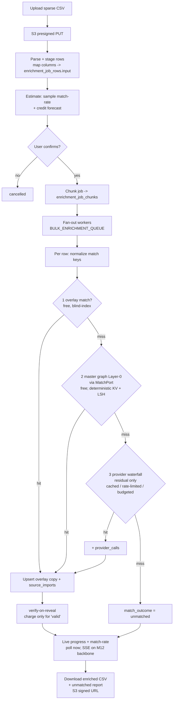

# 30 — Bulk CSV Enrichment Pipeline

> The flagship batch product: upload a **sparse CSV** → **match every row against our own data first**
> (overlay → global master graph → provider waterfall on the residual misses) → enrich/verify →
> download an enriched result + an unmatched report, at enterprise scale (**≤100k+ rows**, many
> concurrent tenants). It is **match-first** (internal matches are free and instant), **cost-aware**
> (providers run only on residual misses, cached/budgeted), and **charge-only-for-verified-match**
> ([ADR-0013](./decisions/ADR-0013-charge-for-verified-data-credit-back.md)). This doc is the lead doc
> for [ADR-0036](./decisions/ADR-0036-bulk-csv-enrichment-pipeline.md) (pipeline),
> [ADR-0037](./decisions/ADR-0037-match-first-resolution.md) (match-first resolution), and
> [ADR-0038](./decisions/ADR-0038-bulk-enrichment-billing.md) (billing). Shipped at **M17**; built on
> the enrichment engine ([06](./06-enrichment-engine.md)), the master graph + overlay
> ([ADR-0021](./decisions/ADR-0021-global-master-graph-and-overlay.md)), the credit model
> ([07](./07-billing-credits.md)), the event/queue backbone ([20](./20-event-driven-realtime-backbone.md)),
> and the scale contract ([18](./18-scalability-performance.md)).

## 1. Principles

- **Match-first.** Every input row is resolved against **our own data before any paid provider** — the
  workspace **overlay** (free, blind-index) → the **global master graph** Layer-0 via the **MatchPort**
  (free; deterministic keys + blocking/LSH) → only then the **provider waterfall** on the residual
  misses ([06 §4](./06-enrichment-engine.md#4-the-enrichment-flow-per-requested-field),
  [ADR-0021](./decisions/ADR-0021-global-master-graph-and-overlay.md)). Internal matches are the common,
  cheap case; providers are the expensive tail.
- **Internal-first is free.** An overlay or master-graph match costs **0 credits** — the customer pays
  for outcomes our existing graph already knows nothing of. This is the structural reason a bulk job is
  cheaper than naively firing a provider per row.
- **Cost-aware.** Providers are **cached** (`provider_calls.request_hash`), **rate-limited** (per-provider
  token bucket), and **budgeted** (per-tenant/global daily cost ceiling with a circuit breaker) — exactly
  as the single-record engine ([06 §5/§6](./06-enrichment-engine.md#5-caching)). A job never pays twice
  for the same answer and never overruns its forecast without re-confirmation.
- **Charge-on-verified-match.** A row is charged **only** when a provider-sourced field is **verified
  `valid`** at reveal ([ADR-0013](./decisions/ADR-0013-charge-for-verified-data-credit-back.md),
  [07 §3](./07-billing-credits.md), `H13`): `invalid`/`catch_all`/`unknown`/provider-miss → **0**;
  `risky` → charged-but-flagged. Internal matches and unmatched rows are never charged.
- **Opt-in, disclosed co-op.** Uploaded CSV rows feed the shared master graph **only** under an explicit,
  disclosed co-op opt-in — **off by default** ([06 §1](./06-enrichment-engine.md#1-principles),
  [21](./21-data-acquisition-sourcing.md)). Absent opt-in, an upload populates the **calling workspace's
  overlay** and is matched against the graph, but does **not** contribute new evidence to Layer 0.
- **Estimate before spend.** No job spends a credit until the user **confirms** a credit forecast built
  from a real sample match-rate (§6). Cost is never a surprise.

## 2. How Apollo & ZoomInfo (and Lusha) do it

Industry practice, summarized to calibrate our design. Each claim is flagged **[documented]** (from a
vendor doc / engineering post / patent) or **[inference]** (industry-standard reasoning, not a cited
guarantee). Sources are listed below the table; none of these are our own SLAs.

| Vendor / technique | What they do | Flag |
|---|---|---|
| **Apollo — CSV / bulk enrichment** | CSV upload up to **~100k rows**; bulk People-Enrichment API processes **~10 records/call**; **sync core enrich + async webhook** for slow fields (personal email / phone); reveal flags `reveal_personal_emails` / `reveal_phone_number` / `run_waterfall_*` | [documented] |
| **Apollo — waterfall** | On a miss, falls through to secondary providers (e.g. **ContactOut / Hunter**) before giving up | [documented] |
| **ZoomInfo — Search vs Match** | **Match** mode ranks candidate records by a **weighted attribute score** with a **tunable threshold** over an Apache **Solr** index (vs. Search = query the index); bulk APIs tuned for batch (e.g. **200k records**), **async via webhooks** | [documented] |
| **ZoomInfo — throughput** | Standard API budget **~1,500 requests/min** | [documented] |
| **ZoomInfo — graph DB** | **Neo4j** person/company/product graph, **Spark** ingestion, lookup nodes for resolution | [documented] |
| **Lusha — match hierarchy** | A **4-tier** deterministic ladder: **LinkedIn URL > email > name+company > name+domain** | [documented] |
| **Typical match rates** | email **~70–85%**, phone **~50–65%**, company **~85–95%** | [inference] |
| **Resolution stack** | Deterministic keys + **Redis/in-memory KV + inverted index** for sub-ms lookups; fuzzy via **Levenshtein/phonetic + blocking/candidate generation**; probabilistic **Fellegi-Sunter**; **Spark** partitioned batch | [inference] |
| **Multi-tenant scale** | **Hash-based tenant isolation** + per-tenant **quotas**; **credit-per-matched-record** billing | [inference] |

**Sources.** Apollo: `docs.apollo.io/reference/bulk-people-enrichment`, `knowledge.apollo.io` (CSV
Enrichment), `docs.apollo.io` (enrich waterfall). ZoomInfo: `engineering.zoominfo.com/bulk-data-search-and-match`,
`engineering.zoominfo.com/graph-database`. Lusha: `info.lusha.com` (CSV enrichment matching). Technique /
scale patents & papers: USPTO **8943057** (distributed bulk matching/loading), **10803019** (hash-based
multi-tenancy dedup), **11372569** (MDM de-dup); arXiv **1712.09691**, **1603.07816** (record linkage).

**What we take from this.** A match-ranking step with a **tunable threshold** (ZoomInfo Match), a
**deterministic tier ladder** (Lusha), a **graph-backed resolution layer** (ZoomInfo Neo4j → our master
graph, [ADR-0021](./decisions/ADR-0021-global-master-graph-and-overlay.md)), **batch over Spark/partitions**
([18 §8](./18-scalability-performance.md#8-citus-sharding--cutover)), and **async webhooks for slow fields**
(our SSE/poll progress, §8) are all directly mirrored below. Our differentiators are **match-first +
internal-free** and **charge-only-for-verified-match** (§1).

## 3. The bulk flow



In words: upload a sparse CSV → **S3 presigned** PUT → **parse + stage** rows (apply the
`column_mapping` into `enrichment_job_rows.input`) → **estimate** (sample match-rate + credit forecast) →
**user confirms** → **chunk** the job → **fan-out workers**. Per row: **normalize match keys** →
**match-first** [**1** overlay (free, blind-index) → **2** master graph Layer-0 via the **MatchPort**
(free; deterministic KV + blocking/MinHash-LSH; **INFRA-GATED**, seamed via a `masterGraphMatcher` stub)
→ **3** provider waterfall on the **residual only** (cached / rate-limited / budgeted)] → **upsert** the
overlay copy + `source_imports` (+ `provider_calls` on a provider hit) → **verify-on-reveal + charge
only for `valid`** ([ADR-0013](./decisions/ADR-0013-charge-for-verified-data-credit-back.md)) → **live
progress + match-rate** (poll now; SSE on the M12 backbone, [20](./20-event-driven-realtime-backbone.md))
→ **download** the enriched CSV + the unmatched report (S3 signed URL).

## 4. Job model

A three-table control plane separates **job control** (small, queryable) from the **high-volume row
detail** (partitioned). Statuses, chunked fan-out, resumability, idempotency, and a DLQ make a 100k-row
job restartable and exactly-once on the **paid** path.

### 4.1 Tables

- **`enrichment_jobs`** *(control plane — **not** partitioned)*: `id`, `tenant_id`, `workspace_id`,
  `created_by_user_id`, `source_file` (S3 key), `source_name`, `status`, `total_rows`, `processed_rows`,
  `matched_rows`, `enriched_rows`, `charged_rows`, `credit_estimate_micros`, `credit_spent_micros`,
  `column_mapping` jsonb, `options` jsonb, `idempotency_key`, `created_at`, `started_at`, `completed_at`,
  `failed_reason`.
- **`enrichment_job_chunks`**: `id`, `job_id`, `chunk_index`, `row_start`, `row_end`, `status`,
  `attempts`, `processed_rows`, `created_at`, `completed_at`. The **unit of fan-out, retry, and
  resumability**.
- **`enrichment_job_rows`** *(partitioned **monthly**, like the other high-volume tables in
  [03 §12](./03-database-design.md#12-indexing-partitioning--scale-overlay-100m-master-graph-billions))*:
  `id`, `job_id`, `chunk_id`, `row_index`, `input`
  jsonb, `match_method`, `match_outcome`, `matched_contact_id`, `matched_master_person_id` (nullable),
  `match_confidence`, `enriched_fields` jsonb, `provider_source`, `cost_micros`, `charged` bool,
  `email_status`, `created_at`.

```sql
-- illustrative; real DDL lands in packages/db
CREATE TYPE enrichment_job_status AS ENUM
  ('queued','estimating','awaiting_confirmation','running','paused','completed','failed','cancelled');
CREATE TYPE match_method AS ENUM
  ('deterministic_email','deterministic_linkedin','deterministic_phone','deterministic_domain',
   'fuzzy_name_company','provider','none');
CREATE TYPE match_outcome AS ENUM
  ('matched_internal','matched_provider','unmatched','suppressed','error');
```

### 4.2 Statuses & lifecycle

`enrichment_job_status` ∈ `queued | estimating | awaiting_confirmation | running | paused | completed |
failed | cancelled`. The flow: `queued` → `estimating` (sampling, §6) → `awaiting_confirmation` (forecast
shown, no spend) → `running` (confirmed, fan-out) → `completed`. `paused` is reached on budget exhaustion
or an operator hold and is resumable; `cancelled` (user) and `failed` (`failed_reason` set) are terminal.

### 4.3 Chunked fan-out, resumability & idempotency

- **Chunking.** On confirm, the job is split into `enrichment_job_chunks` of a fixed row span (target
  **~1,000 rows/chunk** — a tuning target, §8); each chunk is one `BULK_ENRICHMENT_QUEUE` message.
- **Resumability.** A worker advances `chunk.processed_rows` and marks the chunk `completed`; a restart
  re-enqueues only chunks not `completed`, so a crash mid-job resumes without redoing finished chunks.
- **Idempotency.** `enrichment_jobs.idempotency_key` dedupes job *submission* (a retried upload doesn't
  create a second job). Per row, the **paid** provider call reuses the engine's
  `provider_calls.request_hash` + Redis in-flight lock ([06 §6](./06-enrichment-engine.md#6-rate-limiting-idempotency-resilience))
  so a chunk **retry never double-charges**; `enrichment_job_rows` is written idempotently on
  `(job_id, row_index)`.
- **DLQ.** A chunk that exhausts `attempts` lands on the `bulk-enrichment` **DLQ** with its
  `failed_reason`; the job goes `paused` (not silently `completed`), alerts Ops
  ([19](./19-observability-reliability.md)), and the DLQ chunk is replayable after a fix
  ([20 §backpressure](./20-event-driven-realtime-backbone.md), `H23`).

## 5. Match-first resolution (the MatchPort)

Resolution is a **single seam**, `MatchPort`, tried in cost order — overlay → master graph → provider —
so the cheap, internal cases short-circuit before any spend. Steps 1–2 are **free**; only the residual
reaches step 3.

```ts
// illustrative seam; the master-graph matcher is INFRA-GATED behind a stub at M17
interface MatchKeys {                 // produced by normalize() — see below
  emailBlindIndex?: string;           // HMAC blind index (08, H4)
  linkedinPublicId?: string;
  phoneE164?: string;                 // libphonenumber
  companyDomain?: string;             // registrable domain via Public Suffix List
  fullName?: string; companyName?: string;
}
interface MatchResult {
  method: 'deterministic_email' | 'deterministic_linkedin' | 'deterministic_phone'
        | 'deterministic_domain' | 'fuzzy_name_company' | 'provider' | 'none';
  outcome: 'matched_internal' | 'matched_provider' | 'unmatched' | 'suppressed' | 'error';
  contactId?: string;                 // overlay copy
  masterPersonId?: string;            // Layer-0 golden id (nullable)
  confidence: number;                 // [0,1]
}
interface MatchPort {
  normalize(input: Record<string, unknown>): MatchKeys;
  matchOverlay(keys: MatchKeys, ctx: WorkspaceCtx): Promise<MatchResult | null>;      // 1 — free
  masterGraphMatcher(keys: MatchKeys): Promise<MatchResult | null>;                   // 2 — free, seam
  matchProvider(keys: MatchKeys, ctx: WorkspaceCtx): Promise<MatchResult | null>;     // 3 — paid tail
}
```

### 5.1 Normalize match keys

Identical normalization to the global ER pipeline ([06 §9](./06-enrichment-engine.md#9-data-quality--verification),
[22 §6](./22-data-quality-freshness-lifecycle.md#6-entity-resolution-quality--manual-review)) so a row's
keys collide with the graph's: email lowercased + plus-addressing stripped → **`email_blind_index`** (HMAC,
[03 §5](./03-database-design.md#5-data-layer), `H4`); **registrable domain** via the Public Suffix List;
phone → **E.164** (libphonenumber); LinkedIn → `linkedin_public_id`; name/company canonicalized.

### 5.2 Step 1 — overlay (free, blind-index)

Look the row up in the **calling workspace's overlay** by its blind-index uniques
`(workspace_id, email_blind_index)` / `(workspace_id, linkedin_public_id)`
([03 §11](./03-database-design.md#11-integrity-rules), `H4`). A hit → `match_method =
deterministic_*`, `match_outcome = matched_internal`, **0 credits**.

### 5.3 Step 2 — master graph Layer-0 via MatchPort (free; INFRA-GATED, seamed)

On an overlay miss, resolve against the **global master graph** golden set
([ADR-0021](./decisions/ADR-0021-global-master-graph-and-overlay.md), `H17`):

1. **Deterministic KV** on strong keys (email blind index, LinkedIn id, phone, domain) — the
   sub-millisecond, ~95% common case (mirrors the Lusha ladder, §2).
2. **Blocking + MinHash-LSH** candidate generation, then **Splink** (Fellegi-Sunter) probabilistic
   scoring of the **fuzzy tail** (`fuzzy_name_company`) — same engine as global ER
   ([06 §9](./06-enrichment-engine.md#9-data-quality--verification),
   [ADR-0015](./decisions/ADR-0015-entity-resolution-dedup-engine.md)).

A hit links `matched_master_person_id` and yields the golden fields, **0 credits**. **This step is
INFRA-GATED**: it depends on the master graph being live at scale, so at M17 it is **seamed behind a
`masterGraphMatcher` stub** that returns "no match" until the graph is provisioned — the pipeline runs
end-to-end on overlay + provider in the interim, then lights up the free middle tier without a code
change.

### 5.4 Step 3 — provider waterfall (residual only)

Only rows that miss **both** internal tiers reach the providers, reusing the single-record engine's
ordered, cache-first, circuit-broken, budgeted waterfall
([06 §4](./06-enrichment-engine.md#4-the-enrichment-flow-per-requested-field)). A hit → `match_method =
provider`, `match_outcome = matched_provider`, `provider_source` set, `cost_micros` recorded; a miss →
`match_outcome = unmatched`.

### 5.5 Confidence & manual review

`match_confidence` ∈ `[0,1]`. Deterministic matches are `1.0`; fuzzy matches carry the Splink score.
**Low-confidence matches route to the manual-review queue** exactly as global ER
([06 §9](./06-enrichment-engine.md#9-data-quality--verification),
[22 §6](./22-data-quality-freshness-lifecycle.md#6-entity-resolution-quality--manual-review)) — they are
**not** auto-merged and **not** charged until resolved.

## 6. Estimate & confirm

No job spends a credit before the user sees and confirms a forecast.

- **Sample.** On upload, the job enters `estimating`: a **bounded random sample** of staged rows
  (target **~1,000 rows or 1%, whichever larger** — a tuning target, §8) runs the full match-first path
  **but stops before any paid reveal**, producing a measured **internal match-rate** and an estimated
  **provider-fillable residual**.
- **Forecast.** From the sample we extrapolate **expected charged rows** = residual × expected
  provider-`valid` rate, and a **credit forecast** (`credit_estimate_micros`). Internal matches and
  unmatched rows contribute **0**. The forecast is a **range**, never a guarantee (it depends on live
  provider hit/verify rates).
- **Confirm.** The job sits in `awaiting_confirmation`. `POST .../confirm` transitions to `running` and
  authorizes spend **up to the forecast ceiling**; exceeding it (or hitting the tenant budget, §7) pauses
  the job for re-confirmation rather than overspending. `POST .../cancel` → `cancelled`, 0 spend.

Pricing per charged match is **not** set here — it follows the placeholder credit model
([07 §1](./07-billing-credits.md#1-the-credit-model)); never hardcode a price.

## 7. Billing & quota

- **Charge-per-verified-match** ([ADR-0013](./decisions/ADR-0013-charge-for-verified-data-credit-back.md),
  [ADR-0038](./decisions/ADR-0038-bulk-enrichment-billing.md), `H13`). A row is charged **only** when a
  **provider-sourced** field is verified **`valid`** at reveal ([06 §9](./06-enrichment-engine.md#9-data-quality--verification),
  [07 §3](./07-billing-credits.md#3-the-reveal-transaction-core-monetized-path)): `invalid` / `catch_all`
  / `unknown` / provider-miss → **0**; `risky` → charged-but-flagged. `matched_internal` and `unmatched`
  rows are **never** charged. Each charge sets `enrichment_job_rows.charged = true` and increments
  `enrichment_jobs.charged_rows` + `credit_spent_micros`; a hard bounce inside the guarantee window
  **credits back** the row (`credit.adjust`, [07 §3](./07-billing-credits.md#3-the-reveal-transaction-core-monetized-path),
  [08 §5](./08-compliance.md#5-audit-logging)).
- **Per-row charge transaction.** Each charged reveal runs the **standard reveal transaction**
  ([07 §3](./07-billing-credits.md#3-the-reveal-transaction-core-monetized-path), `H1`/`H2`):
  suppression-gated in-tx, idempotent on `(workspace_id, contact_id, reveal_type)`, `FOR UPDATE` on the
  tenant counter with `CHECK (reveal_credit_balance >= 0)`. The bulk job is just a **driver** of that path
  — it does not introduce a second charging mechanism.
- **Per-tenant quota & concurrency.** Per-tenant **daily cost budget** + **concurrent-job** and
  **rows-in-flight** caps prevent one tenant's 100k-row job from starving others
  ([18 §9](./18-scalability-performance.md#9-rate-limiting-quotas--backpressure)). A budget hit pauses the
  job (§4.2), not the whole worker pool.
- **Lease-based decrement** ([ADR-0029](./decisions/ADR-0029-credit-ledger-and-lease-decrement.md),
  [07 §2](./07-billing-credits.md#2-why-a-counter-and-not-a-ledger--yet)). For high-concurrency bulk
  charging, each chunk acquires a **credit lease** (a reserved slice of the tenant pool) so thousands of
  per-row charges don't serialize on the single tenant-row hot lock; the lease reconciles against
  `credit_ledger` (M11/M12). Until leases land, charges fall back to the direct in-tx counter decrement.

## 8. Scale & performance

Design targets — **validated via k6 at M17**, not guarantees (cross-ref the performance contract
[18](./18-scalability-performance.md), `H22`).

| Dimension | Target (validate at M17) |
|---|---|
| Max rows / upload | **100k+** |
| Estimate latency | **p95 < 2 s** for a 100k-row sample |
| End-to-end throughput | **≥ 10k rows/min** sustained per job (internal-match-dominated) |
| Chunk size | **~1,000 rows/chunk** (tuning) |
| Sample size | **~1,000 rows or 1%**, whichever larger (tuning) |
| Worker parallelism | autoscaled on `bulk-enrichment` **queue depth + age** ([18 §3](./18-scalability-performance.md#3-capacity-model--scaling-units)) |

- **Chunking & parallelism.** The job fans out into independent chunks (§4.3) processed concurrently by
  autoscaled workers; throughput scales horizontally with worker count, bounded by provider rate limits
  on the residual tail only.
- **Search-sync of new overlay rows.** Matched/enriched overlay copies emit domain events
  ([20](./20-event-driven-realtime-backbone.md)) so the **search index stays current** (CDC→index
  **p95 < 5 s**, [18 §2](./18-scalability-performance.md#2-slos--latency-budgets)); a bulk job does not
  bypass the indexing path.
- **Backpressure.** `bulk-enrichment` honors the standard queue depth/age thresholds → autoscale, then
  **shed/slow** (defer chunks, pause low-priority jobs) before the freshness SLOs break; DLQ + alerts on
  exhaustion ([18 §9](./18-scalability-performance.md#9-rate-limiting-quotas--backpressure),
  [20](./20-event-driven-realtime-backbone.md), `H23`).
- **Batch ER affinity.** The master-graph match tier reuses the **blocking/LSH + Splink** machinery that
  runs on **Spark/Athena over the S3/Iceberg lake** at scale ([18 §8](./18-scalability-performance.md#8-citus-sharding--cutover),
  [22 §6](./22-data-quality-freshness-lifecycle.md#6-entity-resolution-quality--manual-review)).
- **Live progress.** `processed_rows` / `matched_rows` / `enriched_rows` / `charged_rows` advance on
  `enrichment_jobs`; clients **poll** `GET /v1/enrichment/bulk/:jobId` now, upgrading to **SSE** on the
  M12 real-time backbone ([20](./20-event-driven-realtime-backbone.md)).

## 9. Compliance

The bulk path inherits the same unbypassable controls as every reveal/send path
([08](./08-compliance.md)) — at batch scale, the gates matter more, not less.

- **Suppression gate before reveal/charge** (`H5`). `assertNotSuppressed` runs **inside** each per-row
  reveal transaction ([08 §3](./08-compliance.md#3-suppression--do-not-contact-dnc),
  [07 §3](./07-billing-credits.md#3-the-reveal-transaction-core-monetized-path)); a suppressed row is
  **never revealed, enriched-on-reveal, or charged** — it is recorded as `match_outcome = suppressed` and
  omitted from the enriched output. No bulk code path can bypass it.
- **DSAR fan-out** (`H6`). `enrichment_job_rows.input` + matched `contacts`/`source_imports` are a
  **PII/DSAR surface**: a delete fans out across overlay copies, `source_imports`, and the job rows that
  hold the subject ([08 §4.2](./08-compliance.md#42-delete-the-hard-one--fans-out-across-every-copy)).
- **Opt-in, disclosed co-op.** Uploaded rows contribute new evidence to the shared master graph **only**
  under an explicit, disclosed co-op opt-in — off by default
  ([06 §1](./06-enrichment-engine.md#1-principles), [21](./21-data-acquisition-sourcing.md)); otherwise
  the upload is overlay-private.
- **DNC for phone.** Phone reveals respect the DNC/suppression scopes (`phone` match type,
  [08 §3](./08-compliance.md#3-suppression--do-not-contact-dnc)) and charge only when a line type resolves
  ([06 §9](./06-enrichment-engine.md#9-data-quality--verification)).
- **Provenance & lawful basis.** Each enriched row writes `source_imports` (`source_name = csv`,
  [06 §2](./06-enrichment-engine.md#2-source-channels-how-data-enters-a-workspace), `H3`) capturing the
  lawful-basis snapshot per import ([08 §11](./08-compliance.md#11-collection--channel-legality-ties-to-06-2),
  [21 §5](./21-data-acquisition-sourcing.md)); audit covers the job (`H13`,
  [08 §5](./08-compliance.md#5-audit-logging)).

## 10. Metrics

| Metric | Why it matters |
|---|---|
| Internal match-rate (overlay + master graph) | Core value — the free, instant fraction; drives the cost wedge |
| Provider fill-rate on residual | Effectiveness of the paid tail |
| Charged-row rate (`valid` ÷ provider-reached) | Unit economics of the verified-match charge |
| Estimate accuracy (forecast vs actual `credit_spent_micros`) | Trust in the confirm step (§6) |
| Throughput (rows/min) + queue depth/age | Scale health, backpressure trigger ([18 §9](./18-scalability-performance.md#9-rate-limiting-quotas--backpressure)) |
| Suppressed-row count | Compliance gate is firing (`H5`) |
| DLQ chunk rate | Reliability of the fan-out (§4.3) |
| Credit-back rate on bulk-charged rows | Data quality / margin ([ADR-0013](./decisions/ADR-0013-charge-for-verified-data-credit-back.md)) |

## 11. API

Canonical endpoints, mounted under the corpus REST base path **`/api/v1`** ([09 §1](./09-api-design.md);
the `/v1/enrichment/bulk…` segments below are the version-suffixed paths under that base) — idempotent on
the money path via `Idempotency-Key`:

| Endpoint | Purpose |
|---|---|
| `POST /v1/enrichment/bulk` | Create a job (presigned S3 upload + `column_mapping` + `options`) |
| `POST /v1/enrichment/bulk/estimate` | Run the sample → match-rate + credit forecast (§6) |
| `GET /v1/enrichment/bulk/:jobId` | Job status + live progress/match-rate (poll; SSE on M12) |
| `POST /v1/enrichment/bulk/:jobId/confirm` | Confirm forecast → `running` (authorizes spend) |
| `POST /v1/enrichment/bulk/:jobId/cancel` | Cancel → `cancelled` (0 spend) |
| `GET /v1/enrichment/bulk/:jobId/download` | Enriched CSV + unmatched report (S3 signed URL) |

Queue: `BULK_ENRICHMENT_QUEUE = "bulk-enrichment"` (+ DLQ). Milestone: **M17**.

## Links
- **Links to:** [06 §1/§2/§4/§5/§6/§9](./06-enrichment-engine.md), [07 §1/§2/§3](./07-billing-credits.md),
  [08 §3/§4/§5/§11](./08-compliance.md), [09 §1](./09-api-design.md),
  [18 §2/§3/§8/§9](./18-scalability-performance.md), [20](./20-event-driven-realtime-backbone.md),
  [21 §5](./21-data-acquisition-sourcing.md), [22 §6](./22-data-quality-freshness-lifecycle.md),
  [03 §5/§11/§12](./03-database-design.md), [10 (M17)](./10-roadmap.md),
  [ADR-0013](./decisions/ADR-0013-charge-for-verified-data-credit-back.md),
  [ADR-0015](./decisions/ADR-0015-entity-resolution-dedup-engine.md),
  [ADR-0021](./decisions/ADR-0021-global-master-graph-and-overlay.md),
  [ADR-0029](./decisions/ADR-0029-credit-ledger-and-lease-decrement.md),
  [ADR-0036](./decisions/ADR-0036-bulk-csv-enrichment-pipeline.md),
  [ADR-0037](./decisions/ADR-0037-match-first-resolution.md),
  [ADR-0038](./decisions/ADR-0038-bulk-enrichment-billing.md)
- **Linked from:** [00 §7](./00-overview.md#7-decision-log), [05](./05-features-modules.md),
  [06 §2](./06-enrichment-engine.md), [10 (M17)](./10-roadmap.md), README

## Open questions
1. **Chunk + sample sizing** — ~1,000 rows/chunk and ~1,000-row/1% sample are starting targets; tune from
   k6 throughput and estimate-accuracy measurements at M17 (§6, §8).
2. **Estimate accuracy band** — what forecast-vs-actual spread (and confirm-ceiling headroom) is
   acceptable before we pause for re-confirmation (§6)?
3. **Master-graph match-tier go-live** — when does the INFRA-GATED `masterGraphMatcher` stub (§5.3) flip
   to live, and what blocking-rule/match-threshold tuning does bulk need beyond the global-ER defaults
   ([22 §6](./22-data-quality-freshness-lifecycle.md#6-entity-resolution-quality--manual-review))?
4. **Per-tenant bulk concurrency & budget defaults** by plan tier ([07](./07-billing-credits.md),
   [18 §9](./18-scalability-performance.md#9-rate-limiting-quotas--backpressure)) — how many concurrent
   100k-row jobs, and what daily cost ceiling, per tier?
5. **Async slow-field handling** — do we mirror Apollo's async-webhook pattern for slow provider fields
   (personal email/phone) within a chunk, or keep all enrichment synchronous to the row (§2, §5.4)?
