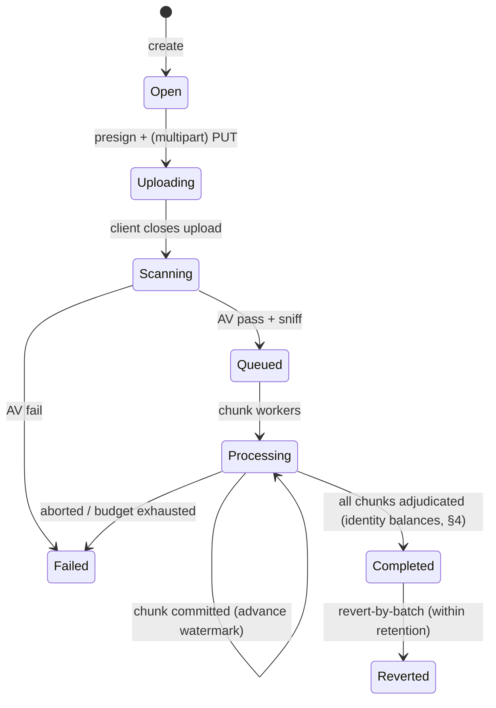

# 30 — Bulk Import / Export Pipeline

> The canonical contract for moving **millions of CSV rows** in and out of TruePoint **accurately, at
> scale**: bulk import and export are **first-class async jobs**, never synchronous requests. Bytes go
> **direct to S3**; the app stays off the byte path; a **durable, addressable job** with cheap status
> fields drives a Salesforce-Bulk-API-2.0-style state machine (create→upload→close→process→poll→fetch)
> that survives restarts. Every row is accounted for: `rows_in = succeeded + rejected + deduped +
> unprocessed`. [ADR-0036](./decisions/ADR-0036-bulk-async-job-and-staging-pipeline.md) locks the design;
> this doc is the spec every sibling cross-links — it states the pipeline end-to-end and **points to the
> doc that owns each deep detail** (it does not redefine schemas, SQL, API contracts, or ER it links to).

This supersedes the MVP-level import sketch ([05 §3](./05-features-modules.md#3-import-csv--providers--mvp-m1))
and the thin export sketch ([05 §12](./05-features-modules.md#12-export--mvp-m3) / [26 §8](./26-integrations-data-delivery.md))
for **bulk** scale. Small/manual imports keep the simple synchronous path; the threshold that promotes an
upload to this pipeline is a plan-tier cap (§1). Closes **G-IMP-1/2/3/4/6, G-ER-2, G-EXP-1/2** (§11).

## 1. Upload: direct-to-S3, AV-quarantine gate, sniffing & caps

The API **never** receives the file body. The client requests an upload via the job API
([09 §3.2](./09-api-design.md)); the server creates the job (§6) and returns a **presigned S3 URL** — a
single PUT for small files, **multipart** above the single-PUT ceiling (~5 GiB) so uploads are **resumable
by part** (closes **G-IMP-6**). Bytes land in a **quarantine bucket**, not the working bucket.

- **AV / malware gate.** `ObjectCreated` in quarantine triggers a **virus/malware scan** (GuardDuty Malware
  Protection for S3, or ClamAV in a worker) **before** the job may enqueue. Clean → object is promoted to
  the working bucket and the job advances; infected/unscannable → job fails closed, object tombstoned,
  audited. **A scan must pass before any parsing begins.** AV tooling + bucket policy detail lives in
  [01](./01-tech-stack.md) / [08](./08-compliance.md); lawful-basis of the uploaded data is
  [21 §5](./21-data-acquisition-sourcing.md).
- **Encoding & dialect sniffing.** On promotion the imports worker sniffs **encoding** (UTF-8 / UTF-16 /
  BOM / Latin-1) and **CSV dialect** (delimiter, quote char, header presence) from a head sample, records
  the detected profile on the job, and lets the user override before commit. Mis-sniffed encoding is the
  classic million-row corruption source, so it is explicit and inspectable, not assumed.
- **Plan-tier file/row caps.** Max file size and max rows-per-import are **entitlements** by plan
  ([12 §3](./12-settings.md), [29](./29-settings-administration-architecture.md)); over-cap uploads are
  rejected at presign or split. **Very large imports above a per-workspace threshold require approval**
  (mirrors export approvals, [26 §8](./26-integrations-data-delivery.md); [29 §19](./29-settings-administration-architecture.md)) —
  closes **G-IMP-7**.

> Owner of the deep detail: **bucket/AV/encoding tech → [01](./01-tech-stack.md)/[08](./08-compliance.md);
> presign + job API → [09 §3.2](./09-api-design.md); caps/approval → [12](./12-settings.md)/[29](./29-settings-administration-architecture.md).**

## 2. Parse: flat-memory streaming + backpressure + server-owned chunking

The worker **never loads the whole file**. It **streams** the object from S3 through a parser at
**constant (flat) memory**, honoring **backpressure** — pause the read when the downstream stage is busy.
(Ignoring backpressure on a streaming parse balloons RSS ~17× and OOM-kills the worker, so it is a hard
rule, not a tuning knob.) Parsing runs on the **imports** BullMQ queue ([20 §4](./20-event-driven-realtime-backbone.md),
[01 §4](./01-tech-stack.md#4-background-workers)) under the workspace's RLS GUC (§3).

- **Server-owned chunking.** The server, not the client, splits the stream into **~10k-row chunks**;
  chunks are the unit of parallelism, the unit of a **per-chunk time budget**, and the unit of the resume
  watermark (§6). Parallel workers process chunks under a **per-tenant bulk concurrency cap** (§10) so one
  big import can't starve the queue.
- Chunk size and parallelism are governed by the throughput SLOs in §10 and [18 §2](./18-scalability-performance.md).

## 3. Land: COPY → UNLOGGED staging → dedup → chunked upsert (RLS-aware)

Row-by-row `INSERT` is ~200–300× slower than `COPY`, so each chunk is **`COPY`-loaded into an UNLOGGED
staging table**, deduplicated **in staging** (`DISTINCT ON` the natural key), then **upserted** into the
overlay in committed chunks. SQL, table DDL, partitioning and RLS policy are owned by
[03](./03-database-design.md) — this section states the pipeline shape; 03 owns the statements.

- **RLS caveat (load-bearing).** `COPY FROM` is **unsupported on RLS-enabled tables**. So `COPY` targets a
  **non-RLS staging table**, then the move into the RLS-scoped overlay (`contacts`/`accounts`/`source_imports`)
  is an **`INSERT … SELECT` under `SET LOCAL app.current_workspace_id`/`app.current_tenant_id`** — the same
  per-transaction GUC discipline (H9) used everywhere else ([03 §9](./03-database-design.md), [18 §4](./18-scalability-performance.md)).
- **Chunked upsert.** Commit **10k–50k-row chunks** as `INSERT … ON CONFLICT … DO UPDATE` against the
  per-workspace unique blind-index constraints (`(workspace_id, email_blind_index)` /
  `(workspace_id, linkedin_public_id)` / `(workspace_id, sales_nav_lead_id)`, [03 §5/§11](./03-database-design.md)),
  with the **explicit conflict policy** of §7. Each committed chunk advances the **resume watermark** so a
  restart resumes from the last committed chunk, not row 0 (§6).
- **Parent-key affinity / pre-sort.** Rows are **pre-sorted / grouped by shared parent** (account/domain)
  so chunks don't contend for the same parent row across workers — avoids the `unable to lock row in
  relation` thrash a million same-domain rows otherwise produce.

> Owner: **all DDL/SQL/RLS/partitioning → [03 §5/§9/§11/§12](./03-database-design.md).**

## 4. Per-row validation, three-way accounting & artifacts

Every row gets a verdict in **one of three buckets** — and they must reconcile:

| Bucket | Meaning |
|---|---|
| **succeeded** | landed (created or updated), with an assigned overlay id |
| **failed (rejected)** | validation/constraint error; will not land without a fix |
| **unprocessed** | never adjudicated (chunk timed out, job aborted, downstream shed) — distinct from failed |

`unprocessed` is a **first-class** outcome, not folded into failed: it tells the user *re-run me*, where
*failed* tells them *fix me*. The reconciliation identity is asserted at job close:

> **`rows_in = succeeded + rejected + deduped + unprocessed`** — a job cannot reach `completed` until this
> balances; a mismatch is an alert ([19](./19-observability-reliability.md)).

- **Validation rules** (required fields, type/format, normalization, custom-field typing) are owned by
  [22](./22-data-quality-freshness-lifecycle.md) (`data_quality_rules` as data) — this pipeline *applies*
  them per row, it doesn't define them. A **pre-commit validation preview** (counts, sample errors, dup
  estimate) is offered before the user commits the import (closes **G-IMP-1**).
- **Success correlation (echo, don't position).** Results **echo each input row plus status columns**
  (assigned id, **created-vs-updated**, dedup outcome). Callers **correlate by an input row key, not by
  position** — chunked parallel processing reorders rows, so position is meaningless. This lets a caller
  **re-import only the failures**.
- **Rejected-rows artifact.** A downloadable rejected-rows file (`rowNumber`, `field`, `reason`, **raw
  row**) is written to S3. Because it echoes **raw PII**, it has a **short TTL** and **access control**
  (signed link, scoped to the import owner/workspace, suppression-respecting) — same governance as exports
  (§7 of [26](./26-integrations-data-delivery.md), [08 §5](./08-compliance.md)). Closes **G-IMP-1**'s
  error-file half.

> Owner: **validation/DQ rules → [22](./22-data-quality-freshness-lifecycle.md); custom-field typing →
> [03](./03-database-design.md); artifact governance → [08 §5](./08-compliance.md)/[26 §8](./26-integrations-data-delivery.md).**

## 5. Dedup: two passes + survivorship overview

Dedup runs in **two passes**, in this order, and **before** any enrich/charge side effect (§9):

1. **Within-file.** Collapse duplicates inside the upload by a **normalized natural key** (lower-cased
   email blind index / `linkedin_public_id` / `sales_nav_lead_id`), counted into `deduped`. This is the
   `DISTINCT ON` in staging (§3).
2. **Against existing data.** Exact-match against the **workspace overlay** uniques is the first line
   (synchronous, at upsert). The **fuzzy tail** (no shared key — name+account variants, formatting drift)
   resolves against the **overlay** and, for contributory data, the **global master graph** via
   **blocking → probabilistic scoring (Splink)** ([ADR-0015](./decisions/ADR-0015-entity-resolution-dedup-engine.md),
   [ADR-0021](./decisions/ADR-0021-global-master-graph-and-overlay.md), [22 §6](./22-data-quality-freshness-lifecycle.md)).

- **Block-size cap.** Blocking keys are **sub-blocked** with a **max block size** so a million rows on one
  email domain don't explode into an O(n²) comparison; this is the ER engine's contract ([ADR-0015](./decisions/ADR-0015-entity-resolution-dedup-engine.md)).
- **Survivorship (overview).** When a match merges, **per-attribute survivorship** picks the winning value
  and a **calibrated two-threshold routing** auto-accepts / sends to **clerical review** / auto-rejects.
  This pipeline triggers it and records `deduped`; the **survivorship + review-queue mechanics are owned by
  ER** ([ADR-0021](./decisions/ADR-0021-global-master-graph-and-overlay.md), [22 §6](./22-data-quality-freshness-lifecycle.md)).
  Closes **G-ER-2** (dedup against existing data on import).

> Owner: **ER/blocking/Splink/survivorship → [ADR-0015](./decisions/ADR-0015-entity-resolution-dedup-engine.md)/[ADR-0021](./decisions/ADR-0021-global-master-graph-and-overlay.md) + [22 §6](./22-data-quality-freshness-lifecycle.md).**

## 6. Job state machine, checkpoint/resume, idempotency & revert

A bulk job is a **durable, addressable row** with **cheap status fields** (state, counts, watermark,
timestamps) the client **polls** ([09 §3.2](./09-api-design.md)) and that survives worker restarts. The
lifecycle follows Salesforce Bulk API 2.0 as the reference:

- **Checkpoint / resume.** The **resume watermark** is the last committed chunk (§3). A restart resumes
  from the watermark; already-committed chunks are not re-applied (the upsert is idempotent on the dedup
  key anyway).
- **Batch idempotency key.** The create call carries an **idempotency key** ([09 §5](./09-api-design.md),
  [20 §5](./20-event-driven-realtime-backbone.md)); a re-submitted upload **collapses to the same job**
  instead of double-importing. Combined with dedup-key upsert, **retries are safe by construction**.
- **Revert-by-batch (undo).** Within a **retention window**, an import is **reverted by batch** using its
  `source_imports` rows — undo a bad mapping that polluted a workspace, audited ([08 §5](./08-compliance.md)).
  Closes **G-IMP-2**.
- On completion the job emits **`import.completed`** (counts + dedup outcome) on the event backbone
  ([20 §2](./20-event-driven-realtime-backbone.md), [09 §10](./09-api-design.md)) — which is **batched**,
  not per-row (§9).

> Owner: **job/endpoint contract + status shape → [09 §3.2/§5](./09-api-design.md); the decision →
> [ADR-0036](./decisions/ADR-0036-bulk-async-job-and-staging-pipeline.md); `source_imports` schema →
> [03 §5](./03-database-design.md).**

## 7. Export at scale

Export is the same async-job discipline in reverse, at **constant memory** (closes **G-EXP-1**, extends
[26 §8](./26-integrations-data-delivery.md) / [18 §6](./18-scalability-performance.md), addresses **G-SCALE-11**):

- **Stream → gzip → S3 multipart.** A worker **keyset / server-cursor paginates** the result set and
  streams it through gzip to an **S3 multipart upload** — never materializing the file in memory.
- **Consistent snapshot.** The read runs under a **consistent snapshot** (**REPEATABLE READ** / a
  point-in-time cursor) off a **read replica** ([18 §6](./18-scalability-performance.md)) so a long export
  doesn't tear across concurrent writes and doesn't load the primary writer.
- **Sharding + manifest.** Large exports **shard at ~1M rows/file** with a **manifest** (file URIs, per-file
  row counts, checksums) so downstream loads are verifiable and resumable. Closes **G-EXP-2**.
- **Expiring links + regenerate.** Files are delivered via **signed, expiring S3 URLs**; an expired link is
  **regenerated via the job status endpoint** ([26 §8](./26-integrations-data-delivery.md)).
- **Column selection + format.** The caller chooses **columns** and **format** (CSV / CSV.gz / XLSX). Every
  export is **suppression-checked**, **reveal-respecting** (only owned/revealed fields leave), audited, and
  under per-workspace **row caps / frequency limits / large-export approval** ([26 §8](./26-integrations-data-delivery.md),
  [08 §5](./08-compliance.md), [29 §19](./29-settings-administration-architecture.md)).

> Owner: **export center governance/policy → [26 §8](./26-integrations-data-delivery.md); replica/snapshot
> reads → [18 §6](./18-scalability-performance.md); compliance gate → [08 §5](./08-compliance.md).**

## 8. Mapping templates (overview)

Source columns map to the canonical contact/account shape (incl. custom fields, [03](./03-database-design.md))
via a **mapping template that is saved and replayed per source** (closes **G-IMP-3**'s template half) — so a
recurring drop from the same source ([26](./26-integrations-data-delivery.md)) maps itself. **AI
auto-mapping** (Claude-suggested columns with confidence) is owned by the AI layer
([23](./23-ai-intelligence-layer.md), `extract_fields`); this pipeline **consumes** a confirmed mapping and
applies it per row (§4). Templates are workspace-scoped settings ([12 §3](./12-settings.md)).

## 9. Safe-by-default side effects

A bulk import is **inert until promoted**. By default it **does NOT**:

- **auto-enrich** every imported row (no million-call provider bill — enrichment-on-import is a **deliberate,
  budgeted** opt-in, [06](./06-enrichment-engine.md));
- **auto-enroll** rows into outreach sequences or fire **automation** actions ([27 §7](./27-workflow-automation-engine.md));
- charge or reserve credits beyond the import itself.

**Deliberate-promote:** enrich, enroll, or score on imported rows is a **separate, explicit action** the
user takes after reviewing the import — the same "safe by construction" stance the automation engine takes
([27 §1/§7](./27-workflow-automation-engine.md)). Where a deliberate bulk enrich *is* requested, credits use
**bulk reservation** (pre-authorize worst-case via a **lease**, pre-flight estimate, partial-spend/resume,
batch credit-back) owned by [07](./07-billing-credits.md) / [ADR-0029](./decisions/ADR-0029-credit-ledger-and-lease-decrement.md).

**Bounded event fan-out:** per-row `record.created` is **coalesced into batched / job-level events** with
back-pressure on the search-sync indexer — a million-row import publishes a job-level summary, not a million
events ([20 §2/§6](./20-event-driven-realtime-backbone.md), [24 §search-burst](./24-advanced-search-exploration-ux.md),
[18 §9](./18-scalability-performance.md)).

> Owner: **enrich-on-import policy → [06](./06-enrichment-engine.md); credit reservation/leases →
> [07](./07-billing-credits.md)/[ADR-0029](./decisions/ADR-0029-credit-ledger-and-lease-decrement.md);
> automation safety → [27 §7](./27-workflow-automation-engine.md); event coalescing → [20 §6](./20-event-driven-realtime-backbone.md).**

## 10. Governors, SLOs & scheduling

- **Throughput SLOs.** Rows/sec targets and a **1M-row p95** for both import and export, tracked as SLOs in
  [19](./19-observability-reliability.md) against the budgets in [18 §2](./18-scalability-performance.md).
  Enqueue latency stays in the [18 §2](./18-scalability-performance.md) "import/export enqueue" budget
  (p95 100 ms) — the *work* is async.
- **Concurrency & quotas.** **Per-tenant bulk concurrency caps** and **per-workspace quotas** (rows/day,
  files/day) prevent one tenant monopolizing the imports/export workers ([18 §9](./18-scalability-performance.md),
  [12 §6](./12-settings.md)).
- **Scheduled / recurring.** S3/SFTP-drop and scheduled imports/exports run via the **`schedule` trigger →
  import/export action** ([27](./27-workflow-automation-engine.md)) with the same job pipeline; scheduled
  delivery is owned by [26](./26-integrations-data-delivery.md). Closes **G-IMP-4**.
- **Observability.** Per-job and per-chunk metrics (rows/sec, reject rate, dedup ratio, queue depth/age,
  reject-file metrics) and the reconciliation-identity assertion (§4) live in [19](./19-observability-reliability.md).

## 11. Gaps closed

| Gap | What this doc adds |
|---|---|
| **G-IMP-1** | Pre-commit validation preview + downloadable rejected-rows artifact (short TTL, access-controlled) — §4 |
| **G-IMP-2** | Revert-by-batch within a retention window via `source_imports` — §6 |
| **G-IMP-3** | Mapping templates (save-and-replay); AI auto-map consumed from [23](./23-ai-intelligence-layer.md) — §8 |
| **G-IMP-4** | Scheduled / recurring (S3-drop/SFTP/Sheets) imports + exports via the `schedule` trigger — §10 |
| **G-IMP-6** | Multipart, resumable direct-to-S3 upload + server-owned chunked processing — §1/§2 |
| **G-ER-2** | Two-pass dedup (within-file + against existing overlay/master graph, blocking→Splink) — §5 |
| **G-EXP-1** | Constant-memory streaming export (stream→gzip→S3 multipart) under a consistent snapshot — §7 |
| **G-EXP-2** | ~1M-rows/file sharding + manifest (URIs, counts, checksums); expiring links + regenerate — §7 |

(Also tightens **G-IMP-7** large-import approval — §1, and **G-SCALE-11** export streaming — §7.)

## Links
- **Links to:** [01 §4](./01-tech-stack.md#4-background-workers), [03 §5/§9/§11/§12](./03-database-design.md),
  [05 §3/§12](./05-features-modules.md), [06](./06-enrichment-engine.md), [07](./07-billing-credits.md),
  [08 §5](./08-compliance.md), [09 §3.2/§5/§10](./09-api-design.md), [12 §3/§6](./12-settings.md),
  [18 §2/§6/§9](./18-scalability-performance.md), [19](./19-observability-reliability.md),
  [20 §2/§4/§5/§6](./20-event-driven-realtime-backbone.md), [21 §5](./21-data-acquisition-sourcing.md),
  [22 §6](./22-data-quality-freshness-lifecycle.md), [23](./23-ai-intelligence-layer.md),
  [24](./24-advanced-search-exploration-ux.md), [26 §8](./26-integrations-data-delivery.md),
  [27 §7](./27-workflow-automation-engine.md), [29 §19](./29-settings-administration-architecture.md),
  [ADR-0036](./decisions/ADR-0036-bulk-async-job-and-staging-pipeline.md),
  [ADR-0015](./decisions/ADR-0015-entity-resolution-dedup-engine.md),
  [ADR-0021](./decisions/ADR-0021-global-master-graph-and-overlay.md),
  [ADR-0029](./decisions/ADR-0029-credit-ledger-and-lease-decrement.md)
- **Linked from:** [05 §3/§12](./05-features-modules.md), [26 §8](./26-integrations-data-delivery.md),
  [28 §3.6 (G-IMP/G-EXP)](./28-enterprise-readiness-audit.md), README

## Open questions
1. Bulk-job **retention window** for revert-by-batch (§6) and rejected-rows artifact TTL (§4) by plan tier — `12`/`08`.
2. AV scanner choice (GuardDuty Malware Protection for S3 vs. self-hosted ClamAV) + quarantine-bucket lifecycle — `01`/`08`.
3. Default **per-tenant bulk concurrency cap** and rows/sec SLO targets, validated from load tests (§10, `18 §10`).
4. Encoding/dialect **override UX** vs. auto-accept-sniff threshold before commit (§1) — `04`/`05`.
