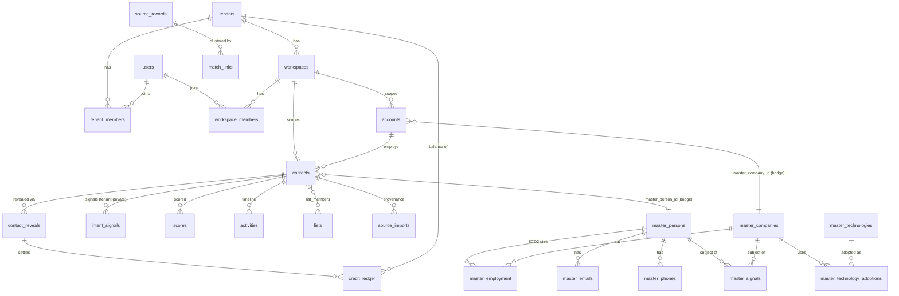

# 32 — Database Audit → Frontend & API Plan

> **Status:** Audit complete (2026-08-11); plan awaiting human confirmation. **No implementation has
> started** — per the pre-build protocol, code follows only after this plan is confirmed.
> **Method:** full read of `packages/db/src/schema/` (51 files), all 107 migrations, all 48 RLS
> files, all 128 repositories, the seven tenancy seams, every `apps/api` route file, `apps/workers`
> queue registry, and both frontend apps' route/feature trees. Nothing below is assumed from the
> planning corpus — everything was verified against code, and where the corpus and code diverge the
> divergence is flagged.
>
> **Outcome anchors:** the actionable work in this plan advances [S-10] (confidence visible at a
> glance), [S-13] (fast job-change detection), [S-09] (minimize person-left-company likelihood),
> [A-01] (provenance + lawful basis on every field), [A-02] (erasure reach), and [S-00]-class
> correctness/consistency debt. Items serving no listed outcome are **flagged for a human
> decision, not scheduled** (CLAUDE.md rule 1).

---

## 1. Current database audit

### 1.1 Shape and conventions

- **152 tables**: 131 in `public` + 21 in the `forge` schema. 107 migrations
  (`0000`–`0107`; see §9.1 for numbering defects). 48 RLS policy files.
- **PK idiom:** `uuid_generate_v7()` (time-sortable) everywhere; partitioned tables use composite
  PKs `(id, <partition_key>)`.
- **No `pgEnum` anywhere** — every closed vocabulary is `varchar` + `CHECK` (~150 constraints), so
  value sets evolve without `ALTER TYPE`. Load-bearing shared vocabularies (email status, seniority,
  outreach status, lawful basis, source type, merge mode) are re-declared per file by convention.
- **PII discipline:** `bytea` ciphertext columns (`email_enc`, `phone_enc`, `body_enc`, OAuth
  tokens) paired with HMAC blind-index companions; `citext` for emails/domains/slugs. The
  canonical normalize/blind-index/content-hash implementations live in `@leadwolf/identity`
  (post-migration, parity-tested against Forge).
- **Partitioned (monthly range):** `audit_log` (0086), `activities` (0085), `provenance_event`
  (0089), `master_signals` (0103), `master_technology_adoptions` (0101), `usage_event` (0092),
  plus `email_event` retention sweeps. `partition_sweep` keeps partitions ahead of the calendar.

### 1.2 The three data planes

| Plane | Tables | Tenancy | Isolation mechanism |
|---|---|---|---|
| **Layer 1 — tenant overlay** | ~96 (contacts, accounts, lists, reveals, credits, email, CRM sync, imports, …) | `tenant_id` + `workspace_id` NOT NULL | RLS `ENABLE`+`FORCE`, one `FOR ALL` policy per table on `app.current_tenant_id` / `app.current_workspace_id` GUCs (NULLIF idiom — unset fails closed), reached via `withTenantTx` under the non-BYPASSRLS `leadwolf_app` role |
| **Layer 0 — shared master graph** | ~25 (`master_*`, `source_records`, `match_links`, `provenance_event`, `projection_outbox`) | **none, by design** | Structural: `REVOKE` from `leadwolf_app` (explicit + a `^master_` catch-all loop in `applyMigrations.ts`), reachable only via `withErTx` (`leadwolf_er`). No RLS possible — no tenancy column exists |
| **Forge plane** | 21 in the `forge` schema | `target_tenant_id` exists but is **not filtered on** | Separate schema + `leadwolf_forge` role + separate connection pool. A shared, staff-operated plane — cross-tenant by declared design, audited instead of scoped |

Platform-ops tables (`platform_staff`, `plan_templates`, `credit_packs`, `approval_requests`, …)
are deny-all to `leadwolf_app` (RLS enabled with **no policy** + explicit REVOKE) and reached only
via the audited `withPlatformTx` / unaudited-read `withPlatformReadTx` owner-connection seams.

**Bridges between planes:** exactly two nullable FK columns — `contacts.master_person_id` and
`accounts.master_company_id` (both indexed partially, both deliberately without `onDelete` so ER
merges re-point rather than cascade). `contacts` also carries the inverse work-queue index
`idx_contacts_unresolved` for master backfill. `provenance_event.contributor_ref` is an opaque
uuid resolvable only inside `forge.contributor` — this is the C-02 wall (contributor identity
never crosses into the tenant plane).

### 1.3 What the recent update added (the Layer-0 intelligence merge)

The last ~15 migrations (0093–0107) are the intelligence-platform Layer-0 programme:

- **`master_signals` + `master_signal_types`** — canonical, partitioned event store; vocabulary-
  as-rows with per-type `half_life_days`. Polymorphic subject (person or company). The tenant-
  private counterpart `intent_signals` remains in `intel.ts`.
- **`master_technologies` / categories / aliases / vendors / features + `master_technology_adoptions`**
  — the technology catalog and the partitioned company↔technology detection-episode edge. Vendors
  are SCD2 edges into `master_companies`.
- **`master_company_locations` / `_contact_points` / `_funding` + `master_person_identifiers`** —
  company-completeness tables; person identifiers are the global ER join key.
- **`master_confidence_policy`** — parameterizes
  `confidence = base(source_weight) × corroboration(source_count) × decay(age, half_life)`, keyed
  `(field, source_type)` with `'*'` wildcards.
- **`provenance_event`** — the append-only field-grain assertion spine (trigger refuses mutation
  for every role including the owner). Every ingestion path writes here (rule 5).
- Plus: employment SCD2 loosening (0105), ER merge tombstones (0096), block-key indexes (0106),
  contribution controls (0097 — SQL-only, see §9.2), suppression match indexes (0094).

**Operational status of the new surface:** the schema, repositories (`masterSignalsRepository`,
`masterTechnologyRepository`, `masterCompanyDetailRepository`), and the `job_change_sweep` worker
exist; the confidence fold (`packages/core/src/prospect/confidence.ts`, `badgeV1.ts`,
`packages/types/src/confidence.ts`) is complete and tested. But: `master_technology_adoptions` has
**no producer wired**, the three new Layer-0 repositories have **zero production callers**, and the
intelligence data has almost **no API or UI surface** (§3/§4). The gap between "built and correct"
and "reachable by a user" is the central product finding of this audit.

### 1.4 Isolation coverage — verdict

RLS coverage over the tenant plane is **complete and uniformly patterned** (scalar-subquery GUC
predicate, documented deviations for owner-write tables). The Layer-0 REVOKE wall is real and
itest-pinned. The genuine gaps are:

1. **`users` and `user_sessions` have neither RLS nor a REVOKE** — `leadwolf_app` holds
   unrestricted DML on the global identity table (including `password_hash`,
   `is_platform_admin`) and on all sessions cross-tenant. Scoping is application-layer only.
   This is the single largest divergence from the "enforced at the database" posture. (§9.3-1)
2. **~40 raw-owner-connection call sites inside 18 repositories** bypass every seam (backfill
   sweeps on PII tables, the retention purge, cross-tenant scheduler claims), and workers open
   `db.transaction` directly for money/lifecycle writes with no `platform_audit_log` row. The
   staff console honors the audited-privileged-access invariant; the worker fleet does not. (§6.4)

### 1.5 Does the schema support current + planned functionality?

**Yes, with room to spare.** The audited schema supports everything the current frontends do, plus
substantial built-but-unsurfaced capability (confidence, signals, technology, outcome metrics,
contribution controls). No planned feature in the current outcome set requires a new table. The
defects found are consistency/hardening issues (§9), not missing structure. Fraud (Phase 3) and
decay-curve automation (Phase 2 tail) remain unbuilt as documented in CLAUDE.md — correctly so.

---

## 2. Entity & relationship overview

**Domain groups** (schema file → tables, full column detail lives in the schema files themselves):

| Domain | Tables | Notes |
|---|---|---|
| Tenancy & auth | `tenants`, `users`, `tenant_members`, `workspaces`, `workspace_members`, `platform_staff`, `tenant_domains`, `user_sessions`, MFA/passkey/token tables, `auth_policies` (+ legacy `tenant_auth_policies`), `invitations` | Global identity + tenant membership (ADR-0019); auth-origin tables REVOKEd from app role |
| Prospect overlay | `accounts`, `contacts`, `source_imports`, `contact_emails/phones` (dark dual-write), `account_domains/locations` (dark), `custom_field_definitions`, `tags`/`record_tags`, `pipeline_stages`, `lists`/`list_members`, `saved_searches`, `sales_nav_links`, `teams` | Masked-until-reveal; 4 partial dedup uniques per workspace; `field_provenance` jsonb + pure fold in core |
| Intelligence | `scores`, `intent_signals`, `provider_calls`, `provider_configs` (L1); all `master_*` + `provenance_event` + `match_links` + `source_records` (L0) | See §1.3 |
| Money | `contact_reveals`, `credit_ledger`, `purchases`, `stripe_customers`, `subscriptions`, `billing_cycles`, `credit_packs`, `plan_templates`, `entitlement`, `usage_event`, `idempotency_keys`, `reveal_jobs` | Reserve-then-settle lease; `billing_recon_sweep` asserts ledger↔balance |
| Jobs | `import_jobs/chunks/rows`, `enrichment_jobs/*`, `reveal_jobs/*`, `import_mapping_templates`, `scheduled_imports`, `verification_jobs`, `data_quality_snapshots` | Shared `jobVisibility` predicate applied in-repository |
| Outreach & email | `outreach_sequences/steps/log`, `activities`, `email.*` (8 tables), `notifications` | M9 engine + M12 email extension |
| CRM sync | 9 `crm_*` tables | Dark behind `CRM_SYNC_ENABLED` |
| Compliance | `suppression_list`, `consent_records`, `dsar_requests`, `retention_*`, `sub_processors`, `audit_log`, `platform_audit_log` | DSAR erasure reaches `master_signals` since c84a172e |
| Platform ops | `impersonation_sessions`, `jit_elevations`, `support_notes`, `account_holds`, `announcements`, `approval_requests`, `feature_flags`/`tenant_feature_flags`, `validation_rules` | Staff-only plane |
| Outboxes | `event_outbox`, `worker_outbox`, `projection_outbox`, `processed_sync_events` | Three near-identical relays — §9.4-3 |
| Forge | 21 tables: `raw_captures → parsed_records → extraction_* → verified_records → sync_*`, `contributor`, governance | Bronze→silver→gold medallion, four-eyes promotion |

---

## 3. Frontend architecture & page requirements

### 3.1 As-built conventions (verified — supersedes older notes)

- **Three layers, both apps:** transport = `fetchWithAuth` (in-memory Bearer, PKCE, silent
  refresh, from `packages/auth-client`); typed client = one `api.ts` per feature slice
  (components never call `fetch`); render = `StateSwitch` (error → loading → empty → children;
  77 web files, 43 admin files).
- **Caching diverges by app:** `apps/web` uses **TanStack Query v5** (78 files;
  `QueryClientProvider` in `providers.tsx`; cross-cutting `sharedKeys` in `lib/queryKeys.ts`;
  per-feature `keys.ts`; `useInfiniteQuery` + `nextCursor`). `apps/admin` is deliberately vanilla
  (`useState` triple + `useCallback` reload) with **no query cache** — every navigation refetches.
- **State residency:** URL is source of truth for search (`searchUrlState.ts`, shareable/
  refresh-safe); `?tab=` via `history.replaceState`; React state for drawers/bulk-selection/
  wizards; contexts for density/toast/reveal; localStorage for sidebar pin, density, recent
  searches; window events (`workspace:changed`, `reveal:changed`, `command:open`) as the
  cross-tree bus.
- **Pagination:** cursor/keyset everywhere; "Load more" button; `PAGE_SIZE = 50`; the shared
  `Pagination` component never deep-offsets. **Tables:** `DataTable` window-virtualizes above
  100 rows. **Realtime:** fetch-based SSE reader exists but is dark (`REALTIME_SSE_ENABLED`);
  polling + query invalidation is authoritative.
- **Design system:** `@leadwolf/ui` (27 files, `--tp-*` tokens, light-only, WCAG-corrected danger
  ink); `packages/app-shell` owns rail/topbar/palette and deliberately owns no auth.

### 3.2 Page inventory and data dependencies (as built)

| Surface | Route(s) | Backing entities | Primary endpoints |
|---|---|---|---|
| Home cockpit | `/home` | usage_event, credit_ledger, reveal/import/enrichment jobs, data_quality_snapshots | `/home/summary` (one aggregated call, ETag + 30s memo), `/home/data-quality[...]` |
| **Prospect** (flagship) | `/prospect` (+ `?contact=` drawer) | contacts, accounts, scores, tags, pipeline_stages, saved_searches, custom fields, reveals, credit balance | `POST /search/contacts`, `/search/{facets,suggest,count}`, `/account-search/*`, `/ai-search`, `/contacts/:id/{reveal,revealed,scores,activities}`, `/contacts/revealed/batch`, `/contacts/bulk/*`, reveal jobs |
| Lists | `/lists`, `/lists/[id]` | lists, list_members (reuses prospect grid + bulk bar) | `/lists`, `/lists/:id/members` |
| Imports | `/imports`, `/imports/new`, `/imports/[jobId]` | import_jobs trio, import_mapping_templates, drafts | `/imports*` (three parallel clients — §3.4) |
| Sequences | `/sequences` | outreach_sequences/steps/log, email_template(+versions) | `/outreach/*`, `/templates/*` |
| Inbox | `/inbox` | email_thread/message, tasks | `/inbox*`, `/tasks*` |
| Reports | `/reports` | usage_event, credit_ledger, email_event, scores | `/reports/summary`, `/credits/usage`, `/email/analytics` |
| Data health | `/data-health` | data_quality_snapshots, verification_jobs, retention_runs, duplicate pairs | `/home/data-quality/*`, `/contacts/duplicates` |
| Settings (17 routes) | `/settings/*` | policies, members, teams, custom fields, mailboxes, suppression, SSO/SCIM, billing | per-slice |
| Billing hub | `/settings/…?tab=` ×6 | credit_ledger, subscriptions, plan/pack catalogs | `/credits/*` (Invoices/Subscription tabs are honest placeholders) |
| Admin (19 destinations) | `/tenants`, `/users`, `/billing`, `/plans`, `/pricing`, `/provider-configs`, `/feature-flags`, `/retention`, `/staff`, `/compliance`, `/audit-log`, `/data-ops`, `/imports`, `/data-quality`, `/trust-abuse`, `/ai-usage`, `/system-health`, … | platform-ops plane via `/admin/*` only | every mutation audited + capability-gated server-side |

Initial-vs-on-demand is already disciplined: grids load masked rows (50/page); the quick-view
drawer is light; `RecordDetail` lazy-fetches scores/activities/custom-fields on open;
revealed PII hydrates via `POST /contacts/revealed/batch` per page; bulk flows are
estimate → confirm → poll job → download.

### 3.3 Planned frontend work (grounded in the audit)

**F1 — Surface the confidence badge everywhere records render. [S-10]**
The band model (`confidenceBand` → high/medium/low/unverified, decay, pin-floor) is complete and
tested but renders in exactly one place (`RevealDialog`). Plan: add the band + verified-recency
chip to (a) prospect grid rows (replacing the coarser ✓/?/— email glyph as the primary signal),
(b) `QuickViewDrawer`, (c) `RecordDetail`, (d) `AccountDetailDrawer`, (e) list-member rows —
band + "verified N d ago", never the raw decimal. Depends on API change A1 (§4.3).
*Acceptance (outcome metric):* badge visible on 100% of rendered result rows with zero extra
per-row requests; search p95 unchanged (±10%).

**F2 — Job-change visibility. [S-13][S-09]**
Today a `job_change` lands only as a generic notification row. Plan: (a) per-row "changed jobs"
indicator on grid + both drawers when an unresolved job-change signal exists; (b) a "Job changes"
tab on `/data-health` listing affected saved/list contacts with successor suggestion and
re-verify / archive / keep actions. Depends on A2/A3. No new nav destination (UI-consolidation
rule — it's a Data Health variant).
*Acceptance:* job-change signal → visible in UI ≤1 sweep cycle; every affected saved contact
addressable from the tab.

**F3 — Deep-linkable record view. [S-13 support]**
Job-change notifications deep-link to `/prospect?contact=<id>`; keep that as the canonical
address (no new route — consolidation rule) but make it robust: on load with `?contact=`, the
drawer must open even when the contact isn't in the current result page (fetch by id via A4).

**F4 — Contract-shape normalization. DONE, but not as scoped.** Both halves as written were
wrong, and the duplication that mattered was one neither half named.

- `MaybeList<T>` does **not** belong in `@leadwolf/types`. No endpoint returns `{items, available}`
  — the server returns a list or a 404/501, and `available` is synthesized client-side from the
  status. Putting it in the shared contract package would assert something untrue about the wire
  format. It now lives in `apps/web/src/lib/maybeList.ts`, a web concern in a web location.
- The three import clients should **not** be consolidated. `apiV2.ts` says in its own header that
  it is "separate from the legacy api.ts so the two transport contracts (legacy poll vs v2 durable)
  stay visibly distinct" — they share no function names and return different types. There is also
  nothing to deprecate: all three are live, and the slice barrel correctly exports only components,
  so a barrel over the data layer would *enlarge* the public surface. Left alone.
- **What was actually duplicated:** `problemMessage` existed as **24 byte-identical private
  copies**, and the 404/501 predicate as **11 more** under two names (`notBuilt` ×10,
  `isUnavailable` ×1). `problemMessage` decides what the app *says* when something fails, so any
  improvement to it reached one slice in twenty-four and the same failure was explained differently
  depending on the screen. Both now have one definition (`lib/problemMessage.ts`,
  `lib/maybeList.ts`); 29 files, −151 lines net.

**F5 — Orphaned routes decision. STILL A HUMAN DECISION, but one of the two options as written does
not exist.** Verified state: `/crm-sync` exists in `apps/web` and `apps/admin`, the feature slice is
complete (`api.ts`, four components, hooks, keys, CSS module), and a repo-wide search finds **zero**
references to the path outside the route file and the slice itself — no nav entry, no palette entry,
no link from settings. Next.js still serves the URL, so it is reachable by typing it.

- **"Wire it behind the `CRM_SYNC_ENABLED` flag surface" is not implementable as described.**
  `apps/web` has **no per-tenant flag reader** — `components/shell/navConfig.ts` says so at the
  `IMPORTS_DESTINATION` note, where the same thing was wanted for the IMPORT_V2 dual gate and could not
  be done. The shipped precedent is the opposite of strict-dark nav: show the rail entry to everyone and
  let the page degrade to an honest "not enabled yet" state off the API's 404.
- `/crm-sync` does **not** currently degrade that way. It renders whatever `problemMessage` returns as a
  footnote, so with the backend dark it reads as a broken page rather than an unreleased one.

Accurate options, in increasing cost:
1. **Delete the pages + slice** (removal-cleanup rule), restore when the flag flips. Cheapest, and what
   this audit originally leaned toward. Destructive, so it needs the human call.
2. **Leave it** — dead but URL-reachable. Free, but anyone who reaches it sees a page that looks broken.
3. **Rail it on the IMPORTS precedent** — add to `DESTINATIONS` and first replace the raw-error footnote
   with a purpose-built "not enabled yet" state. This surfaces an unreleased feature to every user, which
   is a product decision, not a cleanup.

Not done either way: options 1 and 3 are both product calls, and doing option 3's UI work before the
decision would be wasted if the answer is 1.

**Flagged, not scheduled** (no current-outcome backing — need a human decision):
- Technology-stack panel on account drawer: the catalog/adoption schema has **no producer**, so
  any UI would render emptiness. Defer until an adoption producer ships; revisit outcome fit then.
- Onboarding/first-run in `apps/web` (none exists) — not in the current outcome set.
- Reports "intent" section renders enum values 8 of which can never populate (X-04 deferred,
  LinkedIn-derived forbidden by rule 4) — recommend limiting the section to `job_change` (the one
  live producer) so the UI stops implying coverage that cannot exist. Small, honest fix; touches
  copy only.
- Admin query cache (every nav refetches) — QoL only; keep vanilla unless staff complain.

---

## 4. API endpoint specification

### 4.1 As-built contract (verified)

- **Auth:** Bearer JWT only (JWKS-verified); five principals (user session, extension-scoped,
  platform staff via `pa` claim + capability/staff-role, machine `master-sync`, SCIM token) plus
  signature-only webhook routes. Tenant context comes **only** from claims (`tid`/`wid`) —
  never from body/query — then `withTenantTx` sets the RLS GUCs.
- **Errors:** RFC 9457 `application/problem+json` via `AppError.toProblemDetails`, `requestId`
  correlation, PII-safe logging (query strings dropped).
- **Validation:** Zod 3.23 schemas centralized in `@leadwolf/types`, `safeParse` at the edge,
  response DTOs frequently re-validated on egress.
- **~200 endpoints** across ~50 mounts (full inventory retained in the audit working notes;
  the table in §3.2 maps the frontend-facing set). Workers: ~45 queues (9 always-on event
  queues, 6 CRM lanes, ~18 leader-locked sweeps, 9 env-gated).

### 4.2 Contract debt to close (each is small; together they harden the whole surface)

| # | Defect (evidence) | Fix |
|---|---|---|
| C1 | **CRM queue-name divergence — likely broken in prod.** API enqueues `crm-sync-*` (hyphens, from `@leadwolf/types/crm.ts`); workers consume `crm_sync_*` (underscores, locally redefined in `apps/workers/src/queues/crmSync.ts:44`). Nothing consumes what the API produces. | Single source: workers import the `@leadwolf/types` constants; pick the underscore names (matches `register.ts:778` prefix check); delete the local redefinition. Add a queue-name parity test. [S-00] |
| C2 | **25 routers with ungated mutations** — a `viewer` can create/delete lists, tags, webhooks, saved searches, custom-field values, pipeline stages, templates, import-job mutations (`lists/routes.ts:101`, `tags/routes.ts:74`, `webhooks/routes.ts:132`, `import/routes.ts:1454`, …). | Router-level `requireRole("owner","admin","member")` on every mutating route; keep reads at any-role. One slice per router; add the missing per-endpoint isolation tests. [S-00][C-02] |
| C3 | `PATCH /admin/crm/dead-letters/:id` is a cross-tenant write behind only the `pa` claim (`admin/routes.ts:153`). | Add `requireCapability("data:manage")`. |
| C4 | No `app.notFound()` — 404s return Hono plain text, breaking RFC 9457 exactly where clients hit it (forge-api does it right). | Register a problem+json notFound handler. |
| C5 | Idempotency implemented 4 ways; `POST /credits/checkout` + `/credits/subscribe` have **none**. | Adopt the shared middleware on all money/create routes; keep DB-unique as defence-in-depth (already the pattern for imports). |
| C6 | No shared pagination transport; 9+ endpoints return unbounded arrays (`/tags`, `/custom-fields`, `/saved-searches`, `/teams`, `/workspaces`, `/crm/connections`, `/contacts/reveal-jobs`, `/enrichment/jobs`, `/pipeline-stages`); ~~`GET /contacts` caps at 500 with no cursor~~ (**wrong — no such endpoint; see §9B**). | Add `lib/pagination.ts` (Zod query schema + hard max + flat `nextCursor` envelope). Normalize the unbounded lists now, coordinated with the web slices in the same deploy (pre-production — cheap now, breaking later). |
| ~~C7~~ **DONE** | `requireWorkspace` copy-pasted 3× + inlined ~40×. | Promoted to one helper in `middleware/tenancy.ts` (one signature — the three copies had two incompatible ones). All **50** inline sites migrated across 18 files, −62 lines; the only remaining `if (!workspaceId) throw` is the helper's own body. Five bare `ForbiddenError("no_workspace")` sites gained the default detail — a response-body change, and an improvement: a 403 with no `detail` tells the caller nothing. |
| C8 | Two parallel staff-authz systems (`requireStaffRole` vs `requireCapability`) mid-migration. | Finish the capability migration; delete `requireStaffRole` per its own file comment. |
| ~~C9~~ **DONE** | Extension allow-list grants `GET /contacts/:id` which does not exist. | **Entry removed** (not deferred to A4). Verified first: no bare `GET /:id` exists under `/contacts` anywhere in `apps/api`, and `background/api/client.ts` calls exactly two contact routes — the reveal POST and `by-linkedin` — both separately granted. Left in place it would have pre-authorized contact-detail for extension tokens the moment someone built it, without the deliberate review the allow-list exists to force. Re-add it as part of building A4. The drift test that derives the list from the extension client still passes, which is what proves the grant was unused. |
| C10 | `POST /master-sync` is a permanently-dark orphaned second write path into the master graph (superseded by ADR-0047 in-process promotion; `app.ts:200` says so itself). | Delete route + `syncPrincipal` wiring; keep `forgeSyncRepository.applyItem` (the live in-process path). |
| ~~C11~~ **observability DONE; fail-closed decision still open** | Fail-open trio: revocation check, entitlement gate, and both rate limiters all fail open on Redis outage — leaving only credit balance guarding the money path. | Fail-open behavior **unchanged** (availability is the right call). The state is now observable: `guardDegradedLog` gives every guard one marker shape, so a single expression (`] DEGRADED `) catches all four and two firing in a window IS the composite condition — defined in [19 §3](./19-observability-reliability.md). The revocation guard already had its own marker (AUTH-066) and keeps it; its shape is test-pinned. Markers are throttled (10s/module) because they fire at request rate during an outage. **No response header** — it would have to be set per-guard, and the two limiters live in `packages/auth` with no `Context`, so coverage would be partial and a missing header would read as "guards healthy", which is worse than none. **Failing closed for `revealRateLimit` remains a human decision** and is not made here. |

### 4.3 New endpoints (the only genuinely new API surface — all read-only, all tenant-scoped)

**A1 — Confidence on search rows (change to existing endpoints, not a new route). [S-10]**
`POST /api/v1/search/contacts`, `GET /lists/:id/members`, `POST /contacts/revealed/batch`
response rows gain `confidenceBand: "high"|"medium"|"low"|"unverified"` and keep
`lastVerifiedAt`. **Implementation constraint:** `provenanceBadgeRepository.badgeFor()` per row
would N+1 the hot path; compute band in-query from already-denormalized inputs
(`last_verified_at`, corroboration count already folded into `field_provenance`) or maintain a
denormalized `confidence_band` column updated by the write paths that already touch provenance
(reveal, enrichment, reverification, job-change). Choose in the implementation slice with
truepoint-data + platform open; acceptance metric fixed either way (§3.3-F1). Validation: none
(additive response field). Errors: unchanged. Tables: `contacts` (+ provenance fold inputs).

**A2 — `GET /api/v1/contacts/:id/signals` [S-13]**
Purpose: tenant-private intent signals for one contact (initially `job_change` — the only
produced type; the response schema whitelists produced types so the API never implies X-04).
Auth: session, any workspace role; RLS-scoped via claims. Request: `:id` uuid; `?limit` ≤50,
`?cursor` keyset `(created_at, id)`. Response: `{ signals: [{id, signalType, weight, observedAt,
metadata}], nextCursor }`. Tables: `intent_signals` (needs the §9.3-2 index first). Errors:
401 / 404 (not found and not-yours indistinguishable). Repository exists
(`intentSignalRepository.recentForContact`) — route + Zod schema only.

**A3 — `GET /api/v1/data-health/job-changes` [S-13][S-09]**
Purpose: the feed behind §3.3-F2 — saved/list contacts with unresolved job-change signals +
successor suggestion. Auth: session, any role. Request: `?limit` ≤50, `?cursor`. Response rows:
`{contactId, name (masked rules as grid), accountName, observedAt, successorSuggestion?}`.
Tables: `intent_signals` ⋈ `contacts` ⋈ `list_members` (visibility via the existing
owner-scope search predicate). Joins run inside `withTenantTx`; core helper `jobChange.ts` /
`successor.ts` already exist.

**A4 — `GET /api/v1/contacts/:id` [S-10][S-13 support]**
Purpose: single masked-contact read (drawer deep-link robustness; the extension allow-list
already anticipated it; today the drawer must abuse `/revealed`). Auth: session **and**
extension scope; any role. Response: the same masked DTO shape as a search row + `confidenceBand`
+ latest score summary. Tables: `contacts` (+ `accounts` name join). Errors: 401/404. Explicitly
**masked** — PII continues to require the reveal path (no compliance-surface change; the DTO
reuses the existing masked-row schema, so no new personal-data exposure — compliance checklist
impact: none beyond existing search rows).

No other new endpoints. Everything else the frontend plan needs already exists.

### 4.4 Response-shaping rule held

All four A-items are additive DTO fields or new read routes returning already-authorized shapes
from shared Zod schemas in `@leadwolf/types` first (contract-first rule). None expose Layer-0
rows directly — tenant surfaces read the overlay + tenant-private signals only, preserving the
C-02 wall and the entitlement/credit boundaries.

---

## 5. Data flow — database → API → frontend

**Read path.** JWT (from `apps/auth` via PKCE) → `authn` verifies via JWKS → `tenancy` pins
`tid`/`wid` from claims → route validates query with Zod → repository opens `withTenantTx`
(transaction-local GUCs; RLS fails closed) → core composes pure logic (confidence fold, masking)
→ route shapes the response DTO (explicit schema, never raw rows) → web caches in TanStack Query
under hierarchical keys; `StateSwitch` renders loading/empty/error/data; cursor pages append via
`useInfiniteQuery`.

**Write path.** Mutation hook → `fetchWithAuth` POST with `Idempotency-Key` (after C5:
uniformly) → role gate (after C2: uniformly) → Zod body validation → repository write inside
`withTenantTx` (+ audit_log row where the action is audited; `usage_event` append where metered)
→ transactional outbox row where the write fans out → response → web invalidates the feature's
query keys (admin: `reload()`).

**Async/job pattern** (imports, bulk enrich/reveal, exports): create job (idempotent) →
estimate → explicit **confirm** gate on money paths (lease credits reserve-then-settle) → BullMQ
worker drives chunks (idempotent, DLQ'd, `instrument()`-wrapped) → frontend polls job status
(TanStack refetch; SSE invalidation once `REALTIME_SSE_ENABLED`) → signed download URL.

**Intelligence loop (the recent addition).** Ingestion paths append `source_records` +
`provenance_event` (rule 5) via `withErTx` → ER blocks/scores/links clusters (`er_sweep`,
shadow) → projector drains `projection_outbox` into shadow survivorship → tenant bridges
(`master_person_id`) backfilled by `master_backfill` → `job_change_sweep` compares employment
edges against saved overlay contacts → writes tenant-private `intent_signals` + notifications →
(this plan) A2/A3 read them, A1 exposes the confidence fold on every row.

**Caching layers:** TanStack client cache (web) → API Redis memos (home/data-quality, 30s,
ETag) + `roleCache` → replica seam (`withReplicaTx`, today used by exactly one repository —
underused, §8) → Postgres. Invalidation is mutation-keyed (shared `sharedKeys` for the credit
pill and notifications).

**Error handling:** one problem+json envelope end-to-end; web maps it to `ErrorState` (loads)
or destructive toast (actions); admin surfaces server 403s as toasts and never assumes
authorization client-side.

---

## 6. Authentication & authorization requirements

| Layer | Mechanism (as built) | Requirement going forward |
|---|---|---|
| Identity | `apps/auth` IdP, PKCE, in-memory access token, rotating refresh on auth origin | unchanged |
| API principal | Bearer JWT, JWKS; extension tokens scope-confined by allow-list | flip `EXTENSION_SCOPE_ENFORCE` default to enforce once C9 lands |
| Tenant context | claims-only (`tid`/`wid`) → RLS GUCs | never accept tenant/workspace ids from request payloads (already true — keep it tested) |
| Workspace roles | `requireRole` (owner/admin/member/viewer, Redis-cachable) | close C2 — every mutation gated; viewer is read-only everywhere |
| Org roles | `requireOrgRole` (security/compliance admin, owner) | unchanged |
| Staff | `pa` claim + capability matrix, audited `withPlatformTx` | finish C8 migration; C3 |
| Machine | `master-sync` scope | delete with C10 |
| SCIM | token table, disjoint `/scim/v2` mount | unchanged |

**Gaps to close (from the seam audit):**
1. **Worker-fleet audit gap** — `withPlatformTx` has 103 call sites in `apps/api` and **zero** in
   `apps/workers`; dunning/suspend, ledger backfill, grants, retention purge, scheduler claims run
   on raw owner `db.transaction` with no audit row (`subscriptionDunningSweep.ts:37`,
   `ledgerBackfillSweep.ts:43`, `retentionScanRepository.ts:409`, `schedulerRepository.ts:32`,
   `lowBalanceNotifierSweep.ts:52` — the last one *writes tenant rows* on the owner connection).
   Fix: introduce a `withSystemTx(actor:"system:<queue>", action, fn)` audited seam (same
   audit-in-same-tx contract as `withPlatformTx`) and migrate the sweeps; then **stop exporting
   the raw `db` handle** from `packages/db` (the root enabler; `ownerClient` is already correctly
   unexported). [A-01]
2. **`users`/`user_sessions` posture** (§1.4-1): decide between (a) RLS policies keyed on
   `user_id = current_setting('app.current_user_id')` for the session-management paths + REVOKE
   the rest, or (b) move all access behind the auth service and REVOKE from `leadwolf_app` like
   the other auth tables. (b) matches the existing pattern; requires rerouting the
   workspace-admin session views through privileged, audited reads. **Flagged for decision** —
   security-skill review required either way.
3. `instrumentation.ts:26` raw `SELECT 1` → use the existing `pingDb()`.

---

## 7. Validation & error-handling strategy

- **Single source of truth stays `@leadwolf/types` Zod schemas** — every new/changed endpoint in
  §4.3 lands schema-first; clients derive types from the same schemas (no drift by construction).
- **Boundary validation everywhere:** params/query/body `safeParse` → `ValidationError` → 400
  problem+json; semantic failures 422; not-found-vs-not-yours indistinguishable 404 (keep).
- **Egress validation:** keep the response `.parse()` habit on aggregate endpoints — it has
  already caught shape drift; extend to A1–A4.
- **Uniform 404** (C4) and **uniform idempotency** (C5) close the two conventions currently
  broken at the edges.
- **Frontend:** `StateSwitch` ladder everywhere (already uniform); failed loads → `ErrorState`
  with retry; failed actions → destructive toast preserving user input; 401 → silent refresh then
  redirect to auth origin (existing `recoveryActionFor` path).
- **Workers:** keep `instrument()` + DLQ pattern; C1 adds the queue-name parity test so a
  producer/consumer split can never silently no-op again.

---

## 8. Performance & scalability considerations

1. **Missing FK/RLS-predicate indexes are the top DB risk** (full list §9.3-2): `scores`,
   `intent_signals`, `consent_records` have **zero** secondary indexes; `master_emails`/
   `master_phones` person-FKs unindexed (DSAR person-delete scans tables sized for billions of
   rows); `tenant_members`/`workspace_members` lack the `user_id`-leading index the login path
   wants; `record_tags` can't serve "tags for this record". A2/A3 must not ship before the
   `intent_signals` index exists.
2. **Unbounded list endpoints** (C6) are correctness-at-scale debt; the repository layer already
   does keyset cursors uniformly — only the transport is inconsistent.
3. **Replica seam is built and unused** (one adopter). Adopt `withReplicaTx` for the staleness-
   tolerant aggregates that match its own stated contract: `emailAnalyticsRepository`,
   `platformBillingReads` trends, `dataQualitySnapshotRepository.listRecent`, facet counts.
4. **Redis fail-open blast radius** (C11): one outage opens revocation + entitlements + both
   throttles simultaneously; at minimum make the state observable.
5. **Partitioning is healthy** (six partitioned families + sweep); keep new time-series tables on
   the same pattern (hand-authored migrations — drizzle-kit generate is unsafe here, §9.1).
6. **Frontend scale posture is good:** virtualized tables >100 rows, 50-row pages, one
   aggregated home call, ETag + 30s memos. The admin app's no-cache refetching is acceptable at
   staff volumes.
7. **A1 must be O(page), not O(row) queries** — the badge computation strategy (in-query vs
   denormalized column) is the one real performance decision in this plan; both options keep the
   hot path at one query.

---

## 9. Identified issues & recommended fixes (consolidated register)

Severities: **P0** correctness/security now · **P1** structural debt, fix this cycle · **P2**
hygiene, batch opportunistically. DB items require hand-authored migrations verified in CI
(Docker Testcontainers) — `drizzle-kit generate` is unusable against this snapshot chain.

### 9.1 Migration chain
- **P1** Duplicate number `0053` (×2 files), gaps `0082`/`0098`, 41 snapshots for 107 migrations.
  Fix: journal-integrity check in CI (fail on dup/gap going forward); document the rebaseline
  (0095) as the snapshot epoch; do **not** renumber history.

### 9.2 Schema/type-system integrity
- **P1** Four tables exist only in raw SQL — `contribution_policy`, `contribution_exclusion`,
  `crm_object_contribution` (0097), `platform_audit_log` (created inside `rls/platform.sql`, a
  layering violation). Fix: add `pgTable` definitions (barrel-excluded like the other
  hand-authored families); move `platform_audit_log` DDL into a numbered migration.
- **P1** Layer-0 table objects in TS are documentation-only (repos use raw SQL; zero non-schema
  imports) — nothing validates TS against shipped DDL. Fix: one schema-parity itest per
  hand-authored family (information_schema vs pgTable definition), or migrate the raw-SQL repos
  to the table objects where partitioning allows.
- **P2** `trusted_devices` confirmed fully unused; `outcomeMetricsRepository`,
  `authAllowedOriginsRepository`, `masterCompanyDetailRepository`, `leaseAccounting`,
  `subscriptionResetMath` exported but consumed by nobody (the last two aren't even in the
  barrel and their header comments claim callers that don't exist). Fix: wire or delete per the
  over-engineering-sweep discipline (verify in-package first); correct the lying headers now.

### 9.3 Indexes & constraints
- **P0** Missing indexes (full audited list): `scores.contact_id`, `intent_signals.contact_id`,
  `consent_records.(workspace_id, contact_id)`, `master_emails.master_person_id`,
  `master_phones.master_person_id`, `match_links.source_record_id`,
  `source_imports.contact_id`, `tenant_members.user_id`, `workspace_members.user_id`,
  `record_tags.(entity, record_id)`, `account_locations.account_id`,
  `outreach_log.contact_id`, `credit_ledger.{reveal_id,purchase_id}`,
  `email_thread.contact_id`, `contacts.pipeline_stage_id`, `saved_searches.workspace_id`,
  `master_technology_aliases.technology_id`. One hand-authored migration, CI-verified. [S-00]
- **P0** `scheduled_imports.target_list_id` comment promises `SET NULL` but declares **no FK** —
  a deleted list leaves a dangling id handed to `submitCopyImport`. Fix: add the FK
  (`ON DELETE SET NULL`) + backfill-null orphans in the same migration.
- **P1** `auth.ts` bare-uuid pattern (9 columns incl. `tenant_members.last_workspace_id`, read
  by login): add FKs with `SET NULL` to match the rest of the codebase, or document each as
  deliberate.
- **P1** `master_employment` post-0105 dedup hole is real but self-documented; accept for now,
  revisit with the ER programme.

### 9.4 Redundancy / two-sources-of-truth
- **P1** Three outbox tables (`event_outbox`, `worker_outbox`, `projection_outbox`) with
  near-identical shape; `worker_outbox` also omits FKs its sibling declares. Fix: converge on one
  relay with a `lane` discriminator **or** explicitly ratify the split in an ADR; either way add
  the missing FKs.
- **P1** Two OAuth PKCE/state tables (`crm_oauth_states`, `oauth_connect_state`) — same shape,
  different provider CHECK. Fix: merge into one with a wider vocabulary (low-risk; both are
  short-lived rows).
- **P1** Two retention-policy stores (`retention_policies`, `retention_class_policies`) — only
  the second has an execution path. Fix: migrate admin UI to class policies; delete
  `retention_policies` (decision + removal-cleanup pass).
- **P2** Legacy pairs kept alive: `tenant_members.is_tenant_owner` vs `org_role`;
  `users.is_platform_admin` vs `platform_staff`; `tenant_auth_policies` vs `auth_policies`.
  Each has a documented backfill — schedule the deletions.
- **P2** Three encodings of company technology (`accounts.technologies` jsonb — live;
  `master_companies.technographics` — dead; `master_technology_adoptions` — correct, unpopulated).
  Drop the dead `technographics` column; keep jsonb until the adoption producer ships.
- **P2** Plan/entitlement state across five stores; `subscriptions.plan_template_key` has no FK
  to `plan_templates.key`. Add the FK; leave the credits/entitlement non-reconciliation alone
  (deliberate, rule 7).

### 9.5 Compliance-relevant (rule 3 — each states its impact)
- **P0** `email_message` stores plaintext `snippet` (preview of the **encrypted** body),
  `from_addr`, `to_addrs[]` — the very values `contacts.email_enc` encrypts, and DSAR erasure
  keyed on blind indexes **cannot find them**. Impact: A-01/A-02 erasure completeness. Fix
  options (decision needed): (a) encrypt snippet + address columns and add blind indexes for the
  address fields; (b) include `email_message` cleartext columns in the DSAR fan-out via an
  address-match sweep. (a) is schema-consistent; recommend (a). Must pass the 09-compliance
  checklist before any migration.
- **P1** Suppression/DSAR reach for the (dark) channel child tables and `master_company_contact_points`
  is untested — add erasure-propagation itests before those flags flip on.

### 9.6 API/frontend layer (specified in §4.2/§3.3)
P0: C1 (CRM queues), C2 (role gates), C3, C5-money. P1: C4, C6, C7, C8, C9, C10, F4, F5.
P2: C11 observability, F-flagged items pending decisions.

---

## 9B. Corrections — findings this audit got WRONG (recorded during implementation)

Nine items in the register above did not survive contact with the code. They are listed here rather than
quietly edited, because the pattern in them is more useful than any single correction: **this audit
repeatedly flagged a SHAPE (a raw owner connection, a dark route, two tables with similar columns, a number
that looked like a cap) without reading the reasoning already present at the site.** Where the code carried a documented decision, the code
was right every time. Treat §6.4, §9.4, C6 and C10 as the least reliable parts of this document. §9.4 in particular is now 3-for-3 wrong: both OAuth-state tables, all three outboxes, and both retention stores were each filed as duplication on column-shape resemblance alone.

| # | The audit said | What was actually true |
|---|---|---|
| **C10** | Delete the dark `/master-sync` ingress — an orphaned second write path. | `app.ts` already documents a considered decision to KEEP it flag-gated: it is an ADR-0047 ingress an **externally-hosted Forge** could still need, and gating makes enabling it a reviewable act. Deleting it would have thrown away a deliberate choice. **Not done.** |
| **§6.4** | `retentionScanRepository`'s purge is a "destructive, cross-tenant, **unaudited** seam". | It is audited, and better than a generic row would be: `runRetentionSweep` appends an immutable `retention_runs` row per class under a tenant-scoped tx, recording candidate count, deleted count, cutoff, mode and timing. The owner connection is deliberate (explicit tenant predicate, double-gated upstream). **Not changed.** |
| **§6.4** | `schedulerRepository`'s claim is an unaudited cross-tenant write. | It is a 60-second lease, not a privileged action. One audit row per tick would bury the real entries. **Not changed.** |
| **§9.3** | `teamRepository.listTeams` is unbounded. | Already bounded. (The other six named reads genuinely were not — those are fixed.) |
| **§9.4** | The two OAuth-state tables "are the same table". | They are not. `crm_oauth_states` carries `environment` and `scopes` (sandbox-vs-production, requested grants) that email OAuth has no use for; `oauth_connect_state`'s PKCE verifier is **NOT NULL** where CRM's is nullable; and `redirect_uri` (an OAuth protocol parameter) is a different thing from `redirect_after` (in-app navigation state), not a rename. Merging would add meaningless columns to both and weaken a NOT NULL. Same reasoning that keeps `master_employment` and `master_education` apart: shared shape, different payload. **Not merged.** |
| **F5** | Either wire `/crm-sync` behind the `CRM_SYNC_ENABLED` flag surface, or delete it. | The first option does not exist. `apps/web` has **no per-tenant flag reader** — `navConfig.ts` records that the same gating was wanted for IMPORT_V2 and could not be done, and the shipped precedent is to rail the entry for everyone and degrade honestly on a 404. The decision is real; the menu was wrong. See F5 for the corrected options. |
| **§9.4** | The two retention stores are duplication with only one execution path — consolidate them. | They are not duplicates. `retention_class_policies` is the ENGINE's config: keyed by **data class** (natural PK), carries the `disabled\|shadow\|enforce` rollout mode, is read by `runRetentionSweep`, and writes `retention_runs`. `retention_policies` is keyed by **entity + field** with staff attribution and a reason, and doc 13a Area 8 specifies it as a *"retention SLA per field/entity"* — a `compliance_officer` register, listed beside the sub-processor registry and legal holds. Different key, different author, different purpose. **Not merged.** The real defect underneath is narrower and is recorded in §9C. |
| **C6 (second half)** | "`GET /contacts` caps at 500 with no cursor" — a breaking fix needing a coordinated API+web deploy. | **There is no `GET /contacts` list endpoint.** Contact listing is `POST /api/v1/search/contacts`, which is keyset-paged by design: `cursor` in (`packages/types/src/search.ts:151-156` — "never offset"), `nextCursor` out, and the cursor chain is covered by tests (`inMemorySearchPort.test.ts:109-115`). The audit read a cap in the bulk-mutation footprint as a cap on the list. **Nothing to fix — C6 is fully closed by the six configuration-list caps.** |
| **§9.4** | Three near-identical outbox tables should converge on one with a `lane` discriminator. | `projection_outbox` has **no tenant column at all** — it is a Layer-0 table keyed on `cluster_id`. Merging it into the tenant-scoped outboxes would either put a Layer-0 queue under tenant RLS or nullify the tenant columns and lose RLS on the rest, breaking the one boundary the schema exists to hold. `event_outbox` and `worker_outbox` ARE close and could merge, but they are drained by different relays with different delivery semantics, so the gain is cosmetic. **Not merged.** The one real defect here stands: `worker_outbox` omits the FKs its sibling declares — deferred, see below. |

**Deferred rather than dropped.** `worker_outbox`'s missing FKs are a genuine integrity gap, and the two
retention-policy stores (§9.4) are genuine duplication with only one execution path. Both need a migration,
and **migrations 0108 and 0109 have not yet been verified by CI** (no Docker on the authoring host). Stacking
a third unverified schema change on two unverified ones trades a small cleanup for a compounding risk, so
these wait for CI's verdict rather than being written blind.

---

## 9C. Found while disproving §9.4 — an unenforced retention SLA register (NEEDS A HUMAN DECISION)

`retention_policies` has a complete staff CRUD surface — `GET/POST/PATCH /admin/compliance/retention` plus
`setActive`, all `compliance_officer`-gated and audited through `withPlatformTx` — and **nothing executes it.**
`runRetentionSweep` reads `retentionClassPolicyRepository` only; a repository-wide search finds no worker, no
core path and no SQL that reads `retention_policies` outside those admin routes.

That may well be correct. A records-retention schedule kept as a documented commitment, shown to an auditor
and enforced by other means, is ordinary compliance practice — and doc 13a describes this table as an
**SLA register**, grouped with the sub-processor registry and legal holds rather than with the sweep.

What is NOT correct is the schema comment. `packages/db/src/schema/platformOps.ts` describes the table as
"the input to the retention sweep (a separate worker)". It is not an input to anything. A compliance officer
can author "contacts.email — 400 days" in the admin console, see it saved and active, and reasonably believe
personal data is being deleted on that schedule. Nothing deletes it.

**A sequencing constraint found alongside it.** `legal_holds` is planned (13a Area 8) and **does not exist** —
no table, no repository, no code. A legal hold is the standard exception to automated deletion, so no retention
class may be flipped to `enforce` until it does, or the sweep can destroy records under a litigation hold with
nothing able to stop it. Nothing is at risk today: every seeded class ships `shadow` and deletes nothing. The
note is recorded at `packages/types/src/retention.ts`, in the comment that already enumerates the gates on the
`enforce` flip — that is where whoever flips it will be reading. The same missing control already touches a
**live** path, DSAR erasure (`queues/dsar.ts` → `deleteFanout` → `purgeDependents`), which cannot check a hold
either; that is a right-to-erasure-versus-litigation-hold conflict and a legal call, not an implementation one.

**Why this is flagged rather than fixed.** Wiring the register into the sweep changes what gets deleted and
when — it is a change to the deletion of personal data, which CLAUDE.md rule 3 puts on the human, and the
entity/field model would first need a defined mapping onto the engine's data classes and modes. Silently
enforcing an SLA someone authored under the assumption it was advisory is the more dangerous of the two
failure modes. The alternatives, in increasing cost:

1. ~~**Correct the comment only**~~ — **DONE.** `platformOps.ts` no longer claims to be "the input to the
   retention sweep".
2. ~~**Say so in the UI**~~ — **DONE**, and it was worse than "unlabelled". The confirm dialog stated that
   activating a policy *"ARMS the retention sweep — rows older than N days become eligible for deletion"*,
   which is false: nothing arms, nothing deletes. An officer was being told the opposite of the truth at the
   exact moment of the decision. The dialog now says it records a retention commitment and starts no deletion,
   the section carries a one-line note pointing at where deletion actually lives, and the confirm title reads
   "Mark … active" rather than "Enable". Copy only — no behaviour changed, so this needed no product call.
3. **Wire it into the sweep** — a real feature: map entity/field to data class, decide the mode it enters
   at (`shadow` first, per the engine's own contract), and re-run the compliance checklist.

## 9D. Two confidence engines ship; the better one is dead (NEEDS A HUMAN DECISION)

Found by working the roadmap rather than the register: 06-roadmap Phase 2 lists "per-field decay curves",
and CLAUDE.md/08-architecture say **"Decay curves are Phase 2 — not built."** That is half true, and the half
that is false is the load-bearing half. A decay curve ships and drives what customers see. A *second*,
policy-driven one is built, tested, exported — and called by nothing.

| | `packages/types/src/confidence.ts` | `packages/core/src/prospect/confidence.ts` |
|---|---|---|
| **Status** | **LIVE** — `buildConfidenceBadgeV1` → `revealContact.ts` + the account-intelligence provenance route | **DORMANT** — `resolvePolicy`, `evidenceFactor`, `daysUntilStale` have **zero** consumers; `scoreConfidence`'s only repo hit is a comment in an itest |
| **Corroboration** | multiplicative boost, **capped at 1.25×** | **Noisy-OR** `1-(1-w)ⁿ` (TruthFinder KDD'07 / Knowledge Vault KDD'14) |
| **Half-lives** | **hardcoded** `FIELD_HALF_LIFE_DAYS` — changing one means shipping code | **from `master_confidence_policy`** (0107), per `(field, source_type)` with `'*'` wildcards — staff-tunable, no deploy |
| **Decay math** | identical `2^(-age/halfLife)` | identical |

**They disagree materially, and NOT in one direction.** Computed both ways against the REAL seeded policy rows
from migration 0107 (not invented parameters), by `packages/core/src/prospect/confidenceDivergence.test.ts`:

| source | method | age (d) | sources | live | dormant | delta |
|---|---|---:|---:|---:|---:|---:|
| provider | provider | 180 | 1 | 0.4725 | 0.6761 | **+0.2036** |
| provider | provider | 180 | 3 | 0.5315 | 0.7927 | **+0.2612** |
| provider | provider | 180 | 5 | 0.5449 | 0.7953 | **+0.2504** |
| reveal | user_confirm | 30 | 1 | 0.8333 | 0.8974 | +0.0641 |
| crawl | crawl | 365 | 1 | 0.2351 | 0.1349 | **−0.1002** |
| crawl | crawl | 365 | 3 | 0.2645 | 0.2229 | −0.0416 |

**This is the finding that should drive the decision.** Switching engines is not "everything scores a bit
higher" — it is a REDISTRIBUTION. Provider-sourced records gain 0.20–0.26 (enough to cross two badge bands),
while passively-crawled records LOSE up to 0.10. Arguably that is the more honest model — a licensed provider
corroborated three ways deserves more belief than a crawl, and the live engine's 1.25× cap cannot express
that — but it means a visible subset of records would get *less* confident on the day of the switch, and those
are exactly the records a customer is most likely to have complained about already.

The divergence is driven by CORROBORATION, not decay: the decay arithmetic is identical in both files, and the
gap widens as source count rises (Noisy-OR compounds; a capped multiplier cannot). Both engines agree on the
one property that matters most — a fact with no observation date is not scored as false.

**Two consequences while it stands.** `master_confidence_policy` is staff-tunable configuration that tunes
nothing — the third such surface this audit has found, after `retention_policies` (§9C) and the dark
`/crm-sync` console (F5). And the live half-lives can only be changed by shipping code, which is the opposite
of what a Phase-2 tuning loop needs.

**Not decided here** (CLAUDE.md rule 5 — the confidence/provenance model is the product's spine, and rule 6 —
surface the conflict, never silently reinterpret). The options:

1. **Correct the claim only.** Both files now carry headers saying which is live, which is dormant, and by how
   much they differ. Done — it stops the next author wiring the wrong one or assuming they agree.
2. **Wire the policy engine behind a flag, shadow-first** — compute both, log the delta, flip nobody. This is
   exactly the pattern `retention_class_policies` already uses (`disabled|shadow|enforce`) and the entitlement
   gate uses (shadow disagreement metric), so the precedent is in-house. Costs a worker path and a metric.
3. **Delete the dormant model.** Cheapest, and defensible if the capped-boost model is the intended one — but
   it discards the only implementation that reads the policy table the schema already ships and seeds.

Option 2 is the one this codebase's own precedents point at, but it changes how customer-facing confidence is
computed, so it is the human's call.

**This decision blocks real work, not just tidiness.** Plan 33 §5 requires a `confidence_band` chip on search
rows. It cannot be built until §9D is settled: the drawer badge reads Layer 0 (`provenance_event`, via
`withErTx`), while search runs Layer 1 under RLS where the only reachable confidence data is
`contacts.field_provenance` / `email_status` / `last_verified_at` — a different store. Deriving the chip
in-query would put a "high" chip beside a "medium" badge for the same contact, which is precisely the failure
`badgeV1.ts` warns about. So §9D is not an abstract cleanup: one shipped plan is waiting on it.

## 9E. Tenant suspension suspends nothing (NEEDS A HUMAN DECISION — highest severity found)

`tenants.status` can be set to `'suspended'` by two paths, and **no runtime code reads it.**

- **Staff suspension** — `POST /admin/tenants/:id/suspend`, `super_admin` only, gated behind a consumed JIT
  elevation and an audited `withPlatformTx`. It is the heaviest control in the console, and its own comment
  says *"the action gates the whole tenant."*
- **Dunning suspension** — `subscriptionRepository.suspendForDunning` (M11/ADR-0041), automated, tagged
  `suspension_reason='dunning'` so payment resumption can auto-lift it.

**What was checked, by name, across `apps/` and `packages/`:**

| Path | Checks |
|---|---|
| `login` / `refresh` / `switchOrg` / `switchWorkspace` | `user.status !== "active"` — **user** suspension works |
| `tenantMemberRepository.listForUser` | joins `tenants` but filters on `tenantMembers.status` **only** |
| `middleware/tenancy.ts` | reads `claims.tid` from the verified token; **no status read** |
| every non-admin read of `tenants.status` | exactly two, both in `subscriptionRepository`, and both are the
  `WHERE` guard of the status **write** itself — not an access check |

So a suspended tenant's users keep their sessions, keep refreshing them, keep switching into the org, and keep
every API route. **User** suspension is enforced properly; the **tenant**-level control is not. No test asserts
otherwise — `platformAuditCoverage` covers the audit action name only — so this was never wired rather than
regressed.

**Two distinct consequences.** The staff break-glass control does not break glass: the response to an abuse or
legal incident sets a flag and stops nothing. And a tenant that stops paying retains full product access
indefinitely, since the dunning ladder's terminal state is this same no-op.

**Why not simply fixed here.** The correct behaviour is unambiguous, but switching it on ejects every currently
suspended tenant the moment it deploys — including any suspended for a stale, mistaken, or long-since-resolved
reason. That is a customer-visible action with no undo, which CLAUDE.md rule 3 and rule 6 put on the human.

**Options, in the order this codebase's own precedents suggest:**

1. **Shadow first** — add the check to the auth/tenancy path behind a flag, default OFF, logging what it *would*
   refuse. This is exactly the pattern `requireEntitlement` uses for its rollout and `retention_class_policies`
   encodes as `disabled|shadow|enforce`. It makes the blast radius measurable before anyone is locked out.
2. **Enforce at token mint only** (`login`/`refresh`/`switchOrg`), not per-request. Cheaper and self-limiting:
   existing sessions die within the access-token TTL rather than instantly, which is the same graceful shape
   user suspension already has.
3. **Enforce per-request** in `tenancy`. Immediate and complete, and the largest blast radius.

Before any of them: **count the currently-suspended tenants and read their `suspension_reason`.** If that set is
empty, options 2 and 3 are free and this is a five-line fix.

## 10. Implementation order

Slices are sized to ship independently to main (pre-prod convention), each with its gates
(`lint`, `typecheck` incl. tests, `bun test`, boundaries/import-pii/lockfile, CI for itests) and
the relevant skills open (any data-path slice: platform + data + security).

**Wave 1 — correctness & safety (no product change):**
1. C1 queue-name unification + parity test. [S-00] *(unblocks CRM sync entirely)*
2. C2 role gates across the 25 routers + endpoint isolation tests. [S-00][C-02]
3. C3, C4, C5 (idempotency on checkout/subscribe first — money). [S-00]
4. 9.3-P0 index migration + `scheduled_imports` FK. [S-00]

**Wave 2 — intelligence surfacing (the product payoff of the recent DB work):**
5. A1 confidence-band on rows (schema-first in `@leadwolf/types`; band-computation decision
   in-slice) → F1 grid/drawer badges. [S-10]
6. A2 + A3 endpoints (after the intent_signals index) → F2 job-change tab + row indicators;
   F3 drawer deep-link hardening + A4. [S-13][S-09]
7. Reports intent-section honesty fix (copy-level). [S-10]

**Wave 3 — structural debt:**
8. 9.2 schema backfills (SQL-only tables → pgTable; platform_audit_log migration; parity itests).
9. §6.4-1 `withSystemTx` + worker sweep migration + stop exporting raw `db`. [A-01]
10. ~~C6 pagination normalization~~ **— DONE, and smaller than scheduled.** The six unbounded configuration lists now carry `LIST_SAFETY_CAP`; the "contacts cursor" half was a misread (see §9B) — that surface was always keyset-paged, so no coordinated deploy is needed. C7 and F4 are both done — see their entries.
11. 9.5-P0 email cleartext remediation (after compliance-checklist sign-off). [A-01][A-02]

**Wave 4 — consolidation & deletions (each needs a small decision recorded in decisions.md):**
12. C8 staff-authz completion; C10 master-sync deletion; F5 crm-sync route decision;
    9.4 merges (outboxes, OAuth-state, retention stores); 9.2-P2/9.4-P2 dead-code deletions;
    replica-seam adoption (§8.3).

**Explicitly deferred / decision-gated:** users/user_sessions RLS posture (§6.4-2 — security
review first); technology UI (no producer); onboarding (no outcome backing); fail-closed
reveal rate limit (C11); decay-curve automation (Phase 2 tail, per CLAUDE.md).

---

*Full endpoint/repository/page inventories from the audit are preserved in the session working
notes; this document keeps the load-bearing subset. When any wave lands, update this doc's
register (§9) and the README index per the planning-docs wiring rule.*
