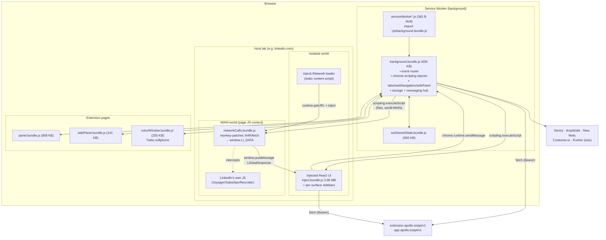
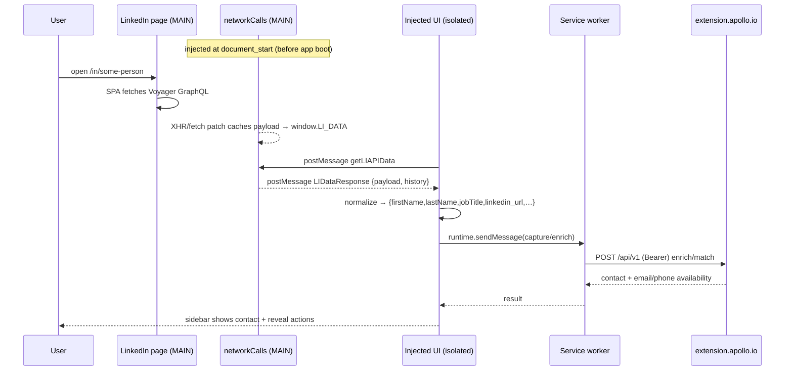
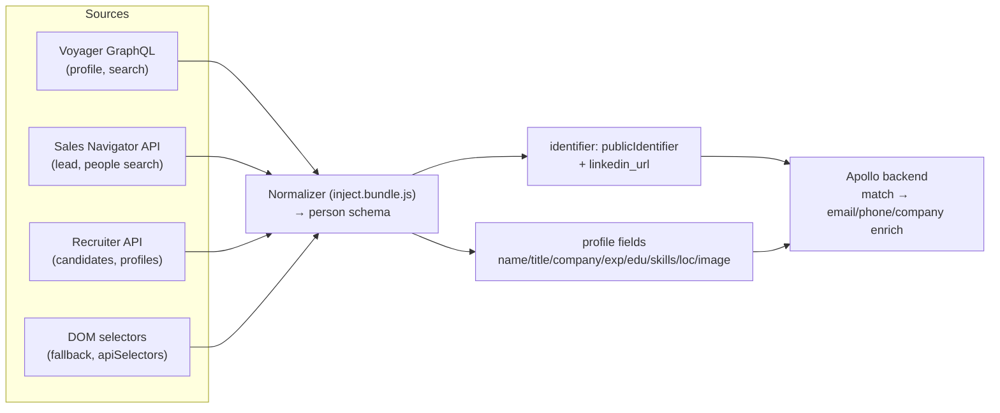
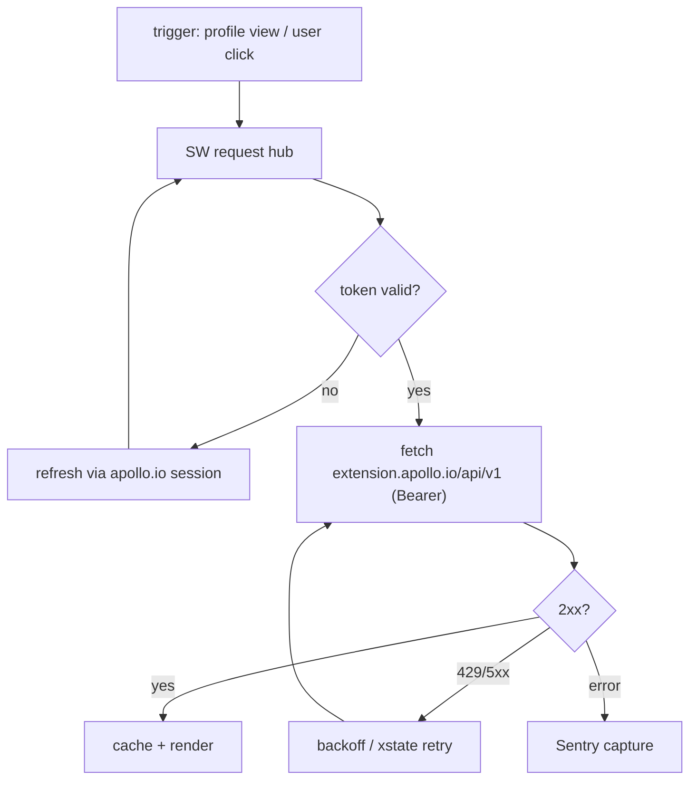
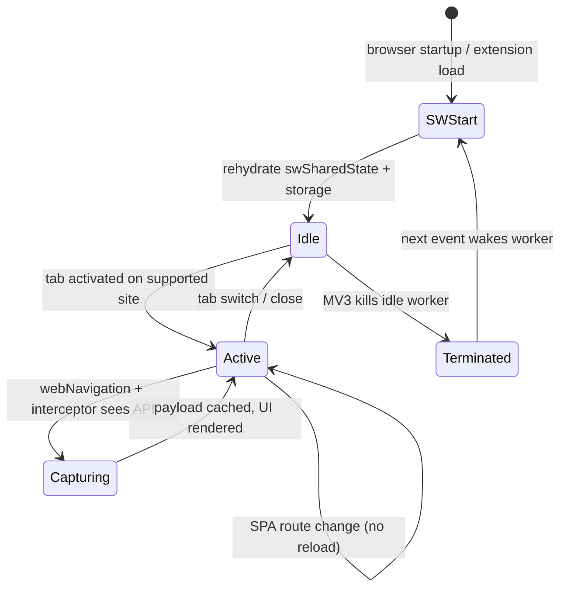

# 01 — Apollo.io Extension Teardown (Research Phases 1–8)

> **Series:** [TruePoint Browser Extension](./README.md) · **Doc:** 01 · **Status:** ✅ Drafted
> · **Prev:** [`00-executive-summary`](./00-executive-summary.md) · **Next:** [`02-target-architecture`](./02-target-architecture.md)

**Subject:** Apollo.io: Free B2B Phone Number & Email Finder — extension id
`alhgpfoeiimagjlnfekdhkjlkiomcapa`, **v15.1.1**, **Manifest V3**.
**Install path:** `…\Google\Chrome\User Data\Default\Extensions\alhgpfoeiimagjlnfekdhkjlkiomcapa\15.1.1_0\`.
**Method:** static, read-only analysis of the shipped bundle (manifest in full; file-tree; high-signal
string analysis of minified, source-map-stripped JS). Nothing was executed or modified. Statements about
runtime behavior are inferences from shipped code.

---

## Phase 1 — Extension Architecture

### 1.1 Overall shape

Apollo is a **service-worker-centric MV3 extension**. The manifest is deliberately minimal — it declares
a service worker, two thin content-script loaders, one action, and a very broad permission set — and then
**does almost everything at runtime by injecting code**. The heavy lifting (all UI, all site adapters, all
scraping) is delivered as ~626 Webpack bundles injected on demand rather than declared statically.

### 1.2 Manifest V2 or V3?

**Manifest V3.** `manifest_version: 3`; the background is a `service_worker` (`type: "module"`), not a
background page; capabilities use `chrome.scripting` and `chrome.action`. There is no `background.page`,
no `browser_action`, no blocking `webRequest`.

### 1.3 Manifest breakdown (verbatim structure)

| Field | Value / note |
|---|---|
| `manifest_version` | `3` |
| `name` / `short_name` | "Apollo.io: Free B2B Phone Number & Email Finder" / "Apollo.io" |
| `version` | `15.1.1` |
| `key` | present — hard-coded RSA public key, pins the extension ID |
| `update_url` | `https://clients2.google.com/service/update2/crx` |
| `action` | `{ "default_title": "Apollo" }` — **no `default_popup`**; the popup/panel is opened programmatically |
| `permissions` (7) | `contextMenus`, `notifications`, `scripting`, `storage`, `tabs`, `webNavigation`, `sidePanel` |
| `optional_permissions` | none |
| `host_permissions` | **`*://*/*`** — all hosts, all schemes |
| `background` | `service_worker: "…serviceWorker….js"`, `type: "module"` |
| `content_scripts` | **only 2** (LinkedIn + HubSpot loaders), `run_at: document_start` |
| `externally_connectable.matches` | `https://www.apollo.io/*`, `https://beta.apollo.io/*`, `https://app.apollo.io/*`, `https://extension.apollo.io/*` |
| `web_accessible_resources` | one entry, `matches: ["<all_urls>"]`, exposing every surface HTML + `img/* fonts/* js/* json/* *.css` |
| `content_security_policy.extension_pages` | `script-src 'self' http://localhost:8097 http://localhost:8098` (React-devtools ports **left in**); `connect-src` allowlists Apollo, Sentry, Amplitude, Customer.io, New Relic, Twilio, Pusher |
| `_locales` | **absent** — no localization folder shipped (react-intl bundled, strings inlined) |
| `minimum_chrome_version` / `commands` / `options_page` | none |

**Architectural reading:** the manifest requests the maximum surface (`*://*/*` + `scripting` + `tabs` +
`webNavigation`) and keeps the static declaration tiny so the shipped-code footprint that Chrome Web Store
review sees statically is small, while the real behavior is injected at runtime.

### 1.4 Component responsibilities

| Component | File(s) | Responsibility |
|---|---|---|
| SW stub | `…serviceWorker….js` (382 B) | Single `import './js/background.bundle.js'` — MV3 module entry. |
| SW core | `background.bundle.js` (636 KB) | Event router; injects UI + interceptors via `chrome.scripting`; owns `tabs`/`webNavigation`/`sidePanel`/`notifications`/`contextMenus`; the messaging hub; talks to Apollo API. |
| SW shared state | `swSharedState.bundle.js` (650 KB) | Cross-invocation state module for the worker. |
| LinkedIn loader | `…injectLINetwork….js` | Static content script; injects the MAIN-world interceptor; re-injects into LinkedIn's preload iframe. |
| HubSpot loader | `…injectHSNetwork….js` | Same pattern for HubSpot. |
| MAIN-world interceptor | `networkCalls.bundle.js` (4.9 KB), `hubspotNetworkCalls.bundle.js` (975 B), `pageWorld.bundle.js` (173 KB) | Monkey-patch `XHR`/`fetch`; cache API payloads; bridge to isolated world via `postMessage`. |
| Injected UI | `inject.bundle.js` (3.96 MB), `window_inject.bundle.js` (2.28 MB) + per-surface sidebars/toolbars | The React apps rendered inside LinkedIn/Salesforce/HubSpot/Gmail/Google-Calendar and the generic "Apollo Everywhere" sidebar. |
| Popup / panels | `panel.bundle.js` (808 KB), `sidePanel.bundle.js` (141 KB) | Extension-page UIs (search, lists, settings). |
| Dialer | `voiceWindow.bundle.js` (255 KB) + Twilio Voice SDK chunk (241 KB) + `voice-window.html` | In-browser softphone. |
| Feature chunks | ~200 `assets_app_*`/`assets_common_*` `.chunk.js` | Code-split features: emailer/sequences, personas, meetings, AI enrichment, paywall/feature-gates, per-CRM containers. |

### 1.5 Cross-component communication

Three distinct channels, by design:

- **SW ↔ UI (isolated world):** `chrome.runtime.sendMessage` / `onMessage` and `chrome.tabs.sendMessage`
  / `chrome.tabs.query` (dozens of call sites in `background.bundle.js`).
- **MAIN world ↔ isolated world:** `window.postMessage` with a small request/response protocol —
  `getLIAPIData → LIDataResponse`, `getHSCRMData → HSCRMDataResponse`, plus `clearLIAPIData`,
  `companyPeopleSearchResults`. This is the bridge that moves scraped payloads out of the page context and
  into the extension's UI.
- **Apollo web app → extension:** `externally_connectable` lets only `*.apollo.io` origins
  `chrome.runtime.sendMessage`/`connect` (so the logged-in web app can drive the extension).

### 1.6 Lifecycle & remote control

- The SW is event-driven and **ephemeral** (MV3 kills idle workers); `swSharedState.bundle.js` exists to
  rehydrate state across restarts.
- **Remote behavioral control:** a hosted `assets.apollo.io/extension/extension-version-router.json`
  (+ `.staging.json`) gates behavior by version, and `chrome.storage.local` key **`apiSelectors`** holds
  remotely-tunable DOM/endpoint selectors — so Apollo can adapt to LinkedIn markup changes **without a
  store release**. (This is powerful and also the tamper/audit concern we flag in `03` §1.9.)

---

## Phase 2 — LinkedIn Detection & Lookup

### 2.1 How LinkedIn is detected

Two layers:

1. **Static match** — the content script `…injectLINetwork….js` is declared for `*://*.linkedin.com/*`
   at `document_start`, so it runs on every LinkedIn navigation and immediately injects the interceptor.
2. **Mode detection in-page** — `networkCalls.bundle.js` classifies the surface from the URL:
   `url.includes("linkedin.com/sales") ? "sales_navigator" : url.includes("linkedin.com/talent") ?
   "recruiter" : "regular"`. The injected UI (`inject.bundle.js`) additionally recognizes profile
   (`/in/…`), company (`/company/…/people`), search, SalesNav lead, and Recruiter candidate surfaces.

### 2.2 Supported LinkedIn page types

| Surface | URL shape | Intercepted API |
|---|---|---|
| Regular profile | `linkedin.com/in/{publicIdentifier}` | Voyager `/voyager/api/graphql` (`voyagerIdentityDashProfileCards`, `…Profiles`) |
| Regular search / company people | `/search/…`, `/company/…/people` | Voyager `voyagerSearchDashClusters` |
| Sales Navigator lead | `linkedin.com/sales/lead/{id}` | `/sales-api/salesApiProfiles/(profileId:…)` |
| Sales Navigator search | `/sales/search/people` | `/sales-api/salesApiLeadSearch`, `/salesApiPeopleSearch` |
| Recruiter | `linkedin.com/talent/…` | `/talent/search/api/talentRecruiterSearchHits`, `/talent/api/talentHiringCandidates`, `/talent/api/talentLinkedInMemberProfiles` |

### 2.3 SPA navigation, change detection, dedup

LinkedIn is a single-page app; there are no full reloads between profiles. Apollo copes by **not relying
on the DOM as the source of truth** — it captures the **API responses** the page itself fetches:

- The interceptor is installed at `document_start` **before** LinkedIn's app boots, so every subsequent
  `fetch`/`XHR` the SPA makes (including on client-side route changes) flows through the patch.
- Captured payloads are keyed (`liProfileResponse:{id}`, `liSearchResponse-{mode}`,
  `liCompanyPeopleSearchResponse-…`) and cached on `window.LI_DATA` with a `HISTORY_DATA` log, so
  re-visiting a profile is served from cache and **duplicate processing is avoided by key**.
- A **preload-iframe hazard** is handled explicitly: LinkedIn renders a hidden `iframe[src*="preload"]`
  and a React strict-mode root (`#root[data-strictmode="true"]`); the loader **re-injects** the
  interceptor into the iframe's `contentWindow` after a ~3 s timeout so early requests aren't missed.
- **Profile-change without reload** is detected by new keyed payloads arriving on `window.LI_DATA`; the UI
  polls/receives via `getLIAPIData` and re-renders for the new subject.

### 2.4 Trigger → enrichment workflow (Apollo)

---

## Phase 3 — Data Capture

### 3.1 Source of truth: intercepted API, not the DOM

Apollo's primary capture is **network interception**, not DOM scraping. `networkCalls.bundle.js` reads
structured LinkedIn API payloads (`voyagerIdentityDashProfiles`, `fs_salesProfile:(…)`, etc.), which are
already normalized JSON — far more reliable than parsing rendered HTML. DOM selectors exist as a
**fallback / augmentation** (and are remotely tunable via `apiSelectors`), but the rich fields come from
the API.

### 3.2 Fields captured & normalized schema

`inject.bundle.js` builds a normalized person record with (confirmed strings):
`firstName`, `lastName`, `jobTitle`, `publicIdentifier`, `email`, `phone_number`, `organization_name`,
`linkedin_url`. From the Voyager/SalesNav payloads it additionally has access to: headline, location,
current + past **experience** (company, title, dates), **education**, **skills**, connection degree,
profile **image** URLs, and company firmographics (name, URL, size). Email/phone are typically **not on
LinkedIn** — those are resolved by Apollo's backend (§3.4), and the extension shows availability +
reveal, not the raw value, until the user spends a credit.

### 3.3 Hidden APIs / GraphQL / REST

- **LinkedIn (read):** private **Voyager GraphQL**, **Sales Navigator REST-ish** (`/sales-api/*`), and
  **Recruiter** endpoints — all consumed by riding the user's authenticated session (no separate creds).
- **HubSpot (read):** `/api/graphql/crm` → `data.crmObjectsSearch.results`, stored as
  `window.HS_CRM_DATA = { contactIds, total }`.
- **Apollo (write/enrich):** REST at `extension.apollo.io/api/v1` and `app.apollo.io/api/v1` with Bearer
  auth.

### 3.4 Missing data, parse failures, dedup, validation

- **Missing email/phone** is the normal case on LinkedIn; the extension sends the identity to Apollo's
  backend, which enriches from Apollo's own database and returns availability + verification status. The
  user then **reveals** (metered).
- **Parse failures / markup drift:** the API-first strategy is resilient to DOM changes; the DOM fallback
  selectors are **remotely patchable** (`apiSelectors`) so Apollo can fix breakage server-side.
- **Dedup:** in-page by cache key (`liProfileResponse:{id}`); server-side by Apollo's person identity.
- **Normalization/validation:** `libphonenumber-js` (phone), `humps` (case conversion), Apollo's schema
  in `inject.bundle.js`.

---

## Phase 4 — Multi-Website Support

### 4.1 Supported sites

From host-detection in `inject.bundle.js` and the `json/…css-files….json` surface map:

| Site | Detection | Integration |
|---|---|---|
| **LinkedIn** (regular / Sales Navigator / Recruiter) | `*.linkedin.com` + path mode | MAIN-world API interception + injected sidebar |
| **Salesforce** | `salesforce`/`force.com` | injected `salesforceSidebar` + `salesforceToolbar` |
| **HubSpot** | `hubspot.com` (static content script) | MAIN-world `/api/graphql/crm` interception + sidebar/toolbar |
| **Gmail** | `mail.google.com` | **InboxSDK** (977 KB) renders inside Gmail |
| **Google Calendar** | `calendar.google.com` | `gcalSidebar` |
| **"Apollo Everywhere"** | any site (enabled by `*://*/*`) | generic sidebar on arbitrary pages |

No ZoomInfo/Crunchbase/GitHub/Outlook integrations were found.

### 4.2 Domain routing & website-specific parsers

The architecture is a **per-surface adapter** model: a shared React shell + a site adapter that knows the
page's URL shapes, which API to intercept (or which DOM to read), which CSS to inject (the `css-files`
JSON maps each surface to its stylesheet set), and which sidebar/toolbar bundle to render. Adding a site =
add an adapter + its bundle + a `css-files` entry, plus (for API-interception sites) a small
`*NetworkCalls` MAIN-world patch. Feature gating (paywall) is handled by dedicated feature-gate chunks.

### 4.3 Scalability of the site model

Strengths: adapters are code-split and lazily injected; the SW injects only what the current tab needs.
Weaknesses (for us to avoid): the `*://*/*` grant + "Apollo Everywhere" means the extension *can* touch
any site, which is exactly the permission posture that draws store scrutiny — a capability we will make
**opt-in per host** instead (`02` §3, `03` §1).

---

## Phase 5 — Automation Engine

### 5.1 Automations present

| Automation | Mechanism |
|---|---|
| Auto-match / enrich on profile view | interceptor → normalize → Apollo `/api/v1` match |
| Contact reveal (email/phone) | metered call to Apollo API; UI badges (`PhoneNumberBadge`, finder actions) |
| Company lookup / firmographics | from Voyager company payloads + Apollo enrich |
| CRM integration | Salesforce/HubSpot sidebars + HubSpot CRM interception; push/sync to CRM |
| Lead saving / lists / sequences | app chunks (emailer, sequences, personas) — save to Apollo lists, add to email sequences |
| Email sending / tracking | Gmail via InboxSDK; quill/tiptap composer |
| Dialer | Twilio Voice SDK softphone (`voiceWindow`), calls over `wss://voice-js.roaming.twilio.com` |
| Notifications | `chrome.notifications` |
| Sidebar / side panel injection | `chrome.scripting.executeScript` + `chrome.sidePanel` |
| Context menus | `chrome.contextMenus` |
| Realtime sync | Pusher websockets (`wss://ws-mt1.pusher.com`) |
| Caching | `window.LI_DATA`/`HISTORY_DATA` in-page; `chrome.storage.local` + SW shared state |

### 5.2 Orchestration, retry, rate limiting, error recovery

- **State machines:** `xstate` is bundled — flows (auth, capture, sequence steps) are modeled as
  explicit machines, which gives deterministic retry/transition handling.
- **Request orchestration:** the SW is the central hub; UI surfaces request through it, so throttling and
  auth-header attachment are centralized.
- **Error recovery/telemetry:** Sentry (`chrome-extension@15.1.1` release) captures exceptions; New Relic
  for performance; Amplitude/Customer.io for product analytics. These give Apollo remote visibility into
  breakage (e.g., LinkedIn markup changes) so they can push `apiSelectors` fixes.

---

## Phase 6 — Browser Lifecycle Management

Apollo's handling, inferred from the API surface used (`chrome.tabs`, `chrome.webNavigation`,
`chrome.storage.local`, SW shared state):

| Event | Handling |
|---|---|
| Tab create / switch / close | `chrome.tabs` events; UI injected/torn down per tab; SW tracks active tab |
| Refresh / hard refresh | content-script re-runs at `document_start`; interceptor re-installed; cache re-warms from API |
| History / SPA navigation | no reload → interceptor already installed catches new API calls; new cache keys drive re-render |
| Multiple tabs / windows | per-tab injection; SW is the shared coordinator; shared state module de-conflicts |
| Browser startup / shutdown | SW `onStartup`/`onInstalled`; state persisted in `chrome.storage.local` |
| Extension reload / update | `update_url` + version-router JSON; SW re-registers; state rehydrated |
| Session restore | tabs re-inject on load; storage-persisted session restores auth/UI |

**State preservation** relies on two tiers: **`chrome.storage.local`** (LevelDB — the on-disk
`Local Extension Settings/alhgpfoeiimagjlnfekdhkjlkiomcapa/` was actively written) for durable state, and
**`swSharedState.bundle.js`** for in-worker state that must survive the SW's aggressive MV3 lifecycle.

---

## Phase 7 — Security & Safety (Apollo's posture, observed)

| Dimension | What Apollo does |
|---|---|
| **Permissions** | `*://*/*` host access + `scripting`/`tabs`/`webNavigation` — very broad. |
| **Auth** | Rides the user's existing **same-origin sessions** on LinkedIn/HubSpot by intercepting in-page requests (no cookie export; **no `chrome.cookies` permission**). Apollo API calls use **Bearer** tokens (`Authorization`/`Bearer`/`csrf` strings across 16 bundles). |
| **externally_connectable** | Locked to `*.apollo.io` — only Apollo's web app can message the extension. |
| **CSP** | `extension_pages` restricts `script-src` to `'self'` (+ leftover localhost devtools ports) and allowlists a specific `connect-src` set. |
| **World isolation** | Uses the isolated world for UI and deliberately crosses into **MAIN world** for interception via `world:"MAIN"`. |
| **Message validation** | `postMessage` protocol is typed by message name; `externally_connectable` gates external senders. |
| **Secret management** | No provider API keys shipped in the client (enrichment is server-side); tokens are session-scoped. |
| **Remote control / anti-tamper** | Behavior tunable via `apiSelectors` + version-router — powerful, but means shipped behavior can change without review (a risk, not a control). |
| **Telemetry / audit** | Sentry + New Relic + Amplitude + Customer.io — strong observability. |
| **Build hygiene** | React-DevTools CSP entries (`localhost:8097/8098`) and `.css.map` files left in production — minor leakage. |

**Enterprise practices worth adopting** (we implement these in `03`): centralized auth in the SW,
`externally_connectable` allowlisting, a strict `connect-src` CSP, structured error/telemetry, and
kill-switch-style remote config. **Practices to reject:** `*://*/*`, private-API interception, and
silent remote behavior swaps.

---

## Phase 8 — Performance & Scalability (observed)

| Concern | Apollo's approach | Note |
|---|---|---|
| **Bundle size** | Heavy: `inject.bundle.js` 3.96 MB, `window_inject` 2.28 MB, full `moment` locale set (~1 MB), MDI icon font CSS (723 KB) | Injecting multi-MB React into every supported page is costly; big optimization target for us. |
| **Code splitting** | ~200 lazy `.chunk.js` feature modules | Good — only load a feature when used. |
| **Injection strategy** | SW injects per-surface bundles on demand rather than one giant static content script | Good — matches tab need. |
| **DOM observation** | API-interception-first (avoids heavy `MutationObserver` scraping); DOM selectors as fallback | Efficient vs. pure DOM polling. |
| **Caching** | `window.LI_DATA` + `HISTORY_DATA` in-page; `chrome.storage.local` + SW shared state | Avoids re-fetching on SPA re-visits. |
| **Realtime** | Pusher websockets instead of polling | Good. |
| **Monitoring** | New Relic (perf) + Sentry (errors) | Production-grade telemetry. |
| **SW lifecycle** | Shared-state module to survive MV3 worker termination | Necessary MV3 pattern. |

**Takeaways for a large-scale deployment (applied in `03` §2–3):** trim per-page JS aggressively
(tree-shake `moment`→`date-fns`, subset icon fonts, defer non-critical chunks), keep the interception/DOM
work minimal and event-driven, persist the queue to survive SW death, and instrument perf + errors from
day one.

---

## Cross-phase summary

Apollo is a **well-engineered but maximally-permissioned** MV3 extension whose differentiating capability
is **MAIN-world interception of LinkedIn's private APIs** from the user's own session, backed by a
central service worker, per-surface React adapters, a Twilio dialer, and strong telemetry — all remotely
tunable. The engineering patterns (SW hub, adapters, message bridge, xstate flows, telemetry, remote
config) are worth adopting; the **permission and capture posture** (`*://*/*`, private-API interception,
silent remote behavior) is precisely what TruePoint's design rejects. The target architecture that keeps
the good patterns and drops the risky posture is [`02-target-architecture.md`](./02-target-architecture.md).
