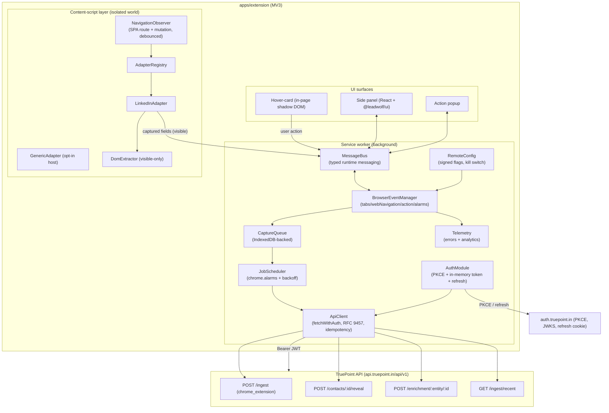
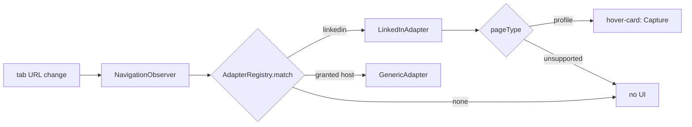
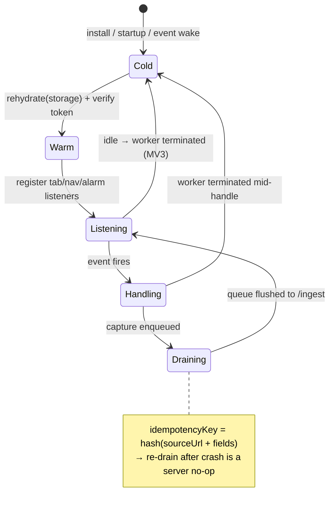
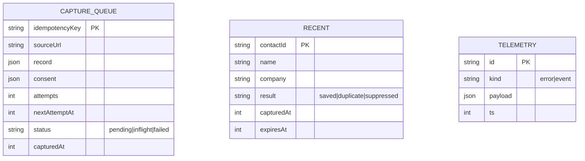
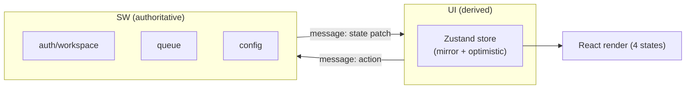

# 02 — TruePoint Enterprise Extension Architecture (Research Phase 9)

> **Series:** [TruePoint Browser Extension](./README.md) · **Doc:** 02 · **Status:** ✅ Drafted
> · **Prev:** [`01-apollo-teardown`](./01-apollo-teardown.md) · **Next:** [`03-security-and-performance`](./03-security-and-performance.md)

This is the target design for `apps/extension` (`@leadwolf/extension`). It keeps the good patterns from
the Apollo teardown (service-worker hub, per-site adapters, message bridge, queue + retry, telemetry,
remote flags) and drops the risky posture (`*://*/*`, private-API interception, silent remote behavior).
Everything here is a **thin client** over the server seam already shipped (see `README` §0).

---

## 1. Design principles

1. **Thin producer.** No provider keys, no DB, no in-page enrichment. Capture → `POST /api/v1/ingest` →
   server pipeline does validate → dedup → resolve → suppress → enrich → project (per
   [`prospect-database-platform/06`](../prospect-database-platform/06-Chrome-Extension-Capture.md)).
2. **Least privilege.** `activeTab` + a small static host allowlist; everything else `optional_host_permissions`
   requested on user gesture. Never `*://*/*`.
3. **User-initiated, consent-gated capture.** Capture only what the signed-in user opened and can see; no
   background harvesting; attach `consent` + `sourceUrl` + `capturedAt` on every envelope.
4. **Survive the MV3 lifecycle.** Assume the service worker is killed constantly; all durable state lives
   in `chrome.storage` / IndexedDB, and every write is idempotent.
5. **Contract-shared with the platform.** Import the ingestion envelope, error, and DTO types from
   `@leadwolf/types`; render with `@leadwolf/ui`. One wire contract, no drift.

## 2. Component architecture



**Isolation note (vs Apollo):** we run the DOM extractor in the **isolated world only** and read
**visible, user-facing** content. We do **not** inject a MAIN-world script to monkey-patch `fetch`/`XHR`
or read private APIs (`03` §1.9).

## 3. Modular feature & website-adapter framework

### 3.1 Feature/plugin model

A feature is a self-contained module registered with the SW: `{ id, enabledFlag, permissions, surfaces,
init(ctx), dispose() }`. The SW loads a feature only when its flag is on and its host permission is
granted. Features: `capture`, `reveal`, `recent`, `crm-sync` (later), `dialer` (later, gated). This
mirrors Apollo's code-split adapters but with explicit permission + flag gating per feature.

### 3.2 Website-adapter interface

```ts
interface SiteAdapter {
  id: "linkedin" | "generic" | ...;
  matches(url: URL): boolean;
  pageType(url: URL): "profile" | "company" | "search" | "unsupported";
  // visible-only extraction; returns the shared ingestion envelope shape
  extract(doc: Document, url: URL): CapturedRecord | null;
  requiredPermission?: string; // optional origin for opt-in hosts
}
```

- **LinkedInAdapter (first):** recognizes `/in/{publicId}` (profile) and `/company/{slug}` pages;
  extracts the **rendered** name, headline/title, current company, location, and the profile URL/public
  id from the DOM the user is viewing. It does **not** call Voyager/SalesNav APIs.
- **GenericAdapter:** only active on a host the user explicitly granted (`optional_host_permissions`);
  extracts name/title/company/email/URL from visible page content for the "capture anywhere" use case.
- **Adding a site** = implement `SiteAdapter`, register it, add its optional host + a flag. No new
  permission at install time.



## 4. Background-worker architecture (Deliverable #14)

The service worker is the single privileged hub. Responsibilities and the MV3 constraints they must
respect:

| Sub-module | Role | MV3 constraint handled |
|---|---|---|
| `BrowserEventManager` | routes `chrome.tabs`, `webNavigation`, `action`, `alarms`, `runtime` events | worker may be cold on each event → all handlers rehydrate from storage first |
| `AuthModule` | PKCE login, in-memory access token, silent refresh, revocation-aware | token is memory-only and lost on worker death → refresh-on-demand before each protected call |
| `ApiClient` | `fetchWithAuth`, RFC 9457 parsing, idempotency header, retry-once-after-refresh | no long-lived connections held |
| `CaptureQueue` | durable queue of pending captures | **IndexedDB** (survives worker termination) |
| `JobScheduler` | drains the queue with backoff; periodic sync | `chrome.alarms` (min 30 s) not `setInterval` (dies with worker) |
| `RemoteConfig` | fetches signed flags + kill switch | cached in `chrome.storage.local`; TTL + signature check |
| `MessageBus` | typed request/response over `chrome.runtime`/`tabs` messaging | validates sender + message schema |
| `EventStream` (SSE consumer) | a **single** SW-held `EventSource` on `GET /events/stream` (Bearer), fanned to UI surfaces via the `MessageBus` — no per-tab sockets. **Dark** behind `REALTIME_SSE_ENABLED`; falls back to `chrome.alarms` polling when off | one connection for the whole extension; re-opened on worker wake; consumed by the `signals` module (`09` §2) |
| `Telemetry` | error + analytics batching | buffered in storage, flushed on alarm |

**Why `chrome.alarms`, not timers:** MV3 kills idle workers within seconds; `setInterval`/`setTimeout`
do not survive. All periodic work (queue drain, token refresh pre-check, telemetry flush, config refresh)
is scheduled via `chrome.alarms` so the worker is woken deterministically.

## 5. Event-management system & browser lifecycle (Deliverables #16, #4)



`BrowserEventManager` normalizes every browser event into an internal event type and is the only place
that touches `chrome.*` event APIs:

| Browser event | Internal handling |
|---|---|
| tab activated / updated | re-evaluate adapter for the tab; show/hide hover-card |
| `webNavigation.onHistoryStateUpdated` | SPA route change → adapter re-match (LinkedIn) |
| `webNavigation.onCommitted` | full nav → content script re-inits |
| `action.onClicked` | open side panel / trigger capture on active tab |
| `alarms.onAlarm` | queue drain / token pre-refresh / telemetry flush / config refresh |
| `runtime.onStartup` / `onInstalled` | rehydrate state, register alarms, run migrations |
| `runtime.onMessage` | typed bus dispatch (sender-validated) |
| tab/window close | dispose per-tab UI state |

**SPA + dedup:** the content script debounces `NavigationObserver` (history + a scoped `MutationObserver`
on the main content region) and computes a stable subject key (`linkedin_url`/public id). If the key is
unchanged, no re-capture; if the same key was captured this session, the hover-card shows "already
captured" without another server round-trip.

## 6. API communication architecture (Deliverable #13)

```mermaid
sequenceDiagram
  participant CS as Content script
  participant BG as Service worker (ApiClient)
  participant IDP as auth.truepoint.in
  participant API as api.truepoint.in/api/v1

  CS->>BG: capture(record) [typed message]
  BG->>BG: enqueue → IndexedDB (idempotencyKey)
  BG->>BG: alarm: drain queue
  alt token missing/expired
    BG->>IDP: POST /auth/token/refresh (credentialed)
    IDP-->>BG: new access JWT (in-memory)
  end
  BG->>API: POST /ingest {source:chrome_extension, idempotencyKey, consent, records} (Bearer)
  alt 202 accepted
    API-->>BG: {accepted, records}
    BG->>BG: dequeue; notify CS → "saved/duplicate/suppressed"
  else 401
    BG->>IDP: refresh → retry once
  else 429 / 5xx
    BG->>BG: backoff, keep in queue (retry on next alarm)
  else RFC 9457 4xx (validation)
    API-->>BG: problem+json {type,title,status,detail,code}
    BG->>BG: dequeue; surface reason in hover-card
  end
```

- **Base URL:** `api.truepoint.in/api/v1` (configurable per env via `RemoteConfig`/build env).
- **Endpoints used:** `POST /ingest` (capture), `GET /ingest/recent` (recent panel), `POST /contacts/:id/reveal`
  (metered, `Idempotency-Key` **required**), `POST /enrichment/:entity/:id` + `GET /enrichment/jobs/:id`
  (status), `POST /search` (dedup/lookup). All bodies/DTOs come from `@leadwolf/types`.
- **Conventions honored** (`docs/planning/09-api-design.md`): RFC 9457 Problem Details for errors,
  cursor pagination for lists, `Idempotency-Key` on reveal. Tenancy is **never** sent in the body — it's
  pinned from the JWT claims server-side (`apps/api/src/middleware/authn.ts`).

## 7. Data-flow (Deliverable #5) — capture to reveal

```mermaid
flowchart LR
  U["user opens LinkedIn profile"] --> ADPT["LinkedInAdapter.extract (visible DOM)"]
  ADPT --> ENV["CapturedRecord + consent + sourceUrl + capturedAt"]
  ENV --> HC["hover-card: Capture?"]
  HC -- click --> Q["CaptureQueue (IndexedDB)"]
  Q --> ING["POST /api/v1/ingest"]
  ING --> PIPE["server: validate→dedup→resolve→suppress→enrich→project"]
  PIPE --> RES{"result"}
  RES -- new/duplicate --> CARD["show contact + email/phone availability"]
  RES -- suppressed --> SUPP["show 'not available' (no PII)"]
  CARD -- user clicks reveal --> REV["POST /contacts/:id/reveal (Idempotency-Key)"]
  REV --> CHARGE["server charges credit, returns value"]
  CHARGE --> SHOW["show revealed email/phone (not persisted to disk)"]
```



## 8. Storage design — chrome.storage vs IndexedDB (Deliverable #12)

| Data | Store | Rationale |
|---|---|---|
| Access token | **in-memory only** (SW module var) | short-lived; never persisted (Apollo-parity risk avoided) |
| Auth session marker (are-we-logged-in, workspace id, PKCE verifier during flow) | `chrome.storage.session` | cleared on browser close; not disk-persisted |
| User settings / active workspace / feature prefs | `chrome.storage.local` | small, sync-read in event handlers |
| Remote config (flags, kill switch) + signature + TTL | `chrome.storage.local` | cached, validated on read |
| **Capture queue** (pending envelopes) | **IndexedDB** (`capture_queue` store) | must survive SW death; ordered; larger records; transactional dequeue |
| Recently captured (read cache for panel) | IndexedDB (`recent` store, TTL) | list rendering without refetch |
| Telemetry buffer | IndexedDB (`telemetry` store) | batched, flushed on alarm |
| Revealed PII | **not persisted** | shown in UI, held in memory for the session only |



**IndexedDB schema versioning** is handled by the `onupgradeneeded` migration ladder in the storage
module (`04` §2), mirroring how the DB package versions migrations.

## 9. State-management design (Deliverable #15)

Three scopes, each with a clear owner:

1. **Authoritative SW state** — auth status, active workspace, queue, config. Owned by the SW modules;
   the single source of truth. UI never mutates it directly — it sends typed messages.
2. **UI state (side panel / popup / hover-card)** — React local state + a small store (Zustand or React
   context; **no Redux** — avoid Apollo's heavy Redux footprint). UI subscribes to SW state via a
   `getState`/`onChange` message channel and renders; all writes go through the bus.
3. **Ephemeral page state** — the current adapter/pageType/subjectKey in the content script; recomputed on
   navigation, never persisted.



Optimistic UI: on Capture click, the hover-card immediately shows "saving…"; the SW confirms
saved/duplicate/suppressed. On worker restart mid-flight, the queue is the recovery point of truth.

## 10. Synchronization & cache

- **Sync engine:** the `JobScheduler` drains the capture queue on `chrome.alarms` and refreshes
  `GET /ingest/recent` for the panel. Reveal results are pulled on demand (no background PII sync). When
  `REALTIME_SSE_ENABLED` is on, the single SW-held `EventStream` consumer (§4) pushes live updates
  (reveal completed, credits changed, job progress) instead of polling; when off, the scheduler polls.
- **Cache:** `recent` and adapter-derived read models are cached in IndexedDB with TTLs; config cached
  with a signature + TTL. No private third-party API responses are ever cached (we don't read them).
- **Conflict handling:** capture is idempotent server-side, so re-sync is safe; the server's
  saved/duplicate/suppressed result is authoritative and overwrites optimistic UI.

## 11. Error-handling framework (Deliverable #17)

A single taxonomy, handled centrally in `ApiClient` + `BrowserEventManager`:

| Class | Example | Handling |
|---|---|---|
| **Auth** | 401, refresh fails | refresh once; if still failing → prompt re-login in panel; keep queue intact |
| **Validation (RFC 9457 4xx)** | bad/missing consent, unsupported field | dequeue; surface `title`/`detail` in the hover-card; telemetry event (not error) |
| **Rate limit (429)** | `checkCaptureRate` hit | backoff with `Retry-After`; keep in queue; show "queued" |
| **Transient (5xx / network)** | server/API blip | exponential backoff + jitter, capped attempts; stays in queue |
| **Suppression** | subject on do-not-contact | not an error — server returns suppressed; UI shows "not available", no PII |
| **Extraction failure** | adapter returns null / markup drift | show "couldn't read this page"; telemetry with the (non-PII) page type so we can fix the adapter |
| **Permission denied** | user declines optional host | disable capture for that host; explain why |
| **Unexpected** | thrown exception | caught at bus/handler boundary; Sentry-style capture; UI shows generic error state |

Principle: **never lose a capture to a transient error** (queue + retry), **never leak PII on failure**,
and **every user-visible error maps to one of the four UI states** (`truepoint-design`).

## 12. Feature flags & remote configuration

- Flags fetched from a **signed** remote config endpoint, cached in `chrome.storage.local` with a TTL and
  a **signature check** before use. Includes a **kill switch** so the extension can be disabled without a
  store release (Apollo-parity, done safely).
- Flags gate *features* (enable reveal, enable a new site adapter), **not** extraction behavior — the
  extraction rules ship versioned in-repo and are code-reviewed. This is the explicit anti-tamper
  difference from Apollo's `apiSelectors`/version-router (`03` §1.9).
- Local flags also read `CHROME_EXTENSION_ENABLED` semantics via the server (a disabled tenant gets a
  gated response from `/ingest`).

## 13. How this maps to the shipped server seam

| Extension need | Existing server piece |
|---|---|
| Capture write | `POST /api/v1/ingest` + `chrome_extension` connector (`packages/core/src/ingestion/connectors/chromeExtension.ts`) |
| Envelope/DTO types | `packages/types/src/ingestion.ts` |
| Capture rate limit | `checkCaptureRate` (`@leadwolf/auth`), already wired in the ingest route |
| Reveal | `POST /api/v1/contacts/:id/reveal` (`apps/api/src/features/reveal/routes.ts`) |
| Enrichment status | `POST /api/v1/enrichment/:entity/:id`, `GET …/jobs/:id` |
| Recent panel | `GET /api/v1/ingest/recent` (per `06-Chrome-Extension-Capture` §5) |
| Auth | PKCE + JWKS (`apps/api/src/middleware/authn.ts`, `apps/web/src/lib/authClient.ts`) |
| Flag/kill switch | `CHROME_EXTENSION_ENABLED` (`packages/config/src/env.ts`) + per-tenant gate |

The **capture/reveal MVP** requires no new server tables or endpoints beyond the drafted
`GET /ingest/recent`. The broader **product feature set** (`06`/`09`) rides an already-shipped `/api/v1`
surface — lists, outreach, search, `ai-search`, scoring, tags, custom-fields, pipeline-stages,
saved-searches, account-search, activities, notifications, credits, compliance, and the (dark) events
stream — so it too needs no new endpoints for the shipped/dark features (only the `net-new` items called
out in `06` do). The extension is a **new client build target**; the server seam already exists.
