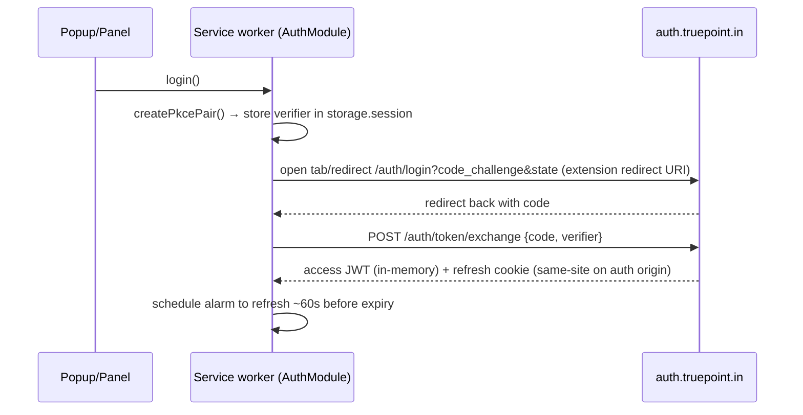

# 03 — Security, Performance & Scalability

> **Series:** [TruePoint Browser Extension](./README.md) · **Doc:** 03 · **Status:** ✅ Drafted
> · **Prev:** [`02-target-architecture`](./02-target-architecture.md) · **Next:** [`04-engineering-standards`](./04-engineering-standards.md)

Security has final say (`CLAUDE.md` precedence). This doc is the security architecture (Deliverable #7),
the performance analysis (Deliverable #8), and the scalability recommendations (Deliverable #18) for
`apps/extension`.

---

## 1. Security architecture

### 1.1 Threat model (what an extension uniquely exposes)

- Runs in **every page the user visits** (potential DOM/JS access) → blast radius and injection risk.
- Holds a path to the user's **TruePoint session** → token theft / privilege escalation risk.
- Handles **prospect PII** (reveal) → data-leak risk.
- Is **remotely updatable** and can carry remote config → tamper / silent-behavior risk.
- Is a **write client** to a multi-tenant API → abuse / cross-tenant risk (mitigated server-side by RLS +
  token-pinned tenancy, but the client must not enable it).

### 1.2 Authentication flow

PKCE, mirroring `apps/web/src/lib/authClient.ts` but adapted for an extension context:



- **Access token:** in-memory in the SW only; ~15 min TTL; **never** written to `chrome.storage` or disk.
- **Refresh:** silent `POST /auth/token/refresh` (credentialed) before expiry and on 401; the refresh
  cookie stays same-site on `auth.truepoint.in`. On worker cold-start with no in-memory token, refresh is
  attempted before the first protected call.
- **Extension redirect URI:** use `chrome.identity.launchWebAuthFlow` (or a dedicated
  `https://<ext-id>.chromiumapp.org/` redirect) so the OAuth loop is scoped to the extension — a wrinkle
  `authClient.ts` doesn't have (it assumes a same-site web redirect). This is the one net-new auth piece.

### 1.3 Authorization

Authorization is **server-enforced**: every request carries the Bearer JWT; the API pins `tenantId`/
`workspaceId` from **verified claims**, never the body, and applies `requireOrgRole` + RLS. The extension
never sends tenant/workspace ids in bodies and never trusts a client-supplied scope. Workspace switching
re-mints a token with the new `wid` (via the auth origin), same as the web app.

### 1.4 Token & secret management

- **No provider keys, ever** — enrichment/verification providers are server-side only. The extension has
  no secret worth stealing beyond the short-lived session token.
- Token in memory only; PKCE verifier in `storage.session` (cleared on browser close), deleted right
  after exchange.
- Revocation-aware: the server checks a Redis deny-list by `sid`; a revoked session's next call 401s and
  the extension drops to logged-out.

### 1.5 Permission model — least privilege (the core divergence from Apollo)

| | Apollo | TruePoint |
|---|---|---|
| Host access | `host_permissions: *://*/*` at install | `activeTab` + static allowlist (`*://*.linkedin.com/*` for v1) |
| Other hosts | granted | `optional_host_permissions`, requested on user gesture, revocable |
| API surface | `scripting`,`tabs`,`webNavigation`,`sidePanel`,`contextMenus`,`notifications`,`storage` | only what a feature needs: `storage`, `alarms`, `activeTab`, `scripting` (scoped), `sidePanel`; add `notifications`/`contextMenus` only when those features ship |
| MAIN-world injection | yes (interception) | **no** |

`activeTab` gives temporary access to the tab the user acted on, which is exactly the "capture what I'm
looking at" model — no standing all-sites grant.

### 1.6 Content Security Policy

Strict `extension_pages` CSP:

```
script-src 'self';
object-src 'self';
connect-src 'self' https://api.truepoint.in https://auth.truepoint.in <telemetry host>;
img-src 'self' data: https:;
style-src 'self' 'unsafe-inline';
frame-ancestors 'none';
```

- **No** `localhost` devtools ports in production (Apollo left `8097/8098` in — we strip them via a
  prod build guard).
- `connect-src` is an explicit allowlist of exactly our origins + the telemetry sink. No wildcards.
- No remote scripts; everything bundled (`'self'`).

### 1.7 World & script isolation

- UI + extraction run in the **isolated world**. We do **not** inject a MAIN-world script. The DOM
  extractor reads rendered, user-visible content through the isolated-world DOM handle only.
- The hover-card renders in a **shadow DOM** so page CSS/JS can't style or reach into it, and our styles
  don't leak onto the page.

### 1.8 Message validation & component isolation

- Every `runtime.onMessage` handler validates `sender` (extension origin / expected tab) and parses the
  message with a **Zod schema** from `@leadwolf/types` before acting. Unknown message types are dropped.
- `externally_connectable` is either omitted (no external web page needs to message the extension) or, if
  the TruePoint web app needs to hand off, locked to `https://app.truepoint.in/*` only — never a wildcard.
- No `eval`, no dynamic `Function`, no remote code. `web_accessible_resources` is limited to the specific
  UI assets that must load in-page (the hover-card bundle + its CSS/fonts), matched to our supported
  hosts, **not** `<all_urls>`.

### 1.9 Anti-tamper & the remote-config divergence

Apollo can change shipped behavior via `apiSelectors` (in `chrome.storage.local`) and a hosted
version-router JSON. We reject that pattern for **extraction/behavior**:

- Remote config controls **feature flags + kill switch only**, is **signed**, and is signature-checked
  before use. A tampered/unsigned config is ignored (fail-closed to last-known-good or defaults).
- **Extraction rules are versioned in-repo and code-reviewed** — they cannot be swapped remotely. If
  LinkedIn markup changes, we ship a reviewed extension update, not a silent server-pushed selector.
- Result: the exact behavior in the store-reviewed build is the behavior that runs; remote config can
  only turn things **off** or flip a vetted flag.

### 1.10 XSS / CSRF / injection

- **XSS:** never `innerHTML` untrusted content; React escapes by default; captured strings are rendered as
  text, never HTML; shadow-DOM isolation for the in-page card.
- **CSRF:** API auth is Bearer (not ambient cookies), so classic CSRF doesn't apply to `api.truepoint.in`;
  the refresh endpoint is same-site + credentialed on the auth origin with its own CSRF defense.
- **Injection into our messages:** all cross-context messages are schema-validated (§1.8).

### 1.11 Abuse / bot / fraud prevention

- **Server-side is the enforcement point:** `checkCaptureRate` (per-caller record volume) on `/ingest`,
  burst throttling + `Idempotency-Key` + suppression gate + credit charge on `/reveal`. The extension
  cannot bypass these — it's just another API client with a tenant-scoped token.
- **Client-side hygiene:** capture is user-gesture-initiated (no background/bulk harvesting), the queue
  is rate-aware (honors `Retry-After`), and there's no scripted "select all → capture" path.
- **Bot detection:** because we don't automate LinkedIn or hit its private APIs, we don't trip (or need to
  evade) LinkedIn's anti-automation — a deliberate compliance stance, not an evasion one.

### 1.12 Data privacy, consent, logging, audit

- **Consent-first:** every envelope carries `consent` (lawful basis) + `sourceUrl` + `capturedAt`; the
  server rejects capture without it and logs source + captured-at for audit (per `06-Chrome-Extension-Capture` §4).
- **PII minimization:** only the fields needed to identify the subject leave the page; revealed PII is
  shown, never written to disk, and held only for the session.
- **Logging:** client logs are non-PII (page type, error class, timing). Server holds the auditable
  record (who captured what, when, from where) with tenant scoping.
- **Suppression:** enforced server-side — a do-not-contact subject is never surfaced or enriched, even if
  captured.

### 1.13 Security checklist (adopted from the Apollo teardown, done right)

- [x] MV3 + service worker (no persistent background page)
- [x] Least-privilege permissions + `activeTab` + optional hosts (vs Apollo `*://*/*`)
- [x] No MAIN-world interception / no private-API reads (vs Apollo)
- [x] In-memory short-lived token; no secrets on disk; no provider keys
- [x] Strict CSP, explicit `connect-src`, no devtools ports in prod
- [x] Zod-validated messages; `sender`/`externally_connectable` locked
- [x] Shadow-DOM UI; React escaping; no `innerHTML`/`eval`
- [x] Signed remote flags (kill switch); extraction rules in-repo only
- [x] Consent + source + audit on every capture; server-side suppression
- [x] Telemetry is non-PII; PII never persisted client-side

## 2. Performance analysis

### 2.1 What the Apollo teardown teaches

Apollo injects multi-MB React (`inject.bundle.js` 3.96 MB) and a full `moment` locale set (~1 MB) into
supported pages — heavy. Our targets, in contrast:

| Budget | Target | How |
|---|---|---|
| In-page injected JS (hover-card) | **< 150 KB gzipped** | small React or Preact for the in-page card; the heavy panel UI lives on an **extension page**, not injected into the host |
| Side-panel bundle | code-split, lazy | route/feature-level `import()` |
| Idle CPU on a supported page | ~0 | event-driven; `NavigationObserver` debounced; scoped `MutationObserver` (main content node only), not whole-document |
| Idle CPU on unsupported pages | 0 | no content script runs (allowlist + `activeTab`); no `*://*/*` |
| Service-worker resident memory | minimal | worker is ephemeral; state in storage/IDB, not held live |
| Date/format libs | `date-fns` (tree-shakable), not `moment` | avoid ~1 MB locale bloat |
| Icons | subset/SVG sprite, not a 723 KB icon-font CSS | ship only used glyphs |

### 2.2 Runtime strategy

- **Lazy injection:** the hover-card bundle is injected only when an adapter matches the active tab (via
  `activeTab` + `scripting`), never statically on all pages.
- **DOM observation:** observe the smallest subtree that changes on SPA navigation; debounce; bail early
  if `pageType` is unsupported. No `fetch`/`XHR` patching.
- **Network:** batch telemetry; single `/ingest` per capture; `GET /ingest/recent` only when the panel is
  open; reveal on demand. Honor `Retry-After`; exponential backoff with jitter.
- **Caching:** IndexedDB read models (`recent`) with TTL; config cached with signature + TTL. No private
  third-party payloads cached.
- **Monitoring:** error capture (Sentry-style) + product analytics + basic perf marks (capture latency,
  drain latency), all non-PII and batched.

### 2.3 Telemetry event taxonomy

A small, **non-PII** event set (backing the "structured telemetry" claims in `00`/`02` §4/here). Events
carry a stable `event`, a `surface` (hover-card/panel/popup/badge), a non-PII `pageType`, timings, and a
result/error class — **never** a name, email, phone, `linkedin_url`, or captured field.

| Event | Key properties (non-PII) | Purpose |
|---|---|---|
| `capture_click` | `surface`, `pageType`, `adapterId` | funnel entry; adapter coverage |
| `capture_result` | `outcome` (saved/duplicate/suppressed/rejected), `latencyMs` | capture success + server-outcome mix |
| `reveal_click` | `revealType` (email/phone/full), `surface` | intent to spend |
| `reveal_result` | `outcome` (revealed/owned/blocked/insufficient), `latencyMs` | money-loop success; block/insufficient rate |
| `enrich_trigger` / `enrich_result` | `outcome`, `latencyMs` | enrichment usage |
| `queue_drain` | `batchSize`, `attempts`, `outcome` | offline/retry health |
| `error` | `class` (auth/validation/rate-limit/transient/extraction/permission/unexpected), `surface` | error budget by class |
| `perf` | `mark` (capture/drain/reveal), `ms` | latency SLOs |

Sampling: errors + money-loop events at 100%; high-volume perf/nav marks sampled (e.g. 10%) with a stable
per-install sampling key so rates scale sub-linearly with installs. All events are buffered in IndexedDB
and flushed on a `chrome.alarms` tick (§2.2). Consent for product analytics follows the workspace's
telemetry setting.

### 2.4 Crash / fault tolerance

- Worker death mid-capture → the IndexedDB queue is the recovery point; the next alarm re-drains;
  idempotency makes re-send a server no-op.
- Corrupt/failed IDB open → fall back to `chrome.storage.local` for a minimal queue + telemetry the
  failure; never crash the capture UX.
- Config fetch failure → use last-known-good signed config; if none, safe defaults (features off).

## 3. Scalability recommendations (large-scale / enterprise deployment)

1. **Server does the heavy lifting; keep the client thin.** All scale-sensitive work (dedup, ER,
   enrichment, suppression, rate limiting) is already server-side (`truepoint-platform`/`truepoint-data`).
   The extension stays a rate-aware producer, so "10× more installs" is a server-capacity question, not a
   client redesign.
2. **Idempotent, queue-backed writes** absorb spikes and offline periods without data loss or duplicate
   inserts.
3. **Per-tenant + per-user limits** (`checkCaptureRate`, reveal throttle) protect the platform from a
   noisy install; the client surfaces "queued"/"slow down" states rather than hammering.
4. **Enterprise rollout via managed policy:** force-install + configure via Chrome Enterprise policy
   (`ExtensionInstallForcelist`, managed storage for the API base / tenant hints) so IT can deploy to
   thousands of seats centrally (`04` §5).
5. **Kill switch + staged flags** let us disable or gate a feature fleet-wide instantly without a store
   release — essential at scale when a site changes or an issue is found.
6. **Telemetry with sampling** so error/analytics volume scales sub-linearly with installs.
7. **Version-migration discipline** (`04` §4): IndexedDB `onupgradeneeded` ladder + config-schema
   versioning so a large installed base upgrades cleanly.

**Net:** the extension is designed to scale by *staying thin and idempotent* and by *pushing every
scale-critical decision to the already-scalable server*, exactly the inverse of a design that would try to
do enrichment or dedup in the browser.
