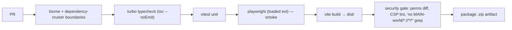

# 04 — Engineering Standards (Stack, Structure, Build, Delivery)

> **Series:** [TruePoint Browser Extension](./README.md) · **Doc:** 04 · **Status:** ✅ Drafted
> · **Prev:** [`03-security-and-performance`](./03-security-and-performance.md) · **Next:** [`05-roadmap`](./05-roadmap.md)

Deliverables #10 (tech stack), #11 (folder structure), #19 (best practices), plus testing, build, CI/CD,
release, version-migration, browser-compat, and enterprise deployment. All of it fits the existing Bun +
Turbo + Biome monorepo.

---

## 1. Recommended technology stack

| Concern | Choice | Why (fit to TruePoint) |
|---|---|---|
| Manifest | **MV3** | MV2 is being removed; no reason to build on it. |
| Language | **TypeScript** (strict, `tsconfig.base.json`) | monorepo standard; shared types with the API. |
| Bundler | **Vite + `@crxjs/vite-plugin`** | MV3-aware (manifest HMR, content-script + SW handling), fast, first-class TS; produces `dist/` wired into a Turbo `build` task. |
| UI | **React 19** + `@leadwolf/ui` for the panel/popup; **Preact** (or minimal React) for the in-page hover-card | reuse the design system on extension pages; keep the injected in-page bundle tiny (`03` §2.1). |
| In-page isolation | **Shadow DOM** | prevent host-page CSS/JS collisions. |
| i18n | a **lightweight message catalog** (ICU-style, e.g. `@formatjs/intl` or a thin custom loader) with per-locale JSON bundled into the build; locale-aware plural/number/date/currency; RTL via logical CSS | backs the i18n mandate in `08` §7; no heavy runtime — locales are static JSON loaded per surface. |
| UI state | **Zustand** (or React context) | lightweight; explicitly **not Redux** (avoid Apollo's heavy footprint). |
| Wire contracts | **`@leadwolf/types`** (Zod) | one source of truth for the ingestion envelope, DTOs, errors, message schemas. |
| Storage | `chrome.storage` (local/session) + **IndexedDB** via a thin typed wrapper (`idb`) | per the storage design in `02` §8. |
| Scheduling | **`chrome.alarms`** | survives SW termination (never `setInterval`). |
| Auth | **PKCE** via `chrome.identity.launchWebAuthFlow`, in-memory token | mirrors `apps/web/src/lib/authClient.ts`. |
| Telemetry | Sentry (errors) + the platform's analytics sink | production observability, non-PII. |
| Testing | **Vitest** (unit) + **Playwright** (loaded-extension E2E) | Playwright can launch Chromium with the unpacked extension. |
| Lint/format | **Biome** (repo config: 2-space, 100-col, double quotes) | consistency; `biome.json` already governs the repo. |
| Boundaries | **dependency-cruiser** | forbid `apps/extension → @leadwolf/db` / `@leadwolf/integrations` (`02` §1). |

**Explicitly avoided:** `*://*/*`, MAIN-world interception, Redux, `moment` (use `date-fns`), 700 KB icon
fonts (subset/SVG), and any provider SDK/keys on the client.

## 2. Folder structure (`apps/extension`)

```
apps/extension/
├─ package.json            # name: @leadwolf/extension
├─ tsconfig.json           # extends ../../tsconfig.base.json
├─ vite.config.ts          # @crxjs/vite-plugin
├─ manifest.config.ts      # typed MV3 manifest (generates manifest.json)
├─ src/
│  ├─ background/          # the service worker (the privileged hub)
│  │  ├─ index.ts          # SW entry: wires modules, registers alarms/listeners
│  │  ├─ events/           # BrowserEventManager (tabs, webNavigation, action, alarms)
│  │  ├─ auth/             # AuthModule (PKCE, token, refresh, revocation)
│  │  ├─ api/              # ApiClient (fetchWithAuth, RFC 9457, idempotency, retry)
│  │  ├─ queue/            # CaptureQueue (IndexedDB) + JobScheduler
│  │  ├─ config/           # RemoteConfig (signed flags, kill switch)
│  │  ├─ telemetry/        # error + analytics batching
│  │  └─ bus/              # typed MessageBus + Zod message schemas
│  ├─ content/             # isolated-world content scripts
│  │  ├─ index.ts          # bootstraps NavigationObserver + AdapterRegistry
│  │  ├─ adapters/         # SiteAdapter framework
│  │  │  ├─ registry.ts
│  │  │  ├─ linkedin/      # LinkedInAdapter (visible-DOM extraction)
│  │  │  └─ generic/       # GenericAdapter (opt-in host)
│  │  ├─ extract/          # DomExtractor helpers (visible-only)
│  │  └─ hovercard/        # in-page shadow-DOM UI (Preact)
│  ├─ ui/                  # extension pages (React + @leadwolf/ui)
│  │  ├─ panel/            # side panel (search, recent, reveal, settings)
│  │  └─ popup/            # action popup
│  ├─ shared/              # cross-context helpers
│  │  ├─ messages.ts       # message types (re-export from @leadwolf/types)
│  │  ├─ storage.ts        # typed chrome.storage + IndexedDB (idb) + migrations
│  │  └─ env.ts            # base URLs per env
│  ├─ i18n/                # message catalog: loader + locales/*.json (en, …), ICU plurals
│  └─ assets/              # icons (subset), fonts (subset), styles
├─ tests/
│  ├─ unit/                # Vitest (adapters, queue, api, auth)
│  └─ e2e/                 # Playwright (loaded extension)
└─ dist/                   # build output (Turbo output; Biome-ignored)
```

**Boundary rules:** `apps/extension` depends on `@leadwolf/types` (+ `@leadwolf/ui` for panel/popup) and
nothing that reaches the DB or provider keys. A dependency-cruiser rule enforces this, matching the
monorepo's existing boundary checks.

## 3. Testing strategy

| Layer | Tool | What |
|---|---|---|
| Unit | Vitest | adapters (`extract` on fixture HTML snapshots of LinkedIn profile/company pages), queue (enqueue/drain/idempotency/backoff), ApiClient (RFC 9457 parsing, retry-after-refresh), AuthModule (PKCE, refresh), message-schema validation. |
| Integration | Vitest + fake `chrome.*` | event routing (cold-start rehydrate), storage/IDB migrations, config signature check + fail-closed. |
| E2E | Playwright (Chromium + unpacked extension) | load a fixture LinkedIn-like page → capture → assert `/ingest` called with the right envelope (mock server) → assert hover-card states; reveal flow; logged-out → login flow. |
| Contract | shared `@leadwolf/types` | the envelope the extension sends is the exact type the server's `chrome_extension` connector expects — type-checked at build, and asserted against the connector's test fixtures. |
| Feature-module gating | Vitest + fake `chrome.*` | each feature module (`09` §2) loads **only** when its `enabledFlag` + host-permission + `requiredTier` pass — assert a module's surface is absent when any gate fails, present when all pass; assert the RemoteConfig kill switch disables a live module. |
| Compliance gate | Vitest (mock API) | assert the reveal/enroll suppression gate surfaces "not available" and **no credit is charged** on a `SuppressedError` (the client mirrors the server's authoritative behavior; `07` §3.2). |
| Surface states | Vitest + Testing Library | the **four-state matrix** (`08`) per surface (hover-card, side-panel tabs, popup) — loading skeleton / empty (first-run vs filtered) / error (`onRetry`) / populated — is rendered via `StateSwitch`, never hand-rolled. |
| i18n | Vitest | no hardcoded user-facing strings (lint/grep gate); every catalog key resolves; plural/number/date/currency format per locale; RTL logical-property smoke. |
| Security | manual + checklist | permission diff review on every manifest change; CSP lint; "no MAIN-world / no `*://*/*` / no secrets" grep gate in CI. |

**Fixtures, not live LinkedIn:** adapter tests run against saved HTML fixtures so tests are deterministic
and never hit LinkedIn — consistent with the no-scraping posture.

## 4. Build pipeline, CI/CD, release & version migration

### 4.1 Build

- `bun run build` in `apps/extension` → Vite/CRXJS → `dist/` (a valid unpacked MV3 extension). Wired as a
  Turbo `build` task (outputs `dist/**`, already the repo's output convention).
- Per-env config (`api.truepoint.in` vs staging) via build-time env + `RemoteConfig`. A **prod build
  guard strips** any devtools/localhost CSP entries (the Apollo leftover we won't repeat).

### 4.2 CI (fits the repo's gates)



- **Note (this host):** `biome`/`typecheck`/`vitest` run locally; Playwright-with-Chromium and any
  docker-dependent steps run in CI (per the coordinator's environment constraints).

### 4.3 Release management

- Version in `manifest.config.ts` follows semver; a release tags the monorepo and uploads the packaged
  `.zip` to the Chrome Web Store (and later Edge Add-ons) via their publish API in a release workflow.
- **Staged rollout** on the store (percentage rollout) + the **server kill switch** as the fast rollback
  (disable a feature or the whole connector via `CHROME_EXTENSION_ENABLED` / signed flags — no store
  release needed to stop bad behavior).
- Release notes cross-reference the server compatibility (the extension only depends on stable
  `/api/v1` contracts, which are versioned).

### 4.4 Version-migration strategy

- **IndexedDB:** an `onupgradeneeded` migration ladder in `shared/storage.ts` (v1→v2→…); each bump has a
  tested migration; never a destructive open.
- **Message/contract:** message and envelope schemas come from `@leadwolf/types`, which is versioned with
  the API; the extension pins a compatible range and the server keeps `/api/v1` backward-compatible.
- **Config schema:** `RemoteConfig` carries a schema version; unknown/newer configs fail closed to
  last-known-good.
- **Forward/back compat:** because writes are idempotent and the server is authoritative, an older
  installed extension keeps working against a newer server (and vice-versa within the `/api/v1` contract).

## 5. Browser compatibility & enterprise deployment

- **Primary:** Chrome (MV3). **Also:** Edge (Chromium, same package → Edge Add-ons), Brave/Arc/Opera
  (Chromium, load the same build). **Firefox:** MV3 differs (background scripts, some APIs); treat as a
  **later port** with an abstraction over the `chrome.*` surface (a thin `browser`-polyfill shim) rather
  than a v1 target.
- **Abstraction seam:** wrap `chrome.*` calls behind small typed helpers (`shared/`) so a future Firefox
  port swaps the implementation, not the call sites.
- **Enterprise deployment:** support Chrome Enterprise **managed policy** —
  `ExtensionInstallForcelist` for force-install, and **managed storage**
  (`chrome.storage.managed`) for IT-set config (API base, tenant/SSO hints, feature toggles). This lets a
  customer's IT push the extension to thousands of seats pre-configured, and is a concrete enterprise
  differentiator over a store-only install.

## 6. Best practices adopted from leading enterprise extensions

Synthesized from the Apollo teardown and the broader landscape (LinkedIn's own, Grammarly, 1Password,
Loom, HubSpot, and MV3 platform guidance):

1. **Service-worker-as-hub** — one privileged coordinator; UI/content are thin clients that message it.
   (Apollo; standard MV3.)
2. **Per-surface adapters, code-split, lazily loaded** — only inject what the current tab needs. (Apollo.)
3. **Message bridge with a typed protocol** — named, schema-validated messages between contexts. (Apollo,
   done more safely here with Zod.)
4. **State machines for multi-step flows** — deterministic auth/capture/sequence handling. (Apollo's
   xstate; optional for us, valuable for the auth + reveal flows.)
5. **Structured telemetry from day one** — Sentry-style errors + product analytics + perf marks, sampled,
   non-PII. (Apollo; 1Password/Grammarly.)
6. **Remote flags + kill switch** — disable/gate features fleet-wide without a store release — but **signed
   and behavior-flag-only**, never silent behavior swaps. (Apollo's version-router, corrected.)
7. **Least-privilege + `activeTab` + optional hosts** — the trust/store-review best practice the leading
   security-sensitive extensions (1Password, Bitwarden) follow, and Apollo notably does not.
8. **In-memory short-lived tokens, no secrets on disk** — password-manager-grade token hygiene.
9. **Shadow-DOM in-page UI** — Grammarly/Loom-style isolation so host pages can't interfere and our UI
   can't pollute theirs.
10. **Managed-policy enterprise deployment** — force-install + managed config for IT-driven rollout.
11. **Idempotent, offline-tolerant write queue** — never lose a user action to a killed worker or a blip.
12. **Tight bundle budgets** — small injected footprint; the heavy UI lives on extension pages, not in
    every host page (the one place Apollo is heavy and we won't be).
