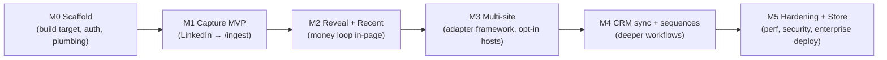

# 05 — Phased Implementation Roadmap

> **Series:** [TruePoint Browser Extension](./README.md) · **Doc:** 05 · **Status:** ✅ Drafted
> · **Prev:** [`04-engineering-standards`](./04-engineering-standards.md) · **Next:** [`06-product-feature-catalog`](./06-product-feature-catalog.md)

Deliverable #20. The build sequence for `apps/extension`, mapped to the server pieces each milestone rides
(all already shipped except the drafted `GET /ingest/recent`). Documentation-first: this series is
reviewed, and GA is gated on the compliance sign-off (`06-Chrome-Extension-Capture` §8) — but M1–M2 can be built behind
`CHROME_EXTENSION_ENABLED` in parallel with legal review.

---

## Milestone map

## M0 — Scaffold & foundations (build target + auth)

**Goal:** an installable MV3 shell that can authenticate and call the API.

- `apps/extension` workspace: Vite + CRXJS, typed `manifest.config.ts` (MV3, least-privilege perms),
  Turbo `build` task, Biome + dependency-cruiser boundary rule.
- Service-worker skeleton: `BrowserEventManager`, `MessageBus` (Zod-validated), `ApiClient`
  (`fetchWithAuth`, RFC 9457, idempotency), `Telemetry`.
- `AuthModule`: PKCE via `chrome.identity.launchWebAuthFlow` against `auth.truepoint.in`; in-memory token
  + silent refresh; logged-in/out state to the popup.
- Popup shell (React + `@leadwolf/ui`): login, workspace display, status.

**Rides:** ADR-0016 auth, `authClient.ts` reference, `/api/v1` + `authn` middleware.
**Exit:** log in, token refresh works across SW restarts, an authenticated `GET` against a **shipped**
endpoint (e.g. `/credits/me` or `/workspaces`) returns 200. Unit tests for auth + api client green.

## M1 — Capture MVP (LinkedIn → `/api/v1/ingest`)

**Goal:** the core loop — open a LinkedIn profile, click Capture, it lands in TruePoint.

- Content-script layer: `NavigationObserver` (SPA-aware, debounced), `AdapterRegistry`, `LinkedInAdapter`
  (visible-DOM extraction of `/in/` profile + `/company/` pages), subject-key dedup.
- In-page hover-card (Preact + shadow DOM): Capture action, four states, "saved/duplicate/suppressed"
  result, consent affirmation + source attribution.
- `CaptureQueue` (IndexedDB) + `JobScheduler` (`chrome.alarms`), idempotent drain to `POST /api/v1/ingest`
  with `consent` + `sourceUrl` + `capturedAt`.
- Error framework wired (auth/validation/rate-limit/transient/suppression → UI states).

**Rides:** `chrome_extension` connector, `/ingest` + `checkCaptureRate`, the ingestion envelope in
`@leadwolf/types`.
**Exit:** capture a real LinkedIn profile → row appears in the workspace; re-capture is a no-op; offline
capture drains on reconnect; suppressed subject surfaces nothing. Playwright smoke E2E green.

## M2 — Reveal + Recent (the money loop, in-page)

**Goal:** see availability and reveal email/phone from the extension.

- Post-capture card shows contact + email/phone **availability** (non-PII), then `POST /contacts/:id/reveal`
  (`Idempotency-Key`) on user click; revealed value shown, never persisted to disk.
- Side panel (React + `@leadwolf/ui`): "recently captured" from `GET /ingest/recent`, reveal history,
  settings/workspace switch.
- Optional per-field enrichment trigger (`POST /enrichment/:entity/:id`) + job status poll.

**Rides:** ADR-0042 reveal (no-charge read + charge-on-reveal + suppression + credit counter),
enrichment endpoints.
**Exit:** reveal charges correctly once (idempotent), respects entitlements/suppression, and shows the
value; recent panel paginates (cursor). **This is the first customer-demoable build.**

## M3 — Multi-site adapter framework (opt-in hosts)

**Goal:** capture beyond LinkedIn without widening install-time permissions.

- Formalize the `SiteAdapter` interface; add `GenericAdapter` behind `optional_host_permissions`
  (requested on user gesture, revocable).
- Add 1–2 high-value adapters (e.g. company website / a public directory) as visible-DOM extractors.
- Managed-storage (`chrome.storage.managed`) hooks for enterprise-configured hosts.

**Rides:** same `/ingest` seam (adapters just produce the same envelope).
**Exit:** user grants a host on demand and captures there; declining a host degrades gracefully; no new
mandatory permission in the manifest.

## M4 — CRM sync & sequences (deeper workflows)

**Goal:** move from capture to action, reusing platform features (not rebuilding Apollo's stack).

- Add-to-list / add-to-sequence from the card/panel (server-side lists + outreach already exist).
- CRM sync surfaces where the platform supports them (per `docs/planning/crm-sync/`), still as a thin
  client over server endpoints.
- (Dialer is explicitly **out of scope** unless a telephony decision says otherwise — it's a large,
  separately-gated surface per `truepoint-security` telephony rules.)

**Rides:** lists API, outreach engine, crm-sync plan.
**Exit:** capture → add to a list/sequence in one flow; all writes idempotent + audited.

## M5 — Hardening, store submission & enterprise deployment

**Goal:** production-ready, published, deployable at scale.

- Performance pass to the budgets in `03` §2 (injected bundle < 150 KB gz, `date-fns`, subset icons,
  strip devtools CSP in prod).
- Full security checklist (`03` §1.13): CSP, message validation, permission diff review, "no
  MAIN-world/`*://*/*`/secrets" CI grep gate.
- Telemetry sampling, crash-recovery tests (worker-death mid-capture), IndexedDB migration tests.
- Chrome Web Store submission (single clear purpose, least-privilege) + staged rollout; Edge Add-ons.
- Enterprise: `ExtensionInstallForcelist` + managed-config docs for customer IT.
- Confirm compliance sign-off (`06-Chrome-Extension-Capture` §8) before flipping `CHROME_EXTENSION_ENABLED` on for customers.

**Exit:** published, staged rollout live, kill switch verified, enterprise force-install documented.

## Priorities & sequencing notes

- **Critical path:** M0 → M1 → M2 delivers the whole value proposition (capture + reveal). Prioritize it;
  M3–M5 are additive.
- **Parallelizable:** the panel UI (M2) and the adapter framework generalization (M3) can be built beside
  each other once M1's envelope is stable.
- **Gate discipline:** everything ships behind `CHROME_EXTENSION_ENABLED` + per-tenant flag; the server
  kill switch is the rollback for any milestone.
- **No new backend build** is required through M3 beyond the drafted `GET /ingest/recent`; M4 depends on
  the existing lists/outreach/crm-sync surfaces, not new ones.
- **Feature mapping:** the per-feature Free/Pro/Enterprise split and the P1–P4 build order that maps onto
  these milestones live in [`06-product-feature-catalog`](./06-product-feature-catalog.md) §6–§7 (P1≈M1–M2,
  P2≈M2–M3, P3≈M3–M4, P4≈M4–M5+). The UX for each surface is [`08`](./08-ux-design-language.md); the
  feature-module architecture is [`09`](./09-product-architecture.md).

## Definition of done (program)

The extension is a published, MV3, least-privilege, thin-producer client that lets a signed-in user
capture the LinkedIn (and opt-in other-site) prospect they're viewing — consent- and suppression-gated —
into their TruePoint workspace and reveal contact info, riding the shipped ingestion/reveal seam, with no
private-API scraping, no `*://*/*`, no secrets on the client, and a server-side kill switch. It scales by
staying thin and idempotent while the platform does the heavy, tenant-isolated work.
