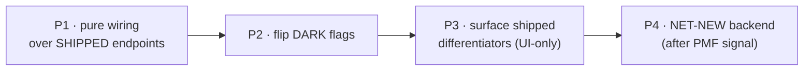

# 06 — Product Feature Catalog

> **Series:** [TruePoint Browser Extension](./README.md) · **Doc:** 06 · **Status:** ✅ Drafted
> · **Prev:** [`05-roadmap`](./05-roadmap.md) · **Next:** [`07-market-gap-and-differentiation`](./07-market-gap-and-differentiation.md)

Docs `00–05` describe the extension as *engineering milestones*. This doc is the **product-feature
surface**: everything the extension does for a user, as a catalogue. Each feature is mapped to the
**concrete `/api/v1` endpoint it rides** (or marked **dark/flag-gated** or **NET-NEW backend**), given a
**Free / Pro / Enterprise** tier, and tied to a one-line **job-to-be-done**. The rule from
[`ADR-0043`](../decisions/ADR-0043-chrome-extension-architecture.md) holds throughout: the extension is a
**thin, human-in-the-loop, non-scraping client** — every write is server-side, tenant-scoped,
suppression-gated, and the client-supplied workspace/list ID is never trusted.

> **Status legend:** `shipped` = endpoint live today · `dark` = built but behind a flag
> (`CHROME_EXTENSION_ENABLED`, `BULK_REVEAL_ENABLED`, `REALTIME_SSE_ENABLED`) · `net-new` = requires new
> backend, not yet built (do not imply it exists). Note: for capture, the `POST /ingest` **endpoint is
> live**; only the `chrome_extension` *connector* is flag-gated (`CHROME_EXTENSION_ENABLED`), so a disabled
> tenant gets a gated response — hence "shipped" (README/`05`) and "dark" (this doc) describe the same
> endpoint from different angles.

---

## 1. The product in one sentence

Open a LinkedIn/Sales-Navigator/company page → TruePoint recognises the prospect, shows whether it's
already in your workspace, **reveals** verified email/phone on credits, and lets you **organise and act**
(list, sequence, tag, score, note, enrich) — all in-page, all consent- and suppression-gated on the
server, without leaving the tab.

## 2. Feature bands

Features are grouped by competitive role:

- **Table-stakes** — parity every serious sales-intelligence extension already has; we must match these to
  be credible.
- **Differentiators** — where TruePoint is *better* than incumbents, built on already-shipped platform
  capability.
- **Gap-fillers** — the genuinely underserved wedges (validated adversarially in
  [`07`](./07-market-gap-and-differentiation.md)); some require new backend.

## 3. Table-stakes (parity)

| Feature | What it does | Maps to | Status | Tier | JTBD |
|---|---|---|---|---|---|
| In-card reveal (email + phone) | One click charges credits and unmasks verified work email + mobile/direct phone on the viewed profile | `POST /contacts/:id/reveal` | shipped | Pro | "Get this person's contact info now" |
| Already-owned free hydrate | Rows the workspace already revealed re-display **free** instead of re-charging | `GET /contacts/:id/revealed` · `POST /contacts/revealed/batch` | shipped | Free | "Don't charge me twice for someone I own" |
| Capture profile → workspace | Save the current LinkedIn/Sales-Nav profile as a contact (rate-limited vs abuse) | `POST /ingest` (`source=chrome_extension`) | dark | Free | "Put this prospect in my CRM" |
| Company (account) lookup | On a company page, pull the firmographic record + whether it/its people are owned | `POST /account-search/search` · `/suggest` · `/facets` | shipped | Free | "Is this account already ours?" |
| Contact search / typeahead in-card | Query the workspace dataset by name/company/email before acting | `POST /search/contacts` · `GET /search/suggest` | shipped | Free | "Do we already have this person?" |
| Add-to-list | Pick or create a list and add the contact; returns an affected count for the toast | `POST /lists/:id/members` · `GET/POST /lists` | shipped | Free | "File this prospect into a list" |
| Add-to-sequence (enroll) | Enroll a revealed contact into an outreach cadence (suppression/consent enforced in core) | `POST /outreach/sequences/:id/enroll` · `/enroll-bulk` | shipped | Pro | "Start outreach to this person" |
| In-card enrichment | Fill missing title/company/location via the on-demand waterfall | `POST /enrichment/contact/:id` (`contact` is the `:entity` in the generic `POST /enrichment/:entity/:id`) · `GET /enrichment/jobs/:id` | shipped | Pro | "Complete this record" |
| Bulk reveal a search page | Reveal all rows on a search page as an async job, with estimate + CSV download | `POST /contacts/reveal-jobs` · `/:jobId/confirm` · `GET /contacts/reveal-jobs/:jobId/download` | dark | Pro | "Reveal this whole page at once" |
| Bulk select actions | Multi-select rows → apply tags/status/owner/archive/export | `POST /contacts/bulk/{tags,status,assign-owner,archive,export}` | shipped | Pro | "Do one thing to many at once" |
| Export revealed → CSV | Export the owned/revealed selection to a downloadable CSV | `POST /contacts/bulk/export/revealed` · `GET /contacts/bulk/export/revealed/:exportId` | shipped | Pro | "Get my data out" |
| Log activity / note | Record a call/email/note touch + show the recent timeline inline | `POST/GET /contacts/:id/activities` | shipped | Free | "Log what I just did" |
| Live credit balance in-card | Show balance + per-action cost before the reveal click | `GET /credits/me` · `/credits/reveal-costs` | shipped | Free | "How much will this cost me?" |
| Notifications bell | Unread count + mark-read, mirroring the app feed | `GET /notifications` · `/unread-count` · `POST /:id/read` | shipped | Free | "What changed while I was away?" |
| **CRM push & two-way sync** | Push the record into Salesforce/HubSpot and log activity there | **NET-NEW backend** (see `crm-sync` plan) | net-new | Enterprise | "Sync this to our CRM" |
| **Click-to-dial dialer** | Call a revealed number from the panel | **NET-NEW backend** (telephony) | net-new | Pro | "Call them from here" |
| **Gmail sender-context panel** | Auto-dock a contact card for the email sender while reading inbox | **NET-NEW backend + client** | net-new | Pro | "Who is this emailer?" |

The last three are parity features incumbents ship (Apollo/ZoomInfo) but TruePoint has **no endpoint for
today** — they are honest roadmap items, not current capability.

## 4. Differentiators (better, on shipped platform)

| Feature | What it does | Maps to | Status | Tier | JTBD |
|---|---|---|---|---|---|
| In-transaction compliance gating | Suppression + consent enforced **inside** the reveal and enroll transactions — a blocked subject can't be revealed or messaged, and the credit is never spent | `assertNotSuppressed` in `revealContact`/`enrollContact` (core); `/compliance/suppression` + `/consent` | shipped | Enterprise | "Never let me contact someone I legally can't" |
| Per-workspace isolation (agencies) | Every capture/list/score/sequence/reveal is scoped to a workspace, so an agency keeps separate ICPs + outreach state per client | two-tier `tenant_id`/`workspace_id` on all writes | shipped | Pro | "Keep my clients' data apart" |
| Verified-on-reveal | Data verified via the provider waterfall and verification status surfaced at reveal time — compete on trust, not raw volume | `POST /contacts/:id/reveal` + `/enrichment/contact/:id` | shipped | Pro | "Is this email actually good?" |
| Credit-ceiling confirm on bulk | Bulk reveal estimates cost and arms a confirm dialog that **refuses** rather than overspends | `POST /contacts/reveal-jobs` (estimate/confirm) · `/credits/reveal-costs` | dark | Pro | "Never surprise-charge me" |
| AI natural-language audience search | Type "VPs of Eng at 200+ SaaS" → get a **validated filter** to preview then run (per-tenant AI budget) | `POST /ai-search` → `POST /search/contacts` | shipped | Pro | "Describe my audience in words" |
| CRM-grade fields *in the card* | Apply tags, edit typed custom fields, set pipeline stage, view/rescore lead score inline — TruePoint **is** the CRM in the card | `/tags/*` · `/custom-fields/*` · `/pipeline-stages/*` · `/contacts/:id/scores` | shipped | Pro | "Manage the record without leaving" |
| Dedup warning at capture | "Looks like a duplicate of X" at capture; jump to the existing record or override | `GET /contacts/duplicates` · `POST /search/contacts` | shipped | Free | "Don't let me add a dupe" |
| Save filter as segment | Persist the in-page filter as a saved search / dynamic list | `GET/POST /saved-searches` · `POST /lists/dynamic` | shipped | Pro | "Reuse this audience later" |
| Self-serve DSAR / deletion | Submit a data-subject deletion request (public unauthenticated intake); the server fans it out across per-workspace copies with append-only audit | `POST /compliance/dsar` (public intake) | shipped | Enterprise | "Honor an erasure request" |
| Pinned inline edits | Correct name/title/location and **pin** so future enrichment won't overwrite the human fix | `PATCH /contacts/:id` | shipped | Pro | "Fix it and keep it fixed" |

## 5. Gap-fillers (the underserved wedges)

These are the features validated as genuinely underserved in [`07`](./07-market-gap-and-differentiation.md)
(most proposed "gaps" were rejected as table-stakes — this list is deliberately short and honest).

| Feature | What it does | Maps to | Status | Tier | JTBD |
|---|---|---|---|---|---|
| Tenant-owned lawful-basis + audit artifact | Every reveal auto-stamps a configurable default lawful basis (legitimate-interest for B2B) with **zero rep friction**, and exposes a per-contact, **tenant-owned, exportable** compliance timeline (ROPA/DSAR/DPA evidence) | extends `/compliance/*` audit + `assertNotSuppressed` (**partly NET-NEW**: the exportable artifact + auto-stamp UX) | net-new | Enterprise | "Prove every collection was lawful" |
| Live consent-withdrawal / DSAR gate at the click | A live, per-workspace block at the exact reveal/enroll click when the subject withdrew consent or has an **active DSAR/erasure** — synchronous, credit-protecting, audited; also on the export-to-external-sequence path | `assertNotSuppressed` (in-tx) + consent/DSAR fan-out → global suppression (**gate at export is NET-NEW**) | net-new | Enterprise | "An erased subject can never be re-revealed" |
| No-surprise-overage credit ceiling | The bulk confirm gate leases a worst-case ceiling and **refuses** with `InsufficientCreditsError` rather than auto-charging; add a **user-settable per-job cap** below the system worst-case | `POST /contacts/reveal-jobs/:jobId/confirm` (ceiling **shipped-dark**; user cap **NET-NEW**) | dark + net-new | Pro | "I decide the max I can spend" |
| Honest credit ledger in-panel | Live balance + published per-action cost + already-owned (no-charge) status, so spend is never a surprise and owned rows are never re-billed | `GET /credits/me` · `/reveal-costs` · `POST /contacts/revealed/batch` | shipped | Free | "See exactly what I'll pay, always" |

**Honesty note:** the first three lean on TruePoint's real, in-code enforcement
(`assertNotSuppressed` runs inside the reveal/enroll transaction and rolls back before any spend) but the
**buyer-facing artifacts** (exportable timeline, user-set cap, export-path gate) are **net-new** work. The
catalogue never dresses net-new as shipped.

## 6. Tiering rationale

| Tier | Contains | Why |
|---|---|---|
| **Free** | The capture-and-organise loop with **no metered spend** — capture, lookup, typeahead, dedup warning, add-to-list, log activity, free hydrate of owned reveals, live credit ledger | Drives adoption; every action is free and useful, and the free hydrate + honest ledger *demonstrate* the "no surprise billing" promise before a credit is ever spent |
| **Pro** | The monetised loop + CRM-in-card power — reveal, enrichment, bulk reveal, add-to-sequence, AI NL search, bulk actions, CSV export, saved segments, tags/custom-fields/pipeline/scoring, pinned edits, credit ceiling | Where revenue is; per-workspace isolation is the paid hook for agencies |
| **Enterprise** | The compliance & governance moat — in-tx reveal+send gating, self-serve DSAR, append-only audit, lawful-basis artifact, consent/region reveal gate; plus SSO/SCIM (server-side already) + CRM sync (net-new) | This is TruePoint's core wedge (see `07`); it's what a compliance/RevOps buyer signs for |

## 7. Prioritization (what to build first)

- **P1 — ship-first (no new backend):** in-card reveal, free hydrate, capture-to-workspace, contact/company
  lookup + dedup warning, add-to-list, log activity, honest credit ledger. Delivers **Apollo-parity on the
  core reveal loop day one** and immediately expresses the "never re-charge owned / no surprise billing"
  differentiator.
- **P2 — flip dark flags:** `BULK_REVEAL_ENABLED` (bulk reveal + credit-ceiling confirm), bulk select
  actions, CSV export — all built, gated. `CHROME_EXTENSION_ENABLED` gates capture; `REALTIME_SSE_ENABLED`
  gives live card updates.
- **P3 — surface shipped differentiators (UI only):** compliance suppression/consent gating on reveal +
  enroll, AI NL search, inline CRM-grade fields (tags/custom-fields/pipeline/score/pinned edits),
  add-to-sequence, self-serve DSAR.
- **P4 — net-new backend (sequence after PMF):** credit-back-on-bad-data, exportable lawful-basis artifact,
  user-set per-job cap, export-path consent gate, and the parity gaps we lack — CRM push/sync, dialer,
  Gmail sender-context.

This ordering maps directly onto the milestones in [`05-roadmap`](./05-roadmap.md): P1≈M1–M2, P2≈M2–M3,
P3≈M3–M4, P4≈M4–M5+.

## 8. What the extension is deliberately NOT

Per the strategy corpus ([`market-analysis/03-market-gaps.md`](../../market-analysis/03-market-gaps.md)) and `ADR-0043`, the extension does **not**:
raw-database breadth or background scraping (we compete on trust, not volume — capture is HITL and
visible-DOM only); the compliant **send/deliverability** engine and **CRM-neutral sync** (those are
web-app/backend surfaces on the **platform product roadmap** — its M9 send / M10 CRM-neutral milestones,
which are distinct from this series' extension roadmap M0–M5 in [`05`](./05-roadmap.md)); and it does
**not** own per-workspace isolation (a data-model property it *respects*, not implements). Keeping the
extension thin is the point.
