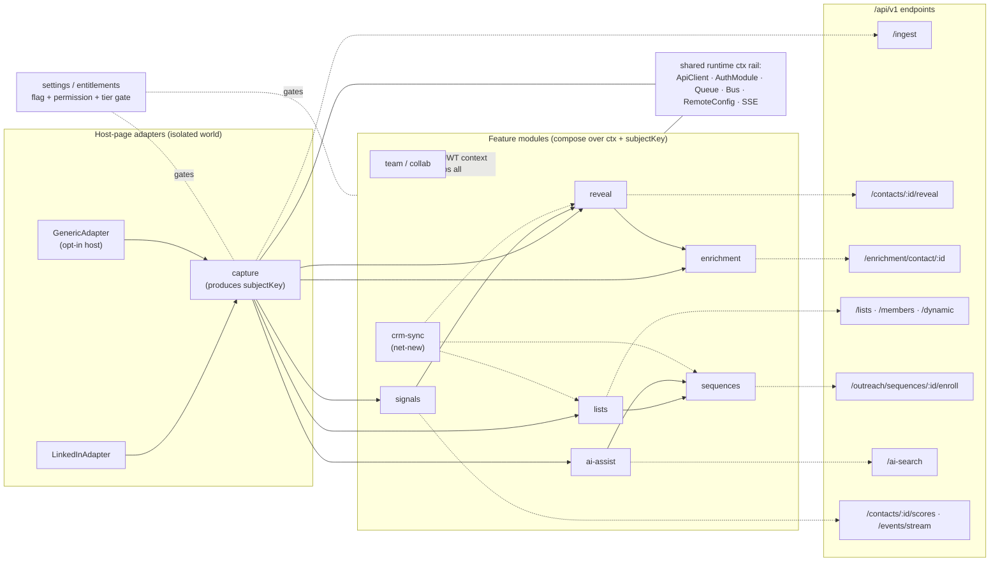
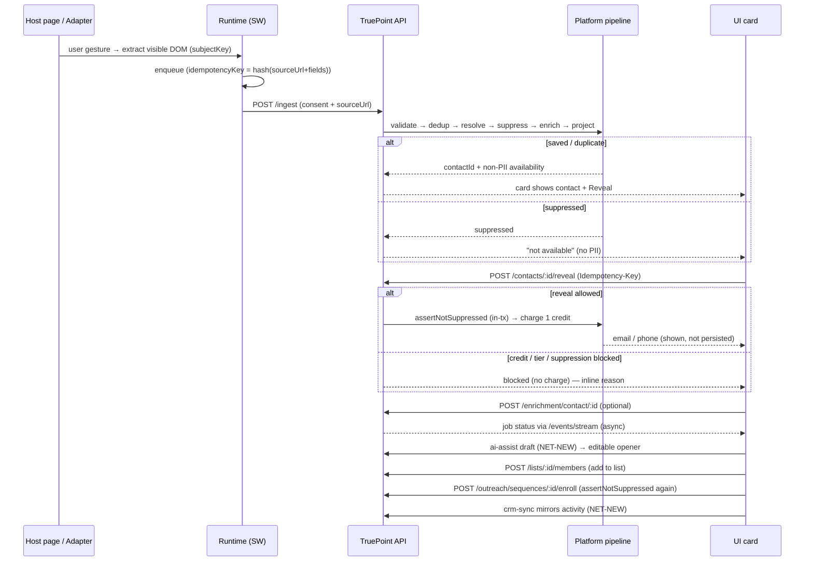
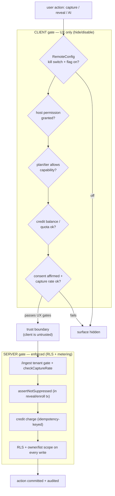

# 09 — Product / Feature Architecture

> **Series:** [TruePoint Browser Extension](./README.md) · **Doc:** 09 · **Status:** ✅ Drafted
> · **Prev:** [`08-ux-design-language`](./08-ux-design-language.md)

`02` is the **system** architecture (service worker, queue, adapters, storage). This doc is the
**product/feature** architecture: how the catalogued features (`06`) compose into capabilities, how each
maps to the shipped `/api/v1` surface, and how entitlement + consent gating threads through everything. It
**complements** `02` and deliberately does **not** restate the SW/queue internals.

---

## 1. The organising idea: a subjectKey and ten modules over one runtime

The `capture` module produces a stable **`subjectKey`** (the LinkedIn public id) for the person on the
page. Every other feature module acts on that same subject. Each module is a self-contained plugin:

```ts
interface FeatureModule {
  id: string;
  enabledFlag: string;        // signed RemoteConfig flag (kill-switch-able)
  requiredPermission?: string; // host permission (activeTab / optional origin)
  requiredTier: "free" | "pro" | "enterprise";
  surfaces: Surface[];        // hover-card | side-panel tab | popup | badge
  init(ctx: RuntimeContext): void;   // ctx = ApiClient, AuthModule, Bus, Queue…
  dispose(): void;
}
```

The runtime loads a module **only** when its flag + host permission + tier all pass — otherwise its surface
never renders. Modules never call `chrome.*` or providers directly and never reach into each other's
internals; they compose over the shared `ctx` and the shared `subjectKey`.

## 2. The ten feature modules

| Module | Responsibility | Rides (`/api/v1`) | Composes with |
|---|---|---|---|
| **capture** | Entry + subject-producer. Per-site adapters detect page type, watch SPA nav, and **on a user gesture** extract the **visible** DOM into a `CapturedRecord` (+ consent + `sourceUrl` + `capturedAt`). Never enriches/dedups in-page — hands the envelope to the runtime. Emits `subjectKey`. | `POST /ingest` (dark: `CHROME_EXTENSION_ENABLED`) | runtime queue+ApiClient; adapters; settings (consent + `checkCaptureRate`); everything downstream keys off its `contactId`/`subjectKey` |
| **reveal** | The money loop. Card shows non-PII **availability** first; on click, charge one credit and return email/phone (shown in-session, never persisted). | `POST /contacts/:id/reveal` · `GET /contacts/:id/revealed` · `POST /contacts/revealed/batch` · `POST /contacts/reveal-jobs` (dark) | capture (subject); settings (balance/tier gate — but the charge is authoritative server-side); enrichment; signals (score prioritises reveals) |
| **enrichment** | On-demand per-field waterfall; surfaces job status inline. Thin trigger only. | `POST /enrichment/contact/:id` · `GET /enrichment/jobs/:id` | capture (entity id); reveal (fills gaps availability exposed); signals (progress via SSE); settings (metered → tier/credit gate) |
| **lists** | Add the subject (or a panel multi-selection) to a static/dynamic list. The organising primitive. | `GET/POST /lists` · `POST /lists/:id/members` · `POST /lists/dynamic` | capture (member); sequences (bulk-enroll source); team/collab (list-based sharing); crm-sync; settings (list caps) |
| **sequences** | Move capture → action: enroll a contact or list into an outreach cadence. Reuses the shipped outreach engine — the extension is a thin enroll/preview client. | `GET/POST /outreach/sequences` · `/:id/steps` · `/:id/enroll[-bulk]` | lists (bulk source); capture (single enroll); ai-assist (drafts step 1); settings (suppression/consent gate enforced server-side) |
| **ai-assist** | AI over the viewed subject. **Shipped:** NL→validated search filter. **NET-NEW:** profile summary / talking-points / drafted opener grounded in captured (+ revealed) fields. | `POST /ai-search` (shipped) · *summary/draft = NET-NEW* | capture (profile context); reveal (personalisation); sequences (draft → step 1); settings (metered/tier-gated quota) |
| **signals** | Live intelligence over the subject: score/intent badge + freshness, updated in real time. | `GET /contacts/:id/scores` · `POST /contacts/:id/rescore` · `GET /events/stream` (dark: `REALTIME_SSE_ENABLED`) | runtime (single SW-held SSE fanned to UI via the bus — no per-tab sockets); capture; reveal/enrichment (job-done + score changes stream in); settings (scoring tier) |
| **crm-sync** | Push captured/revealed/list/sequence state into the connected CRM as a thin client. No CRM SDK/keys on the client. **NET-NEW backend** (`crm-sync` plan). | *NET-NEW* (per `docs/planning/crm-sync/`) | capture, reveal, lists, sequences (state mirrored); settings (which connection/mapping); server owns connection + idempotent audited writes |
| **team / collab** | Workspace context + shared visibility: active-workspace switch, owner-scope + list-based sharing, a shared "recently captured" view. Makes the extension multi-tenant-aware **without ever trusting a client-supplied workspace**. | `GET /workspaces` (shipped) · `GET /ingest/recent` (**drafted**, per `06-Chrome-Extension-Capture`) | AuthModule (workspace/claims pinned from JWT, never body); lists (sharing); every write tenant+workspace+owner scoped, RLS-enforced |
| **settings / entitlements** | The **cross-cutting gate**: active workspace, prefs, plan/tier, credit balance, consent config, and the signed RemoteConfig flags + kill switch. Every other module reads entitlement/flag state before enabling a surface or firing an action — **UX gating only**; the authoritative check is server-side. | `GET /credits/me` · `/credits/reveal-costs` + RemoteConfig | RemoteConfig (SW); AuthModule (workspace/tier); **all** modules (each registers `enabledFlag` + permission + tier) |

**Honesty flags carried from `06`:** `crm-sync`, the ai-assist summary/draft, and the exportable
compliance artifact are **net-new backend**; `capture`, bulk reveal, and SSE are **dark/flag-gated**. The
architecture is drawn so these slot in without reshaping the runtime — but the doc never implies they exist.

## 3. Diagram 1 — feature-module map



## 4. Diagram 2 — capture → outreach flow

Each product step is a **different module** acting on the **same subjectKey**; nothing is scraped and no
PII is persisted client-side.



## 5. Diagram 3 — entitlement / consent gating funnel

Client gates are **UX only** (hide/disable a surface); the server **re-checks authoritatively** across the
trust boundary. The kill switch is the global rollback with no store release.



## 6. The five layers (narrative)

Read as five layers, with the entitlement/consent gating threaded through all of them — complementary to
(not a restatement of) the SW/queue/adapter internals in `02`.

1. **Host-page adapters (isolated world).** Per-site `SiteAdapter`s + `NavigationObserver` + `DomExtractor`.
   They know only how to recognise a page and read its **visible** DOM on a user gesture, emitting a shared
   `CapturedRecord` + `subjectKey`. They touch no privileged `chrome.*` API and no network — they message
   the runtime. This is the only page-shape-specific layer; **adding a site is adding an adapter, not a
   permission.**
2. **Feature modules.** The ten product capabilities as plugins. Each loads **only** when its flag + host
   permission + tier pass, composes over a shared `ctx` and a common `subjectKey`, and never calls
   providers or `chrome.*` directly. `capture` is the hub that produces the subject; the rest act on it.
3. **Shared runtime (service-worker hub).** The single privileged, MV3-lifecycle-surviving layer every
   module borrows through `ctx` — `ApiClient` (fetchWithAuth, RFC 9457, Idempotency-Key, retry-after-refresh),
   `AuthModule` (PKCE + in-memory token + workspace claims), the durable idempotent `CaptureQueue` +
   `JobScheduler`, `RemoteConfig` (signed flags + kill switch), the **single** `/events/stream` SSE consumer
   fanned to UI via the typed `MessageBus`, and `Telemetry`. Modules stay thin because this layer owns all
   durability, auth, and transport (details in `02` — not repeated here).
4. **TruePoint API (`/api/v1`).** The contract seam. Modules map to concrete, already-shipped endpoints —
   `/ingest`, `/contacts/:id/reveal`, `/enrichment/contact/:id` + `/jobs`, `/lists`(+`/members`,`/dynamic`),
   `/outreach/sequences`(+`/steps`,`/enroll`), `/ai-search`, `/contacts/:id/scores`, `/events/stream`
   (dark), and the drafted `/ingest/recent` — with **tenancy pinned from the JWT and never sent in the
   body**. This is the trust boundary: the client is an untrusted producer.
5. **Platform pipeline.** The server does the heavy, tenant-isolated work — validate→dedup→resolve→suppress
   →enrich→project on ingest, credit metering + `assertNotSuppressed` on reveal, provider fan-out on
   enrichment, RLS + owner/list-scope on every read/write, and the realtime events the `signals` module
   consumes.

**Gating spine (cross-cutting).** `settings/entitlements` + `RemoteConfig` gate the **client** (which
surfaces render, which buttons enable) for UX only; **consent, capture rate (`checkCaptureRate`), credit
charge, plan/tier, and suppression are enforced server-side and are authoritative.** Client gating may be
optimistic; the server is the source of truth, and the kill switch is the global rollback.

## 7. Why this shape

- **Thin modules over a fat server** keep every scale- and safety-critical decision (dedup, suppression,
  metering, RLS) on the platform that already implements it — the extension can't diverge from or bypass it.
- **subjectKey as the join** means features compose without coupling: `reveal`, `enrichment`, `signals`,
  `lists`, `sequences`, `ai-assist`, and `crm-sync` all operate on the same subject the moment `capture`
  produces it, in any order.
- **Flag + permission + tier per module** makes the commercial tiering (`06` §6) and the compliance kill
  switch a first-class architectural property, not an afterthought — and lets net-new modules (`crm-sync`,
  ai-assist drafting) slot in behind flags without touching the runtime.

Cross-references: system architecture [`02`](./02-target-architecture.md); security enforcement
[`03`](./03-security-and-performance.md) §1; the feature catalogue + tiers
[`06`](./06-product-feature-catalog.md); the decisions [`ADR-0043`](../decisions/ADR-0043-chrome-extension-architecture.md).
