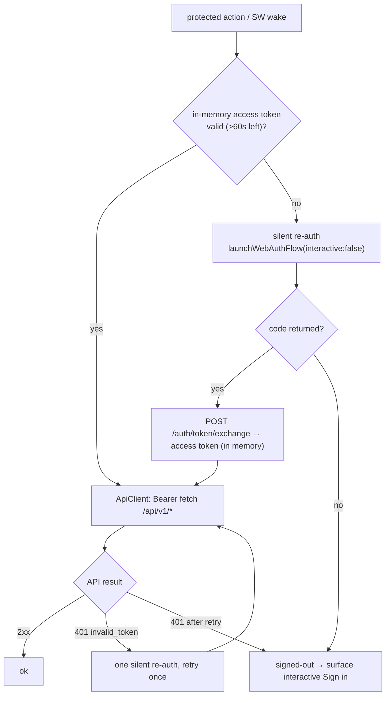
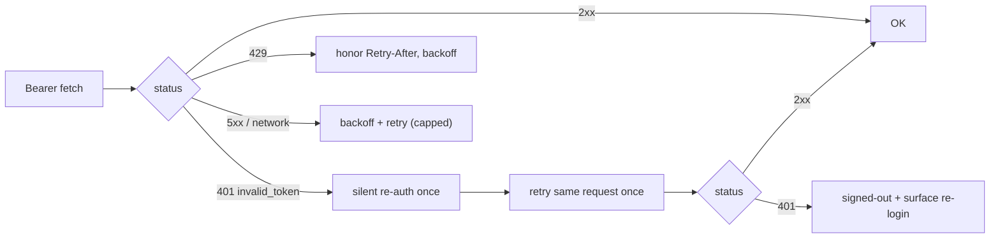

# 10 — Extension Authentication Architecture

> **Series:** [TruePoint Browser Extension](./README.md) · **Doc:** 10 · **Status:** ✅ Drafted
> · **Prev:** [`09-product-architecture`](./09-product-architecture.md) · **Next:** [`11-extension-branding`](./11-extension-branding.md)

Enterprise auth architecture for `apps/extension`. It authenticates against the dedicated IdP
`auth.truepoint.in`, calls `api.truepoint.in`, and stays consistent with the web app on `app.truepoint.in`
— **without** weakening the platform's locked security posture (ADR-0016 / ADR-0040). Governing decision:
[`ADR-0044`](../decisions/ADR-0044-extension-authentication.md).

> **Headline:** the auth code currently scaffolded in `apps/extension/src/background/auth/module.ts` **cannot
> authenticate against the real server** — wrong endpoints, wrong field names, a refresh transport that a
> cross-origin extension can't use, and a claim (`account`) that doesn't exist. This doc designs the correct
> architecture and scopes the small, coordinated backend change it requires. §8 is the fix-list.

---

## 1. Executive summary

TruePoint's auth is a **dedicated auth-origin / IdP (BFF)** pattern (ADR-0016), not a stock OAuth2
`/authorize`+`/token` server: `auth.truepoint.in` owns the durable session and mints short-lived (15-min)
**EdDSA JWT** access tokens; `api.truepoint.in` is a **stateless JWKS verifier** that never issues tokens;
`app.truepoint.in` holds the access token **in memory only** and refreshes silently against an **HttpOnly,
`SameSite=Strict` refresh cookie** scoped to `truepoint.in`.

That last part is why the web app "just works" and the extension does not: `app.` and `auth.` are
**same-site** under `truepoint.in`, so the refresh cookie rides app→auth fetches
(`apps/auth/src/lib/cookies.ts:1`). A `chrome-extension://<id>` origin is **not** same-site, so **the refresh
cookie never rides the extension's requests**, and the token routes' **exact-match CORS allowlist** rejects
the extension origin outright. The extension therefore needs a purpose-built cross-origin auth path.

**Recommended architecture — "silent re-auth":** the extension logs in once via
`chrome.identity.launchWebAuthFlow` (PKCE), and obtains *fresh* access tokens by re-running that loop
**non-interactively** (`interactive:false`). The `lw_refresh` cookie stays first-party on `auth.truepoint.in`
(it rides the launchWebAuthFlow top-level navigation, not a cross-origin `fetch`), so **no refresh token ever
lands in the extension** — preserving ADR-0016's "no long-lived credential in JS". The only backend work is
small and additive (§7): register the extension origin in the CORS/audience allowlist, add a silent
(`prompt=none`) authorize path, and expose an account-display value. The **service-worker-held refresh token**
model is documented as a full alternative in §2.3 with its tradeoffs.

## 2. The cross-origin problem and the two models

### 2.1 Why the scaffold fails (ground truth)

| Fact (verified) | Consequence for a `chrome-extension://` client |
|---|---|
| `lw_refresh` = HttpOnly · Secure · **SameSite=Strict** · Domain=`truepoint.in` (`apps/auth/src/lib/cookies.ts:6`) | The cookie **never rides** the extension's cross-site fetches → `/token/refresh`, `/workspace/switch`, `/org/switch`, `/orgs`, `/logout` all 401. |
| Token routes CORS = exact-match `APP_ORIGINS` (https URLs); empty CORS → **403** (`apps/auth/src/app/token/exchange/route.ts:34`, `packages/config/src/env.ts` `isAllowedOrigin`) | The extension origin is **rejected 403** on exchange/refresh unless registered. |
| Access-token `aud` = the requesting origin; API verifies `aud ∈ appOrigins()` (`apps/auth/src/app/token/exchange/route.ts:99`, `apps/api/src/middleware/authn.ts:17`) | A token minted for the extension must have the extension origin as an **accepted audience**. |
| Claims = `sub, tid, wid, sid, scope, pa, iss, aud, exp, iat` — **no `email`/`account`, no roles** (`packages/types/src/auth.ts:125`) | The scaffold's `account` display is always null; roles come per-request from `workspace_members`. |
| Access TTL 900s; refresh rotates every use with **reuse-detection → family revocation** (`packages/auth/src/session.ts:92,141`) | Any client-held refresh token must tolerate rotation and never be replayed. |

### 2.2 Model A — Silent re-auth (recommended)

The extension **never holds a refresh token**. It gets fresh access tokens by re-driving the launchWebAuthFlow
loop non-interactively; the `lw_refresh` cookie authenticates that first-party navigation on the auth origin.

```mermaid
sequenceDiagram
  participant SW as Service worker (AuthModule)
  participant WAF as chrome.identity.launchWebAuthFlow
  participant IdP as auth.truepoint.in
  participant API as api.truepoint.in

  Note over SW: access token missing/near-expiry (alarm or pre-call)
  SW->>SW: createPkcePair() + state (store in storage.session)
  SW->>WAF: launchWebAuthFlow({url:/auth/login?prompt=none&code_challenge&state&app_origin, interactive:false})
  WAF->>IdP: top-level nav (first-party → lw_refresh cookie rides)
  alt session cookie valid
    IdP-->>WAF: 302 redirect to https://<ext-id>.chromiumapp.org/?code&state
    WAF-->>SW: final redirect URL (code, state)
    SW->>IdP: POST /auth/token/exchange {code, codeVerifier, state} (Origin: chrome-extension://<id>)
    IdP-->>SW: {accessToken, tokenType:"Bearer", expiresIn}
    SW->>SW: hold token in memory; schedule chrome.alarms refresh ~60s before exp
  else no/expired session
    IdP-->>WAF: would require UI → interactive:false fails
    WAF-->>SW: error → drop to signed-out (prompt interactive login)
  end
  SW->>API: fetch /api/v1/* (Authorization: Bearer <access>)
```

- **Interactive login** (first time / after full logout) is the same flow with `interactive:true`, which renders
  the TruePoint login card in the launchWebAuthFlow window.
- **Pros:** no refresh token on the client (keeps ADR-0016's XSS/theft posture); reuses the exact exchange
  contract; the durable session stays solely on the auth origin.
- **Cons/limits:** needs a **silent authorize path** (`prompt=none`) that issues a code when a valid session
  cookie is present without rendering UI (net-new, §7); `launchWebAuthFlow(interactive:false)` succeeds only
  while the 30-day `lw_refresh` session is alive; each silent refresh spins a hidden auth-origin navigation
  (heavier than a JSON `fetch`, but infrequent at a 15-min cadence).

### 2.3 Model B — Service-worker-held rotating refresh token (documented alternative)

The exchange, for a registered **extension client type**, returns the rotating **refresh token in the body**;
the SW stores it (encrypted) and refreshes via a **body-based** token call.

```mermaid
sequenceDiagram
  participant SW as Service worker
  participant IdP as auth.truepoint.in
  SW->>IdP: POST /auth/token/exchange {code, codeVerifier, state, client_type:"extension"}
  IdP-->>SW: {accessToken, expiresIn, refreshToken}
  SW->>SW: encrypt refreshToken → chrome.storage.local (or IndexedDB)
  Note over SW: on alarm / 401
  SW->>IdP: POST /auth/token/refresh {refreshToken}
  IdP-->>SW: {accessToken, expiresIn, refreshToken'} (rotated; old revoked, reuse-detected)
```

| | Model A (silent re-auth) | Model B (SW refresh token) |
|---|---|---|
| Long-lived credential on client | **None** | Rotating refresh token (encrypted) |
| ADR-0016 "no refresh token in JS" | **Preserved** | Relaxed for the extension |
| Backend change | silent-authorize path + origin registration | extension-client body-return + origin registration |
| Failure mode if SW storage read | n/a (nothing stored) | token exposure (mitigated: SW isolation, encryption, rotation + family-revocation, 15-min access TTL, sid deny-list) |
| Offline cold-start UX | needs a network nav to re-auth | can mint access from stored refresh (still needs network) |
| Recommendation | **Primary** | Fallback if a silent path proves impractical |

**Decision (ADR-0044): Model A is primary.** Model B is the vetted fallback. Everything below assumes Model A
unless noted.

## Phase 1 — Research findings

### 1.1 How leading sales-intelligence extensions authenticate

Synthesized from the Apollo teardown ([`01`](./01-apollo-teardown.md)) and public behavior of the category:

| Product | Extension auth pattern (observed/typical) | Session sync with web app |
|---|---|---|
| **Apollo.io** | `externally_connectable` locked to `*.apollo.io`; the web app messages the extension; rides the user's Apollo session; Bearer tokens on `extension.apollo.io/api/v1` (`01` §7) | Web app → extension via `chrome.runtime` (a "companion tab" bridge) |
| **ZoomInfo (ReachOut)** | Enterprise SSO/session; token/session brokered by the web app | Shared org session |
| **LinkedIn Sales Navigator** | First-party — the extension surface *is* linkedin.com; rides the site cookie | Native (same origin) |
| **HubSpot / Salesforce / Gong** | OAuth against the suite IdP; enterprise SSO (SAML/OIDC); tokens brokered server-side; short-lived access + silent refresh | SSO session shared across suite |
| **Seamless / lighter tools** | Extension holds a token in extension storage; refresh via a token endpoint | Token-in-extension |

**Patterns worth adopting:** a **service-worker auth hub** (one place mints/holds tokens, others message it);
**silent re-auth** without visible UI; **short-lived access + rotating refresh**; **`externally_connectable`
locked to the first-party web origin** for any web↔extension handoff; **session sync via broadcast** so all
extension surfaces reflect login/logout instantly. **Patterns to reject:** riding a third-party site's session
by network interception (Apollo's LinkedIn technique — `01` §3), and broad host permissions.

### 1.2 Protocols, token model, and threat model

- **OAuth2 / OIDC / PKCE.** TruePoint is authorization-code + **PKCE S256** in spirit (verifier stays client-side,
  only the S256 challenge leaves — `apps/web/src/lib/pkce.ts:9`), but the *entry* is a custom identifier-first
  login, not an OAuth `/authorize`. The extension reuses PKCE via `crypto.subtle` in the SW.
- **JWT + refresh rotation.** Access = EdDSA JWT (15 min); refresh = opaque, **rotated every use**, hashed at
  rest (only SHA-256 stored), with **reuse-detection → family revocation** (30s grace) — `packages/auth/src/session.ts`.
- **Token-storage strategies** (extension context): (1) **in-memory only** (SW module var) — best, but lost on
  worker death; (2) `chrome.storage.session` — RAM-backed, cleared on browser close, not disk; (3)
  `chrome.storage.local` — disk, needs encryption; (4) IndexedDB — disk. TruePoint extension: **access token in
  memory; the "logged-in" marker + PKCE verifier/state in `storage.session`; nothing long-lived on disk**
  (Model A). Model B would add an encrypted refresh token in `storage.local`.
- **Cookie vs token.** The web app uses a **hybrid** (cookie for refresh on the auth origin, Bearer for the API).
  The extension cannot use the cookie cross-origin, so it is **token-based end-to-end** (access token Bearer;
  refresh via silent re-auth navigation or, in Model B, a body token).
- **Service-worker auth.** MV3 workers are ephemeral: no `setTimeout` survival (use `chrome.alarms`), no
  `EventSource`, `crypto.subtle` available, `chrome.identity` available. State must rehydrate on wake.
- **Threat model** (addressed in Phase 3): token **theft** (in-memory + short TTL + no disk secret in Model A),
  **replay** (single-use PKCE code, rotation + reuse-detection), **CSRF** (Bearer not ambient cookie for the
  API; `state` on the auth loop), **XSS** (no page-reachable secret; strict CSP; shadow-DOM UI), **extension
  compromise** (least privilege; no provider keys; sid revocation).

### 1.3 TruePoint auth ground truth (the contract the extension binds to)

**Endpoints** (auth origin, basePath `/auth`):

| Path | Method | Purpose | Req → Resp |
|---|---|---|---|
| `/auth/login` | GET (+ server action) | Identifier-first login entry (the launchWebAuthFlow target) | `?app_origin&code_challenge&state` → renders/redirects |
| `/auth/token/exchange` | POST | Code → access token | `{code, codeVerifier, state}` → `{accessToken, tokenType:"Bearer", expiresIn}` |
| `/auth/token/refresh` | POST | Silent refresh (cookie) | cookie → `{accessToken,…}` + rotated cookie |
| `/auth/workspace/switch` | POST | Re-mint token with new `wid` | `{workspaceId}` + cookie → `{accessToken,…}` |
| `/auth/org/switch` | POST | Re-mint token with new `tid`/`wid` | `{tenantId}` + cookie → `{accessToken,…}` |
| `/auth/orgs` | GET | List the user's orgs (cross-tenant) | cookie → `{orgs[], activeTenantId}` |
| `/auth/logout` | POST | Revoke session + clear cookie | cookie → 204 |
| `/auth/.well-known/jwks.json` | GET | JWKS (EdDSA public keys) | → `{keys[]}` |

**Claims:** `sub` (user), `tid` (tenant), `wid?` (workspace), `sid` (session — the revocation key), `scope[]`,
`pa?` (platform admin), `iss/aud/exp/iat`. **No email/account claim; no roles claim.** **TTLs:** access 900s,
refresh 30d, code 60s. **Revocation:** Redis deny-list `revoked-sid:<sid>` (fail-open), checked in `authn`.
**MFA** TOTP live (SMS/email/WebAuthn stubbed); **SSO** seam built (adapters stubbed); **SCIM 2.0 live**.

## Phase 2 — Enterprise architecture

### 2.4 Authentication + authorization sequence (Model A, steady state)



- **Authorization is server-enforced.** Every request carries the Bearer JWT; the API pins `tenantId`/`workspaceId`
  from **verified claims** (never the body) and derives roles per-request from `workspace_members`. The extension
  never sends tenant/workspace ids as trusted input.

### 2.5 Session & token lifecycle

- **Access token:** minted at exchange, `aud` = extension origin, 15-min TTL, in-memory only, re-minted by silent
  re-auth ~60s before expiry (via a `chrome.alarms` tick, since `setTimeout` dies with the worker).
- **Durable session:** lives only on the auth origin (`lw_refresh`, 30d, rotating). The extension observes it
  indirectly: silent re-auth succeeds ⇒ session alive; fails ⇒ session gone ⇒ signed-out.
- **Refresh rotation & reuse detection:** entirely server-side and unchanged; Model A never touches the refresh
  token, so rotation is transparent. (Model B must store the rotated token each refresh.)

### 2.6 Workspace / org switching (multi-workspace, multi-org)

The extension must switch **without trusting a client-supplied workspace** (roles/tenancy are re-pinned server-side).

```mermaid
sequenceDiagram
  participant UI as Popup/Panel
  participant SW as AuthModule
  participant IdP as auth.truepoint.in
  UI->>SW: switchWorkspace(workspaceId)
  SW->>IdP: re-mint with new wid (via silent re-auth carrying the selection,<br/>or POST /auth/workspace/switch in Model B)
  IdP-->>SW: {accessToken with new wid}
  SW->>SW: replace in-memory token; broadcast STATE_CHANGED
  UI->>UI: re-render for the new workspace
```

- **Org switching** is the same shape against `/auth/org/switch` (new `tid`+`wid`); **`/auth/orgs`** lists the
  user's orgs (cross-tenant — only the auth origin can answer this).
- **Model A wrinkle:** `/workspace/switch` and `/org/switch` are cookie-based, so in Model A the switch is
  expressed as a **silent re-auth carrying the desired workspace/org** (the silent-authorize path accepts a
  `workspace_id`/`tenant_id` hint and mints a code bound to that selection). This is part of the §7 backend work.
  In Model B the extension calls the switch endpoints directly with the stored refresh token.

### 2.7 Startup, install, returning-user, recovery

| Scenario | Behavior |
|---|---|
| **First install** | No session marker → signed-out popup → user clicks Sign in → interactive launchWebAuthFlow → exchange → in-memory token + `storage.session["logged_in"]=true`. |
| **Browser startup / SW wake** | `runtime.onStartup`/`onInstalled` → `AuthModule.init()`: if `storage.session["logged_in"]` (or a durable marker in Model B), attempt **silent re-auth** before the first protected call. |
| **Returning user (same browser session)** | In-memory token likely gone (worker died) but `logged_in` marker present → silent re-auth → seamless. |
| **After browser fully closed** | `storage.session` cleared → marker gone → next open needs one silent re-auth against the still-alive 30-day cookie; succeeds without UI (Model A) if the OS/browser kept the auth cookie. |
| **Session recovery** | Any 401 `invalid_token` → one silent re-auth + retry; persistent failure → signed-out. |

### 2.8 Logout, forced logout, and state-change handling

- **User logout:** `POST /auth/logout` (Model B) or a `launchWebAuthFlow` to `/auth/logout` (Model A, to clear
  the first-party cookie) → clear in-memory token + markers → broadcast signed-out.
- **Forced logout / remote revocation:** server deny-lists the `sid`; the extension's **next API call 401s**
  (`invalid_token`), silent re-auth fails (session revoked), extension drops to signed-out. Revocation latency
  ≤ the 15-min access TTL, or immediate on the next call.
- **Password change / reset:** server calls `revokeAllSessionsForUser` → the extension's next call 401s → re-login.
- **Account suspension / disabled:** silent re-auth + API calls 401/403 → signed-out with a clear message.
- **Org membership removed:** `tid`/`wid` no longer authorized → 403 `tenant_forbidden`/`scope_mismatch` →
  re-fetch `/auth/orgs`, drop to a valid org or signed-out.
- **Workspace removed:** switch/silent re-auth returns without that `wid` → fall back to the default workspace.

### 2.9 Offline, background, secure API comms, version compatibility

- **Offline:** protected actions queue (the capture queue already does this, `02`/`09`); auth actions surface an
  offline state; on reconnect, silent re-auth then drain.
- **Background auth:** the SW performs silent re-auth on the `chrome.alarms` refresh tick and before protected
  calls; no UI needed.
- **Secure API comms:** HTTPS-only origins (manifest host_permissions), Bearer over TLS, RFC-9457 error parsing,
  `Idempotency-Key` on writes (already in `ApiClient`), tenancy from claims.
- **Version compatibility:** the extension pins to the stable `/auth/*` and `/api/v1` contracts; a min-supported
  server contract is asserted at startup; a server-driven kill switch (RemoteConfig, `02` §4) can force sign-out
  or block on incompatibility.

### 2.10 SSO & SCIM future

- **SSO (SAML/OIDC):** requires **no extension change** — enterprise SSO login happens *inside* the
  `launchWebAuthFlow` window on `auth.truepoint.in` (the IdP handles the SAML/OIDC round-trip and sets
  `lw_refresh`); the extension still just exchanges the resulting code. Silent re-auth then works against the
  SSO-backed session. This is a major advantage of Model A: the extension is SSO-agnostic.
- **SCIM:** provisioning/deprovisioning is entirely server-side (`/scim/v2/Users`); a deprovisioned user's
  sessions are revoked → the extension drops to signed-out via the normal 401 path. No extension work.

## Phase 3 — Enterprise security design

| Control | Design |
|---|---|
| **Secure token storage** | Access token **in memory only** (SW var). `logged_in` marker + PKCE verifier/state in `chrome.storage.session` (RAM, cleared on browser close). **Nothing long-lived on disk** (Model A). Model B: refresh token AES-GCM-encrypted in `storage.local` with a key derived per-install. |
| **Encryption of sensitive data** | Only needed in Model B (refresh token). Use WebCrypto AES-GCM; key stored via `chrome.storage.session`-wrapped material, never alongside ciphertext. |
| **PKCE** | S256 via `crypto.subtle`; 32-byte verifier; `state` (16 bytes) round-tripped and checked; verifier/state deleted right after exchange. |
| **Token rotation** | Server-side (refresh rotates every use; reuse → family revocation). Model A never holds it; Model B persists the rotated token atomically. |
| **Device identification / session fingerprinting** | Limited on purpose (privacy + roaming, ADR-0040 declined UA/IP hard-binding). Optional: a per-install random `device_id` in `storage.local` sent as a header for audit correlation — **not** a security boundary. No cross-site fingerprinting. |
| **Secure API requests** | TLS-only origins; Bearer; RFC-9457; `Idempotency-Key`; no secrets in query strings; no tokens in URLs. |
| **Certificate / JWKS validation** | The **API** verifies the JWT via JWKS (EdDSA, `aud`/`iss` pinned). The extension does **not** verify the JWT (it treats claims as untrusted UX hints; the server is authoritative). TLS cert validation is the browser's. |
| **Request signing** | Assessed — **not required**. Bearer + TLS + idempotency + server-side rate limits are sufficient; HMAC request signing would add key-management burden with no threat reduction here. |
| **Rate limiting / abuse** | Enforced server-side and unchanged: `checkIdentifierRate` (login), `checkCaptureRate` (2,000 rec/min on `/ingest`), `checkRevealRate` (reveal), brute-force lockout. The extension honors `Retry-After` and backs off. |
| **Audit logging / security events** | Server records `code.exchanged`, `token.issued`, login/logout/switch (ADR-0031). The extension emits **non-PII** client telemetry (auth_login, auth_refresh_result, auth_error_class) per `03` §2.3 — never tokens/PII. |
| **Session revocation / remote logout** | `sid` deny-list; the extension is revocation-aware by construction (next call 401s; silent re-auth fails). A future `/events/stream` `session.revoked` event (dark, `02` §4) can force immediate sign-out. |
| **Permission validation / least privilege** | Authorization is server-enforced (RLS + role from `workspace_members`). The extension requests only `identity`, `storage`, `alarms`, `activeTab`, `scripting`, `sidePanel`; hosts limited to api/auth/LinkedIn; **no `*://*/*`, no `cookies`, no `webRequest`** (`03` §1.5). |
| **Browser permission minimization** | `identity` is the only auth-specific permission (for `launchWebAuthFlow`). No `cookies` permission is requested or needed. |
| **Compliance** | SOC2/GDPR/DPDP: no PII persisted client-side; auth events audited server-side; data-subject/suppression enforced server-side; the extension is a thin client. |
| **Future MFA** | TOTP already server-side — MFA challenges render inside the `launchWebAuthFlow` window; the extension needs **no MFA-specific code**. SMS/email/WebAuthn land server-side (M11). |
| **Future hardware security key (WebAuthn)** | WebAuthn ceremonies run in the auth-origin page inside launchWebAuthFlow (a real top-level context that supports `navigator.credentials`). The extension is unaffected. |
| **Future SAML SSO** | See §2.10 — SSO is transparent to the extension. |

## Phase 4 — Authentication flows (exhaustive)

Each flow: trigger → decision points → failure recovery. Representative diagrams shown; the rest follow the
same shape.

### 4.1 New installation → first login

```mermaid
sequenceDiagram
  participant U as User
  participant PU as Popup
  participant SW as AuthModule
  participant WAF as launchWebAuthFlow
  participant IdP as auth.truepoint.in
  U->>PU: open popup (signed-out)
  U->>PU: click "Sign in to TruePoint"
  PU->>SW: AUTH_LOGIN
  SW->>WAF: interactive:true → /auth/login?prompt=login&code_challenge&state&app_origin
  WAF->>IdP: user authenticates (password/MFA/SSO) → sets lw_refresh
  IdP-->>WAF: redirect chromiumapp.org?code&state
  WAF-->>SW: code
  SW->>IdP: POST /auth/token/exchange {code, codeVerifier, state}
  IdP-->>SW: {accessToken, expiresIn}
  SW->>SW: in-memory token; storage.session logged_in=true; schedule alarm
  SW-->>PU: STATE_CHANGED (signed_in)
```
*Recovery:* user cancels → `auth_cancelled`, stay signed-out. `state` mismatch → `auth_state_mismatch`, retry.
Exchange 403 (origin not registered) → surfaced as "extension not enabled" (a backend-config error, §7). 503 →
retry with backoff.

### 4.2 Returning user / auto-login (silent)
`onStartup` → `init()` → `logged_in` marker present → silent re-auth (§2.2). Success → signed_in without UI.
Failure (session expired) → signed-out, show Sign in. *Recovery:* one retry; then signed-out.

### 4.3 Token refresh
`chrome.alarms` "auth-refresh" fires ~60s before `exp` → silent re-auth → replace in-memory token. If the worker
was dead, the alarm wakes it. *Recovery:* on failure, keep the current token until it expires, then a protected
call triggers silent re-auth; persistent failure → signed-out.

### 4.4 Session expiration & 401 handling (ApiClient)


### 4.5 Logout / forced logout
User logout → clear in-memory + markers, `launchWebAuthFlow`→`/auth/logout` (Model A) or `POST /auth/logout`
(Model B) → broadcast signed-out. Forced logout → next call 401 → silent re-auth fails (sid revoked) → signed-out.

### 4.6 Account disabled / password reset / org removed / workspace switched
- **Disabled/reset:** all sessions revoked server-side → next call 401 → re-login required; show the reason.
- **Org removed:** 403 `tenant_forbidden` → `/auth/orgs` → switch to a valid org or signed-out.
- **Workspace switched:** §2.6; re-render; queued writes re-scope to the new `wid`.

### 4.7 Browser restart / browser update / extension update
- **Browser restart:** `storage.session` cleared → `onStartup` → silent re-auth if cookie alive; else signed-out.
- **Browser update:** same as restart.
- **Extension update / reload:** SW restarts, in-memory token lost, markers in `storage.session` may survive
  within the same browser session → silent re-auth; run any IndexedDB migration (`04` §4.4) before auth.

### 4.8 API / auth-service unavailable, network failures, recovery
- **API down (5xx):** protected actions queue/backoff; auth unaffected; show a transient error, not a logout.
- **Auth service down:** silent re-auth 503 → keep the current access token until expiry; surface "reconnecting";
  do **not** sign out on a transient auth-service blip.
- **Network offline:** all auth/API deferred; on reconnect, silent re-auth then drain.
- **Retry/backoff:** exponential with jitter, capped; distinguish `auth` (re-login), `transient` (retry),
  `validation` (surface), `rate_limit` (Retry-After) — the taxonomy in `02` §11 / `03` §1.

## Phase 6 — Technical implementation plan

### 6.1 System architecture
The `AuthModule` is a **shared-runtime module** in the service worker (`09` layer 3): it owns login, the
in-memory token, silent re-auth, workspace/org switch, and revocation-awareness. The `ApiClient` borrows it for
Bearer + 401-retry. UI surfaces never see tokens — they send `AUTH_LOGIN`/`AUTH_LOGOUT`/`SWITCH_WORKSPACE` over
the typed bus and receive `STATE_CHANGED` broadcasts.

### 6.2 Folder structure (avoid a monolith — split the current single file)
```
src/background/auth/
  index.ts            # AuthModule facade (public API used by ctx/bus/apiClient)
  pkceFlow.ts         # createPkcePair, state, build the /auth/login URL, run launchWebAuthFlow (interactive)
  silentAuth.ts       # launchWebAuthFlow(interactive:false) + exchange (Model A); reAuth(workspaceId?)
  tokenStore.ts       # in-memory access token + claims (sub/tid/wid/sid/exp); getAccessToken(); decode
  sessionManager.ts   # login/logout/switchWorkspace/switchOrg; storage.session markers; init() on wake
  account.ts          # GET /auth/me for display name/email/avatar (claims carry none)
  refreshToken.ts     # (Model B only) encrypted refresh-token store + body-based refresh
```
Each file is independently testable; `AuthModule` composes them.

### 6.3 API-client architecture, state, session/token, security middleware
- **ApiClient** (`background/api/client.ts`): add **401-retry-after-silent-reauth** (currently missing, §8) and
  read tokens via `tokenStore`. RFC-9457 + idempotency already present.
- **State management:** `AppState.auth` = `{status, account, workspaceId, activeOrg, credits}`; the SW is
  authoritative; UI mirrors via broadcasts.
- **Session/token management:** `sessionManager` owns lifecycle; `tokenStore` owns the value; `chrome.alarms`
  drives pre-refresh.
- **Security middleware:** every inbound bus message is Zod-validated (`03` §1.8); the auth handlers validate the
  `state`/PKCE round-trip; no token ever crosses the bus to a UI surface.

### 6.4 Background SW responsibilities, message passing, error handling, logging
- **SW:** register the `auth-refresh` alarm; `init()` on `onStartup`/`onInstalled`; own the silent-reauth mutex
  (de-dup concurrent refreshes with a shared promise, mirroring `authClient.ts:112`).
- **Messages:** add `SWITCH_WORKSPACE {workspaceId}`, `SWITCH_ORG {tenantId}`, `LIST_ORGS`, `GET_ACCOUNT` to the
  contract (`shared/messages.ts`), all Zod-validated.
- **Error handling:** the `02` §11 taxonomy; auth errors map to `signed_out` vs `retryable`.
- **Logging:** non-PII auth telemetry only (§Phase 3).

### 6.5 Testing strategy
- **Unit (Vitest + fakes):** `pkceFlow` (verifier/challenge/state), `tokenStore` (expiry math, decode of the real
  claim set incl. `sid`), `sessionManager` (init/login/logout/switch), `silentAuth` against a **mock auth server**
  (exchange contract, 401/403/503 paths), `ApiClient` 401-retry-after-reauth.
- **Integration:** fake `chrome.identity`/`chrome.alarms`/`chrome.storage`; cold-start rehydrate; alarm-driven
  refresh; forced-logout (sid revoked) drops to signed-out.
- **E2E (Playwright, loaded extension):** interactive login against a stub IdP → token in memory → API call →
  silent refresh → workspace switch → logout. Assert no token in any `chrome.storage`.
- **Security checks (CI):** grep gate — no token written to `storage.local`; no `*://*/*`; manifest permission
  diff review.

### 6.6 Migration, rollout, future extensibility
- **Migration:** replace the scaffolded `module.ts` per §8; behind `CHROME_EXTENSION_ENABLED` + a per-tenant flag.
- **Rollout:** internal dogfood → staged Chrome Web Store percentage rollout; the server kill switch is the
  rollback. GA gated on the compliance sign-off (`06-Chrome-Extension-Capture` §8).
- **Extensibility:** Model B can be enabled behind a flag without touching UI (only `silentAuth`↔`refreshToken`);
  SSO/MFA/WebAuthn need no extension change (§2.10).

## 7. Backend / API changes required (NET-NEW, coordinated)

The extension **cannot authenticate with zero server change.** Scope (small, additive):

1. **Register the extension origin** in `APP_ORIGINS` (CORS allowlist + accepted audience) so exchange (and, in
   Model B, refresh/switch) return `2xx` and the API accepts the token `aud`. Files: `packages/config/src/env.ts`
   (`APP_ORIGINS`), `apps/auth/src/lib/cors.ts`, and the API's `appOrigins()`. The registered value is the
   extension's request `Origin` (`chrome-extension://<id>`) and/or the `chromiumapp.org` redirect origin — **pin
   to the published extension id**, never a wildcard.
2. **Silent-authorize (`prompt=none`) path** (Model A): given a valid `lw_refresh`/session cookie, issue a
   single-use code and 302 to the extension redirect **without rendering UI**; if interaction is required, return
   a signal that `interactive:false` treats as "needs login". Optionally accept a `workspace_id`/`tenant_id` hint
   to express switch-via-silent-reauth (§2.6). Files: `apps/auth/src/app/login/*` (+ a silent branch/route).
3. **Account-display source** — `GET /auth/me` (or an added non-sensitive display claim) returning
   `{name, email, avatarUrl, workspaceName}` for the popup/profile, since the JWT carries none. File:
   a new `apps/auth` (or `apps/api`) read route.
4. **(Model B only)** an **extension client type** on `/auth/token/exchange` + `/auth/token/refresh` that returns
   and accepts the rotating refresh token in the body (guarded to the registered extension origin).
5. **Confirm IP-binding posture** (`AUTH_BIND_IP`, default `prefix`) tolerates the extension's two network paths
   (login nav vs exchange fetch), as with the web dual-stack case (ADR-0016).

These are documented here as dependencies; they are **not** built in this doc.

## 8. Reconciling the scaffolded `AuthModule` (the fix-list)

The current `apps/extension/src/background/auth/module.ts` must change before it can work:

| # | Current (wrong) | Fix |
|---|---|---|
| 1 | `GET /auth/authorize?response_type=code&client_id=…` | Use the real entry `GET /auth/login?app_origin=&code_challenge=&state=` as the launchWebAuthFlow URL (+ `prompt=none` for silent). |
| 2 | Exchange body `{code, code_verifier, redirect_uri}`, reads `access_token` | Real contract: body `{code, codeVerifier, state}`, read `{accessToken, tokenType, expiresIn}`. |
| 3 | Reads `account`/`email` claim | No such claim — fetch `GET /auth/me` for display; keep tenancy from `tid`/`wid`. |
| 4 | Doesn't extract `sid` | Extract `sid` (revocation key) into `tokenStore`. |
| 5 | `POST /auth/token/revoke` for logout | Real logout is `POST /auth/logout` (Model B) or a launchWebAuthFlow to `/auth/logout` (Model A). |
| 6 | Lazy refresh only | Add a `chrome.alarms` **pre-refresh** ~60s before `exp` (documented in `02`/`03`, not built). |
| 7 | No 401 retry in `ApiClient` | Add **one silent re-auth + retry** on 401 (documented in `02` §4/§6/§11, not built). |
| 8 | No workspace/org switch | Add `switchWorkspace`/`switchOrg`/`listOrgs` (§2.6). |
| 9 | Cookie-based refresh assumed | Replace with silent re-auth (Model A) — the cookie won't ride cross-origin. |
| 10 | Ignores `expiresIn` | Use `expiresIn` alongside the JWT `exp` for the refresh schedule. |

## 9. Risk analysis · best practices · recommendations · future

- **Top risk — the cross-origin refresh gap** (this doc's core): mitigated by Model A (no client refresh token)
  + the scoped §7 backend work. If the silent path is impractical, Model B is the vetted fallback.
- **Origin pinning:** the CORS/audience registration MUST pin to the published extension id — a wildcard would
  let any extension mint tokens for a TruePoint session. Treat the extension id as a release-managed constant.
- **Silent-auth abuse:** rate-limit the silent-authorize path (reuse `checkIdentifierRate`/`checkRequestRate`)
  so it can't be driven as an oracle.
- **Best practices adopted:** short-lived access + server-side rotation/reuse-detection; in-memory token; least
  privilege; sid revocation; SSO/MFA transparency; Bearer-not-cookie for the API (no CSRF surface).
- **Future:** immediate revocation via the `/events/stream` `session.revoked` event (`02` §4); device-bound
  sessions (DPoP/token-binding) if the threat model tightens; Model B for offline-first cold-start if needed.
- **Recommendation:** ship Model A behind the flags, land the §7 backend changes first (they gate everything),
  then execute the §8 reconciliation, then the Phase-4 flow tests.

Cross-refs: security enforcement [`03`](./03-security-and-performance.md) §1; system architecture
[`02`](./02-target-architecture.md); product architecture [`09`](./09-product-architecture.md); branding
[`11`](./11-extension-branding.md); decisions [`ADR-0044`](../decisions/ADR-0044-extension-authentication.md),
ADR-0016/0018/0019/0040/0043.
