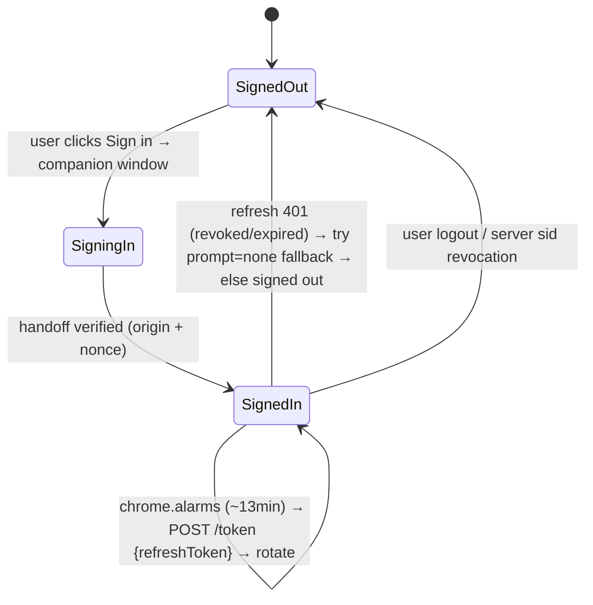

# 12 — Extension Auth: Gap Analysis & Remediation (companion-window pivot)

> **Series:** [TruePoint Browser Extension](./README.md) · **Doc:** 12 · **Status:** ✅ Drafted — **Phase A backend SHIPPED (dark)**
> · **Prev:** [`11-extension-branding`](./11-extension-branding.md)
> · **Update (2026-07-21):** §8 "Phase A (NET-NEW)" is now built — extension mint/refresh/logout + the
> `/auth/extension` handoff page + `EXTENSION_ORIGINS` all exist; see
> [`14-implementation-audit.md`](./14-implementation-audit.md). The §4 gap register's `pkceFlow.ts`/`module.ts`
> evidence is refactored past (auth is now `companionTab.ts`+`refreshToken.ts`); gaps #1/#2/#5/#7 are
> resolved by the pivot, #3/#4 collapse to pinning `EXTENSION_ORIGINS`, and #6 (`GET /me`) remains (X03).

Doc [`10`](./10-extension-authentication.md) designed the extension's auth around
`chrome.identity.launchWebAuthFlow` ("silent re-auth", ADR-0044). **In testing it does not work** — the
extension never authenticates, and instead of a clean auth window the user sees what looks like a stuck
tab. This doc diagnoses exactly why (with `file:line` evidence), explains how enterprise extensions
*actually* authenticate, and specifies the fix: **pivot to the companion-window pattern**. Governing
decision: [`ADR-0045`](../decisions/ADR-0045-extension-auth-companion-window.md) (supersedes ADR-0044's
Model A).

---

## 1. Executive summary

**Authentication is impossible against today's server**, for a concrete, provable reason: `launchWebAuthFlow`
only resolves when the browser navigates to `https://<extension-id>.chromiumapp.org/*`, but TruePoint's
login server **always** redirects the auth code to `${app_origin}/auth/callback` and never reads a
`redirect_uri`. For the extension `app_origin` is `chrome-extension://<id>`, so the code is sent to
`chrome-extension://<id>/auth/callback` — a URL the auth window is not waiting on. The window never
captures the code, never closes, and gets 302'd onto `app.truepoint.in` — the "tab" the user perceives.

Making `launchWebAuthFlow` work would require bending the **security-critical core login redirect** (shared
by the web app) plus adding a `prompt=none` path — and it *still* fights TruePoint's multi-step MFA / SSO /
WebAuthn login (those steps use `window.open` and real top-level contexts the single auth webview can't
host). **No enterprise incumbent uses `launchWebAuthFlow` for a login like this.** Apollo, ZoomInfo,
Grammarly (session/companion), and HubSpot, Salesforce, Gong (OAuth window) all **open the real web login
in a window/tab and hand a credential back**.

**The fix — companion window:** open the real web login in a popup window
(`chrome.windows.create({type:'popup'})`), let the full normal flow run (MFA/SSO/WebAuthn + the existing
`truepoint.in` session all work), then hand an **extension-scoped** token back via `externally_connectable`.
This opens a real window (the user's requirement), reuses the web session, and needs a clean, small new
backend surface instead of surgery on the core login redirect.

## 2. Symptom → root cause (the "opens a tab, never authenticates" walkthrough)

The runtime path is internally consistent — the bug is the **redirect contract**, not the extension code.

```mermaid
sequenceDiagram
  participant U as User
  participant PU as Popup
  participant SW as AuthModule
  participant WAF as launchWebAuthFlow (auth window)
  participant IdP as auth.truepoint.in
  U->>PU: click "Sign in"
  PU->>SW: AUTH_LOGIN
  SW->>WAF: launchWebAuthFlow(url=/auth/login?app_origin=chrome-extension://id&redirect_uri=…chromiumapp.org&state&prompt=login)
  WAF->>IdP: opens /auth/login (a real window)
  Note over IdP: login/page.tsx reads ONLY app_origin, code_challenge, state<br/>— redirect_uri and prompt are DROPPED
  IdP->>IdP: finishLogin() → redirect(`${app_origin}/auth/callback?code&state`)
  Note over IdP: app_origin = chrome-extension://id → redirect target is<br/>chrome-extension://id/auth/callback (NOT chromiumapp.org)
  IdP-->>WAF: 302 never hits https://id.chromiumapp.org/*
  Note over WAF: window never closes; if a session exists,<br/>redirectIfAuthenticated bounces it to app.truepoint.in → looks like a tab
  WAF-->>SW: resolves undefined → AuthError("auth_incomplete")
  SW-->>PU: still signed_out
```

**Evidence:**
- `apps/extension/src/background/auth/pkceFlow.ts:61` — `chrome.identity.launchWebAuthFlow({ url, interactive })`;
  `redirectUri()` = `chrome.identity.getRedirectURL("auth")` = `https://<id>.chromiumapp.org/auth`.
- `apps/auth/src/app/login/page.tsx:28-31` — reads `app_origin`, `code_challenge`, `state`, `email` only;
  **no `redirect_uri`, no `prompt`**; `redirectIfAuthenticated(sp.app_origin)` bounces an already-signed-in
  visitor to the app.
- `apps/auth/src/app/login/actions.ts:15-19` — carries forward only `app_origin`/`code_challenge`/`state`.
- `apps/auth/src/lib/finishLogin.ts:26-28` — `redirect(`${result.appOrigin}/auth/callback?code=…&state=…`)`;
  `result.appOrigin` is the submitted `app_origin` = `chrome-extension://<id>`.
- `apps/extension/src/background/auth/index.ts:194-196` — `runAuthFlow` returns `undefined` →
  `throw new AuthError(0, "auth_incomplete")` → `login()`'s catch swallows it → stays `signed_out`.

**There is no `tabs.create` bug.** A grep of `apps/extension` finds zero `chrome.tabs.create` /
`window.open` / `chrome.windows.create` on the auth path; the only tab-adjacent hit is a CSS constant. The
"tab" is the auth window being navigated onto `app.truepoint.in` because the code can never return to the
extension.

## 3. How enterprise extension auth actually works

### 3.1 `launchWebAuthFlow` — requirements, limits, failure modes

- **Opens a dedicated auth WINDOW** (a chrome-less webview window), not a tab. If a *tab* appears, the flow
  has already failed or a polyfill's tab-fallback fired.
- **Hard requirement to complete:** the auth server must **302 to `chrome.identity.getRedirectURL()`**
  (`https://<id>.chromiumapp.org/*`) with the code in the URL. If the flow lands on your SPA instead, the
  window never closes.
- **`interactive:false`** fails immediately if *any* interaction is needed — so a `prompt=none` server path
  is mandatory for silent use, and it too must 302 to `chromiumapp.org`.
- **Multi-step is fragile:** several top-level navigations *inside the one webview* are OK, but a
  `window.open`-based SSO/MFA step, or a **WebAuthn/passkey** step (needs a real top-level context whose RP
  ID matches the origin), break — they spill into a tab or dead-end. TruePoint's login has exactly these.
- **Cookie behavior inside the webview is undocumented** (version-dependent); relying on it is a smell.

### 3.2 The companion-window / `externally_connectable` handoff (the fit)

1. Extension opens the **real web login** in a real window:
   `chrome.windows.create({ url: "https://app.truepoint.in/auth/extension?state=<nonce>&ext_id=<id>", type: "popup" })`.
2. The user logs in with the **full normal flow** — identifier → password → MFA → **WebAuthn/passkey** → SSO
   → workspace — because it's a genuine first-party top-level page in the profile. The HttpOnly
   `SameSite=Strict` cookie on `truepoint.in` is set/used, and an existing web session often makes it instant.
3. The handoff page calls a **backend token-mint** (extension-scoped) and posts the result to the extension:
   `chrome.runtime.sendMessage("<ext-id>", { type:"AUTH_HANDOFF", accessToken, expiresIn, refreshToken, state })`.
4. The extension's `chrome.runtime.onMessageExternal` handler **verifies `sender.origin` + the `state` nonce**,
   stores the tokens, and closes the window.

### 3.3 How the incumbents authenticate

| Product | Pattern | Window/tab |
|---|---|---|
| LinkedIn Sales Navigator | rides the first-party `linkedin.com` cookie (same-site; content scripts) | neither — no separate auth |
| Apollo.io | companion **web-app session** (log into `app.apollo.io`; extension rides/hands off) | tab to web app |
| ZoomInfo (ReachOut) | companion web-app session | tab to web app |
| HubSpot / Salesforce / Gong | **OAuth connected-app** against the suite IdP | OAuth **window**/popup |
| Grammarly | web-app login + session sync to the extension | tab/window |
| 1Password | native-messaging to the desktop app (verifies extension id) | local app handshake |

**Dominant pattern:** open the web login (window or tab) so the full IdP flow runs first-party, then either
**ride the site cookie** (only when same-site — LinkedIn) or **hand a token back** (when not — TruePoint).
Almost nobody uses `launchWebAuthFlow` for a multi-step enterprise IdP; it dominates only for simple
third-party OAuth (Google/GitHub-style).

### 3.4 Silent-refresh options (extension NOT same-site with the auth cookie)

| Option | Mechanism | Verdict |
|---|---|---|
| (a) `launchWebAuthFlow(interactive:false)` vs a `prompt=none` endpoint | 302 to `chromiumapp.org` when the SSO session is valid | **Secondary fallback only** — fails on any MFA; needs the net-new `prompt=none` + `chromiumapp.org` redirect. |
| (b) **Rotating extension-scoped refresh token in the SW** | SW calls `/token` on a `chrome.alarms` schedule (~13 min) | **Primary** — self-contained, no open tab needed, independently revocable; bearer secret at rest → rotate + bind + server-revoke. |
| (c) Hidden iframe of the web origin (offscreen doc) | iframe uses the same-site cookie, `postMessage`s the token out | **Avoid as primary** — the iframe is a third-party/embedded context under `chrome-extension://`, so `SameSite=Strict` cookies aren't sent; 3P-cookie phase-out breaks it. |
| (d) Message an open `app.truepoint.in` tab | ask the tab to fetch a token with its live cookie | **Opportunistic optimization only** — needs a tab open; racy. |

### 3.5 Offscreen documents — limits

An offscreen document gives the DOM-less SW a DOM, but it is **non-interactive**, has a `chrome-extension://`
origin (so **WebAuthn won't work** and embedded `app.truepoint.in` iframes are third-party → `SameSite=Strict`
cookies not sent). Interactive MFA/WebAuthn **needs a real top-level web window** (the companion window). For
TruePoint's own IdP + an extension-scoped refresh token, **no offscreen document is needed** — the SW can
`fetch` the token endpoint directly.

## 4. Gap register (why auth is broken today)

| # | Severity | Evidence (`file:line`) | What breaks |
|---|---|---|---|
| 1 | **CRITICAL** | `apps/auth/src/lib/finishLogin.ts:26-28` (+ `login/page.tsx:28-31`, `login/actions.ts:15-19`) | Server always redirects the code to `${app_origin}/auth/callback` and ignores `redirect_uri` → for the extension that's `chrome-extension://<id>/auth/callback`, never `chromiumapp.org` → `launchWebAuthFlow` can never capture the code. Root of both "never authenticated" and the perceived "tab". |
| 2 | **CRITICAL** | `login/page.tsx` (no `prompt` read); `apps/extension/src/background/auth/index.ts:43-47,153-170` | No `prompt=none` silent-authorize branch → worker-wake `init()`, pre-expiry `reauth()`, and workspace/org switch all render the login form and return `undefined` → **all** silent re-auth fails. |
| 3 | **CRITICAL** | `packages/config/src/env.ts:38-42` (default-off); `apps/auth/src/lib/cors.ts:11`; `token/exchange/route.ts:35-37` | `EXTENSION_ORIGINS` unset → the exchange POST from `chrome-extension://<id>` is **403'd**; the token `aud` is also rejected by the API. Even a captured code can't be exchanged. |
| 4 | **HIGH** | `apps/auth/src/app/password/actions.ts:40` (+ signup/magic/sso actions) | Same missing `EXTENSION_ORIGINS`: `isAllowedOrigin(appOrigin)` fails mid-flow → login bounces to `/password?error=1`. The server-side login can't even complete for the extension origin. |
| 5 | **MEDIUM** | `apps/extension/src/background/auth/pkceFlow.ts:41-42` vs server usage of `app_origin` | The design conflates two values: the extension needs token `aud` **and** a browser redirect, but the server uses the single `app_origin` for both — there's no field to separate audience from redirect. |
| 6 | **MEDIUM (non-blocking)** | `apps/extension/src/background/auth/account.ts:9` → `GET /api/v1/me` | No such route exists → popup shows no name/email; fetched off the token path so it fails to `null` (doesn't block login). |
| 7 | **LOW** | `apps/extension/src/background/auth/index.ts:112-114` → `/auth/logout?redirect_uri=…` | Logout's server-session clear relies on the same unsupported round-trip; local token clear still works. |

The companion-window pivot **eliminates gaps #1, #2, #5, #7 entirely** (no `launchWebAuthFlow` redirect,
no `prompt=none`, no `app_origin`-as-redirect conflation) and turns #3/#4 into a single clean
`EXTENSION_ORIGINS` + `externally_connectable` registration. #6 becomes the `/api/v1/me` route (or is folded
into the handoff payload).

## 5. Why `launchWebAuthFlow` is the wrong primary

- **It requires a `chromiumapp.org` terminal 302** — which means changing the core login redirect
  (`finishLogin`) that the web app also depends on. That's security-critical surgery for a client the IdP
  wasn't designed to serve.
- **It can't host TruePoint's login steps** — `window.open`-based SSO and **WebAuthn/passkey** MFA need real
  top-level contexts; inside the single auth webview they spill into a tab (exactly the reported symptom) or
  fail.
- **`prompt=none` silent auth is brittle** — undocumented webview cookie behavior + 3P-cookie phase-out.
- **It's not what enterprises do** for a multi-step IdP (§3.3).

Keep it only as a **secondary** silent-refresh fallback (§3.4a) if/when the `prompt=none` endpoint exists.

## 6. Target design — companion window + handoff

### 6.1 Interactive login

```mermaid
sequenceDiagram
  participant PU as Popup
  participant SW as AuthModule (SW)
  participant W as Popup window (app.truepoint.in/auth/extension)
  participant IdP as auth.truepoint.in
  participant API as extension token-mint
  PU->>SW: AUTH_LOGIN
  SW->>SW: state = random nonce (store in storage.session)
  SW->>W: chrome.windows.create({type:'popup', url:/auth/extension?state&ext_id})
  W->>IdP: full normal login (password → MFA → WebAuthn → SSO → workspace)
  Note over W,IdP: first-party top-level page → SameSite=Strict cookie set,<br/>existing session reused, MFA/WebAuthn all work
  W->>API: POST mint extension-scoped token (with the web session)
  API-->>W: { accessToken (aud=extension), expiresIn, refreshToken (rotating) }
  W->>SW: chrome.runtime.sendMessage(extId, {type:"AUTH_HANDOFF", ...tokens, state})
  SW->>SW: onMessageExternal: verify sender.origin === app.truepoint.in && state matches
  SW->>SW: store access (storage.session) + refresh (storage.local, encrypted); schedule chrome.alarms
  SW->>W: close window
  SW-->>PU: STATE_CHANGED (signed_in)
```

### 6.2 Silent refresh + lifecycle



- **Access token:** `aud=extension`, ~15-min, in `chrome.storage.session` (memory-backed, cleared on browser
  close). **Refresh token:** rotating, extension-scoped, in `chrome.storage.local` **encrypted** (WebCrypto
  AES-GCM), server-revocable, reusing the shipped rotation + reuse-detection (`packages/auth/src/session.ts`).
- **Refresh:** SW `POST /token {refreshToken}` on a `chrome.alarms` tick; `ApiClient` 401-retry-after-refresh
  (already built) covers reactive refresh.
- **Secondary fallback:** `launchWebAuthFlow(interactive:false)` against a future `prompt=none` endpoint.

## 7. Security model of the handoff

- **`externally_connectable` narrowed** to `https://app.truepoint.in/*` (and `https://*.truepoint.in/*` only
  if needed) — never `<all_urls>`; the manifest can't wildcard the eTLD anyway.
- **Verify every handoff:** `sender.origin === "https://app.truepoint.in"` **and** the `state` nonce matches
  the one the SW generated — reject otherwise. `chrome.runtime` is exposed to *every* matching page, so the
  payload alone is never trusted.
- **Extension-scoped credential only:** the mint returns a token with `aud=<fixed extension audience>` and a
  **separate rotating refresh token** — **never** the web app's access token and **never** the HttpOnly
  refresh cookie (which can't be moved anyway). The extension's blast radius is independent and independently
  revocable (its own `sid` family on the deny-list).
- **Least privilege:** `identity` permission is kept only for the secondary `prompt=none` fallback; drop it
  if that fallback is deferred. No `cookies`/`webRequest`.

## 8. Fix plan (phased)

### Phase A — Backend (NET-NEW, security-reviewed; **CI-itest-gated** — this host can't run auth itests)
1. **Extension token-mint + rotating-refresh endpoint** (`aud=extension`), reusing `packages/auth/src/session.ts`
   rotation/reuse-detection. Likely on `apps/api` (Bearer/handoff-authorized) or `apps/auth`.
2. **`/auth/extension` handoff page** (on `apps/web` or `apps/auth`) that, after the normal login completes,
   mints the extension token and `chrome.runtime.sendMessage`s it to `ext_id`, echoing the `state` nonce.
3. **Register the published extension id** in `EXTENSION_ORIGINS` (`packages/config/src/env.ts`, already
   wired into `appOrigins()`/`isAllowedOrigin()`) and in the manifest `externally_connectable`.
4. **(Optional) `GET /api/v1/me`** for the display identity (or fold name/email/workspace into the handoff).
5. **(Optional, later) `prompt=none` silent-authorize** + `chromiumapp.org` redirect support for the
   secondary fallback — only if that fallback is pursued.

### Phase B — Extension (pivot `apps/extension/src/background/auth/`)
- **Add `companionWindow.ts`** — open the popup, generate/track the `state` nonce, await the
  `onMessageExternal` handoff (verify origin + nonce), return the tokens. Register the `onMessageExternal`
  listener in the SW.
- **Add `refreshToken.ts`** — AES-GCM-encrypted rotating-refresh store in `chrome.storage.local` + body-based
  `POST /token` refresh.
- **Rewire `index.ts`/`sessionManager`** — `login()` uses the companion window; `refreshNow()` uses the
  refresh token; keep `tokenStore`/`account`/the modular split; keep the `chrome.alarms` pre-refresh + the
  `ApiClient` 401-retry (already built).
- **Retire `pkceFlow.runAuthFlow` + `silentAuth` as the PRIMARY path** — keep a thin `launchWebAuthFlow`
  helper only for the secondary `prompt=none` fallback (or delete until Phase A.5).
- **`manifest.config.ts`** — add `externally_connectable: { matches: ["https://app.truepoint.in/*"] }`;
  keep `identity` only if the fallback ships.

### Phase C — Docs
- Amend doc `10`: mark the launchWebAuthFlow "Model A" superseded → point to this doc + ADR-0045.
- `ADR-0045` supersedes ADR-0044's Model A.

## 9. Migration · rollout · testing · risks

- **Gated:** everything stays behind `CHROME_EXTENSION_ENABLED` + a per-tenant flag; the token-mint is a new
  credential path → **security review + CI itests before enabling**; extension id pinned (never a wildcard).
- **Testing:** unit (fake `chrome.windows`/`onMessageExternal`/`alarms`/`storage`; assert **origin + nonce
  rejection**, refresh rotation, 401-retry); E2E (Playwright: stub `/auth/extension` handoff page → window →
  handoff → token in `storage.session`, refresh token encrypted in `storage.local`, never the web token).
- **Risks:** `externally_connectable` surface (mitigated by origin + nonce); a rotating refresh token at rest
  (mitigated by encryption + rotation + reuse-detection + short access TTL + `sid` revocation); the popup UX
  on multi-monitor (size/center the window). All tracked in ADR-0045.

Cross-refs: the superseded target [`10`](./10-extension-authentication.md); the branding of the auth
surfaces [`11`](./11-extension-branding.md); decisions
[`ADR-0045`](../decisions/ADR-0045-extension-auth-companion-window.md) (supersedes
[`ADR-0044`](../decisions/ADR-0044-extension-authentication.md)), ADR-0016/0019/0040/0043.
