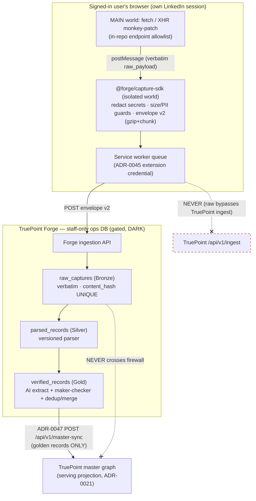

# ADR-0046 — Raw API interception as primary capture (amends ADR-0043 decision #4)

- **Status:** Proposed
- **Date:** 2026-07-05
- **Related:** ADR-0043 (Chrome-extension architecture — **this ADR amends decision #4**, reversing its
  rejection of MAIN-world interception), ADR-0045 (extension companion-window auth — the extension-scoped
  credential the interceptor rides), ADR-0021 (Layer-0 master graph — becomes the downstream serving
  projection), ADR-0047 (TruePoint Forge master-sync — the *only* path any raw-derived data reaches the
  production CRM).
- **Detail:** `docs/planning/forge/07-raw-api-processing-engine.md` (the parse/extract/verify engine that
  consumes what this captures), `docs/planning/forge/14-security-and-access-control.md` (the residency,
  retention, DPIA, and access controls), `docs/planning/chrome-extension/01-apollo-teardown.md` (the
  interception technique, now the implementation template).

> **Canonical contract (locked by this ADR).** The TruePoint browser extension gains a **MAIN-world raw-API
> interception adapter** — an Apollo-style `XHR`/`fetch` monkey-patch — that captures **verbatim private-API
> JSON** (e.g. LinkedIn Voyager) from the signed-in user's *own* session and posts **envelope v2** to
> **TruePoint Forge's** ingestion API, **never** to TruePoint's `/api/v1/ingest`. A **compliance firewall**
> guarantees raw scraped payloads terminate in Forge's `raw_captures` and never reach the production CRM;
> only **`verified_records`** (golden records after AI extract + human approval + dedup/merge) cross the
> ADR-0047 sync contract. The capability ships **DARK** behind a global kill-switch **and** a per-tenant flag
> and does not GA until an explicit **legal + DPIA sign-off**. This reverses a deliberate ADR-0043 compliance
> posture; the reversal is scoped, gated, and firewalled — see the risk register below.

---

## Context

ADR-0043 **decision #4** (`ADR-0043:43-46`) deliberately **rejected** MAIN-world interception: *"We do **not**
inject a MAIN-world script or read any site's private APIs … extract only the **rendered, user-visible**
profile."* Its alternatives table (`ADR-0043:85-86`) explicitly rejected a *"Faithful Apollo clone (MAIN-world
interception of LinkedIn private APIs)"* on ToS/scraping grounds, with the security skill given final say. The
shipped extension honors that: the content script matches `https://*.linkedin.com/*` only and **captures
visible-DOM profile-header fields only** — `fullName`, `jobTitle`, `location`, `profileUrl`, `publicId` — with
**no XHR/API interception** (ecosystem-facts §E).

Three facts change the calculus and force a reconsideration:

1. **TruePoint Forge is a separate, internal, staff-only data-operations platform** upstream of the production
   CRM, with its own DB and apps (decision-ledger L1–L2). The collection-liability surface and the
   customer-facing product are now **architecturally different systems**. That separation is the precondition
   that makes interception defensible enough to *build* (dark), where it was not defensible to bolt onto the
   customer CRM.
2. **DOM-visible capture is structurally thin.** The five header fields the current extension reads
   (ecosystem-facts §E) are a fraction of what the user's *own* session already fetches. The private Voyager
   GraphQL / Sales-Navigator / Recruiter payloads carry full current + past **experience** (company, title,
   dates), **education**, **skills**, connection degree, and company firmographics
   (`01-apollo-teardown.md` §3.2) — precisely the structured richness Forge's entity-resolution, enrichment,
   and golden-record engines need to be competitive as a sales-intelligence dataset [S4].
3. **The technique itself is industry-standard and low-novelty.** The MAIN-world `fetch` +
   `XMLHttpRequest.prototype` monkey-patch, a `CustomEvent`/`postMessage` bridge to the isolated world, and
   secret redaction before the process boundary is the current MV3 method used by Apollo, PhantomBuster, and
   TexAu [S13]; the Apollo teardown documents it end-to-end (`01-apollo-teardown.md` §1.5, §3.1). The research
   verdict on this decision is **ESCALATE** (research-corpus verdict (a)): the *technique* is confirmed sound,
   but the **"primary" designation carries an unresolved legal/ToS/channel risk that must be signed off before
   GA** — the single largest open risk in the whole Forge suite (Ledger OQ-2, research OQ-R1).

The existing ingestion stub cannot absorb this shape. `packages/types/src/ingestion.ts`'s `ingestionEnvelope`
records are a `rawObservation` field-bag with **no verbatim raw-payload / endpoint / schema_version field**
(ecosystem-facts §A), and `POST /api/v1/ingest` validates then **returns `202` and stores nothing**
(ecosystem-facts §A). Forge therefore introduces a **new, superset contract** ("envelope v2") posted to its
**own** ingestion API — not an edit to TruePoint's frozen envelope (decision-ledger L3).

## Decision

1. **The extension gains a MAIN-world raw-capture adapter (opt-in, additive to DOM capture).** A per-site
   interceptor injected at `document_start` in `world:"MAIN"` monkey-patches `window.fetch` and
   `XMLHttpRequest.prototype.{open,send}`, captures the **verbatim response body** of an **in-repo endpoint
   allowlist** (v1: LinkedIn Voyager `/voyager/api/graphql` profile/search operations, `/sales-api/*`,
   `/talent/api/*` — `01-apollo-teardown.md` §2.2), and bridges each payload to the isolated-world content
   script via a typed `postMessage` protocol (`01-apollo-teardown.md` §1.5). Capture is **passive**: it reads
   only responses the **signed-in user's own session already issued** while browsing normally — the extension
   **never** synthesizes navigation, replays requests, paginates, or drives search to harvest beyond what the
   user viewed. This extends ADR-0043's "only what the user sees" spirit to "only what the user's own session
   fetched." The DOM adapter (ADR-0043 #4) is retained as a fallback/augmentation, not removed.

2. **It posts envelope v2 to Forge's ingestion API — never to TruePoint's `/api/v1/ingest`.** Envelope v2 is
   TruePoint's `ingestionEnvelope` **plus** per-record `raw_payload` (verbatim, opaque), `endpoint` (e.g.
   `voyager/identity/profiles`), and `schema_version`, with an envelope-level **size cap + gzip + chunking**
   (decision-ledger L3). It is a **new Forge-owned contract** built in `@forge/capture-sdk` (interceptor
   helpers + envelope-v2 builder + size/PII guards, shared with the extension — decision-ledger L8), **not**
   an edit to `packages/types/src/ingestion.ts`. Before the payload crosses the isolated-world → service-worker
   → network boundary, the capture-SDK **redacts secrets** (any `Authorization`/`Bearer`/`csrf`/cookie header
   or token-shaped field), enforces per-record and per-envelope byte caps, and drops any response outside the
   allowlist. Ingest-time dedup is `content_hash` UNIQUE on Forge's `raw_captures` (mirrors
   `source_records.content_hash`, ecosystem-facts §B); abuse control extends the `checkCaptureRate`
   record-volume throttle posture (ecosystem-facts §A). The endpoint lives on Forge; the raw path **does not**
   touch the TruePoint API surface.

3. **Compliance firewall: raw scraped payloads live only in Forge's `raw_captures` and never reach the
   production CRM.** The medallion flow is `raw_captures → parsed_records → verified_records → (sync) →
   TruePoint master graph` (decision-ledger L2). Raw and parsed layers are **staff-only, inside Forge's ops
   DB**. The **only** data that crosses into the TruePoint production CRM is a **`verified_records` golden
   record** — produced by versioned parse + AI structured extraction + **human maker-checker approval** +
   dedup/merge — pushed via ADR-0047's `POST /api/v1/master-sync` (see ADR-0047 / `07-raw-api-processing-engine.md`
   for the engine; this ADR does not restate it). No verbatim `raw_payload`, no un-approved candidate, and no
   raw-provenance blob crosses the firewall. TruePoint's `master_*` graph becomes a **downstream serving
   projection** (ADR-0021, decision-ledger L4). This separation is the load-bearing compliance control: the
   collection surface is quarantined in a gated, staff-only system, and the customer product only ever sees
   human-verified golden entities.

4. **Gated by a global kill-switch + a per-tenant flag; DARK until legal sign-off.** The adapter ships behind
   a **global kill-switch** and a **per-tenant enablement flag** and is **off by default**, mirroring the
   ADR-0043 posture (`CHROME_EXTENSION_ENABLED`, `INGESTION_EVIDENCE_ENABLED`, `EXTENSION_ORIGINS` all off by
   default — ecosystem-facts §E). No tenant, and no build, runs interception until the GA gate in decision #6
   is cleared. The kill-switch is fleet-wide and takes effect on the next signed-config refresh
   (`chrome.alarms`-driven, per ADR-0043 #6), giving an instant "stop collecting" control.

5. **Signed remote config can flip flags / kill only — never change extraction rules.** We keep ADR-0043
   decision #7 verbatim: remote config is **signature-checked** and may only toggle vetted feature flags or
   kill the extension; it can **never** swap the endpoint allowlist, the interception targets, or extraction
   behavior. Unlike Apollo's remotely-tunable `apiSelectors` + version-router (`01-apollo-teardown.md` §1.6),
   **the behavior in the store-reviewed build is the behavior that runs.** The endpoint allowlist and all
   parsers are **in-repo**, versioned, and change only through a reviewed store release — this is both an
   anti-tamper control and the property that keeps the capability legally reviewable (a fixed, auditable scope
   of what is collected).

6. **Explicit legal + DPIA sign-off gate for GA (non-negotiable, GA-blocking).** GA of interception requires,
   as a hard gate: (a) a **Data Protection Impact Assessment** covering the raw→verified→production lifecycle;
   (b) a **documented per-source Article 6(1)(f) legitimate-interest assessment** completed *before* collection
   for each intercepted source, with the balancing test recorded; (c) a **GDPR Article 14 notification
   mechanism** for EU data subjects and a subject-lookup index spanning `raw_captures → parsed_records →
   verified_records → production`; (d) a **DPDP §7 consent posture** for India-origin data (treated as
   highest-restriction — consent-or-not-processable, no legitimate-interest escape); and (e) a **Chrome Web
   Store single-purpose / Limited Use** review (or an off-store enterprise distribution decision). This gate is
   Ledger OQ-2 / research OQ-R1; it is **GA-blocking, not planning-blocking** — the capability may be *built*
   and tested dark while the gate is open, but **must not be enabled for any tenant** until counsel and the DPO
   sign off. Security has final say (project precedence rule).

### Data flow and the compliance firewall

The firewall is a data-flow invariant, not a policy note: the raw path terminates in Forge, and the **only**
edge crossing into the production CRM is a human-verified golden record over ADR-0047's sync.

The dashed `x` edges are the two invariants this ADR locks: the raw path never touches TruePoint's
`/api/v1/ingest`, and `raw_captures` never crosses into the production CRM.

## Rationale

- **The firewall is what makes reversal defensible.** ADR-0043 #4 rejected interception because it would put
  private-API scraping behind the *customer CRM*. Forge removes that coupling: interception now feeds a
  **separate, staff-only, gated** ops system, and only human-verified golden records — carrying no raw payload
  — reach the customer product (decision #3). The thing ADR-0043 was protecting (the customer product's trust
  and legal posture) is protected *more* strongly here, because the raw surface is quarantined behind a
  maker-checker approval and a firewall, not merely "not scraped."
- **The technique is passive and rides the user's own session — no credential theft, no barrier
  circumvention.** The interceptor reads what the user's authenticated session already fetched; it holds **no
  provider keys**, requests **no `chrome.cookies` permission**, and exports no cookies (`01-apollo-teardown.md`
  §7). It is the same posture as a human reading their own LinkedIn tab, captured programmatically. This
  materially narrows (but does **not** eliminate — see the register) the ToS/CFAA exposure.
- **Structured richness is the product need.** DOM-visible capture yields five header fields
  (ecosystem-facts §E); the intercepted Voyager payload yields the full employment/education/skills/firmographic
  graph (`01-apollo-teardown.md` §3.2). Forge's ER (Fellegi-Sunter), enrichment waterfall, and survivorship
  need that structure to build golden records competitive with the category leaders, who run in-house ER over
  richly-sourced data [S4]. Interception is a **complement** to (not a replacement for) the industry's real
  primary moat — the contributory "co-op" network [S2] — which is carried as research OQ-R3.
- **Envelope v2 as a superset, not an edit, keeps TruePoint's frozen contract intact.** TruePoint's
  `ingestionEnvelope` and `/api/v1/ingest` stub stay untouched (ecosystem-facts §A); Forge owns its own richer
  contract and its own endpoint (decision-ledger L3). This respects the platform precedence rule (Platform owns
  the TruePoint API contract) — Forge builds *alongside* it, not *into* it.
- **Anti-tamper by in-repo extraction rules.** Pinning extraction to the store-reviewed build (decision #5)
  gives regulators, store reviewers, and our own DPIA a **fixed, auditable scope** of what is collected —
  impossible if selectors were remotely swappable. Kill-only remote config still gives an instant fleet stop.

## Alternatives considered

| Option | Verdict | Why |
|---|---|---|
| **Keep ADR-0043 #4 as-is (DOM-visible capture only)** | Rejected | Structurally thin (five header fields, ecosystem-facts §E); cannot feed a competitive golden-record dataset [S4]. The compliance reasons that motivated #4 are now satisfied differently — by the Forge firewall — so the capability constraint no longer buys the protection it was meant to. |
| **Interception, but post to TruePoint's `/api/v1/ingest`** | Rejected | Would route raw scraped payloads through the customer CRM's ingestion surface, re-coupling collection liability to the product ADR-0043 #4 protected. The envelope also has no `raw_payload`/`endpoint`/`schema_version` field (ecosystem-facts §A). Violates the firewall (decision #3). |
| **Interception with remotely-tunable selectors (Apollo `apiSelectors` model)** | Rejected | Lets shipped behavior change without store review (`01-apollo-teardown.md` §1.6) — an anti-tamper and legal-reviewability failure. Keeps ADR-0043 #7: kill/flag-only signed config, extraction in-repo. |
| **Server-side headless scraping (Forge crawls LinkedIn directly)** | Rejected | Not riding the user's own session removes the "user's own data" framing entirely, is squarely the logged-in-scraping fact pattern the precedents penalize [S11][S10], and adds bot-detection/IP-reputation liability Forge would own directly. Interception at least keeps collection inside the user's consented session. |
| **Ship interception GA'd behind a flag, sign off legal "later"** | Rejected | The legal/DPIA sign-off is **GA-blocking** (decision #6). Enabling collection before the Art 6 LIA + Art 14 mechanism + DPDP posture exist is the exact Clearview failure mode (€30.5M) [S116]. Build dark; do not enable. |
| **Contributory co-op network *instead of* interception** | Deferred | The co-op network is the category's actual primary moat [S2] and a lower-risk channel, but it is a large separate build and does not yield the per-profile depth interception does. Carried as research OQ-R3 as a **complement**, not a substitute, to this decision. |

## Consequences

**Positive.**
- Forge captures the full structured private-API record (employment/education/skills/firmographics,
  `01-apollo-teardown.md` §3.2), not five DOM fields — the input quality its ER/enrichment/survivorship need.
- The compliance firewall (decision #3) means the customer CRM never holds a raw scraped payload; its legal and
  trust posture is *strengthened* relative to ADR-0043, not weakened.
- Reuses the `@forge/capture-sdk` interceptor/envelope helpers across extension and future capture surfaces
  (decision-ledger L8); reuses the shipped `checkCaptureRate` abuse posture and `content_hash` idempotency
  (ecosystem-facts §A–§B).
- Instant fleet kill-switch and per-tenant gating (decision #4) give a clean "stop collecting" control and a
  staged-rollout lever.
- In-repo extraction rules (decision #5) keep the collected scope fixed and auditable for the DPIA and store
  review.

**Costs & trade-offs.**
- **This reverses a deliberate compliance guardrail** (ADR-0043 #4). The reversal is scoped (Forge-only,
  firewalled, gated) and honest about it — but it is a real posture change and inherits the ESCALATE risk of
  research verdict (a). The mitigations are the firewall + gating + DPIA gate, not a claim that the risk is
  gone.
- MAIN-world injection widens the extension's technical and store-review surface (Apollo's `world:"MAIN"`
  interception is exactly the posture that draws Chrome Web Store scrutiny, `01-apollo-teardown.md` §4.3, §7).
- Interception behind LinkedIn's auth is the **logged-in** fact pattern that pro-scraping precedents do **not**
  protect (see register) — the account/anti-bot and ToS exposure lands partly on the **user**.
- Raw PII now lives (transiently) in `raw_captures`; GDPR Art 17 erasure and Art 14 notice must reach the raw
  layer (short retention TTL + tombstoning), a net-new obligation [S117][S16].
- GA is blocked on legal/DPIA sign-off (decision #6) — the capability may sit built-but-dark for an extended
  period.

**Net-new work.**
- `@forge/capture-sdk`: MAIN-world `fetch`/`XHR` monkey-patch, `postMessage` bridge, secret-redaction +
  size/PII guards, envelope-v2 builder (gzip + chunking) — decision-ledger L8, detail in
  `07-raw-api-processing-engine.md`. (Capture-SDK single-sourcing is Ledger OQ-6 / research OQ-6.)
- The extension MAIN-world adapter + isolated-world receiver, injected at `document_start`, gated behind the
  global + per-tenant flags, riding the ADR-0045 companion-window extension credential.
- Forge's ingestion API endpoint (envelope-v2 validate → `raw_captures` upsert on `content_hash`), the
  `raw_captures` schema + object-store substrate for large blobs (detail in `07-…`, storage substrate OQ-4),
  and the retention-TTL + tombstoning + subject-lookup index (`14-security-and-access-control.md`).
- The DPIA, per-source Art 6(1)(f) LIA template, Art 14 notification mechanism, DPDP §7 India posture, and the
  Chrome Web Store single-purpose / off-store decision (decision #6; counsel + DPO owned).
- Migration/retirement decision for TruePoint's existing dark `chrome_extension` connector and its
  `/api/v1/ingest` DOM path (Ledger OQ-5).

## Legal, ToS & abuse risk register

This register is deliberately candid: interception behind a login is a materially riskier posture than
ADR-0043's DOM-visible capture, and the mitigations reduce — they do not erase — the exposure. `[S#]` refer to
`_context/research-corpus.md`.

| # | Risk / theory | Fact pattern & precedent | Severity | Mitigation |
|---|---|---|---|---|
| R1 | **ToS breach (contract / trespass to chattels)** | Meta v. Bright Data held a platform-ToS breach would exist **only where data is scraped while logged in** — Forge's exact fact pattern — even as Meta *lost* on the public-data facts [S11][S19]. hiQ ultimately **lost** on breach-of-contract/misappropriation with a ~$500K stipulated judgment despite the narrow-CFAA "win" [S10]. | High | Firewall (raw quarantined in Forge, decision #3); passive capture of the user's *own* authenticated session only (decision #1); DARK + per-tenant gate (decision #4); framing as the user's own data. **Residual, GA-blocking — counsel sign-off (decision #6).** |
| R2 | **CFAA "without authorization" (US)** | hiQ / Van Buren narrowed CFAA: accessing **public** data is not "without authorization" [S12]. But data behind LinkedIn's **authentication** is not public, so the narrow-CFAA shield is weaker here; the theory shifts toward ToS/contract (R1) rather than CFAA. | Medium | No credential theft, no technical-barrier circumvention, no access to anything the user's own session couldn't fetch (decision #1). Legal review to confirm the logged-in-own-session posture stays clear of CFAA (decision #6). |
| R3 | **GDPR Art 6 — no lawful basis for scraped PII** | The Dutch DPA fined **Clearview €30.5M** for aggregating scraped PII with **no Art 6 basis** and held a company's own **business interest is *not* "legitimate interest"** [S116]; broader EU scraping-enforcement trend is adverse [S17][S18]. | High | Documented **per-source Art 6(1)(f) LIA before collection** (decision #6); data minimization (endpoint allowlist + secret redaction + field minimization, decision #2); short retention TTL + tombstoning on `raw_captures` [S117]; DPIA. **GA-blocking.** |
| R4 | **GDPR Art 14 — notice duty for indirectly-collected PII** | Art 14 requires informing a data subject whose PII was obtained **not from them** — generally **within one month** [S16]; Clearview also breached Arts 12/14/15 by not notifying subjects [S116]. | High | Art 14 notification mechanism + subject-lookup index spanning raw→parsed→verified→production (decision #6, detail in `14-…`). Hard to satisfy at scale — **explicitly GA-blocking**. |
| R5 | **India DPDP Act §7 — consent-primary, no legitimate-interest escape** | DPDP 2023 makes **consent the primary ground** with only a closed §7 "legitimate uses" list and **no** GDPR-style legitimate-interest balancing; the Data Fiduciary stays liable regardless of processor contract [S118]. | High | Treat **India-origin data as highest-restriction** — consent-or-not-processable; residency tagging + processing gate (decision #6, `14-…`). |
| R6 | **Chrome Web Store — data-collection / Limited Use / single-purpose** | The Limited Use program restricts use/transfer of user data and **bars selling to "information resellers"**; single-purpose and disclosure requirements tightened under the 2026 policy updates [S14][S15]. | Medium-High | Single-purpose declaration framed as **user-consent / user's-own-data**; no on-store resale framing; MAIN-world scope disclosed. Fallback: **off-store enterprise distribution** if the store posture is untenable (decision #6, research OQ-R2). |
| R7 | **Account / anti-bot risk to the *user*** | LinkedIn's anti-automation can flag, restrict, or ban an account exhibiting non-human patterns; interception is the technique class platforms actively detect [S13]. The cost lands on the user, not just Forge. | Medium | **Passive** capture only — no synthetic navigation, replay, pagination, or search-harvesting; capture only responses the user's own browsing already triggered (decision #1); rate-limit via `checkCaptureRate` posture (decision #2); no bulk export beyond user-viewed surfaces. |
| R8 | **Reversal of a documented compliance decision (governance)** | ADR-0043 #4 rejected this on the record with security given final say (`ADR-0043:43-46`, `85-86`). Silently reversing it is a governance/audit risk. | Low-Medium | This ADR **openly amends** ADR-0043 #4, scopes the reversal (Forge-only, firewalled, gated), and routes GA through an explicit security/legal gate (decision #6). The reversal is auditable, not silent. |

**Mitigation posture, summarized.** The firewall (raw never crosses to production) + gating (global kill-switch
+ per-tenant flag + DARK) + minimization (in-repo endpoint allowlist, secret redaction, field minimization) +
retention (short TTL + tombstoning so raw PII ages out, reaching the raw layer for Art 17 [S117]) + the
GA-blocking DPIA/legal gate together bound the exposure. **None of these makes interception legal by
assertion** — R1/R3/R4/R5/R6 are all carried as GA-blocking items requiring counsel and the DPO. Build dark;
do not enable a single tenant until the gate clears.

## Consequences for gap register

| Gap | Responsibility area | Summary |
|---|---|---|
| **G-FORGE-4601** | Security / Legal | Art 6(1)(f) per-source LIA + DPIA not yet authored; GA-blocking (decision #6). Owner: `14-…` + counsel. |
| **G-FORGE-4602** | Security / Data | GDPR Art 14 notification mechanism + cross-layer subject-lookup index unbuilt (decision #6, R4). |
| **G-FORGE-4603** | Security / Data | India DPDP §7 residency tagging + consent/processing gate for interception-origin data (R5). |
| **G-FORGE-4604** | Platform / Extension | `@forge/capture-sdk` MAIN-world interceptor + envelope-v2 builder + redaction/size guards not built (decision #1–2; OQ-6). |
| **G-FORGE-4605** | Platform / Data | `raw_captures` retention-TTL + tombstoning so raw PII ages out of backups [S117] (decision #3, R3). |
| **G-FORGE-4606** | Design / Ops | Chrome Web Store single-purpose declaration vs off-store distribution decision (R6, research OQ-R2). |

## Revisit if

- **Legal/DPIA sign-off is withheld or narrowed** — if counsel rejects logged-in interception (R1/R2) or the
  Art 14 mechanism (R4) proves unworkable at scale, fall back to DOM-visible capture (ADR-0043 #4) and/or
  pivot the primary channel to the contributory co-op network (research OQ-R3).
- **Chrome Web Store rejects the single-purpose posture** (R6) — move to off-store enterprise distribution or
  drop MAIN-world interception from the store build.
- **LinkedIn (or another target) materially changes ToS, private-API auth, or anti-bot** such that the
  passive-own-session framing no longer holds (R1/R7).
- **The firewall assumption is violated** — if any raw payload path to the production CRM is ever proposed,
  this ADR and ADR-0047 must both be re-opened; the firewall is load-bearing for the entire risk posture.
- **A regulator issues on-point enforcement** against a LinkedIn contact-interception tool (the Clearview /
  KASPR trajectory, [S116]) — re-assess the LIA and the whole primary-interception designation.

## Open questions

- **OQ-2 (Ledger) / OQ-R1 (research) — interception legal sign-off (GA-blocking).** The Art 6(1)(f) LIA, Art
  14 notice mechanism, DPDP §7 posture, and DPIA (decision #6) need counsel + DPO, not planning. This is the
  single largest GA gate in the Forge suite. [S116][S118][S16][S17][S18]
- **OQ-R2 (research) — Chrome Web Store single-purpose / Limited Use vs off-store distribution.** Does the
  MAIN-world build survive store review under the 2026 policy, or does it need an enterprise off-store path?
  (R6.) [S14][S15]
- **OQ-R3 (research) — contributory co-op channel as a complement.** The industry's real primary moat is
  contributory data [S2], which interception does not center. Should Forge stand up a contributory channel
  alongside interception rather than resting on interception as sole primary?
- **OQ-5 (Ledger) — migration/retirement of TruePoint's dark `chrome_extension` connector.** With raw capture
  routed to Forge, what happens to the existing `/api/v1/ingest` DOM path and its connector (ecosystem-facts
  §A, §E)?
- **OQ-6 (Ledger) — `@forge/capture-sdk` single-sourcing.** Is the interceptor/envelope-v2 SDK shared verbatim
  between the extension and Forge, or forked? (decision-ledger L8.)
- **Retention TTL value for `raw_captures`** — the specific TTL that satisfies Art 17 reach-the-raw-layer
  [S117] while preserving enough window for reprocessing/reparse is unset; owned by
  `14-security-and-access-control.md` and OQ-4 (raw-blob substrate).
