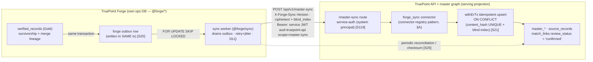
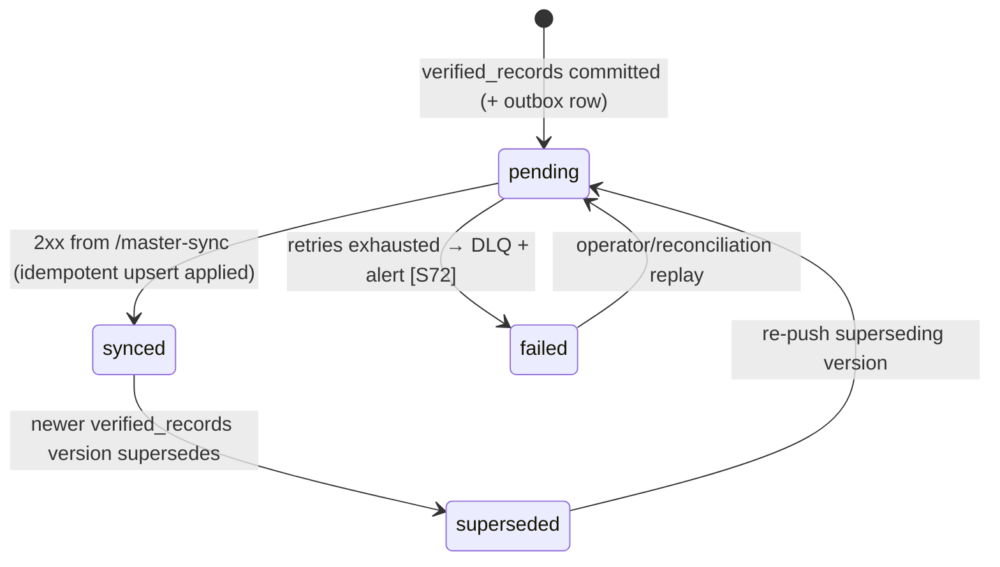

# ADR-0047 — TruePoint Forge as master-graph upstream + versioned sync contract

- **Status:** Proposed
- **Date:** 2026-07-05
- **Related:** [ADR-0021](./ADR-0021-global-master-graph-and-overlay.md) (Layer-0 master graph + Layer-1 overlay) · [ADR-0015](./ADR-0015-entity-resolution-dedup-engine.md) / ADR-0037 (entity resolution & dedup) · [ADR-0027](./ADR-0027-real-time-delivery-and-event-backbone.md) (transactional outbox) · [ADR-0046](./ADR-0046-raw-api-interception-primary-capture.md) (raw-interception capture; the raw layer this pipeline consumes) · `packages/db/src/schema/masterGraph.ts` (the sync target, `ecosystem-facts §B`)
- **Context doc:** [Forge 01 — Research Findings & Industry Analysis](../forge/01-research-findings-and-industry-analysis.md); frozen vocabulary in [`_context/decision-ledger.md`](../forge/_context/decision-ledger.md) (L4/L5); TruePoint current-state in [`_context/ecosystem-facts.md`](../forge/_context/ecosystem-facts.md)

> **Canonical contract (locked by this ADR).** TruePoint Forge owns entity resolution and the golden-record
> lifecycle (`raw_captures → parsed_records → verified_records`) in its **own** ops DB; TruePoint's
> `master_*` graph becomes a **downstream serving projection** fed **only** by a one-way, versioned
> **HTTP push** to `POST /api/v1/master-sync`, applied idempotently by a new **`forge_sync` connector**
> bound to a **system principal**. TruePoint's own `er/` + `erSweep` stay **inert for ingestion**. This ADR
> is the locking authority; deep detail lives in the Forge suite (see *Forge 05-database-design*, *Forge
> 11-database-synchronization-engine*, *Forge 20-future-enhancements*).

## Context

TruePoint's ingestion path is a validated stub: `POST /api/v1/ingest` runs `authn → tenancy →
requireRole` , enforces the tenant trust boundary, then **returns `202 {accepted}` and stores nothing** —
its own header comment defers "evidence → resolve → enrich → land" to later slices (`ecosystem-facts
§A`). The sync **target** already exists as schema only: `master_companies/master_persons/
master_employment/master_emails/master_phones/source_records/match_links` are **system-owned, not
RLS-scoped** (isolation is structural — no grant to `leadwolf_app`), with channel PII stored as `bytea`
AES-GCM ciphertext + a **globally-unique HMAC blind index**, `source_records.content_hash` **UNIQUE**, and
`match_links.review_status ∈ auto|pending|confirmed|rejected` (`ecosystem-facts §B`). No pipeline
populates any of it. TruePoint also ships a Fellegi-Sunter scorer (`er/fellegiSunter.ts`) and an `erSweep`
shadow queue that are **flag-dark and never auto-merge** (`ecosystem-facts §C`).

The Forge suite decides (Doc 01, verdicts **b/c**) that Forge — a separate, staff-only data-operations
platform upstream of the production CRM — becomes the **system of record for resolution**, and the CRM
becomes a **serving tier**. Industry practice is unambiguous on the direction: an authoritative master
that *stores and pushes* golden records is the **match-merge / repository** MDM style; a registry
pointer-index **cannot be the write master** [S31], and the category leader runs dedup, matched-unique-ID
keys, and hierarchy **in-house** [S4]. What research **amends** (verdict c) is the *mechanism*: the naive
"POST after commit" reading re-introduces the dual-write hazard, so the propagation must be an
**outbox-driven, idempotent, effectively-once** push, not a fire-and-forget HTTP call [S20] [S21] [S23].
This ADR fixes ownership and the wire contract; it does not restate the Forge schema (owned by *Forge
05-database-design*) or the ER math (`ecosystem-facts §C`, ADR-0015).

## Decision

**1. Forge owns entity resolution and the golden lifecycle.** The full chain — `raw_captures →
parsed_records → AI extraction → quality → dedup/ER/merge/survivorship → verified_records` — runs **in
Forge's own ops DB** (Decision Ledger L4). `verified_records` (Gold) is the **only** layer that syncs.
Forge's ER engine is built on the same Fellegi-Sunter math as TruePoint's inert scorer [S35] [S40]
(`ecosystem-facts §C`) and **may relocate/adapt** it, but it is Forge-owned code in `@forge/core` — not a
call back into `@leadwolf/*`.

**2. TruePoint `master_*` becomes a downstream serving projection.** `packages/core/src/er/` +
`apps/workers/src/queues/erSweep.ts` stay **inert for ingestion** (`ecosystem-facts §C`); the seven
`masterGraph.ts` tables (`ecosystem-facts §B`) are populated **only** by the sync. This preserves
ADR-0021's Layer-0/Layer-1 split intact — `master_*` stays system-owned and not customer-readable except
through masked search + paid reveal; the per-workspace overlay (`contacts`/`accounts`) is unchanged. Forge
is the **Consolidation/Coexistence** MDM hub, and this push is the coexistence loopback [S30].

**3. Transport = HTTP push to a dedicated, versioned endpoint, driven by a Forge outbox + sync worker.**
Forge writes an outbox row **in the same transaction** as the `verified_records` write (reusing the
ADR-0027 transactional-outbox pattern; TruePoint's `outboxRelay.ts` drains via `FOR UPDATE SKIP LOCKED`,
`ecosystem-facts §C`); a Forge **sync worker** (`@forge/sync`) drains the outbox and issues `POST
/api/v1/master-sync` to TruePoint. The contract is versioned on the wire via `X-Forge-Sync-Version`
(Ledger L5) and evolved under **BACKWARD/FULL** compatibility — additive/optional-with-default only [S24].
HTTP push (not an event bus) is chosen because it is the coexistence-loopback shape and is cleanly
**Pact**-testable, with the production CRM owning the consumer pact [S126] [S127]. A periodic
**reconciliation/checksum** job compares Forge `verified_records` against CRM master state as the
CDC-drift safety net [S25].

**4. Idempotent, effectively-once upsert on TruePoint.** The apply is keyed on
`source_records.content_hash` **UNIQUE** (`uniq_source_records_content_hash`, `ecosystem-facts §B`) for
evidence rows and on the **master blind index** for the golden channel — an `INSERT … ON CONFLICT` upsert,
deduped by sync event-id in the same transaction so at-least-once delivery converges to one correct state
[S21] [S72] [S23]. The sync **honors the PII scheme**: Forge encrypts channel PII to `bytea` AES-GCM
ciphertext and computes the HMAC blind index **before** the push — clear PII **never** crosses in a
queryable column (`ecosystem-facts §B`) [S122]. Because resolution already happened upstream, synced
`match_links.review_status` is set to **`'confirmed'`** (Ledger L5). The apply runs under the Layer-0
`withErTx` (`leadwolf_er`) scope, **never** `withTenantTx` — no tenant/workspace GUCs are set
(`ecosystem-facts §D`).

**5. Implemented as a new `forge_sync` connector bound to a SYSTEM PRINCIPAL.** TruePoint gains a
`forge_sync` entry in the existing connector registry (reusing the `validateEnvelope` / `toRawObservations`
pattern, `ecosystem-facts §A`), invoked by the `/master-sync` route behind **service auth**: a
client-credentials **service JWT** (`aud=truepoint-api`, `scope=master-sync`), **never** a human or tenant
session. This mirrors ADR-0045's extension-token isolation (separate session family, no platform-admin
bit) and follows zero-trust service-to-service practice — scoped credentials, ideally mTLS + short-lived
(~1-day) workload identity, not a static shared token [S119] [S120]. The route requires the `master-sync`
scope; it does **not** run `authn → tenancy → requireRole` (that chain is for human ingest,
`ecosystem-facts §A`).

The `sync_state` machine (Ledger L2) governs each `verified_records` row's propagation:

## Rationale

Owning ER and *storing* the golden record is the only MDM style that can be an authoritative write master
that pushes downstream — the registry/pointer alternative is disqualified for that role [S31], and leaders
build ER in-house rather than delegating it [S4]. Concentrating raw→verified in Forge keeps heavy,
compliance-sensitive processing (raw interception payloads, AI extraction, merge) **out of the production
CRM** — reinforcing the ADR-0046 compliance firewall (raw never reaches TruePoint, `ecosystem-facts §E`).
An **outbox in the same transaction** is the standard cure for the dual-write hazard (a crash between "DB
commit" and "HTTP POST" otherwise leaves the two systems permanently inconsistent) [S20], and because
every mainstream queue/relay is **at-least-once**, the apply must be idempotent — true exactly-once across
a heterogeneous Forge-DB → CRM boundary is unachievable, so we target **effectively-once** (dedup + keyed
UPSERT) [S21] [S23] [S72]. HTTP push reuses machinery TruePoint already ships (outbox relay, retry+jitter,
PII-free DLQ, `ecosystem-facts §C`) and is Pact-testable [S126]; binding it to a scoped system principal
rather than a human session is required both by zero-trust practice [S119] and by the fact that `master_*`
is system-owned with **no** tenant to scope to (`ecosystem-facts §B`). Setting `review_status='confirmed'`
records that a maker-checker resolution already occurred upstream, preserving the durable
machine-vs-human-confirmed distinction [S29].

## Alternatives considered

| Option | Verdict | Why |
|---|---|---|
| **Outbox-driven, versioned HTTP push to `POST /api/v1/master-sync` + idempotent effectively-once upsert via a `forge_sync` system-principal connector (this ADR)** | **Chosen** | Authoritative write-master pattern [S31]; crash-safe outbox [S20]; effectively-once apply [S21] [S23]; Pact-testable [S126]; reuses TruePoint's outbox/DLQ + connector registry (`ecosystem-facts §A/§C`); PII stays ciphertext-only (`§B`). |
| TruePoint keeps owning ER; Forge only feeds evidence into `source_records` | **Rejected** | Splits resolution logic across two repos and keeps heavy processing (AI extraction, dedup/merge) in the production CRM — the opposite of the compliance firewall; a registry-of-evidence cannot be the golden write master [S31]. Contradicts verdict (b). |
| Direct cross-DB writes from Forge into `master_*` | **Rejected** | Couples Forge to TruePoint's RLS/role model, encryption internals, and blind-index minting; bypasses business rules (idempotency dedup, audit, `review_status` semantics) and the `withErTx` boundary (`ecosystem-facts §D`). Any schema/encryption change silently breaks the writer. |
| Inline post-commit HTTP POST (no outbox) | **Rejected** | Re-introduces the dual-write hazard — a crash between commit and POST drops the golden record from the CRM with no replay path [S20]. |
| Event bus (Kafka) as the **primary** sync transport | **Rejected (future option)** | Net-new infrastructure not yet justified for a low-volume verified-record stream; async transports need Pact plugins and weaken contract testing [S127]. Buffering the internal hop through a durable outbox/queue is **not** an event bus [S46]. Recorded as a future evolution in *Forge 20-future-enhancements* (mirrors ADR-0027's "Adopt Kafka now — Rejected"). |

## Consequences

**Positive.**
- One-way, auditable propagation: `verified_records` → outbox → push → `master_*`, crash-safe and
  replayable; `master_*` becomes a clean serving projection with `review_status='confirmed'`.
- Heavy/compliance-sensitive processing stays in Forge; the CRM never holds raw intercepted payloads
  (ADR-0046 firewall, `ecosystem-facts §E`).
- Reuses shipped TruePoint machinery (connector registry, transactional outbox, DLQ, `bytea` AES-GCM +
  blind-index scheme) — minimal net-new surface on the TruePoint side.
- ADR-0021's Layer-0/Layer-1 model and all reveal/credit/suppression semantics are untouched.

**Costs (consciously accepted).**
- **A one-way door:** once Forge owns ER, the CRM cannot re-derive golden records itself without reversing
  this ADR (OQ-3). Reconciliation + versioned contract are mandatory, not optional, to keep the projection
  honest [S25] [S24].
- Two systems to keep in sync means a real reconciliation/checksum job, a Pact contract, and
  version-negotiation discipline — engineering and operational load.
- The `forge_sync` service credential is a new high-value secret (writes the golden universe); it demands
  short-lived rotation and scope enforcement [S119] [S120], and monitoring for misuse.

**Net-new work (TruePoint side).**
- `POST /api/v1/master-sync` route + service-auth middleware verifying the client-credentials JWT
  (`aud=truepoint-api`, `scope=master-sync`).
- `forge_sync` connector (registry entry, envelope-v-sync validation, `toRawObservations`-equivalent).
- Idempotent upsert applier under `withErTx` (ON CONFLICT on `content_hash` + blind index; sync-event-id
  dedup; `review_status='confirmed'`).
- Reconciliation/checksum job + a hand-authored migration if the apply needs any new index/column
  (`generate` is unsafe here — `ecosystem-facts §D`).

## Gaps this ADR opens (Forge gap register, Ledger L9)

| Gap | Area | Statement | Parent |
|---|---|---|---|
| **G-FORGE-4701** | platform | No `POST /api/v1/master-sync` endpoint or `forge_sync` connector exists — the ingest stub returns `202` and stores nothing (`ecosystem-facts §A`). | G-FORGE-101 |
| **G-FORGE-4702** | security | No system-principal issuer/verifier for a `aud=truepoint-api`, `scope=master-sync` service JWT; `master_*` has no write path bound to a non-human identity (`ecosystem-facts §B/§D`). | — |
| **G-FORGE-4703** | data | `master_*` has no populating pipeline; `match_links.review_status` never reaches `'confirmed'` because nothing writes it (`ecosystem-facts §B`). | G-FORGE-104, G-FORGE-105 |
| **G-FORGE-4704** | platform / operations | No reconciliation/checksum job comparing Forge `verified_records` vs CRM master state [S25]. | G-FORGE-108 |
| **G-FORGE-4705** | platform | No versioned contract negotiation (`X-Forge-Sync-Version`) and no consumer-owned Pact for `/master-sync` [S24] [S126]. | G-FORGE-108 |
| **G-FORGE-4706** | data / security | No Forge-side `sync_state` + `master_id_map` mapping Forge-id ↔ TruePoint master-id (Ledger L2). | — |

## Revisit if

- **Event volume or multi-region fan-out outgrows outbox-driven HTTP push** — then introduce a log-based
  bus (Kafka) *behind the same versioned contract* (event-bus rejection above is scoped to "primary
  transport now"; *Forge 20-future-enhancements*).
- **The one-way-door assumption fails** (a regulated segment or product need requires the CRM to own its
  own resolution again) — reopen the ownership split (OQ-3), noting that reversing it also reopens
  ADR-0021's Layer-0 design.
- **Relay latency becomes the binding SLO** — re-evaluate the polling-publisher relay vs Debezium WAL CDC
  choice (OQ-R4), constrained by the coordinator host's no-Docker limitation.

## Open questions

Cross-referenced to the Decision-Ledger register (Ledger L11) and the research register
(`research-corpus.md § Open research questions`).

- **OQ-3 — Sync is a one-way door (Forge owns ER).** This ADR makes it explicit; the reconciliation +
  versioned-contract obligations are the guardrails. Accepted as a deliberate architectural commitment.
- **OQ-5 — Retirement/migration of TruePoint's dark `chrome_extension` connector.** With capture pivoted
  to Forge (ADR-0046), the flag-dark TruePoint connector (`ecosystem-facts §A/§E`) should be retired or
  repurposed; sequencing TBD.
- **OQ-R18 / Ledger L5 — Service-identity depth.** mTLS + scoped client-credentials service JWT (this ADR)
  vs full SPIFFE/SPIRE workload identity for the `forge_sync` principal [S119] [S120].
- **OQ-R4 — Sync relay: polling publisher vs Debezium WAL CDC.** Correctness-over-throughput favors
  polling for a low-volume verified stream; latency SLO may reopen it [S20] [S24].
- **OQ-R5 — Orchestration of the Forge pipeline: chained BullMQ (+ hand-built DLQ/saga) vs Temporal
  durable execution** for the raw→verified→sync advancement [S76] [S73].
- **Pact ownership + reconciliation cadence (new).** Confirm the production CRM owns the `/master-sync`
  consumer pact [S126], and set the reconciliation interval and checksum granularity (per-key-range
  fingerprint) [S25] [S129] — both are build-time decisions for *Forge 11-database-synchronization-engine*.
