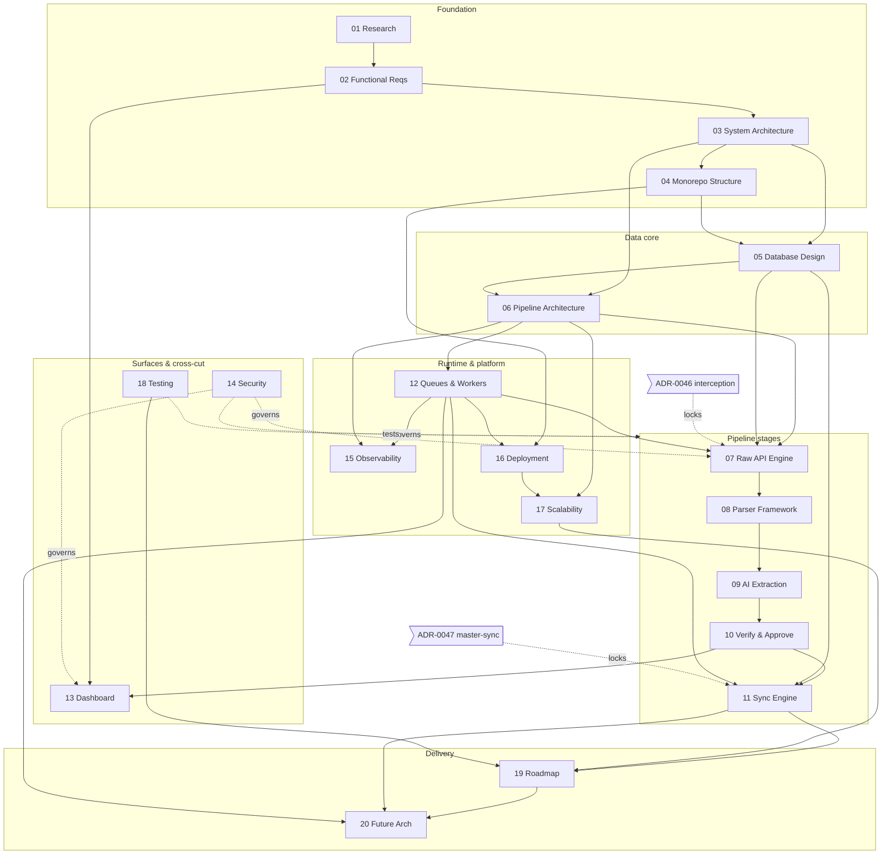

# TruePoint Forge — Data-Operations Platform Planning Suite

> **What this is.** **TruePoint Forge** is a **separate, internal, staff-only data-operations monorepo**
> (`truepoint-forge`, scope `@forge/*`) that sits **upstream** of the TruePoint production CRM. It turns
> **`raw_captures → parsed_records → verified_records`** on a four-layer medallion spine and then syncs
> only the governed golden records into the production master graph via a one-way, versioned
> **`POST /api/v1/master-sync`** push. It owns entity resolution; TruePoint's `master_*` becomes a
> **downstream serving projection** (ecosystem-facts §B).
>
> **This is a PLANNING suite — not an implementation.** No `truepoint-forge` code, migration, or ADR is
> built until **all 20 docs + both ADRs pass the Stage-8 consistency gate** (the greps over the frozen
> vocabulary in `_context/decision-ledger.md`). Every doc grounds existing-TruePoint claims in
> `_context/ecosystem-facts.md` and cites industry practice by `[S#]` into `_context/research-corpus.md`.
> **Locking ADRs for the whole suite: [ADR-0046](../decisions/ADR-0046-raw-api-interception-primary-capture.md)
> (raw API interception as primary capture) and
> [ADR-0047](../decisions/ADR-0047-forge-master-graph-upstream-and-sync.md) (Forge owns ER + versioned
> master-sync).**

---

## Status legend

| Badge | Status | Meaning |
|---|---|---|
| 🟢 | **Drafted** | Full planning doc written; awaiting the Stage-8 consistency gate. |
| ⚪ | **Planned** | Scoped and referenced by neighbours, not yet drafted. |
| 🔒 | **Frozen** | Locked reference input — do not edit without a ledger amendment. |
| 🔵 | **Proposed** | ADR authored, decision pending formal acceptance. |
| ✅ | **Locked** | Passed the consistency gate (none yet — the whole suite is pre-gate). |

The suite has **passed the Stage-8/9 consistency + grounding review** (2026-07-06, 3 adversarial
reviewers; findings applied and re-verified — 0 residual gap-ID/cross-reference issues): docs `01–20` are
🟢 Drafted and gate-green, both ADRs are 🔵 Proposed (pending formal acceptance), and the three
`_context/` inputs are 🔒 Frozen. Awaiting owner review before any ✅ Locked flip and implementation.

---

## Table of contents

### Planning documents

| # | Document | One-line scope | Status |
|---|---|---|---|
| 00 | **[README / suite index](./00-README.md)** | This file — the map, legend, dependency graph, decision ledger, and open-questions register. | 🟢 |
| 01 | **[Research Findings & Industry Analysis](./01-research-findings-and-industry-analysis.md)** | Industry-practice foundation; synthesizes the 132-source corpus into the design-shaping findings every doc cites by `[S#]`. | 🟢 |
| 02 | **[Functional Requirements](./02-functional-requirements.md)** | The authoritative register — `FR-01…FR-14` + `NFR-01…NFR-14`, actors, and the hand-off of each requirement to its owning downstream doc. | 🟢 |
| 03 | **[System Architecture](./03-system-architecture.md)** | Forge as the separate staff-only upstream platform; the medallion spine, ER ownership, and the sync to the master graph. | 🟢 |
| 04 | **[Monorepo Structure](./04-monorepo-structure.md)** | The `truepoint-forge` Bun + Turbo + Biome monorepo — `@forge/*` layout (ledger L8) and import-boundary discipline. | 🟢 |
| 05 | **[Database Design](./05-database-design.md)** | The Forge ops/staging Postgres schema — the physical realization of the four medallion layers as hand-authored `@forge/db` migrations. | 🟢 |
| 06 | **[Data Pipeline Architecture](./06-data-pipeline-architecture.md)** | The append-only, idempotent stage sequence `raw_captures → parse → AI-extract → quality → resolve/merge → review → verified_records → (outbox) → synced`. | 🟢 |
| 07 | **[Raw API Processing Engine](./07-raw-api-processing-engine.md)** | The ingest edge — the **envelope v2** contract, the capture API (`202` + job handle), and verbatim landing into `raw_captures`. | 🟢 |
| 08 | **[Parser Framework](./08-parser-framework.md)** | Pure, deterministic, version-bound parsers governed by the `parsers` + `parser_versions` registry. | 🟢 |
| 09 | **[AI Extraction Engine](./09-ai-extraction-engine.md)** | Pipeline stage S2 — AI-assisted structured extraction with per-field source grounding + confidence. | 🟢 |
| 10 | **[Verification & Approval Workflow](./10-verification-and-approval-workflow.md)** | The maker-checker (four-eyes) gate promoting candidates into the `verified_records` gold layer. | 🟢 |
| 11 | **[Database Synchronization Engine](./11-database-synchronization-engine.md)** | The versioned `POST /api/v1/master-sync` push, the Forge-side transactional outbox + sync worker, and reconciliation. | 🟢 |
| 12 | **[Queue & Worker Architecture](./12-queue-and-worker-architecture.md)** | BullMQ + Redis, one queue per DAG stage, retry-with-jitter, a hand-built PII-free DLQ, and per-processor deadlines. | 🟢 |
| 13 | **[Frontend Dashboard Design](./13-frontend-dashboard-design.md)** | The Next.js 15 operator console for operators, reviewers/stewards, and data-ops admins. | 🟢 |
| 14 | **[Security & Access Control](./14-security-and-access-control.md)** | The security authority — operator SSO, RBAC+ABAC (`maker ≠ checker`), machine identity, PII/residency, compliance. | 🟢 |
| 15 | **[Observability](./15-observability.md)** | Three OpenTelemetry pillars across a SYSTEM plane and a DATA plane. | 🟢 |
| 16 | **[Deployment & Infrastructure](./16-deployment-and-infrastructure.md)** | Three container services + a maintenance lane; Postgres HA behind a mandatory pooler, Redis HA, object storage. | 🟢 |
| 17 | **[Scalability & Performance](./17-scalability-and-performance.md)** | The volume model + per-stage capacity math for tens of millions of `verified_records` from a multi-million/day capture stream. | 🟢 |
| 18 | **[Testing Strategy](./18-testing-strategy.md)** | The test pyramid tuned for the pipeline; golden-fixture (characterization) + property-based parser tests; contract tests. | 🟢 |
| 19 | **[Implementation Roadmap](./19-implementation-roadmap.md)** | The ten phases `P0…P9`, the dependency graph and critical path, and the dark-`chrome_extension`-connector migration (OQ-5). | 🟢 |
| 20 | **[Future Enhancements](./20-future-enhancements.md)** | Post-GA options recorded-and-deferred by neighbours: event-bus transport (Debezium/Kafka), Temporal durable execution, active-learning ER, a lakehouse/Iceberg tier, multi-region/DR, automated survivorship, a co-op ingestion channel, and EKS+KEDA compute evolution. | 🟢 |

### Architecture Decision Records (authored in TruePoint `docs/planning/decisions/`)

| ADR | Title | Scope | Status |
|---|---|---|---|
| **[ADR-0046](../decisions/ADR-0046-raw-api-interception-primary-capture.md)** | Raw API interception as primary capture | Amends **ADR-0043 decision #4** (reverses its MAIN-world-interception rejection); legal/ToS/abuse risk register + kill-switch + per-tenant gating + the compliance firewall. | 🔵 |
| **[ADR-0047](../decisions/ADR-0047-forge-master-graph-upstream-and-sync.md)** | TruePoint Forge as master-graph upstream + versioned sync contract | Forge owns ER + the golden-record lifecycle; `master_*` becomes a downstream serving projection fed only by `POST /api/v1/master-sync`. | 🔵 |

### Frozen reference inputs (`_context/`)

| File | Role | Status |
|---|---|---|
| **[`_context/ecosystem-facts.md`](./_context/ecosystem-facts.md)** | Verified `file:line` grounding on the *existing* TruePoint codebase — cite by §anchor, never re-derive. | 🔒 |
| **[`_context/decision-ledger.md`](./_context/decision-ledger.md)** | The LOCKED vocabulary (`L1…L11`) — exact table/stage/endpoint/scope names every doc obeys. | 🔒 |
| **[`_context/research-corpus.md`](./_context/research-corpus.md)** | The deduplicated industry-research reference — 132 sources, the `[S#]` citation index. | 🔒 |

---

## Document dependency graph

Each doc is the **owner of its deep detail**; arrows read *"depends on / cross-links into"*. The three
frozen `_context/` inputs feed everything and are omitted from the arrows for legibility.

---

## Decision ledger — condensed

The full, binding text is in [`_context/decision-ledger.md`](./_context/decision-ledger.md); this is the
scannable summary. **These names are LOCKED** — Stage-8 greps for them.

| # | Locked decision | The one thing to remember |
|---|---|---|
| **L1** | Identity & naming | Product **TruePoint Forge** · repo **`truepoint-forge`** · scope **`@forge/*`**. Brand stays TruePoint; TruePoint's own scope stays `@leadwolf/*`. No stray reusable-snippet placeholder token survives into prose (OQ-1). |
| **L2** | The four medallion layers | **`raw_captures`** (Bronze, verbatim, `content_hash` UNIQUE) → **`parsed_records`** (Silver, versioned parser) → **`verified_records`** (Gold, the *only* layer that syncs) → **`sync_state`** + `master_id_map` (Sync). Never invent alternate layer names. |
| **L3** | Ingestion (envelope v2) | Extension pivots to **MAIN-world raw API interception** (ADR-0046) and posts **envelope v2** (TruePoint's `ingestionEnvelope` + `raw_payload`/`endpoint`/`schema_version` + caps/gzip/chunking) to **Forge**, never TruePoint's `/api/v1/ingest`. A new Forge-owned contract. |
| **L4** | ER ownership | **Forge owns entity resolution** (ADR-0047). TruePoint's `er/` + `erSweep` stay **inert for ingestion**; `master_*` becomes a downstream serving projection. |
| **L5** | The sync contract | HTTP **push** to **`POST /api/v1/master-sync`** (`X-Forge-Sync-Version`), driven by a Forge **outbox + sync worker**, idempotent on `source_records.content_hash`, honoring the bytea AES-GCM + HMAC blind-index PII scheme, landing `review_status='confirmed'` via a new **`forge_sync` connector** on a **system principal**. Direct cross-DB writes and event-bus-as-primary are **rejected** (event-bus → Doc 20). |
| **L6** | Auth | **Operators:** SSO via OIDC against `auth.truepoint.in` → the shipped **`data_ops` role + `data:*` capabilities**. **Machine sync:** a separate service credential — never a human session. |
| **L7** | Tech stack | Bun 1.3.14 + Turbo + Biome · Hono API · Postgres + Drizzle (**hand-authored migrations**, `generate` unsafe) · BullMQ + Redis · Next.js 15 + `@leadwolf/ui` · **Anthropic** for AI extraction · **object storage** for large raw blobs. |
| **L8** | Monorepo layout | `apps/{dashboard,api,workers}` + `packages/{types,db,core,ai,sync,capture-sdk,config,ui}`; dependency-cruiser mirrors TruePoint (imports via each `index.ts`; `apps/*` never import another app). |
| **L9** | Gap-ID vocabulary | Use **`G-FORGE-NN`**, unique across the suite; map to `28-enterprise-readiness-audit.md` where a TruePoint gap is relevant. |
| **L10** | New ADRs | **ADR-0046** (interception) + **ADR-0047** (Forge upstream + sync). Forge's *repo-internal* decisions start a fresh `ADR-0001…` series inside `truepoint-forge/docs/` (referenced, not authored here). |
| **L11** | Open-questions register | **OQ-1…OQ-6** (below) carried in this README and each doc. |

---

## How to read this suite

1. **Start here (00), then 01 → 02 → 03.** Research grounds the requirements; the requirements name the
   actors and hand each responsibility to its owning doc; system architecture places the pieces.
2. **Read `_context/` first, cite it always.** The three frozen files are inputs, not narrative: pull
   existing-TruePoint facts from `ecosystem-facts.md` by §anchor, obey `decision-ledger.md` verbatim, and
   cite industry practice by `[S#]` into `research-corpus.md`. Do **not** re-derive a fact a `_context/`
   file already fixes.
3. **Follow the medallion spine for the pipeline docs.** `05` (schema) and `06` (stage sequence) are the
   backbone; `07 → 08 → 09 → 10 → 11` walk one record from raw capture to master-sync in order.
4. **Treat each doc as the single owner of its detail.** Where a neighbour needs another doc's schema, ADR,
   or wire shape, it **cross-links** rather than restating — chase the link for the authority.
5. **`14` (security) can veto any doc.** Read it before treating any access, PII, residency, or compliance
   claim as settled — security has the final say (below).
6. **`19` is the build order.** Nothing is implemented until Stage-8 is green; `19` then sequences `P0…P9`.

---

## Conventions & conformance

**House conventions** (every doc obeys — full statement in `ecosystem-facts.md §G`):

- Numbered `NN-kebab-title.md`; this `00-README.md` carries the status legend.
- A **blockquote preamble** stating the doc's canonical contract + its locking ADR(s).
- **`file:line`-grounded** current-state claims — cite `ecosystem-facts.md`, never re-derive.
- **"Owner of the deep detail" cross-links** instead of restating another doc's schema/ADR.
- **`G-FORGE-NN` gap registers** mapped to `28-enterprise-readiness-audit.md` where relevant.
- **Mermaid** for lifecycles/flows/state; **tables** for enumerable facts.
- An explicit **`## Open questions`** section ending every doc.
- **LOCKED names verbatim:** `raw_captures` / `parsed_records` / `verified_records` / `sync_state`,
  `POST /api/v1/master-sync`, `@forge/*`, **TruePoint Forge** (never a literal placeholder token).

**The six `truepoint-*` skills govern the design** (per `CLAUDE.md`), and their precedence carries into
Forge:

| Skill | What it owns for Forge |
|---|---|
| **truepoint-platform** | The API contract, tenancy/isolation mechanism, queues, caching, connection pooling, and scale — Forge simplifies RLS-tenant-scope to **staff-scope** but inherits the tx-scope discipline (ecosystem-facts §D). |
| **truepoint-data** | The data model, ownership/lineage/provenance, enrichment, ER/dedup, verification, retention/deletion. |
| **truepoint-security** | Access control, machine identity, PII/residency, abuse/scraping, compliance — **final say on whether anything is safe**. |
| **truepoint-architecture** | Frontend feature structure for `apps/dashboard`, the pre-build reasoning pass. |
| **truepoint-design** | Everything that renders in the operator console — `@leadwolf/ui`, tokens, four states, WCAG 2.2 AA. |
| **truepoint-operations** | Running Forge in production — incidents, runbooks, breach response, FinOps on metered AI/enrichment spend. |

> **Security has the final say.** On any access, isolation, secret, PII, or compliance point, `14` wins
> over convenience or structure — the file-size/feature-folder rules never justify skipping tenant/staff
> scoping, an isolation test, or input validation. Platform owns the tenancy mechanism, the API contract,
> and scale; data owns the model and ownership semantics; design defers to security on whether data is safe.

---

## Relationship to existing TruePoint planning art

Forge **builds on and cross-links** prior TruePoint planning — it does not restate it. The suite mirrors
proven patterns rather than inventing new ones.

| Existing art | What Forge takes from it | Owner-link |
|---|---|---|
| **[`prospect-database-platform/`](../prospect-database-platform/)** (00–12) | The unified-ingestion → processing → internal-knowledge-DB shape (versioning/lineage/provenance/freshness), the DB-operations review/merge/split queue, and the probabilistic-ER build — Forge's medallion pipeline is the dedicated, staff-only realization of this. | Prior art |
| **[`database-management-research/`](../database-management-research/)** (01–16) | The two-surface control-panel model (staff `withPlatformTx` vs customer `withTenantTx`), the validation framework, the dedup/linking review queue, the maker/checker system, and the `G01–G32` gap-register vocabulary. | Prior art |
| **[`chrome-extension/`](../chrome-extension/)** (00–12) | The capture product/compliance spec and `01-apollo-teardown.md` — now the **template** for the ADR-0046 MAIN-world interceptor (ecosystem-facts §E). | Prior art |
| **[`30-bulk-import-export-pipeline.md`](../30-bulk-import-export-pipeline.md)** (ADR-0036) | The Salesforce-Bulk-API-2.0 job state machine, COPY→UNLOGGED staging, `content_hash` idempotency, and the `rows_in = succeeded + rejected + deduped + unprocessed` accounting Forge reuses at the capture edge (ecosystem-facts §C). | Prior art |
| **[ADR-0046](../decisions/ADR-0046-raw-api-interception-primary-capture.md)** | Amends **ADR-0043 #4** to authorize interception as primary capture behind the compliance firewall — the locking decision for `07`. | This suite |
| **[ADR-0047](../decisions/ADR-0047-forge-master-graph-upstream-and-sync.md)** | Establishes Forge as the master-graph upstream + the versioned `POST /api/v1/master-sync` contract — the locking decision for `11`. | This suite |
| **[`28-enterprise-readiness-audit.md`](../28-enterprise-readiness-audit.md)** | The gap-ID vocabulary Forge's `G-FORGE-NN` register maps into. | Prior art |

---

## Suite-level gaps

Meta-gaps in the *planning suite itself* (distinct from the per-doc `G-FORGE-NN` design gaps; numbered in a
non-colliding `9000`-series, so they never overlap a per-doc block):

| Gap | Description | Status |
|---|---|---|
| **G-FORGE-9001** | Doc `20 — Future Enhancements` — now drafted (`20-future-enhancements.md`) and linked in the TOC. | ✅ Resolved (2026-07-06) |
| **G-FORGE-9002** | The **Stage-8/9 consistency + grounding review** ran (3 adversarial reviewers); the findings (doc-number cross-ref remap, disjoint `G-FORGE` gap-ID reallocation, and the minor citation/figure fixes) were applied in the fix pass. | ✅ Resolved (2026-07-06) |
| **G-FORGE-9003** | Forge's **repo-internal `ADR-0001…` series** (`truepoint-forge/docs/`) is referenced (ledger L10) but is authored **inside the Forge repo**, not in this TruePoint-side suite. | Deferred (by design) |

---

## Open questions

The consolidated suite register (`decision-ledger.md L11`); each doc carries the subset it touches. `OQ-R#`
research questions live in `research-corpus.md` and are distinct from these design questions.

| OQ | Question | Disposition |
|---|---|---|
| **OQ-1** | The **`truepoint-forge` / Forge name collides with Atlassian Forge**. | User chose it deliberately; prose always says "TruePoint Forge", never a literal reusable-snippet placeholder. Revisit only if it causes real external confusion. |
| **OQ-2** | **Interception legal / ToS sign-off** for the ADR-0046 MAIN-world capture. | **GA-blocking, not planning-blocking** — the risk register, kill-switch, per-tenant gating, and compliance firewall are designed in `14` + ADR-0046; sign-off is a launch gate, owned by security. |
| **OQ-3** | The sync is a **one-way door** — once Forge owns ER, TruePoint's `master_*` cannot re-become authoritative without a migration. | Accepted in ADR-0047; `master_*` is a serving projection. Revisit only on a decision to move ER back in-CRM. |
| **OQ-4** | **Raw-blob substrate** — object store vs Postgres JSONB for `raw_captures` payloads. | Default: **object-store for large blobs / JSONB for small profile JSON** (ledger L7; owner `05` + `17`). Confirm at load with the JSONB/TOAST cost model. |
| **OQ-5** | **Migration / retirement of TruePoint's dark `chrome_extension` connector** once the extension repoints at Forge. | Owned by `19` (roadmap) — retire only after the Forge path is proven live; the connector is migrated, not stranded. |
| **OQ-6** | **Capture-SDK single-sourcing** — is `@forge/capture-sdk` shared with the extension or forked? | Owned by `04` + `07`; default is a shared package (interceptor helpers + envelope-v2 builder + size/PII guards), pending the cross-repo dependency review. |
