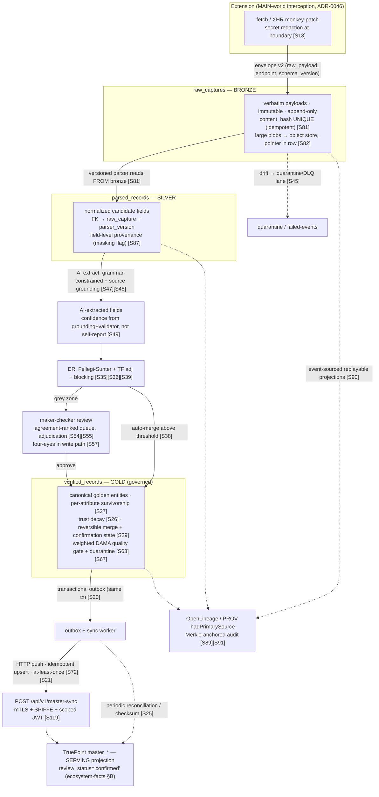

# 01 — Research Findings & Industry Analysis

> **Canonical contract:** this doc is the industry-research foundation for the TruePoint Forge suite;
> every other doc cites its findings via the citation index in `_context/research-corpus.md`.
> **Locking ADRs: ADR-0046, ADR-0047.**

Citations `[S#]` resolve in `_context/research-corpus.md § Citation index`. TruePoint current-state
claims are grounded in `_context/ecosystem-facts.md` (cited by `§` anchor). Frozen vocabulary
(layer names, sync contract, ownership) is in `_context/decision-ledger.md`. This doc **synthesizes**;
it does not restate another doc's schema or ADR — it links to the owner.

---

## Objectives

1. Establish, from primary and near-primary industry sources, **how enterprise platforms actually
   solve each responsibility** TruePoint Forge takes on — sales-intelligence data ops, ETL/ELT,
   MDM/golden records, entity resolution, parser/schema versioning, AI extraction, human review, data
   quality, medallion storage, audit/lineage, observability, queues/workers, deployment/scale,
   security/compliance, and testing.
2. Map that practice onto the **four-layer medallion**
   (`raw_captures → parsed_records → verified_records → (sync) → TruePoint master graph`) so later docs
   inherit a validated reference architecture rather than re-arguing it.
3. Deliver a **research verdict** — CONFIRM / AMEND / ESCALATE — on each of the five locked Forge
   architecture decisions, with the findings that carry the verdict.
4. Give an honest **legal & compliance risk register** for raw API interception, citing the case law,
   so the interception-primary decision (ADR-0046) is taken with eyes open.
5. Expose the **gaps** between this research and TruePoint's current implementation, and set the
   **success criteria** and **open questions** that scope the rest of the suite.

Non-goals: implementation detail (owned by docs 05-18), the ADR texts themselves (owned by
`docs/planning/decisions/ADR-0046`, `ADR-0047`), and TruePoint current-state facts (owned by
`_context/ecosystem-facts.md`).

---

## How enterprise platforms solve each responsibility

### Sales-intelligence data operations
The dominant players (Apollo, ZoomInfo, PDL, Clearbit/Breeze, Lusha, Cognism, Seamless.ai) converge on
a **data-factory shape that already mirrors Forge's medallion**: multi-source ingestion → machine
parsing/entity-resolution into golden records → a verification tier before data is trusted.
ZoomInfo runs four parallel ingestion sources (ML scanning of ~28M domains/day, third-party partner
data on ~95M businesses, a 200k+-user contributory network, and 300+ in-house researchers) [S3], and
Apollo claims ~91% email accuracy off a 2M+-contributor network with signal-triggered refresh [S2].
Two cross-cutting facts shape Forge: **waterfall enrichment** — chaining providers so uncorrelated
single-source gaps are filled by the next source — is the coverage/accuracy technique of record [S1]
[S9], and **decay is the enemy**: B2B data rots ~30%/yr (~2.5%/mo), single-source email accuracy
plateaus ~82% vs ~90%+ for verified/multi-source [S6], and the leaders counter decay with
event-driven change trackers, not one-time verification [S2]. Cognism's "Diamond Data" adds the
highest-trust tier — humans phone-verify mobiles and screen against DNC/GDPR registries in ~15
countries [S7]. The notable divergence from Forge's plan: the industry's **primary** ingestion moat is
the customer contributory co-op network [S2], not interception.

### ETL / ELT & orchestration
This is a **deliberate coverage gap**: the workstream tasked with Airflow/Dagster/Prefect/dbt
orchestration and Airbyte/Fivetran/Meltano connector frameworks returned only a stub, so the suite has
no first-class comparison of DAG orchestration, backfill scheduling, or connector standardization
(carried as OQ-R7). The adjacent workstreams cover the transport and reprocessing concerns that matter
most for Forge: the "never ingest straight to silver, reprocess from immutable bronze" rule [S81], the
transactional-outbox relay [S20], and batch-vs-streaming cadence as a cost/latency lever [S81]. Forge's
own worker DAG (parse → extract → resolve → verify → quality → sync) is modeled on TruePoint's shipped
BullMQ worker platform (`ecosystem-facts §C`), not on a general-purpose orchestrator.

### MDM & golden records
Enterprise MDM (Informatica, Reltio, Semarchy, Tamr) converges on: preserve immutable source records,
compute a **best-version-of-truth per attribute** (not per record) via survivorship, gate merges by a
confidence/match score, and route ambiguous cases to human stewards [S27] [S29] [S30]. The
implementation-style taxonomy places Forge precisely: it is a **Consolidation/Coexistence hybrid** —
it preserves raw source, stewards verify, then it pushes verified golden records downstream [S30]
[S31] — and explicitly **not** a registry (a pointer index cannot be the authoritative write master)
[S31]. Survivorship should rank source-authority + validation + completeness **above** naive recency
(Reltio's recency-default is a documented footgun) [S28] [S33], and steward overrides must outrank
automated survivorship with durable confirmation states and reversible unmerge/split [S29].

### Entity resolution & dedup
The transparent industry standard is the **Fellegi-Sunter model** (Splink, UK Ministry of Justice):
additive log2 "bits of evidence" from per-field m/u ratios plus a λ prior, converted to a match
probability, EM-trainable without labels, clustered by connected-components [S35] [S37]. Three
non-negotiable obligations come with it: **term-frequency adjustment** (or common names over-score)
[S36], a **two-threshold** design (auto-merge high / auto-reject low / human grey-zone) [S38], and a
**blocking** strategy (UNION multiple keys, gated by a block-size diagnostic) that cuts comparisons to
~0.05-1% of the cartesian product [S39]. Senzing's principle-based ER adds an important challenge to a
naive batch design: a newly-detected generic value must **re-open already-resolved records**, so ER
must be incremental, not forward-only [S41]. Choosing which value wins a field is the data-fusion /
truth-discovery problem — weight source trustworthiness × value truthfulness, not majority vote [S92].

### Parser / schema versioning
Mature platforms treat schema/parser versioning as a first-class governance layer. Confluent's seven
compatibility modes (BACKWARD default) mechanically define legal changes and dictate producer-vs-consumer
upgrade order [S24]. Snowplow's **SchemaVer** (MODEL-REVISION-ADDITION) encodes compatibility into the
version number, and its **`$supersedes`** mechanism — re-validating historical/failed events against a
corrected schema, with a `validation_info` provenance record — is the closest industry analogue to
Forge's "replay historical raw through a new parser version" [S43]. A recurring nuance: **"breaking" is
relative to the consumer**, not absolute (required→optional breaks Redshift, not Snowflake) [S43], so
Forge's parser-compatibility check must be judged against the production CRM's tolerance. Segment and
Sentry Relay supply the runtime pattern: validate every event, **quarantine violations to a dead-letter
lane with alerting** (never silently into the clean layer), and normalize before filter/scrub [S45]
[S46].

### AI extraction
Industry has converged on **grammar-constrained decoding**. Anthropic's Structured Outputs (GA on Opus
4.5+/Sonnet 4.5+/Haiku 4.5) compiles the JSON schema into a cached grammar and constrains sampling,
guaranteeing schema-valid output that fails only on refusal or truncation [S47] — validating the
Anthropic choice, which also aligns with TruePoint's shipped Anthropic AI seam and ADR-0023
(`ecosystem-facts §C`). The load-bearing caveat: **constraint guarantees structure, not correctness** —
well-typed hallucinations are possible [S47], so trustworthy extraction pairs the schema with **source
grounding** (LangExtract records the exact character offset backing every field) [S48] and
**confidence-threshold gating** (Azure: ≥0.80 straight-through, human review below, ~100% for sensitive)
[S49] — where confidence is derived from grounding + validator agreement + judge score, never a model
self-report [S49]. Regression is caught with LLM-as-judge against a versioned golden set, with position/
verbosity/self-enhancement bias mitigations [S50] [S51].

### Human-in-the-loop review
The layered HITL quality model measures **inter-annotator agreement** as a quality proxy, routes
low-agreement items to an **adjudicator**, and gates final labels behind review — exactly the "verified"
layer between parsed and production [S54] [S55]. The **maker-checker / four-eyes** pattern supplies the
mechanics: ≥2 distinct actors, initiator can never approve their own request, **enforced at the code/
data layer not just the UI**, an explicit pending state that executes only on approval, and a
tamper-proof audit trail [S57] [S58] — anchored to ISO 27001 A.5.3 [S59]. Review-console UX
standardizes agreement-ordered queues, gold-standard honeypots for reviewer scoring, before/after diff
panels, and careful bulk-action affordances (explicit counts, async partial-failure reporting, undo)
[S54] [S56] [S60] [S61]. A live tension: Snorkel-style weak supervision treats versioned parsers + AI as
labeling functions combined by a consensus model, suggesting Forge could auto-verify high-agreement
records and reserve humans for the grey zone [S62].

### Data quality
The DAMA six dimensions (accuracy, completeness, consistency, timeliness, validity, uniqueness) are the
vocabulary, but operationalized as **two complementary layers**: declarative rule-based testing (dbt,
Great Expectations, Soda, Deequ) for "known unknowns," and **ML-driven observability** (Monte Carlo,
Databricks, AWS Glue) with learned per-table baselines for "unknown unknowns" [S64] [S65] [S71]. The
enforcement pattern is **tiered severity** (warn-and-alert vs hard-fail/block for Tier 1) plus
**quarantine-not-reject** so bad data is isolated and inspectable, not lost [S66] [S67] [S68]. Quality
scoring should be a **weighted** composite where a join-key null dominates a cosmetic issue — a flat
score is a poor promotion gate [S63]. Data contracts formalize schema + freshness SLA + uniqueness +
value rules between producer and consumer, enforced in CI and at runtime [S66] [S70].

### Storage & the medallion
The Databricks/lakehouse medallion (bronze=raw/immutable/append-only, silver=cleaned/deduped/normalized,
gold=aggregated serving) is the dominant reference and explicitly warns against ingesting straight into
silver [S81]. The substrate evidence is decisive: **Postgres JSONB hits a cliff at the ~2 kB TOAST
threshold** (2-10× slower reads, full-value rewrite on update), so large raw payloads belong in object
storage (S3/MinIO), with Postgres holding extracted queryable columns + a pointer [S82] [S83] — which is
exactly the Ledger L7 decision (object storage for large blobs, JSONB for small profile JSON). For
high-volume append-only raw, Iceberg-on-S3 gives the strongest retention/tiering story (tag-driven
Glacier lifecycle, prefix hashing against throttling, mandatory snapshot-expiration/compaction) [S84];
Iceberg-vs-Delta is the main contested axis [S86].

### Audit & lineage
Two complementary open standards: **OpenLineage** (run-centric operational lineage with a
column-lineage facet carrying a `masking` boolean for PII) [S87], and **W3C PROV** (Entity/Activity/
Agent; `hadPrimarySource` maps exactly onto raw-interception-primary; distinct Agents for AI-extractor
vs human maker/checker) [S89]. **Event sourcing** (append-only events, state re-derived by replay,
corrections via compensating events) is the substrate for the medallion as replayable projections [S90],
hardened for tamper-evidence with hash-chaining/Merkle trees **whose root is externally anchored** —
append-only alone is not tamper-evident [S91]. Marquez is the adopt-vs-build reference backend, and its
lineage graph is the mechanism for replay/rebuild after a parser bug [S88] [S94].

### Observability
Split the plane in two: **system observability** (OpenTelemetry traces/metrics/logs over services and
queues) and **data observability** (the five pillars — freshness/volume/schema/distribution/lineage —
over the dataset), per medallion stage [S96] [S64]. The hard async problem is trace continuity: message
queues break OTel's automatic propagation, so producers must inject W3C `traceparent` into the payload,
and the messaging conventions mandate **span links** (not parent-child) for fan-out [S97] [S98]. Queue
health (depth, wait time, p95/p99 duration, retry-exhaustion/DLQ) is a first-class SLO surface via
Prometheus+Grafana [S101], and the dominant risk is alert volume — alert on **user-facing symptoms**,
not every signal [S101] [S100].

### Queues & workers
End-to-end exactly-once is impractical, so every mainstream Redis/broker queue (BullMQ, Sidekiq, Celery,
SQS) is **at-least-once** and pushes correctness onto **idempotent consumers + dedup keys** [S72].
BullMQ gives configurable retry/backoff and stalled-job recovery but **no native DLQ** (hand-build a
parking queue) [S73] [S74], and native `jobId` dedup for idempotent enqueue [S75]. For multi-step
pipelines, Temporal offers exactly-once **workflow** orchestration with at-least-once (must-be-idempotent)
activities, built-in sagas, and server-mediated single-execution that removes the need for your own
locks [S76] [S77]. This maps onto TruePoint's shipped worker platform — retry+jitter, PII-free DLQ,
`withLeaderLock`, and the `outboxRelay` transactional outbox (`ecosystem-facts §C`).

### Deployment & scale
KEDA queue-depth autoscaling (scale-to-zero) is the standard for Redis/BullMQ workers, vs CPU-based HPA
which is a "silent failure" for growing queues [S104] [S78]; but pure depth is a poor signal for mixed
job durations, so use **per-stage queues** on homogeneous profiles [S105]. Postgres HA standardizes on
Aurora/RDS Multi-AZ (99.99% SLA, ~30s failover) fronted by a **mandatory connection pooler** (RDS Proxy
cuts failover up to 66%; pooling gives ~18-20× throughput under churn) — with reader-endpoint routing
for read-heavy paths [S108] [S109] [S110] [S114], matching TruePoint's RDS-Proxy/PgBouncer-safe
`withTenantTx` idiom (`ecosystem-facts §D`). ECS-vs-EKS is a real crossover (~15 containers), and
committing to KEDA biases toward EKS [S106] [S107]. Progressive delivery favors blue-green → canary, and
canary's brief two-versions-live window **forces expand/contract backward-compatible migrations** [S112]
[S113] — reinforcing TruePoint's hand-authored, `generate`-unsafe migration discipline (`ecosystem-facts
§D`).

### Security & compliance
A **hybrid RBAC+ABAC** model (NIST SP 800-162) is the baseline: RBAC roles for ingest/parse/verify/
approve/sync, ABAC conditions for data-sensitivity, and ABAC **separation-of-duties** (approver ≠ maker)
as the maker-checker enforcement primitive [S115]. Service-to-service sync is secured with **mTLS +
SPIFFE/OIDC workload identity + scoped client-credentials on short-lived (~1-day) certs**, never a static
token [S119] [S120] — matching Ledger L5's service-JWT posture. The scraped-PII posture is the highest
risk: **Clearview (€30.5M)** establishes that aggregating scraped PII with no Art 6 basis is unlawful and
"business interest" ≠ legitimate interest [S116]; **DPDP §7** offers India no legitimate-interest
balancing (consent-or-nothing) [S118]; **GDPR Art 17** erasure must reach the raw layer [S117]. SOC 2 +
envelope encryption (per-tenant DEK wrapped by a KMS KEK, rotation, key-admin SoD) is the expected
at-rest control across all four layers [S121] [S122], consistent with TruePoint's bytea AES-GCM + HMAC
blind-index scheme (`ecosystem-facts §B`).

### Testing
A layered pipeline-testing strategy: **golden-file/characterization** tests to pin versioned-parser
output [S123], **property-based/differential** testing (Hypothesis: old vs new parser on the same
intercepted payload) [S125] [S124], **consumer-driven contract** testing (Pact — the production CRM owns
the pact for `POST /api/v1/master-sync`; Pact fits HTTP cleanly, reinforcing HTTP over async) [S126]
[S127], and value-level **data-diff** as a CI regression gate between verified and production [S128]
[S129]. Integration tests containerize external systems, seed fixtures, and assert on the final layer
[S130]; and any captured-payload fixture must be **scrubbed to synthetic PII** (deterministic masking
preserving referential integrity) before entering the corpus [S131] [S132].

---

## The medallion (raw/parsed/verified/production) pattern and its mapping to Forge

Classic medallion has **three** tiers; Forge has **four** because it interposes a governed maker-checker
`verified_records` sub-tier that classic silver folds in. The mapping (Ledger L2):

| Forge layer | Table(s) | Medallion analogue | Governing findings |
|---|---|---|---|
| Bronze | **`raw_captures`** | Bronze — immutable, append-only, untyped, single source of truth | store raw verbatim, no cleanup [S81]; `content_hash` UNIQUE idempotent (mirrors `source_records`, `ecosystem-facts §B`); large blobs in object store past the ~2 kB TOAST cliff [S82] [S83] |
| Silver | **`parsed_records`** | Silver (parse/normalize half) — never ingest straight to silver, build from bronze via a versioned parser | versioned-parser stage reads from immutable raw [S81]; SchemaVer + `$supersedes` replay [S43]; quarantine drift, don't corrupt the clean layer [S45] |
| Gold (governed) | **`verified_records`** | Silver (governed BVT) → the maker-checker "pending, execute-on-approval" gate | per-attribute survivorship + trust decay [S27] [S26]; two-threshold ER + steward override [S38] [S29]; four-eyes enforced in the write path [S57]; weighted DAMA quality gate + quarantine [S63] [S67] |
| Sync / serving | **`sync_state` + `master_id_map`** → TruePoint `master_*` | Gold serving tier (the production CRM) | coexistence loopback push [S30]; idempotent upsert on `content_hash` + blind index (`ecosystem-facts §B`); outbox-driven relay [S20]; reconciliation [S25] |

The diagram encodes the verdicts: interception is the capture shape (a), Forge owns ER and the golden
record (b), the sync is an outbox-driven idempotent HTTP push (c), AI extraction is
grammar-constrained + grounded (d), and the four layers are replayable append-only projections (e).

---

## Legal & compliance landscape for raw API interception (honest risk register)

The interception **technique** is validated; its **legal defensibility** is the open risk. The
pro-scraping precedents do **not** transfer to authenticated session interception.

| # | Risk | What the case law / policy actually says | Severity | Cite |
|---|---|---|---|---|
| L-1 | CFAA over-reads the "scraping is legal" headline | Van Buren's "gates-up-or-down" reading narrows CFAA, and hiQ won the CFAA prong — **but only for public data**; it does not immunize the contract/tort claims that carry real judgments | Medium (reduces one axis only) | [S12] [S10] |
| L-2 | Authenticated interception is the exact breach fact pattern | Meta v. Bright Data: a ToS breach exists **only if** data is scraped **while logged in** to access non-public data — precisely Forge's logged-in Voyager interception | **High** | [S11] |
| L-3 | Contract/trespass/misappropriation liability | hiQ ended Dec 2022 with a **$500K judgment against hiQ** + permanent injunction to stop and delete, on California contract, trespass-to-chattels, and misappropriation | **High** | [S10] |
| L-4 | "Derived/aggregated" layers are not a compliance shield | Chrome Web Store Limited Use reaches "scraped content" **and** data "aggregated, anonymized, de-identified, or derived" — the medallion transformation does not exempt the data | **High (channel)** | [S14] |
| L-5 | Reselling into a sales-intelligence dataset | Chrome policy bars "transferring or selling user data to … data brokers or other information resellers" — needs a single-purpose, user-consent, user's-own-data framing or an off-store path | **High (existential channel)** | [S14] |
| L-6 | Hard enforcement deadline | 2026 CWS update: data must be strictly necessary to the disclosed single purpose, all collection prominently disclosed, **enforcement from Aug 1 2026** | **High (dated)** | [S15] |
| L-7 | GDPR Art 14 notification duty | Obtaining PII from a source other than the subject triggers a duty to inform each subject within ≤1 month or at first contact — most scraping silently ignores it | **High** | [S16] |
| L-8 | Art 6(1)(f) LIA + robots.txt | Legitimate interest is the only viable basis and needs a documented pre-collection LIA; regulators (CNIL) weigh robots.txt respect — interception bypasses it, weighing against Forge | **High** | [S17] |
| L-9 | Directly analogous enforcement | Clearview (**~€50M+ cumulative across EU DPAs — Italy/Greece/France/Netherlands**), **KASPR (CNIL €240K, a LinkedIn contact-scraper)**, a Polish broker (€220K) — "public data" is not a lawful-basis free pass; KASPR is the closest analog | **High** | [S18] |
| L-10 | Aggregated-PII store with no Art 6 basis | Dutch DPA fined **Clearview €30.5M** for scraping into an aggregated DB with no Art 6 basis; **"business interest" ≠ legitimate interest**, plus Art 12/14/15 transparency/access failures | **High** | [S116] |
| L-11 | India DPDP — no legitimate-interest escape | DPDP §7 is a closed list with no balancing test; consent-or-nothing; the Data Fiduciary is liable regardless of processor contract — treat India data as highest-restriction | **High** | [S118] |
| L-12 | Erasure must reach the raw layer | GDPR Art 17 erasure must be verifiable/irreversible and propagate to `raw_captures`; short retention + tombstoning so raw PII ages out of immutable backups; DSAR within one month across all four layers | **High** | [S117] |
| L-13 | Operational (non-litigation) risk | Meta *dropped* the Bright Data suit despite millions of records sold — absence of a clean adverse verdict is **not** a safe harbor; LinkedIn enforces via account bans, ToS suits, and technical countermeasures | Medium | [S19] [S13] |

**Mitigation posture (feeds ADR-0046):** the extension must ship a **compliant single-purpose
declaration + disclosure before Aug 1 2026** [S15]; a **compliance firewall** keeps raw intercepted
payloads inside Forge and never into the production CRM (`ecosystem-facts §E`, ADR-0046 amendment); each
raw source carries a **per-source lawful-basis + minimization + transparency record** and a documented
LIA [S17]; India-origin data is consent-gated [S118]; and interception legal sign-off is tracked as
**OQ-2 (GA-blocking, not planning-blocking)**. This is why verdict (a) is **ESCALATE**, not CONFIRM.

---

## Research verdict on the locked architecture decisions

| # | Locked decision (ADR) | Verdict | Carrying findings |
|---|---|---|---|
| a | **Raw API interception as PRIMARY ingestion** (extension → MAIN-world) — ADR-0046 | **ESCALATE** | technique sound [S13]; but logged-in interception is the exact breach pattern [S11] [S10]; contributory co-op is the real primary moat [S2]; Clearview/DPDP/Art 14 adverse [S116] [S118] [S16] |
| b | **Forge OWNS entity resolution; `master_*` = serving projection** — ADR-0047 | **CONFIRM** | match-merge is the authoritative-master pattern, registry can't be write master [S31]; leaders own ER in-house [S4]; Fellegi-Sunter production-viable [S35] [S40] |
| c | **HTTP push to versioned `POST /api/v1/master-sync`, idempotent upsert (reject direct-DB + event-bus-primary)** — ADR-0047 | **AMEND** | coexistence loopback + Pact-testable HTTP [S30] [S126]; **add** transactional outbox in-tx [S20], idempotent effectively-once apply [S21] [S23] [S72], reconciliation [S25] |
| d | **Anthropic Claude for AI-assisted extraction** | **CONFIRM** | Structured Outputs GA, grammar-constrained [S47]; guardrail: structure ≠ correctness [S47]; grounding + threshold routing [S48] [S49] |
| e | **Four-layer medallion `raw_captures → parsed_records → verified_records → production`** | **CONFIRM** | bronze/silver/gold maps cleanly, never-ingest-to-silver validates parser stage [S81]; maker-checker pending→approve gate [S57]; event-sourced replay [S90] |

**Prose.**

**(a) ESCALATE.** The MAIN-world monkey-patch of `fetch` + `XMLHttpRequest.prototype`, CustomEvent
bridge, and pre-boundary secret redaction is the current MV3 industry standard [S13]. But "primary" is
the contested word: the favorable precedents cover only logged-out scraping of public data, whereas
Forge intercepts authenticated non-public Voyager JSON — the fact pattern Judge Chen said **would**
breach ToS [S11] and that cost hiQ $500K in contract/trespass/misappropriation liability [S10]. The
industry's true primary ingestion moat is the contributory co-op network [S2], and the compliance record
(Clearview €30.5M, DPDP §7, GDPR Art 14, KASPR) is actively adverse to aggregating intercepted PII
[S116] [S118] [S16] [S18]. The architecture proceeds; the "primary" designation escalates to legal
sign-off (OQ-2) with the mitigations above.

**(b) CONFIRM.** Owning ER and storing the golden record is the match-merge/repository pattern for an
authoritative master; a registry pointer index cannot be the write master [S31]. The category leader
runs dedup, unique-ID primary keys, and hierarchy in-house [S4], and a transparent EM-trainable
Fellegi-Sunter engine is production-viable at Forge's 1-100M+ band [S35] [S40] — reusing the same math
as TruePoint's inert `er/fellegiSunter.ts` (`ecosystem-facts §C`, ADR-0047). Confirmed, with the ER
mechanics amendments (TF adjustment, two thresholds, blocking diagnostic, incremental re-resolution,
trustworthiness-weighted field-winner selection) captured in the corpus verdict.

**(c) AMEND.** HTTP push is the right transport (coexistence loopback [S30]; Pact fits HTTP cleanly and
async needs plugins [S126] [S127]), and idempotent upsert on `content_hash` + blind index is already in
the contract (Ledger L5, `ecosystem-facts §B`). Research **adds three mandatory mechanism changes**: emit
the "verified" event via a transactional outbox in the same transaction as the write (not an inline
post-commit POST) to kill the dual-write hazard [S20]; treat the apply as at-least-once/effectively-once
with a dedup + keyed UPSERT because exactly-once across a heterogeneous boundary is unachievable [S21]
[S23] [S72]; and add a reconciliation/checksum loop plus BACKWARD/FULL-compatible contract evolution and
OTel-linked push monitoring [S25] [S24] [S98]. Direct-DB and event-bus-as-primary remain correctly
rejected; the internal outbox/relay is not an event bus.

**(d) CONFIRM.** Claude Structured Outputs is GA and grammar-constrained, failing only on refusal/
`max_tokens` [S47], matching TruePoint's shipped Anthropic seam and ADR-0023 (`ecosystem-facts §C`). The
one guardrail amendment: constraint guarantees structure, not correctness, so maker-checker + DQ stay
mandatory and auto-approve confidence must come from grounding + validator agreement + judge score, not
a model self-report [S47] [S49].

**(e) CONFIRM.** The four layers map onto bronze/silver/gold with a governed verified sub-tier; the
"never ingest straight to silver" rule validates the versioned-parser stage [S81], the maker-checker
"pending → execute-on-approval" pattern is the verified gate [S57], and event sourcing gives replayable
projections [S90]. Amendments: quarantine-not-reject [S67], weighted DAMA scoring [S63], an ML anomaly
layer for parser drift [S64], Art 17 erasure reaching raw [S117], and object storage past the TOAST
cliff [S82].

---

## Gaps in current TruePoint implementation this research exposes

Grounded in `_context/ecosystem-facts.md`. Each gap gets a `G-FORGE-NN` id (Ledger L9).

- **G-FORGE-101 — No pipeline behind ingestion.** `POST /api/v1/ingest` validates and returns
  `202 {accepted}` but **stores nothing** (`ecosystem-facts §A`). Research says the raw tier must be
  immutable/append-only and reprocessable [S81] — Forge must build `raw_captures` + the parse→verify→
  sync pipeline the stub explicitly defers.
- **G-FORGE-102 — Envelope has no verbatim raw.** `rawObservation = z.record(string, unknown)` with **no
  `raw_payload`/`endpoint`/`schema_version`** (`ecosystem-facts §A`). Source grounding [S48], SchemaVer
  replay [S43], and `hadPrimarySource` provenance [S89] all require the verbatim payload — hence
  **envelope v2** (Ledger L3).
- **G-FORGE-103 — Extension captures DOM only, no interception.** The extension scrapes visible profile-
  header fields with **no XHR/API interception** (ADR-0043 guardrail, `ecosystem-facts §E`). ADR-0046
  amends this to MAIN-world raw capture [S13] — gated behind the legal risk register above.
- **G-FORGE-104 — Master graph is schema-only.** `master_*` has seven tables but **no ingestion/ER/sync
  pipeline** (`ecosystem-facts §B`). Research confirms it should be a downstream serving/gold projection
  fed only by the sync [S81] [S30] — ADR-0047.
- **G-FORGE-105 — ER engine is inert.** `er/fellegiSunter.ts` + `erSweep` exist but are flag-dark and
  never auto-merge (`ecosystem-facts §C`). Forge rebuilds this as its owned engine, adding the mandatory
  TF adjustment [S36], two thresholds [S38], and blocking diagnostic [S39] the current scorer lacks.
- **G-FORGE-106 — No parser-versioning/replay substrate.** No versioned-parser framework or `$supersedes`-
  style replay exists. Research makes this first-class: SchemaVer, consumer-relative compatibility,
  drift→quarantine [S43] [S24] [S45].
- **G-FORGE-107 — DQ is rule-only, no anomaly layer.** `validation_rules` + `data_quality_snapshots`
  exist (`ecosystem-facts §C`) but only cover "known unknowns"; research requires a **second ML
  anomaly-detection layer** on verified/production for parser/private-API drift [S64] [S65].
- **G-FORGE-108 — Sync mechanism under-specified vs research.** The outbox relay exists (`outboxRelay.ts`,
  ADR-0027, `ecosystem-facts §C`) — good — but the `master-sync` contract needs the idempotent
  effectively-once apply [S21] [S72], reconciliation [S25], and versioned compatibility [S24] this
  research mandates.
- **G-FORGE-109 — Lineage/tamper-evidence not modeled.** Audit logs are append-only (`ecosystem-facts
  §C`) but not Merkle-anchored, and there is no OpenLineage/PROV field-level lineage — research requires
  both for replay/rebuild and DSAR defensibility [S87] [S89] [S91].
- **G-FORGE-110 — Compliance obligations on the raw layer absent.** No per-source lawful-basis/LIA record,
  Art 14 notice path, DPDP consent gate, or cross-layer subject index for Art 17 erasure [S116] [S17]
  [S118] [S117].
- **G-FORGE-111 — ETL/orchestration + connector-framework strategy unresearched.** Coverage gap (OQ-R7);
  Forge leans on its BullMQ worker DAG (`ecosystem-facts §C`) but has no evaluated orchestration/connector
  standard.

---

## Risks & mitigations

| Risk | Likelihood × Impact | Mitigation (cite) |
|---|---|---|
| Interception legal/ToS liability (session capture) | Med × High | Legal sign-off gate OQ-2; compliance firewall (raw never reaches CRM, `ecosystem-facts §E`); per-source LIA + Art 14 path [S17] [S16] |
| Chrome Web Store delisting (Aug 1 2026, resale clause) | Med × High | Single-purpose declaration + disclosure pre-deadline; user-consent/user's-own-data framing; evaluate off-store path [S14] [S15] |
| Dual-write inconsistency Forge-DB ↔ CRM | Med × High | Transactional outbox in-tx + idempotent effectively-once apply + reconciliation [S20] [S21] [S25] |
| Golden-record over-merge (common names) | Med × High | Term-frequency adjustment + two thresholds + blocking diagnostic + explainable bits-of-evidence for reviewers [S36] [S38] [S39] [S42] |
| AI hallucinated-but-valid fields promoted | Med × High | Structure ≠ correctness guardrail: grounding + validator + judge, human maker-checker gate, threshold routing [S47] [S48] [S49] |
| Parser drift from upstream private-API change | High × Med | Drift→quarantine lane + per-parser-version schema/distribution monitors keyed to raw-response fingerprint [S45] [S64] [S103] |
| Data decay (~30%/yr) in "verified" records | High × Med | Per-field decay TTL + change-signal re-verification, not permanent trust (OQ-R14) [S6] [S26] [S2] |
| Postgres JSONB performance cliff on large raw | High × Med | Object storage for large blobs, pointer in row; JSONB only for small profile JSON [S82] [S83] (Ledger L7) |
| DSAR/erasure not satisfiable across layers | Med × High | Cross-layer subject index; short raw retention + tombstoning; ≤1-month DSAR path [S117] |
| Alert fatigue from high-variance interception ingest | High × Low | Alert on user-facing symptoms; tune learned baselines; retry-exhaustion/DLQ paging not first-failure [S101] [S100] |
| Unmigratable schema during canary (two versions live) | Med × Med | Expand/contract backward-compatible migrations; hand-authored discipline [S113] (`ecosystem-facts §D`) |

---

## Success criteria for the research phase

1. **Every locked decision has a verdict** with ≥1 carrying finding, and the one ESCALATE (a) is routed
   to a named gate (OQ-2) rather than silently confirmed. ✅
2. **A deduplicated, reusable citation index** (`_context/research-corpus.md`, 132 sources) exists and is
   the single place other docs cite. ✅
3. **The medallion mapping is grounded**, not asserted — each layer cites the industry practice that
   validates it and names the TruePoint gap it fills. ✅
4. **The legal risk register cites case law**, separates litigation from ToS/channel/compliance axes, and
   names the Aug 1 2026 deadline. ✅
5. **Every gap is `G-FORGE`-tagged and anchored** to `ecosystem-facts.md`, and every low-contested finding
   / unresolved disagreement is an `OQ-R#` in the register. ✅
6. **No decision is answered from first principles where a finding exists** — tenancy/scale/ER/quality
   answers cite the corpus, per CLAUDE.md's mandatory-read rule.

Downstream docs (05-18) inherit this foundation; a doc that needs a fact not covered here must add it to
`ecosystem-facts.md` (repo-verified) or open an `OQ-R#`, never re-derive it.

---

## Open questions

The full register lives in `_context/research-corpus.md § Open research questions` (OQ-R1…OQ-R20); the
GA-blocking and suite-shaping ones are surfaced here and cross-referenced to the Decision-Ledger register
(Ledger L11).

- **OQ-R1 / Ledger OQ-2 — Interception legal sign-off (GA-blocking).** LIA, Art 14 notice, DPDP consent,
  Clearview/KASPR exposure. Drives verdict (a). [S116] [S118] [S16] [S17]
- **OQ-R2 — Chrome Web Store single-purpose + Aug 1 2026 enforcement / off-store path.** [S14] [S15]
- **OQ-R3 — Add a contributory co-op ingestion channel to complement interception?** [S2]
- **OQ-R4 — Sync relay: polling publisher vs Debezium CDC** (no-Docker host constraint). [S20] [S24]
- **OQ-R5 — Orchestration: chained BullMQ vs Temporal durable execution.** [S76] [S73]
- **OQ-R6 / Ledger OQ-4 — ECS Fargate vs EKS; Iceberg vs Delta; object-store vs JSONB.** [S106] [S86] [S82]
- **OQ-R7 — ETL/ELT orchestration & connector-framework research gap (ws03 stub).** (n/a)
- **OQ-R10 — Weak-supervision auto-verify vs human-review-every-record.** [S62]
- **OQ-R12/13 — ER match-weight thresholds and AI confidence threshold need Forge-data calibration.** [S38] [S49]
- **OQ-R14 — Field-level decay TTL + re-verification trigger policy.** [S6] [S26]
- **OQ-R17 — Adopt OpenLineage/Marquez vs hand-roll lineage; Merkle-root anchoring mechanism.** [S87] [S91]
- **OQ-R18 — SPIFFE/SPIRE vs mTLS + scoped service-JWT for the sync identity.** [S119] (Ledger L5)
- **Ledger OQ-1 — `truepoint-forge` / `@forge/*` name collision with Atlassian Forge** (chosen deliberately).
- **Ledger OQ-3 — Sync is a one-way door (Forge owns ER)**; **OQ-5** dark `chrome_extension` connector
  retirement; **OQ-6** `@forge/capture-sdk` single-sourcing vs fork.
