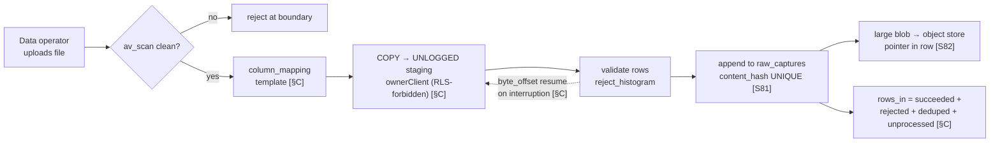
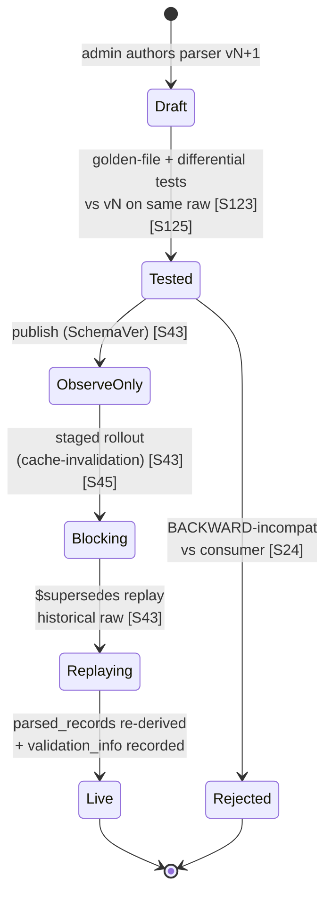
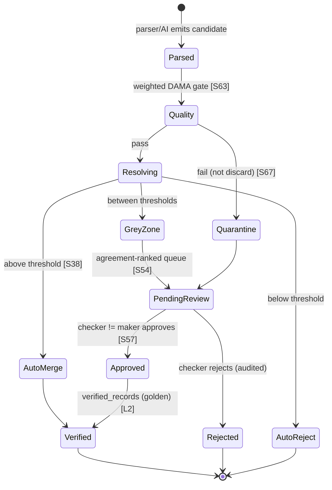
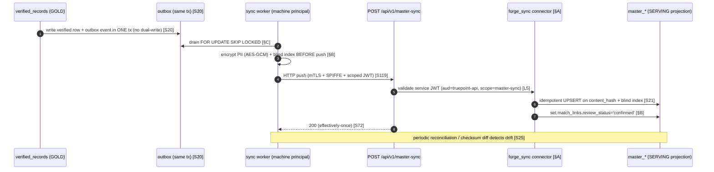

# 02 — Functional Requirements

> **Canonical contract:** this doc is the authoritative requirements register for TruePoint Forge — it
> enumerates **what** the platform must do (FR-01…FR-14, one per platform responsibility) and **how well**
> (NFR-01…NFR-14), names the **actors** who exercise each, and hands the **deep design of each requirement
> to its owning downstream doc**. It does not restate schema, ADR text, or pipeline internals — it links to
> their owners. Every requirement is grounded either in `_context/ecosystem-facts.md` (existing TruePoint
> code, cited by `§`) or `_context/research-corpus.md` (industry practice, cited by `[S#]`), and obeys the
> four-layer flow **`raw_captures → parsed_records → verified_records → (sync) → TruePoint master graph`**
> (`_context/decision-ledger.md` L2). **Locking ADRs: ADR-0046** (raw API interception as primary capture)
> **and ADR-0047** (Forge owns ER + versioned master-sync).

> **Numbering note.** All owner references in this doc follow the **settled `00-README` numbering** — the
> canonical 20-doc map. There is **no standalone doc** for entity-resolution, data-quality, audit-lineage, or
> operations: those responsibilities live in **sections** of their owning docs (cited as `05` groups, `06`
> stages, `15` views, `16` runbooks) and are never assigned an invented doc number.

Downstream ownership map used throughout (finalized in `00-README`): `03-system-architecture`,
`04-monorepo-structure`, `05-database-design`, `06-data-pipeline-architecture`,
`07-raw-api-processing-engine`, `08-parser-framework`, `09-ai-extraction-engine`,
`10-verification-and-approval-workflow`, `11-database-synchronization-engine`,
`12-queue-and-worker-architecture`, `13-frontend-dashboard-design`, `14-security-and-access-control`,
`15-observability`, `16-deployment-and-infrastructure`, `17-scalability-and-performance`,
`18-testing-strategy`, `19-implementation-roadmap`, `20-future-enhancements`.

---

## Objectives

1. Turn the **14 platform responsibilities** TruePoint Forge assumes into testable, prioritized functional
   requirements (FR-01…FR-14), each mapped to the medallion stage it advances and the downstream doc that
   owns its build.
2. Bind those requirements to measurable **non-functional targets** (scale, throughput, latency, HA,
   durability, security, compliance/DSAR, auditability, cost) so "done" is verifiable, not asserted.
3. Fix the **actor model** — five personas, each with an identity, a capability set reused from TruePoint's
   `data_ops` staff role (`ecosystem-facts §C`), and the FRs they exercise.
4. Express the platform as **end-to-end user journeys** (Mermaid) so the FRs read as one system, not a list.
5. Register the **gaps** (`G-FORGE-201…`) between these requirements and TruePoint's *existing* data-ops
   surface (`ecosystem-facts §C`) so every requirement is scoped to **extend, never duplicate**, shipped code.

Non-goals: schema (owned by `05-database-design`), the sync wire contract (`11-database-synchronization-engine`), ADR text
(`docs/planning/decisions/ADR-0046`, `ADR-0047`), and the research verdicts (owned by `01`).

---

## Actors & personas

Operators authenticate via **SSO/OIDC against `auth.truepoint.in`**, mapping the existing **`data_ops`
staff role + `data:*` capabilities** (`ecosystem-facts §C`; Ledger L6). The dashboard mirrors `apps/admin`'s
auth client — in-memory access token, PKCE redirect, silent refresh, `fetchWithAuth` (`ecosystem-facts §C`).
The machine principal is a **non-human client-credentials service JWT** (`aud=truepoint-api`,
`scope=master-sync`), never a human session (Ledger L5). The extension end-user carries a scoped
`["extension"]` token minted by the companion-window flow (ADR-0045, `ecosystem-facts §E`).

| Persona | Who / where | Identity & auth | Capabilities (`ecosystem-facts §C`) | Primary FRs |
|---|---|---|---|---|
| **Data operator** | Internal ops engineer running ingest, triaging parse failures, launching reprocessing | OIDC human session | `data:read`, `data:manage` | FR-01, FR-02, FR-03, FR-10, FR-13 |
| **Reviewer / data steward** | Works the maker-checker queue, adjudicates the ER grey-zone, approves verified records | OIDC human session | `data:read`, `data:review` | FR-05, FR-06, FR-07 |
| **Data-ops admin** | Publishes parser versions, sets validation rules + ER/AI thresholds, manages queues, grants capabilities | OIDC human session (elevated) | `data:manage` (+ `super_admin` implies all) | FR-04, FR-07, FR-11, FR-12, FR-14 |
| **System / machine sync principal** | The outbox-driven sync worker pushing verified records to the CRM | Client-credentials service JWT (`aud=truepoint-api`, `scope=master-sync`); mTLS + SPIFFE identity [S119] | non-human `scope=master-sync` only | FR-08, FR-09 |
| **Extension end-user** | TruePoint rep/customer whose logged-in browser runs MV3 MAIN-world interception; the capture *source* | Scoped `["extension"]` token (aud `chrome-extension://<id>`), separate session family, no platform-admin bit (ADR-0045) | none in Forge (posts envelope v2 only) | FR-02 |

> **Separation of duties is a hard boundary, not UI polish.** A reviewer can never approve their own
> submission and the maker/checker must be two distinct identities, enforced in the write path — not merely
> hidden in the console [S57] [S59]. ABAC expresses this as "no subject may approve a resource whose owner
> equals the subject" [S115]. Security owns the enforcement (`14-security-and-access-control`).

---

## Functional requirements (FR-01…FR-14)

Each FR maps one of the 14 platform responsibilities. Priority is **MoSCoW** (Must / Should / Could).
"Owning doc" holds the deep design; this register holds only the requirement, actors, preconditions, and
acceptance criteria (AC).

### FR-01 — Bulk imports → `raw_captures`
- **Description.** Ingest operator-supplied bulk files (CSV/JSONL/provider export blobs) as immutable
  bronze rows. Extends TruePoint's shipped import pipeline (`import_jobs`/`import_job_chunks`/
  `import_job_rows`, COPY → UNLOGGED staging via `ownerClient` because COPY is forbidden on RLS tables,
  `ecosystem-facts §C`) — but Forge lands into staff-scoped `raw_captures`, **not** a tenant overlay.
- **Actors.** Data operator (initiates); system workers (stage/parse).
- **Preconditions.** Operator holds `data:manage`; file passes `av_scan_status` clean; a `column_mapping`
  template selected or created (`import_mapping_templates`, `ecosystem-facts §C`).
- **AC.** (a) A job resumes from `byte_offset` after interruption; (b) `rows_in = succeeded + rejected +
  deduped + unprocessed` reconciles exactly (Salesforce Bulk-API-2.0 invariant, `docs/planning/30-…`,
  `ecosystem-facts §C`); (c) each landed row is an immutable `raw_captures` row with `content_hash` UNIQUE →
  re-importing the same file is a no-op [S81]; (d) a `reject_histogram` is produced; (e) large blobs go to
  object storage with a pointer in the row past the ~2 kB TOAST cliff [S82] (Ledger L7).
- **Priority.** Must. **Owning doc.** `07-raw-api-processing-engine` (+ `05-database-design` Group 8 `import_jobs` for the job tables; `raw_captures` schema in `05`).

### FR-02 — Receive raw API responses (envelope v2 ingestion)
- **Description.** Accept **envelope v2** — TruePoint's `ingestionEnvelope` (`ecosystem-facts §A`) plus
  per-record `raw_payload` (verbatim, opaque), `endpoint`, `schema_version`, and envelope-level size cap +
  gzip + chunking — posted by the MV3 extension after **MAIN-world raw API interception** (ADR-0046), and
  land each record as a `raw_captures` row. Envelope v2 is a **new Forge-owned contract**, not an edit to
  `packages/types/src/ingestion.ts` (Ledger L3).
- **Actors.** Extension end-user (source); system ingest workers.
- **Preconditions.** Valid `["extension"]`-scoped token; `envelope.scope.tenantId === token tenantId` trust
  boundary (mirrors the `403 scope_mismatch` guard, `ecosystem-facts §A`); per-source consent/lawful-basis
  record present (FR-09, `14-security-and-access-control`).
- **AC.** (a) Ingest is **idempotent** on `content_hash` UNIQUE — a replayed capture returns `202` and
  stores nothing new [S81] (mirrors `source_records.content_hash`, `ecosystem-facts §B`); (b) abuse is
  throttled by extending `checkCaptureRate` (record-volume, fails open, `ecosystem-facts §A`; Ledger L3);
  (c) raw intercepted payloads **never reach the production CRM** — the compliance firewall keeps them in
  Forge (ADR-0046, `ecosystem-facts §E`); (d) oversize/malformed envelopes are rejected at the boundary,
  never partially stored; (e) the ack does not block on downstream parse (async).
- **Priority.** Must. **Owning doc.** `07-raw-api-processing-engine` (envelope v2, `@forge/capture-sdk`).

### FR-03 — Parse / normalize → `parsed_records`
- **Description.** A **versioned parser** reads *from* immutable `raw_captures` (never straight-to-silver
  [S81]) and emits normalized candidate fields into `parsed_records`, each carrying an FK to its
  raw_capture + `parser_version` and field-level provenance. Parse errors are **captured, not fatal**
  (Ledger L2).
- **Actors.** System parse workers; data operator (monitors failures, triggers replay).
- **Preconditions.** A published parser version bound to the record's `endpoint` + `schema_version` exists
  (FR-11); the source `raw_captures` row is durable.
- **AC.** (a) Every `parsed_record` links to exactly one `raw_capture` + one `parser_version`; (b) drift /
  unmatched schema routes to a **quarantine / failed-events lane with alerting**, never silently into the
  clean layer [S45] [S46]; (c) PII channel fields are encrypted (bytea AES-GCM) + blind-indexed before
  landing, honoring the master scheme (`ecosystem-facts §B`); (d) reprocessing the same raw through the same
  parser version is deterministic (golden-file stable [S123]); (e) parse throughput meets NFR-02.
- **Priority.** Must. **Owning doc.** `08-parser-framework` (+ `05-database-design`).

### FR-04 — AI-assisted extraction
- **Description.** For records where a deterministic parser is insufficient, extract structured fields with
  **Anthropic Claude Structured Outputs** (grammar-constrained decoding, GA on Opus/Sonnet/Haiku 4.5+ [S47];
  reuses TruePoint's shipped Anthropic seam + `aiPort` + `ai_requests` metering, ADR-0023,
  `ecosystem-facts §C`). Every extracted field carries **source grounding** (character offset into the raw
  payload) so a reviewer can verify it against the source [S48].
- **Actors.** System extract workers; data-ops admin (manages prompts/models/thresholds).
- **Preconditions.** A versioned extraction schema is registered; per-call AI budget available
  (`ai_requests` budget guard, `ecosystem-facts §C`).
- **AC.** (a) Output is always schema-valid JSON (grammar-constrained), failing only on `refusal` /
  `max_tokens` [S47]; (b) **structure is not trusted as correctness** — a well-typed value still flows
  through DQ + maker-checker (FR-05, FR-07) [S47]; (c) auto-approve confidence is derived from grounding +
  validator agreement + judge score, **never a model self-report** [S49]; (d) every extraction records
  model id + prompt/schema version for lineage (FR-09); (e) regression is caught by LLM-as-judge against a
  versioned golden set with bias mitigations [S51] [S50].
- **Priority.** Must. **Owning doc.** `09-ai-extraction-engine`.

### FR-05 — Human verification & approval (maker-checker) → `verified_records`
- **Description.** A governed **maker-checker gate** promotes parsed/extracted candidates into
  `verified_records`. The operation sits in an explicit **pending** state and executes only on checker
  approval [S57]; the record is the single layer that syncs (Ledger L2).
- **Actors.** Reviewer / data steward (maker + checker, two distinct identities); data-ops admin
  (configures the gate).
- **Preconditions.** Candidate exists in `parsed_records`; reviewer holds `data:review`; extends the shipped
  `approval_requests` maker-checker table + audited `withPlatformTx` executor pattern (`ecosystem-facts §C`)
  — but Forge's executors govern the **verified-record → sync** promotion, a distinct executor set.
- **AC.** (a) Initiator ≠ approver, enforced in the write path (four-eyes, ISO 27001 A.5.3 [S57] [S59]);
  (b) the review queue is **ordered by agreement / confidence**, contentious items first (not FIFO)
  [S54]; (c) the detail panel shows the full before/after diff + grounded source spans [S61] [S48];
  (d) bulk approve/reject reports async partial-failure ("180 approved, 20 blocked by dedup") with per-item
  drill-down + undo for recoverable actions [S60]; (e) every maker submission, checker decision, timestamp,
  and identity is written to a tamper-proof trail (FR-09) [S58].
- **Priority.** Must. **Owning doc.** `10-verification-and-approval-workflow`.

### FR-06 — Duplicate detection + merge (entity resolution)
- **Description.** Forge **owns ER** (ADR-0047). A **Fellegi-Sunter** engine (additive log2 bits of
  evidence [S35]) resolves duplicates and computes golden `verified_records` via **per-attribute
  survivorship** [S27]. Built on the same math as TruePoint's inert `er/fellegiSunter.ts`
  (`ecosystem-facts §C`), but as Forge-owned code in `@forge/core`; TruePoint's `er/` stays inert for
  ingestion (Ledger L4).
- **Actors.** System ER workers; reviewer / data steward (works the grey-zone, confirms/splits merges).
- **Preconditions.** Candidate records exist; a blocking model gated by a block-size diagnostic is live
  [S39]; match-weight thresholds configured (FR-11/admin).
- **AC.** (a) **Term-frequency adjustment** is applied (common names penalized, rare boosted) [S36];
  (b) a **two-threshold** design routes auto-merge above / auto-reject below / **human grey-zone between**
  [S38]; (c) survivorship ranks source-authority + validation + completeness **above naive recency**
  (recency-default is a known footgun) [S28] [S33]; (d) steward overrides outrank automated survivorship
  with **durable confirmation states** and **reversible unmerge/split** [S29]; (e) a newly-detected generic
  value **re-opens already-resolved records** — ER is incremental, not forward-only [S41]; (f) each merge
  decision is explainable as a bits-of-evidence waterfall for DSAR/audit defensibility [S42].
- **Priority.** Must. **Owning doc.** ER has **no standalone doc** — `05-database-design` Group 6 (ER schema: `match_links`, survivorship) + `06-data-pipeline-architecture` (the resolve/merge stage) + `17-scalability-and-performance` (blocking at scale).

### FR-07 — Data-quality validation
- **Description.** Gate promotion into `verified_records` on a **weighted DAMA composite** (accuracy,
  completeness, consistency, timeliness, validity, uniqueness) where a join-key null dominates a cosmetic
  issue [S63], plus an **ML anomaly-detection** layer for parser/private-API drift [S64]. Reuses
  TruePoint's shipped `validation_rules`, `data_quality_snapshots`, and the `emailVerifier`/`phoneVerifier`
  ports (`ecosystem-facts §C`) — Forge consumes these ports, does not rebuild them.
- **Actors.** System quality workers; data-ops admin (authors rules/thresholds); reviewer (works quarantine).
- **Preconditions.** Validation rules + weights configured; a learned baseline per table (with a "Training"
  warm-up state for new tables [S65]).
- **AC.** (a) Enforcement is **tiered by severity** — warn-and-alert vs hard-fail/block for Tier-1 [S66];
  (b) failing records are **quarantined, not discarded**, and feed the maker-checker loop [S67]; (c) the
  five data-observability pillars (freshness / volume / schema / distribution / lineage) are computed per
  medallion layer [S64] [S96]; (d) a weighted score below the promotion threshold blocks the sync (FR-08);
  (e) contract violations block CI [S66] [S70].
- **Priority.** Must. **Owning doc.** Data quality has **no standalone doc** — `05-database-design` Group 5 (`validation_rules` / quality schema) + `06-data-pipeline-architecture` (the data-quality gates).

### FR-08 — Production DB sync (`POST /api/v1/master-sync`)
- **Description.** Push approved `verified_records` to TruePoint via the versioned server-to-server endpoint
  **`POST /api/v1/master-sync`** (ADR-0047; Ledger L5), driven by a Forge **transactional outbox + sync
  worker** (mirrors the shipped `outboxRelay` / ADR-0027 pattern, `ecosystem-facts §C`). TruePoint applies
  via a new **`forge_sync` connector** bound to the machine principal (reuses the connector-registry
  pattern, `ecosystem-facts §A`). `master_*` becomes a **downstream serving projection** (Ledger L4).
- **Actors.** System / machine sync principal (drives push); TruePoint `forge_sync` connector (applies).
- **Preconditions.** Record is approved (FR-05) + passes DQ (FR-07); the outbox row was written **in the
  same transaction** as the verified-record write (no dual-write [S20]); a valid `master-sync` service JWT.
- **AC.** (a) Apply is **idempotent / effectively-once** — dedup event-ID table + keyed UPSERT on
  `source_records.content_hash` UNIQUE + master blind-index [S21] [S72] (`ecosystem-facts §B`); (b) sync
  honors the **bytea AES-GCM + HMAC blind-index** scheme — clear PII never crosses in a queryable column
  (Ledger L5, `ecosystem-facts §B`); (c) synced `match_links.review_status = 'confirmed'` (resolution
  happened upstream, `ecosystem-facts §B`); (d) a **periodic reconciliation / checksum** job detects
  Forge↔CRM drift [S25]; (e) the contract evolves under **BACKWARD/FULL** compatibility (additive /
  optional-with-default only) [S24]; (f) the push is an OTel-linked span with retry-exhaustion/DLQ alerting
  + a freshness SLO (NFR-03), not fire-and-forget [S98] [S101]. Direct cross-DB writes and event-bus-as-
  primary are **rejected** (Ledger L5).
- **Priority.** Must. **Owning doc.** `11-database-synchronization-engine`.

### FR-09 — Audit logging + record history (lineage & provenance)
- **Description.** Every layer transition is an **append-only, tamper-evident** event with full field-level
  lineage. Adopt **OpenLineage** column-lineage (with the `masking` PII flag [S87]) and **W3C PROV**
  (`hadPrimarySource` maps a verified field back to the intercepted raw response; distinct Agents for the
  AI-extractor vs the human maker/checker [S89]). Extends TruePoint's append-only `audit_log` /
  `platform_audit_log` / `activities` (`ecosystem-facts §C`) with a Forge-owned audit vocabulary.
- **Actors.** All (subjects of audit); data-ops admin + reviewer (query history); machine principal (sync
  events).
- **Preconditions.** Every write path emits its lineage event in the mutation transaction.
- **AC.** (a) A record's full history is reconstructable raw → parsed → verified → synced with the
  who/what/when at each step; (b) the log is **Merkle-anchored** (append-only alone is not tamper-evident;
  the root is externally anchored) [S91]; (c) lineage is traversable to **rebuild only impacted records**
  after a parser bug [S94]; (d) field-level "which source won" is recorded as where-provenance [S93] [S92];
  (e) the trail is admissible as the primary compliance/DSAR evidence artifact [S58].
- **Priority.** Must. **Owning doc.** Audit/lineage has **no standalone doc** — `05-database-design` Group 11 (append-only audit tables) + `15-observability` (lineage/observability views).

### FR-10 — Worker orchestration + queue management
- **Description.** Run the medallion advancement as a **per-stage BullMQ worker DAG** (parse → extract →
  resolve → verify → quality → sync → maintenance), mirroring TruePoint's shipped worker platform —
  `register.ts` (one shared IORedis), `retryPolicies.ts` (per-queue exponential + jitter), hand-built
  `deadLetter.ts` (PII-free DLQ), `withLeaderLock`, `outboxRelay` (`ecosystem-facts §C`). BullMQ has **no
  native DLQ**, so the parking-queue pattern is mandatory [S74].
- **Actors.** System workers; data operator (retries/replays); data-ops admin (tunes concurrency).
- **Preconditions.** Redis reachable; per-stage queues declared in a `@forge/types` queue registry
  (mirrors `packages/types/src/workerQueues.ts`, `ecosystem-facts §C`).
- **AC.** (a) The pipeline is a **saga** — a downstream reject compensates upstream state, not a stuck job
  [S77]; (b) enqueue is idempotent via a stable `jobId` = raw-payload hash [S75]; (c) all queues are
  at-least-once with **idempotent consumers** [S72]; (d) a poison message diverts to the DLQ after a bounded
  attempt limit with alerting, never retries forever [S72] [S102]; (e) `lockDuration` is tuned so long
  Anthropic calls do not trip the stall detector [S73].
- **Priority.** Must. **Owning doc.** `12-queue-and-worker-architecture`.

### FR-11 — Parser management (versioning, publish, replay)
- **Description.** A first-class governance surface to author, version, publish, and **replay** parsers.
  Adopt **SchemaVer** (MODEL-REVISION-ADDITION) so the version number encodes compatibility [S43], and a
  **`$supersedes`** mechanism to **re-validate historical raw through a corrected parser version**, emitting
  a `validation_info` provenance record [S43] — the closest analogue to "replay historical raw through a new
  parser."
- **Actors.** Data-ops admin (authors/publishes); data operator (triggers replay); system workers (execute).
- **Preconditions.** A candidate parser passes golden-file characterization + differential tests vs the
  prior version on the same raw fixtures [S123] [S125] before publish.
- **AC.** (a) A new parser version is **BACKWARD-compatible** so it can roll out ahead of any source change,
  and "breaking" is judged relative to the consumer (the CRM's tolerance) [S24] [S43]; (b) publishing is
  **not atomic fleet-wide** — a cache-invalidation / observe-only→block staged rollout is defined [S43]
  [S45]; (c) replaying raw through vN+1 re-derives `parsed_records` deterministically and links the
  `validation_info` (original vs corrected version) [S43]; (d) every `parsed_record`/`verified_record`
  records the exact `parser_version` that produced it (FR-09).
- **Priority.** Must. **Owning doc.** `08-parser-framework` (framework) + `13-frontend-dashboard-design` (the parser-management UI surface).

### FR-12 — Pipeline monitoring (data observability)
- **Description.** Monitor the **data plane** — the five pillars (freshness, volume, schema, distribution,
  lineage) per medallion layer [S96] — with **learned per-table baselines** for volume/freshness anomalies
  and a curated check catalog [S65] [S100]. Parser-drift detection = per-parser-version schema + distribution
  monitors keyed to the raw-response fingerprint [S103].
- **Actors.** Data-ops admin (configures monitors/thresholds); data operator (triages alerts).
- **Preconditions.** Baselines trained (new tables carry a "Training" warm-up state [S65]).
- **AC.** (a) A volume drop (millions → thousands) or freshness-SLO breach at any layer alerts [S64];
  (b) alerts fire on **user-facing symptoms** (backlog growth, missing/stale data), not every internal
  cause, to keep volume actionable [S101] [S100]; (c) a drifting parser is caught by its schema+distribution
  monitor before bad data promotes [S103]; (d) freshness SLOs are latency-percentile budgets per layer
  (raw→parsed→verified→production lag) [S64].
- **Priority.** Should. **Owning doc.** `15-observability`.

### FR-13 — Background job management
- **Description.** Manage scheduled/repeatable/deferred work: reconciliation (FR-08), field-level
  **re-verification** on decay signals, parser replays (FR-11), object-store lifecycle/compaction, and
  retention/erasure sweeps (FR-07/FR-09/NFR-07). Repeatable jobs use a **stable `jobId` for dedup**
  (`ecosystem-facts §C`).
- **Actors.** Data operator (schedules/runs); data-ops admin (configures cadence); system workers (execute).
- **Preconditions.** Leader-elected scheduler (`withLeaderLock`, `ecosystem-facts §C`) so a repeatable job
  fires once per fleet.
- **AC.** (a) B2B data decays ~30 %/yr (~2.5 %/mo [S6]) so verified records carry a **per-field decay TTL**
  and re-verify on change signals — **not permanent trust** (rapid for title/company, slow for stable
  fields) [S26] [S2]; (b) append-only Iceberg/object-store maintenance (snapshot expiration + compaction +
  orphan cleanup) runs as scheduled jobs, not optionally [S84]; (c) a scheduled job is observable (last-run,
  duration, next-run) and re-runnable idempotently.
- **Priority.** Should. **Owning doc.** `12-queue-and-worker-architecture` (+ `16-deployment-and-infrastructure` for runbooks).

### FR-14 — System health monitoring
- **Description.** Monitor the **system plane** — OpenTelemetry traces/metrics/logs over services + queues,
  plus queue health (depth, wait time, p95/p99 duration, retry histograms, DLQ) via Prometheus/Grafana
  [S101] [S102]. Mirrors TruePoint's shipped `/metrics` Prometheus exporter + `health.ts` +
  `queueProbes`/`systemHealthProbes` (`ecosystem-facts §C`).
- **Actors.** Data-ops admin (dashboards/alerts); system (emits).
- **Preconditions.** OTel context propagated across async workers — the producer injects W3C `traceparent`
  into the job payload and fan-out uses **span links**, not parent-child [S97] [S98].
- **AC.** (a) Queue depth, wait time, and p95/p99 duration are first-class SLO surfaces [S101]; (b) alerting
  fires on **retry-exhaustion / DLQ**, not first transient failure [S102]; (c) DB/Redis/object-store
  liveness + readiness probes back HA (NFR-04); (d) a single trace follows a record across the parse→verify→
  merge→sync fan-out via span links [S98].
- **Priority.** Should. **Owning doc.** `15-observability`.

> **MoSCoW notes / phasing.** *Could-later:* a **contributory co-op ingestion channel** (the industry's
> actual primary moat [S2]) as a complement to interception (OQ-R3); a **weak-supervision auto-verify** lane
> that reserves humans for the grey zone [S62] (OQ-R10). *Won't (this cycle):* an off-store extension
> distribution path (tracked under the Chrome-Web-Store risk, OQ-2/OQ-R2); direct-DB or event-bus-primary
> sync (rejected, Ledger L5).

---

## Non-functional requirements (NFR-01…NFR-14)

Targets are measurable; where a number needs Forge-data calibration it is flagged to an OQ, not asserted.

| ID | Dimension | Requirement & measurable target | Grounding |
|---|---|---|---|
| **NFR-01** | Scale | `raw_captures` scales to **100M+** rows (append-only, datetime-partitioned for batch reprocessing); `verified_records` to **tens of millions**; blocking keeps ER comparisons at **~0.05–1 %** of the cartesian product | [S39] [S81]; Fellegi-Sunter viable at 1–100M+ [S35] [S40] |
| **NFR-02** | Throughput | Ingest sustains the extension fleet + bulk imports without backpressure to the ack path; parse/extract/resolve scale horizontally per-stage; capture throttle = **2,000 records/min/caller** baseline (extends `checkCaptureRate`) | `ecosystem-facts §A`; per-stage queues [S105] |
| **NFR-03** | Latency budgets | Ingest **ack < 300 ms p95** (async, does not block on parse); per-layer **freshness SLO** as a latency-percentile budget (e.g. "95 % of captures reach `parsed_records` within N min"); sync-to-CRM freshness SLO tracked, not fire-and-forget | ack async (FR-02); freshness SLO [S64]; sync SLO [S98] [S101] |
| **NFR-04** | Availability / HA | Ingest + sync API **99.99 %** on Aurora Postgres Multi-AZ (~30 s failover) fronted by a **mandatory** connection pooler (RDS Proxy cuts failover ≤66 %; pooling ≈18–20× throughput under churn); dashboard **99.9 %** | [S108] [S109] [S110]; RLS-safe pooling mirrors `withTenantTx` idiom `ecosystem-facts §D` |
| **NFR-05** | Durability | `raw_captures` immutable/append-only, **write-once** (TOAST rewrite penalty on mutate avoided) [S83]; `content_hash` UNIQUE → no dup on replay [S81]; large blobs in object storage (11-nines class), pointer in row | [S81] [S82] [S83]; `ecosystem-facts §B` |
| **NFR-06** | Security | Encryption at rest via **bytea AES-GCM + HMAC blind index** (per-tenant/record DEK wrapped by a KMS KEK, ≥annual rotation, key-admin SoD); sync channel = **mTLS + SPIFFE + scoped ~1-day client-credentials**, never a static token; **per-layer DB roles** (raw-writer / parser / verifier-read / sync-reader) so no single role reads raw PII *and* writes production | `ecosystem-facts §B` [S122] [S119] [S120] [S121] |
| **NFR-07** | Compliance / DSAR | GDPR **Art 17 erasure reaches the raw layer** (short retention + tombstoning so raw PII ages out of immutable backups) within **≤1 month**; a **cross-layer subject index** spans raw→parsed→verified→production; **DPDP §7** India data is consent-gated (no legitimate-interest escape); GDPR **Art 14** ≤1-month notice path per source | [S117] [S118] [S16]; risk register in `01` |
| **NFR-08** | Auditability | Full field-level lineage (OpenLineage + PROV `hadPrimarySource`); audit log **tamper-evident via Merkle root externally anchored** (append-only alone is insufficient); every record's history reconstructable end-to-end | [S87] [S89] [S91] |
| **NFR-09** | Cost / FinOps | AI extraction is **metered** (`ai_requests` cost tracking + daily budget breaker, `ecosystem-facts §C`); object storage uses **tag-driven Glacier lifecycle** (up to ~68 % cheaper for cold raw) + mandatory compaction; a **cost-per-1k-verified-records** target is tracked per pipeline run | `ecosystem-facts §C` [S84]; enrichment budget breaker `ecosystem-facts §C` |
| **NFR-10** | Reprocessability | Any layer is a **replayable append-only projection** — re-run a parser version over immutable raw to rebuild `parsed_records`/`verified_records`; lineage traversal rebuilds **only impacted** records after a parser bug | [S90] [S94] [S81] |
| **NFR-11** | Idempotency | **Effectively-once end-to-end**: `content_hash` UNIQUE at ingest, stable `jobId` dedup on enqueue, dedup event-ID table + keyed UPSERT at sync apply (exactly-once across the heterogeneous boundary is unachievable) | [S72] [S21] [S23] [S75] |
| **NFR-12** | Observability | Two planes — **data** (five pillars per layer) + **system** (OTel traces/metrics/logs) — with per-layer freshness SLOs, queue-depth/p95/p99 surfaces, and alerting on user-facing symptoms | [S96] [S64] [S101] |
| **NFR-13** | Consistency | Periodic **reconciliation / checksum** (per-key-range fingerprint diff) between Forge `verified_records` and CRM master state detects drift/loss; expected-to-differ columns excluded to avoid noise | [S25] [S128] [S129] |
| **NFR-14** | Elasticity | Per-stage workers autoscale on a **load-based signal** (≈`(active+queued)/workers`), not pure CPU (a silent failure for growing queues); scale-to-zero when idle; expand/contract backward-compatible migrations tolerate two versions live mid-canary | [S78] [S79] [S104] [S113]; hand-authored migration discipline `ecosystem-facts §D` |

---

## Lifecycle as user journeys

### J1 — Extension raw-capture journey (FR-02)

```mermaid
sequenceDiagram
    autonumber
    actor U as Extension end-user (logged-in)
    participant MW as MAIN-world interceptor (fetch/XHR patch)
    participant CS as Content script + capture-SDK
    participant API as Forge api (ingest)
    participant RC as raw_captures (BRONZE)
    participant Q as parse queue

    U->>MW: browses LinkedIn (Voyager XHR fires)
    MW->>MW: capture raw_payload + endpoint; redact secrets pre-boundary [S13]
    MW->>CS: CustomEvent bridge (envelope v2 record)
    CS->>CS: build envelope v2 (raw_payload, endpoint, schema_version) + gzip [L3]
    CS->>API: POST ingest (Bearer ["extension"] + Idempotency-Key)
    API->>API: scope check (envelope.tenantId == token) else 403 [§A]
    API->>API: checkCaptureRate (record-volume, fails open) [§A]
    alt content_hash already seen
        API-->>CS: 202 accepted (idempotent no-op) [S81]
    else new capture
        API->>RC: append immutable row (content_hash UNIQUE)
        RC-->>Q: enqueue parse job (jobId = payload hash) [S75]
        API-->>CS: 202 accepted
    end
    Note over RC,API: raw NEVER crosses to the production CRM — compliance firewall (ADR-0046, §E)
```

### J2 — Bulk-import journey (FR-01)



### J3 — Parser publish & replay journey (FR-11)



### J4 — Review & approve journey (FR-05, FR-06, FR-07)



### J5 — Sync-to-production journey (FR-08, FR-09)



---

## Success metrics per capability

| FR | Capability | Success metric | Target |
|---|---|---|---|
| FR-01 | Bulk imports | Row-accounting reconciliation exactness | 100 % `rows_in = succeeded+rejected+deduped+unprocessed` [S81] `§C` |
| FR-02 | Raw-capture ingest | Idempotent-dedup correctness; ack latency | 0 dup rows on replay; ack < 300 ms p95 (NFR-03) |
| FR-03 | Parse / normalize | Parse success rate; drift-quarantine (not silent) | ≥ 99 % parsed or quarantined-with-alert; 0 silent drops [S45] |
| FR-04 | AI extraction | Schema-valid rate; grounded-field coverage | 100 % schema-valid (fails only refusal/max_tokens); every field grounded [S47] [S48] |
| FR-05 | Human verification | Four-eyes integrity; grey-zone review latency | 0 self-approvals; grey-zone median review time tracked [S57] |
| FR-06 | Dedup / merge | Precision/recall at threshold; explainability | Calibrated on Forge data (OQ-R12); every merge has a bits-of-evidence trail [S42] |
| FR-07 | Data quality | Weighted DQ score at promotion; anomaly catch | Below-threshold blocks sync; drift caught before promote [S63] [S64] |
| FR-08 | Production sync | Effectively-once apply; reconciliation drift | 0 double-applies; reconciliation drift ≈ 0 [S21] [S25] |
| FR-09 | Audit / history | Lineage completeness; tamper-evidence | 100 % transitions traced; Merkle root anchored [S91] |
| FR-10 | Worker orchestration | Poison isolation; consumer idempotency | 0 infinite-retry loops; all consumers idempotent [S72] |
| FR-11 | Parser management | Replay determinism; compatibility gate | Golden-file stable; 0 BACKWARD-incompat publishes [S24] [S123] |
| FR-12 | Pipeline monitoring | Actionable-alert ratio; drift MTTD | Alerts on symptoms not causes; drift detected pre-promotion [S101] [S103] |
| FR-13 | Background jobs | Decay-TTL coverage; maintenance cadence | Every verified field has a decay TTL; compaction runs on schedule [S6] [S84] |
| FR-14 | System health | Queue-SLO coverage; trace continuity | Depth/p95/p99 alerting live; single trace across fan-out [S98] [S101] |

---

## Gap register (G-FORGE-*) vs the existing TruePoint data-ops surface

These extend Doc 01's `G-FORGE-101…111`; this doc owns the **disjoint block `G-FORGE-201…209`** (Ledger L9).
Every gap is scoped so
the requirement **extends** shipped TruePoint code (`ecosystem-facts §C`), not duplicates it.

| Gap | Existing surface (`ecosystem-facts §C`) | The requirement gap (extend, not duplicate) | FR / Area |
|---|---|---|---|
| **G-FORGE-201** | Import pipeline (`import_jobs`/`bulkStage` COPY via `ownerClient`) is **tenant-overlay-scoped** | Forge needs a **staff-scoped bulk import that lands in `raw_captures` (bronze)**, not a tenant overlay — reuse the state machine + resume + reject-histogram, change the sink | FR-01 |
| **G-FORGE-202** | `approval_requests` maker-checker + `dataRoutes` executors govern **overlay merges** | Forge needs a maker-checker executor set governing the **verified-record → sync** promotion — same pattern, new gate | FR-05, FR-08 |
| **G-FORGE-203** | Enrichment waterfall (`enrichContact`/`runWaterfall`) writes overlay + provenance | Forge treats **provider raw JSON as a `raw_captures` source**, not a second waterfall — no duplicate enrichment engine | FR-02 |
| **G-FORGE-204** | Verification ports (`emailVerifier`/`phoneVerifier`, `verification_jobs`) shipped | Forge's DQ layer **consumes these ports** rather than rebuilding verifiers | FR-07 |
| **G-FORGE-205** | Worker platform (`register`/`retryPolicies`/`deadLetter`/`leaderLock`/`outboxRelay`) shipped in `@leadwolf/*` | Forge **mirrors the pattern in its own repo** (`@forge/*`) — no cross-repo import; the DAG + saga are Forge-owned | FR-10, FR-13 |
| **G-FORGE-206** | `apps/admin` data-ops pages (Next 15 App Router) + `@leadwolf/ui` shipped | Forge dashboard is a **separate app** reusing pinned `@leadwolf/ui` — divergence risk to manage (OQ-6) | FR-05, FR-12 |
| **G-FORGE-207** | Anthropic seam (`aiPort`/`nlSearchAdapter`) + `ai_requests` metering shipped (ADR-0023) | Forge extraction **reuses the port + metering**, adds versioned extraction schemas + grounding | FR-04 |
| **G-FORGE-208** | Audit vocab (`audit_log`/`platform_audit_log` closed enums, `activities`) shipped | Forge needs a **Forge-owned audit vocabulary + field-level lineage** model beyond the closed enums | FR-09 |
| **G-FORGE-209** | `data_ops` staff role + `data:read/manage/review/export` capabilities shipped | Forge **maps SSO to these**; introduce a new capability **only** where none has a TruePoint analog (flag in OQ) | Actors / FR-05 |

---

## Risks & mitigations

| Risk | L × I | Mitigation (cite) |
|---|---|---|
| Interception legal/ToS liability (logged-in session capture) | Med × High | Legal sign-off gate (OQ-2/OQ-R1); compliance firewall (raw never reaches CRM, ADR-0046, `§E`); per-source LIA + Art 14 path [S11] [S116] [S16] |
| Requirement duplicates shipped TruePoint code | Med × Med | Gap register G-FORGE-201…209 scopes every FR to extend `§C`; reuse ports/patterns, change only the sink/scope |
| Golden-record over-merge (common names) | Med × High | TF adjustment + two thresholds + blocking diagnostic + explainable bits-of-evidence [S36] [S38] [S39] [S42] (FR-06) |
| AI hallucinated-but-valid fields promoted | Med × High | Structure ≠ correctness: grounding + validator + judge + maker-checker gate [S47] [S48] [S49] (FR-04/FR-05) |
| Dual-write inconsistency Forge-DB ↔ CRM | Med × High | Transactional outbox in-tx + idempotent effectively-once apply + reconciliation [S20] [S21] [S25] (FR-08) |
| Parser drift from upstream private-API change | High × Med | Drift→quarantine lane + per-parser-version schema/distribution monitors keyed to raw fingerprint [S45] [S103] (FR-03/FR-12) |
| Data decay (~30 %/yr) in "verified" records | High × Med | Per-field decay TTL + change-signal re-verification, not permanent trust [S6] [S26] (FR-13) |
| DSAR/erasure not satisfiable across layers | Med × High | Cross-layer subject index; short raw retention + tombstoning; ≤1-month path [S117] (NFR-07) |
| Postgres JSONB cliff on large raw | High × Med | Object storage for large blobs, JSONB only for small profile JSON [S82] [S83] (NFR-05, Ledger L7) |
| Alert fatigue from high-variance interception ingest | High × Low | Alert on user-facing symptoms; tune learned baselines; DLQ/retry-exhaustion paging [S101] [S100] (OQ-R20) |

---

## Deliverables

1. This requirements register — **FR-01…FR-14** mapped 1:1 to the 14 platform responsibilities, each with
   actors, preconditions, acceptance criteria, MoSCoW priority, and an owning downstream doc.
2. **NFR-01…NFR-14** with measurable targets (or an explicit calibration OQ where a number needs Forge data).
3. The **actor model** (five personas) bound to reused `data_ops` capabilities and to their FRs.
4. Five lifecycle **journeys** (J1–J5) as Mermaid, one per major flow.
5. A **success-metrics table** and a **gap register** (`G-FORGE-201…209`) proving each FR extends, not
   duplicates, TruePoint's shipped data-ops surface.

---

## Success criteria

1. **Every one of the 14 responsibilities has exactly one FR** with testable acceptance criteria and a named
   owning doc — no responsibility is unassigned and none is split ambiguously. ✅
2. **Every FR and NFR is grounded** — in `ecosystem-facts §` (existing code) or `[S#]` (industry practice) —
   with **no first-principles answer where a finding exists** (CLAUDE.md mandatory-read rule). ✅
3. **The medallion flow is respected** end-to-end: no requirement writes straight to silver, the sync only
   moves `verified_records`, and idempotency is stated at ingest, enqueue, and apply. ✅
4. **Every gap is `G-FORGE`-tagged, unique across the suite, and anchored** to a shipped surface it extends. ✅
5. **Actors, capabilities, and the machine principal** match Ledger L5/L6 verbatim; separation-of-duties is
   stated as a code-enforced boundary. ✅
6. Downstream docs (03–18) can build from this register with **minimal architectural change** — each FR
   hands off cleanly to its owning doc. ✅

---

## Open questions

References the OQ-1…OQ-6 register (Ledger L11) and the research OQ-R# register (`research-corpus §`), surfaced
where a requirement depends on an unresolved decision.

- **OQ-2 / OQ-R1 — Interception legal sign-off (GA-blocking, not planning-blocking).** FR-02's "primary"
  capture designation is escalated to counsel: per-source Art 6(1)(f) LIA, Art 14 ≤1-month notice, DPDP §7
  consent posture, Clearview/KASPR exposure. Drives NFR-07. [S116] [S118] [S16] [S17]
- **OQ-3 (Could-later) — Contributory co-op channel** as a complement to interception (the industry's actual
  primary moat) — a future FR, not this cycle. [S2]
- **OQ-4 / OQ-R4 — Raw-blob substrate** (object store vs JSONB; default object-store-large / JSONB-small) and
  the sync relay (polling publisher vs Debezium CDC on the no-Docker host) — affects NFR-05/NFR-11. [S82] [S20]
- **OQ-5 — Retirement of TruePoint's dark `chrome_extension` connector** once the extension posts envelope v2
  to Forge instead of `/api/v1/ingest` — sequencing vs FR-02. `ecosystem-facts §A`
- **OQ-6 — `@forge/capture-sdk` single-sourcing** (shared with the extension vs fork) and whether the Forge
  dashboard forks or pins `@leadwolf/ui` (G-FORGE-206) — affects FR-02/FR-05.
- **OQ-R10 (Could-later) — Weak-supervision auto-verify** vs human-review-every-record — would add an
  auto-verify lane to FR-05 reserving humans for the grey zone. [S62]
- **OQ-R12 / OQ-R13 — Threshold calibration on Forge data** — FR-06 match-weight bands and FR-04 AI
  confidence threshold (Azure's ≥0.80 is a template, not a blind default) need a pilot. [S38] [S49]
- **OQ-R14 — Field-level decay TTL + re-verification policy** for FR-13 (rapid for title/company, slow for
  stable fields). [S6] [S26]
- **New-capability flag (Ledger L6).** No Forge-specific capability is introduced by these FRs; all map to
  `data:read|manage|review|export`. If FR-11 (parser publish) or FR-08 (sync trigger) later warrants a
  dedicated capability, it must be raised here before adoption.
