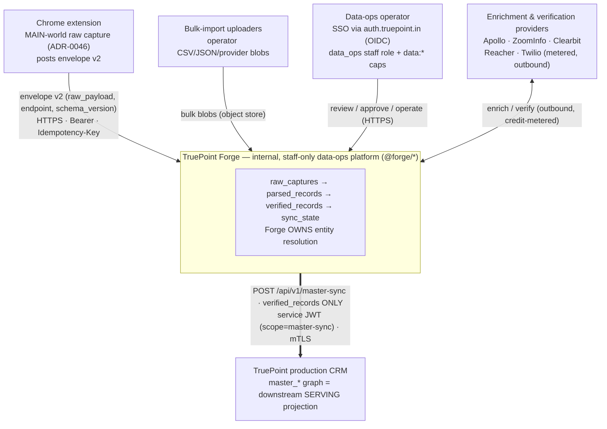
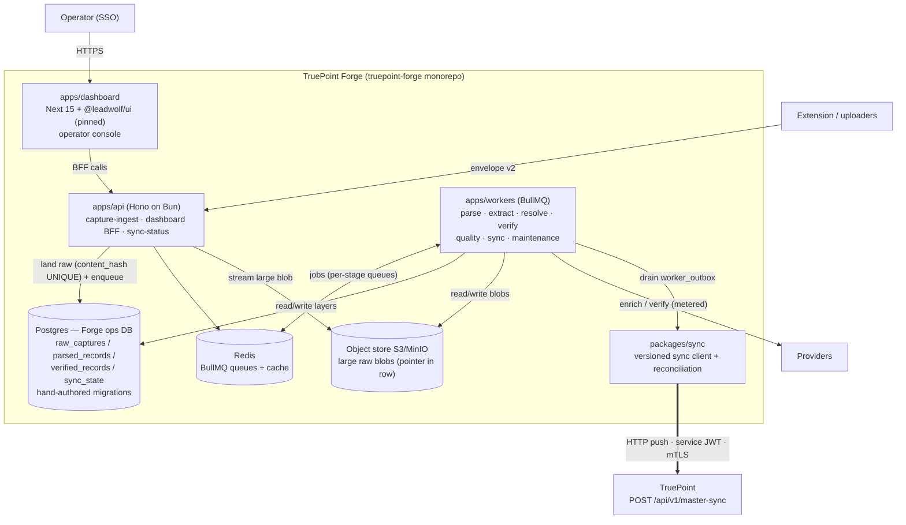
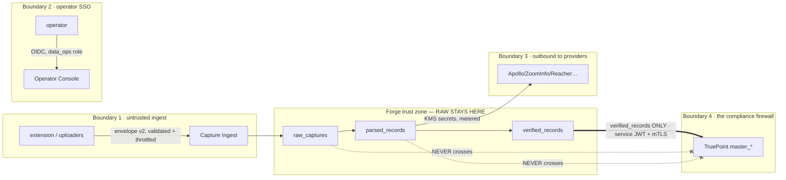

# 03 — System Architecture

> **Canonical contract:** TruePoint Forge is a **separate, internal, staff-only** data-operations
> platform (its own repo `truepoint-forge`, scope `@forge/*`, its own ops DB and apps) sitting
> **upstream** of the TruePoint production CRM. It runs the four-layer medallion
> `raw_captures → parsed_records → verified_records → (sync) → TruePoint master graph`, **owns entity
> resolution**, and pushes only the governed `verified_records` layer to TruePoint via a versioned
> server-to-server contract **`POST /api/v1/master-sync`**. Raw intercepted payloads **never** cross
> into the production CRM (the compliance firewall). **Locking ADRs: ADR-0046** (raw API interception
> as primary capture) **and ADR-0047** (Forge owns ER + versioned master-sync).

Layer names, the sync contract, naming (`@forge/*`, `truepoint-forge`, `TruePoint Forge`), and the
open-question register are frozen in `_context/decision-ledger.md` (L1–L11). Current-state TruePoint
facts are owned by `_context/ecosystem-facts.md` (cited by `§` anchor). Industry best-practice claims
cite `[S#]` in `_context/research-corpus.md`. This doc **draws the boundaries**; it does not restate
another doc's schema (owned by `05-database-design`), security design (`14-security`), or scale design
(`17-scalability`) — it links to the owner.

---

## Objectives

1. Fix the **system boundary**: what is inside Forge, what its neighbors are, and precisely which
   bytes cross each edge — so every later doc inherits one boundary model instead of re-drawing it.
2. Decompose Forge into **four logical services** with non-overlapping responsibilities, mapped onto
   the three deployable apps of the frozen monorepo layout (`decision-ledger` L8).
3. Draw the **end-to-end dataflow** across the four medallion layers, naming the stage that advances
   each layer and the idempotency key that makes each stage safe to retry.
4. Make the **compliance firewall** an architectural invariant, not a policy footnote: raw capture
   stays in Forge; only `verified_records` sync to TruePoint (ADR-0046, ADR-0047, `ecosystem-facts §E`).
5. Summarize the two **locking ADRs** and the **technology choices** (`decision-ledger` L7), each with
   an industry-grounded rationale, and show exactly **how Forge replaces TruePoint's unbuilt Layer-0
   pipeline** (`ecosystem-facts §A/§B`).
6. Give scale and security **at a glance**, deferring the deep design to `17-scalability` and
   `14-security`, and register the architecture-level gaps (`G-FORGE-301…305`), risks, milestones, and
   open questions.

Non-goals: table/column definitions (owned by `05-database-design`), the ADR texts themselves (owned
by `docs/planning/decisions/ADR-0046`, `ADR-0047`), envelope-v2 field detail (`decision-ledger` L3 +
the ingestion doc), and TruePoint current-state facts (owned by `_context/ecosystem-facts.md`).

---

## Context (C4 level 1)

Forge sits between five external actors and the TruePoint production CRM. The single hard rule the
diagram encodes: **everything raw flows *into* Forge; only governed golden records flow *out* to
TruePoint.**

**Edges, and what crosses them.**

| Edge | Direction | Payload | Trust posture |
|---|---|---|---|
| Extension → Forge | in | envelope v2 (verbatim `raw_payload` + `endpoint` + `schema_version`) | untrusted input; validated + volume-throttled at the edge (extends `checkCaptureRate`, `ecosystem-facts §A`) |
| Uploaders → Forge | in | bulk blobs | untrusted; AV-scanned, size-capped (mirrors `import_jobs` posture, `ecosystem-facts §C`) |
| Operator → Forge | in/out | review UI + operate | authenticated via SSO (`data_ops` role, `ecosystem-facts §C`) |
| Providers ↔ Forge | out/in | enrichment/verification calls | outbound to third parties; secrets in KMS, credit-metered |
| **Forge → TruePoint** | **out** | **`verified_records` only** | **service principal, scoped JWT + mTLS; the firewall boundary** |

The industry rationale for this shape — a multi-source data factory whose leaders own entity
resolution in-house and treat the production dataset as a served projection — is established in
`01 §Sales-intelligence data operations` [S3][S4] and MDM's coexistence/match-merge pattern [S30][S31].

---

## Container view (C4 level 2)

Three deployable apps (`decision-ledger` L8) plus the shared stores. Postgres holds layer metadata and
small profile JSON; large raw blobs live in the object store with only a pointer in the row — the
Postgres JSONB TOAST cliff at ~2 kB makes this mandatory, not stylistic [S82][S83] (`decision-ledger` L7).

The worker platform (one shared `IORedis`, per-queue retry+jitter, PII-free DLQ, `withLeaderLock`,
transactional `outboxRelay`) is modeled directly on TruePoint's shipped BullMQ platform
(`ecosystem-facts §C`) rather than a general-purpose DAG orchestrator (the ETL-orchestration comparison
is a research gap, `01 §ETL/ELT`, OQ-R7). Connection pooling in front of Postgres is mandatory, not
optional [S110] — see `17-scalability` for the pooler/topology design.

---

## The four services and their responsibilities

The three deployable apps compose **four logical services**. The fourth — **Sync Egress** — is
physically a BullMQ queue inside `apps/workers` plus `packages/sync` and the `apps/api` sync-status
routes, but it is called out as a distinct service because it is the only boundary that leaves Forge
and therefore carries its own contract, identity, and trust rules (ADR-0047, `decision-ledger` L5).

| # | Service | Realized in | Owns | Must NOT |
|---|---|---|---|---|
| 1 | **Capture Ingest** (edge) | `apps/api` capture routes + `packages/capture-sdk` | validating envelope v2, per-caller volume throttle, landing immutable `raw_captures` (`content_hash` UNIQUE → idempotent), streaming large blobs to the object store, enqueuing the parse job | run parsing/ER inline; trust client-supplied scope; store clear PII in a queryable column |
| 2 | **Operator Console** | `apps/dashboard` (Next 15 + `@leadwolf/ui`) + `apps/api` BFF | the maker-checker review queue, quality/lineage/sync-status surfaces, bulk actions, SSO-gated operator auth | be a security boundary on its own (client validation is UX; the API re-checks capability, `ecosystem-facts §C`) |
| 3 | **Pipeline Workers** | `apps/workers` DAG (`parse → extract → resolve → verify → quality → maintenance`) | advancing `raw → parsed` (versioned parser), `parsed → candidate` (Anthropic extract), candidate resolution (Forge-owned Fellegi-Sunter ER + survivorship), and the quality gate that promotes to `verified_records` | write directly to silver from ingest (build silver *from* bronze [S81]); auto-merge grey-zone pairs without maker-checker [S38][S57] |
| 4 | **Sync Egress** | `packages/sync` + `apps/workers` sync queue + `worker_outbox` relay + `apps/api` sync-status | draining the transactional outbox, encrypting PII + computing blind indexes, the versioned idempotent HTTP push to `POST /api/v1/master-sync`, reconciliation/checksum, `sync_state`/`master_id_map` bookkeeping | ship `raw_captures`/`parsed_records`; use a human/tenant session; write TruePoint's DB directly (rejected, `decision-ledger` L5) |

Service boundaries follow the same dependency discipline as TruePoint: imports go through each
package's `index.ts`, and no `apps/*` imports another app (`decision-ledger` L8, mirrors
`ecosystem-facts §D`). `packages/core` owns the parser framework + ER/dedup + quality rules +
survivorship; `packages/capture-sdk` (interceptor helpers + envelope-v2 builder + size/PII guards) is
shared with the extension (single-sourcing decision is OQ-6).

---

## End-to-end dataflow

Each arrow is a worker stage; each layer is append-only and reprocessable from the layer before it.
The three idempotency keys — `content_hash` at ingest, `(raw_id, parser_version)` at parse, and the
outbox event id at sync — make every stage safe to retry (effectively-once, since every mainstream
queue is at-least-once [S72]). This is the same layer flow drawn in `01 §The medallion`; here it is
projected onto Forge's services rather than the research verdicts.

```mermaid
flowchart LR
    subgraph CAP["1 · Capture Ingest (edge)"]
      A["envelope v2<br/>validate + volume-throttle"]
    end
    A -->|"content_hash UNIQUE<br/>idempotent land"| RC

    subgraph B["raw_captures — BRONZE"]
      RC["verbatim payload · immutable<br/>large blob → object store, pointer in row"]
    end
    RC -->|"versioned parser reads FROM bronze [S81]"| PR
    RC -. "parse/schema drift [S45]" .-> Q["quarantine / DLQ lane"]

    subgraph C["parsed_records — SILVER"]
      PR["normalized candidate fields<br/>FK → raw_capture + parser_version"]
    end
    PR -->|"Anthropic extract<br/>grammar-constrained + grounded [S47][S48]"| EX["candidate fields + confidence"]
    EX -->|"Forge ER: Fellegi-Sunter + TF adj + blocking [S35][S36][S39]"| RES["resolve · dedup · per-attribute survivorship [S27]"]
    RES -->|"grey zone [S38]"| HR["maker-checker review<br/>pending → approve [S57]"]
    RES -->|"auto-merge (above threshold)"| VR
    HR -->|"approve"| VR

    subgraph D["verified_records — GOLD (governed)"]
      VR["golden entities · merge lineage + confidence<br/>encrypt PII (AES-GCM) + HMAC blind index"]
    end
    VR -->|"transactional outbox, SAME tx [S20]"| OB["worker_outbox + sync worker"]
    OB ==>|"POST /api/v1/master-sync<br/>idempotent effectively-once [S21][S72]"| MS

    subgraph E["TruePoint master_* — SERVING projection"]
      MS["upsert on source_records.content_hash + blind index<br/>match_links.review_status = 'confirmed'"]
    end
    OB -. "periodic reconciliation / checksum [S25]" .-> MS
```

Notes that bind the flow to existing TruePoint contracts (schema detail → `05-database-design`):

- **Bronze idempotency** mirrors `source_records.content_hash` UNIQUE (`ecosystem-facts §B`); a replayed
  capture is a no-op.
- **The PII scheme is honored end-to-end**: `verified_records` and the sync encrypt channel PII as
  `bytea` AES-GCM and compute the HMAC blind index before upsert; clear PII never crosses in a queryable
  column (`ecosystem-facts §B`, `decision-ledger` L5).
- **Resolution has already happened upstream**, so the sync sets `match_links.review_status='confirmed'`
  on TruePoint (`ecosystem-facts §B`).
- **Reprocessing**: a new parser version replays historical `raw_captures` (`$supersedes`-style [S43]);
  because bronze is immutable/append-only, the whole graph is a replayable projection [S90].

---

## Trust boundaries & the compliance firewall

Forge crosses four trust boundaries. The load-bearing one is the last: **the compliance firewall keeps
raw intercepted payloads inside Forge and lets only governed `verified_records` reach the production
CRM** (ADR-0046 amendment, `ecosystem-facts §E`). This is what lets TruePoint hold sales-intelligence
golden records without ever storing the verbatim authenticated-session capture that produced them — the
raw layer's legal exposure (the interception risk register in `01 §Legal`, L-1…L-13) is contained to a
single internal system, and TruePoint's master graph carries only the derived, minimized result.

| Boundary | Control | Grounding |
|---|---|---|
| 1 — untrusted ingest | envelope-v2 schema validation, scope re-pinned to the token, per-caller record-volume throttle (extends `checkCaptureRate`, fails open) | `ecosystem-facts §A`; `decision-ledger` L3 |
| 2 — operator SSO | OIDC against `auth.truepoint.in`, mapped to the shipped `data_ops` staff role + `data:*` capabilities; hybrid RBAC+ABAC with maker≠checker separation-of-duties | `ecosystem-facts §C`; `decision-ledger` L6; [S115] |
| 3 — outbound providers | third-party secrets in KMS, never on a client; credit-metered; per-provider circuit breakers | `ecosystem-facts §C` (reuse-and-extend inventory) |
| 4 — **compliance firewall** | only `verified_records` sync; **`raw_captures`/`parsed_records` never leave Forge**; service principal (scoped JWT, `aud=truepoint-api`, `scope=master-sync`), never a human/tenant session; mTLS + short-lived workload identity | ADR-0046/0047; `ecosystem-facts §E`; `decision-ledger` L5; [S119][S120] |

Deep enforcement design — per-layer DB roles so no single role reads raw PII **and** writes production
[S121], envelope encryption, DSAR/erasure reaching the raw layer [S117] — is owned by `14-security`.

---

## Key architecture decisions

Both ADRs are authored in `docs/planning/decisions/` (TruePoint side); this section summarizes and links.

### ADR-0046 — Raw API interception as primary capture

Amends **ADR-0043 decision #4** (`ecosystem-facts §E`, which explicitly *rejected* MAIN-world
interception). The extension gains a MAIN-world raw-capture mode (monkey-patch `fetch` +
`XMLHttpRequest.prototype`, CustomEvent bridge, **secret redaction before the process boundary**) that
posts **envelope v2 to Forge**, never to TruePoint's `/api/v1/ingest` (`decision-ledger` L3). The
technique is MV3-standard [S13]; the *"primary"* designation carries an unresolved legal/ToS/compliance
risk (`01 §Legal`, verdict **ESCALATE**) routed to **OQ-2 (GA-blocking, not planning-blocking)**. The
ADR carries the risk register, a **kill-switch**, per-tenant gating, and mandates the **compliance
firewall** above. Config flags stay off by default, mirroring the existing `CHROME_EXTENSION_ENABLED`
posture (`ecosystem-facts §A/§E`).

### ADR-0047 — Forge as master-graph upstream + versioned sync

Forge **owns entity resolution**: `raw → parse → AI extract → verify → dedup/merge/survivorship` all run
in Forge's ops DB (`decision-ledger` L4). TruePoint's `packages/core/src/er/` + `erSweep` stay **inert
for ingestion**, and `master_*` becomes a **downstream serving projection fed only by the sync**
(`ecosystem-facts §B/§C`). The sync is an **HTTP push** to a versioned `POST /api/v1/master-sync`,
driven by a **transactional outbox + sync worker**, **idempotent** (upsert on `source_records.content_hash`
+ master blind index), implemented TruePoint-side as a new **`forge_sync` connector** bound to a system
principal (reuses the connector-registry pattern, `ecosystem-facts §A`). Research **AMENDs** the naive
"POST after write" reading with three mandatory mechanisms — outbox-in-tx [S20], effectively-once
idempotent apply [S21][S72], and reconciliation + versioned contract [S25][S24] (`01 §verdict (c)`).
**Rejected:** direct cross-DB writes (couples to RLS/encryption internals) and event-bus-as-primary
(extra infra) — the internal outbox/relay is **not** an event bus; a future event-bus option is deferred
to `20` (`decision-ledger` L5).

---

## Technology choices

Forge mirrors TruePoint's stack (`decision-ledger` L7, `ecosystem-facts` intro) so operators, migration
discipline, and the worker platform transfer directly; the one net-new substrate is object storage.

| Concern | Choice | Rationale (industry + TruePoint reuse) |
|---|---|---|
| Runtime / build | **Bun 1.3.14 + Turbo + Biome** | identical to TruePoint (`ecosystem-facts` intro); zero context-switch for operators; not pnpm/ESLint |
| API | **Hono on Bun** | matches `apps/api` (`ecosystem-facts §A`); light edge for the untrusted capture path + BFF |
| Relational store | **Postgres + Drizzle, hand-authored migrations** | `generate` is unsafe here (stale snapshots re-add tables), so Forge follows the same hand-authored discipline (`ecosystem-facts §D`); expand/contract migrations for canary two-version windows [S113] |
| Large raw blobs | **Object storage (S3/MinIO)**, pointer in row | Postgres JSONB degrades 2–10× past the ~2 kB TOAST cliff and rewrites the whole value on update — large verbatim payloads belong in object storage; small profile JSON MAY stay JSONB [S82][S83] (OQ-4) |
| Queues / jobs | **BullMQ + Redis** | reuses the shipped worker platform — retry+jitter, PII-free DLQ, `withLeaderLock`, transactional `outboxRelay` (`ecosystem-facts §C`); at-least-once + idempotent consumers is the correctness model [S72][S73]; native `jobId` dedup on the raw-payload hash [S75] |
| Cross-DB consistency | **Transactional outbox** (same tx as the verified write) | kills the dual-write hazard; the relay drives the HTTP push [S20]; already proven as `outboxRelay.ts` / ADR-0027 (`ecosystem-facts §C`) |
| AI extraction | **Anthropic Claude** (Structured Outputs) | grammar-constrained sampling guarantees schema-valid JSON, failing only on refusal/`max_tokens` [S47]; aligns with TruePoint's shipped Anthropic seam + ADR-0023 (`ecosystem-facts §C`); guardrail — structure ≠ correctness, so maker-checker + DQ stay mandatory [S47] |
| Entity resolution | **Forge-owned Fellegi-Sunter** in `@forge/core` | transparent, EM-trainable, production-viable at 1–100M+ [S35][S40]; relocates/adapts TruePoint's inert `er/fellegiSunter.ts` math, adding mandatory TF adjustment + two thresholds + blocking diagnostic [S36][S38][S39] (`ecosystem-facts §C`, ADR-0047) |
| Dashboard | **Next.js 15 + `@leadwolf/ui` (pinned)** | mirrors `apps/admin` (Next 15 + React 19, `ecosystem-facts §C`); consumes a pinned `@leadwolf/ui` slice; no fork of `@leadwolf/*` (`decision-ledger` L1) |
| Observability | **OpenTelemetry + Prometheus/Grafana** | queue depth/wait/p95/p99 + retry-exhaustion as first-class SLOs [S101]; producers inject W3C `traceparent`, fan-out uses span **links** across async workers [S97][S98]; `/metrics` already shipped (`ecosystem-facts §C`) |
| Service identity | **mTLS + scoped client-credentials JWT** (SPIFFE/SPIRE candidate) | short-lived auto-rotated workload identity, never a static token [S119][S120]; depth (full SPIRE vs mTLS+JWT) is OQ-R18 |

---

## How this replaces TruePoint's unbuilt Layer-0 pipeline

TruePoint has the **shape** of Layer-0 but no working pipeline — Forge is the pipeline.

| TruePoint today (`ecosystem-facts`) | State | What Forge does instead |
|---|---|---|
| `POST /api/v1/ingest` validates the envelope, enforces scope, rate-limits, then returns **`202 {accepted}` and stores NOTHING** (§A) | stub; the async pipeline is "wired in later slices" | Forge builds the real pipeline behind **envelope v2** → `raw_captures` and the parse→verify→sync DAG the stub explicitly defers (**G-FORGE-101**, `01`) |
| `rawObservation = z.record(string, unknown)` — **no `raw_payload`/`endpoint`/`schema_version`** (§A) | no verbatim raw | **envelope v2** superset carries the verbatim payload needed for source grounding [S48], SchemaVer replay [S43], and `hadPrimarySource` provenance [S89] (**G-FORGE-102**) |
| Extension captures **visible DOM only, no XHR interception** (ADR-0043 guardrail, §E) | DOM-only | ADR-0046 pivots to MAIN-world raw capture posting envelope v2 to Forge (**G-FORGE-103**) |
| `master_*` = **seven system-owned tables, no ingestion/ER/sync** (§B) | schema-only | ADR-0047 makes `master_*` a **serving projection fed only by the sync**; not RLS-scoped, isolation stays structural (no grant to `leadwolf_app`) — Forge honors this, adds no tenancy factories (**G-FORGE-104**) |
| `er/fellegiSunter.ts` + `erSweep` exist but are **flag-dark, never auto-merge** (§C) | inert | Forge rebuilds ER as its **owned** engine (`@forge/core`); TruePoint's `er/` stays inert for ingestion (ADR-0047, **G-FORGE-105**) |
| `outboxRelay.ts` transactional outbox shipped (ADR-0027, §C) | reusable | Forge's Sync Egress reuses the outbox pattern; TruePoint gains the `forge_sync` connector + `POST /api/v1/master-sync` endpoint (both **unbuilt today**, **G-FORGE-302**) |

The net: **Forge fills the empty pipeline between an ingest stub that accepts-and-drops and a master
graph that is schema-only**, and it does so in a separate system so the raw layer's legal exposure never
touches the production CRM.

---

## Scalability & security at a glance

Headlines only; deep design is owned by `17-scalability` and `14-security`.

**Scale.** Per-stage BullMQ queues on homogeneous job profiles (parse ≠ AI-extract ≠ sync durations),
autoscaled on queue depth via KEDA (scale-to-zero) rather than CPU HPA [S104][S105]; a **mandatory
connection pooler** (RDS Proxy / PgBouncer, transaction-mode, RLS-safe) in front of Postgres — pooling
gives ~18–20× throughput under connection churn [S110]; Aurora-style Multi-AZ with reader-endpoint
routing for read-heavy verification/search [S108][S114]; object-store hot/cold tiering + mandatory
compaction/expiration for the append-only raw layer [S84]; datetime-partitioned `raw_captures` for cheap
batch reprocessing [S81]. Compute topology (ECS Fargate vs EKS) is undecided (**G-FORGE-303**, OQ-R6).

**Security.** SSO (OIDC, `data_ops` role + `data:*` caps, `ecosystem-facts §C`); hybrid RBAC+ABAC with
**maker≠checker** separation-of-duties as the verified→sync gate primitive [S115]; per-layer DB roles so
no role reads raw PII and writes production [S121]; envelope encryption (per-tenant DEK wrapped by a KMS
KEK, key-admin SoD) across all four layers [S122]; bytea AES-GCM + HMAC blind index honored end-to-end
(`ecosystem-facts §B`); the service-to-service sync on mTLS + scoped short-lived JWT, never a static
token [S119][S120]; DSAR/erasure reaching the raw layer with tombstoning [S117]; and the **compliance
firewall** as the top-level invariant.

---

## Risks & mitigations

New architecture-level gaps use `G-FORGE-301…305` (this doc's disjoint gap-ID block, `decision-ledger`
L9); earlier gaps (`G-FORGE-101…111`) live in `01`.

| Risk / gap | Area | Likelihood × Impact | Mitigation (cite) |
|---|---|---|---|
| **G-FORGE-301** — `truepoint-forge` repo/monorepo does not exist yet (scaffold, CI, migrations, 4 services all net-new) | architecture / platform | High × Med | Milestone M-FORGE-A scaffolds the frozen L8 layout + hand-authored migration + CI harness before any pipeline work |
| **G-FORGE-302** — `forge_sync` connector + `POST /api/v1/master-sync` are **unbuilt** on TruePoint | platform / security | High × High | build TruePoint-side endpoint + system-principal connector first; consumer-driven Pact contract owned by the CRM [S126] (ADR-0047) |
| **G-FORGE-303** — deployment topology + autoscaling undecided | operations / platform | Med × Med | resolve OQ-R6 (ECS Fargate vs EKS; KEDA biases EKS) in `17`; per-stage queues regardless [S105][S106] |
| **G-FORGE-304** — object-store substrate is net-new infra (no S3/MinIO in TruePoint's stack today) | platform | Med × Med | provision object store in M-FORGE-A; pointer-in-row contract in `05`; default object-store-large / JSONB-small (OQ-4) [S82] |
| **G-FORGE-305** — cross-service trace + reconciliation not wired Forge↔TruePoint | operations | Med × Med | inject `traceparent`, span **links** on async fan-out [S97][S98]; periodic reconciliation/checksum on the sync [S25] |
| Interception legal/ToS liability (session capture) | security | Med × High | OQ-2 legal sign-off gate; compliance firewall (raw never reaches CRM); per-source LIA + Art 14 path (`01 §Legal`) [S116][S17] |
| Dual-write inconsistency Forge-DB ↔ CRM | platform | Med × High | transactional outbox in-tx + idempotent effectively-once apply + reconciliation [S20][S21][S25] |
| Golden-record over-merge (common names) | data | Med × High | TF adjustment + two thresholds + blocking diagnostic + explainable bits-of-evidence for reviewers [S36][S38][S39][S42] |
| AI hallucinated-but-valid fields promoted | data | Med × High | structure ≠ correctness: grounding + validator + judge + maker-checker gate [S47][S48][S49] |
| Sync is a one-way door (Forge owns ER) | architecture | Low × High | OQ-3 acknowledged; `master_*` is a serving projection with no independent ER (ADR-0047) |

---

## Milestones

Build order follows the dataflow left-to-right; the roadmap doc owns the detailed sequencing and
dependencies. Deep schema/security/scale design is handed to `05`/`14`/`17` at each phase.

| Milestone | Delivers | Exit criterion |
|---|---|---|
| **M-FORGE-A — Foundation** | `truepoint-forge` scaffold (L8 layout), ops DB + first hand-authored migration, object store, SSO auth (`data_ops`), Capture Ingest landing `raw_captures` (envelope v2, `content_hash` idempotent) | a captured envelope v2 lands an immutable `raw_captures` row + blob; replay is a no-op |
| **M-FORGE-B — Parse** | versioned parser framework → `parsed_records`; drift→quarantine lane; SchemaVer + replay-from-bronze | a parser version reprocesses historical raw; drift is quarantined, not silently accepted [S45] |
| **M-FORGE-C — Extract + Resolve** | Anthropic grammar-constrained extraction + source grounding; Forge-owned Fellegi-Sunter ER (TF + blocking + two thresholds) | grey-zone pairs route to review; auto-merge only above threshold [S38] |
| **M-FORGE-D — Verify** | maker-checker review console (pending→approve, four-eyes in the write path), weighted DAMA quality gate → `verified_records` | no record promotes to verified without an approving checker ≠ maker [S57] |
| **M-FORGE-E — Sync Egress** | transactional outbox + sync worker, `POST /api/v1/master-sync` + `forge_sync` connector (TruePoint side), idempotent apply, `sync_state`/`master_id_map`, reconciliation | a verified record syncs effectively-once; reconciliation detects drift [S25] |
| **M-FORGE-F — Operate** | OTel traces + Prometheus SLOs, DLQ/retry-exhaustion alerting, lineage, cost metering, hardening | queue-health + freshness SLOs alarm on user-facing symptoms [S101] |

---

## Deliverables

1. The **C4 context + container models** and the **four-service boundary spec** above — the frozen
   boundary every later doc builds on.
2. The **end-to-end dataflow** with the three idempotency keys and the append-only/replayable invariant.
3. The **compliance-firewall trust model** (raw stays in Forge; only `verified_records` sync) as an
   architectural invariant handed to `14-security` for enforcement design.
4. The **technology-choice register** (`decision-ledger` L7) with grounded rationale.
5. The **Layer-0 replacement mapping** (`ecosystem-facts §A/§B`) and the architecture gap register
   `G-FORGE-301…305` mapped to responsibility areas.
6. **Handoffs**: schema → `05-database-design`; security enforcement → `14-security`; scale/topology →
   `17-scalability`; future event-bus option → `20`.

---

## Success criteria

1. **The firewall holds by construction**: no `raw_captures`/`parsed_records` field is reachable from
   TruePoint; a data-diff / contract test between `verified_records` and `master_*` excludes raw
   payloads by design [S128] (`14-security` verifies).
2. **The sync is effectively-once and outbox-driven**: a replayed sync is a no-op (idempotent upsert on
   `content_hash` + blind index), and no verified write can commit without its outbox row in the same tx
   [S20][S21].
3. **Forge owns ER**: resolution/merge/survivorship run in Forge; TruePoint's `er/` + `erSweep` remain
   inert for ingestion; `master_*` has no independent pipeline (ADR-0047).
4. **Operators authenticate only via SSO** mapped to `data_ops` + `data:*`; the machine sync uses a
   scoped service principal, never a human/tenant session (`decision-ledger` L5/L6).
5. **Every layer is append-only and reprocessable**: a new parser version can rebuild `parsed_records`
   and downstream from immutable `raw_captures` with no re-capture [S81][S90].
6. **No architecture decision is answered from first principles where a corpus finding or ecosystem
   fact exists** — each cites its `[S#]` or `§` anchor (CLAUDE.md mandatory-read rule).

---

## Open questions

The full register lives in `_context/decision-ledger.md` (L11, OQ-1…OQ-6) and `01`'s research register
(OQ-R1…OQ-R20); the architecture-shaping ones surface here.

- **OQ-1 — `truepoint-forge` / `@forge/*` name collision with Atlassian Forge** (chosen deliberately;
  no rename, `decision-ledger` L1).
- **OQ-2 — Interception legal sign-off (GA-blocking).** Drives ADR-0046's "primary" designation and the
  firewall's necessity (`01 §Legal`, verdict a). [S116][S118][S16]
- **OQ-3 — The sync is a one-way door**: Forge owns ER, so `master_*` cannot resolve independently.
- **OQ-4 — Raw-blob substrate** (object store vs JSONB; default object-store-large / JSONB-small);
  overlaps OQ-R8 (Iceberg vs Delta). **G-FORGE-304.** [S82][S86]
- **OQ-R4 — Sync relay: polling publisher vs Debezium WAL CDC** (the no-Docker coordinator host favors
  polling). [S20][S24]
- **OQ-R5 — Orchestration: chained BullMQ (+ hand-built DLQ/saga) vs Temporal durable execution.**
  [S76][S73]
- **OQ-R6 / G-FORGE-303 — Compute topology (ECS Fargate vs EKS + KEDA).** [S106][S104]
- **OQ-R18 — Service-identity depth: full SPIFFE/SPIRE vs mTLS + scoped service-JWT** (`decision-ledger`
  L5). [S119]
- **OQ-5 — Retirement of TruePoint's dark `chrome_extension` connector** once the extension posts
  envelope v2 to Forge (`ecosystem-facts §A/§E`).
- **OQ-6 — `@forge/capture-sdk` single-sourcing** (shared with the extension vs fork).
