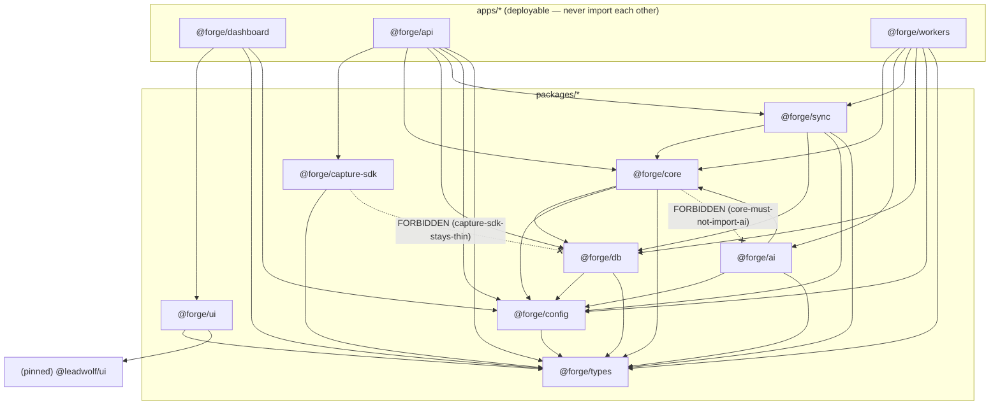

# 04 — Monorepo Structure

> **Canonical contract:** TruePoint Forge ships as **one Bun + Turbo + Biome monorepo** named
> **`truepoint-forge`** (scope **`@forge/*`**) with the frozen layout of `decision-ledger` L8 —
> `apps/{dashboard,api,workers}` + `packages/{types,db,core,ai,sync,capture-sdk,config,ui}`. It mirrors
> TruePoint's tooling and import-boundary discipline verbatim (imports only through each package's
> `index.ts`; no `apps/*` imports another app; `core` declares ports and never imports the adapter
> package; `capture-sdk` depends on `types` only). Forge does **not** fork TruePoint's `@leadwolf/*`
> packages — it consumes **pinned slices** of `@leadwolf/ui` and a `@leadwolf/types` subset and otherwise
> stands alone (`decision-ledger` L1). **Locking ADRs: ADR-0046** (raw API interception as primary
> capture) **and ADR-0047** (Forge owns ER + versioned master-sync).

This doc owns the **repository shape, package surfaces, boundary rules, and build tooling**. It does not
restate the service boundaries (owned by `03-system-architecture`), the table/column schema (owned by
`05-database-design`), the security enforcement (owned by `14-security`), or the scale topology (owned by
`17-scalability`) — it links to each owner. Current-state TruePoint facts cite `_context/ecosystem-facts.md`
by `§` anchor; industry best-practice claims cite `[S#]` in `_context/research-corpus.md`; the frozen
vocabulary is `_context/decision-ledger.md` (L1–L11). TruePoint tooling-config claims that the facts sheet
does not yet carry were **verified directly against the live root tree (2026-07-05)** and are cited by
their real `file:line` — the same methodology the facts sheet uses.

---

## Objectives

1. Freeze the **directory layout** of `truepoint-forge` — the exact `apps/` + `packages/` tree of
   `decision-ledger` L8 — so every later doc scaffolds against one shape instead of re-inventing it.
2. Define each package's **purpose, public `index.ts` surface, and allowed dependencies** as a single
   table, so a reviewer can answer "may X import Y?" without reading code.
3. Port TruePoint's **`.dependency-cruiser.cjs` boundary gate** to Forge one-for-one, adapted to the
   8-package graph, and show the allowed edges as a Mermaid DAG that the gate mechanically enforces.
4. Pin down the **build & tooling** (Turbo pipeline, Biome, `tsconfig` layering, Bun workspace protocol)
   as a verbatim mirror of TruePoint so operators carry zero context-switch (`decision-ledger` L7).
5. Specify the **shared-types strategy**: where envelope v2 and the sync-contract types live
   (`@forge/types`), and precisely which pinned `@leadwolf/*` slices are **consumed** vs **re-implemented**
   (`decision-ledger` L1/L3).
6. Establish the **`apps/dashboard` feature-folder convention** as a mirror of the shipped
   `apps/admin` structure (`ecosystem-facts §C`), and restate the **hand-authored migration discipline**
   (`ecosystem-facts §D`) as a repo-level rule.
7. Register the monorepo-structure gaps (`G-FORGE-401…405`), risks, milestones, deliverables, success
   criteria, and open questions.

Non-goals: service responsibilities and dataflow (owned by `03`), schema (owned by `05`), the ADR texts
(owned by `docs/planning/decisions/ADR-0046`, `ADR-0047`), and per-provider adapter design (owned by the
enrichment/verification docs).

---

## Repository layout

The frozen layout of `decision-ledger` L8 — **three apps, eight packages** — rendered as the on-disk tree.
Internal packages are **source-level** (`exports: { ".": "./src/index.ts" }`, no build step; `typecheck`
runs `tsc --noEmit`), exactly as TruePoint ships them (`packages/core/package.json:5-7`, verified).

```
truepoint-forge/
├── package.json                 # name "truepoint-forge" · workspaces ["apps/*","packages/*"] · packageManager bun@1.3.14
├── turbo.json                   # tasks: build · typecheck · dev · lint · migrate · seed  (mirror of TruePoint turbo.json)
├── biome.json                   # formatter + linter (mirror of TruePoint biome.json)
├── tsconfig.base.json           # shared compilerOptions; every package/app tsconfig extends it
├── .dependency-cruiser.cjs      # the mechanical import-boundary gate (mirror of TruePoint's, adapted to 8 packages)
├── .env                         # turbo globalDependency (mirror)
├── apps/
│   ├── dashboard/               # @forge/dashboard — Next 15 App Router operator console
│   │   └── src/
│   │       ├── app/(shell)/…    # route groups: captures · parsers · review · quality · lineage · sync-status
│   │       ├── features/<f>/    # feature folders (index.ts · api.ts · components/ · hooks/ · types.ts · format.ts)
│   │       └── components/shell/ # app chrome (nav, header) — mirrors apps/admin/src/components/shell
│   ├── api/                     # @forge/api — Hono on Bun
│   │   └── src/
│   │       ├── features/        # ingest · dashboard-bff · sync-status  (route + handler per feature)
│   │       └── middleware/      # authn · staff-role · capability · rate-limit
│   └── workers/                 # @forge/workers — BullMQ
│       └── src/
│           ├── queues/          # parse · extract · resolve · verify · quality · sync · maintenance
│           └── register.ts      # one shared IORedis; Queues exported; startWorkers()  (mirror of ecosystem-facts §C)
└── packages/
    ├── types/                   # @forge/types — envelope v2 + sync-contract Zod + shared enums (LEAF)
    ├── config/                  # @forge/config — env parse, feature flags, envelope size caps (imports only types)
    ├── capture-sdk/             # @forge/capture-sdk — interceptor helpers + envelope-v2 builder + size/PII guards (TYPES-ONLY; ships to the extension)
    ├── db/                      # @forge/db — Drizzle schema (4 layers) + staff-scope client + hand-authored migrations
    ├── core/                    # @forge/core — parser framework · Fellegi-Sunter ER · dedup/merge/survivorship · quality/validation rules · PORTS
    ├── ai/                      # @forge/ai — outbound adapters: Anthropic extraction + enrichment/verification providers (implements core ports)
    ├── sync/                    # @forge/sync — versioned sync client + reconciliation + master_id_map bookkeeping
    └── ui/                      # @forge/ui — pinned @leadwolf/ui slice re-export + Forge-only components (var(--tp-*) tokens)
```

Mapping of the three apps to the four logical services and the seven worker stages is owned by
`03 §The four services` and `03 §End-to-end dataflow` — not restated here.

> **Note on `packages/ai` (the integrations seam).** `decision-ledger` L8 lists no `integrations`
> package, yet Forge makes outbound calls to Anthropic (extraction) and to enrichment/verification
> providers (`03 §Container view`). Forge resolves this by having **`@forge/ai` play the role TruePoint's
> `@leadwolf/integrations` plays**: `@forge/core` declares the ports (parse/extract/enrich/verify), and
> `@forge/ai` holds the adapters that implement them. This keeps the "core declares ports, adapters
> implement them" separation TruePoint enforces (`.dependency-cruiser.cjs:62-69`, verified) — the
> boundary rule simply becomes **`core-must-not-import-ai`**. Ratifying this framing is **G-FORGE-402**.

---

## Package responsibilities & public surface

Every internal dependency is declared `workspace:*` and resolved to the package's `index.ts`
(no deep imports). "Allowed deps" lists **internal** Forge packages only; leaf third-party libs (Zod,
Drizzle, Hono, BullMQ, the Anthropic SDK) are elided.

| Package | Purpose | `index.ts` exports (public surface) | Allowed internal deps |
|---|---|---|---|
| **`@forge/types`** | The wire vocabulary. Owns **envelope v2** (superset of TruePoint's `ingestionEnvelope`, `ecosystem-facts §A`, `decision-ledger` L3) and the **`POST /api/v1/master-sync` request/response** types (`decision-ledger` L5), plus the four-layer enums (`sync_state` states, `review_status`). | `ingestionEnvelopeV2` Zod + type; `masterSyncRequest`/`masterSyncResponse` Zod; layer/enum types; the pinned `@leadwolf/types` re-exports (see §Shared types) | **none** (leaf) |
| **`@forge/config`** | Typed env parsing + feature flags (all capture/interception flags off by default, mirroring `CHROME_EXTENSION_ENABLED`, `ecosystem-facts §A`) + envelope size caps + object-store settings. | `env` (parsed, validated), flag helpers, size-cap constants | `types` |
| **`@forge/capture-sdk`** | Shared with the pivoted MV3 extension: MAIN-world interceptor helpers, the **envelope-v2 builder**, size + **secret-redaction/PII guards** run before the process boundary (ADR-0046). | `buildEnvelopeV2()`, interceptor install/teardown, `redactSecrets()`, size guards | **`types` only** |
| **`@forge/db`** | Drizzle schema for the four layers (`raw_captures` · `parsed_records` · `verified_records` · `sync_state`/`master_id_map`) + the **staff-scope tx client** (Forge's simplification of TruePoint's tenant/privileged/er/platform scopes, `ecosystem-facts §D`) + **hand-authored migrations** + journal. | `schema`, `withStaffTx`/`withPrivilegedTx`, `db` client | `types`, `config` |
| **`@forge/core`** | The factory brain: versioned **parser framework**, **Forge-owned Fellegi-Sunter ER** (TF adjustment + blocking + two thresholds [S35][S36][S39]), **dedup/merge/per-attribute survivorship** [S27], weighted-DAMA **quality/validation rules** [S63], and the **ports** the AI/provider adapters implement. | parser registry, `runResolution()`, survivorship, quality gate, **port interfaces** (`ExtractPort`, `EnrichPort`, `VerifyPort`) | `types`, `db`, `config` |
| **`@forge/ai`** | Outbound-adapter package (the integrations seam, G-FORGE-402): **Anthropic Structured-Outputs extraction** adapter [S47] + enrichment/verification provider adapters (Apollo/ZoomInfo/Reacher/Twilio), implementing `@forge/core` ports; secrets sourced from KMS via `config`, never on a client. | `anthropicExtractAdapter`, provider adapters (each an `@forge/core` port impl) | `types`, `config`, `core` |
| **`@forge/sync`** | The Sync Egress engine: **versioned sync client** to `POST /api/v1/master-sync`, idempotent effectively-once apply helpers, **reconciliation/checksum** [S25], `sync_state`/`master_id_map` bookkeeping. | `pushVerifiedRecords()`, `reconcile()`, sync-state repo | `types`, `config`, `db`, `core` |
| **`@forge/ui`** | The **single seam** through which the pinned `@leadwolf/ui` slice enters the repo: re-exports the pinned kit (`StateSwitch`, `DataTable`, `StatTile`, `Dialog`/`Drawer`, `var(--tp-*)` tokens, `fetchWithAuth`, `ecosystem-facts §C`) plus Forge-only components. `apps/dashboard` imports **only** `@forge/ui`, so the pin is swappable in one place. | re-exported `@leadwolf/ui` surface + Forge components | `types` (+ the pinned `@leadwolf/ui`) |

The three apps' surfaces:

| App | Purpose | Imports (packages) | Never imports |
|---|---|---|---|
| **`@forge/api`** (Hono) | Capture-ingest edge + dashboard BFF + sync-status | `capture-sdk`, `core`, `db`, `sync`, `config`, `types` | `ai` (extraction/provider calls are worker-side), any other app |
| **`@forge/workers`** (BullMQ) | The `parse→extract→resolve→verify→quality→sync→maintenance` DAG | `core`, `ai`, `sync`, `db`, `config`, `types` | any other app |
| **`@forge/dashboard`** (Next 15) | Operator console; talks to `api` over HTTP (BFF), never touches the DB | `ui`, `types`, `config` | `db`, `core`, `ai`, `sync`, any other app |

---

## Module boundary enforcement

Forge ports TruePoint's **`.dependency-cruiser.cjs`** verbatim and runs it as the same mechanical CI gate —
`"lint:boundaries": "depcruise apps packages"` (TruePoint `package.json:12`, verified) — so a forbidden
import **fails the build**, not a review. The Mermaid DAG below only *visualizes* the edges; the config is
what *catches* violations (TruePoint `.dependency-cruiser.cjs:1-8`, verified). The rule set is adapted to
Forge's 8-package graph; each row cites the TruePoint rule it mirrors.

| Rule (Forge) | Severity | Effect | Mirrors (TruePoint `.dependency-cruiser.cjs`) |
|---|---|---|---|
| `no-circular` | error | the graph stays acyclic via the port pattern | `:11-17` |
| `apps-never-import-apps` | error | `apps/*` are deployable processes; they share via `packages/*`, never each other | `:18-25` |
| `no-deep-import-from-app` | error | an app imports a package **only** through its `index.ts`; `.css` exempt | `:26-36` |
| `no-deep-import-cross-package` | error | a package imports another package only through its `index.ts` | `:37-47` |
| `no-cross-feature-import` | error | inside `apps/dashboard`, a feature never reaches into another feature's internals | `:48-61` |
| **`core-must-not-import-ai`** | error | `core` declares ports; `ai` implements them — one-way (Forge's rename of `core-must-not-import-integrations`) | `:62-69` |
| `types-is-a-leaf` | error | `@forge/types` imports nothing internal | `:70-76` |
| `config-imports-only-types` | error | `@forge/config` may import only `types` | `:77-83` |
| **`capture-sdk-stays-thin`** | error | `@forge/capture-sdk` imports **only `types`** — never `db`/`ai`/`sync`/`core`; it ships into the untrusted MV3 process (Forge's analog of `extension-stays-thin`) | `:84-91` |
| `no-orphans` | warn | flags unreachable modules (dead code) | `:92-98` |

The cruiser options match TruePoint too: `tsPreCompilationDeps: true`, exclude test/itest/`.d.ts`/`__cassettes__`,
and `enhancedResolveOptions.exportsFields: ["exports"]` so the `index.ts` `exports` map is authoritative
(`.dependency-cruiser.cjs:100-110`, verified).



Two structural invariants fall straight out of the graph: **`types` is the universal sink** (everything
depends on it, it depends on nothing), and **`ai` sits above `core`** (adapters depend on ports, never the
reverse) — the same acyclic port shape that lets TruePoint's `core` stay pure while `integrations` holds
provider I/O.

---

## Build & tooling

Forge mirrors TruePoint's build stack exactly (`decision-ledger` L7) — **Bun 1.3.14 + Turbo 2.3.3 + Biome
1.9.4 + TypeScript 5.7.2 + dependency-cruiser 16.10.4** (TruePoint `package.json:22-28`, verified).

**Turbo pipeline.** The root `turbo.json` (mirror of TruePoint `turbo.json`, verified) declares:

| Task | Config | Notes |
|---|---|---|
| `build` | `dependsOn: ["^build"]`; `outputs: ["dist/**", ".next/**", "!.next/cache/**"]` | topological; only `apps/dashboard` emits `.next/**` — internal packages are source-level and produce no `dist` |
| `typecheck` | `dependsOn: ["^build"]` | per-package `tsc --noEmit` (`packages/core/package.json:9-11`, verified) |
| `dev` | `cache: false`, `persistent: true` | long-running |
| `lint` | `{}` | delegates to `biome check .` at root |
| `migrate` / `seed` | `cache: false` | DB tasks; never cached |
| `globalDependencies` | `["tsconfig.base.json", ".env"]`; `globalEnv: ["NODE_ENV"]` | a base-tsconfig or `.env` change busts the whole cache |

Two deliberate deviations from a naive "turbo runs everything" reading, taken straight from TruePoint's
ground truth: **tests run via Bun's native runner** (`"test": "bun test"` at root, TruePoint
`package.json:8`) — there is no cached `test` turbo task — and **boundary linting is a first-class script**
(`"lint:boundaries": "depcruise apps packages"`, TruePoint `package.json:12`). Docker-dependent itests are
CI-only (the coordinator host has no Docker, `ecosystem-facts §D`).

**Biome.** `biome.json` is a verbatim mirror (verified TruePoint `biome.json`): formatter 2-space /
100-col, **double quotes / trailing-commas `all` / semicolons `always`**; `organizeImports` on; linter
`recommended` + `style.useImportType: error` + `style.noNonNullAssertion: off` + `suspicious.noConsoleLog:
warn`; `a11y.noLabelWithoutControl` extended with Forge input-component names; ignores
`**/dist`, `**/.next`, `**/.turbo`, `.claude`, `**/src/migrations`. Using Biome (not ESLint/Prettier) is a
locked TruePoint choice (CLAUDE.md).

**TypeScript.** One `tsconfig.base.json` (mirror of TruePoint's, verified) carries the strict profile —
`target ES2022`, `module ESNext`, **`moduleResolution: "Bundler"`**, `strict`, `noUncheckedIndexedAccess`,
`verbatimModuleSyntax`, `isolatedModules`, `allowImportingTsExtensions`, `noEmit`, `declaration` +
`declarationMap`. Every package/app has a thin `tsconfig.json` that `extends` the base. `Bundler`
resolution + source-level `exports` is what lets internal packages be consumed straight from `./src/index.ts`
with no build step.

**Bun workspace protocol.** Root `package.json` sets `"workspaces": ["apps/*", "packages/*"]` and
`"packageManager": "bun@1.3.14"` (mirror of TruePoint `package.json:4-5`, verified). Internal deps are
pinned `"workspace:*"` (e.g. TruePoint `packages/core/package.json:13-16`, verified), and each package
exposes exactly one entry: `"exports": { ".": "./src/index.ts" }`. The `exportsFields`/`conditionNames`
resolver settings in the cruiser config make that single entry the only legal import target — deep imports
resolve but **fail the boundary gate**.

Forge also stands up its own equivalent of TruePoint's architecture-map generator + boundary CI wiring
(TruePoint's `.claude/hooks/gen-architecture-map.mjs`, referenced in root `package.json:14`) so the graph
never drifts from the code — **G-FORGE-405**.

---

## Shared types strategy

Two contracts define Forge's outer surface, and both live in **`@forge/types`** so there is one owner:

1. **Envelope v2** — the ingestion contract the pivoted extension posts (ADR-0046). It is a **genuine
   superset** of TruePoint's `ingestionEnvelope` (`ecosystem-facts §A`): it keeps
   `{source, scope, idempotencyKey, collectedAt, consent?, records}` and **adds per-record `raw_payload`
   (verbatim, opaque), `endpoint`, `schema_version`, plus envelope-level size cap + gzip + chunking**
   (`decision-ledger` L3). Per the ledger it is a **new Forge-owned contract, not an edit** to TruePoint's
   `packages/types/src/ingestion.ts` — Forge authors `ingestionEnvelopeV2` fresh in `@forge/types` and
   never mutates the upstream Zod. **G-FORGE-403** tracks its versioning and single-sourcing with the
   extension via `@forge/capture-sdk` (= OQ-6).
2. **The sync contract** — the `POST /api/v1/master-sync` request/response shape and the
   `X-Forge-Sync-Version` header (`decision-ledger` L5), also authored in `@forge/types`.

**The cross-repo consumer problem (G-FORGE-404).** TruePoint is a *separate repo* and cannot import
`@forge/*`, yet its new `forge_sync` connector is the **consumer** of the sync contract. Forge does **not**
publish `@forge/types` into TruePoint. Instead the boundary is held by a **consumer-driven Pact** — the
production CRM (the consumer) owns the pact and verifies it against Forge's producer [S126], reinforced by a
mirrored Zod validator on the TruePoint side; HTTP-push keeps the contract cleanly Pact-testable [S127], and
the contract evolves under **BACKWARD/FULL compatibility (additive / optional-with-default only)** [S24].
The idempotent-upsert + reconciliation mechanics are owned by `03 §ADR-0047` and the sync doc.

**Pinned `@leadwolf/*` slices — consumed, not forked (`decision-ledger` L1).** Forge reuses two upstream
surfaces and re-implements everything else:

| Upstream surface | Consumed as | How | Why not re-implemented |
|---|---|---|---|
| **`@leadwolf/ui`** (pinned slice) | via **`@forge/ui`** re-export | `StateSwitch`/`LoadingState`/`EmptyState`/`ErrorState`, `DataTable`, `StatTile`, `StatusBadge`, `Dialog`/`Drawer`, `Combobox`, `Toast`, `Pagination`, `var(--tp-*)` tokens, `fetchWithAuth` (`ecosystem-facts §C`) | the operator console is data-ops CRUD over tables/queues — identical primitives to `apps/admin`; forking the kit would drift the design system for no benefit |
| **`@leadwolf/types`** (pinned subset) | via re-export inside **`@forge/types`** | the PII-scheme + master-upsert shapes the sync must speak (`source_records.content_hash`, `match_links.review_status`, the AES-GCM/HMAC blind-index contract, `ecosystem-facts §B`) and the `data:*` staff-capability enum (`ecosystem-facts §C`) | these are the *wire shapes Forge must match exactly* to upsert into `master_*`; re-typing them by hand invites drift |

| Upstream surface | **Re-implemented in Forge** | Why |
|---|---|---|
| `@leadwolf/db` | `@forge/db` (own schema, **staff-scope** tx, no RLS tenancy factories) | Forge's ops DB is system-owned/staff-scoped, not multi-tenant RLS (`ecosystem-facts §B/§D`, `decision-ledger` L4) |
| `@leadwolf/core` (`er/`, enrichment, data-health) | `@forge/core` + `@forge/ai` | ADR-0047: **Forge owns ER**; it relocates/adapts the Fellegi-Sunter math but the code is Forge-owned (`decision-ledger` L4, `ecosystem-facts §C`) |
| `@leadwolf/integrations` | folded into `@forge/ai` | L8 has no `integrations` package; `@forge/ai` is the adapter seam (G-FORGE-402) |
| `@leadwolf/auth` (client) | `apps/dashboard` auth client | mirrors `apps/admin`'s in-memory access token + PKCE + silent refresh + `fetchWithAuth` against `auth.truepoint.in` (`decision-ledger` L6) |

**The pinning mechanism itself is unspecified (G-FORGE-401)** — private published package vs git dependency
vs read-only submodule vs vendored copy. The requirement is only that the pin is (a) explicit and
version-locked, (b) entered at exactly one seam per surface (`@forge/ui`, `@forge/types`), and (c) never a
fork of `@leadwolf/*`. This is carried to `## Open questions`.

---

## Feature-folder conventions for `apps/dashboard`

`apps/dashboard` mirrors the **verified `apps/admin` structure** one-for-one (`ecosystem-facts §C`; admin is
Next 15 App Router + React 19). The shipped `apps/admin/src/features/data-ops/` folder is the template —
verified to contain `api.ts`, `format.ts`, `index.ts`, `types.ts`, a `components/` dir of `*Page.tsx`, and a
`hooks/` dir of `use*.ts`.

```
apps/dashboard/src/
├── app/(shell)/                 # Next 15 App Router route groups (one per operator surface)
│   ├── captures/page.tsx        #   raw_captures browser
│   ├── parsers/page.tsx         #   parser versions + drift/quarantine
│   ├── review/page.tsx          #   maker-checker verification queue
│   ├── quality/page.tsx         #   DAMA quality dashboards
│   ├── lineage/page.tsx         #   provenance graph
│   └── sync-status/page.tsx     #   sync_state + reconciliation
├── components/shell/            # nav/header chrome (mirrors apps/admin/src/components/shell)
└── features/<feature>/
    ├── index.ts                 # the ONLY public surface (cross-feature imports are forbidden by the cruiser)
    ├── api.ts                   # fetchWithAuth calls to the apps/api BFF (/api/... )
    ├── components/*.tsx         # <Feature>Page.tsx etc. — render via @forge/ui StateSwitch four-states
    ├── hooks/use*.ts            # data-fetch hooks (vanilla React + fetchWithAuth, NOT TanStack Query)
    ├── types.ts                 # feature-local types
    └── format.ts                # display formatting helpers
```

Conventions inherited from the mirror and enforced mechanically:

- **The `index.ts` is the feature's only door.** `no-cross-feature-import` (cruiser `:48-61`) forbids one
  feature reaching into another's internals; shared code goes through a public `index` or a `shared/` dir.
- **Data fetching is vanilla React + `fetchWithAuth` + `StateSwitch`**, not TanStack Query — matching the
  shipped `apps/admin` hooks (`useDataOpsOverview`/`useDedupReview`/…, `ecosystem-facts §C`). Every list
  surface renders the four states (loading/empty/error/data) through `@forge/ui`.
- **The dashboard is not a security boundary** (`03 §The four services`): client validation is UX; the
  `apps/api` BFF re-checks the `data:*` capability on every call (`ecosystem-facts §C`). Deep UX/component
  design (tables at scale, drawers, accessibility, copy) defers to the `truepoint-design`/
  `truepoint-architecture` standards and the operator-console UX doc.

---

## Migration & hand-authored schema discipline

Forge follows TruePoint's migration discipline **exactly** (`ecosystem-facts §D`). Schema lives in
`@forge/db/src/schema/*` (Drizzle), migrations are **hand-authored** in `@forge/db/src/migrations/NNNN_*.sql`
with a `meta/_journal.json`, and **`drizzle-kit generate` is forbidden**: stale meta snapshots make it
re-add existing tables and produce migrations that fail on apply (`ecosystem-facts §D`; the same footgun is
in TruePoint's own memory). New-table features are therefore **CI-verified against a real Postgres** (the
coordinator host has no Docker), and the `migrate`/`seed` Turbo tasks are `cache: false`. The four-layer
table/column definitions themselves are **owned by `05-database-design`** — this doc only fixes *where* the
schema and migrations live and *how* they are authored, never *what* the columns are.

---

## Technology choices

Scoped to the **monorepo/tooling layer**; the runtime substrate (Hono, Postgres, Redis, object store,
Anthropic, service identity) is owned by `03 §Technology choices` and not restated.

| Concern | Choice | Rationale |
|---|---|---|
| Monorepo manager | **Bun workspaces** (`workspace:*`) | identical to TruePoint (`package.json:4-5`); zero operator context-switch; not pnpm (CLAUDE.md) |
| Task runner | **Turbo 2.3.3** | topological `^build`/`typecheck`, content-cache on `tsconfig.base.json`/`.env` (mirror of TruePoint `turbo.json`) |
| Formatter + linter | **Biome 1.9.4** | one tool, verbatim config mirror; not ESLint/Prettier (CLAUDE.md) |
| Boundary gate | **dependency-cruiser 16.10.4** | the mechanical import-boundary enforcer, run in CI as `lint:boundaries` (mirror of `.dependency-cruiser.cjs`) |
| Language + build model | **TypeScript 5.7.2, source-level packages** (`exports → ./src/index.ts`, `noEmit`) | `Bundler` resolution consumes `src` directly — no per-package build, fast typecheck (mirror of `tsconfig.base.json` + `packages/core/package.json`) |
| Test runner | **Bun native (`bun test`)** | matches TruePoint's root `test` script; itests Docker-gated in CI (`ecosystem-facts §D`) |
| ORM + migrations | **Drizzle, hand-authored SQL** | `generate` unsafe here; CI-verified new tables (`ecosystem-facts §D`) |
| UI kit | **pinned `@leadwolf/ui`** via `@forge/ui` | reuse the shipped design system, one swappable seam, no fork (`decision-ledger` L1) |

---

## Risks & mitigations

Monorepo-structure gaps use the disjoint block **`G-FORGE-401…405`** (unique across the suite,
`decision-ledger` L9). They map to `28-enterprise-readiness-audit.md` where
an existing TruePoint gap is relevant.

| Risk / gap | Area | L × I | Mitigation (cite) |
|---|---|---|---|
| **G-FORGE-401** — cross-repo pinning mechanism for `@leadwolf/ui` / `@leadwolf/types` unspecified (published pkg vs git dep vs submodule vs vendor) | platform / architecture | Med × Med | decide the pin mechanism in M-FORGE-A; enter each surface at exactly one seam (`@forge/ui`, `@forge/types`); never fork `@leadwolf/*` (`decision-ledger` L1) |
| **G-FORGE-402** — L8 has no `integrations` package; provider/AI adapters need a home | architecture | Med × Low | ratify **`@forge/ai` as the adapter seam**; add `core-must-not-import-ai` to the cruiser (mirrors `.dependency-cruiser.cjs:62-69`) |
| **G-FORGE-403** — `@forge/types` envelope-v2 is net-new and must version + single-source with the extension | platform / security | Med × Med | author `ingestionEnvelopeV2` fresh (never edit upstream `ingestion.ts`); single-source via `@forge/capture-sdk` (= OQ-6); SchemaVer discipline [S43] |
| **G-FORGE-404** — sync-contract types can't be shared by import across repos (TruePoint can't import `@forge/*`) | platform / testing | Med × High | consumer-driven **Pact** owned by the CRM + mirrored Zod validator; evolve under BACKWARD/FULL compatibility [S126][S24] |
| **G-FORGE-405** — no arch-map generator / `lint:boundaries` CI wiring yet → graph drifts from code | architecture / operations | Med × Med | port TruePoint's arch-map hook + `depcruise apps packages` CI gate in M-FORGE-A (`package.json:12-14`) |
| Deep-import erosion (contributors bypass `index.ts`) | architecture | Med × Med | cruiser runs as an **error-severity CI gate**, not review (`.dependency-cruiser.cjs:26-47`) |
| `capture-sdk` accidentally pulls a heavy/secret-bearing dep into the MV3 client | security | Low × High | `capture-sdk-stays-thin` rule (types-only), mirroring `extension-stays-thin` (`.dependency-cruiser.cjs:84-91`) — a forbidden import fails the build |
| Turbo cache serves stale build after a base-config change | platform | Low × Med | `tsconfig.base.json` + `.env` are `globalDependencies` → bust the whole cache (mirror `turbo.json`) |

---

## Milestones

Structure milestones front-load into **M-FORGE-A (Foundation)** from `03 §Milestones`; the rest is per-app
scaffolding that lands as each service is built.

| Milestone | Delivers (structure) | Exit criterion |
|---|---|---|
| **M-FORGE-A — Foundation** | `truepoint-forge` scaffold with the full L8 tree, root `package.json`/`turbo.json`/`biome.json`/`tsconfig.base.json`, ported `.dependency-cruiser.cjs`, `@forge/types`+`@forge/config`+`@forge/db` skeletons, arch-map hook + `lint:boundaries` CI | `bun install` + `turbo typecheck` + `bun run lint:boundaries` all green on an empty-but-wired tree |
| **M-FORGE-A′ — Shared-types + pins** | `ingestionEnvelopeV2` + `masterSyncRequest/Response` in `@forge/types`; pinned `@leadwolf/ui`→`@forge/ui` and `@leadwolf/types` subset seams stood up | a dashboard page renders a pinned `@leadwolf/ui` component; the Pact skeleton exists for `/master-sync` |
| **M-FORGE-B…D** | `@forge/core` (parser/ER/quality) + `@forge/ai` adapters + `apps/workers` DAG scaffolded behind the boundary gate | each new package/app passes the cruiser + typecheck on merge |
| **M-FORGE-D — Console** | `apps/dashboard` feature folders (review/quality/lineage/sync-status) mirroring `apps/admin` | `no-cross-feature-import` holds; every list uses the four-state `@forge/ui` primitives |
| **M-FORGE-E — Sync** | `@forge/sync` + `apps/api` sync-status; `forge_sync` consumer Pact verified | Pact green producer↔consumer; contract versioned |

---

## Deliverables

1. The **frozen `truepoint-forge` directory tree** (3 apps + 8 packages) as the scaffold every later doc
   builds on.
2. The **package-responsibility + public-surface table** and the **allowed-dependency DAG**, with the
   `@forge/ai`-as-integrations-seam decision (G-FORGE-402).
3. The **Forge `.dependency-cruiser.cjs` rule set** (a line-by-line port of TruePoint's), each rule mapped
   to its upstream anchor — the mechanical boundary gate.
4. The **build-tooling mirror** (Turbo pipeline, Biome, `tsconfig` layering, Bun workspace protocol) as
   verbatim reuse of TruePoint's, with the two deliberate deviations (`bun test`, `lint:boundaries`) called
   out.
5. The **shared-types strategy** — envelope v2 + sync contract owned by `@forge/types`; the pinned
   `@leadwolf/ui`/`@leadwolf/types` consume-vs-reimplement matrix; the cross-repo Pact seam (G-FORGE-404).
6. The **`apps/dashboard` feature-folder convention** mirroring `apps/admin`, and the repo-level
   **hand-authored migration discipline** restated from `ecosystem-facts §D`.
7. **Handoffs**: schema → `05-database-design`; security enforcement → `14-security`; scale/topology →
   `17-scalability`; service boundaries/dataflow → `03-system-architecture`.

---

## Success criteria

1. **The boundary gate is green and load-bearing**: `bun run lint:boundaries` passes, and a deliberately
   introduced deep import or `apps→apps` import **fails CI** (not review) — mirroring TruePoint's mechanical
   gate (`.dependency-cruiser.cjs`).
2. **`@forge/types` is the single owner** of envelope v2 and the sync contract, and neither is an edit to
   TruePoint's `packages/types/src/ingestion.ts` (`ecosystem-facts §A`, `decision-ledger` L3).
3. **`capture-sdk` depends on `types` only** — verified by the `capture-sdk-stays-thin` rule — so nothing
   secret-bearing or heavy can reach the MV3 process (`decision-ledger` L8).
4. **`@leadwolf/*` is consumed, never forked**: `@leadwolf/ui` and the `@leadwolf/types` subset enter at
   exactly one seam each, version-pinned, with no Forge copy of upstream source (`decision-ledger` L1).
5. **The dashboard mirrors `apps/admin`**: feature folders with an `index.ts`-only public surface,
   `fetchWithAuth` + `StateSwitch`, and no cross-feature imports (`ecosystem-facts §C`).
6. **Migrations are hand-authored and CI-verified**; `drizzle-kit generate` is never run against the Forge
   schema (`ecosystem-facts §D`).
7. **No tooling choice is answered from first principles** where a TruePoint config or ecosystem fact
   already fixes it — each cites its verified `file:line` or `§`/`[S#]` anchor (CLAUDE.md mandatory-read
   rule).

---

## Open questions

The full register lives in `_context/decision-ledger.md` (L11, OQ-1…OQ-6); the structure-shaping ones
surface here.

- **OQ-1 — `truepoint-forge` / `@forge/*` name collision with Atlassian Forge** (chosen deliberately; no
  rename, `decision-ledger` L1).
- **OQ-6 / G-FORGE-403 — `@forge/capture-sdk` single-sourcing** (one shared package consumed by both Forge
  and the pivoted extension vs a fork). The SDK is the only package that ships into the untrusted MV3
  process, so its `types`-only surface and its publish/consume path must be fixed.
- **G-FORGE-401 — Cross-repo pin mechanism for `@leadwolf/ui` / `@leadwolf/types`**: private published
  package, git dependency, read-only submodule, or vendored copy? The requirement is an explicit,
  version-locked, single-seam pin that is never a fork (`decision-ledger` L1).
- **G-FORGE-402 — `@forge/ai` as the integrations seam** (L8 omits an `integrations` package). Ratify that
  adapters live in `@forge/ai` implementing `@forge/core` ports, with `core-must-not-import-ai` added to the
  cruiser — or introduce a dedicated `@forge/integrations` package and reopen L8.
- **G-FORGE-404 — Sync-contract sharing across repos**: consumer-driven Pact + mirrored Zod (this doc's
  position) vs any mechanism that lets TruePoint reference `@forge/types` shapes without importing `@forge/*`
  [S126][S24].
- **OQ-5 — Retirement of TruePoint's dark `chrome_extension` connector** once the extension posts envelope
  v2 to Forge instead of TruePoint's `/api/v1/ingest` (`ecosystem-facts §A/§E`) — a cross-repo cleanup that
  touches this repo's `capture-sdk` boundary.
