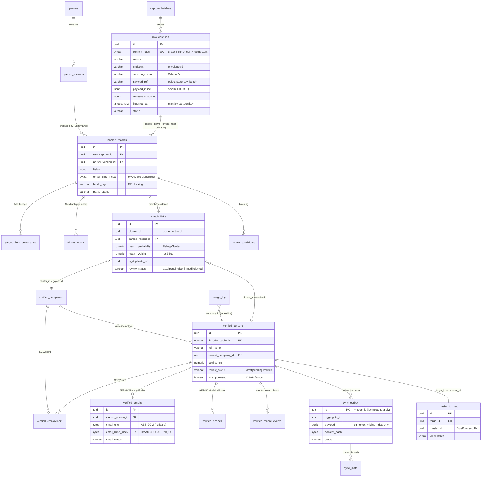

# 05 — Database Design (the Forge ops / staging DB)

> **Canonical contract:** this doc is the authoritative schema for **TruePoint Forge's** Postgres
> ops DB — the physical realization of the four-layer medallion
> `raw_captures → parsed_records → verified_records → (sync) → TruePoint master graph`
> (`decision-ledger` L2). It is a **`@forge/db`** package of **hand-authored Drizzle migrations**
> (`generate` is unsafe here, `decision-ledger` L7). The **`verified_records` layer (five
> `verified_*` tables) is a Forge-owned mirror of TruePoint's `master_*` graph** so the sync is a
> straight column map; it honors the **bytea AES-GCM ciphertext + HMAC blind-index** PII scheme
> verbatim (`ecosystem-facts §B`). Forge is **staff-only**, so its tables carry **no customer-tenant
> RLS**; isolation is structural (per-layer least-privilege roles) + capability-gated at the app
> (`ecosystem-facts §D`). **Locking ADR: ADR-0047** (Forge owns ER + versioned master-sync).

Layer names, the sync contract, and naming (`@forge/*`, `POST /api/v1/master-sync`, `TruePoint
Forge`) are frozen in `_context/decision-ledger.md`. Current-state TruePoint facts are owned by
`_context/ecosystem-facts.md` (cited by `§` anchor); industry best-practice by `[S#]` in
`_context/research-corpus.md`. This doc **owns the schema**; it does not restate the boundary model
(owned by `03-system-architecture`), the security enforcement design (owned by `14-security`), or the
scale/topology design (owned by `17-scalability`) — it links to the owner. The **sync target shape**
is `packages/db/src/schema/masterGraph.ts` (`ecosystem-facts §B`) and is cross-linked, never forked.

---

## Objectives

1. Define **every table** across the eleven schema groups, each with purpose, key columns
   (name · type · meaning), primary/unique/foreign keys, indexes, and its **idempotency/dedup key**.
2. Make the `verified_records` layer a **1:1 mirror** of TruePoint `master_*` (+ confidence + review
   lineage) so `POST /api/v1/master-sync` is a straight upsert, honoring the PII scheme (`§B`, L5).
3. Fix the **idempotency spine** (`content_hash` at ingest, `(raw_id, parser_version)` at parse, the
   outbox row-id at sync) and the **partition/retention** posture for the append-only raw layer.
4. Specify the **least-privilege role model** so no single role both reads raw PII and pushes to
   production [S121], mirroring TruePoint's `leadwolf_app`/`_er`/`_admin` analogues (`§D`).
5. Pin the **PII & encryption posture pre-sync** and the **hand-authored migration discipline**, and
   register the DB-level gaps (`G-FORGE-501…506`), risks, and open questions.

Non-goals: the boundary/service decomposition (`03`), envelope-v2 field detail (`decision-ledger`
L3 + the ingestion doc), the ER math (`@forge/core`, `01 §Entity resolution`), and the ADR texts
themselves (`docs/planning/decisions/ADR-0047`).

---

## Schema conventions (mirrors TruePoint's `packages/db`)

Forge's `@forge/db` follows TruePoint's `packages/db` idioms verbatim so migration discipline and
review transfer (`ecosystem-facts §D`, `masterGraph.ts:37-43`):

| Idiom | Rule |
|---|---|
| PK | `id uuid PRIMARY KEY DEFAULT uuid_generate_v7()` — time-ordered v7 ids (backward index scans give newest-first) |
| Enums | **varchar + `CHECK … IN (…)`**, never `pgEnum` (the folder convention; `masterGraph.ts:333-344`) |
| Timestamps | `timestamptz`, `created_at`/`updated_at` default `now()`; append-only tables omit `updated_at` (`masterGraph.ts:244`) |
| PII channel | `bytea` AES-GCM ciphertext (`*_enc`, nullable) + `bytea` HMAC blind index (`*_blind_index`, **globally UNIQUE**) (`§B`, `masterGraph.ts:227-253`) |
| Uniqueness | partial `uniqueIndex … WHERE col IS NOT NULL` for nullable natural keys (`masterGraph.ts:86-88`); `uniq_` name prefix |
| Cross-DB pointers | ids referencing TruePoint (tenant/workspace/master ids) are **plain `uuid`, NO FK** — audit pointers only (`importJobs.ts:54`) |
| Tenancy | **none** — Forge is staff-only; no `tenant_id`/`workspace_id` RLS factories (the deliberate inversion of Layer-1, mirroring `master_*` system-ownership, `masterGraph.ts:6-9`) |
| `citext` / `bytea` | local `customType` helpers (`masterGraph.ts:39-40`) |

Tables live one-per-file in `@forge/db/src/schema/*.ts`, exported through the package `index.ts`
(dependency-cruiser discipline, `decision-ledger` L8). The eleven groups below map onto the four
layers plus the cross-cutting jobs/review/sync/audit machinery.

---

## Group 1 — RAW layer (BRONZE): verbatim, immutable, idempotent

### `raw_captures`

**Purpose.** The bronze table: verbatim payloads (extension raw-API responses, bulk-import blobs,
provider raw JSON), **immutable/append-only**, the single source of truth all later layers rebuild
from [S81]. Large blobs live in the object store (pointer in row); small profile JSON MAY stay inline
JSONB — the Postgres JSONB TOAST cliff at ~2 kB makes this split mandatory [S82][S83] (`decision-ledger`
L7, OQ-4). Mirrors `source_records` (`§B`, `masterGraph.ts:288-310`) but carries envelope-v2's verbatim
`endpoint`/`schema_version`/gzip that `source_records` lacks (`decision-ledger` L3, `G-FORGE-102`).

| Column | Type | Meaning |
|---|---|---|
| `id` | uuid PK | v7 |
| `batch_id` | uuid FK → `capture_batches.id` (nullable) | the ingest batch this capture arrived in |
| `source` | varchar(50) | connector id — `chrome_extension`/`admin_upload`/`enrichment`/`provider`/… (mirrors envelope `connectorId`, `§A`) |
| `endpoint` | varchar(255) | e.g. `voyager/identity/profiles` — envelope v2 (`decision-ledger` L3); null for non-API sources |
| `schema_version` | varchar(50) | source schema version the SDK claims (SchemaVer, [S43]) |
| `captured_by` | uuid | operator/extension principal (audit pointer, no FK) |
| `target_tenant_id` | uuid (nullable) | attribution: TruePoint tenant the capture is *for* (audit pointer, **not** an RLS key) |
| `target_workspace_id` | uuid (nullable) | attribution (audit pointer) |
| `content_hash` | bytea NOT NULL | `sha256(canonical(payload))` — **UNIQUE → idempotent ingest** (mirrors `§B`) |
| `consent_snapshot` | jsonb | consent context at capture (`basis`/`sourceUrl`/`capturedByUserId`/`capturedAt`); Art 14/DPDP grounding [S16][S118] (mirrors `source_records.lawful_basis_snapshot`) |
| `payload_ref` | varchar(1024) (nullable) | object-store key when the blob is large |
| `payload_inline` | jsonb (nullable) | verbatim payload inline when small (< TOAST threshold [S82]) |
| `byte_size` | bigint | payload size (routing + accounting) |
| `is_gzipped` | boolean | the object-store blob is gzip-compressed (envelope v2) |
| `content_type` | varchar(100) | MIME of the raw payload |
| `status` | varchar(20) | `landed`/`parsed`/`quarantined`/`superseded`/`erased` (only `status` mutates; body is immutable) |
| `ingested_at` | timestamptz NOT NULL | the **monthly range-partition key** (mirrors `source_records.ingested_at`, `§B`) |
| `created_at` | timestamptz | |

- **PK** `id`. **UNIQUE** `content_hash` (`uniq_raw_captures_content_hash`) — the ingest idempotency
  key. **FK** `batch_id → capture_batches`.
- **CHECK** `raw_captures_body_present`: exactly one of `payload_ref`/`payload_inline` is set.
- **CHECK** `status IN ('landed','parsed','quarantined','superseded','erased')`.
- **Indexes**: `(source, endpoint)` (parser routing), `(status)` partial `WHERE status='landed'`
  (the parse-worker scan), `(batch_id)`.
- **Idempotency/dedup key**: `content_hash` UNIQUE (a replayed capture is a no-op). The
  partition-conversion caveat (a partitioned table's UNIQUE must include `ingested_at`) is resolved by
  a companion dedup table — see **Partitioning & retention** below.

### `capture_batches`

**Purpose.** Groups the captures of one extension session / import upload; carries the ingest
state-machine counts. Mirrors `import_jobs` accounting (`§C`, `importJobs.ts:38-96`) for the
extension/streaming path.

| Column | Type | Meaning |
|---|---|---|
| `id` | uuid PK | v7 |
| `source` | varchar(50) | connector id |
| `captured_by` | uuid | operator/extension principal (audit pointer) |
| `target_tenant_id` / `target_workspace_id` | uuid (nullable) | attribution (audit pointers) |
| `idempotency_key` | varchar(255) | envelope-v2 `idempotencyKey` (`§A`) → submit dedup |
| `collected_at` | timestamptz | envelope `collectedAt` |
| `status` | varchar(30) | `received`/`landing`/`landed`/`partial`/`failed` |
| `captures_total` / `_landed` / `_duplicate` / `_rejected` | integer | counts (mirror `import_jobs.rows_*`) |
| `reject_histogram` | jsonb | non-PII `label→count` (mirror `import_jobs.reject_histogram:70`) |
| `av_scan_status` | varchar(20) | for uploaded blobs — `pending`/`clean`/`infected`/`skipped` (mirror `§C`) |
| `byte_size` | bigint | |
| `created_at` / `completed_at` | timestamptz | |

- **PK** `id`. **UNIQUE (partial)** `(source, idempotency_key) WHERE idempotency_key IS NOT NULL`
  (`uniq_capture_batches_idempotency`) — mirrors `import_jobs` submit idempotency (`importJobs.ts:80-82`).
- **Indexes**: `(status, id)`.
- **Idempotency/dedup key**: `(source, idempotency_key)`.

---

## Group 2 — PARSER registry: versioned parsers, SchemaVer, replay

### `parsers`

**Purpose.** The identity of a parser = a `(source, endpoint)` pair. One logical parser per raw
shape it consumes.

| Column | Type | Meaning |
|---|---|---|
| `id` | uuid PK | v7 |
| `source` | varchar(50) NOT NULL | connector id |
| `endpoint` | varchar(255) NOT NULL | e.g. `voyager/identity/profiles` |
| `name` | varchar(120) | human label |
| `entity_kind` | varchar(20) | `person`/`company`/`employment`/`mixed` (what it emits) |
| `description` | text | |
| `created_at` / `updated_at` | timestamptz | |

- **PK** `id`. **UNIQUE** `(source, endpoint)` (`uniq_parsers_source_endpoint`) — parser identity.
- **Idempotency/dedup key**: `(source, endpoint)`.

### `parser_versions`

**Purpose.** The **versioned** parser — the deploy/rollout unit. Carries the output data-contract
schema, golden-fixture ref, and SchemaVer status. `$supersedes` re-validates historical raw through a
corrected version [S43]; compatibility mode dictates rollout order [S24]; drift → quarantine, never
silently into silver [S45].

| Column | Type | Meaning |
|---|---|---|
| `id` | uuid PK | v7 |
| `parser_id` | uuid FK → `parsers.id` (cascade) | |
| `version` | varchar(20) | **SchemaVer** `MODEL-REVISION-ADDITION` (e.g. `2-1-0`, [S43]) |
| `status` | varchar(20) | `draft`/`active`/`deprecated`/`retired` (observe-only → block staged rollout [S45]) |
| `output_schema` | jsonb | JSON Schema of the normalized fields (the data contract [S66]) |
| `compatibility` | varchar(20) | `backward`/`forward`/`full`/`none` (Confluent modes [S24]) |
| `golden_fixture_ref` | varchar(1024) | object-store key of the characterization corpus pinning this version [S123] |
| `supersedes_version_id` | uuid FK → `parser_versions.id` (self, nullable) | the version this one re-validates on replay ($supersedes [S43]) |
| `published_by` | uuid | operator (audit pointer) |
| `published_at` / `deprecated_at` | timestamptz | |
| `created_at` | timestamptz | |

- **PK** `id`. **UNIQUE** `(parser_id, version)` — one row per `(parser, version)`.
- **UNIQUE (partial)** `(parser_id) WHERE status='active'` — at most one active version per parser
  (a clean, atomic cut-over; `masterGraph.ts:211-213` primary-slot idiom).
- **Idempotency/dedup key**: `(parser_id, version)`.

---

## Group 3 — PARSED layer (SILVER): normalized candidates + field provenance

### `parsed_records`

**Purpose.** Normalized candidate fields produced by a versioned parser reading **from** immutable
bronze [S81]. Parse errors are captured, **not fatal** (quarantine-not-reject [S67]). Channel PII is
represented as **blind indexes only** at silver (deterministic-match/blocking with no revealable
value, `§B`) — clear/ciphertext PII appears only in raw (encrypted blob) and the verified layer.

| Column | Type | Meaning |
|---|---|---|
| `id` | uuid PK | v7 |
| `raw_capture_id` | uuid FK → `raw_captures.id` (cascade) | erasure blast-radius fan-out (mirror `masterGraph.ts:162`) |
| `parser_version_id` | uuid FK → `parser_versions.id` | the version that produced this row |
| `entity_kind` | varchar(20) | `person`/`company`/`employment` |
| `fields` | jsonb | normalized non-PII candidate map (name, title, company, location, email_domain…) |
| `email_blind_index` | bytea (nullable) | HMAC(normalized email) for ER blocking/deterministic match — **no ciphertext at silver** (`§B`) |
| `phone_blind_index` | bytea (nullable) | HMAC(E.164) for blocking |
| `block_key` | varchar(255) | ER blocking key (surname prefix / name n-gram, [S39]) |
| `field_provenance` | jsonb | embedded field→source descriptor map (mirror `masterGraph.ts:80` C6 seam) |
| `parse_status` | varchar(20) | `parsed`/`partial`/`failed`/`quarantined` ([S45][S67]) |
| `parse_errors` | jsonb | structured non-fatal errors (`field→error`) [S67] |
| `parsed_at` / `created_at` | timestamptz | |

- **PK** `id`. **UNIQUE** `(raw_capture_id, parser_version_id)` (`uniq_parsed_records_raw_version`) —
  the **parse idempotency key** (`03 §dataflow`): replaying the same raw through the same version is
  a no-op.
- **FK** `raw_capture_id`, `parser_version_id`.
- **Indexes**: `(parser_version_id, parse_status)` (drift monitoring [S103]), `(email_blind_index)`
  partial `WHERE email_blind_index IS NOT NULL` (blocking), `(block_key)` (blocking), `(raw_capture_id)`.
- **Idempotency/dedup key**: `(raw_capture_id, parser_version_id)`.

### `parsed_field_provenance`

**Purpose.** The normalized, queryable field-level lineage graph behind the embedded
`field_provenance` map — the OpenLineage `ColumnLineage` analogue, carrying the `masking` PII flag
[S87] and where-provenance (which raw JSON path a value was copied from [S93]). Cross-linked to
**Group 11 — Audit** as the lineage substrate.

| Column | Type | Meaning |
|---|---|---|
| `id` | uuid PK | v7 |
| `parsed_record_id` | uuid FK → `parsed_records.id` (cascade) | |
| `field_path` | varchar(120) | the output field (e.g. `job_title`) |
| `source_field_path` | varchar(255) | the raw payload JSON path it came from (where-provenance [S93]) |
| `transformation` | varchar(20) | `identity`/`normalize`/`derive`/`ai_extract` (OpenLineage subtype [S87]) |
| `is_masking` | boolean | OpenLineage `masking` flag — field is PII-derived/obfuscated [S87] |
| `confidence` | numeric(4,3) (nullable) | per-field confidence when AI-extracted |
| `created_at` | timestamptz | |

- **PK** `id`. **UNIQUE** `(parsed_record_id, field_path)`. **Index** `(parsed_record_id)`.
- **Idempotency/dedup key**: `(parsed_record_id, field_path)`.

---

## Group 4 — AI extraction: grammar-constrained + grounded, metered

### `ai_extractions`

**Purpose.** One row per Anthropic extraction pass over a `parsed_record` — grammar-constrained
structured output [S47] + LangExtract-style char-offset **source grounding** so a checker can verify
each field against the raw payload [S48]. Confidence is **derived** (grounding match + validator
agreement + judge), never a model self-report [S49].

| Column | Type | Meaning |
|---|---|---|
| `id` | uuid PK | v7 |
| `parsed_record_id` | uuid FK → `parsed_records.id` (cascade) | |
| `model` | varchar(100) | Claude model id at call time (mirror `ai_requests.model`) |
| `task` | varchar(50) | e.g. `profile_extract` |
| `schema_version` | varchar(20) | extraction schema version — keep stable for the 24h grammar cache [S47] |
| `extracted_fields` | jsonb | the schema-valid structured output [S47] |
| `grounding` | jsonb | per-field char-offset spans into the raw payload [S48] |
| `confidence` | numeric(4,3) | derived confidence (not self-report) [S49] |
| `outcome` | varchar(30) | `success`/`refusal`/`truncated`/`repaired`/`failed` — refusal/`max_tokens` are the only structured-output failures [S47] |
| `used_repair` | boolean | needed a repair pass (mirror `ai_requests.used_repair:38`) |
| `input_tokens` / `output_tokens` | integer | cost attribution (mirror `ai_requests:40-42`) |
| `latency_ms` | integer | |
| `created_at` | timestamptz | |

- **PK** `id`. **FK** `parsed_record_id`. **Indexes** `(parsed_record_id)`, `(model, created_at)`.
- **Idempotency/dedup key**: **UNIQUE** `(parsed_record_id, task, schema_version)` — re-extracting the
  same record with the same task+schema is a no-op.

### `ai_requests` (metering — mirror `§C`)

**Purpose.** Forge's metered AI-request log — the mirror of TruePoint's `ai_requests`
(`aiRequests.ts:23-51`), staff-scoped (no tenant/workspace RLS; attribution instead), append-only.
FinOps input for the metered extraction spend (`truepoint-operations`).

| Column | Type | Meaning |
|---|---|---|
| `id` | uuid PK | v7 |
| `requested_by` | uuid | operator/worker principal (audit pointer) |
| `target_tenant_id` / `target_workspace_id` | uuid (nullable) | attribution (audit pointers) |
| `task` | varchar(50) | mirror `ai_requests.task` |
| `model` | varchar(100) | mirror |
| `outcome` | varchar(30) | mirror `aiRequestOutcome` |
| `used_repair` | boolean | mirror |
| `latency_ms` | integer | mirror |
| `input_tokens` / `output_tokens` | integer | mirror |
| `cost_micros` | bigint | metered cost (mirror `provider_calls.cost_micros`, `§C`) |
| `ai_extraction_id` | uuid (nullable) | the extraction it backed (audit pointer) |
| `created_at` | timestamptz | |

- **PK** `id`. **Indexes** `(created_at)`, `(model, created_at)` (mirror `aiRequests.ts:47-49`).
- **Idempotency/dedup key**: append-only metering; no dedup (an idempotency key MAY be carried by the
  caller if the extraction is retried).

---

## Group 5 — QUALITY: weighted validation rules + five-pillar trend

### `validation_rules` (mirror `validationRules.ts`)

**Purpose.** Staff-authored custom DQ rules read by the quality-gate stage — Forge's mirror of
TruePoint's `validation_rules` (`validationRules.ts:11-27`), extended with the **DAMA dimension**,
**tiered severity**, and a **weight** so the composite score is weighted (a join-key null ≫ a cosmetic
issue [S63]) rather than flat.

| Column | Type | Meaning |
|---|---|---|
| `id` | uuid PK | v7 |
| `name` | varchar(120) | mirror |
| `entity_kind` | varchar(20) | `person`/`company`/`employment` |
| `field` | varchar(60) | canonical field the rule checks (mirror) |
| `check_type` | varchar(30) | `required`/`email_format`/`regex`/`max_length`/`one_of`/`freshness`/`uniqueness` (mirror + contract rules [S66]) |
| `config` | jsonb | per-check config (mirror) |
| `dimension` | varchar(20) | DAMA: `accuracy`/`completeness`/`consistency`/`timeliness`/`validity`/`uniqueness` [S63] |
| `severity` | varchar(10) | `block`/`warn` — tiered enforcement [S66] |
| `weight` | integer | contribution to the weighted composite [S63] |
| `enabled` | boolean | mirror |
| `created_at` / `updated_at` | timestamptz | |

- **PK** `id`. **UNIQUE** `(name)`. **Index** `(entity_kind, field)` (mirror `validationRules.ts:25`).
- **Idempotency/dedup key**: `name` UNIQUE.

### `quality_snapshots` (mirror `dataQualitySnapshots.ts`)

**Purpose.** The per-surface DQ **trend** store — mirror of `data_quality_snapshots`
(`dataQualitySnapshots.ts:22-36`) — capturing the five-pillar observability rollup
(freshness/volume/schema/distribution/uniqueness [S64]) + the weighted DAMA composite over time. A
learned-baseline anomaly status with a **`training`** warm-up class for new tables [S65]; parser-drift
monitors are keyed to `parser_version_id` + the raw-response fingerprint [S103].

| Column | Type | Meaning |
|---|---|---|
| `id` | uuid PK | v7 |
| `scope` | varchar(30) | monitored surface: a layer name (`parsed_records`/`verified_persons`/…) or `parser_version:<id>` |
| `parser_version_id` | uuid (nullable) | set when scope is a parser version (drift monitor [S103]) |
| `metrics` | jsonb | pillar rollup + weighted composite (mirror `data_quality_snapshots.metrics`) |
| `anomaly_status` | varchar(20) | `healthy`/`unhealthy`/`training` (learned-baseline classes [S65]) |
| `captured_at` | timestamptz | |
| `created_at` | timestamptz | |

- **PK** `id`. **Index** `(scope, created_at)` (mirror `dataQualitySnapshots.ts:34`). Append-only.
- **Idempotency/dedup key**: **UNIQUE** `(scope, captured_at)` — one snapshot per window.

---

## Group 6 — ER / DEDUP / MERGE (Forge-owned): candidates, links, survivorship

### `match_candidates` (blocking output)

**Purpose.** The **blocking**-stage output — candidate pairs to score, cut to ~0.05–1% of the
cartesian product by UNION-ing multiple blocking keys [S39]. The block-size distribution over this
table is the diagnostic that gates a blocking model before production [S39].

| Column | Type | Meaning |
|---|---|---|
| `id` | uuid PK | v7 |
| `entity_kind` | varchar(20) | `person`/`company` |
| `block_key` | varchar(255) | the key that grouped the pair [S39] |
| `block_method` | varchar(30) | `surname_prefix`/`email_domain`/`phonetic`/`combined` (UNION of keys [S39]) |
| `left_parsed_id` | uuid | one side (parsed candidate) |
| `right_parsed_id` | uuid (nullable) | other side (parsed candidate) |
| `right_verified_id` | uuid (nullable) | set when matching a candidate against an **existing** golden entity (incremental re-resolution [S41]) |
| `score_status` | varchar(20) | `pending`/`scored`/`skipped` |
| `created_at` | timestamptz | |

- **PK** `id`. **Indexes** `(entity_kind, block_key)`, `(score_status)` partial `WHERE
  score_status='pending'`.
- **Idempotency/dedup key**: **UNIQUE** `(entity_kind, left_parsed_id, right_parsed_id, block_method)`
  — the same pair from the same block method dedups.

### `match_links` (cluster output — mirror `masterGraph.match_links` + review lineage)

**Purpose.** ER output; **`cluster_id` IS the golden entity id** (no separate cluster table — mirrors
`masterGraph.ts:312-348`). `match_probability` is the Fellegi-Sunter probability; `match_weight` is the
additive log2 bits-of-evidence, kept explicitly so a reviewer sees the auditable evidence waterfall
[S35][S42]. `is_duplicate_of` is the survivor link on merge (mirror `§B`). Forge grey-zone → `pending`;
approved → `confirmed`; the sync sets master `review_status='confirmed'` (`§B`).

| Column | Type | Meaning |
|---|---|---|
| `id` | uuid PK | v7 |
| `entity_kind` | varchar(20) | `person`/`company` (mirror `entity_type`) |
| `cluster_id` | uuid | **the Forge golden entity id** (`verified_persons`/`verified_companies.id`) — mirror `§B` |
| `parsed_record_id` | uuid FK → `parsed_records.id` (cascade) | the member evidence (mirror `source_record_id`) |
| `match_probability` | numeric(4,3) | Fellegi-Sunter probability [S35] |
| `match_weight` | numeric(6,3) | additive log2 bits-of-evidence (explainable [S42]) |
| `match_method` | varchar(20) | `deterministic`/`splink`/`manual` (mirror `§B`) |
| `is_duplicate_of` | uuid (nullable) | survivor link when two clusters merge (mirror) |
| `review_status` | varchar(20) | `auto`/`pending`/`confirmed`/`rejected` (mirror; default `auto`) |
| `reviewed_by` | uuid (nullable) | the checker (review lineage; audit pointer) |
| `reviewed_at` | timestamptz | |
| `resolved_at` | timestamptz | default `now()` (mirror) |

- **PK** `id`. **FK** `parsed_record_id`. **CHECK** `entity_kind IN ('person','company')`,
  `match_probability BETWEEN 0 AND 1`, `review_status IN ('auto','pending','confirmed','rejected')`
  (mirror `masterGraph.ts:333-344`).
- **Indexes**: `(entity_kind, cluster_id)` (mirror `idx_match_links_cluster`), `(review_status, id)`
  (the review queue).
- **Idempotency/dedup key**: **UNIQUE** `(parsed_record_id, cluster_id)` — a parsed record links to a
  cluster once.

### `merge_log` (survivorship decisions — reversible)

**Purpose.** The append-only, **reversible** record of every merge/survivorship decision — who/what/
when + the per-attribute BVT so unmerge/split is a manual steward action, not automatic [S29], and every
maker-checker merge is captured as an ER training label [S32]. An unmerge is a **new compensating row**,
never an update (event-sourced [S90]).

| Column | Type | Meaning |
|---|---|---|
| `id` | uuid PK | v7 (ordered) |
| `entity_kind` | varchar(20) | `person`/`company` |
| `surviving_cluster_id` | uuid | the golden entity that survived |
| `merged_cluster_id` | uuid | the cluster merged away (its `match_links.is_duplicate_of` → surviving) |
| `decision` | varchar(20) | `merge`/`unmerge`/`split`/`reassign` |
| `method` | varchar(20) | `auto`/`manual`/`ai` (who decided) |
| `match_weight` | numeric(6,3) | bits-of-evidence at decision (auditable [S42]) |
| `survivorship` | jsonb | per-attribute BVT: `field → {winning_source, rule}` (authority/recency/completeness [S27][S33]) |
| `decided_by` | uuid (nullable) | steward (audit pointer; null = auto) |
| `reason` | text | justification |
| `reverses_merge_id` | uuid FK → `merge_log.id` (self, nullable) | set when this reverses a prior merge (reversible [S29]) |
| `created_at` | timestamptz | |

- **PK** `id`. **Indexes** `(surviving_cluster_id)`, `(merged_cluster_id)`. Append-only.
- **Idempotency/dedup key**: append-only decision log; the applying worker dedups on a BullMQ stable
  `jobId` (the merge proposal id) [S75].

---

## Group 7 — VERIFIED layer (GOLD): Forge-owned mirrors of `master_*`

The `verified_records` layer (`decision-ledger` L2) is realized as **five tables that mirror
TruePoint's `master_*` graph column-for-column** (`masterGraph.ts`) **plus** golden-record `confidence`
and **review lineage** (`review_status`/`approved_by`/`approval_request_id`/`verified_at`). This 1:1
shape is what makes `POST /api/v1/master-sync` a straight upsert (the mapping table is in **How the
verified layer maps 1:1 onto `master_*`** below). Only `review_status='verified'` rows sync. All PII
honors the `bytea` AES-GCM + HMAC blind-index scheme verbatim (`§B`).

### `verified_companies` (mirror `master_companies`)

Mirrors `master_companies` (`masterGraph.ts:53-97`): `primary_domain citext`, `alt_domains citext[]`,
`name`, `name_normalized citext`, `linkedin_company_id`, `parent_company_id` (self-FK, no onDelete),
`industry`, `sub_industry`, `employee_count`, `employee_band`, `revenue_range`, `technographics jsonb`,
`hq_country`, `hq_city`, `region char(2)`, `jurisdiction char(2)`, `block_key`, `field_provenance jsonb`,
`prov_hwm`, `data_quality_score`. **Forge-added**: `confidence numeric(4,3)`, `review_status`
(`draft`/`pending`/`verified`), `approved_by uuid`, `approval_request_id uuid`, `verified_at timestamptz`.

- **PK** `id`. **UNIQUE (partial)** `primary_domain WHERE NOT NULL`, `linkedin_company_id WHERE NOT
  NULL` (mirror `masterGraph.ts:86-91`). **CHECK** `data_quality_score BETWEEN 0 AND 100`. **Index**
  `(review_status)` (the promotion queue).
- **Idempotency/dedup key**: `primary_domain` UNIQUE + `linkedin_company_id` UNIQUE (mirror
  `master_companies` dedup keys).

### `verified_persons` (mirror `master_persons`)

Mirrors `master_persons` (`masterGraph.ts:105-147`): `linkedin_public_id`, `full_name`, `first_name`,
`last_name`, `current_company_id` (FK → `verified_companies`), `job_title`, `seniority_level`,
`department`, `location_country`, `location_city`, `has_email`, `has_phone`, `data_quality_score`,
`is_suppressed` (DSAR fan-out mirror), `region`, `jurisdiction`, `block_key`, `field_provenance`,
`prov_hwm`. **Forge-added**: `confidence`, `review_status`, `approved_by`, `approval_request_id`,
`verified_at`.

- **PK** `id`. **UNIQUE (partial)** `linkedin_public_id WHERE NOT NULL`. **CHECK** seniority enum,
  `data_quality_score BETWEEN 0 AND 100`. **Indexes** `(current_company_id)` (mirror `companyIdx`),
  `(review_status)`.
- **Idempotency/dedup key**: `linkedin_public_id` UNIQUE + email/phone blind index (via
  `verified_emails`/`_phones`) — same as `master_persons`.

### `verified_employment` (mirror `master_employment`)

Mirrors the SCD2 stint edge `master_employment` (`masterGraph.ts:156-219`): `master_person_id` (FK →
`verified_persons`, cascade), `master_company_id` (FK → `verified_companies`, cascade), `title`,
`department`, `seniority_level`, `is_current`, `is_primary`, `started_on date DEFAULT '-infinity'`,
`ended_on`, `asserting_source`, `match_method`, `confidence`, `source_count`, `observed_at`,
`last_verified_at`, `field_provenance`, `prov_hwm`.

- **PK** `id`. **UNIQUE** `(master_person_id, master_company_id, started_on)` (`uniq_employment_stint`
  — unknown-start collides via the `-infinity` sentinel, mirror `masterGraph.ts:204-209`). **UNIQUE
  (partial)** `(master_person_id) WHERE is_primary` (at most one primary, mirror). **CHECK** ended ≥
  started, primary is current, confidence 0..1, seniority enum. **Indexes** partial `current`, partial
  `company` (mirror `masterGraph.ts:214-217`).
- **Idempotency/dedup key**: the stint UNIQUE.

### `verified_emails` (mirror `master_emails`) · `verified_phones` (mirror `master_phones`)

Mirror `master_emails`/`master_phones` (`masterGraph.ts:227-278`) verbatim — the PII scheme is the
whole point of the 1:1 mapping. Append-only channel rows (no `updated_at`, mirror `:244`).

| `verified_emails` column | Type | Meaning |
|---|---|---|
| `id` | uuid PK | v7 |
| `master_person_id` | uuid FK → `verified_persons.id` (cascade) | DSAR blast radius |
| `email_enc` | bytea (nullable) | AES-GCM ciphertext; decrypted only on the paid-reveal path (`§B`) |
| `email_blind_index` | bytea NOT NULL | HMAC — **GLOBALLY UNIQUE** dedup + DSAR/suppression key |
| `email_domain` | citext | |
| `email_status` | varchar(20) | `unverified`/`valid`/`risky`/`invalid`/`catch_all`/`unknown` (CHECK, mirror) |
| `source_count` | integer | corroboration (survivorship input) |
| `last_verified_at` | timestamptz | |
| `verification_source` | varchar(50) | |
| `is_primary` | boolean | |
| `created_at` | timestamptz | append-only |

- **PK** `id`. **UNIQUE** `email_blind_index` (mirror `uniq_master_emails_blind_index`). **CHECK**
  status enum. **Idempotency/dedup key**: `email_blind_index` UNIQUE.

`verified_phones` mirrors identically: `phone_enc bytea`, `phone_blind_index bytea NOT NULL UNIQUE`
(HMAC over E.164), `line_type`, `phone_status`, `source_count`, `last_verified_at`. **Idempotency/dedup
key**: `phone_blind_index` UNIQUE (mirror `masterGraph.ts:276`).

### `verified_record_events` (event-sourced record history)

**Purpose.** The append-only field-level change log behind the verified layer — the **event-sourced**
substrate [S90] giving replay/time-travel/rebuild and per-record versioning (`version` powers
supersede detection at sync). Corrections are compensating events, never destructive updates [S90]. The
per-attribute `winning_source` is data-fusion where-provenance [S92][S93]; `source_record_ref` asserts
`hadPrimarySource` [S89]. This is the **record-history/versioning approach**: event-sourced for field
history, while `verified_employment` retains the **SCD2** stint grain it inherits from `master_employment`.

| Column | Type | Meaning |
|---|---|---|
| `id` | uuid PK | v7 (ordered) |
| `entity_kind` | varchar(20) | `person`/`company`/`employment`/`email`/`phone` |
| `verified_id` | uuid | the golden record (audit pointer across the five tables) |
| `version` | integer | monotonic per-record version (supersede detection for sync) |
| `event_type` | varchar(30) | `created`/`field_changed`/`merged`/`unmerged`/`suppressed`/`verified` |
| `field_path` | varchar(120) (nullable) | for `field_changed` |
| `winning_source` | varchar(50) | the source that won this field (where-provenance [S92]) |
| `old_value_hash` / `new_value_hash` | bytea (nullable) | hashes — **no clear PII in the event log** |
| `source_record_ref` | uuid (nullable) | the parsed/raw provenance (`hadPrimarySource` [S89]) |
| `decided_by` | uuid (nullable) | actor (audit pointer) |
| `created_at` | timestamptz | |

- **PK** `id`. **Index** `(entity_kind, verified_id, version)`. Append-only.
- **Idempotency/dedup key**: **UNIQUE** `(entity_kind, verified_id, version)` — one event per record
  version.

---

## Group 8 — JOBS / PIPELINE

### `import_jobs` (+ `import_job_chunks`, `import_job_rows`) — reuse the shape from `§C`

**Purpose.** The control table for operator **bulk-blob imports** (CSV/JSON/provider blobs) into
`raw_captures`. Forge **reuses TruePoint's `import_jobs` trio near-verbatim** (`importJobs.ts`,
`§C`) — the same COPY → UNLOGGED staging, `column_mapping`, `conflict_policy`, `byte_offset` resume,
`reject_histogram`, `av_scan_status`, `idempotency_key`, and the `rows_in = created + matched +
duplicate + skipped + rejected + deduped + unprocessed` accounting (`importJobs.ts:59-66`,
Bulk-API-2.0 state machine, ADR-0036). The **only** deltas: drop the `tenant_id`/`workspace_id`
NOT-NULL RLS factories (Forge is staff-only) and add `target_tenant_id`/`target_workspace_id`
attribution audit pointers. The deep column list is **owned by `importJobs.ts`** — not restated here.

- **PK** `id`. **UNIQUE (partial)** `(idempotency_key) WHERE NOT NULL` (mirror `importJobs.ts:80-82`).
  **Index** `(status)`. **Idempotency/dedup key**: `idempotency_key`. `import_job_chunks` dedups on
  `(job_id, chunk_index)`; `import_job_rows` is the high-volume per-row ledger (monthly-partition
  target, mirror `importJobs.ts:126-128`).

### `pipeline_runs`

**Purpose.** One row per pipeline advancement run — the OpenLineage **Run** analogue [S87] the
lineage/reconciliation traversal keys off. Carries the DAG stage, input/output layer, the accounting,
and the W3C trace id for cross-worker continuity [S97].

| Column | Type | Meaning |
|---|---|---|
| `id` | uuid PK | v7 |
| `stage` | varchar(20) | `parse`/`extract`/`resolve`/`verify`/`quality`/`sync`/`maintenance` (`decision-ledger` L8) |
| `trigger` | varchar(20) | `ingest`/`replay`/`manual`/`scheduled`/`reconciliation` |
| `parser_version_id` | uuid (nullable) | for parse/extract replays [S43] |
| `batch_id` | uuid (nullable) | scoped capture batch (audit pointer) |
| `input_layer` / `output_layer` | varchar(30) | e.g. `raw_captures` → `parsed_records` |
| `status` | varchar(20) | `running`/`completed`/`failed` (OpenLineage START/COMPLETE/FAIL [S87]) |
| `records_in` / `_out` / `_quarantined` / `_errored` | integer | accounting [S77] |
| `trace_id` | varchar(64) | W3C `traceparent` [S97] |
| `started_at` / `finished_at` / `created_at` | timestamptz | |

- **PK** `id`. **Indexes** `(stage, created_at)`, `(status)`.
- **Idempotency/dedup key**: idempotent via the BullMQ stable `jobId` (a run is not re-created for a
  retried job); replays carry a distinct `trigger='replay'` run.

### `background_jobs`

**Purpose.** The durable status mirror of async worker jobs + the **DLQ/parking** record (BullMQ has
no native DLQ, so it is hand-built [S74]); **PII-free** (mirror `deadLetter.ts`, `§C`). Retry-exhaustion
here is the paging signal, not first-failure [S102].

| Column | Type | Meaning |
|---|---|---|
| `id` | uuid PK | v7 |
| `queue` | varchar(50) | BullMQ queue name (`parse`/`extract`/…) |
| `job_id` | varchar(255) | BullMQ jobId — stable dedup [S75] |
| `dedup_key` | varchar(255) | idempotency key (raw-payload hash as jobId [S75]) |
| `status` | varchar(20) | `queued`/`active`/`completed`/`failed`/`dead_letter` (DLQ terminal [S72][S74]) |
| `attempts` / `max_attempts` | integer | retry accounting [S73] |
| `last_error` | text | **PII-free** error (mirror `§C`) |
| `trace_id` | varchar(64) | |
| `failed_at` / `created_at` / `updated_at` | timestamptz | |

- **PK** `id`. **UNIQUE** `(queue, job_id)` (mirror stable-jobId dedup, `§C`). **Index** `(queue,
  status)`.
- **Idempotency/dedup key**: `(queue, job_id)`.

---

## Group 9 — REVIEW / APPROVAL: maker-checker

### `review_tasks` (queue, priority, assignee, SLA)

**Purpose.** The maker-checker review queue for grey-zone ER pairs, low-confidence AI extractions, and
DQ-flagged records. **Ranked by confidence/disagreement, not FIFO** [S54]; SLA-tracked; supports an
adjudication tier via `escalated` [S55] and gold-standard **honeypots** for reviewer scoring [S56].

| Column | Type | Meaning |
|---|---|---|
| `id` | uuid PK | v7 |
| `task_type` | varchar(30) | `er_grey_zone`/`ai_low_confidence`/`dq_flag`/`merge_review`/`manual` |
| `entity_kind` | varchar(20) | `person`/`company`/`employment` |
| `subject_ref` | jsonb | pointers to the record(s) under review (`parsed_record_id`/`match_link_id`/`cluster_id`) |
| `subject_hash` | bytea | hash of `subject_ref` (the open-task dedup key) |
| `priority` | integer | queue ordering — lower confidence = higher priority [S54] |
| `confidence` | numeric(4,3) | the model/ER confidence driving the rank [S54] |
| `status` | varchar(20) | `open`/`claimed`/`resolved`/`escalated` (adjudication tier [S55]) |
| `assignee_user_id` | uuid (nullable) | claimed by (audit pointer) |
| `claimed_at` | timestamptz | |
| `sla_due_at` | timestamptz | review SLA deadline |
| `resolution` | varchar(20) (nullable) | `approved`/`rejected`/`merged`/`escalated` |
| `resolved_by` | uuid / `resolved_at` timestamptz | |
| `is_honeypot` | boolean | gold-standard task for reviewer scoring [S56] |
| `created_at` | timestamptz | |

- **PK** `id`. **Indexes** `(status, priority)` (the ranked queue read [S54]), `(assignee_user_id,
  status)`, `(sla_due_at)` partial `WHERE status IN ('open','claimed')` (SLA-breach scan).
- **Idempotency/dedup key**: **UNIQUE (partial)** `(task_type, subject_hash) WHERE status IN
  ('open','claimed')` — one live task per subject.

### `approval_requests` (maker-checker — mirror `§C`)

**Purpose.** The maker-checker gate for **HIGH-RISK operations** (bulk verify-promote, bulk merge,
retention-enforce flip, bulk export, bulk sync-replay) — Forge's mirror of TruePoint's
`approval_requests` (`platformOps.ts:203-224`). **Pending → execute-on-approval** [S57]; the approve
action is server-enforced `requested_by_user_id != decided_by_user_id` (maker ≠ checker) [S57][S115],
gated by `data:review`. MUTABLE (no append-only trigger); the immutable trail is `forge_audit_log`
(mirror `platformOps.ts:198-202`).

| Column | Type | Meaning |
|---|---|---|
| `id` | uuid PK | v7 |
| `operation` | text | closed op-class vocabulary (mirror) |
| `params` | jsonb | op parameters, validated at execute time (mirror) |
| `target_tenant_id` | uuid (nullable) | reference (null = platform-wide), **not** an RLS key (mirror) |
| `requested_by_user_id` | uuid | the **MAKER** (mirror) |
| `request_reason` | text | justification (audited, mirror) |
| `status` | text | `pending`/`approved`/`rejected`/`executed`/`expired` (mirror) |
| `decided_by_user_id` | uuid (nullable) | the **CHECKER**, server-enforced ≠ maker (mirror) |
| `decision_reason` | text / `decided_at` timestamptz | mirror |
| `expires_at` | timestamptz | hard time-box (mirror) |
| `executed_at` / `created_at` | timestamptz | mirror |

- **PK** `id`. **Index** `(status, id)` (mirror `platformOps.ts:222`).
- **Idempotency/dedup key**: the caller MAY carry an operation idempotency key in `params`; otherwise
  a request is a distinct row (the maker owns de-duplication of intent).

---

## Group 10 — SYNC: state, id map, transactional outbox

### `sync_outbox` (transactional outbox)

**Purpose.** The **transactional outbox** — a row written in the **same tx** as the verified-record
promotion, drained by the sync relay via `FOR UPDATE SKIP LOCKED` (mirror `outboxRelay.ts` / ADR-0027,
`§C`) — killing the dual-write hazard [S20]. The relay is at-least-once, so the apply is idempotent
[S21]. The payload carries **ciphertext + blind index only** (the compliance firewall — no clear PII).

| Column | Type | Meaning |
|---|---|---|
| `id` | uuid PK | v7 — monotonic; **the event id** the apply dedups on [S21] |
| `aggregate_kind` | varchar(20) | `verified_person`/`verified_company`/`verified_employment`/`verified_email`/`verified_phone` |
| `aggregate_id` | uuid | the verified record id |
| `event_type` | varchar(30) | `verified.upserted`/`verified.superseded`/`verified.suppressed` (DSAR/erasure fan-out) |
| `payload` | jsonb | the sync envelope: `*_enc` ciphertext + blind index + non-PII fields + `content_hash` + `review_status='confirmed'` (`decision-ledger` L5) — **no clear PII** |
| `content_hash` | bytea | the upsert/idempotency key echoed for the apply [S21] |
| `status` | varchar(20) | `pending`/`dispatched`/`failed` |
| `attempts` | integer | |
| `available_at` | timestamptz | backoff/visibility timestamp |
| `dispatched_at` / `created_at` | timestamptz | |

- **PK** `id`. **Indexes** `(status, available_at)` partial `WHERE status='pending'` (the relay's
  `SKIP LOCKED` scan [S20]), `(aggregate_kind, aggregate_id)`.
- **Idempotency/dedup key**: the outbox **row id** is the event id (idempotent consumer [S21]); the
  apply also upserts on `content_hash` + master blind index.

### `sync_state` (per verified record)

**Purpose.** The per-verified-record sync-status ledger driving retry + reconciliation. States
`pending`/`synced`/`failed`/`superseded` (`decision-ledger` L2).

| Column | Type | Meaning |
|---|---|---|
| `id` | uuid PK | v7 |
| `entity_kind` | varchar(20) | `person`/`company`/`employment`/`email`/`phone` |
| `verified_id` | uuid | the Forge verified record (audit pointer across the five tables) |
| `content_hash` | bytea | the last-synced content hash (supersede detection) |
| `status` | varchar(20) | `pending`/`synced`/`failed`/`superseded` (`decision-ledger` L2) |
| `attempts` | integer | retry count |
| `last_error` | text | PII-free |
| `synced_version` | integer | the `verified_record_events.version` last synced (supersede) |
| `last_synced_at` / `reconciled_at` | timestamptz | last dispatch / last checksum match [S25] |
| `created_at` / `updated_at` | timestamptz | |

- **PK** `id`. **UNIQUE** `(entity_kind, verified_id)`. **Index** `(status)` partial `WHERE status IN
  ('pending','failed')` (the sync-worker scan).
- **Idempotency/dedup key**: `(entity_kind, verified_id)`.

### `master_id_map` (forge_id ↔ TruePoint master id)

**Purpose.** The bijective id map between Forge verified ids and TruePoint `master_*` ids — lets the
sync do idempotent upsert + supersede + the reconciliation data-diff join [S128].

| Column | Type | Meaning |
|---|---|---|
| `id` | uuid PK | v7 |
| `entity_kind` | varchar(20) | `person`/`company`/`employment`/`email`/`phone` |
| `forge_id` | uuid | the Forge verified record id |
| `master_id` | uuid | the TruePoint `master_*` id returned by `/master-sync` (audit pointer, no FK — cross-DB) |
| `content_hash` | bytea | the hash used at last upsert (supersede) |
| `blind_index` | bytea (nullable) | the channel blind index — the master upsert key for email/phone (`§B`) |
| `first_synced_at` / `last_synced_at` / `created_at` | timestamptz | |

- **PK** `id`. **UNIQUE** `(entity_kind, forge_id)`, **UNIQUE** `(entity_kind, master_id)` (bijection).
- **Idempotency/dedup key**: `(entity_kind, forge_id)`.

---

## Group 11 — AUDIT: immutable, tamper-evident, event-sourced

### `forge_audit_log` (immutable, append-only, hash-chained)

**Purpose.** The immutable audit-of-record for every Forge staff mutation + pipeline decision —
Forge's mirror of TruePoint's `platform_audit_log` (written in-tx by the `withForgeAdminTx`/
`recordForgeEvent` idiom, mirror `client.ts:121-178` / ADR-0032, `§C`). **Append-only alone is not
tamper-evident**, so rows are **hash-chained** and the chain root is **externally anchored** (Merkle
root [S91], `G-FORGE-504`). The `actor_kind` distinguishes AI-extractor vs human maker/checker (PROV
Agent [S89]).

| Column | Type | Meaning |
|---|---|---|
| `id` | uuid PK | v7 (time-ordered) |
| `actor_user_id` | uuid (nullable) | staff actor (audit pointer; null = system/worker) |
| `actor_kind` | varchar(20) | `operator`/`worker`/`system`/`ai` (PROV Agent [S89]) |
| `action` | varchar(60) | closed vocabulary (`capture.landed`, `parse.completed`, `merge.decided`, `review.approved`, `sync.dispatched`, `erasure.executed`, …) |
| `target_kind` / `target_id` | varchar(30) / uuid | what was acted on (audit pointer) |
| `detail` | jsonb | non-PII structured context (mirror `platform_audit_log`) |
| `prev_hash` | bytea | hash of the previous row (the chain link [S91]) |
| `row_hash` | bytea | `H(prev_hash ‖ canonical(row))` [S91] |
| `ip` | text | actor IP (mirror `impersonation_sessions.ip`) |
| `created_at` | timestamptz | |

- **PK** `id`. **Indexes** `(actor_user_id, created_at)`, `(action, created_at)`, `(target_kind,
  target_id)`. **Append-only** — enforced by an append-only trigger + `REVOKE UPDATE, DELETE` from
  every role except `forge_admin` (mirror `platform_audit_log` immutability, `§C`).
- **Idempotency/dedup key**: append-only; an optional event idempotency key in `detail` for retried
  writers.

**Record-history / versioning approach.** Two complementary mechanisms, both cited: **(1) event
sourcing** [S90] for the verified layer via `verified_record_events` (field history + version, replay/
rebuild, compensating events for corrections) — Group 7; **(2) SCD2** for the `verified_employment`
stint grain it inherits from `master_employment` (`-infinity` start sentinel, one primary/person,
`masterGraph.ts:149-219`). Field-level lineage across layers is `parsed_field_provenance` +
`field_provenance` maps (OpenLineage ColumnLineage [S87]); operational lineage is `pipeline_runs`
(OpenLineage Run [S87]). Adopting OpenLineage/Marquez vs hand-rolling is **OQ-R17**.

---

## Partitioning & retention

| Table | Partition | Rationale |
|---|---|---|
| `raw_captures` | **monthly RANGE by `ingested_at`** | mirrors `source_records.ingested_at` intent (`§B`); datetime-partitioning enables cheap batch reprocessing [S81] and per-month cold-tier/erasure |
| `parsed_records` | monthly RANGE by `created_at` | high-volume silver; drops old parses with their raw |
| `ai_requests` | monthly RANGE by `created_at` | metering volume (mirror `import_job_rows` intent, `importJobs.ts:126`) |
| `forge_audit_log` | monthly RANGE by `created_at` | audit volume; per-month Merkle anchoring |
| `background_jobs` | none (short-lived) | drained + truncated on a short TTL |

**MVP discipline.** Like `source_records`/`import_job_rows`, these ship as **plain tables** and are
**converted to partitioned when volume warrants** — the partitioning intent is declared, never silently
dropped (mirror `masterGraph.ts:285-287`, `importJobs.ts:7-9`).

**The partition + global-UNIQUE caveat (`G-FORGE-502`).** A partitioned table's UNIQUE/PK must include
the partition key, so `UNIQUE(content_hash)` cannot be global on a `raw_captures` partitioned by
`ingested_at`. At conversion, global ingest idempotency is preserved by a **companion
non-partitioned dedup table** `raw_capture_hashes(content_hash bytea PRIMARY KEY, capture_id uuid,
ingested_at timestamptz)` inserted in the same tx as the capture (or an advisory-lock dedup at the
ingest app). Until conversion, the plain-table `UNIQUE(content_hash)` is global as-is.

**Cold-tier & retention.** Raw payload blobs live in the object store; old detached partitions export
to **Iceberg-on-S3** with **tag-driven Glacier lifecycle** (delete-tagging → Glacier Instant Retrieval,
up to ~68% cheaper) [S84]; **snapshot expiration + compaction + orphan cleanup are mandatory** [S84].
Iceberg vs Delta (+ managed S3 Tables) is **OQ-R8**; object-store-large vs JSONB-small is **OQ-4**.

**Retention TTL on raw PII.** `raw_captures` carries a **short retention TTL** (a maintenance sweep
sets `status='erased'` and deletes the blob), because **GDPR Art 17 erasure must reach the raw layer**
[S117]; **tombstoning** ages raw PII out of immutable backups within the backup cycle [S117]. Per-source
retention is staff-authored (mirror `retention_policies`, `platformOps.ts:137-151`). **India-origin
data is highest-restriction** (DPDP §7, consent-or-nothing [S118]) and gets the shortest TTL. Field-
level decay TTL + re-verification cadence is **OQ-R14** [S6].

---

## DB roles & least-privilege (mirror `leadwolf_app`/`_er`/`_admin`, `§D`)

Forge is **staff-only**, so there is **no customer-tenant RLS** (the deliberate inversion, like
`master_*` system-ownership, `masterGraph.ts:6-9`). Isolation is **structural** — per-layer/per-function
role grants — plus **app-layer capability gating** (`data:*` caps, `§C`). This realizes the
least-privilege mandate that **no single role reads raw PII and writes production** [S121] and key-admin
SoD [S122]. Transaction scopes mirror `client.ts` (`§D`): `withIngestTx`, `withParserTx`, `withErTx`,
`withForgeAppTx`, `withSyncTx`, `withForgeAdminTx`.

| Role | Analogue (`§D`) | Grants | Must NOT |
|---|---|---|---|
| `forge_ingest` | (edge writer) | INSERT `raw_captures`, `capture_batches`; INSERT `background_jobs` | read `verified_*`; read `parsed_records` |
| `forge_parser` | `leadwolf_app`-like | SELECT `raw_captures`; INSERT/UPDATE `parsed_records`, `parsed_field_provenance`, `ai_extractions`, `ai_requests`, `quality_snapshots` | write `verified_*`; push to production |
| `forge_er` | `leadwolf_er` / `withErTx` | SELECT `parsed_records`; INSERT `match_candidates`, `match_links`, `merge_log`; INSERT/UPDATE `verified_*` (post-approval promotion) | INSERT `raw_captures`; dispatch sync |
| `forge_app` | dashboard BFF | SELECT across layers within capability; INSERT `review_tasks`/`approval_requests` decisions | **decrypt PII** (`*_enc`); write `verified_*` directly |
| `forge_sync` | (egress) | SELECT `verified_*` (**ciphertext + blind index only**), `sync_outbox`; INSERT/UPDATE `sync_state`, `master_id_map`; UPDATE `sync_outbox.status` | SELECT `raw_captures` (the [S121] separation) |
| `forge_admin` | `leadwolf_admin` / `withPrivilegedTx` | BYPASS-equivalent: migrations, DSAR/erasure, cross-layer; the sole holder of the **KMS decrypt** + HMAC-key grant; sole `UPDATE/DELETE` on `forge_audit_log` | — |

**The load-bearing invariant:** `forge_ingest` (writes raw) and `forge_sync` (pushes verified to
production) are **disjoint** — no role both reads raw PII and reaches the CRM (`G-FORGE-506`, enforced by
a CI grant test, mirror TruePoint's `ALL_RETRY_POLICIES`-style assertion, `§C`). Deep enforcement
(envelope encryption, per-tenant DEK/KEK, DSAR reaching raw) is owned by `14-security`.

---

## Idempotency & content_hash strategy

`content_hash = sha256(canonical(payload))` — canonicalization (stable key order, normalized
whitespace/encoding) so semantically-equal payloads hash equal (mirror `import/contentHash.ts`, `§C`).
It is the ingest dedup key and echoes through to the master upsert (`§B`, `decision-ledger` L5). Every
stage is safe to retry because every mainstream queue is at-least-once → correctness is **idempotent
consumers** [S72], targeting **effectively-once** end-to-end [S21][S23].

| Stage | Table | Idempotency / dedup key |
|---|---|---|
| Batch submit | `capture_batches` | `(source, idempotency_key)` UNIQUE (mirror `import_jobs`) |
| Ingest (land raw) | `raw_captures` | **`content_hash` UNIQUE** (replay = no-op; mirror `source_records`) |
| Enqueue parse | `background_jobs` | `(queue, job_id)` UNIQUE; `job_id` = raw-payload hash [S75] |
| Parse | `parsed_records` | **`(raw_capture_id, parser_version_id)` UNIQUE** |
| AI extract | `ai_extractions` | `(parsed_record_id, task, schema_version)` UNIQUE |
| Blocking | `match_candidates` | `(entity_kind, left_parsed_id, right_parsed_id, block_method)` UNIQUE |
| Cluster link | `match_links` | `(parsed_record_id, cluster_id)` UNIQUE |
| Verified channel | `verified_emails`/`_phones` | `*_blind_index` UNIQUE (global) |
| Verified stint | `verified_employment` | `(person, company, started_on)` UNIQUE |
| Emit sync event | `sync_outbox` | outbox **row id** = event id (idempotent consumer [S21]) |
| Sync state | `sync_state` / `master_id_map` | `(entity_kind, verified_id)` UNIQUE |
| Master upsert (TruePoint) | `source_records`/`master_*` | `content_hash` UNIQUE + master blind index (`§B`) |

---

## PII & encryption posture pre-sync

The scheme is **honored verbatim so sync is a straight map** (`§B`, `decision-ledger` L5):

| Layer | PII posture |
|---|---|
| **raw_captures** (bronze) | verbatim payload contains clear PII → **encrypted at rest** (object-store SSE-KMS blobs; column-encrypted small inline JSONB), **short retention**, the **primary Art 17 erasure target** [S117][S122] |
| **parsed_records** (silver) | **no clear channel PII** — only `email_blind_index`/`phone_blind_index` (HMAC) for ER blocking (match-against mint with no revealable value, `§B`); low-sensitivity identity fields (name/title) in clear like `master_persons` |
| **verified_*** (gold) | channel PII as **`bytea` AES-GCM ciphertext (`*_enc`, nullable) + HMAC blind index (`*_blind_index`, GLOBALLY UNIQUE)** — exact mirror of `master_emails`/`master_phones` (`masterGraph.ts:227-278`) |
| **sync_outbox / the wire** | ciphertext + blind index **only**; clear PII **never crosses the firewall** (`decision-ledger` L5, `03 §firewall`) |

**Envelope encryption:** a per-source/per-record DEK wrapped by a KMS KEK, rotation, key-admin SoD
[S122]; the HMAC blind-index key and the AES-GCM DEK are Forge-held and reachable only by `forge_admin`
(`G-FORGE-503`). Decrypt is a **separate gated reveal path**, never granted to `forge_app`/`forge_sync`.
Deep design → `14-security`.

---

## Mermaid ER diagram of the core tables

---

## How the verified layer maps 1:1 onto TruePoint `master_*` at sync

The 1:1 shape (Group 7) makes `POST /api/v1/master-sync` a straight upsert; the Forge-added columns
(`confidence`, review lineage) are **dropped** at the boundary (they are Forge governance, not master
data), and `match_links.review_status` is set to **`confirmed`** because resolution already happened
upstream (`§B`, `decision-ledger` L5).

| Forge (gold) | → TruePoint (`masterGraph.ts`) | Upsert key at `/master-sync` |
|---|---|---|
| `verified_companies` | `master_companies` (`:53`) | `primary_domain` UNIQUE / `linkedin_company_id` UNIQUE |
| `verified_persons` | `master_persons` (`:105`) | `linkedin_public_id` UNIQUE / email·phone blind index |
| `verified_employment` | `master_employment` (`:156`) | `(person, company, started_on)` stint UNIQUE |
| `verified_emails` | `master_emails` (`:227`) | **`email_blind_index` UNIQUE** (global) |
| `verified_phones` | `master_phones` (`:258`) | **`phone_blind_index` UNIQUE** (global) |
| `match_links` (`confirmed`) | `match_links` (`:317`) + `source_records` (`:288`) | `source_records.content_hash` UNIQUE + `cluster_id` |
| `sync_state` / `master_id_map` | — (Forge-only bookkeeping) | `(entity_kind, verified_id)` |

TruePoint receives the upsert via a new **`forge_sync` connector** bound to a system principal
(client-credentials service JWT, `aud=truepoint-api`, `scope=master-sync`) — never a human/tenant
session (`decision-ledger` L5, ADR-0047). The apply is **effectively-once** (dedup on the outbox event
id + keyed upsert [S21][S72]); a periodic **reconciliation** data-diff on `master_id_map` catches drift
[S25][S128].

---

## Migration discipline

- **Hand-authored, numbered SQL** in `@forge/db/src/migrations/0000…` with a `meta/_journal.json`,
  exactly like TruePoint. **`drizzle-kit generate` is UNSAFE** (stale snapshots re-add existing tables)
  — Forge follows the same discipline (`§D`, `decision-ledger` L7).
- **Expand/contract, backward-compatible** migrations so canary two-version windows tolerate old + new
  workers mid-deploy [S113]; the `output_schema`/contract evolution stays additive-with-default
  (BACKWARD/FULL) [S24].
- **Partition conversion** (`raw_captures` plain → range-partitioned + the `raw_capture_hashes`
  companion) is a hand-authored data migration, not `generate`.
- **CI-verified**: the coordinator host has no Docker, so new-table/partition migrations are verified
  in CI (mirror the platform-admin recipe — memory), never applied blind locally.
- **Grant tests** assert the least-privilege matrix (the disjoint `forge_ingest`/`forge_sync` invariant)
  as a CI gate (`G-FORGE-506`).

---

## Risks & mitigations

New DB-level gaps use `G-FORGE-501…506` — this doc's disjoint gap-ID block, unique across the suite
(`decision-ledger` L9).

| Risk / gap | Area | L × I | Mitigation (cite) |
|---|---|---|---|
| **G-FORGE-501** — `@forge/db` (23 tables + roles + grants + hand-authored migrations) is net-new | platform / data | High × Med | scaffold in M-FORGE-A; mirror `packages/db` idioms so review transfers (`§D`) |
| **G-FORGE-502** — `raw_captures` partition breaks global `content_hash` UNIQUE | platform | Med × High | ship plain (global UNIQUE) at MVP; companion `raw_capture_hashes` dedup table at conversion |
| **G-FORGE-503** — Forge holds its own KMS DEK/KEK + HMAC blind-index key hierarchy | security | Med × High | envelope encryption + key-admin SoD [S122]; keys reachable only by `forge_admin`; decrypt is a gated reveal path |
| **G-FORGE-504** — hash-chained + externally-anchored `forge_audit_log` not built (append-only ≠ tamper-evident) | security / ops | Med × High | hash-chain each row; per-month Merkle root anchored externally [S91] (OQ-R17) |
| **G-FORGE-505** — event-sourced `verified_record_events` replay substrate has no TruePoint analog | data | Med × Med | build the append-only field-event log; replay/rebuild via `pipeline_runs` lineage [S90][S94] |
| **G-FORGE-506** — least-privilege grants + the no-raw-PII-and-production invariant need CI enforcement | security | Med × High | CI grant test asserting `forge_ingest`/`forge_sync` disjoint [S121] |
| JSONB TOAST cliff on large inline raw | platform | High × Med | object-store-large / JSONB-small; `byte_size`-routed at ingest [S82][S83] (OQ-4) |
| Golden over-merge (common names) in `match_links` | data | Med × High | TF adjustment + two thresholds + block-size diagnostic + explainable `match_weight` [S36][S38][S39][S42] |
| DSAR/erasure not satisfiable across layers | security | Med × High | blind-index subject index; `is_suppressed` fan-out; raw retention TTL + tombstoning [S117] |
| Dual-write inconsistency Forge ↔ CRM | platform | Med × High | `sync_outbox` in-tx + idempotent apply + reconciliation [S20][S21][S25] |

---

## Deliverables

1. The **full `@forge/db` schema** — 23 tables across eleven groups, each with columns, keys, indexes,
   and its idempotency/dedup key (this doc).
2. The **1:1 verified→`master_*` mapping table** and the PII scheme honored verbatim, so
   `POST /api/v1/master-sync` is a straight upsert (`§B`, `decision-ledger` L5).
3. The **idempotency spine** (content_hash · parse key · outbox event id) and the **partition/retention**
   posture (monthly `raw_captures`, cold-tier Iceberg, raw-PII TTL) with the global-UNIQUE caveat +
   companion-table resolution.
4. The **least-privilege role matrix** (`forge_ingest`/`_parser`/`_er`/`_app`/`_sync`/`_admin`) with the
   disjoint raw-PII/production invariant, mirroring `§D`.
5. The **PII & encryption posture pre-sync** and the **hand-authored migration discipline**, handing
   deep enforcement to `14-security` and scale/topology to `17-scalability`.
6. The **gap register `G-FORGE-501…506`** mapped to responsibility areas.

---

## Success criteria

1. **Replay is a no-op at every stage** — `content_hash`, `(raw_id, parser_version)`, `*_blind_index`,
   and the outbox event id each enforce idempotency; a re-ingested capture / re-parsed raw / re-synced
   record changes nothing [S21][S72].
2. **The verified layer maps 1:1 onto `master_*`** — a data-diff between `verified_*` and `master_*`
   (excluding Forge-only governance columns) differs only where a sync is genuinely pending [S128].
3. **The PII scheme is byte-identical to `master_*`** — `*_enc` AES-GCM + `*_blind_index` HMAC (global
   UNIQUE); clear PII exists only in the encrypted raw blob and is the primary erasure target (`§B`,
   [S117]).
4. **No role both reads raw PII and reaches production** — the CI grant test proves `forge_ingest` and
   `forge_sync` are disjoint [S121].
5. **The raw layer is immutable, partitionable, and retention-bounded** — `raw_captures` is append-only
   with a declared monthly partition + short PII TTL + tombstoning [S81][S117].
6. **No schema decision is answered from first principles where a `§`/`[S#]` grounds it** — every mirror
   cites `masterGraph.ts`/`importJobs.ts`/`aiRequests.ts`/etc., every best-practice cites `[S#]`
   (CLAUDE.md mandatory-read rule).

---

## Open questions

The full register lives in `_context/decision-ledger.md` (L11, OQ-1…6) and `01`'s research register
(OQ-R1…20); the schema-shaping ones surface here.

- **OQ-4 / OQ-R8 — Raw-blob substrate + table format.** Object-store-large vs JSONB-small (default
  object-store-large); Iceberg vs Delta (+ managed S3 Tables) for the cold-tier raw partitions.
  **G-FORGE-502.** [S82][S86][S84]
- **OQ-R14 — Field-level decay TTL + re-verification policy** on `verified_*` (rapid for title/company,
  slow for stable fields) — drives the `last_verified_at` sweep, not permanent trust. [S6][S26]
- **OQ-R12 — ER match-weight thresholds** (auto-merge / grey-zone / auto-reject bands on
  `match_links.match_probability`) need calibration on Forge data, gated by the block-size diagnostic
  over `match_candidates`. [S38][S39]
- **OQ-R17 — Lineage store + tamper-evidence.** Adopt OpenLineage/Marquez for `pipeline_runs` +
  `parsed_field_provenance` vs hand-roll; the external Merkle-anchoring mechanism for `forge_audit_log`.
  **G-FORGE-504.** [S87][S88][S91]
- **OQ-R10 — Weak-supervision auto-verify vs human-review-every-record** — whether high-agreement
  clusters skip `review_tasks` (auto-promote to `verified`) or every promotion is maker-checker gated.
  Shapes how `review_tasks`/`approval_requests` throttle the verify stage. [S62]
- **New (this doc) — `verified_employment` write model vs the master SCD2 edge.** Forge computes stints
  from `match_links`; whether the `-infinity` unknown-start dedup collision behaves identically once
  Forge (not the master) is the resolver needs a golden-fixture check before the first sync
  (`masterGraph.ts:149-219`).
- **New (this doc) — Partition-conversion timing.** When `raw_captures`/`parsed_records`/`ai_requests`
  cross the volume threshold that warrants converting from plain to range-partitioned (mirror
  `source_records`'s deferred conversion, `§B`).
- **OQ-1 — `@forge/*` / Atlassian Forge name collision** (chosen deliberately; `decision-ledger` L1).
