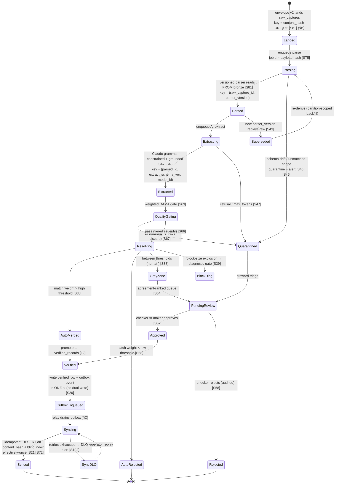
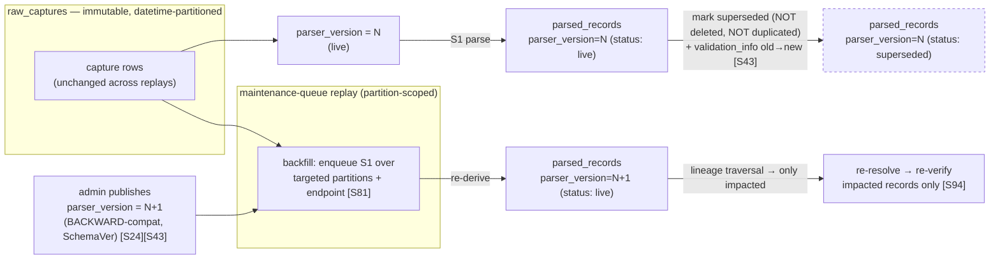
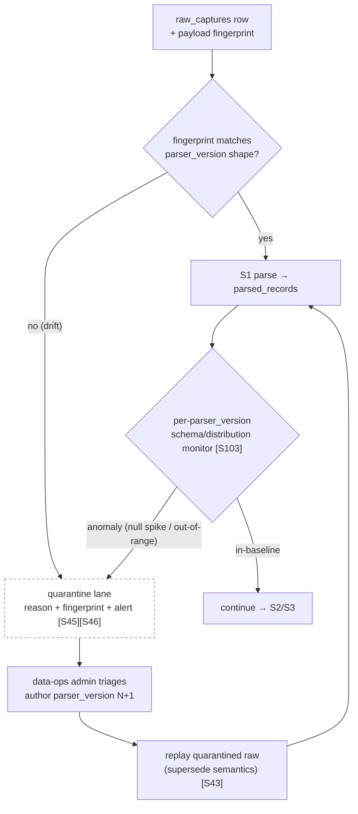

# 06 — Data Pipeline Architecture

> **Canonical contract:** the TruePoint Forge pipeline advances every record through a fixed,
> append-only sequence of stages —
> **`raw_captures → parse → AI-extract → quality-validate → resolve/dedup/merge → human review & approve
> → verified_records → (outbox) → sync_state → synced`** — where **each stage is an idempotent,
> retryable, individually-quarantinable transform** that reads from the immutable layer before it and
> never mutates its input. Every layer is a **replayable projection**: a new `parser_version` re-derives
> `parsed_records` and everything downstream from unchanged `raw_captures`, **superseding** prior outputs
> rather than duplicating them. The pipeline is **effectively-once** (every queue is at-least-once; the
> illusion of exactly-once is built from `content_hash`, stable job ids, and dedup-on-apply), and the only
> egress is the `verified_records → POST /api/v1/master-sync` handoff via a **transactional outbox**.
> **Locking ADR: ADR-0047** (Forge owns ER + versioned master-sync); the interception-primary capture that
> feeds the bronze layer is **ADR-0046**.

This doc owns the **stage-level engineering contract** of the pipeline — the input/output, idempotency
key, retry posture, and quarantine behavior of each hop, plus versioned replay, drift detection,
dead-letter handling, ordering/backpressure, and per-stage SLOs. It does **not** restate the high-level
dataflow or service boundaries (owned by `03-system-architecture §End-to-end dataflow`), the
table/column definitions (owned by `05-database-design`), the queue/retry/DLQ mechanics (owned by
`12-worker-orchestration`), the sync wire contract (owned by `11-sync-contract`), the quality-rule
catalog (owned by `05-database-design §Group 5` + this doc's `§Data-quality gates`), or the
observability/lineage stores (owned by `15 — observability & lineage`). Current-state TruePoint facts cite `_context/ecosystem-facts.md` by `§`
anchor; industry best-practice claims cite `[S#]` in `_context/research-corpus.md`; frozen vocabulary is
`_context/decision-ledger.md` (L1–L11).

---

## Objectives

1. Turn the named pipeline stages (the worker DAG `parse · extract · resolve · verify · quality · sync ·
   maintenance`, `04-monorepo-structure §Repository layout`) into a **per-stage contract** precise enough
   to build from: what each stage consumes, what it emits, the key that makes it safe to retry, and what
   happens when it fails.
2. Specify **versioned parsing & replay** — how publishing a new `parser_version` triggers a
   partition-scoped backfill of historical `raw_captures`, and how re-derived outputs are **superseded,
   never duplicated** (the `$supersedes` analogue [S43]).
3. Make **schema-drift detection** a first-class stage behavior: fingerprint raw shapes, route the
   unexpected to a **quarantine lane with alerting**, never silently into the clean layer [S45] [S46].
4. State the **cross-stage idempotency model** honestly — every queue is at-least-once, so
   "exactly-once" is an illusion assembled from `content_hash`, stable job ids, and dedup-on-apply; the
   real target is **effectively-once** [S72] [S21] [S23].
5. Define **dead-letter / poison-message** handling, **ordering / concurrency / backpressure**, the
   **verified → sync outbox handoff**, **inter-stage quality gates**, **per-stage freshness SLOs**, and
   the **lineage carried on every hop** — each deferring its deep design to the owning doc.
6. Register the pipeline-architecture gaps (`G-FORGE-601…607`), risks, milestones, deliverables, and open
   questions.

Non-goals: schema (owned by `05`), queue infrastructure and retry/backoff tables (owned by `12`), the
`/master-sync` request/response shape and reconciliation (owned by `11`), the DAMA rule/weight catalog
(owned by `05 §Group 5`), capacity math and autoscaling topology (owned by `17-scalability`), and the ADR texts
(owned by `docs/planning/decisions/ADR-0046`, `ADR-0047`).

---

## The end-to-end pipeline

The pipeline is best read as a **state machine over a single record** as it climbs the four layers. Each
transition is a worker stage; the label on each transition is the **idempotency key** that makes the hop
safe to retry (or the route condition). Terminal-ish states (`Quarantined`, `Rejected`, `Superseded`,
`SyncDLQ`) are not dead ends — they feed the maker-checker loop, the replay engine, or the alerting
plane. This is the record-centric view; the service-centric dataflow is owned by
`03 §End-to-end dataflow`, and the review-only state machine is `02 §J4`.

Three properties the diagram encodes, each expanded in its own section below:

- **Every stage is idempotent and reprocessable.** `content_hash` at ingest, `(raw_capture_id,
  parser_version)` at parse, `(parsed_id, extract_schema_ver, model_id)` at extract, and the
  dedup-event-id + keyed UPSERT at sync mean a re-run at any stage converges to the same state, never a
  duplicate.
- **Nothing is silently dropped.** Drift, refusal, and quality failures route to `Quarantined`
  (inspectable, feeds review); resolution's grey zone routes to `PendingReview`; a sync failure parks in
  `SyncDLQ` (replayable), never retries forever.
- **The graph is replayable.** `Superseded → Parsing` is the replay edge: a new `parser_version`
  re-derives `parsed_records` and everything above it from immutable `raw_captures` — no re-capture.

---

## Stage contracts

Each stage is a transform with a fixed contract. The **owner queue** column names the BullMQ queue from
the worker DAG (`04 §Repository layout`); the **retry/DLQ/concurrency mechanics themselves are owned by
`12-worker-orchestration`** — this table fixes only the per-stage *posture* (deterministic vs transient,
and what a terminal failure does). Idempotency keys are the load-bearing column: they are what let every
queue be at-least-once while the pipeline stays effectively-once (`§Cross-stage idempotency`).

| # | Stage | Input | Output | Idempotency key | Retry posture | Failure / quarantine | Owner queue (→ `12`) |
|---|---|---|---|---|---|---|---|
| **S0** | **Ingest / land** | envelope v2 record (`raw_payload`, `endpoint`, `schema_version`, `scope`, `content_hash`) | one immutable `raw_captures` row (+ object-store blob, pointer in row) | **`content_hash` UNIQUE** on `raw_captures` (mirrors `source_records.content_hash` §B) [S81] | **no server retry** — synchronous validate + land; client retries under `Idempotency-Key`; enqueue is idempotent (`jobId = payload hash` [S75]) | oversize/malformed → **reject at the boundary, never partial store** (`02 §FR-02`); replay of a seen `content_hash` → `202` no-op | `apps/api` capture route (edge, not a worker) |
| **S1** | **Parse (versioned)** | one `raw_captures` row (read-only) + the `parser_version` bound to its `endpoint`+`schema_version` | ≥1 `parsed_records` row, FK → `(raw_capture_id, parser_version)`, field-level provenance; parse errors captured, not fatal | **`(raw_capture_id, parser_version)`** — a re-run overwrites the same logical output (golden-file deterministic [S123]) | **deterministic** → bounded attempts for *transient* blob-read only; a parse *error* is not retried into oblivion | **schema drift / unmatched shape → `quarantine` lane + alert** [S45] [S46]; drift never enters the clean layer | `parse` |
| **S2** | **AI-extract** | one `parsed_records` row (fields insufficient for a deterministic parser) + versioned extraction schema | candidate fields + per-field **source-grounding offset** + confidence inputs | **`(parsed_id, extract_schema_ver, model_id)`** — dedup a prior extraction of the same triple | **transient** (network) → exponential + jitter; **tune `lockDuration`** so a long Claude call does not trip the stall detector [S73] | `refusal` / `max_tokens` → **quarantine** (deterministic, no infinite retry) [S47]; a well-typed hallucination is *not* a failure — it flows to S3+S5 [S47] | `extract` |
| **S3** | **Quality-validate (gate)** | candidate record (parsed and/or extracted) | pass/fail + a **weighted DAMA score** + observability metrics | **`(record_id, ruleset_version)`** | **deterministic** → no retry beyond transient DB | **fail → `quarantine`, NOT discard** [S67]; **tiered severity** (warn-and-alert vs hard-fail/block Tier-1) [S66] | `quality` (rules owned by `05 §Group 5`) |
| **S4** | **Resolve / dedup / merge (ER)** | quality-passed candidate + the blocking index + match-weight thresholds | a `match_links` cluster assignment + per-attribute survivorship into a golden candidate | cluster membership is idempotent on `match_links` (keyed on the pair/cluster); enqueue `jobId` on candidate id | **mostly deterministic** → transient retry only; **grey zone is a *route*, not a failure** [S38] | grey zone → `PendingReview`; **block-size explosion → block-size diagnostic gate** before production [S39] | `resolve` |
| **S5** | **Human review & approve (maker-checker)** | grey-zone / quarantined candidate + before/after diff + grounded spans | an approval decision (approve/reject) in an explicit **pending** state | `approval_request` id; the executor is **idempotent** (a replayed approval is a no-op) | **no machine retry** — human-driven; the *executor* is retry-safe | reject → audited terminal `Rejected`; **initiator ≠ approver, enforced in the write path** [S57] [S59] | `verify` + operator console (`10` owns UX) |
| **S6** | **Promote → `verified_records`** | an approved / auto-merged golden candidate | one `verified_records` row (encrypt channel PII as `bytea` AES-GCM + HMAC blind index) [§B] | golden-record id (cluster id) + `content_hash`; UPSERT-keyed | part of S5's tx — no independent retry | promotion **cannot** happen without an approving checker ≠ maker (S5) [S57] | `verify` |
| **S7** | **Enqueue sync (outbox)** | the `verified_records` write | one `worker_outbox` event row written **in the same tx** as S6 (no dual-write) [S20] | outbox event id (unique) | atomic with S6 — a crash rolls back both | if the tx fails, neither the verified row nor the event exists — no partial state [S20] | (outbox write; drained by `sync`) |
| **S8** | **Sync push** | a drained `worker_outbox` event (`FOR UPDATE SKIP LOCKED`, §C) | a `POST /api/v1/master-sync` call + a `sync_state` transition (`pending→synced/failed`) | **dedup-event-id table + keyed UPSERT** on `source_records.content_hash` + master blind index [S21] [S72] | **transient** → exponential + jitter; **DLQ on exhaustion** + alert [S102] | retries exhausted → `SyncDLQ` (operator-replayable), never forever; reconciliation catches silent drift [S25] | `sync` + `@forge/sync` (contract owned by `11`) |
| **M** | **Maintenance** | schedule/signal | replays (S1), reconciliation (S8), object-store compaction, decay re-verification | stable repeatable `jobId` (§C); leader-elected (`withLeaderLock`, §C) | idempotent, re-runnable | a failed sweep alerts; never corrupts a layer | `maintenance` (runbooks in `16`) |

Two contracts bind the table to shipped TruePoint code (schema detail → `05-database-design`):

- **Bronze idempotency mirrors `source_records.content_hash` UNIQUE** (§B) — a replayed capture at S0 is
  a structural no-op, not an application-level check that can be skipped.
- **The PII scheme is honored from S6 onward** — `verified_records` and the S8 push encrypt channel PII
  as `bytea` AES-GCM and compute the HMAC blind index *before* the master upsert; clear PII never crosses
  in a queryable column (§B, `decision-ledger` L5). Deep enforcement (per-layer DB roles, KMS envelope) is
  owned by `14-security`.

> **On stage ordering.** The canonical order above places `quality-validate` (S3) **before**
> `resolve/dedup/merge` (S4), matching this doc's brief and `02 §J4`. Quality is not a single stage,
> though — a **gate is interposed at every hop** (`§Data-quality gates between stages`), so the `quality`
> queue is exercised repeatedly, not once. This reconciles the DAG's flat queue list
> (`parse·extract·resolve·verify·quality·sync`, `04 §Repository layout`) with the record's actual state
> progression.

---

## Versioned parsing & replay

`raw_captures` is immutable and append-only, so a parser is never "re-run in place" — it is **re-run into
a new version's output**, and the old output is **superseded, not deleted and not duplicated**. This is
the closest industry analogue to Snowplow Iglu's `$supersedes`, which re-validates historical events
against a corrected schema and emits a `validation_info` provenance record naming the original vs
corrected version [S43].

**Versioning scheme.** Parsers carry a **SchemaVer** `MODEL-REVISION-ADDITION`, where the version number
*itself* encodes compatibility: `ADDITION` is compatible with all history, `REVISION` may break some,
`MODEL` cannot validate history [S43]. A new parser must be **BACKWARD-compatible** so it can roll out
ahead of any upstream change, and "breaking" is judged **relative to the consumer** — here the production
CRM's tolerance for the derived shape, not an absolute property of the schema [S24] [S43]. Publish is
gated by golden-file characterization + differential tests vs the prior version on the same raw fixtures
[S123] [S125] (owned by `18-testing`; the publish/replay *state machine* is `02 §J3`).

**Replay is a partition-scoped backfill, not a full-table rescan.** Because `raw_captures` is
datetime-partitioned (`02 §NFR-01` [S81]), a replay enqueues S1 jobs over only the partitions and
`endpoint` values the new `parser_version` targets, at `maintenance`-queue priority so live ingest is not
starved. Each re-derived `parsed_records` row is written **tagged with the new `parser_version`**; the
prior row is marked `superseded` (a status transition + a `validation_info` link recording
`parser_version` old→new), never physically duplicated into a second live row. Downstream, only
**impacted** records are re-resolved and re-verified — the lineage graph is traversed to find them, so a
parser fix rebuilds exactly what it touched, not the whole gold layer [S94].

**Why supersede rather than overwrite.** Overwriting `parsed_records` in place would (a) destroy the
audit trail of what the pipeline believed at sync time, breaking DSAR/lineage defensibility [S89], and
(b) violate the append-only/replayable-projection invariant that gives free time-travel and rebuild [S90].
Superseding keeps every version queryable, lets a bad `parser_version` be rolled back by re-promoting the
prior live version, and makes the "which parser produced this field" question answerable per record
(`02 §FR-11`).

**Rollout is not atomic.** Publishing a parser does not propagate fleet-wide instantly (Iglu caches
schemas ~10 min; Kafka-Streams-style transforms are BACKWARD-only) [S43] [S24], so Forge uses a staged
**observe-only → block** rollout with an explicit cache-invalidation step before a version becomes the
live producer (`02 §J3`; mechanism is **OQ-R16**). Until then, both versions coexist — which is exactly
the expand/contract, two-versions-live discipline the canary window forces [S113].

---

## Schema-drift detection & quarantine

Raw interception feeds bronze from a **private, undocumented upstream API** (Voyager JSON, ADR-0046), so
the shape *will* change without notice. The pipeline must detect the unexpected at S1 and **quarantine +
alert**, never let a drifting shape corrupt the clean layer — the Segment/Sentry-Relay pattern of routing
non-conforming events to a dedicated failed-events lane rather than silently accepting them [S45] [S46].

**Detection = raw-response fingerprint + per-`parser_version` schema/distribution monitors.** Each
`raw_captures` row carries a structural **fingerprint** of its `raw_payload` (the set/shape of keys at the
targeted `endpoint`). S1 compares the fingerprint against the shape its bound `parser_version` expects;
an unexpected shape (new required field, removed field, type change) is drift. In parallel, a
**per-`parser_version` schema + distribution monitor** on the parsed layer catches the softer failure —
the parser still runs but output distributions shift (null-rate spike, out-of-range values) — which a
private-API change plus a stale parser produces [S103]. This is the drift half of the two-layer quality
model (`§Data-quality gates`): declarative shape rules catch "known unknowns," learned baselines catch
"unknown unknowns" [S64].

**Quarantine behavior.** A drifted record is written to a **quarantine lane** (a distinct status/lane on
`raw_captures`/`parsed_records`, schema owned by `05`), tagged with the drift reason and fingerprint,
**with an alert** to the data-ops admin. Quarantine is *not* rejection: the raw row is preserved (bronze
is immutable regardless), and the record is replayable once a new `parser_version` handles the shape —
drift → quarantine → (author `parser_version` N+1) → replay → live. This is precisely the
`CreateQuarantineData` "segregate, don't discard" posture [S67], applied at the raw/parse boundary.

Alert tuning is a real hazard on high-variance interception ingest — a naive learned baseline will
over-alert. Alerts fire on **user-facing symptoms** (quarantine-rate spike, freshness breach, drift
blocking promotion), not every internal fluctuation (**OQ-R20**) [S101] [S100]. The monitor/store design
is owned by `15 — observability & lineage`; the drift-detection *build-vs-buy* question is **OQ-R9**.

---

## Cross-stage idempotency & exactly-once illusions

**There is no exactly-once.** Every mainstream Redis/broker queue — including BullMQ — is at-least-once:
the ack confirming a job finished can itself be lost, and BullMQ additionally re-adds a "stalled" job
(lock not renewed because the worker crashed or blocked the event loop) beyond `maxStalledCount`, which is
itself a source of duplicate execution [S72] [S73]. Across a heterogeneous boundary (Forge DB → CRM),
true exactly-once is unachievable; the honest target is **effectively-once = at-least-once delivery +
idempotent processing** [S23]. The pipeline achieves it with three layered mechanisms, one per class of
re-delivery:

| Where | Re-delivery cause | Idempotency mechanism | Grounding |
|---|---|---|---|
| **S0 land** | client resends under `Idempotency-Key`; duplicate capture | **`content_hash` UNIQUE** on `raw_captures` — the DB rejects the second insert; the API returns `202` no-op | [S81] (§B) |
| **Enqueue (S0→S1…)** | producer enqueues the same job twice | **stable `jobId` = raw-payload hash** — BullMQ ignores an add for a `jobId` already present [S75] | [S75] |
| **S1/S2 re-run** | worker crash mid-stage; stalled-job re-add | **deterministic keyed output** — `(raw_capture_id, parser_version)` / `(parsed_id, extract_schema_ver, model_id)` UPSERT to the *same* logical row, not a new one | [S123] |
| **S8 apply** | outbox relay publishes more than once (crash after publish, before recording success) | **dedup-event-id table + keyed UPSERT** on `source_records.content_hash` + master blind index, deduped in the **same tx** as the master write [S21] [S72] | [S21] [S23] |

The recipe is the industry-standard one: **combine the transactional outbox with a dedicated
idempotent-consumer event-id table, deduped in the same transaction as the business write** — this is
what converts an at-least-once stream into a single correct converged state [S21]. The producer boundary
uses the raw-payload hash as the `jobId` so an accidental double-enqueue is free [S75]; the consumer
boundary (the CRM's `forge_sync` connector, §A) dedupes on event id + content hash so an accidental
double-delivery is free [S21]. The one operational nail: **`lockDuration` must be tuned** so a long
Anthropic extraction (S2) does not exceed the stall threshold and get re-added mid-flight [S73].

Because content is keyed by hash end-to-end, a replay (`§Versioned parsing & replay`) is also
idempotent: re-deriving a record that already exists at a given version is a keyed UPSERT, and a re-sync
of an already-synced golden record is a no-op UPSERT — the same guarantee that makes reprocessing safe
makes replay safe.

---

## Dead-letter & poison-message handling

A **poison message** is one that fails deterministically no matter how many times it is retried — a
malformed payload, a schema the current parser cannot handle, a record that trips a code bug. Retrying it
forever burns a worker and blocks the queue; dropping it silently loses data. The resilient-pipeline
triad — **idempotent consumers + bounded retries with exponential backoff + a dead-letter terminal path**
— treats these as one pattern [S80].

**BullMQ has no native DLQ.** An exhausted job lands in the `failed` set, so Forge hand-builds the
parking-queue pattern: on final failure, move a **PII-free** descriptor of the payload to a dedicated DLQ
for inspection/replay, mirroring TruePoint's shipped `deadLetter.ts` (PII-free DLQ) [S74] (§C). The
practical starting policy is 3–5 attempts + exponential backoff before parking [S74]; the exact per-queue
policy is owned by `12-worker-orchestration` (`retryPolicies.ts`, asserted by `ALL_RETRY_POLICIES`, §C).

**Two distinct terminal lanes, deliberately kept separate:**

| Lane | For | Contains | Replay path |
|---|---|---|---|
| **Quarantine** | *data-shaped* failures at S1–S3 (drift, refusal, quality fail) | the record itself, in a lane on its layer table (bronze/silver immutable) | author a new `parser_version` / rule, then replay (`§Schema-drift`) |
| **DLQ (parking queue)** | *processing-shaped* failures (poison message, exhausted transient retries, unhandled throw) at any stage — notably S8 | a **PII-free** job descriptor + failure reason + attempt count [S74] (§C) | operator-triggered re-enqueue after the cause is fixed (`16` runbook) |

Alerting fires on **retry-exhaustion / DLQ arrival**, not on the first transient failure — paging on
every transient blip is alert fatigue, paging on a permanently-failed job is actionable [S102]. A DLQ is
also the backpressure/poison-isolation mechanism: diverting a bad message after the attempt limit protects
the queue's throughput for the healthy majority [S72].

Because BullMQ gives no cross-stage transaction, a **downstream reject must compensate upstream state**
(e.g. S5 reject un-stages an S4 auto-merge candidate) — the pipeline is a **saga**, not a linear
transaction, and the compensation is explicit rather than a stuck job [S77]. Whether that saga is
hand-built on BullMQ + `withLeaderLock` (§C) or delegated to a durable-execution engine (Temporal gives
exactly-once *workflow* orchestration + server-mediated single execution, removing the need for
hand-rolled locks) is **OQ-R5** [S76] [S77]; the saga *semantics* here are the contract regardless of
engine, and `12-worker-orchestration` owns the mechanism.

---

## Ordering, concurrency & backpressure

**Ordering.** The pipeline does **not** require global order — it requires **per-record layer order**
(a record cannot be verified before it is parsed). That is guaranteed structurally: each stage reads only
committed rows of the layer below and keys its output, so out-of-order or concurrent processing of
*different* records is safe, and re-processing of the *same* record converges (`§Cross-stage
idempotency`). This is why the whole graph parallelizes cleanly and why a slow S2 does not stall S1 for
other records.

**Concurrency via per-stage queues on homogeneous job profiles.** Parse, AI-extract, resolve, and sync
have wildly different durations (a parse is milliseconds; a Claude extraction is seconds; a sync push is a
network round-trip). Mixing them behind one queue makes queue-depth a meaningless scaling signal, so
Forge runs **one queue per stage** (`parse·extract·resolve·verify·quality·sync·maintenance`,
`04 §Repository layout`) and scales each independently on its own homogeneous profile [S105]. Per-stage
autoscaling uses a **load-based signal ≈ `(active + queued) / workers`**, not pure CPU (a silent failure
for a growing queue) and not pure depth (which lags latency-sensitive work) [S78] [S79]; the topology and
capacity math are owned by `17-scalability`.

**Backpressure — the ack path must never block on the DAG.** S0 returns `202` in `< 300 ms p95` and does
**not** wait for parse (`02 §NFR-03`); the durable `raw_captures` row + the parse enqueue *are* the
buffer. If a downstream stage backs up, work accumulates as queue depth (bounded, monitored), not as
latency on the capture ack — the same "normalize/land, then emit onto a durable queue rather than forward
synchronously" decoupling Sentry Relay uses [S46]. Backpressure controls, in order of engagement:

1. **Durable buffer.** Every stage's input is a committed layer row + a queued job; a downstream stall
   grows the queue, it does not drop captures.
2. **Per-stage autoscaling** absorbs sustained load (scale-to-zero when idle) [S104].
3. **Volume throttle at the edge** — the S0 capture path extends `checkCaptureRate` (2,000 records/min/
   caller, **fails open**, §A) so a runaway extension fleet cannot outrun the pipeline into unbounded
   backlog; it is an abuse throttle, not a correctness control.
4. **DLQ / poison isolation** keeps one bad message from consuming the throughput of the healthy stream
   (`§Dead-letter`) [S72].

The unbounded-backlog failure mode (a persistent producer > consumer imbalance) is a monitored,
alerting condition — a volume/freshness SLO breach (`§Per-stage SLOs`), triaged as a capacity or
poison-message problem, not silently absorbed. The bounded-queue + load-shedding policy at the edge is
**G-FORGE-607**.

---

## The verified → sync handoff via the transactional outbox

The only bytes that leave Forge are approved `verified_records`, and they leave through a **transactional
outbox** — the single mechanism that kills the dual-write hazard (write the DB, then separately POST the
CRM; a crash between the two leaves the systems permanently inconsistent) [S20]. S6 (promote) and S7
(enqueue) are **one local ACID transaction**: the `verified_records` row and the `worker_outbox` event
commit together or not at all, guaranteeing "the sync event exists iff the verified record was
committed," and preserving order [S20]. A separate relay then drains the outbox `FOR UPDATE SKIP LOCKED`
and drives the HTTP push — reusing TruePoint's shipped `outboxRelay.ts` / ADR-0027 pattern verbatim (§C).

The relay is **at-least-once by construction** (it may publish, then crash before recording success), so
the S8 apply is idempotent on the CRM side (`§Cross-stage idempotency`) [S20] [S21]. The push itself —
the versioned `POST /api/v1/master-sync` wire shape, the `X-Forge-Sync-Version` header, mTLS + scoped
service JWT, BACKWARD/FULL contract evolution, and the periodic reconciliation/checksum loop — is **owned
in full by `11-sync-contract`**; the end-to-end sequence is drawn in `02 §J5`. This doc's contract is
only that the handoff is **outbox-driven, in-tx, and effectively-once**, never an inline post-commit POST:

- **In-tx:** no `verified_records` write commits without its outbox row in the same transaction [S20].
- **Buffered, not event-bus-primary:** buffering the internal hop through the durable outbox/queue is
  explicitly **not** the rejected "event-bus-as-primary" design — it is the same internal relay TruePoint
  already runs (§C, `decision-ledger` L5) [S46].
- **Reconciled:** a `maintenance`-queue reconciliation/checksum job (per-key-range fingerprint diff)
  detects Forge↔CRM drift the sync stream might miss [S25] [S129] (owned by `11`).

The relay-transport choice — polling publisher vs Debezium WAL CDC — is **OQ-R4** (the no-Docker
coordinator host and the low-volume verified stream favor the simpler polling relay; correctness over
throughput) [S20] [S24].

---

## Data-quality gates between stages

Quality is **not** a single stage — it is a **gate interposed at every hop**, because the shift-left rule
is "validate at the boundary so bad data never becomes normal," not "clean it up downstream" [S68]. Each
gate is a checkpoint that can **pass, warn, or quarantine** the record before it advances. The gate
*rules and weights* are owned by `05 §Group 5` (validation-rule schema); the *monitoring/observability* of gate outcomes is
owned by `15 — observability & lineage`; this section fixes only **where** gates sit and **what a gate
does to the record's progression**.

| Gate position | Checks | On fail | Grounding |
|---|---|---|---|
| **after S0 (raw)** | envelope-v2 schema, size cap, scope trust boundary, `av_scan` (bulk) | reject at boundary (never partial store) | `02 §FR-01/02` [S68] |
| **after S1 (parsed)** | schema-drift fingerprint, required-field presence, per-`parser_version` distribution | **quarantine + alert** (drift lane) | [S45] [S103] |
| **after S2 (extracted)** | grounding coverage (every field maps to a raw offset), validator agreement, judge score | quarantine; low confidence → route to S5 | [S48] [S49] |
| **S3 promotion gate** | **weighted DAMA composite** (accuracy/completeness/consistency/timeliness/validity/uniqueness), where a join-key null ≫ a cosmetic issue | **tiered:** warn-and-alert vs hard-fail/block Tier-1; **below-threshold blocks the sync** | [S63] [S66] |
| **after S4 (resolved)** | uniqueness-across-field-combinations (dedup sanity), block-size diagnostic | grey zone → review; block explosion → diagnostic gate | [S66] [S39] |

Two invariants across all gates:

- **Quarantine, not reject.** A failing record is segregated into an inspectable lane that feeds the
  maker-checker loop, never silently discarded — `CreateQuarantineData` semantics [S67]. (Boundary
  *rejection* at S0 is the one exception: a malformed envelope never becomes a record at all.)
- **Weighted, tiered scoring.** A flat unweighted score is a poor promotion gate; the composite weights
  critical dimensions (a null in a match key) far above cosmetic ones, and enforcement is tiered by
  criticality [S63] [S66]. The below-threshold score at S3 is what **blocks the sync** (`02 §FR-07`), so
  the quality gate and the compliance firewall are the two things standing between a bad record and the
  production CRM.

The complementary second layer — ML-learned anomaly detection over the verified/production layer for the
drift no static rule anticipates — runs continuously alongside these gates (contracts prevent structural
breaks; observability catches distribution drift; run both) [S64] [S70]; it is owned by `15`.

---

## Per-stage SLOs (freshness / lag)

Pipeline health is a **data-plane** concern (is data fresh, complete, correct?) distinct from the
**system-plane** (are the services and queues up?) — the two are complementary and Forge runs both, per
layer [S96] [S64]. A **freshness SLO is a latency-percentile budget** ("95% of X reaches layer Y within
N") — the honest, measurable form of "the pipeline is keeping up" [S64]. Targets below are the *shape* and
starting posture; **capacity math, the N-values under peak load, and autoscaling thresholds are owned by
`17-scalability`**, and the numbers need Forge-data calibration before they are load-bearing.

| Stage hop | Freshness / lag SLO (shape) | Primary signal | Owner |
|---|---|---|---|
| **capture → landed (S0)** | ack **< 300 ms p95** (async; does not block on parse) | API latency histogram | `02 §NFR-03` |
| **landed → parsed (S1)** | 95% of captures reach `parsed_records` within N min | parse queue depth + wait time + p95 duration | `15` (SLO), `12` (queue) |
| **parsed → extracted (S2)** | 95% within N min (looser — bounded by Claude latency) | extract queue depth; `lockDuration` headroom | `15`, `09-ai-extraction` |
| **extracted → verified (S3–S6)** | grey-zone median review time tracked (human-bounded, not a hard SLO) | pending-review queue age | `10` |
| **verified → synced (S7–S8)** | sync freshness SLO ("95% of verified records synced within N min"); **not fire-and-forget** | outbox depth + push p95 + retry-exhaustion | `11`, `15` |
| **volume (all layers)** | row-count within a **learned per-table baseline** ("Training" warm-up for new tables); a drop from millions → thousands alerts | volume-anomaly monitor [S64] [S65] | `15` |

Alerting fires on **user-facing symptoms** — a freshness breach, backlog growth, missing/stale data,
DLQ arrival — not on every internal cause, to keep volume actionable on inherently high-variance
interception ingest [S101] [S100] (**OQ-R20**). Queue depth, wait time, and p95/p99 duration are
first-class SLO surfaces per stage, exported to Prometheus/Grafana from the shipped `/metrics` seam (§C)
[S101]. Cross-stage trace continuity — a single trace following a record across the parse→extract→
resolve→verify→sync fan-out — requires the producer to inject the W3C `traceparent` into the job payload
and use **span links** (not parent-child) for fan-out, because message queues break OTel's automatic
propagation [S97] [S98]; the observability wiring is owned by `15`.

---

## Lineage & provenance carried through the pipeline

Every hop **carries lineage as a first-class output**, so a verified field can be traced back to the exact
intercepted raw response that produced it, through the exact `parser_version`, extraction model, and human
approver in between. Lineage is not a side log — it is what makes replay-only-impacted (`§Versioned
parsing`), DSAR/erasure, and merge-explainability possible. The **lineage columns/tables live in `05` (the
schema owner); the lineage store, traversal API, and tamper-evidence are owned by `15 — observability &
lineage`** — this section fixes only *what each stage must emit*.

**Two complementary standards, per `01 §Audit & lineage`:**

- **OpenLineage column-lineage** — per output field, the `inputFields` it derived from + a
  `transformations` list carrying a **`masking` boolean** flagging PII-derived values; custom facets carry
  `parser_version`, extraction `model_id`, and the verifier identity without forking the spec, and lineage
  degrades gracefully (omitted when uncollectable) [S87].
- **W3C PROV** — `Entity` / `Activity` / `Agent`, where **`hadPrimarySource`** maps a verified field back
  to the intercepted raw response (the exact interception-primary provenance assertion), and distinct
  `Agent`s separate the **AI-extractor** from the **human maker/checker** [S89].

**What each stage emits:**

| Stage | Lineage emitted |
|---|---|
| S0 land | the `Entity` = `raw_captures` row; `hadPrimarySource` = the intercepted `endpoint` + `content_hash` [S89] |
| S1 parse | field-level `wasDerivedFrom` raw → parsed, tagged `parser_version`; `masking` flag on PII-derived fields [S87] |
| S2 extract | `Activity` = extraction run, `Agent` = model id + prompt/schema version; per-field **grounding offset** into the raw payload [S48] |
| S4 resolve | **where-provenance** — for each surviving attribute, *which source record's value won* (cell-granularity), recorded as the merge's bits-of-evidence trail [S93] [S92] [S42] |
| S5 verify | `Agent` = the human checker (≠ maker); the pending→approve decision + timestamp [S89] [S58] |
| S8 sync | the `sync_state` transition + the master id it mapped to (`master_id_map`) |

**Tamper-evidence.** Append-only is **not** tamper-evident on its own — the lineage/audit chain is
hash-chained or Merkle-tree'd with the **root externally anchored** somewhere hard to rewrite [S91]; the
anchoring mechanism is **OQ-R17**, and whether Forge adopts OpenLineage/Marquez or hand-rolls the store is
also **OQ-R17** [S87] [S88]. The field-winner selection at S4 is the **data-fusion / truth-discovery**
problem — weight source trustworthiness × value truthfulness, not naive majority vote — and recording it
is what makes a merge explainable and DSAR-defensible [S92] [S42].

---

## Risks & mitigations

Pipeline-architecture gaps use the disjoint block **`G-FORGE-601…607`** (unique across the suite,
`decision-ledger` L9). They map to
`28-enterprise-readiness-audit.md` where an existing TruePoint gap is relevant.

| Risk / gap | Area | L × I | Mitigation (cite) |
|---|---|---|---|
| **G-FORGE-601** — the DAG stages are *named* (`03`/`04`) but their **per-stage input/output/idempotency/retry/quarantine contract is unspecified** | data / platform | High × Med | this doc's `§Stage contracts` is the spec; `12` owns the retry/DLQ mechanics, `05` owns the schema |
| **G-FORGE-602** — **versioned replay/backfill with supersede-not-duplicate semantics is unbuilt**; no `validation_info` / superseded-status model | data | High × High | partition-scoped `maintenance` replay + supersede status + `validation_info` (`§Versioned parsing`) [S43]; schema in `05`, staged rollout OQ-R16 |
| **G-FORGE-603** — **no raw-shape fingerprint / drift detector**; quarantine lane + per-`parser_version` monitors unbuilt | data / operations | High × High | fingerprint at S1 + schema/distribution monitor + quarantine lane + alert (`§Schema-drift`) [S45] [S103]; store owned by `15` |
| **G-FORGE-604** — **cross-stage dedup-event-id + effectively-once apply not modeled** beyond ingest `content_hash` | platform | Med × High | dedup-event-id table + keyed UPSERT in the apply tx (`§Cross-stage idempotency`) [S21]; sync apply owned by `11` |
| **G-FORGE-605** — **saga / compensation semantics** for downstream-reject → upstream-compensate not defined (BullMQ has no native saga or cross-stage tx) | platform | Med × Med | explicit compensation, not stuck jobs (`§Dead-letter`) [S77]; engine (BullMQ vs Temporal) is OQ-R5 |
| **G-FORGE-606** — **per-stage freshness SLOs + lag metrics** not defined per layer | operations | Med × Med | SLO shapes in `§Per-stage SLOs` [S64]; N-values calibrated in `17`, wired in `15` |
| **G-FORGE-607** — **edge backpressure / bounded-queue + load-shedding** between the async ack and the DAG not specified | platform | Med × Med | durable buffer + per-stage autoscaling + `checkCaptureRate` edge throttle + DLQ isolation (`§Ordering`) [S79] [S46] [S72] |
| Stalled-job duplicate execution on long Claude calls (S2) | platform | Med × Med | tune `lockDuration` above extraction p99; idempotent keyed output makes a duplicate a no-op [S73] [S123] |
| Overwrite-in-place destroys audit trail / breaks replay | data | Low × High | **supersede, never overwrite**; append-only replayable projections [S90] [S89] (`§Versioned parsing`) |
| Drift silently corrupts the clean layer | data | Med × High | fingerprint + quarantine-not-accept; drift never enters `parsed_records` [S45] (`§Schema-drift`) |
| Dual-write inconsistency Forge-DB ↔ CRM | platform | Med × High | outbox in-tx + idempotent apply + reconciliation [S20] [S21] [S25] (`§Sync handoff`, owned by `11`) |
| Alert fatigue from high-variance interception ingest | operations | High × Low | alert on user-facing symptoms (freshness/backlog/DLQ), tune learned baselines [S101] [S100] (OQ-R20) |

---

## Milestones

Pipeline milestones slot into the M-FORGE build order from `03 §Milestones`; this doc owns the
stage-contract exit criteria at each phase.

| Milestone | Delivers (pipeline) | Exit criterion |
|---|---|---|
| **M-FORGE-A — Foundation** | S0 stage contract: envelope-v2 land → `raw_captures` (`content_hash` idempotent), object-store pointer, parse enqueue (`jobId` = payload hash) | a captured record lands an immutable row + blob; replay is a no-op; a job double-enqueue is ignored [S75] |
| **M-FORGE-B — Parse + replay** | S1 versioned parser stage; drift fingerprint → quarantine lane; **supersede-not-duplicate** replay of historical raw | a `parser_version` bump re-derives `parsed_records` and marks the prior version superseded (not duplicated) with `validation_info` [S43]; drift is quarantined, not accepted [S45] |
| **M-FORGE-C — Extract + resolve** | S2 grounded extraction stage (`lockDuration`-safe); S4 ER stage with grey-zone routing + block-size diagnostic | a well-typed hallucination still flows to DQ + review; grey-zone pairs route to `PendingReview`, not auto-merge [S38] [S47] |
| **M-FORGE-D — Quality + verify** | inter-stage quality gates (weighted DAMA, tiered severity, quarantine-not-discard); S5/S6 maker-checker promotion → `verified_records` | below-threshold blocks promotion; no record verifies without a checker ≠ maker [S57] [S63] |
| **M-FORGE-E — Sync egress** | S7 outbox-in-tx + S8 effectively-once apply; DLQ + reconciliation | a replayed sync is a no-op; no verified write commits without its outbox row in the same tx [S20] [S21] |
| **M-FORGE-F — Operate** | per-stage freshness SLOs, drift/volume monitors, cross-stage trace links, DLQ alerting | freshness + queue-health SLOs alarm on user-facing symptoms; a single trace follows a record across the fan-out [S98] [S101] |

---

## Deliverables

1. The **record-centric pipeline state machine** (`§The end-to-end pipeline`) with idempotency keys on
   every transition — the deeper counterpart to `03`'s service-centric dataflow.
2. The **stage-contract table** (S0–S8 + maintenance): input, output, idempotency key, retry posture,
   quarantine behavior, and owner queue for every hop — the primary build artifact of this doc.
3. The **versioned parsing & replay** model (supersede-not-duplicate, partition-scoped backfill,
   `validation_info`, staged rollout) with its Mermaid.
4. The **schema-drift detection & quarantine** design (fingerprint + per-`parser_version` monitors +
   quarantine lane) with its Mermaid.
5. The **effectively-once idempotency model** (the three-mechanism table), **DLQ / poison-message**
   handling (quarantine vs DLQ lanes), and **ordering / concurrency / backpressure** policy.
6. The **outbox handoff** contract (in-tx, buffered-not-event-bus, reconciled) and the **inter-stage
   quality-gate** map, each handing deep design to `11` and `05 §Group 5`/`15`.
7. The **per-stage freshness SLO** shapes and the **stage-by-stage lineage-emission** requirements, and
   the pipeline gap register `G-FORGE-601…607`.

---

## Success criteria

1. **Every stage has a written contract** — input, output, idempotency key, retry posture, and quarantine
   behavior — and no stage's behavior is left to first principles (`§Stage contracts`, CLAUDE.md
   mandatory-read rule).
2. **The pipeline is effectively-once end-to-end**: a replay at any stage converges without duplicating a
   row, guaranteed by `content_hash` (S0), keyed outputs (S1/S2), and dedup-event-id + keyed UPSERT (S8)
   [S72] [S21].
3. **Replay supersedes, never duplicates or overwrites**: a new `parser_version` re-derives from immutable
   `raw_captures`, marks the prior version superseded with `validation_info`, and re-runs only impacted
   downstream records via lineage traversal [S43] [S94].
4. **Nothing is silently dropped**: drift/refusal/quality-fail → quarantine (inspectable, replayable),
   poison/exhausted → PII-free DLQ (operator-replayable), grey zone → review — every non-happy path has a
   named lane [S45] [S67] [S74].
5. **The ack path never blocks on the DAG**: S0 acks `< 300 ms p95`; downstream stalls grow bounded,
   monitored queue depth, not capture latency, with backpressure engaging before unbounded backlog
   [S46] [S79].
6. **The only egress is outbox-driven and reconciled**: no `verified_records` write commits without its
   outbox row in the same tx, and a reconciliation loop detects Forge↔CRM drift [S20] [S25].
7. **Every hop carries lineage**: a verified field is traceable to its `hadPrimarySource` raw response,
   `parser_version`, extraction model, and human approver, with `masking` flags on PII-derived fields
   [S87] [S89].

---

## Open questions

The full register lives in `_context/decision-ledger.md` (L11, OQ-1…OQ-6) and `01`'s research register
(OQ-R1…OQ-R20); the pipeline-shaping ones surface here.

- **OQ-R4 — Sync relay: polling publisher vs Debezium WAL CDC.** The no-Docker coordinator host and the
  low-volume verified stream favor the simpler polling relay (correctness over throughput), but CDC is
  lower-latency; drives `§Sync handoff`. [S20] [S24]
- **OQ-R5 — Orchestration engine for the saga: chained BullMQ (+ hand-built DLQ/compensation) vs Temporal
  durable execution.** The saga *semantics* in `§Dead-letter` are the contract regardless; Temporal would
  remove hand-rolled locks but is net-new infra. [S76] [S77] [S73]
- **OQ-R16 — Parser-version cache-invalidation / staged (observe-only → block) rollout mechanism.**
  Publishing is not atomic fleet-wide; drives the replay rollout in `§Versioned parsing`. [S43] [S45]
- **OQ-R9 — Drift-detection build-vs-buy.** Learned-baseline anomaly detection is commodity, but none
  natively understands raw-response → `parser_version` drift, likely needing Forge-owned monitors keyed to
  `parser_version` + raw-response fingerprint; drives `§Schema-drift`. [S64] [S103] [S100]
- **OQ-R20 — Alert-volume tuning for high-variance interception ingest.** A concrete SLO/alerting design
  task (alert on user-facing symptoms), not a yes/no; drives `§Schema-drift` + `§Per-stage SLOs`. [S100]
  [S101]
- **OQ-R12 — Match-weight threshold calibration.** The two-threshold auto-merge/grey-zone/auto-reject
  bands at S4 need tuning on Forge data, gated by the block-size diagnostic. [S38] [S39]
- **OQ-R17 — Lineage store (adopt OpenLineage/Marquez vs hand-roll) + Merkle-root anchoring.** Owned by
  `15`; drives what each stage emits in `§Lineage`. [S87] [S88] [S91]
- **OQ-4 — Raw-blob substrate (object store vs JSONB; default object-store-large / JSONB-small).** Affects
  S0 land and replay read-from-bronze performance past the ~2 kB TOAST cliff. [S82] [S86]
- **Cross-link numbering.** This doc's cross-link targets are now reconciled to the settled `00-README`
  numbering (`05` database design + Group 5 validation schema, this doc's `06` data-quality gates, `09` AI
  extraction, `10` verification & approval, `11` database synchronization, `12` queue & worker architecture,
  `15` observability & lineage, `17` scalability). The numbers are reconciled — no residual drift against
  `02`/`03`'s provisional ownership maps remains, and the topic owners named here are unambiguous.
