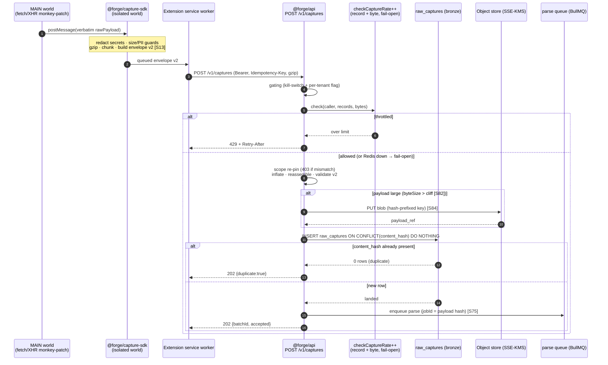

# 07 — Raw API Processing Engine

> **Canonical contract:** this doc owns the **ingest edge** of TruePoint Forge — the **envelope v2**
> typed contract (`@forge/types`), the **capture ingest API** (`POST /v1/captures` single + `POST
> /v1/captures/batch` chunked, both **`202` + job handle**), and the **verbatim landing** of every
> intercepted payload into the immutable `raw_captures` bronze layer (`decision-ledger` L2). It is the
> stage the four-layer medallion `raw_captures → parsed_records → verified_records → (sync) → TruePoint
> master graph` begins at, and the **only** place raw intercepted bytes enter the system. Envelope v2 is
> a **new Forge-owned superset** of TruePoint's `ingestionEnvelope` (`ecosystem-facts §A`), **not** an
> edit to `packages/types/src/ingestion.ts` (`decision-ledger` L3). The whole capability ships **DARK**
> behind a global kill-switch **and** a per-tenant flag until legal sign-off. **Locking ADR: ADR-0046**
> (raw API interception as primary capture); the downstream firewall is **ADR-0047**.

This doc **owns the ingest contract and the S0 land stage**. It does **not** restate the `raw_captures` /
`capture_batches` schema (owned by `05-database-design`), the S0→S8 pipeline stage contracts or the
effectively-once model (owned by `06-data-pipeline-architecture`), the service/firewall boundary (owned
by `03-system-architecture`), the security enforcement — KMS envelope, per-layer roles, DSAR reach (owned
by `14-security`), or the scale topology (owned by `17-scalability`) — it links to each owner. Current-state
TruePoint facts cite `_context/ecosystem-facts.md` by `§`; industry best-practice cites `[S#]` in
`_context/research-corpus.md`; frozen vocabulary is `_context/decision-ledger.md` (L1–L11).

---

## Objectives

1. Freeze **envelope v2** as a **typed contract in `@forge/types`** — every envelope-level and per-record
   field (name · type · meaning · grounding), and its exact mapping onto `raw_captures` columns — so the
   extension, the capture-SDK, and the ingest API all speak one shape.
2. Specify the **capture ingest API surface**: `POST /v1/captures` (single) + `POST /v1/captures/batch`
   (chunked), the middleware chain, **chunk reassembly**, **gzip inflation**, **size caps**, and the
   **`202` + job-handle** async ack.
3. Fix **verbatim, immutable storage** into `raw_captures` with **object-store offload** for large blobs
   (pointer) vs **inline JSONB** for small (`decision-ledger` OQ-4), and **ingest-time `content_hash`
   idempotency** mirroring `source_records.content_hash` UNIQUE (`ecosystem-facts §B`).
4. Define **abuse controls that extend `checkCaptureRate`** (`ecosystem-facts §A`) — per-caller
   record-volume **and** payload-byte throttles, **fail-open** posture — plus **`429` + back-pressure**
   semantics at the edge.
5. Lock the **interception gating** (global kill-switch + per-tenant flag; DARK until legal sign-off,
   ADR-0046) and the **`@forge/capture-sdk` contract** shared with the extension (interceptor helpers +
   envelope-v2 builder + client-side size/PII guards, `decision-ledger` L8, OQ-6).
6. Pin the **raw-layer PII posture** (encrypt at rest, retention TTL, no clear PII in queryable columns)
   and register the ingest-engine gaps (`G-FORGE-701…708`), risks, milestones, and open questions.

Non-goals: the `raw_captures` table definition (`05`), the versioned-parser stage that consumes bronze
(the parser-framework doc + `06 §S1`), the ADR texts (`docs/planning/decisions/ADR-0046`, `ADR-0047`),
and the MV3 extension internals (`docs/planning/chrome-extension/01-apollo-teardown.md`, ADR-0046).

---

## Industry practice (cited [S#])

| Practice | What it says | Bearing on the ingest engine |
|---|---|---|
| **Land, then queue — never forward synchronously** | Sentry Relay **normalizes before filtering/PII-scrubbing/metric-extraction**, then **produces onto a durable queue rather than forwarding synchronously** — stage order `normalize → scrub → emit`, decoupled by a queue [S46] | the ingest edge validates + lands a durable `raw_captures` row + enqueues parse, then acks `202`; it never runs parse/extract inline |
| **Bronze is verbatim, immutable, append-only** | store raw as string/binary with **no cleanup/validation**, original format, incrementally appended, immutable — the single source of truth enabling reprocessing/audit [S81] | `raw_captures` stores the payload **verbatim**; only `status` mutates; every later layer rebuilds from it |
| **Large payloads leave Postgres** | JSONB queries degrade **2–10×** past the ~2 kB TOAST threshold, and TOAST **rewrites the whole value on update** (cheap to append, costly to mutate) [S82][S83] | small profile JSON MAY stay inline JSONB; large blobs go to the object store with a pointer in the row (OQ-4) |
| **Idempotent ingest by content hash** | a `content_hash` UNIQUE + idempotent upsert makes a replayed record a no-op; every mainstream queue is **at-least-once**, so correctness comes from **idempotent consumers** [S81][S72][S23] | ingest dedups on `content_hash` UNIQUE (mirror `source_records`), and enqueue uses a **stable `jobId` = payload hash** so a double-enqueue is free [S75] |
| **Resilient-pipeline triad** | idempotency (dedup keys) + **bounded retries with exponential backoff** + a **DLQ terminal path** is one pattern; a DLQ also gives **backpressure + poison isolation** [S80][S72] | oversize/malformed → reject at the boundary; transient land failures → bounded retry; the edge never retries a poison payload forever |
| **Secret redaction before the process boundary** | the MV3-standard interceptor monkey-patches `fetch`/`XHR`, bridges via `CustomEvent`/`postMessage`, and **redacts secrets before the payload crosses the process boundary** [S13] | `@forge/capture-sdk` strips `Authorization`/`Bearer`/cookie/`csrf`/token-shaped fields **client-side**, before envelope v2 is ever built (ADR-0046 decision #2) |
| **Erasure must reach the raw layer** | GDPR Art 17 erasure must be verifiable/irreversible and **reach the raw layer** (short retention + tombstoning so raw PII ages out of backups); DSAR answered within **one month** via a subject-lookup index [S117] | `raw_captures` carries a **short retention TTL** + tombstoning; the ingest engine writes the consent snapshot that anchors Art 14/DPDP posture [S16][S118] |
| **Encryption at rest via KMS envelope** | SOC 2 auditors expect at-rest encryption via a centralized KMS, envelope encryption (per-record/tenant DEK wrapped by a KEK), rotation, and key-admin SoD [S122] | raw blobs are object-store SSE-KMS; small inline JSONB is column-encrypted; keys are `forge_admin`-only (`05 §PII posture`) |
| **Spread high-volume object writes** | Iceberg's `ObjectStoreLocationProvider` appends a **hash prefix** to spread writes across S3 prefixes and avoid request-rate throttling on **bursty ingestion**; compaction/expiration are mandatory [S84] | large-blob keys are hash-prefixed so a bursty extension fleet does not hot-spot one object-store prefix (`17-scalability`) |

The load-bearing shape is Sentry Relay's [S46]: **normalize/land, then emit onto a durable queue** — the
ack path never blocks on the downstream DAG, which is exactly the `< 300 ms p95` async ack the pipeline
requires (`02 §NFR-03`, `06 §Ordering`).

---

## Current-state — what already exists in TruePoint (cite ecosystem-facts)

The ingest engine is the gap Forge fills; TruePoint has the **shape** but no landing.

| TruePoint today | State | What this doc builds |
|---|---|---|
| `POST /api/v1/ingest` validates `ingestionEnvelope`, enforces the `envelope.scope.tenantId === session tenantId` trust boundary (`403 scope_mismatch`), rate-limits `chrome_extension` via `checkCaptureRate`, then **returns `202 {accepted}` and stores NOTHING** (`ecosystem-facts §A`) | stub — "async pipeline wired in later slices" | the **real** landing: envelope v2 → immutable `raw_captures` on Forge's own endpoint (`POST /v1/captures`), never TruePoint's ingest (**G-FORGE-701**) |
| `ingestionEnvelope` = `{source, scope, idempotencyKey, collectedAt, consent?, records}` where `records: rawObservation[]` = `z.record(string, unknown)` — a field-bag with **no `raw_payload`/`endpoint`/`schema_version`** (`ecosystem-facts §A`) | no verbatim raw | **envelope v2**, a genuine superset carrying the verbatim payload + `endpoint` + `schema_version` + size cap + gzip + chunking (`decision-ledger` L3, **G-FORGE-702**) |
| `checkCaptureRate(key, count)` — 2,000 records/min/caller, **fails open** on Redis outage (`ecosystem-facts §A`) | record-volume only | **extended** with a per-caller **payload-byte** throttle + `429`/Retry-After semantics, same fail-open posture (**G-FORGE-703**) |
| `source_records.content_hash bytea NOT NULL UNIQUE` → idempotent ingest; `raw_data jsonb` verbatim (`ecosystem-facts §B`) | reusable pattern | `raw_captures.content_hash` UNIQUE mirrors it exactly (schema owned by `05`); ingest replay is a `202` no-op |
| `import_jobs`/`import_job_chunks`/`import_job_rows` — `byte_offset` resume, `reject_histogram`, `av_scan_status`, `idempotency_key`, Bulk-API-2.0 accounting (`ecosystem-facts §C`) | shipped | the **bulk-blob** ingest path reuses this trio near-verbatim (`02 §FR-01`, `05 §Group 8`); the `202` + job-handle mirrors its state machine |
| Extension captures **visible-DOM header fields only, no XHR interception** (ADR-0043 #4, `ecosystem-facts §E`) | DOM-only | ADR-0046 pivots to MAIN-world raw capture posting envelope v2 to Forge via `@forge/capture-sdk` (**G-FORGE-705**) |
| `CHROME_EXTENSION_ENABLED`, `INGESTION_EVIDENCE_ENABLED`, `EXTENSION_ORIGINS` all **off by default** (`ecosystem-facts §A/§E`) | dark-by-default posture | the interception gating mirrors it: global kill-switch + per-tenant flag, DARK until sign-off (**G-FORGE-704**) |
| `deadLetter.ts` (PII-free DLQ), `outboxRelay.ts` (transactional outbox), stable-`jobId` dedup (`ecosystem-facts §C`) | shipped worker platform | reused for the land-failure DLQ and the parse enqueue (mechanics owned by the worker-orchestration doc) |

---

## Design

### Envelope v2 — the typed contract (`@forge/types`)

Envelope v2 is authored **fresh** as `ingestionEnvelopeV2` in `@forge/types` (`04 §Shared types`); it is a
superset of `ingestionEnvelope` (`ecosystem-facts §A`) and never mutates the upstream Zod (`decision-ledger`
L3). It is **two-level**: an envelope wraps one capture batch (an extension session flush or an import
chunk); each envelope carries `records[]`, and the verbatim payload lives per-record.

**Envelope-level fields.**

| Field | Type | Meaning · grounding |
|---|---|---|
| `envelopeVersion` | `"2"` (const) | envelope-schema version; also on the wire as `X-Forge-Envelope-Version` (evolves under BACKWARD/FULL, additive-only [S24]) |
| `source` | `connectorId` enum | connector id — `chrome_extension`/`admin_upload`/`enrichment`/`provider`/… (the closed enum, `ecosystem-facts §A`) |
| `scope.tenantId` | uuid | **target attribution** — the TruePoint tenant the capture is *for*; re-pinned to the token (the `403 scope_mismatch` boundary, `ecosystem-facts §A`). In Forge it is an **audit pointer, not an RLS key** (`05 §conventions`) |
| `scope.workspaceId?` | uuid | optional target attribution |
| `idempotencyKey` | string(255) | **batch submit dedup** → `capture_batches.idempotency_key` UNIQUE (mirror `import_jobs`, `ecosystem-facts §C`) |
| `collectedAt` | ISO-8601 | when the session collected the batch (mirror `ingestionEnvelope.collectedAt`) |
| `capturedBy` | uuid | the extension/operator principal (audit pointer → `raw_captures.captured_by`) |
| `consent?` | `consentContext` = `{basis, sourceUrl?, capturedByUserId?, capturedAt?}` | the **consent snapshot** at capture → `consent_snapshot`; the Art 14 / DPDP §7 grounding artifact [S16][S118] (`ecosystem-facts §A`) |
| `gzip` | boolean | the per-record `rawPayload` bodies are gzip-compressed (also signalled by `Content-Encoding: gzip`) |
| `chunk.groupId` | uuid | reassembly key tying the chunks of one logical batch together |
| `chunk.index` / `chunk.total` | int | this envelope is chunk `index` of `total` (large batch split **client-side**) |
| `size` | bigint | total envelope byte size — cap-enforcement + accounting → `capture_batches.byte_size` |
| `records` | `rawRecordV2[]` | the per-record payloads (below) |

**Per-record fields (`rawRecordV2` — the superset of `rawObservation`).**

| Field | Type | Meaning · grounding |
|---|---|---|
| `rawPayload` | opaque bytes (base64/string) | the **verbatim** response body — the envelope-v2 add TruePoint's `rawObservation` lacks (`ecosystem-facts §A`, `decision-ledger` L3); stored byte-for-byte |
| `endpoint` | string(255) | e.g. `voyager/identity/profiles` — parser routing + provenance; null for non-API sources (envelope v2, L3) |
| `schemaVersion` | string(50) | **SchemaVer** the SDK claims for this endpoint shape (`MODEL-REVISION-ADDITION` [S43]) |
| `contentType` | string(100) | MIME of `rawPayload` (`application/json`, …) |
| `contentHash` | bytea (hex on the wire) | `sha256(canonical(rawPayload))` — **per-record idempotency** (mirror `source_records.content_hash`, `ecosystem-facts §B`) |
| `capturedAt` | ISO-8601 | when this specific response was intercepted |
| `byteSize` | int | per-record size (per-record cap routing + inline-vs-object-store decision) |
| `fields?` | `rawObservation` (`§A`) | optional legacy field-bag for the **DOM-fallback** adapter (ADR-0043 #4, retained as augmentation) |

**Envelope v2 → `raw_captures` mapping** (schema owned by `05`; this is the column map the land stage
applies): `source→source`, `endpoint→endpoint`, `schemaVersion→schema_version`, `rawPayload→payload_inline`
*or* `payload_ref`, `contentHash→content_hash`, `scope.tenantId/workspaceId→target_tenant_id/…`,
`consent→consent_snapshot`, `capturedBy→captured_by`, `gzip→is_gzipped`, `byteSize→byte_size`,
`contentType→content_type`, `collectedAt→` the batch, `capturedAt→ingested_at`. The batch envelope maps
onto one `capture_batches` row (`05 §Group 1`).

### The capture ingest API surface

Two endpoints on **Forge's `@forge/api`** (Hono on Bun) — never TruePoint's `/api/v1/ingest` (the firewall,
ADR-0046). Both are **async**: they validate + land + enqueue, then ack `202` without blocking on parse
(`02 §NFR-03`).

| Endpoint | For | Body | Behavior | Response |
|---|---|---|---|---|
| **`POST /v1/captures`** | a **single** envelope (one session flush / a small record set under the single-request cap) | one envelope v2, optionally `Content-Encoding: gzip` | synchronous **validate → land `raw_captures` (idempotent) → enqueue parse** | `202 {batchId, accepted, duplicate, rejected}` |
| **`POST /v1/captures/batch`** | a **large / chunked** envelope (many records, over the single-request cap) | **one chunk** of a chunked envelope (`X-Forge-Chunk-*`), gzip | buffer chunk; on the last chunk **reassemble → inflate → validate → enqueue land** | `202 {jobHandle}` |
| **`GET /v1/captures/batch/{jobHandle}`** | polling a batch | — | reads `capture_batches` state (mirror the Bulk-API-2.0 machine, `ecosystem-facts §C`) | `200 {status, counts, reject_histogram}` |

**Request headers.** `Authorization: Bearer <extension token>` (the ADR-0045 companion-window credential,
`aud=chrome-extension://<id>`, scope `["extension"]`, `ecosystem-facts §E`) — or operator SSO for
`admin_upload`; `Idempotency-Key` (batch dedup); `Content-Encoding: gzip`; `X-Forge-Envelope-Version: 2`;
and on the batch path `X-Forge-Chunk-Group` / `X-Forge-Chunk-Index` / `X-Forge-Chunk-Total`.

**Middleware chain** (mirrors the shipped ingest chain, `ecosystem-facts §A`, and the `apps/api/src/middleware`
layout, `04 §Repository layout`):

```
authn  →  (extension-scope | staff-role)  →  gating check (kill-switch + per-tenant flag)
       →  rate-limit (extended checkCaptureRate: record-volume + payload-byte, fail-open)
       →  scope re-pin (403 scope_mismatch)  →  size-cap + Content-Encoding guard
       →  gzip inflate  →  chunk reassemble (batch)  →  validate envelope v2  →  land + enqueue  →  202
```

**Status-code contract.**

| Code | When | Note |
|---|---|---|
| `202` | accepted (single landed, or batch job accepted); **also a replayed `content_hash` no-op** | never blocks on parse; the durable row + enqueue *are* the buffer [S46] |
| `400` | malformed / schema-invalid / `rawPayload` outside the in-repo endpoint allowlist / bad chunk sequence | reject at the boundary, **never partial store** (`02 §FR-02`) |
| `401` / `403` | auth failure / `scope_mismatch` / **capture disabled** (kill-switch or per-tenant flag off) | disabled mirrors the shipped "no connector" terminal reject (`ecosystem-facts §A`) |
| `413` | per-record or per-envelope byte cap exceeded | the SDK should have chunked; a raw oversize is rejected, not truncated |
| `415` | unsupported `Content-Encoding` / media type | |
| `429` | record-volume **or** payload-byte throttle tripped | carries `Retry-After`; the throttle **fails open** (Redis outage never blocks capture, `ecosystem-facts §A`) |
| `503` | land substrate (Postgres/object store) unavailable | bounded client retry under `Idempotency-Key` |

#### Sequence — capture → ingest → `raw_captures`



### Verbatim storage & object-store offload (OQ-4)

The land stage writes the payload **verbatim and immutable** [S81]; only `raw_captures.status` ever mutates.
Storage is routed by `byteSize` at ingest (schema owned by `05 §Group 1`):

- **Small (< the ~2 kB TOAST cliff [S82]):** `payload_inline jsonb` — kept in-row, column-encrypted.
- **Large:** streamed to the object store (S3/MinIO, SSE-KMS) under a **hash-prefixed key** to spread bursty
  writes across prefixes [S84]; the row keeps only `payload_ref` (pointer). The `CHECK` that **exactly one**
  of `payload_inline`/`payload_ref` is set is a schema invariant (`05`).

Object storage is the one net-new substrate over TruePoint's stack (`03 §Technology choices`,
`decision-ledger` L7); the object-store-large / JSONB-small default and the Iceberg-vs-Delta cold-tier
question are **OQ-4 / OQ-R8** (`05 §Partitioning & retention`). This engine only decides *where a payload
lands*; the cold-tier lifecycle and retention sweep are owned by `05` + `14`.

### Ingest-time `content_hash` idempotency

`content_hash = sha256(canonical(rawPayload))`. Because `rawPayload` is an **opaque, possibly-gzipped
body**, canonicalization is defined as **hash over the decompressed, byte-normalized payload** (stable
key order + normalized encoding for JSON bodies; raw bytes otherwise) so a payload gzipped at two different
levels still hashes equal — the canonicalization rule itself is **G-FORGE-708** (it differs from the
structured-field canonicalization in `import/contentHash.ts`, `ecosystem-facts §C`).

The `raw_captures.content_hash` UNIQUE index (mirror `source_records`, `ecosystem-facts §B`) makes a
replayed capture a **structural no-op**: `INSERT … ON CONFLICT (content_hash) DO NOTHING` returns zero rows
and the API answers `202 {duplicate:true}`. The producer boundary reinforces this with a **stable
`jobId` = payload hash** so an accidental double-enqueue is ignored by BullMQ [S75]. The
partition-vs-global-UNIQUE caveat (a partitioned `raw_captures` needs the companion `raw_capture_hashes`
dedup table) is **owned by `05` (G-FORGE-502)** — until conversion the plain-table UNIQUE is global.

### Abuse controls — extending `checkCaptureRate`

The edge **extends the shipped `checkCaptureRate`** (2,000 records/min/caller, **fails open** on Redis
outage — an anti-scraping throttle, *not* a security control, `ecosystem-facts §A`) with a second dimension
and preserves the fail-open posture:

| Throttle | Limit (starting) | Keyed on | On trip | Fail mode |
|---|---|---|---|---|
| Record-volume (existing) | 2,000 records/min | caller principal | `429 + Retry-After` | **open** (Redis down → allow) |
| **Payload-byte (new)** | e.g. N MB/min | caller principal | `429 + Retry-After` | **open** |
| Per-record size cap | per-record byte ceiling | — | `413` | closed (a hard cap) |
| Per-envelope size cap | per-request byte ceiling | — | `413` (SDK should chunk) | closed |

Fail-open is deliberate and inherited: a Redis outage must **not** halt capture (abuse ≠ security; the
security boundary is auth + gating + the firewall, not the rate limiter). The byte-throttle limits and the
edge load-shedding policy are **G-FORGE-703**; the numbers calibrate against `17-scalability`. Back-pressure
mechanics (`§Back-pressure`) engage before unbounded backlog.

### Interception gating (kill-switch + per-tenant flag; DARK until sign-off)

Capture is **off by default** and gated at two independent levels, mirroring the shipped
`CHROME_EXTENSION_ENABLED` posture (`ecosystem-facts §A/§E`) and locked by **ADR-0046 decision #4**:

| Gate | Where | Effect |
|---|---|---|
| **Global kill-switch** | `@forge/config` flag, fleet-wide, honored at both the SDK (next signed-config refresh, `chrome.alarms`) and the ingest edge | instant "stop collecting"; the edge returns a terminal reject and stores nothing |
| **Per-tenant enablement flag** | `@forge/config`, per target `scope.tenantId` | no tenant runs interception until explicitly enabled *and* the global GA gate is cleared |
| **In-repo endpoint allowlist** | `@forge/capture-sdk` + edge validation | only allowlisted `endpoint`s are accepted; a payload outside it → `400` (anti-tamper, ADR-0046 #5) |

GA is blocked on the **legal + DPIA sign-off** (ADR-0046 decision #6, **OQ-2**, GA-blocking not
planning-blocking): the capability may be **built and tested dark** but must not be enabled for any tenant
until counsel + DPO sign off. The config seam is **G-FORGE-704**; the full risk register and gates live in
**ADR-0046** and are not restated here.

### The `@forge/capture-sdk` contract (shared with the extension)

`@forge/capture-sdk` is the **only** package that ships into the untrusted MV3 process, so it depends on
`@forge/types` **only** (the `capture-sdk-stays-thin` boundary rule, `04 §Module boundary enforcement`).
It is the single source of the envelope-v2 shape across Forge and the extension (single-sourcing is
**OQ-6 / G-FORGE-705**). Its surface:

| Export | Responsibility | Grounding |
|---|---|---|
| interceptor install / teardown | MAIN-world `fetch` + `XMLHttpRequest.prototype.{open,send}` monkey-patch; `postMessage` bridge to the isolated world | the MV3-standard method [S13]; ADR-0046 #1 |
| `redactSecrets(payload)` | strip `Authorization`/`Bearer`/cookie/`csrf`/token-shaped fields **before** the payload crosses the process boundary | [S13]; ADR-0046 #2 — a client-side minimization control |
| size / PII guards | enforce per-record + per-envelope byte caps client-side; drop responses outside the in-repo allowlist; coarse PII pre-checks | ADR-0046 #2 (minimization) |
| `buildEnvelopeV2(records, ctx)` | assemble the typed envelope, compute per-record `contentHash`, attach `consent`/`capturedBy`, **gzip + chunk** when over the single-request cap | `decision-ledger` L3/L8 |

Client-side guards are **UX/minimization, not a security boundary** (the design/security precedence rule):
the ingest edge **re-validates** every field, re-checks the allowlist, re-enforces caps, and re-pins scope
server-side. Nothing the SDK asserts is trusted (`03 §Trust boundaries`).

### Raw-layer PII posture

The raw layer is where **clear PII transiently lives** (the verbatim payload) — the highest-restriction
layer, and the primary Art 17 erasure target (`05 §PII posture`, `14-security` owns enforcement):

- **Encrypt at rest.** Large blobs are object-store **SSE-KMS**; small inline JSONB is **column-encrypted**;
  keys are `forge_admin`-only via KMS envelope (per-record DEK wrapped by a KEK, key-admin SoD [S122]).
- **No clear PII in a queryable column.** Queryable columns hold only routing/accounting metadata
  (`source`, `endpoint`, `content_hash`, `byte_size`, `status`); the payload itself is encrypted, never
  indexed in clear (contrast the parsed/verified layers' blind-index scheme, `ecosystem-facts §B`).
- **Retention TTL + tombstoning.** `raw_captures` carries a **short retention TTL** so raw PII ages out of
  backups within the backup cycle [S117]; India-origin data (DPDP §7, consent-or-nothing [S118]) gets the
  **shortest** TTL. The sweep sets `status='erased'` + deletes the blob (owned by `05 §retention` + `14`).
- **Consent at capture.** The `consent_snapshot` written at land time is the Art 14 / DPDP grounding
  artifact [S16][S118] and the anchor for the cross-layer subject-lookup index (ADR-0046 R4, `14`).

### Back-pressure + `429` semantics

The ack path **must never block on the DAG** (Sentry Relay's land-then-queue [S46]). Back-pressure engages
in order, before unbounded backlog:

1. **Durable buffer.** The committed `raw_captures` row + the parse enqueue **are** the buffer; a downstream
   stall grows bounded, monitored queue depth, not capture-ack latency (`06 §Ordering`, G-FORGE-607).
2. **Edge throttle → `429`.** The extended `checkCaptureRate` (record + byte) sheds a runaway fleet with
   `429 + Retry-After` so producers cannot outrun the pipeline into unbounded backlog; it **fails open**.
3. **Object-store offload** keeps large payloads off the Postgres hot path [S82], and hash-prefixed keys
   spread bursty writes [S84].
4. **Land-failure DLQ.** A poison land (malformed after inflate, substrate error past retries) parks a
   **PII-free** descriptor on the DLQ (mirror `deadLetter.ts`, `ecosystem-facts §C`) rather than retrying
   forever [S72][S74]; alerting fires on **retry-exhaustion**, not the first transient blip [S102].

The unbounded-backlog failure mode is a monitored **volume/freshness SLO** breach (`06 §Per-stage SLOs`),
triaged as a capacity or poison-message problem, never silently absorbed.

---

## Security considerations

- **The firewall starts here.** Raw intercepted bytes enter *only* at this edge and terminate in
  `raw_captures`; they **never** transit TruePoint's `/api/v1/ingest` and never cross to the production CRM
  (ADR-0046 #3, `03 §compliance firewall`). The ingest endpoint living on Forge — not TruePoint — is the
  architectural enforcement.
- **Untrusted input.** Every envelope-v2 field is attacker-controllable (the payload originates in a browser
  the user, not Forge, controls). The edge re-validates the schema, re-checks the in-repo allowlist,
  re-enforces caps, and **re-pins `scope` to the token** (`403 scope_mismatch`, `ecosystem-facts §A`) — the
  SDK's client-side guards are never trusted (security > design precedence).
- **Secret non-exfiltration.** `redactSecrets` runs **client-side before the process boundary** [S13], and
  the edge additionally scrubs any `Authorization`/cookie-shaped field that slips through — a defense in
  depth so captured session credentials never land.
- **Least privilege.** The land path uses the `forge_ingest` role (INSERT `raw_captures`/`capture_batches`
  only; **cannot** read `verified_*` or reach the CRM) — the disjoint-from-`forge_sync` invariant means no
  role both writes raw and pushes production [S121] (`05 §DB roles`, enforced by a CI grant test, G-FORGE-506).
- **PII at rest.** Encrypt-at-rest + short retention TTL + tombstoning make the raw layer erasure-reachable
  [S117][S122]; India-origin data is highest-restriction [S118].
- **DARK until sign-off.** The gating (kill-switch + per-tenant flag) plus the GA-blocking DPIA/legal gate
  (ADR-0046 #6, **OQ-2**) mean the whole engine can be built and exercised without collecting from a single
  live tenant. Security has final say (project precedence). Deep enforcement (KMS envelope, DSAR index,
  residency tagging) is owned by `14-security`.

---

## Scalability considerations

- **Stateless edge, horizontally scaled.** `POST /v1/captures` is CPU-light (validate + hash + one INSERT +
  one enqueue) and stateless; it scales horizontally behind a **mandatory connection pooler** (RDS
  Proxy / PgBouncer, transaction-mode) — pooling gives ~18–20× throughput under connection churn [S110]
  (`17-scalability`).
- **Large payloads never touch the Postgres hot path.** `byteSize`-routed object-store offload past the
  ~2 kB TOAST cliff [S82][S83], with hash-prefixed keys to spread bursty extension-fleet writes across
  object-store prefixes and dodge request-rate throttling [S84].
- **Chunked upload for large batches** keeps any single request under the HTTP-body cap and lets the
  reassembly + land run **async** on a worker (the `202 {jobHandle}` path), so a slow land never blocks the
  ack. The reassembly worker autoscales on its own queue depth (per-stage KEDA scale-to-zero [S104][S105]).
- **Back-pressure by design** (`§Back-pressure`): the durable row + enqueue is the buffer, and the edge
  throttle sheds a runaway fleet before backlog grows unbounded [S46][S79].
- **Idempotency makes retries free.** `content_hash` UNIQUE + stable `jobId` mean client retries and
  double-enqueues converge without duplicate work [S75][S72] — the property that lets the client retry
  aggressively under `Idempotency-Key` on `503`. Capacity math and topology are owned by `17-scalability`.

---

## Risks & mitigations

Ingest-engine gaps use **`G-FORGE-701…708`** (unique across the suite, `decision-ledger` L9; `01` holds
`01…11`, `03` holds `12…16`, `02` holds `17…20`, `04` holds `21…25`, `05` holds `21…26`, `06` holds
`26…32`, ADR-0046 holds `50…55` — the Stage-8 pass reconciles the `21…26`/`26` overlaps). They map to
`28-enterprise-readiness-audit.md` where an existing TruePoint gap is relevant.

| Risk / gap | Area | L × I | Mitigation (cite) |
|---|---|---|---|
| **G-FORGE-701** — the Forge ingest API (`POST /v1/captures` single + batch) + envelope-v2 validate→land is **unbuilt** (TruePoint's stub stores nothing, `ecosystem-facts §A`) | platform / data | High × High | build the edge in M-FORGE-A; `202` async ack; land immutable `raw_captures` (idempotent) |
| **G-FORGE-702** — chunk reassembly + gzip inflation + size-cap enforcement not built (envelope v2 adds chunking/gzip the shipped envelope lacks) | platform | High × Med | server-side reassembly worker + inflate + `413`/`415` guards; SDK chunks client-side |
| **G-FORGE-703** — abuse control beyond `checkCaptureRate`: per-caller **payload-byte** throttle + `429`/back-pressure semantics unbuilt (record-volume only, fails open, `ecosystem-facts §A`) | platform / security | Med × Med | extend `checkCaptureRate` with a byte dimension, same fail-open posture; `Retry-After`; edge load-shed |
| **G-FORGE-704** — interception gating (global kill-switch + per-tenant flag, DARK) config seam not built (mirror `CHROME_EXTENSION_ENABLED`, `§A/§E`) | security / platform | High × High | `@forge/config` flags off by default; honored at SDK + edge; GA-blocked on ADR-0046 #6 (OQ-2) |
| **G-FORGE-705** — `@forge/capture-sdk` (interceptor + envelope-v2 builder + client-side redaction/size/PII guards) not built; single-sourcing with the extension (OQ-6) | platform / security | High × High | build the `types`-only SDK (maps to ADR-0046 **G-FORGE-4604**); `capture-sdk-stays-thin` boundary rule (`04`) |
| **G-FORGE-706** — raw-layer encrypt-at-rest (object-store SSE-KMS + inline column encryption) + retention TTL/tombstoning not wired at ingest (raw PII lands; Art 17 must reach it [S117]) | security / data | Med × High | KMS envelope + short TTL + tombstoning (maps to ADR-0046 **G-FORGE-4605**); enforcement owned by `14` |
| **G-FORGE-707** — edge back-pressure / bounded-queue + load-shedding between the `202` ack and the parse DAG not specified (overlaps `06` G-FORGE-607) | platform | Med × Med | durable buffer + edge `429` throttle + DLQ isolation (`§Back-pressure`) [S46][S72][S79] |
| **G-FORGE-708** — `content_hash` canonicalization over an **opaque/gzipped** `rawPayload` differs from structured-field canonicalization (`import/contentHash.ts`, `§C`) | data | Med × Med | hash over the **decompressed, byte-normalized** payload; pin with a golden-fixture test [S123] |
| Client-side guards treated as a security boundary | security | Med × High | edge re-validates schema/allowlist/caps/scope server-side; SDK guards are UX/minimization only (`03 §Trust boundaries`) |
| Bursty extension fleet hot-spots one object-store prefix | platform | Low × Med | hash-prefixed keys spread writes [S84]; per-stage autoscale [S104] |
| Interception collects before legal sign-off | security / legal | Med × High | DARK by default + GA-blocking DPIA/legal gate (ADR-0046 #6, **OQ-2**); build dark, do not enable |

---

## Milestones

Slots into the M-FORGE build order (`03 §Milestones`); this doc owns the **S0 ingest** exit criteria.

| Milestone | Delivers (ingest) | Exit criterion |
|---|---|---|
| **M-FORGE-A — Foundation** | `ingestionEnvelopeV2` in `@forge/types`; `POST /v1/captures` (single) → immutable `raw_captures` (`content_hash` idempotent) + object-store offload + parse enqueue; gating flags (DARK) | a single envelope v2 lands an immutable row + blob; a replay is a `202` no-op; a double-enqueue is ignored [S75]; capture is off unless the flag is on |
| **M-FORGE-A′ — SDK + batch** | `@forge/capture-sdk` (interceptor + `buildEnvelopeV2` + redaction/size/PII guards); `POST /v1/captures/batch` chunk reassembly + gzip inflation + `413`/`415`/`429` | a chunked, gzipped batch reassembles + lands; oversize → `413`; the SDK ships `types`-only (boundary gate green) |
| **M-FORGE-A″ — Abuse + PII posture** | extended `checkCaptureRate` (record + byte, fail-open) + `429`/Retry-After; raw-layer SSE-KMS + inline column encryption + retention-TTL sweep hook | a byte-flood is throttled with `Retry-After`; Redis-down still accepts (fail-open); raw blobs are encrypted at rest; TTL sweep tombstones raw PII [S117] |

---

## Deliverables

1. **Envelope v2** as a typed `@forge/types` contract — the envelope-level + per-record field tables and the
   `raw_captures` column map (this doc; schema owned by `05`).
2. The **capture ingest API** — `POST /v1/captures` (single) + `POST /v1/captures/batch` (chunked) + the
   poll endpoint, the middleware chain, the status-code contract, and the capture→ingest→`raw_captures`
   sequence diagram.
3. The **verbatim-storage + object-store-offload** routing (OQ-4) and the **`content_hash` idempotency**
   rule (including the opaque-payload canonicalization, G-FORGE-708).
4. The **extended abuse-control** design (record + byte throttle, fail-open, `429`/back-pressure) and the
   **interception gating** seam (kill-switch + per-tenant flag, DARK).
5. The **`@forge/capture-sdk` contract** (interceptor + builder + client-side guards) and the **raw-layer
   PII posture** (encrypt-at-rest, retention TTL, no clear PII in queryable columns).
6. The **ingest gap register `G-FORGE-701…708`**, and handoffs: schema → `05`; pipeline stages → `06`;
   security enforcement → `14`; scale/topology → `17`.

---

## Success criteria

1. **A captured envelope v2 lands an immutable `raw_captures` row + blob**, and a **replay is a `202`
   no-op** (idempotent on `content_hash`, mirror `source_records`, `ecosystem-facts §B`) [S81].
2. **The ack never blocks on parse** — `POST /v1/captures` returns `< 300 ms p95` and enqueues, never runs,
   the DAG (`02 §NFR-03`, `06 §Ordering`) [S46].
3. **Large payloads never sit in a queryable Postgres column** — `byteSize`-routed object-store offload past
   the TOAST cliff, pointer in row [S82][S83].
4. **Envelope v2 is a superset owned by `@forge/types`**, never an edit to `packages/types/src/ingestion.ts`
   (`ecosystem-facts §A`, `decision-ledger` L3).
5. **Abuse is throttled without a security dependency** — record + byte throttles that **fail open** on
   Redis outage, `429 + Retry-After`, back-pressure before unbounded backlog (`ecosystem-facts §A`) [S72].
6. **No raw byte reaches the CRM and no capture runs undark** — the endpoint is Forge-only, gated by the
   kill-switch + per-tenant flag, and GA-blocked on legal sign-off (ADR-0046, **OQ-2**).
7. **No ingest decision is answered from first principles where a `§`/`[S#]` grounds it** — each cites its
   ecosystem-fact or corpus anchor (CLAUDE.md mandatory-read rule).

---

## Future expansion

- **Additional capture surfaces on the same envelope v2.** The contributory "co-op" channel (the industry's
  real primary moat [S2], **OQ-R3**) and server-side provider webhooks can post the *same* envelope v2 to the
  *same* edge — `source` already distinguishes them; the engine generalizes beyond the extension.
- **CDC / event-bus ingest option.** Buffering the internal parse hop through the durable queue is *not* an
  event bus (`decision-ledger` L5); a future event-bus front door for very-high-volume ingest is deferred to
  the event-bus option doc (`20`, OQ-R4).
- **Iceberg cold-tier for the raw substrate.** Tag-driven Glacier lifecycle + managed compaction for the
  append-only raw partitions [S84] (**OQ-4 / OQ-R8**, owned by `05`).
- **Off-store extension distribution.** If Chrome Web Store single-purpose review rejects MAIN-world capture
  (ADR-0046 R6, **OQ-R2**), the SDK + edge are distribution-agnostic — an enterprise off-store build posts
  the identical envelope v2.

---

## Open questions

The full register lives in `_context/decision-ledger.md` (L11, OQ-1…OQ-6) and `01`'s research register
(OQ-R1…OQ-R20); the ingest-shaping ones surface here.

- **OQ-2 — Interception legal sign-off (GA-blocking).** The DPIA + per-source Art 6(1)(f) LIA + Art 14
  notice + DPDP §7 posture (ADR-0046 #6) gate turning capture on for **any** tenant; the engine is built and
  tested **dark** meanwhile. This is the single largest gate over this doc. [S116][S118][S16]
- **OQ-4 — Raw-blob substrate** (object-store-large vs JSONB-small; default object-store-large). Drives the
  `byteSize` routing here and the cold-tier format in `05` (overlaps **OQ-R8** Iceberg vs Delta). [S82][S86]
- **OQ-6 — `@forge/capture-sdk` single-sourcing** (one shared package consumed by both Forge and the pivoted
  extension vs a fork). The SDK is the only code that ships into the untrusted MV3 process; **G-FORGE-705**.
- **OQ-5 — Retirement of TruePoint's dark `chrome_extension` connector** and its `/api/v1/ingest` DOM path
  once the extension posts envelope v2 to `POST /v1/captures` instead (`ecosystem-facts §A/§E`).
- **`content_hash` canonicalization over opaque/gzipped payloads (G-FORGE-708).** Hashing the decompressed,
  byte-normalized payload (vs the raw compressed bytes) needs a pinned golden-fixture rule so two encodings
  of the same body dedup [S123].
- **Byte-throttle limits + edge load-shed policy (G-FORGE-703).** The MB/min ceiling and the shed threshold
  need calibration against `17-scalability`, honoring the fail-open posture (`ecosystem-facts §A`).
