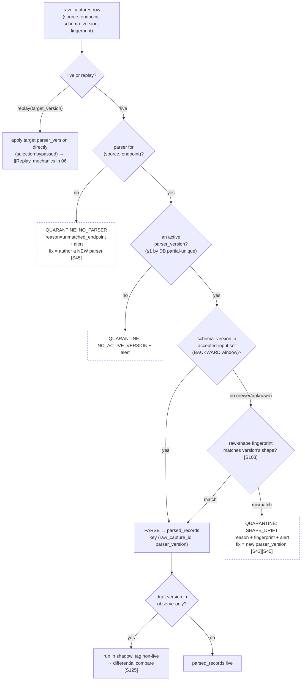

# 08 — Parser Framework

> **Canonical contract:** a **Forge parser** is a **pure, deterministic, total, version-bound** transform
> `parse(raw_payload, endpoint, schema_version) → { normalized candidate fields · field-level provenance ·
> non-fatal parse errors }`. Parsers live in **`@forge/core`** and are governed by the two-table registry
> **`parsers` + `parser_versions`** (schema owned by `05`). The framework — never the parser — **selects**
> the `parser_version` for a `raw_captures` row by **`(source, endpoint, schema_version)`**, admits it
> against the version's declared shape, and routes a miss to the quarantine lane. Every `parser_version`
> carries a **SchemaVer** (`MODEL-REVISION-ADDITION`) whose number *encodes* compatibility [S43], evolves
> its output contract under **BACKWARD/FULL** rules [S24], moves through the lifecycle **`draft → active →
> deprecated → retired`**, and is pinned by a **golden-fixture** corpus so a version bump is
> characterization- and differential-tested before it can publish [S123]. Publishing a new version
> **replays** historical `raw_captures`, **superseding — never duplicating** — prior `parsed_records`
> (the `$supersedes` analogue [S43]). **Locking ADR: ADR-0047** (Forge owns ER + versioned master-sync);
> the interception-primary capture that feeds bronze is **ADR-0046**.

This doc owns the **parser as a code-and-registry contract**: the parser *interface*, the *selection*
algorithm, the *schema-evolution / compatibility* model, the *lifecycle & versioning discipline*, the
registry view of *replay*, the three-way *drift* disambiguation, the *golden-fixture* publish gate, and
the *parser-management UI* contract. It does **not** restate the parser table/column definitions (owned by
`05-database-design §Group 2/3`), the S1 parse-stage pipeline mechanics — quarantine lane, saga,
backpressure, per-stage SLO (owned by `06-data-pipeline-architecture §Stage contracts / §Versioned
parsing / §Schema-drift`), the AI-extract stage the parser hands off to (owned by `07-ai-extraction`), the
drift-monitor store and alerting plane (owned by `15 — observability & lineage`), the testing strategy
(owned by `18-testing`), or the operator UI rendering (owned by `13-frontend-dashboard-design`). Current-state
TruePoint facts cite `_context/ecosystem-facts.md` by `§` anchor; best-practice claims cite `[S#]` in
`_context/research-corpus.md`; frozen vocabulary is `_context/decision-ledger.md` (L1–L11).

---

## Objectives

1. Fix the **parser interface** — the exact code contract every parser implements: what it consumes
   (`raw_payload` + `endpoint` + `schema_version`), what it emits (normalized candidate fields +
   field-level where-provenance + a **non-fatal** parse-error list), and the five invariants (pure,
   deterministic, total, PII-minimizing, provenance-emitting) that make it replay-safe and testable.
2. Specify **parser selection** by `(source, endpoint, schema_version)` and the **admission** check that
   separates a *selection miss* (no parser) from *shape drift* (parser exists, raw changed) from
   *distribution drift* (parser ran, output shifted) — three named routes, one quarantine lane.
3. Define the **schema-evolution / compatibility** model for both the parser's **input** contract (vs the
   upstream raw) and its **output** contract (vs downstream extract/ER/sync), mapping each change class to
   a SchemaVer bump, a compatibility mode, a replay requirement, and a deploy order (Confluent / Avro /
   Iglu [S24] [S43]).
4. Pin the **parser lifecycle** `draft → active → deprecated → retired` with per-transition guards, the
   **one-active-version** discipline, atomic cut-over, and rollback-by-re-promotion.
5. State the registry view of **replay/backfill** (supersede-not-duplicate, `$supersedes` link), the
   **golden-fixture publish gate** (hook to `18`), and the **parser-management UI contract**
   (list/diff/publish/deprecate/replay — hook to `13`).
6. Register the parser-framework gaps (`G-FORGE-801…807`), risks, milestones, deliverables, and open
   questions.

**Non-goals:** the `parsers`/`parser_versions`/`parsed_records` schema (`05`), the S1 stage
retry/DLQ/quarantine-lane mechanics (`06`, `12`), the AI-extraction stage (`07`), the drift-monitor store
and Prometheus alerting (`15`), the full test-pyramid and fixture-generation pipeline (`18`), the UI
components (`13`), and the ADR texts (`docs/planning/decisions/ADR-0047`).

---

## Industry practice

The parser framework sits on a well-established body of practice in **schema registries, event-schema
versioning, and shift-left ingestion validation** — the same problems a Kafka/Confluent, Snowplow, or
Segment pipeline solves, applied to a *private, undocumented* upstream (Voyager JSON, ADR-0046) where the
schema *will* change without notice.

| Practice | What it establishes | Cite |
|---|---|---|
| **Never ingest directly to silver** | The versioned parser stage between bronze and silver is mandatory: schema changes / corrupt records would fail a direct-to-silver write, so silver is built by *reading from* immutable bronze — validating a distinct, replayable parse step. | [S81] |
| **Compatibility is relative to the consumer** | "Breaking" is not an absolute property of a schema; `required→optional` breaks Redshift but not Snowflake. A parser's compatibility is judged against *its* consumer (raw for input; the CRM for output). | [S43] [S24] |
| **The version number encodes compatibility** | Snowplow **SchemaVer** `MODEL-REVISION-ADDITION`: `ADDITION` = compatible with all history, `REVISION` = may break some, `MODEL` = cannot validate history. The bump *is* the deploy contract. | [S43] |
| **Seven compatibility modes → deploy order** | Confluent BACKWARD (default) / FORWARD / FULL (+TRANSITIVE); a *consumer* upgrade (the parser reads raw) should be BACKWARD so it rolls out **ahead** of any producer change; TRANSITIVE checks against **all** prior versions — what replay needs. | [S24] |
| **`$supersedes` = replay historical raw through a corrected version** | Snowplow's `$supersedes` auto-re-validates historical/failed events under a corrected schema, emitting a `validation_info` (original vs corrected version) — the closest industry analogue to Forge's replay-and-supersede. | [S43] |
| **Stream transforms may be BACKWARD-only** | Kafka Streams apps support only BACKWARD, forcing the transform stage to upgrade before upstream producers — the transform layer's constraint can be *stricter* than the registry default. | [S24] |
| **Quarantine drift, don't accept it** | Segment Protocols validates every event against a Tracking Plan; non-matching events become **violations**, and "Block Event" forwards/quarantines them to a review source with alerting (Slack). Great Expectations `CreateQuarantineData` segregates failures rather than discarding them. | [S44] [S45] [S67] |
| **Normalize before filter/scrub** | Sentry Relay runs **normalization before** filtering / PII-scrubbing / emit, decoupling via a durable queue — establishing the parser (normalize) as the first, isolated stage. | [S46] |
| **Rollout is not atomic** | Iglu caches schemas (~10 min), so publishing/superseding is not immediate fleet-wide — a parser change needs a cache-invalidation + observe-only→block staged rollout. | [S43] [S45] |
| **Pin output with characterization + property tests** | Golden-master/characterization tests freeze `vN` output as a reference and fail on any unintended change; the canonical parser property test is the roundtrip invariant; Hypothesis-style **differential** testing runs old vs new parser on the same input and asserts equivalence except intended diffs. | [S123] [S124] [S125] |
| **Field-level, masking-aware provenance** | OpenLineage `ColumnLineage` records, per output field, its `inputFields` + a `transformations` list carrying a **`masking` boolean** for PII-derived values; where-provenance is the concrete origin a value was copied from. | [S87] [S93] |
| **Parsers as labeling functions** | Snorkel's weak-supervision frame treats versioned deterministic extractors as *labeling functions* combined by a label model — a lens on Forge's parser + AI + human tiers (OQ-R10). | [S62] |

---

## Current-state — what already exists in TruePoint

Forge's parser framework is a **versioned, registry-driven evolution** of two patterns TruePoint already
ships. It does not invent a parsing paradigm; it adds *versioning, selection, compatibility, and replay*
on top of shapes that are in the tree today.

- **The connector registry is the pattern the parser registry mirrors.** TruePoint's
  `packages/core/src/ingestion/registry.ts` + `connectors/{adminUpload,chromeExtension}.ts` define a
  connector interface (`validateEnvelope`, `toRawObservations`) registered idempotently by
  `registerBuiltinConnectors()` (`ecosystem-facts §A`). Forge keeps that registry idiom and adds a
  **version axis**: a parser is keyed by `(source, endpoint)` and resolves to a *selected `parser_version`*,
  not a single static function.
- **The import pipeline already parses + normalizes + provenances.** `packages/core/src/import/` ships
  `parseFile.ts` / `columnMap.ts` / `validateRow.ts` / `normalize.ts` / `prepareContact.ts` /
  `blindIndex.ts` / `contentHash.ts` (`ecosystem-facts §C`). Forge's parser reuses the **normalize +
  blind-index** discipline verbatim — silver carries the HMAC blind index, never clear PII (`§B`) — and
  adds field-level *where-provenance* and *non-fatal error capture* that row-at-a-time CSV parsing does
  not surface.
- **The registry tables already exist in the Forge schema.** `parsers` (UNIQUE `(source, endpoint)`) and
  `parser_versions` (SchemaVer `version`, `status` `draft/active/deprecated/retired`, `output_schema`,
  `compatibility`, `golden_fixture_ref`, `supersedes_version_id`, partial-UNIQUE **one `active` per
  parser**) are defined in `05-database-design §Group 2`; `parsed_records` (UNIQUE
  `(raw_capture_id, parser_version_id)`, `field_provenance`, `parse_status`, `parse_errors`) +
  `parsed_field_provenance` (OpenLineage ColumnLineage, `is_masking`) in `05 §Group 3`. **This doc owns
  the behavior over those tables; it does not restate their columns.**
- **The pipeline already names the parse stage and its idempotency key.** `06 §Stage contracts S1` fixes
  the S1 posture — input a `raw_captures` row, output ≥1 `parsed_records` row keyed on
  `(raw_capture_id, parser_version)`, deterministic, drift → quarantine — and `03 §End-to-end dataflow`
  draws the arrow "versioned parser reads FROM bronze [S81]". Doc 08 supplies the *interface, selection,
  compatibility, and lifecycle* those contracts assume but do not specify.
- **Maker-checker and audit are shipped seams.** `approval_requests` (maker ≠ checker, pending →
  execute-on-approval; `ecosystem-facts §C`) and the immutable audit log gate high-risk operations —
  Forge reuses both for **parser publish** (a high-risk data-ops mutation), mirrored as Forge's
  `approval_requests` + `forge_audit_log` (`05 §Group 9/11`).

---

## The parser interface

A parser is a **pure function**, not a service. Every parser — every *version* of every parser —
implements the same TypeScript-level contract (illustrative; the runtime lives in `@forge/core`):

```ts
interface ParserInput {
  rawPayload: unknown;      // verbatim, opaque — raw_captures.payload_inline, or fetched via payload_ref
  endpoint: string;         // e.g. "voyager/identity/profiles" — the selection key (§05 raw_captures.endpoint)
  schemaVersion: string;    // the upstream SchemaVer the capture SDK claimed (§05 raw_captures.schema_version)
  ctx: {                    // non-PII routing/provenance context — NEVER a data input
    source: string;         // connector id
    captureId: string;      // raw_captures.id (for lineage back-links)
    capturedAt: string;     // provenance only; MUST NOT influence output (determinism)
  };
}

interface ParseField {
  path: string;             // output field, e.g. "job_title"        → parsed_records.fields
  value: unknown;           // NORMALIZED, NON-PII value (or a channel marker; clear PII never lands here)
  sourcePath: string;       // where-provenance: the raw JSON path the value was copied from [S93]
  transformation:          // OpenLineage transformation subtype [S87]
    | 'identity' | 'normalize' | 'derive';
  masking: boolean;         // OpenLineage masking flag — true if the field is PII-derived [S87]
  confidence?: number;      // set only for 'derive'; a deterministic parse leaves it null (AI sets it in §07)
}

interface ParseError {
  code: string;             // closed vocabulary: MISSING_REQUIRED | UNPARSEABLE_FIELD | UNEXPECTED_SHAPE | …
  fieldPath?: string;       // the field that failed, when field-scoped
  message: string;          // PII-FREE — safe for logs, DLQ, and the drift alert
}

interface ParseResult {
  entityKind: 'person' | 'company' | 'employment' | 'mixed';
  fields: ParseField[];               // → parsed_records.fields + parsed_field_provenance
  channels: {                         // silver = BLIND INDEX ONLY (§B); parser computes HMAC, emits no ciphertext
    emailBlindIndex?: Uint8Array;
    phoneBlindIndex?: Uint8Array;
  };
  blockKey: string;                   // ER blocking key (surname prefix / name n-gram) [S39]
  errors: ParseError[];               // NON-FATAL — captured, not thrown [S67]
  status: 'parsed' | 'partial' | 'failed' | 'quarantined';
}

type Parser = (input: ParserInput) => ParseResult;   // pure; no I/O, no clock, no network
```

**The five invariants** — each is load-bearing, not a style preference:

1. **Pure & deterministic.** Same `(rawPayload, endpoint, schemaVersion)` under the same `parser_version`
   → byte-identical `ParseResult`. No network, no DB, no `Date.now()` (hence `capturedAt` is
   provenance-only). This is what makes a parser **golden-file characterization-testable** [S123] and
   **replay-safe**: re-deriving a record is a keyed UPSERT to the *same* logical
   `(raw_capture_id, parser_version)` row, never a duplicate (`06 §Cross-stage idempotency`).
2. **Total — never throws on data.** A malformed or missing field produces a **non-fatal `ParseError`
   entry** and a `partial`/`quarantined` status, *not* an exception — the shift-left, quarantine-not-reject
   posture (bad data is segregated for review, never silently dropped, and never crashes the worker)
   [S67] [S68]. Only genuine *infra* faults (blob read from the object store) may throw and are then
   subject to bounded transient retry (`06 §Stage contracts`); a *data* fault is an ordinary result.
3. **PII-minimizing at the silver boundary.** The parser emits **normalized non-PII fields + channel
   blind indexes only**. Clear/ciphertext channel PII lives in the encrypted raw blob and reappears only
   at the verified layer (`05 §Group 3/7`, `§B`). The parser *computes* `HMAC(normalized email/E.164)`
   for blocking and deterministic match; it must never place a clear email/phone into `fields`. This is
   the compliance firewall's parse-stage expression (`03 §Trust boundaries`).
4. **Provenance-emitting — always.** Every `ParseField` carries `sourcePath` (where-provenance [S93]),
   `transformation`, and `masking` [S87]. Provenance is not an optional side output; it is what makes
   DSAR/erasure, merge-explainability, and "which parser produced this field" answerable
   (`05 §parsed_field_provenance`, lineage owned by `15`).
5. **Version-bound, framework-selected.** A parser is always invoked *as* a concrete `parser_version`.
   The parser body never chooses its own version or its own routing — **selection is the framework's job**
   (next section), so a parser stays a pure leaf and the registry stays the single source of routing truth.

**The parser / AI-extract boundary.** A parser is **deterministic structure extraction** from a *known*
shape: it maps `voyager.profile.headline` → `job_title` by path, with no model call. When a field is not
deterministically derivable from the raw shape — free-text bios, unlabeled blobs — the record advances to
the **AI-extract stage (`07`)**, whose grammar-constrained, source-grounded output carries `confidence`
and lands as `ai_extract`-transformation fields. LangExtract names the four extraction failure modes the
split guards against — hallucination, schema drift, non-determinism, and lack of source traceability
[S53]: the deterministic parser eliminates the last three *by construction*, and hands only genuine
free-text to the model. Doc 08 owns the parser; **`07` owns extraction**; both write `parsed_records`
provenance so a checker sees which fields were parsed vs modelled.

---

## Parser selection

Selection turns a `raw_captures` row into *the one `parser_version` that will parse it* — a hot,
per-record lookup on `(source, endpoint, schema_version)`. It is deliberately a **framework
responsibility** (invariant 5) so the routing rule is auditable in one place and a parser cannot
mis-route itself.

**The algorithm (live mode):**

1. **Resolve the parser.** `registry.lookup(source, endpoint)` → the `parsers` row (DB-UNIQUE
   `(source, endpoint)`, `05 §Group 2`). **Miss → `NO_PARSER`**: route to the quarantine lane with
   `reason = unmatched_endpoint`, alert data-ops. This is a *selection miss* — the fix is to **author a
   new parser**, not a new version.
2. **Resolve the active version.** The single `status = 'active'` `parser_version` for that parser (the
   partial-UNIQUE `(parser_id) WHERE status='active'` guarantees **≤1**, so this is unambiguous by
   construction, `05 §parser_versions`). **None → `NO_ACTIVE_VERSION`**: quarantine + alert (a parser
   exists but nothing is published live).
3. **Admit against the version's declared shape.** Does the active version accept this `schema_version`?
   - `schema_version` ∈ the version's declared **accepted-input set** (or ≤ the version it was built for,
     under its BACKWARD guarantee) → **admit → parse**.
   - `schema_version` is newer/unknown → fall back to the **raw-shape fingerprint** check (the structural
     key-set/shape at `endpoint`, carried on the `raw_captures` row per `06 §Schema-drift`): fingerprint
     **matches** the version's expected shape → **admit** (a label bump with no real shape change, tolerated
     under BACKWARD); fingerprint **mismatches** → **`SHAPE_DRIFT`**: quarantine with `reason = shape_drift`
     + the fingerprint, alert. The fix is a **new `parser_version`**.
4. **(Optional) shadow.** A `status = 'draft'` version in observe-only rollout runs **in parallel**, its
   output tagged non-live for differential comparison — it is **never** the live producer (§Lifecycle).

**Replay mode bypasses selection.** When a newly-published `parser_version` (N+1) backfills history, the
target version is applied **directly** to the targeted partitions/endpoints — selection is not consulted,
because the whole point is to run a *specific* version over old raw. The backfill mechanics (partition
scope, `maintenance`-queue priority, lineage-traversal-only-impacted) are owned by
`06 §Versioned parsing & replay`; this doc owns only that replay pins the version explicitly and marks the
prior output superseded (§Replay).



**Selection resolution is cacheable — with invalidation.** The `(source, endpoint) → active
parser_version` map is the hottest read on the parse path and changes only on publish/deprecate, so it is
cached in-process. But **publishing is not atomic fleet-wide** (Iglu's ~10-min cache is the cautionary
tale [S43]), so the cache carries a short TTL **plus** an explicit invalidation signal on any
lifecycle transition; the staged **observe-only → block** rollout (§Lifecycle) is what makes a non-atomic
cut-over safe. The invalidation/propagation mechanism is **OQ-R16** (`§Scalability considerations`).

---

## Schema evolution & compatibility

A `parser_version` sits between two contracts, and compatibility is judged **relative to the consumer on
each side**, never as an absolute property of a schema [S43] [S24]:

- **Input contract** — the raw shape the parser *consumes* at `(endpoint, schema_version)`. Here the
  **parser is the consumer of raw**. A new version must be **BACKWARD-compatible** with historical raw so
  it can roll out *ahead* of any upstream change and still parse old captures [S24]. For **replay** it must
  be **TRANSITIVE-BACKWARD**: valid against **all** prior `schema_version`s it re-derives, not merely the
  immediately previous one [S24]. This mirrors the Kafka-Streams "transform is BACKWARD-only" constraint —
  the parse layer's input-compatibility floor is *stricter* than a registry default [S24].
- **Output contract** — the `output_schema` (JSON Schema, `05 §parser_versions.output_schema`) of the
  normalized fields, which the **AI-extract (`07`), ER (`@forge/core`), and sync (`11`)** stages depend on.
  Here the **parser is the producer**. Its output evolves under **BACKWARD/FULL**: additive
  *optional-with-default* fields only; removing, renaming, or type-narrowing an output field is **breaking**
  and forces a coordinated downstream change first [S24]. "Breaking" is destination-dependent — judged
  against the production CRM's tolerance for the derived shape, per `05 §Group 7` mirroring [S43].

**SchemaVer encodes the whole thing.** Every version's `MODEL-REVISION-ADDITION` number *is* its
compatibility contract [S43]; the table maps each change class to its bump, mode, replay requirement, and
deploy order:

| Change to the parser | SchemaVer bump | Compatibility | Replay? | Deploy order [S24] |
|---|---|---|---|---|
| Add an **optional, defaulted** output field | **ADDITION** `x-y-(Z+1)` | BACKWARD / FULL (safe) | No — additive; historical rows stay valid | **Parser first** (consumer BACKWARD) |
| Handle a **new upstream `schema_version`** / new *input* field | **ADDITION** or **REVISION** | BACKWARD *input* | Replay only the **newly-covered** captures | Parser first |
| Change **normalize/derive logic** (same field set) | **REVISION** `x-(Y+1)-0` | may break *some* history | **Targeted** replay of impacted captures [S43] | Parser first **+ differential test** [S125] |
| **Remove / rename / type-narrow** an output field | **MODEL** `(X+1)-0-0` | NONE (breaking) | **Full** replay + downstream coordination | **Downstream first** (extract/ER/sync), then parser [S24] |
| **Drop support** for an old upstream `schema_version` | **MODEL** | breaks history | Keep the old version until those captures are retired | n/a — gated on retention (§Lifecycle) |

Two rules fall out of the table and are enforced by the publish gate (§Golden-fixture):

- **An `ADDITION` may auto-publish; a `REVISION`/`MODEL` may not.** An additive change is safe against all
  history and clears the gate on a green golden-fixture run. A `REVISION` requires a **differential test**
  (old vs new on the same raw fixtures, asserting equivalence except the intended diff [S125] [S128]); a
  `MODEL` additionally requires a downstream-coordination sign-off because it breaks the output contract
  `07`/`11` consume.
- **Deploy order follows compatibility, not convenience.** Because the parser is the *raw* consumer,
  BACKWARD input changes let the parser lead; because it is the *output* producer, a breaking output change
  makes the downstream consumers lead. The registry stores `compatibility` per version so the UI (`13`)
  can render the required order before an operator publishes.

---

## Parser lifecycle & versioning discipline

A `parser_version` moves through four states (`05 §parser_versions.status`). The lifecycle is the
governance spine: it is what makes a cut-over atomic, a bad version rollback-able, and an old version
safely retirable without orphaning its `parsed_records`.

```mermaid
stateDiagram-v2
    [*] --> draft: author version N+1<br/>(pin golden_fixture_ref, set compatibility)

    draft --> draft: iterate;<br/>golden-fixture + differential tests [S123][S125]
    draft --> active: PUBLISH — maker≠checker approval [S57]<br/>+ green publish gate + cache-invalidate [S43]<br/>atomic cut-over (partial-unique 1 active)
    draft --> retired: abandon draft

    active --> deprecated: superseded by a newer active<br/>(automatic on cut-over)
    active --> deprecated: manual deprecate
    deprecated --> active: ROLLBACK — re-promote prior version<br/>(bad N+1 regressed) 
    active --> active: (steady state — the single live producer)

    deprecated --> retired: all outputs superseded<br/>+ retention window elapsed
    retired --> [*]

    note right of active
      Exactly ONE active per parser
      (DB partial-unique). Its parsed_records
      are the live silver rows.
    end note
    note right of deprecated
      Kept for lineage + rollback.
      Its parsed_records remain queryable
      but marked superseded — NOT deleted.
    end note
```

**Transition guards** (each is enforced in the write path, not merely UI):

| Transition | Guard / precondition | Grounding |
|---|---|---|
| `→ draft` | version authored; `golden_fixture_ref` pinned; `compatibility` + SchemaVer declared | [S43] |
| `draft → active` (**publish**) | (1) green **golden-fixture characterization** + (2) **differential** test vs prior active + (3) declared compatibility honored + (4) **maker ≠ checker** `approval_requests` approval, `data:review` + (5) **cache-invalidation** signal fired | [S123] [S125] [S57] [S43] |
| `active → deprecated` | a newer version was promoted (automatic), **or** an explicit operator deprecate | [S45] |
| `deprecated → active` (**rollback**) | the newer active regressed; re-promote the prior version — its `parsed_records` were superseded-not-deleted, so rollback is a re-promote + reverse-supersede, not a rebuild | [S43] [S90] |
| `deprecated → retired` | **all** of the version's `parsed_records` are superseded by a later version **and** the raw-retention window has elapsed (so no capture still needs it for replay) | [S117] |
| `draft → retired` | abandon an un-published draft | — |

**Versioning discipline** distilled to rules an author follows:

1. **One active version per parser, always** — the partial-UNIQUE index makes cut-over atomic and
   ambiguity structurally impossible (`05 §parser_versions`). Selection never has to break a tie.
2. **Bump by impact, not by whim** — `ADDITION` for additive/backward, `REVISION` for logic changes that
   may alter some historical output, `MODEL` for a breaking output-shape change. The bump *is* the replay
   and deploy-order contract (§Schema evolution).
3. **Publish is a high-risk, maker-checker, audited operation** — it changes what every downstream stage
   sees; it is gated exactly like a bulk merge (`05 §approval_requests`, `§C`), with the decision written
   immutably to `forge_audit_log` (`actor_kind`, hash-chained, `05 §Group 11`).
4. **Deprecate, never delete, while history depends on it** — a deprecated version's outputs stay
   queryable and superseded so rollback and lineage/DSAR remain answerable (§Replay); retirement waits on
   full supersession + retention.
5. **Rollout is staged** — a published version enters **observe-only** (shadow, differential-compared)
   before it becomes the live **block**ing producer; the cache-invalidation + staged-rollout mechanism is
   **OQ-R16** [S43] [S45].

---

## Replay / backfill — the registry view

Publishing a new `parser_version` **replays** historical `raw_captures` through it, **superseding — never
duplicating and never overwriting** — the prior version's `parsed_records`. This is the `$supersedes`
analogue: a corrected version re-validates historical raw and records a `validation_info`-style link naming
the original vs corrected version [S43]. **The pipeline mechanics of replay — partition-scoped backfill,
`maintenance`-queue priority so live ingest is not starved, and lineage-traversal to re-run only impacted
downstream records — are owned in full by `06 §Versioned parsing & replay`.** This doc fixes only the
*registry contract* that replay honors:

- **Explicit supersede link.** N+1 carries `supersedes_version_id → N` (`05 §parser_versions`). Replaying
  writes each re-derived `parsed_records` row **tagged with N+1** and marks the prior row **superseded** (a
  status transition on `parsed_records.parse_status` + a `validation_info` provenance link old→new), never
  a second live row [S43]. The `(raw_capture_id, parser_version_id)` UNIQUE key (`05 §Group 3`) makes each
  re-derivation an idempotent keyed UPSERT — a replay is safe to re-run.
- **Supersede, not overwrite — and why.** Overwriting `parsed_records` in place would (a) destroy the
  audit trail of what the pipeline believed at sync time (breaking DSAR/lineage defensibility [S89]) and
  (b) violate the append-only replayable-projection invariant that gives free time-travel and rollback
  [S90]. Superseding keeps every version queryable, makes rollback a re-promote (§Lifecycle), and makes
  "which `parser_version` produced this field" answerable per record.
- **Replay is idempotent and re-openable.** Because content is keyed by hash end-to-end and outputs are
  keyed by `(raw_capture_id, parser_version_id)`, re-deriving an already-derived record converges to the
  same row; and a later correction (e.g. a generic value detected downstream) can **re-open** prior
  records rather than being forward-only — the incremental-ER posture Senzing argues for [S41], expressed
  at the parse layer as another superseding replay.

---

## Upstream schema-drift: three named routes, one lane

Raw interception feeds bronze from a **private, undocumented** upstream (ADR-0046), so the shape *will*
change without notice. `06 §Schema-drift` owns the **quarantine lane** (a status/lane on
`raw_captures`/`parsed_records`, immutable bronze preserved) and the alerting plane; `15` owns the
**monitor store**. Doc 08's contribution is to **disambiguate what "drift" means at the parser boundary**
into three distinct routes — because each has a *different fix* — all feeding the one quarantine lane:

| Route | Detected at | Meaning | Fix | Grounding |
|---|---|---|---|---|
| **`NO_PARSER`** (selection miss) | Selection step 1 | No parser exists for `(source, endpoint)` — a wholly new upstream surface | **Author a new `parser`** (+ its first version) | [S45] |
| **`SHAPE_DRIFT`** (admission miss) | Selection step 3 (fingerprint) | A parser exists and is active, but the raw shape/`schema_version` drifted beyond what it admits | **Author a new `parser_version`** (BACKWARD) + replay | [S43] [S45] |
| **`DISTRIBUTION_DRIFT`** (soft) | Post-parse, per-`parser_version` monitor | The parser *ran* and produced rows, but output distributions shifted — null-rate spike, out-of-range values (a private-API change + a now-stale parser) | Investigate; likely a new `parser_version`; the monitor may auto-quarantine the run | [S103] [S64] |

The first two are **structural** and are caught by declarative shape rules ("known unknowns"); the third
is **statistical** and is caught by learned baselines ("unknown unknowns") — the two-layer quality model
run together [S64] [S103]. The per-`parser_version` schema+distribution monitor is keyed to the
`parser_version_id` **and** the raw-response fingerprint (`05 §quality_snapshots`,
`data_quality_snapshots` mirror); whether Forge builds these monitors or buys them is **OQ-R9**, and the
alert-volume tuning for high-variance interception ingest — alert on *user-facing symptoms*
(quarantine-rate spike, freshness breach, drift blocking promotion), not every internal fluctuation — is
**OQ-R20** [S100] [S101]. The store, thresholds, and Prometheus wiring are owned by `15`.

---

## Golden-fixture testing hook

Every `parser_version` is pinned by a **golden-fixture corpus** (`golden_fixture_ref`, an object-store key,
`05 §parser_versions`) — the characterization-test reference that freezes the version's output and makes a
version bump *provably* intentional. **The full test strategy (the pyramid, fixture generation, CI wiring)
is owned by `18-testing`;** doc 08 fixes only the **framework hook** — the gates a version must clear to
publish:

| Gate | What it asserts | Grounding |
|---|---|---|
| **Characterization (golden-master)** | `parse(fixture)` for `vN` still equals the frozen reference — any *unintended* output change fails the build | [S123] |
| **Differential** | `vN` vs `vN+1` on the **same** raw fixtures agree **except** the intended diff (the REVISION/MODEL change) — the parser-equivalence test | [S125] [S128] |
| **Property-based (roundtrip / metamorphic)** | invariants hold over generated inputs (e.g. a normalize is idempotent: `normalize(normalize(x)) == normalize(x)`); shrinking yields minimal counterexamples | [S124] [S125] |
| **Contract** | `vN`'s output validates against its declared `output_schema`, and the schema evolves BACKWARD/FULL vs the prior version | [S66] [S24] |
| **Fixtures are synthetic-PII only** | every fixture is a **scrubbed/tokenized** synthetic payload with realistic formatting + referential integrity — **no live prospect PII** ever enters the test corpus | [S131] [S132] |

The publish gate (`draft → active`, §Lifecycle) is **green-on-all-of-the-above** — the characterization +
differential gates are what let an `ADDITION` auto-clear while forcing a `REVISION`/`MODEL` through
explicit review. Cross-version output drift is diffed with a datafold-style value-level **data-diff**
(per-key-range fingerprints, excluding expected-to-differ columns) [S128] [S129], owned by `18`.

---

## Parser-management UI contract

The operator console surface for parsers is **owned by `13-frontend-dashboard-design`** (rendering, states,
components from `@leadwolf/ui`). Doc 08 fixes the **operations contract** that UI drives — the verbs, their
inputs, their capability gates, and their side effects (all served by `apps/api` BFF, `03 §Container view`):

| Operation | Input | Capability | Effect / side effects | Grounding |
|---|---|---|---|---|
| **List** | filter by `source`/`endpoint`/`status` | `data:read` | paginated `parsers` + their `parser_versions` (status, SchemaVer, `published_at`, drift/quarantine counts) — the review-console queue pattern | [S61] |
| **Inspect / diff** | two `parser_version` ids | `data:read` | side-by-side `output_schema` diff **+** sample-output value-level data-diff over golden fixtures (before/after, expected-diff columns excluded) | [S61] [S128] [S129] |
| **Publish** (`draft → active`) | `parser_version` id + reason | `data:review` | opens an **`approval_requests`** (maker ≠ checker); on approval → atomic cut-over + cache-invalidate + **replay enqueue** + `forge_audit_log` | [S57] [S43] |
| **Deprecate / rollback** | `parser_version` id | `data:manage` | deprecate active, or re-promote a prior version (rollback) — audited; guards per §Lifecycle | [S45] |
| **Replay / backfill** | `parser_version` id + partition/endpoint scope | `data:review` | high-risk `approval_requests`-gated; enqueues the partition-scoped `maintenance` backfill (mechanics owned by `06`) | [S60] [S57] |
| **Quarantine triage** | quarantine-lane filter | `data:review` | list `NO_PARSER`/`SHAPE_DRIFT`/`DISTRIBUTION_DRIFT` records with reason + fingerprint; the entry point to authoring a new parser/version | [S45] [S60] |

Two UI-contract invariants: **destructive/irreversible verbs (publish, replay, deprecate) are
maker-checker-gated and show the full before/after diff** before confirmation [S60] [S61]; and **bulk
replay reports multi-level async feedback** (per-partition progress, a succeeded/superseded/quarantined
summary, drill-down per failed partition) rather than a single opaque action [S60].

---

## Security considerations

Security has final say on this surface; the enforcement design is owned by `14-security`, but the
parser-framework-specific obligations are:

- **Publish is a privileged, maker-checker, audited mutation.** A `parser_version` publish changes what
  *every* downstream stage and ultimately the production CRM sees — it is gated exactly like a bulk merge:
  `data:review` capability, **maker ≠ checker** server-enforced on `approval_requests`
  (`requested_by_user_id != decided_by_user_id`), pending → execute-on-approval, written immutably to the
  hash-chained `forge_audit_log` (`actor_kind` distinguishing operator vs worker vs AI) [S57] [S58] [S59]
  (`§C`, `05 §Group 9/11`). ABAC expresses the separation-of-duties as a policy comparing actor to
  resource-owner attributes [S115].
- **The parse worker reads raw PII but must not write production.** Parsing consumes the verbatim
  `raw_payload` (which contains clear PII inside the encrypted blob) but emits **blind-index + non-PII
  silver only** (invariant 3). This is enforced by the **per-layer least-privilege role model** (`§D`,
  `05 §role model`): the `parse` role may read `raw_captures` and write `parsed_records`, and has **no**
  grant to the verified layer or the sync path — so no single role both reads raw PII *and* pushes to
  production [S121]. Channel PII in silver is HMAC blind index only; the AES-GCM ciphertext + KMS envelope
  posture is owned by `14`/`05 §B` [S122].
- **A parser is code — treat a bad/malicious parser as a threat.** A buggy or hostile parser could
  mis-map fields, leak clear PII into `fields`, or emit poisoned provenance. Mitigations: the
  purity/no-I/O invariant (a parser cannot exfiltrate — no network/DB), the golden-fixture + differential
  publish gate (a mis-map fails characterization), the `output_schema` contract check (clear-PII in a
  non-masking field is a schema violation), maker-checker publish review, and full audit. Whether parser
  bodies run in an additional sandbox (isolate/worker boundary) is a `14`-owned hardening question
  (`G-FORGE-806` note).
- **Parse errors and drift alerts are PII-free.** `ParseError.message`, the drift fingerprint, and the DLQ
  descriptor carry **no clear PII** (invariant 2, `06 §Dead-letter` PII-free DLQ), so logs, alerts, and the
  quarantine triage UI are safe to expose to data-ops without a reveal grant.

---

## Scalability considerations

Capacity math, autoscaling thresholds, and topology are owned by `17-scalability`; the
parser-framework-specific levers are:

- **Selection is a cached hot path with explicit invalidation.** The `(source, endpoint) → active
  parser_version` resolution is read once per capture; it is cached in-process behind a short TTL **plus**
  a publish/deprecate invalidation signal, because publishing is not atomic fleet-wide (Iglu's ~10-min
  cache is the cautionary tale) [S43]. Getting this wrong risks a split-brain fleet parsing under mixed
  versions mid-rollout — which the staged observe-only→block rollout is designed to tolerate (**OQ-R16**).
- **Parsing is deterministic and CPU-bound**, so the `parse` queue scales on a **load-based signal ≈
  `(active + queued)/workers`**, not pure CPU (a silent failure for a growing queue) and not pure depth
  (which lags latency-sensitive work) — the homogeneous per-stage-queue posture owned by `06 §Ordering`
  and `17` [S78] [S79] [S105]. Because a parse is milliseconds while an AI-extract is seconds, keeping
  parse on its **own** queue (not mixed with `07`) is what keeps queue-depth a meaningful scaling signal.
- **Replay is partition-scoped at `maintenance` priority**, never a full-table rescan — it enqueues S1 over
  only the partitions/endpoints the new version targets, so a parser fix does not starve live ingest
  (`06 §Versioned parsing`; datetime-partitioned `raw_captures`, `05 §Partitioning`) [S81]. It touches
  only lineage-impacted downstream records, not the whole gold layer [S94].
- **Reading raw from bronze respects the TOAST cliff.** Large `raw_payload` blobs live in object storage
  (pointer in row) because Postgres JSONB degrades 2–10× past the ~2 kB TOAST threshold; the parser fetches
  the blob via `payload_ref` (a bounded transient I/O, the *only* I/O in the parse stage) while small
  profile JSON MAY stay inline (`05 §raw_captures`, **OQ-4**) [S82] [S83].
- **`output_schema` validation cost** is paid once per parsed record; keeping schemas stable/versioned also
  preserves the 24h grammar cache on the *downstream* AI-extract stage (`07`) [S47] — another reason the
  registry, not the parser body, owns schema identity.

---

## Risks & mitigations

Parser-framework gaps use **`G-FORGE-801…807`** (`decision-ledger` L9), a disjoint block unique across the
suite. The suite's prior blocks are `01` holds `01…11`, `02` holds `12…20`, `03` cross-refs `12…16`, `04`
holds `21…25`, `05` holds `21…26`, `06` holds `26…32`; doc 08 takes a fresh **801…807** block, leaving
`33…39` for `07` — the Stage-8 consistency
pass reconciles the exact numbers across `07` and `09…20` (the topic owners named here are unambiguous).
IDs map to `28-enterprise-readiness-audit.md` where an existing TruePoint gap is relevant. Replay/supersede
(`G-FORGE-602`) and the drift fingerprint/quarantine lane (`G-FORGE-603`) are **owned by `06`** and
referenced, not re-registered.

| Risk / gap | Area | L × I | Mitigation (cite) |
|---|---|---|---|
| **G-FORGE-801** — the parser **interface** (raw_payload+endpoint+schema_version → candidate fields + field-provenance + non-fatal errors) is unspecified as a code contract | data | High × High | this doc's `§The parser interface` (five invariants, pure/total/PII-minimizing); tables in `05 §Group 3` |
| **G-FORGE-802** — the parser **selection** algorithm by `(source, endpoint, schema_version)` + the `NO_PARSER` / `SHAPE_DRIFT` / `DISTRIBUTION_DRIFT` disambiguation is unbuilt | data / platform | High × High | `§Parser selection` + `§Upstream schema-drift`; lane owned by `06`, monitors by `15` [S45] [S103] |
| **G-FORGE-803** — the **schema-evolution / compatibility** model (input BACKWARD/TRANSITIVE, output BACKWARD/FULL, SchemaVer→deploy-order) is not specified | platform / data | Med × High | `§Schema evolution` matrix; compatibility stored per version [S24] [S43] |
| **G-FORGE-804** — the parser **lifecycle** (`draft→active→deprecated→retired`) transition guards + one-active-version + maker-checker publish gate are unbuilt | data / security | Med × High | `§Parser lifecycle` guard table; `approval_requests` + `forge_audit_log` reuse (`§C`) [S57] |
| **G-FORGE-805** — the **golden-fixture** characterization + differential publish gate is not wired | data | High × High | `§Golden-fixture testing hook`; full strategy owned by `18` [S123] [S125] [S132] |
| **G-FORGE-806** — the **parser-management UI** operations contract (list/diff/publish/deprecate/replay/triage) is undefined; parser-as-code sandboxing open | data / security | Med × Med | `§Parser-management UI contract`; UI owned by `13`, sandboxing by `14` [S61] [S60] |
| **G-FORGE-807** — the **selection cache + cache-invalidation-on-publish** / staged observe-only→block rollout is unbuilt (non-atomic propagation) | platform | Med × High | short TTL + invalidation signal + staged rollout (`§Scalability`) — **OQ-R16** [S43] [S45] |
| A parser throws on malformed data and crashes the worker | platform | Med × High | **total** invariant — data faults are `ParseError` results, never exceptions; only infra I/O throws (bounded retry) [S67] |
| A parser leaks clear PII into silver `fields` | security | Low × High | PII-minimizing invariant + `output_schema` masking contract + per-layer role (parse cannot write production) [S121] |
| Overwrite-in-place on replay destroys audit / breaks rollback | data | Low × High | **supersede-not-overwrite**; keyed `(raw_capture_id, parser_version_id)` UPSERT; rollback = re-promote [S43] [S90] |
| A published version propagates non-atomically → split-brain fleet mid-rollout | platform | Med × Med | staged observe-only→block + cache invalidation (OQ-R16) [S43] [S45] |
| Alert fatigue from `DISTRIBUTION_DRIFT` on high-variance interception ingest | operations | High × Low | alert on user-facing symptoms (quarantine-rate/freshness), tune baselines — OQ-R20 [S100] [S101] |

---

## Milestones

Parser-framework milestones slot into the M-FORGE build order (`03 §Milestones`), concentrated in
**M-FORGE-B (Parse + replay)**; this doc owns the parser-framework exit criteria.

| Milestone | Delivers (parser framework) | Exit criterion |
|---|---|---|
| **M-FORGE-B.1 — Interface + registry** | the `Parser` interface in `@forge/core`; `parsers`/`parser_versions` registry wired; first `voyager/identity/profiles` parser at `1-0-0` | a raw capture parses to `parsed_records` with field-level provenance + non-fatal errors; the parse is pure (golden-file stable) [S123] |
| **M-FORGE-B.2 — Selection + admission** | selection by `(source, endpoint, schema_version)`; the three-route drift disambiguation; selection cache + invalidation | `NO_PARSER` / `SHAPE_DRIFT` quarantine + alert on an unmatched/drifted shape; a matching shape parses; a publish invalidates the cache [S45] [S43] |
| **M-FORGE-B.3 — Compatibility + lifecycle** | SchemaVer bumps + the compatibility matrix; `draft→active→deprecated→retired` with guards; atomic one-active cut-over + rollback | a `REVISION` requires a differential test; publish is maker-checker-gated + audited; exactly one active version by construction [S24] [S57] |
| **M-FORGE-B.4 — Replay + supersede** | registry supersede link + `validation_info`; replay drives the `06` partition-scoped backfill | a version bump re-derives history and marks the prior version superseded (not duplicated, not overwritten); rollback re-promotes [S43] [S90] |
| **M-FORGE-B.5 — Golden-fixture gate** | the characterization + differential + contract + property publish gates wired to `18`; synthetic-PII-only fixtures | no version publishes without a green gate; every fixture is scrubbed synthetic PII [S123] [S125] [S132] |
| **M-FORGE-F — Operate** | parser-management UI operations (`13`); per-`parser_version` distribution monitors (`15`) | operators list/diff/publish/deprecate/replay/triage from the console; distribution drift raises an actionable alert [S61] [S103] |

---

## Deliverables

1. The **parser interface** (`ParserInput` / `ParseField` / `ParseError` / `ParseResult`) with its five
   invariants — the primary code contract of `@forge/core`'s parser framework.
2. The **selection algorithm** by `(source, endpoint, schema_version)` with the admission/fingerprint step
   and its Mermaid, plus the `NO_PARSER` / `SHAPE_DRIFT` / `DISTRIBUTION_DRIFT` three-route disambiguation.
3. The **schema-evolution / compatibility** model — input (BACKWARD/TRANSITIVE) vs output (BACKWARD/FULL),
   the SchemaVer→bump→replay→deploy-order matrix, and the auto-publish (`ADDITION`) vs review
   (`REVISION`/`MODEL`) rule.
4. The **lifecycle state machine** (`draft→active→deprecated→retired`) with its Mermaid, the
   per-transition guard table, the versioning-discipline rules, and the registry view of
   **replay/supersede**.
5. The **golden-fixture publish-gate** hook (characterization + differential + property + contract +
   synthetic-PII-only) handing the full strategy to `18`.
6. The **parser-management UI operations contract** (list/diff/publish/deprecate/replay/triage) handing
   rendering to `13`, plus the parser-framework gap register `G-FORGE-801…807`.

---

## Success criteria

1. **Every parser implements one interface, and it holds the five invariants** — pure, total,
   PII-minimizing, provenance-emitting, framework-selected — so a parse is replay-safe and
   characterization-testable by construction (`§The parser interface`, CLAUDE.md read-first rule) [S123].
2. **Selection is deterministic and unambiguous**: `(source, endpoint, schema_version)` resolves to ≤1
   active version (DB partial-unique), and a miss routes to the *correct* named lane (`NO_PARSER` vs
   `SHAPE_DRIFT` vs `DISTRIBUTION_DRIFT`) with the *right* fix, never silently into silver [S45] [S81].
3. **Compatibility is explicit and drives deploy order**: every version declares its SchemaVer +
   compatibility mode; additive changes auto-publish, `REVISION`/`MODEL` changes force differential test +
   downstream coordination in the right order [S24] [S43].
4. **The lifecycle is governed**: exactly one active version per parser; publish is maker-checker-gated +
   audited; a bad version rolls back by re-promotion; a version retires only when its outputs are fully
   superseded [S57] [S43].
5. **Replay supersedes, never duplicates or overwrites**: a version bump re-derives from immutable bronze,
   marks the prior version superseded with a `validation_info` link, and keeps every version queryable for
   rollback/DSAR [S43] [S90].
6. **No version publishes without a green golden-fixture gate**, and no live prospect PII ever enters the
   test corpus [S123] [S125] [S132].
7. **The parser is a clean handoff to AI-extract**: deterministic structure is parsed; only genuine
   free-text advances to `07`, and both write provenance so a checker distinguishes parsed from modelled
   fields [S53] [S48].

---

## Future expansion

- **LLM-assisted parser authoring.** Use the AI seam (`07`, `ecosystem-facts §C`) to *propose* a
  `parser_version` draft (field mappings + `output_schema`) from a sample of drifted raw, which a human
  then reviews and publishes — accelerating the `SHAPE_DRIFT` → new-version loop without letting the model
  author the live parser directly.
- **Parsers as labeling functions (weak supervision).** Treat the deterministic parser + AI-extract + human
  approval as *labeling functions* combined by a consensus/label model to auto-verify high-agreement
  records and reserve humans for the grey zone — the Snorkel frame the corpus flags (**OQ-R10**) [S62].
- **A self-describing input-schema registry.** Promote the per-version *accepted-input set* into a
  first-class upstream-schema registry (Iglu-style), so `schema_version` admission is a registry lookup
  rather than a fingerprint fallback — reducing `SHAPE_DRIFT` false positives [S43].
- **Connector-framework standardization (research gap OQ-R7).** The ETL/ELT connector-framework comparison
  (Airbyte/Fivetran/Meltano) was unresearched; a future pass may standardize the `source`/`endpoint`
  contract against a connector-framework rather than a bespoke registry [ws03 gap].
- **Community/partner parser packs.** If Forge ever ingests third-party or partner sources, the registry
  can carry externally-authored, sandboxed, signed parser packs — raising the parser-as-code security bar
  (`§Security`, `14`).

---

## Open questions

The full register lives in `_context/decision-ledger.md` (L11, OQ-1…OQ-6) and `01`'s research register
(OQ-R1…OQ-R20); the parser-framework-shaping ones surface here.

- **OQ-R16 — Parser-version cache-invalidation / staged (observe-only → block) rollout.** Publishing is
  not atomic fleet-wide (Iglu ~10-min cache; Streams BACKWARD-only), so the selection cache needs an
  explicit invalidation + staged-rollout mechanism; drives `§Parser selection` + `§Scalability`
  (`G-FORGE-807`). [S43] [S45]
- **OQ-R9 — Drift-detection build-vs-buy.** Learned-baseline anomaly detection is commodity, but none
  natively understands raw-response → `parser_version` drift, likely needing Forge-owned monitors keyed to
  `parser_version` + raw-response fingerprint; drives `§Upstream schema-drift` (store owned by `15`). [S64]
  [S103] [S100]
- **OQ-R10 — Human-only verification vs weak-supervision auto-verify (parsers as labeling functions).**
  Whether Forge treats versioned parsers + AI as labeling functions combined by a label model, or reviews
  every record; shapes `§Future expansion` and the parser/verify boundary. [S62]
- **OQ-4 — Raw-blob substrate (object store vs JSONB; default object-store-large / JSONB-small).** Governs
  how the parse stage reads `raw_payload` from bronze past the ~2 kB TOAST cliff; drives `§Scalability`.
  [S82] [S86]
- **OQ-5 — Migration/retirement of TruePoint's dark `chrome_extension` connector.** Whether Forge's
  `source` enum inherits, renames, or supersedes the existing connector ids (`ecosystem-facts §A`) affects
  the `(source, endpoint)` parser identity space. [—]
- **OQ-6 — Capture-SDK single-sourcing (`@forge/capture-sdk` shared vs fork).** The SDK stamps the
  `schema_version` a parser selects on; a shared SDK keeps the emitted `schema_version` and the parser's
  accepted-input set in lockstep, a fork risks them drifting apart. [—]
- **Local — who owns the input-schema-version registry.** This doc treats a version's *accepted-input set*
  as declared per `parser_version`; if a self-describing upstream-schema registry (`§Future expansion`) is
  adopted, ownership of that registry (vs the parser registry) needs a decision at the Stage-8 pass. [S43]
- **Local — gap-ID block reconciliation.** Doc 08 provisionally takes `G-FORGE-801…807`, leaving `33…39` for
  `07`; the Stage-8 consistency pass reconciles the exact numbers across `07` and `09…20`.
