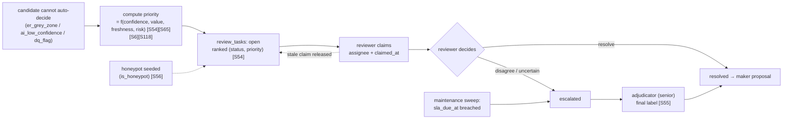
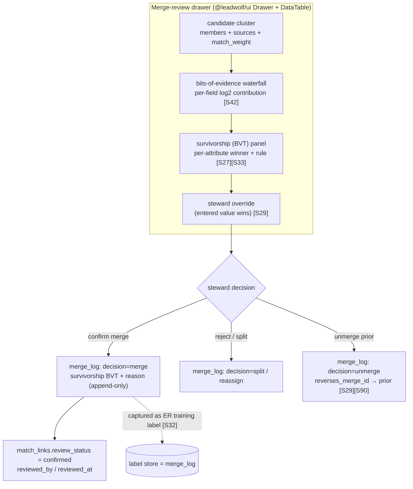
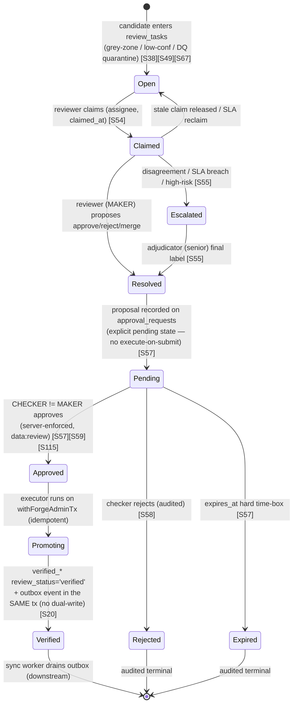

# 10 — Verification & Approval Workflow

> **Canonical contract:** this doc owns the **human verification & approval workflow** for TruePoint
> Forge — the maker-checker (four-eyes) gate that promotes parsed/extracted/resolved candidates into the
> **`verified_records`** gold layer, the single layer that syncs (`decision-ledger` L2). It is the deep
> design behind **`02 §FR-05`** (human verification & approval) and the reviewer half of **`02 §FR-06`**
> (dedup/merge adjudication). It reuses TruePoint's shipped **`approval_requests`** maker-checker engine,
> the **`data_ops`** staff role, and the **`data:review`** capability (`ecosystem-facts §C`) — Forge adds
> only a *distinct executor set* that governs the **verified-record → sync** promotion, never a second
> approvals engine. The gate is **pending-then-execute-on-approval** [S57] with **initiator ≠ approver
> enforced in the write path** [S57][S59][S115]; every decision lands in the immutable, hash-chained
> **`forge_audit_log`** (`ecosystem-facts §C`). **Locking ADR: ADR-0047** (Forge owns ER + versioned
> master-sync — the promotion this gate guards is the only egress to the production CRM).

This doc **owns** the review queue (prioritization, assignment, SLA, escalation), the dedup/merge &
survivorship **review UX**, adjudication + inter-reviewer agreement, bulk review actions, the approval
**state machine** and what a promotion writes, the audit-trail/record-history read model, and reviewer
productivity metrics. It does **not** restate the **table/column schema** (owned by `05-database-design`
— `review_tasks`, `approval_requests`, `match_links`, `merge_log`, `verified_*`, `verified_record_events`,
`forge_audit_log`, `sync_outbox`), the **pipeline stage contracts** S5/S6 (owned by
`06-data-pipeline-architecture`), the **ER math** (Fellegi-Sunter, term-frequency, two-threshold bands —
owned by `05 §Group 6` + `06-data-pipeline-architecture`, with `17-scalability-and-performance` for
blocking at scale / `@forge/core`), the **AI-extraction grounding/confidence** (owned by
`09-ai-extraction-engine`), the **weighted-DAMA rule catalog** (owned by `05 §Group 5` +
`06-data-pipeline-architecture`), the **sync wire contract** (owned by `11-database-synchronization-engine`),
or the **lineage store & tamper-evidence mechanism** (owned by `05 §Group 11` + `15-observability`).
Current-state TruePoint facts cite `_context/ecosystem-facts.md` by
`§`; industry practice cites `[S#]` in `_context/research-corpus.md`; frozen vocabulary is
`_context/decision-ledger.md` (L1–L11).

> **Numbering note.** `02`/`06`'s *provisional* ownership maps call this surface
> `09-human-review-and-verification`; the settled suite numbering places it at **Doc 10**. The settled
> cross-link owners are: **entity-resolution / ER-math** = `05 §Group 6` + `06` (+`17` for blocking at
> scale), **AI-extraction** = `09`, **data-quality** = `05 §Group 5` + `06`, **sync contract** = `11`,
> **audit & lineage** = `05 §Group 11` + `15` (there is no standalone entity-resolution, data-quality, or
> audit/lineage doc — those live in the cited sections). The owners named here are unambiguous.

---

## Objectives

1. Turn `02 §FR-05` into a **buildable four-eyes gate**: the exact states a candidate passes through from
   review-queue entry to `verified_records` promotion, the write-path enforcement of maker ≠ checker, and
   the precise set of rows a promotion writes.
2. Specify the **`review_tasks` queue** as an **agreement/confidence-ranked** work surface [S54] — a
   prioritization score over **confidence, value, freshness, and risk**, a claim-based assignment model,
   an **SLA** clock, and an **escalation → adjudication** tier [S55].
3. Design the **dedup/merge & survivorship review UX** — candidate clusters, a **field-level survivorship
   (best-version-of-truth) panel** [S27][S33], the **bits-of-evidence** explanation of each merge [S42],
   and **reversible unmerge/split** as an append-only compensating `merge_log` action [S29][S90].
4. Define **adjudication + inter-reviewer agreement** (IAA as the quality proxy [S54], gold-standard
   honeypots for reviewer scoring [S56]) and **bulk review actions** (select-all-filtered, async
   partial-failure, undo) [S60].
5. Fix the **audit-trail & record-history** read model over `forge_audit_log` + `verified_record_events`,
   and the **reviewer productivity metrics** that drive onboarding, retraining, and throughput planning
   [S56][S58].
6. Register the workflow gaps (`G-FORGE-1001…1006`), risks, milestones, deliverables, and open questions —
   every requirement scoped to **extend, not duplicate**, TruePoint's shipped data-ops surface
   (`ecosystem-facts §C`).

Non-goals: schema (`05`), stage retry/DLQ mechanics (`12-queue-and-worker-architecture`), the ER scorer and
threshold math (`05 §Group 6` + `06`, with `17` for blocking at scale), the sync request/response shape
(`11-database-synchronization-engine`), and the ADR texts (`docs/planning/decisions/ADR-0047`).

---

## Industry practice (cited [S#])

**Maker-checker / four-eyes is a code-level control, not a UI convenience.** The pattern requires **≥2
distinct individuals per transaction** and the initiator can **never** approve their own request —
segregation of duties enforced **in the write path**, not merely hidden in the console [S57][S59]. In a
correct implementation the operation **does not execute on submission**: it sits in an explicit **pending**
state and executes **only** after checker approval [S57]. A **tamper-proof audit trail** logging maker
initiation, checker review, and the final decision (timestamps + identities) is core to the pattern and is
the **primary compliance/fraud-investigation evidence artifact** [S58]. ISO/IEC 27001 Annex A 5.3 formally
mandates segregation of duties, giving the pattern an external compliance basis beyond fintech convention
[S59]. ABAC expresses the rule precisely as a policy comparing a **subject attribute to a resource-owner
attribute** — "no subject may approve a resource whose owner equals the subject" [S115].

**Order the queue by disagreement, not FIFO.** Inter-annotator agreement (IAA) via pairwise agreement is
the industry-standard proxy for review quality, and **low agreement signals ambiguous guidelines or genuine
edge cases**, not merely careless reviewers [S54]. The recommended queue policy is to surface the **most
uncertain/contentious tasks first** ("don't boil the ocean") — confidence/disagreement ranking over
arrival order [S54]. When reviewers disagree (with each other or with ground truth), **adjudication by a
senior expert** producing the single final label is the standard resolution — a distinct tier above the
ordinary checker [S55]. **Gold-standard "honeypot" tasks** seeded into the queue score individual reviewer
accuracy and drive onboarding/retraining via real-time per-reviewer dashboards [S56].

**Confidence gates the auto/human split.** Azure Document Intelligence emits per-field confidence and
recommends **threshold-gated routing**: ≥0.80 straight-through, human review below, ~100% for sensitive
data — thresholds **calibrated per use case via a pilot**, not adopted blind [S49]. Crucially, structured
extraction's confidence must be **derived** (source-grounding match + validator agreement + judge score),
because LLMs do not natively produce calibrated confidence and a self-reported number is unreliable [S49].
LLM-as-judge is a viable regression/adjudication aid **but carries measurable biases** (position, verbosity,
self-enhancement) that must be mitigated (randomize order, hide identity, multi-judge disagreement analysis)
[S50][S51].

**Survivorship is a per-attribute, reviewable decision.** The golden record assembles its **strongest
fields from different source records** (best-version-of-truth at the **cell/attribute** level), not a single
winning whole record [S27]. Survivorship should rank **source authority + validation + completeness above
naive recency** — Reltio's recency-default is a known footgun where a stale-but-authoritative source is
overwritten by a fresh low-quality one [S28][S33]. Stewards get a **two-tier** model: an automated
consolidation rule plus an **override rule where steward-entered values win**, and **unmerge/split is a
manual steward action, not automatic** [S29]. Merge groups carry **durable confirmation states**
(Not/Partially/Previously/Confirmed) so a human-ratified grouping is distinguished from a machine-proposed
one [S29]. The **log-base-2 bits-of-evidence** waterfall is what makes a probabilistic merge decision
**auditable/explainable** to a reviewer and **defensible for DSAR/audit** [S42]. Choosing which source's
value wins is the **data-fusion / truth-discovery** problem — jointly weigh source trustworthiness ×
value truthfulness, **not** naive majority vote [S92].

**Review-console + bulk-action UX.** The canonical console is a **searchable/filterable queue** of pending
items plus a **detail panel showing the full before/after diff** of what is changing [S61]. Bulk actions
should support **"select all across the filtered set" with an explicit count**, reserve confirmation dialogs
for **destructive/irreversible** actions, and offer **immediate undo via toast** for recoverable ones [S60].
Bulk operations at scale need **multi-level async feedback** — per-row loading, a succeeded/failed summary,
and **inline drill-down per failed item** ("180 approved, 20 blocked by dedup conflict") [S60]. Failing
records are **quarantined, not discarded**, so they feed the review loop rather than vanish [S67], and the
promotion gate scores quality as a **weighted DAMA composite** where a join-key null ≫ a cosmetic issue
[S63].

---

## Current-state — what already exists in TruePoint (cite `ecosystem-facts`)

Forge **reuses the shipped maker-checker machinery** and extends only the gate it guards. The building
blocks (`ecosystem-facts §C`, unless noted):

| Shipped surface (`ecosystem-facts`) | What it gives Forge | The gap Forge fills |
|---|---|---|
| **`approval_requests`** table (`platformOps.ts`) + executors in `apps/api/.../dataRoutes.ts`, each `requireCapability("data:*")`, every mutation on audited **`withPlatformTx`** (§C) | the pending→execute-on-approval engine + audited executor pattern; e.g. the `dedup_merge` Grain-A **overlay** merge | Forge needs a **distinct executor set** governing the **verified-record → sync** promotion — same engine, new gate (**G-FORGE-202**, `02`) |
| **`data_ops`** staff role + **`data:read/manage/review/export`** capabilities (`staffCapability.ts`); `super_admin` implies all; enforced by `requireStaffRole`/`requireCapability` middleware (§C) | the reviewer/steward identity + the **`data:review`** capability the gate keys off | mapped from SSO (`decision-ledger` L6); **no new capability** unless one has no TruePoint analog (`02 §G-FORGE-209`) |
| **`match_links`** with `review_status ∈ auto\|pending\|confirmed\|rejected` (§B); soft overlay dedup `prospect/dedup.ts` (`duplicate_of_contact_id`, `pickCanonical` precedence) (§C) | the review-lineage columns + a canonical-pick precedence baseline | Forge owns ER (`decision-ledger` L4), so the grey-zone → `pending` → steward → `confirmed` loop is **Forge-side**, with **field-level survivorship override** `pickCanonical` lacks |
| **`apps/admin` data-ops UI** — Next.js 15 App Router + React 19; `features/data-ops/` **approvals / dedup / verification** pages, `useDedupReview`/`useDataOpsOverview` hooks, `api.ts → /api/v1/admin/data/*` (§C) | a working approvals/dedup/verification console shape + hooks to mirror | Forge's dashboard is a **separate app** (`@forge/*`) reusing **pinned `@leadwolf/ui`** — divergence risk (**OQ-6**, `02 §G-FORGE-206`) |
| **`@leadwolf/ui`** kit — `StateSwitch`/`LoadingState`/`EmptyState`/`ErrorState`, `DataTable`, `StatTile`, `StatusBadge`, `Card`, `Pagination`, `Tabs`/`SegmentedControl`, `Dialog`/`Drawer`, `Combobox`, `Toast`; tokens `var(--tp-*)`; `fetchWithAuth` (§C) | the entire review-console component vocabulary (queue table, detail drawer, diff, bulk toolbar, toast-undo) | consumed as-is; the **survivorship BVT panel** + **bits-of-evidence waterfall** are Forge-composed views over these primitives |
| Platform **`platform_audit_log`** (immutable, written in-tx by `withPlatformTx`/`recordPlatformEvent`, ADR-0032) + product **`activities`** timeline (§C, §D) | the immutable-audit idiom Forge's **`forge_audit_log`** mirrors (hash-chained, `withForgeAdminTx`, `05 §Group 11`) | Forge adds a **Forge-owned audit vocabulary** + **hash-chain + external anchoring** (append-only alone is not tamper-evident, **G-FORGE-504**, `05`) |

**The one-line summary of the gap.** TruePoint already knows how to run a maker-checker overlay merge; it
does **not** have a governed gate that promotes a Forge-resolved golden candidate into a syncable
`verified_records` row under four-eyes, agreement-ranked, SLA'd, with reversible field-level survivorship
and a tamper-evident trail. That gate is this doc.

---

## Design

### 1 — Actors & the four-eyes boundary

Three human roles and one machine principal touch this workflow (personas fixed in `02 §Actors`):

| Actor | Capability (`§C`) | Role in the gate |
|---|---|---|
| **Reviewer / data steward** | `data:read`, `data:review` | works the `review_tasks` queue; the **maker** who proposes approve/reject/merge on a candidate |
| **Adjudicator** (senior steward) | `data:review` (+ elevated) | the **checker** and the escalation tier — approves promotion (≠ maker) and resolves inter-reviewer disagreement [S55] |
| **Data-ops admin** | `data:manage` (+ `super_admin`) | configures thresholds, SLAs, honeypots, and the high-risk-op approval policy; does **not** self-approve the data path |
| **Machine sync principal** | non-human `scope=master-sync` | drains the outbox *after* promotion; **never** a party to the approval (`decision-ledger` L5) |

**The boundary is a write-path invariant, not UI polish.** A promotion is a mutation on
`approval_requests` where the executor asserts `requested_by_user_id != decided_by_user_id` **server-side**
before it runs [S57][S115] (mirrors the shipped `approval_requests` shape, `05 §Group 9`). The console may
*also* hide the "approve" button on your own request, but that is defense-in-depth — the enforcement is the
executor check, gated by `data:review`, run inside `withForgeAdminTx` so the audit row is written in the
same transaction (`05 §Group 11`). Security owns the deep enforcement design (the ABAC owner-equality
policy, per-layer roles) in the security doc; this doc fixes only that the gate **is** four-eyes and
where the check sits.

### 2 — The review queue (`review_tasks`): prioritization, assignment, SLA, escalation

The queue is the reviewer's primary surface. Its schema (`review_tasks`) is owned by `05 §Group 9`; this
doc owns its **behavior**.

**What enters the queue.** A `review_tasks` row is created whenever the pipeline cannot decide safely on
its own (`06 §Stage contracts`, S4/S3/S2):

| `task_type` | Source condition | Grounding |
|---|---|---|
| `er_grey_zone` | match weight between the auto-merge and auto-reject thresholds | [S38] |
| `ai_low_confidence` | derived extraction confidence below the straight-through threshold | [S49] |
| `dq_flag` | weighted-DAMA gate failed → quarantine lane | [S63][S67] |
| `merge_review` | a proposed merge/unmerge needs steward confirmation | [S29] |
| `manual` | operator-raised for triage | — |

**Prioritization — the queue is ranked, never FIFO** [S54]. Each task carries a `priority` integer derived
from a composite score so the **most contentious/valuable/decaying/risky** work floats to the top. The four
inputs (the brief's confidence · value · freshness · risk), each cited:

| Signal | Meaning | Why it ranks | Cite |
|---|---|---|---|
| **Confidence / disagreement** | how uncertain the model/ER decision is (`review_tasks.confidence`, lower = higher priority) | low agreement = genuine edge case or ambiguous guideline — review it first | [S54][S49] |
| **Value** | downstream importance of the entity (e.g. attribution to a high-intent tenant, decision-maker seniority, corroboration count) | mirrors Databricks tiering monitoring by criticality/downstream usage, not uniformly | [S65] |
| **Freshness** | age since capture / decay pressure (B2B data decays ~2.5%/mo, so a stale grey-zone record loses value fast) | rank decaying records up so review happens before the value evaporates | [S6][S26] |
| **Risk** | promotion blast-radius (bulk cluster, sensitive PII, India-origin DPDP data, irreversible-ish merge) | a high-risk promotion warrants earlier, more senior eyes | [S118][S57] |

The score is a **weighted composite** (a flat blend is discouraged, mirroring the weighted-DAMA rationale
[S63]); the exact weights are **admin-tunable** and need Forge-data calibration (**OQ-R12** for the
confidence band that defines grey-zone entry in the first place). `priority` is materialized on write and
recomputed by a `maintenance` sweep as freshness/decay shifts, so the ranked read is a cheap
`(status, priority)` index scan (`05 §review_tasks` indexes).

**Assignment — claim, not push.** A reviewer pulls the top-ranked `open` task; the executor sets
`status='claimed'`, `assignee_user_id`, `claimed_at` (`05`). A claimed task is invisible to other
reviewers, avoiding double-work, and a stale claim past a hold window is auto-released back to `open` (the
SLA sweep, below). **Gold-standard honeypots** (`is_honeypot`) are seeded into the pull stream at a low
rate so a reviewer cannot tell a scored task from a real one — the honeypot's known answer scores the
reviewer without extra labeling cost [S56].

**SLA + escalation.** Each task carries `sla_due_at` (set from `task_type` × priority — a high-risk
grey-zone merge gets a tighter clock than a cosmetic DQ flag). A `maintenance` sweep scans
`sla_due_at WHERE status IN ('open','claimed')` (`05` partial index) and, on breach or on reviewer-flagged
disagreement, transitions the task to **`escalated`** — routing it to the **adjudication tier** (a senior
steward whose single decision is final [S55]). Escalation is also the destination when two reviewers
disagree on the same subject (low IAA), turning a disagreement into a durable, audited adjudication rather
than a silent tie-break.

### 3 — The dedup / merge & survivorship review UX

This is the reviewer-facing counterpart of `02 §FR-06` (Forge owns ER). The **math** (Fellegi-Sunter,
term-frequency adjustment, the two-threshold bands) is owned by `05 §Group 6` + `06` (with `17` for
blocking at scale); this doc owns
**what the steward sees and does**. The review surface is a Forge-composed view over `@leadwolf/ui`
primitives (`Drawer`, `DataTable`, `StatusBadge`, `Card`, `Toast`, §C), reading `match_candidates` /
`match_links` / `merge_log` (`05 §Group 6`).

**(a) Present the candidate cluster.** The detail drawer shows the proposed cluster: the member
`parsed_records`, each member's source (`raw_captures.source` + `endpoint`), and the **before/after diff**
of the golden entity the merge would produce [S61]. `match_links` carries both `match_probability`
(Fellegi-Sunter) and `match_weight` (the additive log₂ bits) so the drawer renders an **explainable
bits-of-evidence waterfall** — each field's contribution to the merge, positive or negative — which is
what makes the decision auditable and DSAR-defensible [S42]. The steward never approves a black-box merge.

**(b) Field-level survivorship (best-version-of-truth) panel.** The golden record is assembled **per
attribute**, not by picking one winning record [S27]. For each output field, the panel shows every
candidate value, its source, corroboration (`source_count`), freshness, and the **rule that selected the
survivor** — Forge ranks **authority + validation + completeness above naive recency** [S28][S33][S92], the
opposite of Reltio's recency-default footgun. The steward can **override** any field: a two-tier model
where the automated consolidation rule proposes and the **steward's entered value wins** [S29]. Overrides
are the maker's proposal; they still pass the four-eyes checker gate (§4/§5).

**(c) Reversible unmerge/split.** Merge/unmerge/split is a **manual steward action, not automatic** [S29],
and it is **reversible** [S29]. Every decision is an **append-only** `merge_log` row carrying the
per-attribute BVT (`survivorship` jsonb), the `match_weight` at decision, the `decided_by` steward, and a
`reason` (`05 §merge_log`). An **unmerge is a new compensating `merge_log` row** (`decision='unmerge'`,
`reverses_merge_id → the prior merge`), **never** a destructive update — the event-sourced discipline that
preserves the full history and lets a bad merge be rolled back without losing the evidence [S90]. Merge
groups carry the durable confirmation state (`match_links.review_status` auto→pending→confirmed) so a
human-ratified cluster is distinguished from a machine-proposed one [S29]. Every steward merge/reject is
also **captured as an ER training label** for future model tuning [S32] (`merge_log` is the label store).

### 4 — Adjudication & inter-reviewer agreement

**IAA is the quality signal.** Where two reviewers (or a reviewer and a honeypot) touch the same subject,
their **pairwise agreement** is the industry-standard quality proxy — and **low agreement flags ambiguous
guidelines or genuine edge cases**, not just careless reviewers [S54]. Forge computes IAA per reviewer-pair
and per `task_type`; a systematically low-agreement `task_type` is a signal to **fix the guideline or the
threshold**, not to blame the reviewers. Disagreement does not resolve itself: a disagreed subject
**escalates to the adjudication tier**, where a senior steward produces the **single final label** [S55]
(`review_tasks.status='escalated'` → `resolution` set by the adjudicator).

**LLM-as-judge as an adjudication aid — with bias guards.** For high-volume grey zones, an LLM judge can
pre-rank or pre-screen candidates for the human adjudicator, and (because same-prompt+model runs are
approximately reproducible) it doubles as a **regression detector** across parser/extraction versions
[S51]. It is an *aid*, never the authority: judges carry **position, verbosity, and self-enhancement
biases** (up to ~75% first-position preference), so any judge use **randomizes order, hides identity, and
analyzes multi-judge disagreement** [S50][S51]. A judge score is one input to `review_tasks.confidence`;
the promotion is still a human four-eyes decision.

### 5 — The approval state machine + what a promotion writes

The gate has **two tracks**, both on the shipped `approval_requests` engine (`05 §Group 9`, §C):

- **Track A — per-record verification.** A reviewer resolves a `review_tasks` row (the **maker** proposal:
  approve / reject / merge). Resolved proposals are batched into an `approval_requests` row that a
  **different** steward (the **checker**, `decided_by_user_id != requested_by_user_id`) approves; the
  executor then promotes the batch to `verified_records`. Batching resolved tasks into one approval is the
  normal high-throughput path (bulk approve, §6) — the four-eyes invariant holds per record because the
  checker sees each item's diff before approving [S61].
- **Track B — high-risk bulk operations.** Bulk verify-promote, bulk merge, a retention-enforce flip, bulk
  export, or a bulk sync-replay are **high-risk op classes** gated directly by `approval_requests`
  (pending → execute-on-approval [S57], hard `expires_at` time-box, `05 §approval_requests`). These never
  run on submission.

**The state machine (this doc's required diagram).** This is the **review/approval-centric** view — the
reviewer's task lifecycle joined to the approval executor — distinct from the record-centric machine in
`06 §The end-to-end pipeline` and the four-state journey in `02 §J4`.

**What a promotion writes (the load-bearing table).** When the checker approves, the executor runs **one
idempotent transaction** on `withForgeAdminTx` (`05 §DB roles`; the `forge_er`/`forge_admin` grant that may
write `verified_*`). It writes exactly this set — and the **`sync_outbox` row is written in the same
transaction** to kill the dual-write hazard [S20] (`06 §Sync handoff`):

| # | Table (owner `05`) | Row written | Purpose / cite |
|---|---|---|---|
| 1 | `verified_*` (persons/companies/employment/emails/phones) | UPSERT the golden row; set `review_status='verified'`, `confidence`, `approved_by`, `approval_request_id`, `verified_at`; channel PII as **`*_enc` AES-GCM + `*_blind_index` HMAC** | the gold record; PII scheme honored verbatim so sync is a straight map (§B, `05 §Group 7`) |
| 2 | `match_links` | set `review_status='confirmed'`, `reviewed_by`, `reviewed_at` | resolution ratified upstream; syncs as `confirmed` (§B, `decision-ledger` L5) |
| 3 | `merge_log` | append the survivorship/BVT decision (if a merge) — reversible, ER training label | per-attribute winner + `match_weight` (auditable [S42][S32]) |
| 4 | `verified_record_events` | append `event_type='verified'` (or `created`/`merged`), bump `version`, record `winning_source` (where-provenance) + `source_record_ref` (`hadPrimarySource`) | event-sourced record history / supersede detection [S89][S90][S92] |
| 5 | `sync_outbox` | append `event_type='verified.upserted'`, `payload` = ciphertext + blind index + `content_hash` (**no clear PII**) — **same tx as row 1** | transactional outbox → effectively-once sync [S20][S21] |
| 6 | `sync_state` | UPSERT `(entity_kind, verified_id)` → `status='pending'` | per-record sync ledger (`decision-ledger` L2) |
| 7 | `approval_requests` | `status='executed'`, `executed_at` | the gate's own state (mutable; the immutable trail is row 8) |
| 8 | `forge_audit_log` | append `action='review.approved'` / `merge.decided` / `verify.promoted`, hash-chained (`prev_hash`/`row_hash`) | immutable, tamper-evident trail (§7) [S58][S91] |

A **reject** writes rows 7 (`status='rejected'`) and 8 (`action='review.rejected'`) only — no
`verified_*`, no outbox, no egress. The candidate stays inspectable/replayable in its quarantine lane
(`06 §Schema-drift`), never silently dropped [S67]. The executor is **idempotent** — a replayed approval is
a no-op UPSERT on `content_hash` + `(entity_kind, verified_id)` (`05 §Idempotency spine`), so a retried job
never double-promotes.

### 6 — Bulk review actions

Reviewers work at volume, so bulk is a first-class flow, built to the bulk-action UX rules [S60] over
`@leadwolf/ui` (`DataTable` selection + `Toast`, §C):

- **Select-all-across-the-filtered-set with an explicit count** ("approve all 214 grey-zone matches for
  source X") — not just the visible page [S60].
- **Confirmation dialog only for the irreversible** (bulk hard-reject, retention flip); **immediate
  toast-undo** for recoverable actions (a bulk approve is undoable within a window because promotion is a
  keyed UPSERT and a fresh compensating decision reverts it) [S60].
- **Async multi-level feedback** — a bulk approve enqueues per-item executors and returns a summary:
  per-row loading → a succeeded/failed rollup → **inline drill-down per failed item** ("180 approved, 20
  blocked by dedup conflict, 14 blocked by DQ") so the reviewer fixes the tail without re-running the whole
  batch [S60]. This maps onto the async partial-failure AC in `02 §FR-05(d)`.
- **Four-eyes still holds per item.** A bulk approve is one `approval_requests` row whose checker ≠ the
  makers of the underlying resolutions; the executor **skips (does not silently pass) any item where the
  approver equals that item's maker** [S57][S115] — the summary reports those as blocked, never
  auto-approved.

Complex multi-step bulk survivorship edits use a **wizard** (select → choose fields → resolve conflicts →
review diff → apply) rather than one mega-action [S60].

### 7 — Audit trail & record history

**Every decision is evidence.** The maker initiation, checker review, and final decision — with timestamps
and identities — land in **`forge_audit_log`** (`05 §Group 11`), Forge's mirror of `platform_audit_log`
written in-tx by the `withForgeAdminTx`/`recordForgeEvent` idiom (§C, ADR-0032). This is the **primary
compliance/fraud-investigation artifact** and the DSAR evidence trail [S58]. Because **append-only alone is
not tamper-evident**, rows are **hash-chained** (`row_hash = H(prev_hash ‖ canonical(row))`) and the chain
root is **externally anchored** (per-month Merkle root) — a control that has no TruePoint analog yet
(**G-FORGE-504**, `05`) and whose anchoring mechanism is **OQ-R17** [S91]. `actor_kind` distinguishes the
**AI-extractor from the human maker/checker** (PROV `Agent` [S89]).

**Record history is reconstructable end-to-end.** A verified record's full lineage — raw → parsed →
verified → synced, with who/what/when at each step — is read from `verified_record_events` (field-level,
event-sourced, versioned [S90]) joined to `pipeline_runs` (the OpenLineage Run graph) and
`parsed_field_provenance` (which raw JSON path each field came from, where-provenance [S93]). The steward's
history panel answers "which source won this field, under which parser version, approved by whom" for any
record — the field-winner selection is the recorded data-fusion decision [S92][S42]. The lineage **store,
traversal API, and tamper-evidence mechanism** are owned by `05 §Group 11` + `15-observability`; this doc owns only the
**decision events** the gate emits (rows 3, 4, 8 above) and the **read model** the console renders.

### 8 — Reviewer productivity metrics

Productivity metrics drive onboarding, retraining, throughput planning, and threshold calibration — they
are computed from `review_tasks`, `approval_requests`, `merge_log`, and `forge_audit_log`, surfaced as
`@leadwolf/ui` `StatTile`s on an ops dashboard:

| Metric | Definition | Drives | Cite |
|---|---|---|---|
| **Throughput** | resolved tasks / reviewer / hour | capacity planning, SLA feasibility | [S56] |
| **Grey-zone median review time** | claimed → resolved latency (the `02 §J4` success metric) | SLA tuning, staffing | `02 §FR-05` |
| **Inter-reviewer agreement (IAA)** | pairwise agreement per reviewer-pair / `task_type` | guideline & threshold quality (low IAA = ambiguous rules) | [S54] |
| **Honeypot accuracy** | reviewer's decisions on seeded gold-standard tasks | per-reviewer onboarding/retraining, real-time dashboard | [S56] |
| **SLA adherence** | % resolved before `sla_due_at`; escalation rate | queue health, adjudicator load | [S55] |
| **Reversal rate** | merges later unmerged / rejections later overturned | model-threshold recalibration, guideline gaps | [S29][S32] |
| **Four-eyes integrity** | self-approval attempts blocked (must be **0**) | control assurance (the `02 §FR-05` success target) | [S57] |
| **Approval turnaround** | maker-resolve → checker-approve latency | checker staffing, backlog risk to sync freshness | [S57] |

Honeypot accuracy and IAA feed the **onboarding/retraining loop** [S56]: a reviewer below a honeypot-accuracy
floor is routed more gold tasks and fewer high-risk live ones until they recover.

---

## Security considerations

Security has final say (CLAUDE.md precedence); deep enforcement is owned by the security doc — this section
states the workflow's obligations.

- **Four-eyes is enforced server-side, not in the UI.** The `requested_by_user_id != decided_by_user_id`
  check runs in the executor before promotion, expressed as the ABAC owner-equality policy "no subject may
  approve a resource whose owner equals the subject" [S115][S57]. Hiding the button is defense-in-depth
  only. Self-approval attempts are counted and must be **0** (§8).
- **`data:review` gates every decision path.** Claim, resolve, approve, reject, merge, and bulk actions all
  require `data:review`; high-risk op classes (Track B) additionally require the admin-configured approval
  policy (`05 §approval_requests`). No capability is minted that lacks a TruePoint analog without flagging
  it (`02 §G-FORGE-209`, `decision-ledger` L6).
- **Least-privilege on the write path.** The console BFF role (`forge_app`) may **record** review decisions
  but **cannot decrypt PII (`*_enc`) or write `verified_*` directly** (`05 §DB roles`); promotion runs under
  `forge_er`/`forge_admin`. Reviewers verify against **grounded spans and blind-index-backed diffs**, not
  by decrypting channel PII — decrypt is a separate gated reveal path, never granted to the review surface
  [S121][S122].
- **The compliance firewall is upheld at the gate.** A promotion writes **ciphertext + blind index only**
  to `sync_outbox` — clear PII never crosses to the CRM (§B, `decision-ledger` L5). A rejected record never
  reaches the outbox at all.
- **The audit trail is tamper-evident, not merely append-only.** Hash-chaining + external Merkle anchoring
  [S91]; only `forge_admin` may `UPDATE/DELETE` `forge_audit_log` (`05 §Group 11`), and every gate decision
  is written in the same transaction as the mutation it records.
- **DSAR/erasure reaches the gate's outputs.** A suppressed subject fans out to `verified_*.is_suppressed`
  and a `verified.suppressed` outbox event; the review console must **not** resurface an erased subject.
  Erasure semantics are owned by the security/data-retention docs [S117].

---

## Scalability considerations

Deep capacity math and autoscaling topology are owned by the scalability doc; the workflow's scale posture:

- **The queue read is index-cheap.** Ranked pulls hit `review_tasks (status, priority)`; SLA sweeps hit the
  partial `sla_due_at WHERE status IN ('open','claimed')` index; per-assignee views hit
  `(assignee_user_id, status)` (`05 §review_tasks`). `priority` is materialized on write and refreshed by a
  `maintenance` sweep, so ranking is never an online sort over the whole queue.
- **Human review is the pipeline's slowest stage — bound it, don't block on it.** Grey-zone review latency
  is **human-bounded** and tracked as a queue-age signal, **not** a hard freshness SLO (`06 §Per-stage
  SLOs`). The pipeline decouples: everything auto-decidable flows straight through; only the grey zone
  waits on humans, so a review backlog grows a **bounded, monitored queue**, it does not stall ingest or
  parse for other records (`06 §Ordering`).
- **Shrink the grey zone to scale the humans.** The single biggest scale lever is the auto-merge /
  auto-reject threshold calibration (**OQ-R12**) — a well-tuned band routes only genuinely ambiguous pairs
  to humans (~0.05–1% of comparisons after blocking, [S39]). A **weak-supervision auto-verify** lane
  (treat versioned parsers + AI + honeypot-scored reviewers as labeling functions combined by a consensus
  model) could auto-clear high-agreement clusters and reserve humans for the true grey zone — **OQ-R10**
  [S62].
- **Bulk actions are async and idempotent.** A bulk approve enqueues per-item idempotent executors, so a
  10k-item batch is throughput-bounded by workers, not by one long transaction, and a retry never
  double-promotes (`05 §Idempotency spine`).
- **Adjudication is the escalation valve.** Escalation caps senior-steward load — only disagreed/SLA-breached
  /high-risk tasks reach the adjudicator [S55], keeping the expensive tier small.

---

## Risks & mitigations

Workflow gaps use **`G-FORGE-1001…1006`** (disjoint block assigned to this doc so gap-IDs stay unique
across the suite, `decision-ledger` L9). Mapped to `28-enterprise-readiness-audit.md` where a TruePoint
gap is relevant.

| Risk / gap | Area | L × I | Mitigation (cite) |
|---|---|---|---|
| **G-FORGE-1001** — the **verified→sync promotion executor set** (four-eyes, idempotent, writes rows 1–8) has no TruePoint analog (shipped executors govern *overlay* merges) | platform / data | High × High | build a distinct `approval_requests` executor set on `withForgeAdminTx`; reuse the engine, change the gate (extends **G-FORGE-202**) |
| **G-FORGE-1002** — **agreement/confidence-ranked queue** with the confidence·value·freshness·risk scorer is unbuilt; `useDedupReview` is unranked | data | High × Med | materialize `review_tasks.priority` from the weighted composite; `maintenance` refresh [S54][S65] |
| **G-FORGE-1003** — **SLA clock + escalation → adjudication tier** unbuilt (`sla_due_at`, `status='escalated'`) | operations | Med × Med | SLA sweep on the partial index; escalation routes to senior steward [S55] |
| **G-FORGE-1004** — **honeypot seeding + IAA + reviewer productivity dashboard** unbuilt | data / operations | Med × Med | seed `is_honeypot` tasks; compute IAA & honeypot accuracy; StatTile dashboard [S54][S56] |
| **G-FORGE-1005** — **reversible field-level survivorship review UX** unbuilt (TruePoint `pickCanonical` has no steward BVT override / unmerge) | data | Med × High | BVT panel + steward override; unmerge = compensating `merge_log` row [S27][S29][S90] |
| **G-FORGE-1006** — **bulk review actions** (select-all-filtered, async partial-failure, toast-undo) for the verified gate unbuilt | design / platform | Med × Med | async per-item idempotent executors + summary + drill-down [S60] |
| Reviewer approves a well-typed AI hallucination | data / security | Med × High | structure ≠ correctness — grounded spans + validator + judge + four-eyes gate [S47][S48][S49] (§4/§5) |
| Recency-default survivorship overwrites an authoritative value | data | Med × Med | rank authority + validation + completeness above recency; per-attribute steward override [S28][S33] (§3b) |
| Bulk approve smuggles a self-approval | security | Low × High | executor skips (reports blocked) any item where approver == item maker [S57][S115] (§6) |
| Audit trail forged/rewritten | security / ops | Low × High | hash-chain + external Merkle anchor; `forge_admin`-only UPDATE/DELETE [S91] (**G-FORGE-504**, §7) |
| Review backlog stalls sync freshness | operations | Med × Med | decouple (bounded queue, not blocked ingest); shrink grey zone via threshold calibration + auto-verify [S39][S62] (OQ-R10/R12) |
| Judge/adjudication bias skews labels | data | Med × Med | randomize order, hide identity, multi-judge disagreement; judge is an aid, not the authority [S50][S51] (§4) |

---

## Milestones

Slots into the M-FORGE build order (`06 §Milestones`); this doc owns the review/approval exit criteria.

| Milestone | Delivers (workflow) | Exit criterion |
|---|---|---|
| **M-FORGE-D — Quality + verify** | the four-eyes gate: `review_tasks` ranked queue, `approval_requests` executor set, promotion writing rows 1–8 in one tx | **no** record verifies without a checker ≠ maker; a below-threshold record cannot promote; promotion + outbox commit atomically [S20][S57] |
| **M-FORGE-D.1 — Merge review UX** | candidate-cluster drawer, bits-of-evidence waterfall, field-level survivorship (BVT) panel + steward override, reversible unmerge via `merge_log` | a steward can confirm/override/unmerge a cluster; every decision is an append-only `merge_log` row; unmerge is a compensating row, not a delete [S29][S90] |
| **M-FORGE-D.2 — Queue governance** | prioritization scorer (confidence·value·freshness·risk), claim assignment, SLA sweep, escalation → adjudication, honeypot seeding | the queue is agreement-ranked not FIFO; SLA breaches escalate; honeypots score reviewers [S54][S55][S56] |
| **M-FORGE-D.3 — Bulk + metrics** | bulk review actions (select-all-filtered, async partial-failure, toast-undo) + reviewer productivity metrics/dashboard | a bulk approve reports "N approved / M blocked" with drill-down; four-eyes holds per item; IAA + honeypot dashboards live [S60][S54] |
| **M-FORGE-F — Operate** | audit-trail read model (record-history panel), tamper-evidence anchoring, SLA/agreement alerting | any verified record's full history is reconstructable; the audit chain verifies against its anchored root [S89][S91] |

---

## Deliverables

1. The **review/approval state machine** (this doc's Mermaid) — the task lifecycle joined to the four-eyes
   approval executor, distinct from `06`'s record-centric machine and `02 §J4`.
2. The **`review_tasks` queue behavior** — the confidence·value·freshness·risk prioritization scorer, the
   claim-based assignment model, the SLA clock, and the escalation → adjudication tier.
3. The **dedup/merge & survivorship review UX** — candidate clusters, the bits-of-evidence waterfall, the
   field-level BVT panel with steward override, and reversible unmerge via append-only `merge_log`.
4. The **adjudication + IAA** model (disagreement → senior final label, honeypot scoring, bias-guarded
   judge aid) and the **bulk review action** spec (select-all-filtered, async partial-failure, undo).
5. The **promotion write-set table** (rows 1–8, outbox-in-tx) and the **audit-trail/record-history** read
   model over `forge_audit_log` + `verified_record_events`.
6. The **reviewer productivity metrics** catalog and the workflow **gap register `G-FORGE-1001…1006`**.

---

## Success criteria

1. **No record verifies without four-eyes** — `requested_by_user_id != decided_by_user_id` is enforced in
   the executor (not the UI); self-approval attempts are counted and are **0** [S57][S115]. ✅
2. **Nothing executes on submission** — a proposal sits in an explicit `pending` state and promotes only on
   checker approval; a reject/expire never touches `verified_*` or the outbox [S57]. ✅
3. **A promotion writes the full set atomically** — the `verified_*` row and its `sync_outbox` event commit
   in one transaction (no dual-write), with `match_links='confirmed'`, `merge_log`, `verified_record_events`,
   `sync_state`, and the hash-chained `forge_audit_log` row [S20][S58]. ✅
4. **The queue is agreement-ranked, SLA'd, and escalatable** — contentious/valuable/decaying/risky tasks
   surface first; SLA breaches and disagreements escalate to a senior adjudicator [S54][S55]. ✅
5. **Merges are explainable and reversible** — every merge shows its bits-of-evidence, survives at the
   attribute level with steward override, and unmerges via a compensating `merge_log` row [S42][S29][S90]. ✅
6. **Bulk is safe at volume** — select-all-filtered with a count, async partial-failure with per-item
   drill-down, toast-undo for recoverable actions, and four-eyes held per item [S60][S57]. ✅
7. **Every decision is auditable and every record's history reconstructable** — the tamper-evident
   `forge_audit_log` + event-sourced `verified_record_events` answer "who approved this, which source won
   which field, under which parser version" for any record [S58][S89][S91]. ✅
8. **No workflow decision is answered from first principles where a `§`/`[S#]` grounds it** — every reuse
   cites `ecosystem-facts §C`, every best-practice cites `[S#]` (CLAUDE.md mandatory-read rule). ✅

---

## Future expansion

- **Weak-supervision auto-verify lane (OQ-R10).** Treat versioned parsers + AI extractors + honeypot-scored
  reviewers as **labeling functions** combined by a consensus/label model to **auto-clear high-agreement
  clusters**, reserving humans for the true grey zone — the single biggest lever to scale review throughput
  without adding headcount [S62]. Forge's `merge_log` already accrues the training labels this needs [S32].
- **Active-learning threshold tuning.** Feed the steward's confirm/reject decisions back to re-estimate ER
  match weights and recalibrate the auto-merge/grey-zone/auto-reject bands (**OQ-R12**), so the grey zone
  shrinks as the model learns [S38][S40].
- **Per-role survivorship groups.** Reltio-style per-role survivorship rule sets [S28] — e.g. a compliance
  steward's authority ranking differs from a coverage steward's — layered over the default authority-first
  BVT once the single-policy model is proven.
- **Change-signal re-verification queue.** As "verified" records decay (~2.5%/mo [S6]), a field-level decay
  TTL (**OQ-R14**) re-opens stale high-value records into a dedicated re-verification lane rather than
  trusting a promotion forever [S26].
- **Cross-reviewer calibration sessions.** Systematically low-IAA `task_type`s trigger a guideline review
  and a shared calibration set, closing the loop between the IAA metric and the review guidelines [S54].

---

## Open questions

The full register lives in `_context/decision-ledger.md` (L11, OQ-1…6) and `01`'s research register
(OQ-R1…20); the workflow-shaping ones surface here.

- **OQ-R10 — Weak-supervision auto-verify vs human-review-every-record.** Whether high-agreement clusters
  **skip `review_tasks`** and auto-promote, or every promotion is maker-checker gated. This directly sizes
  the human review load and shapes how `review_tasks`/`approval_requests` throttle the verify stage. [S62]
- **OQ-R12 — Grey-zone threshold calibration.** The auto-merge / grey-zone / auto-reject bands (on
  `match_links.match_probability`) that decide **what enters the queue at all** need tuning on Forge data,
  gated by the block-size diagnostic — the primary knob on review volume. [S38][S39]
- **OQ-R15 — Survivorship default (authority + validation + completeness vs recency).** The exact
  per-attribute strategy menu and default ranking the BVT panel presents; recency-default is a known
  footgun, so Forge ranks authority first, but the precise per-field policy needs specifying. [S28][S33]
- **OQ-R17 — Audit tamper-evidence + lineage store.** The external Merkle-anchoring mechanism for
  `forge_audit_log` and whether the record-history read model adopts OpenLineage/Marquez or hand-rolls
  (**G-FORGE-504**, owned by `05 §Group 11` + `15-observability`). [S87][S91]
- **OQ-6 — `@leadwolf/ui` pin vs fork for the review console.** The BVT panel, bits-of-evidence waterfall,
  and bulk toolbar are Forge-composed over pinned `@leadwolf/ui`; a divergence between Forge's needs and
  TruePoint's kit could force a fork (`02 §G-FORGE-206`). Affects the review UX build.
- **OQ-3 — Sync is a one-way door.** Once a promotion syncs, the CRM `master_*` is a downstream projection;
  a post-sync correction is a **new superseding** promotion, not an in-place edit. Reversible unmerge covers
  the Forge-internal case; the cross-boundary correction path (supersede + reconciliation) is owned by
  `11-database-synchronization-engine`. [S25]
- **New (this doc) — Batch granularity of the four-eyes checker.** In Track A, how many resolved tasks one
  `approval_requests` row may batch before the per-item diff review becomes rubber-stamping — a UX/control
  trade-off (throughput vs genuine four-eyes scrutiny) needing a pilot ceiling. [S57][S61]
- **New (this doc) — Adjudicator independence.** Whether the escalation adjudicator must be disjoint from
  both the maker **and** the checker (three-eyes on contested items) or may be the checker escalating
  themselves — an SoD-depth decision for the security doc. [S55][S59]
