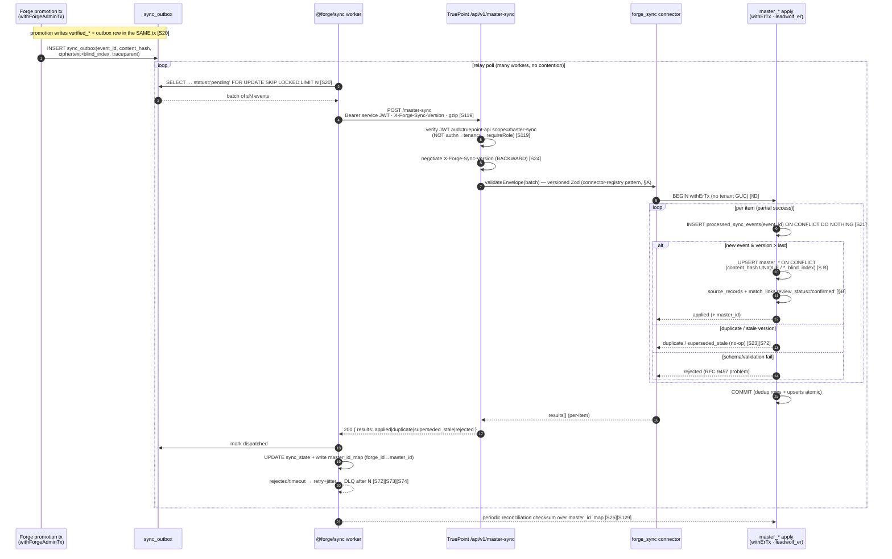
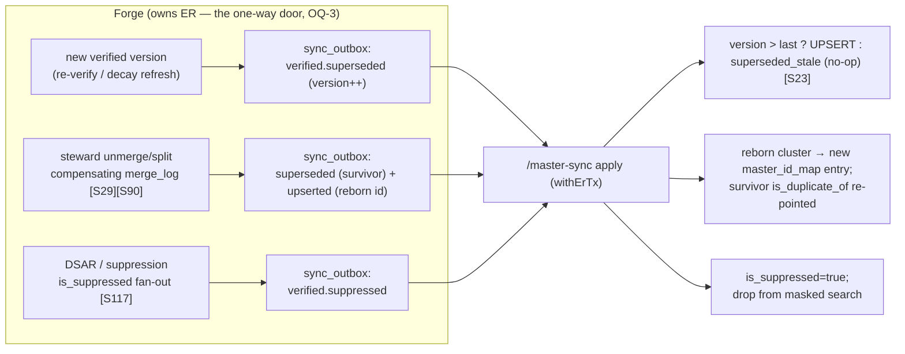

# 11 — Database Synchronization Engine

> **Canonical contract:** this doc owns the **versioned server-to-server sync contract** that carries
> TruePoint Forge's governed `verified_records` (Gold) into the TruePoint production CRM's `master_*`
> graph — the wire shape of **`POST /api/v1/master-sync`**, its `X-Forge-Sync-Version` header, its
> batch request/response schema, the Forge-side **transactional outbox + sync worker** (`sync_outbox`
> → `FOR UPDATE SKIP LOCKED` relay → HTTP push), the **idempotent, effectively-once UPSERT** on the
> TruePoint side keyed on `source_records.content_hash` **UNIQUE** + master blind index (honoring the
> `bytea` AES-GCM ciphertext + HMAC blind-index scheme verbatim, `ecosystem-facts §B`), the new
> **`forge_sync` connector** bound to a **system principal** (client-credentials service JWT
> `aud=truepoint-api`, `scope=master-sync`, **never** a human session), and the
> supersede/unmerge/erasure propagation, reconciliation/repair, failure/DLQ/poison, and contract
> evolution around all of it. **Locking ADR: ADR-0047** (Forge owns ER + versioned master-sync).

This doc is the **owner of the deep sync-wire detail** every neighbor defers to it: `03` names Sync
Egress as service #4 but hands the contract here; `06 §The verified → sync handoff` explicitly defers
"the versioned `POST /api/v1/master-sync` wire shape, the `X-Forge-Sync-Version` header, mTLS + scoped
service JWT, BACKWARD/FULL contract evolution, and the periodic reconciliation/checksum loop" to this
doc; `10 §5` fixes that a promotion writes the `sync_outbox` row **in the same transaction** and stops
there; `02 §FR-08` states the requirement. It does **not** restate the **sync table schema**
(`sync_outbox`, `sync_state`, `master_id_map`, the 1:1 `verified_*`→`master_*` mapping, the role
matrix — all owned by `05-database-design §Group 10`), the **four-eyes promotion write-set** (owned by
`10`), the **pipeline stage contracts** S7/S8 (owned by `06`), the **ER/unmerge math** (owned by
`05 §Group 6` + `06` / `@forge/core`), the **security enforcement** (owned by `14-security`), the
**scale topology** (owned by `17-scalability`), or the **ADR text** (owned by `ADR-0047`). Current-state
TruePoint facts cite `_context/ecosystem-facts.md` by `§`; industry practice cites `[S#]` in
`_context/research-corpus.md`; frozen vocabulary is `_context/decision-ledger.md` (L1–L11).

> **Numbering note.** `02`/`06`'s provisional maps called this surface `11-sync-contract`; the settled
> suite numbering places it at **Doc 11 — Database Synchronization Engine**. Responsibilities that have
> no standalone doc are cited to their settled owning **section**: entity-resolution / unmerge math →
> `05 §Group 6` + `06`; data-quality validation → `05 §Group 5` + `06`; operations / runbooks → `16`;
> security → `14-security`; scalability → `17-scalability`.

---

## Objectives

1. Fix the **versioned wire contract** for `POST /api/v1/master-sync`: method, the
   `X-Forge-Sync-Version` header, the **batch** request envelope, the **per-item** response, and the
   partial-success (not all-or-nothing) batch semantics that keep one poison record from blocking a
   whole batch.
2. Specify the **Forge egress mechanism**: the `sync_outbox` written in the *same transaction* as the
   verified promotion, drained by a `@forge/sync` worker via `FOR UPDATE SKIP LOCKED` (mirroring
   TruePoint's shipped `outboxRelay.ts`, `ecosystem-facts §C`), and the sequence of a push + upsert.
3. Specify the **idempotent, effectively-once apply** on the TruePoint side — the `forge_sync`
   connector, the idempotent-consumer event-id dedup table, the keyed UPSERT into
   `master_companies/persons/employment/emails/phones` + `source_records` + `match_links`, honoring the
   PII scheme (`§B`) and setting `match_links.review_status='confirmed'`.
4. Fix the **system-principal authentication** — a client-credentials service JWT
   (`aud=truepoint-api`, `scope=master-sync`) on mTLS, **never** a human/tenant session — and contrast
   it explicitly with ADR-0045's human companion-window extension token.
5. Design the **supersede / unmerge / erasure propagation** across the firewall, the
   **reconciliation/repair** loop over `master_id_map`, the **failure/retry/DLQ/poison** handling for
   the egress queue, and the **contract-evolution / backward-compat** discipline (CDC + outbox +
   schema-compatibility grounding).
6. Register the sync-engine gaps (the ADR-opened `G-FORGE-1101…1106` this doc closes + new
   `G-FORGE-1107…1111`), risks, milestones, deliverables, and open questions.

Non-goals: the sync-table schema and role matrix (`05`), the promotion write-set (`10`), the S7/S8
stage contracts (`06`), the ER/unmerge scorer (`05 §Group 6` + `06`), envelope encryption / DSAR
erasure reaching raw (`14-security`), the pooler/autoscaling topology (`17-scalability`), the generic
BullMQ retry/DLQ platform mechanics (`12-worker-orchestration`), and the ADR text (`ADR-0047`).

---

## Industry practice (cited [S#])

**The outbox is the cure for the dual-write hazard — a post-commit HTTP POST is not.** Writing a
business row and then separately POSTing to a second system are two operations; a crash between them
leaves the systems permanently inconsistent, and 2PC is rejected because it couples the app to both the
DB and the transport [S20]. The transactional outbox writes the business rows **and** an event row in
**one local ACID transaction**, then a separate relay publishes — guaranteeing "the message is sent iff
the transaction commits" and preserving order [S20]. The relay has two forms — a **polling publisher**
(query the outbox table) or **transaction-log tailing / CDC** (read the DB log, e.g. Debezium/WAL);
CDC is lower-latency but more infrastructure [S20] (the choice is **OQ-R4**; the no-Docker coordinator
host and a low-volume verified stream favor polling).

**Every mainstream relay is at-least-once, so the apply must be idempotent.** The relay may publish
more than once (crash after publish, before recording success), so outbox/CDC is inherently
at-least-once and mandates **idempotent consumers that dedupe by message id** [S20]. The concrete recipe
is an outbox **plus a dedicated processed-event-id table**, deduped in the **same transaction** as the
business write, giving an `INSERT … ON CONFLICT` keyed on a stable business key [S21]. Across
heterogeneous databases, true exactly-once is generally unachievable end-to-end; the practical target
is **"effectively-once" = at-least-once delivery + idempotent processing** [S23], and Kafka-style
exactly-once buys correctness at ~10–20% throughput cost and holds only within one producer/partition
[S22] — not worth it for a low-volume golden-record stream.

**Reconciliation is the mandatory safety net; a versioned contract is the mandatory evolution
discipline.** Periodic reconciliation jobs comparing key aggregates or **checksums** (per-key-range
fingerprints) between source and sink are the recommended detector for CDC drift/loss/corruption
[S25], and a **cross-database data-diff** using per-key-range hash fingerprints diffs efficiently across
different DB systems, with sampling giving large speedups (~24× on 1M rows) [S128][S129]. Schema
evolution follows the registry compatibility modes: **BACKWARD** (default) allows adding
optional/defaulted and deleting fields and dictates **upgrade consumers first**; **FULL** permits only
add/remove of optional-with-default in both directions — additive/optional-with-default is safe,
required-field additions and type-narrowing are breaking [S24]. SchemaVer encodes compatibility in the
version number itself (MODEL-REVISION-ADDITION) [S43]. **Pact** consumer-driven contract testing fits
HTTP/REST cleanly (and poorly for async), reinforcing HTTP-push over an event bus; for
`POST /api/v1/master-sync` the production CRM owns the consumer pact [S126][S127].

**HTTP push is the coexistence-MDM loopback; a system principal, not a human session, drives it.** An
authoritative master that *stores and pushes* golden records is the **match-merge / repository** MDM
style — a registry pointer-index cannot be the write master [S31] — and the coexistence loopback writes
mastered values back to consuming systems [S30]. Zero-trust service-to-service auth splits identity
from authorization: a **cryptographic workload identity** (SPIFFE X.509/JWT SVID, mTLS) answers "is
this really service X?" while a **scoped client-credentials** grant answers "can X do Y?", with
intentionally short (~1-day) auto-rotated credentials replacing static shared tokens [S119][S120]. SOC 2
expects encryption at rest + in transit via a centralized KMS with key-admin/developer SoD [S122], and
GDPR Art 17 erasure must be verifiable and reach the **raw** layer, answered within one month [S117].

**Failure handling is the idempotency + bounded-retry + DLQ triad.** BullMQ retries via `attempts` +
exponential backoff (`2^(n-1)·delay`) with optional jitter [S73], has **no built-in DLQ** (exhausted
jobs land in `failed`; a parking queue must be hand-built) [S74], and a DLQ implements backpressure +
**poison-message isolation** — a bad message is diverted after an attempt limit for inspection/replay
rather than retried forever or silently dropped [S72]. Resilient event-driven pipelines treat
idempotency (dedup keys) + bounded retries + a DLQ terminal path as **one pattern** [S80], and alert on
**retry-exhaustion**, not individual transient failures [S102]. Cross-worker tracing needs the producer
to inject the W3C `traceparent` into the payload and span **links** (not parent-child) for async
fan-out [S97][S98]; a freshness SLO is a latency-percentile budget [S64]. Buffering the internal hop
through a durable outbox/queue is **normalize-then-emit decoupling**, **not** an event bus [S46].

---

## Current-state — what already exists in TruePoint (cite `ecosystem-facts`)

The sync engine is a **reuse-and-extend** of shipped TruePoint machinery on both sides of the firewall.
The building blocks:

| Shipped surface (`ecosystem-facts`) | What it gives the sync | The gap this doc closes |
|---|---|---|
| **`POST /api/v1/ingest`** validates the envelope, enforces the scope trust boundary, rate-limits, then returns **`202 {accepted}` and stores NOTHING** — the async "evidence → resolve → **land**" pipeline is deferred (§A) | the route/middleware pattern + the exact **"land"** step that was never built | `POST /api/v1/master-sync` **is** the deferred land step, but fed by Forge's outbox, not a human ingest (`G-FORGE-1101`) |
| **connector registry** — `validateEnvelope` / `toRawObservations` interface + `registerBuiltinConnectors()`; `chrome_extension` registered only behind a flag (§A) | the connector interface the new **`forge_sync`** connector implements (validate the versioned batch, apply each item) | a `forge_sync` registry entry + apply path bound to a **system principal**, not a human role chain (§A, `G-FORGE-1101`) |
| **`outboxRelay.ts`** drains `worker_outbox` via **`FOR UPDATE SKIP LOCKED`** (ADR-0027 transactional outbox); per-queue **retry+jitter** (`retryPolicies.ts`), **PII-free DLQ** (`deadLetter.ts`), **`withLeaderLock`**, stable-`jobId` dedup (§C) | the exact relay + retry + DLQ + leader-lock primitives the `@forge/sync` worker mirrors | Forge's `sync_outbox` relay + a sync-specific DLQ/poison lane; TruePoint gains the receiving endpoint (`G-FORGE-1101`, `G-FORGE-1110`) |
| **`master_*` graph** — seven **system-owned, not RLS-scoped** tables; `source_records.content_hash` **UNIQUE** (`uniq_source_records_content_hash`); channel PII as `bytea` AES-GCM `*_enc` + globally-unique HMAC `*_blind_index`; `match_links.review_status ∈ auto\|pending\|confirmed\|rejected` (§B) | the exact **upsert target + idempotency key + PII scheme + review-status vocabulary** | a populating pipeline — `master_*` is schema-only today, nothing ever writes `review_status='confirmed'` (`G-FORGE-1103`) |
| **tx scopes** — `withErTx` (`leadwolf_er`, Layer-0, no tenant GUC); `withTenantTx` (RLS); fail-closed GUC idiom; **hand-authored migrations** (`generate` unsafe) (§D) | the exact scope the apply runs under (`withErTx`, never `withTenantTx`) + the migration discipline for any new table/index | a TruePoint-side **processed-event-id dedup table** (hand-authored migration) — no analog today (`G-FORGE-1108`) |
| **ADR-0045 extension token** — `aud=chrome-extension://<id>`, `scope ["extension"]`, separate session family, no platform-admin bit, human companion-window mint (§E) | the **isolation template** to contrast against — a scoped, session-family-isolated token | the sync principal is **machine-only** client-credentials (`aud=truepoint-api`, `scope=master-sync`), never a human window (`G-FORGE-1102`) |

**The one-line summary of the gap.** TruePoint has an ingest stub that accepts-and-drops, a connector
registry, a transactional-outbox relay, and a schema-only `master_*` graph with the right idempotency
key and PII scheme — but **no endpoint, no system-principal auth, no populating pipeline, and no
reconciliation** that turns a Forge-resolved golden record into a `master_*` row. This doc is that wire.

---

## Design

### 1 — The versioned sync contract: `POST /api/v1/master-sync`

The transport is a one-way **HTTP push** of a **batch** of verified-record events, versioned on the
wire. It is deliberately not an event bus (rejected as primary, `ADR-0047`; a future option in Doc 20)
— HTTP push is the coexistence-loopback shape [S30] and is cleanly Pact-testable [S126].

**Request.**

| Element | Value | Grounding |
|---|---|---|
| Method / path | `POST /api/v1/master-sync` | Ledger L5; `ADR-0047` |
| `Authorization` | `Bearer <service JWT>` (`aud=truepoint-api`, `scope=master-sync`) | §4; Ledger L5; [S119] |
| `X-Forge-Sync-Version` | contract version in **SchemaVer** (`MODEL-REVISION-ADDITION`, e.g. `1-0-0`) | Ledger L5; [S43][S24] |
| `Idempotency-Key` | the drain `batchId` — mirrors the shipped ingest `Idempotency-Key` header (§A/§E) | §A; reuse |
| `Content-Encoding` | `gzip` (optional; large batches) — mirrors envelope-v2 gzip | Ledger L3 |
| `traceparent` | W3C trace context injected by the sync worker for the async hop | [S97][S98] |
| Body | the versioned **batch envelope** below (RFC 9457 problem envelope on error, per TruePoint's API contract) | CLAUDE.md |

```ts
// X-Forge-Sync-Version: 1-0-0   — the batch envelope
MasterSyncRequest = {
  syncVersion: "1-0-0",            // echoes the header; server rejects on mismatch
  batchId: uuid,                   // = the worker's drain batch id (Idempotency-Key)
  emittedAt: timestamptz,
  items: SyncItem[]                // ≤ MAX_BATCH (tunable, §Scalability); NOT all-or-nothing
}

SyncItem = {
  eventId: uuid,                   // = sync_outbox.id — the effectively-once dedup key [S21]
  eventType: "verified.upserted" | "verified.superseded" | "verified.suppressed",
  aggregateKind: "verified_person" | "verified_company" | "verified_employment"
               | "verified_email"  | "verified_phone",
  forgeId: uuid,                   // Forge verified id  → master_id_map (05 §Group 10)
  version: int,                    // verified_record_events.version — monotonic supersede guard
  contentHash: base64,             // sha256(canonical(payload)) → source_records.content_hash UNIQUE (§B)
  reviewStatus: "confirmed",       // always 'confirmed' at sync — resolution happened upstream (§B, L5)
  payload: {                       // NON-PII fields + ciphertext + blind index ONLY (the firewall)
    ...nonPiiFields,               // 1:1 master_* columns (05 §mapping)
    emailEnc?:  base64, emailBlindIndex?:  base64,   // AES-GCM ciphertext + HMAC (§B)
    phoneEnc?:  base64, phoneBlindIndex?:  base64
  },
  sourceRef: {                     // provenance → source_records (§B) / FR-09
    rawContentHash: base64, parserVersion: string, assertingSource: string
  }
}
```

**Response — per-item, partial success.** The batch is **not** all-or-nothing; each item gets its own
outcome so a single poison record does not block the batch (it is reported `rejected` and diverted to
the Forge DLQ, §7). The response returns the assigned `master_id` so the worker can write back
`master_id_map` (`05 §Group 10`).

```ts
MasterSyncResponse = {                     // HTTP 200 even with per-item rejects
  syncVersion: "1-0-0", batchId: uuid,
  results: {
    eventId: uuid,
    outcome: "applied" | "duplicate" | "superseded_stale" | "suppressed" | "rejected",
    masterId?: uuid,                       // → master_id_map (forge_id ↔ master_id)
    problem?: { type, title, detail }      // RFC 9457 on 'rejected' (schema/validation failure)
  }[]
}
```

| Outcome | Meaning | Worker action |
|---|---|---|
| `applied` | new or changed golden row upserted | `sync_state='synced'`; write `master_id_map` |
| `duplicate` | `eventId` already processed (redelivery) | `synced` (no-op; effectively-once [S21]) |
| `superseded_stale` | incoming `version` ≤ last applied version | `synced`; drop (out-of-order redelivery) |
| `suppressed` | erasure/DSAR event applied (`is_suppressed`) | `sync_state='superseded'` |
| `rejected` | schema/validation failure (poison) | retry+jitter → **DLQ** after N; alert [S72] |

**Version negotiation.** `X-Forge-Sync-Version` is checked first. The server advertises its supported
version set; an unsupported version returns `409`/`426` with an RFC 9457 problem detail, and the worker
**halts + alerts** rather than silently dropping golden records. Because the contract evolves under
**BACKWARD** compatibility, the **consumer (the CRM `/master-sync` apply) upgrades first**, then Forge
(the producer) may emit the new optional field — the mechanical upgrade ordering the compatibility mode
dictates [S24] (§8).

### 2 — The Forge egress: transactional outbox + sync worker

The egress reuses the ADR-0027 transactional-outbox pattern verbatim (`outboxRelay.ts`, `§C`). A
promotion (`10 §5`) writes the `verified_*` row **and** the `sync_outbox` row in **one transaction** —
killing the dual-write hazard [S20]. A `@forge/sync` worker then drains the outbox and pushes.

- **Same-tx emit (S7).** The four-eyes executor writes `sync_outbox` (`event_id`, `content_hash`,
  ciphertext + blind index, `traceparent`) inside `withForgeAdminTx` alongside the `verified_*` upsert
  — no verified write commits without its outbox row (`10 §5` rows 1 + 5, `05 §Group 10`). The payload
  carries **ciphertext + blind index only** — clear PII never enters the outbox (the firewall, `§B`,
  Ledger L5).
- **Drain (relay).** The worker `SELECT … WHERE status='pending' AND available_at ≤ now() FOR UPDATE
  SKIP LOCKED LIMIT MAX_BATCH` (mirrors `outboxRelay.ts`, `§C`) — so **many workers drain concurrently
  with no contention** [S20]. `SKIP LOCKED` + the partial index `(status, available_at) WHERE
  status='pending'` (`05 §sync_outbox`) make the scan cheap.
- **Push + settle.** It POSTs the batch, then for each result updates `sync_state` + `master_id_map`
  and marks the outbox row `dispatched`. A `rejected`/timeout follows the retry+DLQ path (§7).
- **Ordering.** No strict global order is required: at-least-once delivery + the per-record **monotonic
  `version`** supersede guard (`superseded_stale`) makes out-of-order redelivery safe [S23], which is
  what lets the egress scale horizontally without a single-writer bottleneck.
- **Relay form.** Polling publisher for v1 (simpler, no Kafka, fits the no-Docker host); Debezium/WAL
  CDC is the lower-latency alternative if relay latency becomes the binding SLO — **OQ-R4** [S20][S24].

**The mandatory sequence diagram — a sync push + upsert (S7 → S8):**



### 3 — The idempotent, effectively-once apply (`forge_sync` connector)

TruePoint gains a `forge_sync` entry in the connector registry (`§A`) invoked by the `/master-sync`
route. The apply is a straight column map because `verified_*` is a 1:1 mirror of `master_*` (`05 §How
the verified layer maps 1:1`); the Forge-only governance columns (`confidence`, review lineage) are
**dropped** at the boundary.

1. **Dedup in the same transaction (effectively-once).** A net-new TruePoint table
   `processed_sync_events(event_id uuid PRIMARY KEY, content_hash bytea, applied_at timestamptz)` is
   inserted `ON CONFLICT DO NOTHING`; a conflict ⇒ `duplicate`, the upsert is skipped [S21]. This is
   the idempotent-consumer event-id table [S21], hand-authored (`generate` unsafe, `§D`) — it has **no
   analog today** (`G-FORGE-1108`).
2. **Keyed UPSERT into the target set.** For a new event, `INSERT … ON CONFLICT DO UPDATE` on each
   target, keyed on the mirror's natural key (`05 §mapping`):

   | Item → target (`masterGraph.ts`) | Conflict key |
   |---|---|
   | `verified_companies` → `master_companies` (`:53`) | `primary_domain` / `linkedin_company_id` (partial UNIQUE) |
   | `verified_persons` → `master_persons` (`:105`) | `linkedin_public_id` (partial UNIQUE) + channel blind index |
   | `verified_employment` → `master_employment` (`:156`) | `(person, company, started_on)` stint UNIQUE (`-infinity` sentinel) |
   | `verified_emails` → `master_emails` (`:227`) | **`email_blind_index` UNIQUE (global)** |
   | `verified_phones` → `master_phones` (`:258`) | **`phone_blind_index` UNIQUE (global)** |
   | `match_links` (`confirmed`) + `source_records` (`:288`/`:317`) | **`source_records.content_hash` UNIQUE** + `cluster_id` |

3. **Honor the PII scheme verbatim.** Channel PII is written as the `bytea` AES-GCM `*_enc` ciphertext +
   the globally-unique HMAC `*_blind_index` exactly as `master_emails`/`master_phones` (`§B`,
   `masterGraph.ts:227-278`). Forge encrypted + blind-indexed **before** the push, so the apply never
   sees or computes clear PII (`G-FORGE-1103`).
4. **Set `review_status='confirmed'`.** Resolution already happened upstream, so `match_links` is
   written `confirmed` (`§B`, Ledger L5) — recording that a maker-checker decision occurred (`10`).
5. **Scope.** The whole apply runs under **`withErTx` (`leadwolf_er`, Layer-0) — never `withTenantTx`;
   no tenant/workspace GUC is set** (`§D`, `ADR-0047` decision 4). `master_*` is system-owned with no
   tenant to scope to (`§B`).

The dedup insert + all upserts commit in **one** `withErTx` transaction, so a redelivered event
converges to a single correct state — at-least-once delivery, effectively-once effect [S21][S23][S72].

### 4 — System-principal authentication (contrast ADR-0045)

The `/master-sync` route is a **machine-only** write path to the golden universe. It does **not** run
the human `authn → tenancy → requireRole` chain that `POST /ingest` uses (`§A`); instead a service-auth
middleware verifies a **client-credentials service JWT**.

| Property | `/master-sync` system principal (this doc) | ADR-0045 extension token (`§E`) |
|---|---|---|
| `aud` | `truepoint-api` | `chrome-extension://<id>` |
| `scope` | `master-sync` | `["extension"]` |
| Grant type | **client credentials** (machine-to-machine) | human **companion-window** mint (`/auth/extension/mint`) |
| Session | **none** — no human/tenant session, ever (Ledger L5) | separate session family, refresh in `chrome.storage.session` |
| Platform-admin bit | never | never |
| Middleware | scope check only (no `tenancy`/`requireRole`) | `authn` + origin allow-list (`EXTENSION_ORIGINS`) |
| Transport | **mTLS**, short-lived (~1-day) auto-rotated workload identity [S119][S120] | HTTPS + verified `sender.origin` + `state` nonce |

Both isolate a non-human/limited-scope caller from the human-session surface; the sync principal takes
it further — no session at all, a distinct high-value credential that writes the entire golden graph, so
mTLS + short-lived rotation + misuse monitoring are mandatory, not optional (`ADR-0047` Costs;
`G-FORGE-1102`). Full SPIFFE/SPIRE vs mTLS + scoped service-JWT is **OQ-R18** [S119]. Deep enforcement
(the issuer/verifier, key custody, the ABAC scope policy) is owned by `14-security`.

### 5 — Supersede / unmerge / erasure propagation

Because the sync is a **one-way door** (Forge owns ER; `master_*` cannot re-resolve — **OQ-3**), every
correction downstream is a **new superseding event**, not an in-place CRM edit. Three event types carry
this:

| Forge event | Trigger (upstream) | Apply on `master_*` |
|---|---|---|
| `verified.upserted` | new/changed golden record (`10 §5`) | keyed UPSERT (§3); `master_id_map` written |
| `verified.superseded` | a newer `version` supersedes; or an **unmerge/split** re-points survivorship | UPSERT the new content_hash; `superseded_stale` guards out-of-order (`version` monotonic) |
| `verified.suppressed` | **DSAR/erasure** or suppression (`is_suppressed` fan-out) | set `master_persons.is_suppressed=true`; drop from masked search; `outcome=suppressed` |

- **Supersede** is versioned: the outbox emits the record's new `version`; the apply's
  `version > last applied` guard makes a late duplicate a `superseded_stale` no-op [S23]. The event-
  sourced `verified_record_events.version` (`05 §Group 7`) is the source of truth for "which is newer".
- **Unmerge/split** is a Forge-internal steward action recorded as a **compensating `merge_log` row**
  (`10 §3c`, [S29][S90]); its downstream effect is a set of `verified.superseded`/`verified.upserted`
  events — the split-out cluster becomes its own golden id (new `master_id_map` entry) and the
  survivor's `match_links.is_duplicate_of` is re-pointed. The ER re-point semantics are owned by
  `05 §Group 6` + `06`; this doc owns only that they arrive as ordinary versioned sync events.
- **Erasure** honors GDPR Art 17 "verifiable and irreversible" and must reach the **raw** layer, which
  is a Forge-internal retention/tombstone concern owned by `14-security` [S117]; the **production
  projection** obligation is narrow — a `verified.suppressed` event flips `is_suppressed` so the CRM
  stops surfacing the subject. A **hard erase** of the `master_*` row (vs suppress) is a privileged
  reconciliation-repair operation, not an ordinary sync item (see §6; new open question below).



### 6 — Reconciliation & repair

The one-way door makes reconciliation **mandatory, not optional** (`ADR-0047` Costs). A
`maintenance`-queue job (leader-elected via `withLeaderLock`, `§C`; `06 §M`) periodically compares Forge
`verified_*` against CRM `master_*` state and repairs drift.

- **Detect (checksum / data-diff).** Compare **per-key-range hash fingerprints** over the
  `master_id_map` join (`forge_id ↔ master_id ↔ content_hash`), the efficient cross-DB diff technique
  [S25][S128][S129]; sampling gives large speedups [S129]. Expected-to-differ columns (Forge-only
  governance) are excluded so noise does not mask real drift [S129].
- **Classify drift.** *Missing downstream* (Forge `synced` but no `master_id_map`/`master_*` row) —
  a lost push; *stale* (content_hash differs) — a missed supersede; *orphan* (`master_*` row with no
  live Forge source) — a candidate for suppress/erase.
- **Repair.** Missing/stale ⇒ re-enqueue a `sync_outbox` event (idempotent apply makes replay a no-op
  if already applied [S21]). Orphans and hard-erase go through the maker-checker `approval_requests`
  gate (`05 §Group 9`, high-risk op class) — a bulk sync-replay/erase is never auto-run. `sync_state`
  carries `reconciled_at` (last checksum match) and `synced_version` for supersede tracking (`05 §Group
  10`). The reconciliation **cadence + fingerprint granularity** are build-time settings (open question
  below; `ADR-0047`).

### 7 — Failure handling: retry / DLQ / poison

The sync egress is a **dedicated per-stage BullMQ queue** (homogeneous job profile, `03`/`06`), so its
failure posture is tuned independently of parse/extract. It reuses the shipped worker primitives
(`retryPolicies.ts`, `deadLetter.ts`, `§C`); the **generic** BullMQ platform mechanics are owned by
`12-worker-orchestration` — this doc owns only the **sync-specific** posture.

| Failure | Handling | Grounding |
|---|---|---|
| Transient (5xx, timeout, network) | bounded retry with **exponential backoff + jitter** (`available_at` on the outbox row is the visibility timestamp) | [S73][S80] |
| Version-unsupported (`409`/`426`) | **halt the queue + page** — never drop golden records; unblock by upgrading the CRM consumer first (§8) | [S24] |
| Per-item schema/validation (`rejected`, poison) | the **item** is diverted to the **DLQ** (hand-built parking record on `background_jobs`, PII-free) after N attempts; the **rest of the batch still applies** (partial success, §1) | [S72][S74] |
| Retry-exhausted | **DLQ + alert on exhaustion** (not on first failure); an operator inspects/replays | [S72][S102] |
| Duplicate delivery | apply-side effectively-once dedup makes it a no-op `duplicate` | [S21] |
| Stalled worker (crash mid-batch) | the outbox row stays `pending` (never marked `dispatched`), so another worker re-drains it — safe because apply is idempotent | [S20][S73] |

Poison isolation is the load-bearing property: a single malformed item (a schema regression, a bad
blind index) must not wedge the whole outbox — hence per-item results and a per-item DLQ, not a
batch-fatal 4xx [S72]. Retry-exhaustion, queue depth, and **push freshness** are first-class SLOs
(§Scalability, `G-FORGE-1110`).

### 8 — Contract evolution & backward-compat

The wire contract is versioned so Forge and the CRM can deploy independently during canary two-version
windows [S113].

- **Versioning.** `X-Forge-Sync-Version` in SchemaVer; the batch envelope + `SyncItem` are the
  contract [S43].
- **Compatibility mode = BACKWARD (evolving toward FULL).** Only **additive / optional-with-default**
  changes are allowed; required-field additions and type-narrowing are breaking [S24]. BACKWARD
  dictates **upgrade the consumer (the CRM apply) first**, then the producer (Forge) may emit the new
  field [S24] — the mechanical ordering that keeps a mid-deploy fleet consistent, and the reason the
  apply's Zod treats unknown-but-optional fields leniently while rejecting missing-required.
- **Expand/contract migrations.** Any new `master_*` column the contract needs ships as a
  **hand-authored, backward-compatible** migration (`generate` unsafe, `§D`) added before Forge emits
  it [S113].
- **Consumer-driven Pact.** The production CRM **owns the consumer pact** for `/master-sync` — it
  authors the request it will accept and the response it returns; Forge's `@forge/sync` client is
  verified against that pact in CI so a Forge-side change cannot break the CRM without a red build
  [S126][S127] (`G-FORGE-1111`). Async transports would need Pact plugins and weaken this — another reason
  HTTP push over an event bus [S127].
- **Golden-fixture / data-diff gate.** A characterization corpus of `verified_*`→`master_*` mappings
  pins the apply; a `data-diff` in CI (excluding governance columns) catches a mapping regression
  before it reaches production [S123][S128].

---

## Security considerations

Security has final say (CLAUDE.md precedence); deep enforcement is owned by `14-security`. The sync
engine's obligations:

- **The firewall holds on the wire.** The `sync_outbox` payload and every `SyncItem` carry **ciphertext
  + blind index only** — clear PII **never** crosses to the CRM (`§B`, Ledger L5, `03 §firewall`). A
  rejected item never applies; a suppressed subject flips `is_suppressed`.
- **The system principal is the highest-value credential in the estate** (it writes the golden
  universe). It is machine-only client-credentials (`aud=truepoint-api`, `scope=master-sync`), on
  **mTLS**, short-lived + auto-rotated, never a human/tenant session (§4, [S119][S120]); monitored for
  misuse; **no platform-admin bit** (`ADR-0047`).
- **The route bypasses the human middleware chain by design**, so the service-auth check must be
  airtight — scope-gated, no `tenancy`/`requireRole` fallthrough (`§A` contrast). Input from Forge is
  still **untrusted** (defense-in-depth): the connector validates the versioned schema, enforces size
  caps, and rejects any item whose `content_hash` does not match its payload.
- **Least-privilege on both sides.** The apply runs under `withErTx` (`leadwolf_er`), never
  `withTenantTx` (`§D`). On the Forge side, `forge_sync` reads `verified_*` **ciphertext + blind index
  only** and **cannot read `raw_captures`** — the disjoint no-raw-PII-and-production invariant
  (`05 §DB roles`, `G-FORGE-506`, [S121]). Decrypt is a separate gated reveal path, never on this path.
- **Effectively-once defeats replay.** The `processed_sync_events` dedup + keyed UPSERT mean a captured,
  replayed, or reordered push cannot double-apply or resurrect a superseded/erased record [S21][S23].
- **Tamper-evident audit.** Every dispatch/apply is an action in the hash-chained `forge_audit_log`
  (Forge side) and `platform_audit_log` (TruePoint side); `actor_kind` records the machine principal
  (PROV Agent, [S89]). **Distinct audit path (correction).** `ecosystem-facts §C/§D` bind
  `recordPlatformEvent` to `withPlatformTx` (**OWNER** role), **not** to `withErTx` (`leadwolf_er`) — and
  the master upsert (§3) runs under `withErTx`. So the TruePoint-side audit is a **separate write on a
  distinct role/tx**: `recordPlatformEvent` under `withPlatformTx` (OWNER), not an in-`withErTx` call.
  Making that audit event atomic with the `withErTx` apply (a cross-role two-tx write) is an **open
  question** below, resolved with `14-security`.
- **Erasure reaches raw.** GDPR Art 17 requires erasure be verifiable and reach the raw layer within
  one month [S117]; the raw-layer tombstoning is owned by `14-security`/the retention doc — the sync's
  narrow duty is the `verified.suppressed` production fan-out (§5).

---

## Scalability considerations

Deep capacity math + autoscaling topology are owned by `17-scalability`; the sync's posture:

- **The relay is horizontally scalable by construction.** `FOR UPDATE SKIP LOCKED` lets N workers drain
  the same outbox with no contention [S20]; the partial `(status, available_at)` index keeps the scan
  cheap (`05 §sync_outbox`). Autoscale the sync queue on **queue depth** via KEDA (scale-to-zero when
  idle) rather than CPU HPA [S104][S105].
- **Batch size is the throughput lever.** A larger `MAX_BATCH` amortizes HTTP + `withErTx` overhead;
  it is bounded by payload size (gzip) and transaction duration. Tune per the sync freshness SLO.
- **Effectively-once is cheap; exactly-once is not.** True exactly-once across the heterogeneous
  Forge-DB→CRM boundary is unachievable [S23]; Kafka-style EOS would cost ~10–20% throughput and hold
  only within one producer/partition [S22]. The dedup-table + keyed-UPSERT design gets correctness at
  near-zero overhead.
- **Out-of-order tolerance removes the bottleneck.** Per-record monotonic `version` + `superseded_stale`
  means no strict global ordering and thus no single-writer serialization point [S23] — the egress
  scales with workers, not with a lock.
- **Freshness SLO, not fire-and-forget.** A latency-percentile budget on **verified-committed →
  master-applied** lag (e.g. p95 < 60 s) [S64], with the push instrumented as an OTel span **linked**
  (not parented) across the async hop, `traceparent` injected into the outbox payload [S97][S98]. Human
  review latency upstream is **not** part of this SLO — that is a bounded, monitored queue, decoupled
  (`10 §Scalability`, `06 §Per-stage SLOs`). Alert on **retry-exhaustion + backlog growth**, not
  first-failure [S101][S102].
- **Pooling is mandatory on both sides.** A transaction-mode, RLS-safe connection pooler
  (RDS Proxy / PgBouncer) fronts both Postgres instances — ~18–20× throughput under connection churn
  [S110] (`17-scalability`).
- **Reconciliation samples, not scans.** Per-key-range fingerprints + sampling keep the checksum job
  cheap at scale [S129].

---

## Risks & mitigations

Sync-engine gaps: `ADR-0047` opened **`G-FORGE-1101…1106`** (this doc is their deep owner and closes them);
this doc adds **`G-FORGE-1107…1111`** for sync-wire specifics. Mapped to `28-enterprise-readiness-audit.md`
and to parent `G-FORGE-0x` gaps where a TruePoint gap is relevant (Ledger L9).

| Risk / gap | Area | L × I | Mitigation (cite) | Parent |
|---|---|---|---|---|
| **G-FORGE-1101** — no `POST /api/v1/master-sync` endpoint or `forge_sync` connector (ingest stub stores nothing, `§A`) | platform | High × High | build the route + system-principal middleware + `forge_sync` registry entry first (`§A`, `ADR-0047`) | G-FORGE-101 |
| **G-FORGE-1102** — no system-principal issuer/verifier for the `aud=truepoint-api`, `scope=master-sync` JWT; `master_*` has no non-human write path (`§B/§D`) | security | High × High | scoped client-credentials JWT + mTLS + short rotation; misuse monitoring [S119][S120] (§4) | — |
| **G-FORGE-1103** — `master_*` has no populating pipeline; `review_status` never reaches `confirmed` (`§B`) | data | High × High | the idempotent apply writes `master_*` + `confirmed`, honoring the PII scheme (§3) | G-FORGE-104/105 |
| **G-FORGE-1104** — no reconciliation/checksum job Forge `verified_*` ↔ CRM `master_*` [S25] | platform / ops | Med × High | `maintenance` per-key-range fingerprint diff + repair (§6) [S25][S129] | G-FORGE-108 |
| **G-FORGE-1105** — no `X-Forge-Sync-Version` negotiation and no consumer-owned Pact [S24][S126] | platform | Med × Med | version handshake + CRM-owned Pact + CI compat gate (§8) | G-FORGE-108 |
| **G-FORGE-1106** — no Forge-side `sync_state` + `master_id_map` (Ledger L2) | data / security | Med × High | build the ledgers; write `master_id` back from the response (`05 §Group 10`, §2) | — |
| **G-FORGE-1107** — the **batch partial-success protocol** (per-item results, poison isolation) is unbuilt; a naive all-or-nothing batch wedges on one bad item | platform | Med × High | per-item `results[]` + per-item DLQ; batch never fatal on one reject [S72] (§1/§7) | G-FORGE-1101 |
| **G-FORGE-1108** — TruePoint-side **`processed_sync_events`** idempotent-consumer dedup table has no analog; needs a hand-authored migration (`generate` unsafe) | platform / data | Med × High | dedup INSERT `ON CONFLICT DO NOTHING` in the same tx as the upsert [S21] (§3) | G-FORGE-1101/1103 |
| **G-FORGE-1109** — **supersede/unmerge/erasure propagation** (`verified.superseded`/`verified.suppressed` → `is_suppressed` / re-point) is unbuilt | data / security | Med × High | versioned events + `superseded_stale` guard + `is_suppressed` fan-out [S23][S117] (§5) | G-FORGE-1103 |
| **G-FORGE-1110** — **sync-egress DLQ/poison + freshness-SLO + OTel span-link** across the Forge↔CRM hop is unwired | operations | Med × Med | hand-built DLQ; alert on retry-exhaustion + backlog; span links + `traceparent` [S72][S98][S101] (§7) | G-FORGE-305/1104 |
| **G-FORGE-1111** — no CI **compatibility gate** (BACKWARD) + golden-fixture data-diff for the contract | platform | Med × Med | Pact verify + expand/contract migrations + data-diff CI gate [S24][S126][S128] (§8) | G-FORGE-1105 |
| Dual-write inconsistency Forge-DB ↔ CRM | platform | Med × High | outbox in-tx + idempotent effectively-once apply + reconciliation [S20][S21][S25] | — |
| Compromised sync credential writes the golden graph | security | Low × High | mTLS + short-lived rotation + scope enforcement + misuse alerting [S119][S120] (§4) | G-FORGE-1102 |
| Contract breakage silently drops golden records | platform | Low × High | version handshake **halts + pages** (never drops); consumer-first upgrade order [S24] (§7/§8) | G-FORGE-1105 |
| Reconciliation drift accumulates undetected | operations | Med × Med | periodic fingerprint diff + classified repair; `reconciled_at` freshness [S25][S129] (§6) | G-FORGE-1104 |

---

## Milestones

Slots into `M-FORGE-E — Sync egress` (`03`/`06`); this doc owns the sync-contract exit criteria.

| Milestone | Delivers (sync) | Exit criterion |
|---|---|---|
| **M-FORGE-E.1 — Receiving endpoint (TruePoint side)** | `POST /api/v1/master-sync` route + system-principal service-auth middleware + `forge_sync` connector + `processed_sync_events` + the idempotent `withErTx` apply | a single `verified.upserted` item lands a `master_*` row with `review_status='confirmed'`; a replay is a `duplicate` no-op [S21] |
| **M-FORGE-E.2 — Egress relay (Forge side)** | `sync_outbox` `FOR UPDATE SKIP LOCKED` drain + batch client + `sync_state`/`master_id_map` write-back | a verified promotion pushes effectively-once; no verified write commits without its outbox row in the same tx [S20] |
| **M-FORGE-E.3 — Supersede / unmerge / erasure** | `verified.superseded`/`verified.suppressed` events + the `version`-monotonic guard + `is_suppressed` fan-out | a stale/out-of-order redelivery is `superseded_stale`; an erased subject stops surfacing in the CRM [S23][S117] |
| **M-FORGE-E.4 — Reconciliation & repair** | `maintenance` per-key-range fingerprint diff over `master_id_map`; classified repair (missing/stale/orphan) | reconciliation detects an injected drift and repairs it via idempotent replay [S25][S129] |
| **M-FORGE-E.5 — Contract + failure hardening** | `X-Forge-Sync-Version` negotiation, CRM-owned Pact + CI compat gate, retry+jitter, sync DLQ/poison, freshness SLO + span links | an unsupported version halts+pages (never drops); a poison item DLQs without blocking the batch; the Pact + data-diff gate is green [S24][S72][S126] |

---

## Deliverables

1. The **versioned wire contract** — `POST /api/v1/master-sync`, the `X-Forge-Sync-Version` header, the
   batch `MasterSyncRequest`/`MasterSyncResponse` schema, and the partial-success batch semantics (§1).
2. The **Forge egress spec** — same-tx `sync_outbox` emit, the `FOR UPDATE SKIP LOCKED` relay, and the
   sequence diagram of a push + upsert (§2).
3. The **idempotent effectively-once apply** — the `forge_sync` connector, the `processed_sync_events`
   dedup table, the keyed UPSERT into `master_*` + `source_records` + `match_links` honoring the PII
   scheme and setting `confirmed`, under `withErTx` (§3).
4. The **system-principal auth spec** and its explicit contrast with ADR-0045 (§4), handed to
   `14-security` for the issuer/verifier design.
5. The **supersede/unmerge/erasure propagation** model and the **reconciliation/repair** loop over
   `master_id_map` (§5/§6).
6. The **failure/DLQ/poison** posture and the **contract-evolution** discipline (BACKWARD/FULL,
   consumer-driven Pact, expand/contract, data-diff gate) (§7/§8), and the gap register
   `G-FORGE-1101…1111`.

---

## Success criteria

1. **A replayed or reordered sync is a no-op** — the `processed_sync_events` dedup + keyed UPSERT on
   `content_hash`/blind index + the `version` supersede guard make redelivery `duplicate`/
   `superseded_stale`; nothing double-applies [S21][S23]. ✅
2. **No verified write commits without its outbox row in the same transaction** — the dual-write hazard
   is structurally impossible [S20]. ✅
3. **One poison item never blocks a batch** — per-item `results[]` apply the good items and DLQ the bad
   one [S72]. ✅
4. **Clear PII never crosses the firewall** — every `SyncItem` carries ciphertext + blind index only;
   the apply honors the `bytea` AES-GCM + HMAC scheme byte-for-byte (`§B`). ✅
5. **The machine sync uses a scoped system principal, never a human/tenant session** — client-
   credentials JWT (`aud=truepoint-api`, `scope=master-sync`) on mTLS; the apply runs `withErTx`, never
   `withTenantTx` (Ledger L5/L6, `§D`). ✅
6. **The contract evolves safely** — BACKWARD-compatible, consumer-first upgrade order, CRM-owned Pact,
   an unsupported version halts+pages rather than dropping records [S24][S126]. ✅
7. **Drift is detected and repaired** — the reconciliation fingerprint diff over `master_id_map` finds
   missing/stale/orphan rows and repairs via idempotent replay [S25][S129]. ✅
8. **No sync decision is answered from first principles where a `§`/`[S#]` grounds it** — every reuse
   cites `ecosystem-facts`, every best-practice cites `[S#]` (CLAUDE.md mandatory-read rule). ✅

---

## Future expansion

- **Log-based event bus behind the same versioned contract (Doc 20).** If event volume or multi-region
  fan-out outgrows outbox-driven HTTP push, introduce Kafka *behind* the `X-Forge-Sync-Version`
  contract — the event-bus rejection is scoped to "primary transport now", and a durable outbox is not
  an event bus [S46] (`ADR-0047 §Revisit if`; mirrors ADR-0027's deferred-Kafka posture).
- **CDC relay (Debezium/WAL) — OQ-R4.** Replace the polling publisher with transaction-log tailing for
  lower latency if relay latency becomes the binding SLO, constrained by the no-Docker coordinator host
  [S20][S24].
- **Full SPIFFE/SPIRE workload identity — OQ-R18.** Graduate the sync principal from mTLS + scoped
  service-JWT to auto-issued short-lived X.509 SVIDs [S119][S120].
- **Bi-directional confirmation / at-source loopback.** The coexistence style can push CRM-side
  corrections back as new capture evidence into Forge — but that reopens the one-way-door assumption
  (**OQ-3**) and is deliberately out of scope now [S30].
- **Change-signal-driven re-sync.** As "verified" records decay (~2.5%/mo [S6]), a field-level decay
  TTL (**OQ-R14**) re-opens stale records and re-emits `verified.superseded` on refresh, keeping the
  projection fresh without a full resync [S26].

---

## Open questions

The full register lives in `_context/decision-ledger.md` (L11, OQ-1…6) and `01`'s research register
(OQ-R1…20); the sync-shaping ones surface here.

- **OQ-3 — The sync is a one-way door.** Forge owns ER, so `master_*` cannot re-resolve; a post-sync
  correction is always a **new superseding** promotion (§5), never an in-place CRM edit. Accepted as a
  deliberate commitment; reconciliation + the versioned contract are its guardrails (`ADR-0047`).
- **OQ-R4 — Sync relay: polling publisher vs Debezium/WAL CDC.** Correctness-over-throughput favors
  polling for a low-volume verified stream; a latency SLO may reopen it [S20][S24].
- **OQ-R18 / Ledger L5 — Service-identity depth.** mTLS + scoped client-credentials service JWT (this
  doc) vs full SPIFFE/SPIRE workload identity for the `forge_sync` principal [S119][S120].
- **OQ-5 — Retire TruePoint's dark `chrome_extension` connector.** With capture pivoted to Forge
  (ADR-0046) and the new `forge_sync` connector as the only write path into `master_*`, the flag-dark
  `chrome_extension` connector (`§A/§E`) should be retired/repurposed; sequencing TBD.
- **New (this doc) — Reconciliation cadence + fingerprint granularity.** How often the checksum job
  runs and at what per-key-range granularity (the throughput/detection-latency trade-off) [S25][S129].
- **New (this doc) — Erasure: suppress vs hard-erase on the production projection.** Whether a DSAR
  always maps to `is_suppressed` on `master_*` or a class of erasure requires a hard row-delete via a
  privileged reconciliation-repair op (owned jointly with `14-security`) [S117].
- **New (this doc) — Pact verification direction.** The corpus/ADR lock the **CRM as the pact owner**
  [S126]; confirm the mechanics — the CRM authors the accepted-request/returned-response pact and
  Forge's `@forge/sync` client is verified against it in CI (vs the standard HTTP consumer-driven
  framing where the caller owns the pact) [S126][S127].
- **New (this doc) — Sync-apply audit tx/role.** `recordPlatformEvent` is bound to `withPlatformTx`
  (OWNER) by `ecosystem-facts §C/§D`, while the master upsert runs under `withErTx` (`leadwolf_er`) — so
  the TruePoint-side audit write cannot share the apply's transaction. Whether to make the audit atomic
  with the apply (e.g. an audit outbox drained under `withPlatformTx`) or accept a decoupled OWNER-role
  audit write is owned jointly with `14-security` (§Security).
- **New (this doc) — Batch size ceiling.** The `MAX_BATCH` that best trades push freshness against
  `withErTx` transaction duration and payload size, calibrated on Forge volume (§Scalability).
