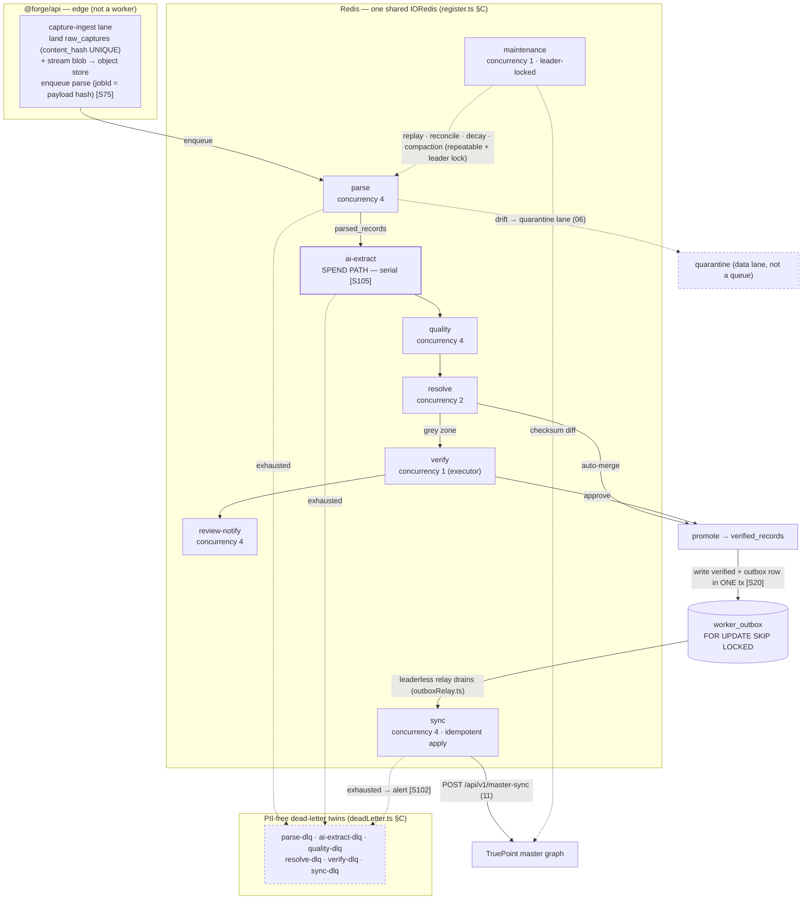
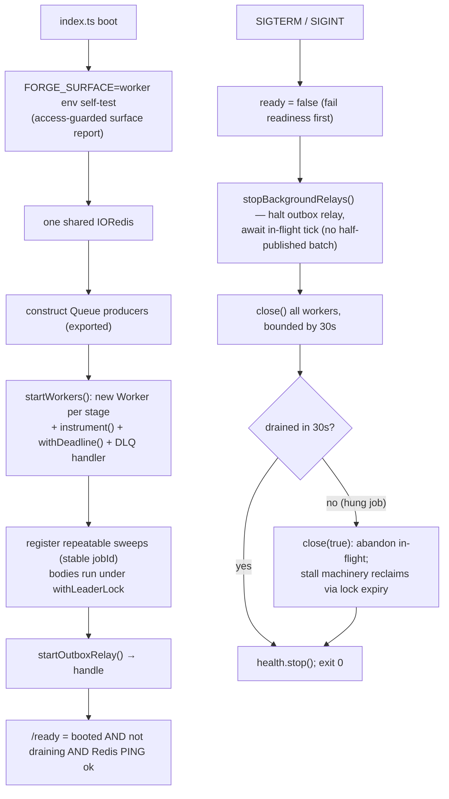

# 12 — Queue & Worker Architecture

> **Canonical contract:** TruePoint Forge runs its pipeline on **BullMQ + Redis**, one **queue per DAG
> stage** (`capture-ingest · parse · ai-extract · quality · resolve · verify · review-notify · sync ·
> maintenance`), each with a **stable, hand-authored retry-with-jitter policy**, a **hand-built PII-free
> dead-letter queue** (BullMQ has no native DLQ), a **per-processor deadline**, and **failure-containment
> tuning** (concurrency, `lockDuration`/stall). Singleton work (replay, reconciliation, decay sweeps) runs
> as **repeatable jobs with a stable `jobId`** guarded by a **Redis leader lock**; the only egress runs
> through a **leaderless transactional-outbox relay** draining `worker_outbox` `FOR UPDATE SKIP LOCKED`.
> Every queue is **at-least-once**; the pipeline is **effectively-once** by construction (stable `jobId`
> dedup at the producer + keyed idempotent apply at the consumer). The composition root
> (`@forge/workers` `register.ts` analog) owns one shared Redis connection, boots all consumers, and
> **drains gracefully** on SIGTERM. **Locking ADR: ADR-0047** (Forge owns ER + versioned master-sync);
> the interception-primary capture that feeds the queues is **ADR-0046**.
>
> This doc is the **owner of the deep detail** for queue/worker *mechanics*. It does **not** restate the
> stage input/output/quarantine contracts or the record state machine (owned by `06-data-pipeline-
> architecture`), the `/master-sync` wire shape (owned by `11-sync-contract`), the queue/outbox table
> DDL (owned by `05-database-design`), the metrics/SLO/trace wiring (owned by `15 — observability &
> lineage`), or the autoscaling **topology + capacity math** (owned by `17 — scalability & performance`).
> Current-state TruePoint facts cite `_context/ecosystem-facts.md` by `§`; best practice cites `[S#]` in
> `_context/research-corpus.md`; frozen vocabulary is `_context/decision-ledger.md` (L1–L11).

---

## Objectives

1. Fix the **Forge queue map** — the exact BullMQ queues, their DLQ twins, and how they mirror TruePoint's
   shipped worker platform (`apps/workers`, ecosystem-facts §C) rather than reinventing it.
2. Specify **per-queue retry + jitter policies and the hand-built DLQ** so no stage ships with the BullMQ
   default (a single silent attempt), mirroring `retryPolicies.ts` / `deadLetter.ts` (§C) [S73] [S74].
3. Define **concurrency, tuning, and per-processor deadlines** per queue — including which queues are the
   **spend path** and must stay serial until an atomic budget lease lands (the `ai-extract` analogue of
   TruePoint's `enrichment` F3 gate, §C) [S105].
4. Specify **leader-locked singleton sweeps** (`withLeaderLock`, §C) and **repeatable jobs with a stable
   `jobId`** for replay, reconciliation, decay re-verification, and blob compaction [S104] [S84].
5. Define **priority lanes** (live ingest ahead of replay/backfill), the **queue-level effectively-once
   mechanism** (stable `jobId` dedup + keyed apply) [S75] [S21], and the **transactional-outbox relay**
   (leaderless `FOR UPDATE SKIP LOCKED`) that drives sync egress [S20].
6. Define **back-pressure / flow control** and the **autoscaling signal (queue depth → `17`)** [S78]
   [S79] [S104], plus the **worker composition root** (`register.ts` analog) and **graceful drain**.
7. Register the queue/worker gaps (`G-FORGE-1201…1206`), risks, milestones, deliverables, and open questions.

Non-goals: stage semantics and the record state machine (`06`), the sync request/response contract and
reconciliation checksum design (`11`), table DDL for `worker_outbox`/`sync_state` (`05`), the
data-quality/validation-rule catalog (`05 Group 5` + `06`), metric/trace/lineage stores (`15`), the
compute/pooler topology (`16`), and per-stage replica counts + capacity (`17`).

---

## Industry practice (cited)

The queue layer is a well-trodden problem; Forge adopts the consensus rather than inventing.

| Principle | What it means for Forge | Source |
|---|---|---|
| **Exactly-once is impractical; idempotent consumers are the answer** | The ack confirming delivery can itself be lost, so at-least-once is the production default for BullMQ/Sidekiq/Celery/SQS; correctness comes from idempotent processing, not delivery guarantees. | [S72] (high) |
| **Bounded retries + exponential backoff + a terminal DLQ are one pattern** | Resilient pipelines = idempotency (dedup keys) **and** bounded retries **and** a DLQ terminal path — never one without the others. | [S80] (high) |
| **BullMQ retries need explicit `attempts` + backoff (+ jitter)** | Default is a single attempt; `2^(n-1)·delay` exponential, optional jitter, `backoffStrategy` may return `-1` to stop. | [S73] (high) |
| **BullMQ has no built-in DLQ** | Exhausted jobs land in the `failed` set; a DLQ must be hand-built (move a descriptor to a parking queue on final failure); 3–5 attempts is a practical start. | [S74] (high) |
| **Stalled jobs are a duplicate-execution source** | A job whose lock is not renewed (worker crash / blocked event loop) is re-added past `maxStalledCount`; long AI calls can trip the stall detector, so tune `lockDuration`. | [S73] (high) |
| **Producer-side dedup via a stable `jobId`** | Adding a job with an existing `jobId` is ignored while present — an idempotency key at the enqueue boundary (use the raw-payload hash). | [S75] (medium) |
| **Transactional outbox kills the dual-write hazard** | Write business rows + an event row in one ACID tx, then a separate relay publishes — messages sent iff the tx commits; the relay is at-least-once, mandating idempotent consumers. | [S20] (high) |
| **Effectively-once = at-least-once + idempotent apply** | Across a heterogeneous boundary (Forge DB → CRM) true exactly-once is unachievable; combine outbox with a dedup-event-id table deduped in the same tx as the write. | [S21] [S23] (high/medium) |
| **Autoscale on queue depth, not CPU** | CPU-based HPA is a "silent failure" for a growing queue; KEDA scales BullMQ workers on Redis list length (incl. scale-to-zero). Pure depth lags latency-sensitive work → prefer a load signal `(active+queued)/workers`, and use **per-stage queues** so each scales on a homogeneous job profile. | [S78] [S79] [S104] [S105] (high/medium) |
| **DLQ = backpressure + poison isolation** | Divert a poison message after the attempt limit to a separate destination for inspection/replay rather than retrying forever or dropping silently. | [S72] (high) |
| **Alert on retry-exhaustion, not transient blips** | Page when a job exhausts all retries (DLQ arrival); paging on every transient failure is alert fatigue. | [S102] (medium) |
| **Durable-execution engines are the alternative** | Temporal gives exactly-once *workflow* orchestration + server-mediated single execution (no self-built locks), at the cost of net-new infra — Forge's raw→verify→sync saga is a candidate (OQ-R5). | [S76] [S77] (high/medium) |

---

## Current-state — what already exists in TruePoint (cite ecosystem-facts §C)

Forge does **not** design a queue platform from scratch. TruePoint ships a hardened one that Forge's
`@forge/workers` mirrors module-for-module (ecosystem-facts §C):

| TruePoint module (`apps/workers/src`) | What it does | Forge mirrors it as |
|---|---|---|
| `register.ts` | Composition root: one shared `IORedis`, `Queue` producers exported, `startWorkers()` boots consumers, `instrument()` wraps each `Worker` for metrics | `@forge/workers` `register.ts` — same shape, Forge stages |
| `retryPolicies.ts` | Per-queue exponential **+ jitter**; `ALL_RETRY_POLICIES` test asserts every queue has a policy | Forge `retryPolicies.ts` keyed by Forge queue |
| `deadLetter.ts` | Generic **PII-free** DLQ: records scope UUIDs + job id/name + reason + attempt count, **never `job.data`**; handles stall-exhaustion (`maxStalledCount`) | Forge `deadLetter.ts`, same PII rule |
| `tuning.ts` / `withDeadline.ts` | Per-queue concurrency + 60s lock / 30s stall / 2 `maxStalledCount`; per-processor deadline racing the whole processor; **spend-path queues pinned serial (F3)** | Forge `tuning.ts`; `ai-extract` = the new spend path |
| `leaderLock.ts` | `withLeaderLock`: `SET PX NX` + owner-checked Lua release; belt-and-suspenders over `FOR UPDATE SKIP LOCKED` + repeatable-job dedup | Forge sweeps reuse verbatim |
| `outboxRelay.ts` | **Leaderless** relay draining `worker_outbox` `FOR UPDATE SKIP LOCKED`; at-least-once; recursive `setTimeout` (non-overlap); `stop()` awaits in-flight (ADR-0027) | Forge sync-egress relay |
| `metrics.ts` / `health.ts` / `index.ts` | Zero-dep Prometheus `/metrics` (per-queue counters + live depth + outbox lag); `/ready` bounded Redis PING; 30s bounded graceful drain (stop relays → close workers → `close(true)`) | Forge worker process entry |
| `packages/types/src/workerQueues.ts` | Shared queue-name vocabulary + `<queue>-dlq` twins so the admin health probe reads live depth | `@forge/types` Forge queue-name module |

Two shipped facts are load-bearing for Forge:

- **Repeatable jobs already use a stable `jobId`** for dedup (e.g. `{ repeat: { every: … }, jobId:
  "master-backfill-sweep" }`, ecosystem-facts §C) — Forge's sweeps copy this idiom exactly.
- **The spend-path discipline is codified** in `tuning.ts`: `enrichment` stays concurrency 1 because the
  daily-budget breaker is a racy read-check-act, so N concurrent workers could overshoot a tenant's cap by
  N paid calls (F3). **Forge's `ai-extract` queue is the direct analogue** — every extraction is a paid
  Anthropic call — and inherits the same "serial until an atomic per-batch budget lease lands" rule.

---

## Design

### The queue map (topology)

Forge runs **one BullMQ queue per DAG stage** (`04 §Repository layout`: `parse·extract·resolve·verify·
quality·sync·maintenance`), each paired with a `<queue>-dlq` twin, on a single shared Redis. Per-stage
queues are deliberate: parse is milliseconds, an `ai-extract` call is seconds, a `sync` push is a network
round-trip — mixing them behind one queue makes queue-depth a meaningless scaling signal, so each stage
scales on its own homogeneous profile [S105] (the reasoning `06 §Ordering` states; this doc owns the
queues themselves).



| Forge queue | DAG name (`04`) | Stage (`06`) | Job profile | DLQ twin |
|---|---|---|---|---|
| **`capture-ingest`** | (edge → parse) | S0→S1 enqueue | land + blob-stream + enqueue (edge; produce-only, no worker) | — (edge rejects at boundary) |
| **`parse`** | `parse` | S1 | deterministic, CPU-light, idempotent | `parse-dlq` |
| **`ai-extract`** | `extract` | S2 | **paid vendor call** (Anthropic), network-bound | `ai-extract-dlq` |
| **`quality`** | `quality` | S3 + inter-stage gates | DB-bound, idempotent | `quality-dlq` |
| **`resolve`** | `resolve` | S4 (ER/dedup/merge) | DB-bound, blocking queries can be heavy | `resolve-dlq` |
| **`verify`** | `verify` | S5/S6 executor | human-driven; the executor is idempotent | `verify-dlq` |
| **`review-notify`** | (verify-adjacent) | S5 notify | fan-out notifications to reviewers (best-effort) | `review-notify-dlq` |
| **`sync`** | `sync` | S8 | egress HTTP push; idempotent apply on CRM side | `sync-dlq` |
| **`maintenance`** | `maintenance` | M (sweeps) | leader-locked repeatable singletons | — (self-heal re-run) |

> **`capture-ingest` reconciliation.** `06 §S0` lands `raw_captures` on a **synchronous edge route** and
> "enqueues parse" — Forge names that enqueue seam `capture-ingest` and treats the object-store blob write
> + payload-fingerprint as the first thing the edge does before returning `202 < 300 ms p95`. It is a
> **produce-only lane** (its consumer *is* the `parse` worker); it appears in the map for topology and
> autoscaling completeness, not as a separate consumer group. This refines — does not contradict — `06`.

### Per-queue retry + jitter policies + DLQ

Every policy is **exponential with jitter** — without jitter, all jobs failed by one shared outage (a
Voyager 503, a DB failover, a Redis hiccup) retry in lockstep and re-hammer the recovering dependency
(mirrors `retryPolicies.ts` header, §C) [S73]. Policies are **pure data** (no env/Redis import) so a unit
test iterates the map and a new queue cannot ship un-asserted (`ALL_RETRY_POLICIES` precedent, §C).

| Queue | `attempts` | Base delay | Jitter | Retry class | DLQ on exhaustion | Rationale |
|---|---|---|---|---|---|---|
| `capture-ingest` | 3 | 10 s | ±50% | transient (blob store / DB) | n/a (edge) | land is idempotent on `content_hash`; a replay is a `202` no-op [S81] |
| `parse` | 3 | 15 s | ±50% | transient blob-read **only** | `parse-dlq` | deterministic — a *parse error* is **not** retried into oblivion; it routes to the quarantine data-lane (`06 §S1`), the DLQ is for poison/transient exhaustion [S123] |
| `ai-extract` | 3 | 30 s | ±50% | transient (network) | `ai-extract-dlq` | vendor-bound; a `refusal`/`max_tokens` stop is **deterministic** → quarantine, not infinite retry (`06 §S2`) [S47]; tune `lockDuration` so a long call is not stall-re-added [S73] |
| `quality` | 3 | 10 s | ±50% | transient DB | `quality-dlq` | cheap, idempotent (re-scoring is safe) — mirrors `SCORING_RETRY` (§C) |
| `resolve` | 3 | 15 s | ±50% | transient DB | `resolve-dlq` | idempotent by design (re-run is always safe) — mirrors `DEDUP_RETRY` (§C) |
| `verify` | 2 | 30 s | ±50% | executor transient only | `verify-dlq` | no machine retry for the human decision; the *executor* (promote) is idempotent, so a small budget covers a transient write blip |
| `review-notify` | 5 | 15 s | ±50% | transient (delivery) | `review-notify-dlq` | notifications are best-effort but must survive a blip; largest small-payload budget |
| `sync` | 5 | 60 s | ±50% | transient (egress) | `sync-dlq` **+ page** | the egress money-path: a lost verified record is a data-integrity gap, so it gets the **largest budget** (mirrors `DSAR_RETRY`, §C) with reconciliation (`11`) as the backstop [S25] |
| `maintenance` | (self-heal) | — | — | re-scan on next tick | — | sweeps throw-to-re-scan; only still-dirty rows are re-touched (idempotent) — mirrors `MASTER_BACKFILL_RETRY` self-heal (§C) |

**DLQ mechanics (mirror `deadLetter.ts`, §C).** BullMQ has no native DLQ [S74], so on final failure a
generic handler moves a **PII-free descriptor** — `{queue, originalJobId, jobName, failedReason,
attemptsMade, tenantScope?}`, **never `job.data`** — to the `<queue>-dlq` parking queue for ops triage
[S74]. Payloads carry raw intercepted PII, so the descriptor copies only identifying scope + provenance +
reason (the shipped **PII RULE**). **Stall-exhaustion is terminal regardless of remaining attempts** (a
job reclaimed past `maxStalledCount` bypasses the attempts/backoff machinery), so the handler matches the
BullMQ "stalled more than allowable limit" message and dead-letters immediately, exactly as shipped. DLQ
routing is **best-effort** (a routing failure is logged and swallowed; the original job still sits in the
BullMQ `failed` set) so it can never throw inside the worker event loop.

### Concurrency, tuning & per-processor deadlines

Concurrency is raised **only for IO-bound, idempotent queues**; the spend path stays serial (mirrors
`tuning.ts`, §C). Every event worker shares the crash-recovery lock profile — **60 s lock, checked every
30 s, failed after 2 stalls → dead-lettered** — a *crash* bound, not a job-duration bound (BullMQ
auto-renews the lock for live long-running jobs) [S73].

| Queue | Concurrency | `lockDuration` | Processor deadline | Note |
|---|---|---|---|---|
| `capture-ingest` | 4 (edge) | — | 60 s | IO-bound land + blob write; idempotent |
| `parse` | 4 | 60 s | 60 s | deterministic, CPU-light |
| `ai-extract` | **1 (SPEND PATH)** | **120 s+** (> Claude p99) | 3 min | **hard gate**: every call is paid; stay serial until an **atomic per-batch budget/credit lease** lands, else N workers overshoot the cost cap by N calls (the exact `enrichment` F3 rule, §C). Extend the lock past extraction p99 so a long call is not stall-re-added [S73] |
| `quality` | 4 | 60 s | 60 s | DB-bound, idempotent |
| `resolve` | 2 | 60 s | 5 min | blocking/clustering queries are heavy; modest parallelism, gentle on the pool |
| `verify` | 1 | 60 s | 60 s | serial executor writes; human-paced upstream |
| `review-notify` | 4 | 60 s | 60 s | fan-out, IO-bound |
| `sync` | 4 | 60 s | 2 min | idempotent apply on the CRM side (`11`) absorbs any duplicate; per-record ordering is not required |
| `maintenance` (sweeps) | **1** | 60 s | **none** | leader-locked singletons — parallelism there is a bug, not a win; containment is the leader TTL + internal caps + the scheduled re-run |

**Per-processor deadline (mirror `withDeadline.ts`, §C).** With low concurrency a single hung upstream
(a vendor read with no timeout, a wedged connection) holds the lock forever and nothing behind it runs.
Forge races the **whole processor** against a per-queue bound; expiry is a normal retryable failure that
enters the retry→DLQ path, and the queue keeps draining. **Caveat (as shipped):** the orphaned work keeps
running past the deadline — JS promises are not cancelled — which is safe **only because every wrapped
consumer is idempotent** (a duplicate effect is a no-op re-run). Sweeps carry **no** deadline (their
containment is the leader TTL). This is coarser than per-call aborts (those come with circuit breakers in
`07-raw-api-processing`/`09-ai-extraction`).

### Priority lanes

BullMQ priority (lower number = higher priority) keeps **live ingest ahead of bulk/replay work** so a
parser-version backfill never starves fresh captures — the reason `06 §Versioned parsing` runs replay at
"maintenance-queue priority."

| Lane | Priority | Carries | Why |
|---|---|---|---|
| **Live ingest** | 1 (highest) | fresh `capture-ingest → parse → …` for just-captured records | freshness SLO is measured here; never starve it |
| **Egress** | 1 | `sync` pushes of newly-verified records | a verified record must reach the CRM promptly (`06 §Sync SLO`) |
| **Interactive** | 2 | a `verify` executor promote a human just approved | keep the reviewer's action snappy |
| **Backfill / replay** | 5 | `maintenance`-fanned re-parse of historical partitions after a `parser_version` bump | bulk, latency-tolerant; must yield to live ingest [S81] |
| **DLQ replay** | 8 (lowest) | operator-triggered re-enqueue from a `<queue>-dlq` | remediation, never at the expense of the live stream |

> **KEDA caveat.** BullMQ ≥ 4.1.0 may omit the `:wait` Redis key for **priority-enabled** queues, which
> breaks the naive queue-depth scaler [S104]. Forge validates the trigger key per queue and version, and
> the autoscaling signal (below) falls back to the load metric where `:wait` is absent.

### Effectively-once at the queue boundary

`06 §Cross-stage idempotency` owns the **pipeline-wide** effectively-once model; **this doc owns the
queue-level mechanism** that implements it. There is no exactly-once: BullMQ is at-least-once (the ack can
be lost) and additionally re-adds a stalled job past `maxStalledCount` [S72] [S73]. Two queue-level
primitives, one per re-delivery class:

- **Producer boundary — stable `jobId` dedup.** Every enqueue uses a deterministic `jobId` (the
  raw-payload `content_hash` at ingest; a `stage:recordId:version` string downstream — the exact idiom
  `register.ts` uses for `seqstep:${logId}:${step}` and `bulkenrich:chunk:${jobId}:${chunkId}`, §C).
  BullMQ ignores an `add` for a `jobId` already present, so an accidental double-enqueue is **free** [S75].
- **Consumer boundary — keyed idempotent apply.** Each processor writes to a **keyed** row
  (`(raw_capture_id, parser_version)`, `(parsed_id, extract_schema_ver, model_id)`, or — at `sync` — a
  dedup-event-id table + `UPSERT` on `source_records.content_hash` + master blind index), so re-running the
  same job converges to the same row rather than duplicating it [S21] [S23].

The one operational nail is `ai-extract`'s `lockDuration`: it **must** exceed extraction p99 so a long
Anthropic call is not treated as stalled and re-added mid-flight [S73]. Because content is hash-keyed
end-to-end, **replay is also idempotent** — re-deriving an existing version is a keyed `UPSERT`, and a
re-sync of an already-synced golden record is a no-op `UPSERT`.

### Repeatable jobs & leader-locked singleton sweeps

Singleton periodic work runs on the `maintenance` queue as **repeatable jobs with a stable `jobId`**,
each guarded by **three independent safety layers** (the belt-and-suspenders `leaderLock.ts` documents,
§C): (1) the BullMQ repeatable-job dedup (one scheduled instance per interval), (2) `withLeaderLock`
(`SET key token PX ttl NX`; only one replica wins the tick; an owner-checked Lua release frees it, so a
slow holder whose TTL already expired cannot delete a newer holder's lock), and (3) the processor's own
`FOR UPDATE SKIP LOCKED` claim, which makes a double-tick harmless anyway.

| Sweep (`maintenance`) | Repeatable `jobId` | Cadence (starting) | Does |
|---|---|---|---|
| **Parser replay** | `forge-replay-sweep` | on-demand + nightly | partition-scoped re-parse of historical `raw_captures` after a `parser_version` bump; **supersede, not duplicate** (`06 §Versioned parsing`) [S43] |
| **Sync reconciliation** | `forge-recon-sweep` | hourly/daily | per-key-range checksum diff of Forge `verified_records` vs CRM master state; drift → alert (contract owned by `11`) [S25] [S129] |
| **Decay re-verification** | `forge-decay-reverify-sweep` | nightly | re-enqueue stale verified fields for re-extract/verify (B2B data decays ~2.5%/mo) — the `reverification` analogue (§C) [S6] |
| **Blob compaction** | `forge-blob-compaction-sweep` | nightly | object-store snapshot expiry + small-file compaction + orphan cleanup — mandatory maintenance on an append-only raw substrate, not optional [S84] |
| **Drift monitor** | `forge-drift-monitor-sweep` | 15 min | roll up per-`parser_version` schema/distribution anomalies (detection design owned by `06 §Schema-drift`; store by `15`) [S103] |
| **DLQ-age alert** | `forge-dlq-age-sweep` | 5 min | alert when a `<queue>-dlq` has rows older than N — the "page on retry-exhaustion" signal [S102] |

**Sweeps stay concurrency 1** and carry **no processor deadline** — they are leader-locked singletons by
design (`SWEEP_WORKER_TUNING`, §C). A missed tick self-heals on the next interval (idempotent, only
still-dirty rows are touched), so a crashed sweep loses at most one interval, never corrupts a layer.

### The transactional-outbox relay (sync egress)

The only bytes that leave Forge are approved `verified_records`, through a **transactional outbox** — the
mechanism that kills the dual-write hazard (write DB, then separately POST the CRM; a crash between leaves
the systems permanently inconsistent) [S20]. Promote (`06 §S6`) and the outbox enqueue (`§S7`) are **one
local ACID transaction**: the `verified_records` row and the `worker_outbox` event commit together or not
at all. A **leaderless relay** — the shipped `outboxRelay.ts` pattern (ADR-0027, §C) — then drains it.

```mermaid
sequenceDiagram
    participant P as verify/promote worker
    participant DB as Forge ops DB
    participant R as outbox relay (leaderless, N replicas)
    participant S as sync worker → POST /api/v1/master-sync (11)
    participant CRM as TruePoint master graph

    P->>DB: BEGIN
    P->>DB: INSERT verified_records (keyed)
    P->>DB: INSERT worker_outbox (topic=master-sync) [S20]
    P->>DB: COMMIT (both or neither — no dual-write)
    loop recursive setTimeout (ticks never overlap)
        R->>DB: claimPendingBatch — SELECT ... FOR UPDATE SKIP LOCKED
        Note over R: N replicas each drain DISJOINT rows — no leader lock
        R->>S: publish payload (at-least-once)
        S->>CRM: idempotent UPSERT (content_hash + blind index) [S21]
        S-->>R: ok
        R->>DB: markPublished
    end
    Note over R,S: crash after publish, before markPublished → re-published later;<br/>consumer dedupes by stable jobId + keyed apply (effectively-once) [S21][S72]
```

Design points (mechanism only; the wire contract is `11`, the DDL is `05`):

- **Leaderless by construction.** Concurrency safety is the `FOR UPDATE SKIP LOCKED` claim, so N replicas
  drain disjoint rows with **no** leader lock — deliberately *not* the sweep shape. A money/egress relay is
  latency-critical and continuous; a leader-locked daily sweep would be wrong for it (the shipped F1/F2
  distinction, §C).
- **At-least-once + idempotent apply.** A crash between publish and `markPublished` re-publishes on a
  later claim; the CRM's `forge_sync` connector dedupes on event-id + `content_hash` so the duplicate is a
  no-op [S20] [S21]. A row with no registered publisher is **terminally failed** (a config bug, surfaced
  loudly), never spun forever.
- **Non-overlapping ticks + clean stop.** A recursive `setTimeout` (not `setInterval`) guarantees ticks
  never overlap; `stop()` halts the schedule and awaits the in-flight tick so shutdown never races a
  half-published batch (§C) — critical for the graceful drain below.
- **Buffered, not event-bus-primary.** Buffering the internal hop through the durable outbox is explicitly
  **not** the rejected "event-bus-as-primary" design (`decision-ledger` L5) — it is the same internal relay
  TruePoint already runs [S46]. The relay transport (polling publisher vs Debezium WAL CDC) is **OQ-R4**.

### Back-pressure & flow control

`06 §Ordering` owns the record-level backpressure *policy*; this doc owns the **queue-level controls**,
engaged in order:

1. **Durable buffer.** Every stage's input is a committed layer row **plus** a queued job. A downstream
   stall grows bounded, monitored queue depth — it does not drop captures or block the `202` ack (the ack
   path never waits on the DAG; `06 §NFR-03`). This is the Sentry-Relay "land, then emit onto a durable
   queue rather than forward synchronously" decoupling [S46].
2. **Per-stage autoscaling** absorbs sustained load (scale-to-zero when idle for event stages) [S104].
3. **Edge volume throttle** — the `capture-ingest` edge extends TruePoint's `checkCaptureRate`
   (2,000 records/min/caller, **fails open**, §A) so a runaway extension fleet cannot outrun the pipeline
   into unbounded backlog. It is an **abuse throttle, not a correctness control** (it fails open on a Redis
   outage by design).
4. **DLQ / poison isolation** keeps one bad message from consuming the throughput of the healthy stream
   [S72].

The unbounded-backlog failure mode (persistent producer > consumer) is a **monitored, alerting** volume/
freshness SLO breach (`06 §Per-stage SLOs`, wired by `15`), triaged as a capacity or poison-message
problem — never silently absorbed. The bounded-queue + edge load-shed policy is **G-FORGE-1205**.

### Autoscaling signal = queue depth (→ `17`)

Forge autoscales workers on **queue depth**, not CPU — CPU-based HPA is a "silent failure" for a growing
queue [S78]. KEDA's Redis-list scaler reads `bull:<queue>:wait` length and scales to zero when idle
[S104]. Because pure depth **lags** latency-sensitive work (pods spin up only after a backlog forms) and
job durations vary wildly across stages, Forge:

- uses a **load signal `≈ (active + queued) / workers`** where the freshness SLO is tight (`parse`,
  `sync`), pure depth where it is not (`resolve`, `maintenance`) [S79];
- runs **per-stage queues** so each scales on a homogeneous profile [S105];
- **exports the signal from the shipped `/metrics` seam** — `leadwolf_worker_queue_jobs{queue,state}` +
  `…_outbox_oldest_pending_seconds` (the Forge analogue, §C) — so the scaler and the SLO alerts read the
  same numbers [S101];
- **never scales `maintenance`/sweep workers to zero** — a repeatable job on a scaled-to-zero deployment
  misses its tick; sweeps keep ≥ 1 replica (the leader lock makes extra replicas safe but idle).

The **autoscaling topology, per-stage replica counts, and KEDA-vs-HPA choice are owned by `17 —
scalability & performance`; the compute substrate (ECS Fargate vs EKS, OQ-R6) is owned by `16 —
deployment & infrastructure`** [S106] [S107]; this doc fixes only that the *signal* is queue depth/load
exported from `/metrics`, and the priority-queue `:wait` caveat above.

### Worker composition root + graceful drain

`@forge/workers` `register.ts` is the composition root (mirrors `apps/workers/src/register.ts`, §C): it
opens **one shared `IORedis`**, constructs each `Queue` producer (exported so `@forge/api` and sweeps can
submit work), and `startWorkers()` boots every `Worker`. Each worker is wrapped by `instrument()` (feeds
the `/metrics` counters + a `completed`/`failed` listener) and by `withDeadline()` for event stages; each
attaches its `makeDeadLetterHandler(queue, dlq)`; each sweep registers its repeatable job (stable `jobId`)
and runs its body under `withLeaderLock`. The sync-egress `startOutboxRelay(...)` handle is captured for
shutdown.



**Graceful drain (mirror `index.ts`, §C).** On SIGTERM/SIGINT: (1) flip `ready = false` so the
orchestrator stops routing to us; (2) **stop the outbox relay first** so no new egress publish races the
worker close — unclaimed intents stay pending in `worker_outbox` and the next boot's relay resumes them
(at-least-once); (3) `close()` all workers **bounded by 30 s**; (4) if a genuinely hung job blows the
bound, `close(true)` abandons it — its lock expires and the stall machinery reclaims it on another replica.
This is why every consumer must be idempotent and every long call's `lockDuration` must exceed its p99.

---

## Security considerations

Security has final say (CLAUDE.md precedence); the queue layer's obligations:

- **PII-free DLQ is a hard rule, not a nicety.** Job payloads carry raw intercepted PII (Voyager profile
  JSON), so the DLQ descriptor records scope UUIDs + job id/name + reason + attempt count and **never
  copies `job.data`** — the shipped `deadLetter.ts` PII RULE (§C). A DLQ that logged payloads would be a
  standing PII spill in an ops-visible queue. Deep enforcement (per-layer DB roles, KMS envelope) is
  owned by `14-security`.
- **Least-privilege worker DB roles.** No single worker role reads raw PII **and** writes production:
  `raw-writer` (capture-ingest), `parser`/`verifier-read`, and a `sync-reader` for the outbox relay are
  distinct roles, so a compromised extract worker cannot exfiltrate the egress path [S121]. Forge mirrors
  TruePoint's `withErTx`/`withPlatformTx` role-separation posture (§D) — design owned by `14`.
- **Machine identity on the egress, never a human session.** The `sync` worker authenticates to
  `/api/v1/master-sync` with the **client-credentials service JWT** (`aud=truepoint-api`,
  `scope=master-sync`, `decision-ledger` L5), ideally short-lived + auto-rotated (mTLS + scoped
  service-JWT, OQ-R18) [S119] [S120] — never a data_ops operator's session.
- **Secrets stay off the payload.** A job carries record ids + scope, not API keys or tokens; the worker
  resolves credentials from config/KMS at processing time. Redis itself is AUTH- + TLS-protected (the bus
  carries PII payloads in flight).
- **Idempotency keys must not leak PII.** A `jobId` is the `content_hash` (a hash) or a
  `stage:recordId:version` string — never a raw email/phone — so Redis keys and metrics labels stay
  PII-free (the `/metrics` label rule: queue names + states only, §C).

## Scalability considerations

- **Per-stage queues on homogeneous profiles** are the core scalability lever — each stage scales
  independently on its own signal, and a slow `ai-extract` never stalls `parse` for other records [S105].
- **Connection pooling is mandatory in front of the ops DB.** Workers hold pooled connections; a
  transaction-mode pooler (PgBouncer/RDS-Proxy) is the remedy for connection churn (~18–20× throughput in
  the cited pgbench) [S110] [S111] — topology owned by `16`.
- **Leaderless relay scales horizontally**; **leader-locked sweeps do not** (extra replicas are safe but
  idle) — the right shape for each: continuous egress fans across replicas, periodic singletons do not.
- **Redis is the shared bus and a scaling ceiling** — queue depth, priority scanning, and the KEDA scaler
  all read it; sizing/HA of Redis is a `16` concern.
- **Capacity math, peak-load N-values, and replica counts are owned by `17`**; this doc fixes only the
  per-queue concurrency *shape* and the spend-path serial constraint.

---

## Risks & mitigations

Queue/worker gaps use **`G-FORGE-1201…1206`** — this doc's disjoint gap-ID block, unique across the suite
(`decision-ledger` L9). They map to `28-enterprise-readiness-audit.md` where an existing TruePoint gap is
relevant.

| Risk / gap | Area | L × I | Mitigation (cite) |
|---|---|---|---|
| **G-FORGE-1201** — the Forge queue map + per-queue **retry/jitter/DLQ policy** is unbuilt (`@forge/workers` is net-new); a stage shipping with the BullMQ default loses a job on one transient blip | platform | High × High | mirror `retryPolicies.ts`/`deadLetter.ts` verbatim; `ALL_RETRY_POLICIES` test so no queue ships un-asserted (`§Retry`) [S73] [S74] (§C) |
| **G-FORGE-1202** — **`ai-extract` is a paid spend path with no atomic budget lease**; raising its concurrency overshoots the Anthropic cost cap by N calls | platform / finops | High × High | pin `ai-extract` concurrency 1 (the `enrichment` F3 rule, §C) until an atomic per-batch credit lease lands; `SPEND_PATH_QUEUES` gate [S105] |
| **G-FORGE-1203** — **no leader-locked sweep + repeatable-job scaffolding** for replay/reconcile/decay/compaction; a multi-replica fleet double-runs sweeps | platform | Med × High | `withLeaderLock` + stable `jobId` + `FOR UPDATE SKIP LOCKED` (three layers, §C); `SWEEP_WORKER_TUNING` concurrency 1 (`§Sweeps`) |
| **G-FORGE-1204** — **outbox relay not stood up for Forge egress**; a naive post-commit POST is a dual-write hazard | platform | Med × High | leaderless `outboxRelay.ts` pattern, in-tx write, idempotent apply (`§Outbox`) [S20] [S21] (§C); wire contract `11` |
| **G-FORGE-1205** — **edge back-pressure / bounded-queue + load-shed** between the async ack and the DAG unspecified | platform | Med × Med | durable buffer + per-stage autoscaling + `checkCaptureRate` edge throttle + DLQ isolation (`§Back-pressure`) [S79] [S46] [S72] |
| **G-FORGE-1206** — **autoscaling signal not wired**; CPU-HPA silently fails on a growing queue; priority queues may lack `:wait` | platform / ops | Med × Med | KEDA queue-depth/load signal from `/metrics`; validate `:wait` per queue+version (`§Autoscaling`) [S78] [S104]; topology `17` |
| Stalled-job duplicate execution on long Claude calls | platform | Med × Med | tune `ai-extract` `lockDuration` > extraction p99; idempotent keyed output makes a duplicate a no-op [S73] |
| Poison message retries forever / blocks a queue | platform | Med × Med | bounded attempts → PII-free DLQ + stall-exhaustion match; alert on DLQ arrival, not transient blips [S74] [S102] |
| Graceful-drain data loss on SIGTERM | platform | Low × High | stop relays first (pending intents resume at-least-once), 30s bounded close, `close(true)` + stall reclaim (`§Composition root`, §C) |
| Alert fatigue from high-variance interception ingest | operations | High × Low | alert on user-facing symptoms (freshness/backlog/DLQ), not every fluctuation (OQ-R20) [S101] [S100] |

---

## Milestones

Queue/worker milestones slot into the `M-FORGE-A…F` order (`03 §Milestones`); this doc owns the
queue-mechanic exit criterion at each phase.

| Milestone | Delivers (queue/worker) | Exit criterion |
|---|---|---|
| **M-FORGE-A — Foundation** | `@forge/workers` composition root: shared Redis, `capture-ingest`+`parse` queues, `retryPolicies`/`deadLetter`/`tuning`/`withDeadline` mirrored, `/metrics` + graceful drain | a captured record enqueues idempotently (`jobId` = payload hash); a drained worker loses no in-flight job; every queue has an asserted retry policy [S75] |
| **M-FORGE-B — Parse + replay** | `maintenance` queue + `forge-replay-sweep` (leader-locked, stable `jobId`); `parse-dlq` | a `parser_version` replay runs on exactly one replica per tick; drift/poison lands in the DLQ or quarantine, never retries forever [S43] [S74] |
| **M-FORGE-C — Extract + resolve** | `ai-extract` (serial spend path, extended `lockDuration`), `resolve`, `quality` queues + DLQs | a long Claude call is not stall-re-added; `ai-extract` cannot overshoot the budget cap (concurrency 1 gate) [S73] [S105] |
| **M-FORGE-D — Verify** | `verify` executor queue + `review-notify` fan-out; priority `interactive` lane | a replayed approval is a no-op; a reviewer's approve is snappy under load [S57] |
| **M-FORGE-E — Sync egress** | `sync` queue + **leaderless outbox relay**; `sync-dlq` + page-on-exhaustion; `forge-recon-sweep` | a verified write commits with its outbox row in one tx; a re-published event is an idempotent no-op; DLQ arrival pages [S20] [S21] [S102] |
| **M-FORGE-F — Operate** | KEDA queue-depth/load autoscaling from `/metrics`; DLQ-age + freshness alerting; per-stage tuning calibrated on Forge data | queues scale on depth/load (not CPU); alerts fire on user-facing symptoms; sweeps never scale to zero [S78] [S101] |

---

## Deliverables

1. The **Forge queue map** (`§The queue map`) — 8 stage queues + DLQ twins + `capture-ingest` edge lane —
   with its topology Mermaid and the queue→stage→profile table.
2. The **per-queue retry+jitter policy table** (`§Retry`) and the **PII-free DLQ mechanism** (parking
   queue, stall-exhaustion handling, best-effort routing), mirroring `retryPolicies.ts`/`deadLetter.ts`.
3. The **concurrency/tuning/deadline table** (`§Concurrency`) including the `ai-extract` spend-path serial
   gate and the `lockDuration` rule.
4. The **priority-lane** map, the **queue-level effectively-once** mechanism (stable `jobId` + keyed
   apply), and the **repeatable-job + leader-lock sweep** catalog (replay/reconcile/decay/compaction).
5. The **transactional-outbox relay** design (leaderless, in-tx, at-least-once, clean-stop) with its
   sequence Mermaid, handing the wire contract to `11` and the DDL to `05`.
6. The **back-pressure/flow-control** controls, the **autoscaling signal** (queue depth/load → `17`), and
   the **composition-root + graceful-drain** design with its boot/drain Mermaid.
7. The queue/worker **gap register `G-FORGE-1201…1206`**, risks, milestones, and open questions.

## Success criteria

1. **No queue ships on BullMQ defaults** — every Forge queue has an asserted exponential-with-jitter retry
   policy and a PII-free DLQ; a transient blip never silently loses a job [S73] [S74].
2. **The DLQ never holds PII** — descriptors carry scope + provenance + reason only, never `job.data`, and
   stall-exhaustion is dead-lettered immediately (§C).
3. **The spend path cannot overshoot cost** — `ai-extract` stays serial until an atomic budget lease
   lands, exactly as `enrichment` does (§C) [S105].
4. **Singleton work runs once per tick** across a multi-replica fleet — repeatable `jobId` + leader lock +
   `FOR UPDATE SKIP LOCKED`, verified by a two-replica test [S104].
5. **Egress is outbox-driven and effectively-once** — no verified write commits without its outbox row in
   the same tx; a re-published event is an idempotent no-op [S20] [S21].
6. **Autoscaling reads queue depth/load, not CPU**, from the same `/metrics` numbers the SLO alerts use;
   sweeps never scale to zero [S78] [S101].
7. **A SIGTERM drains without data loss** — relays stop first, workers close within 30s, a hung job is
   force-closed and reclaimed by the stall machinery (§C).

## Future expansion

- **Durable-execution engine (OQ-R5).** Migrate the raw→verify→sync **saga** from chained BullMQ +
  hand-built DLQ/compensation to **Temporal** (exactly-once workflow + server-mediated single execution,
  removing hand-rolled leader locks) if compensation bookkeeping outgrows BullMQ [S76] [S77].
- **Debezium WAL CDC relay (OQ-R4).** Replace the polling outbox relay with log-tailing CDC for
  lower-latency egress once volume justifies the infra [S20] [S24].
- **BullMQ Job Schedulers** — upgrade the `repeat` sweeps to the newer Job Schedulers API for
  drift-free scheduling as the sweep catalog grows [S104].
- **Flow-control / rate-limiter groups** — BullMQ per-group rate limiting for per-source (per-`endpoint`)
  fairness once multiple capture sources compete for `ai-extract` budget.
- **Event-bus egress (Doc 20)** — the recorded future option to add a Kafka/event-bus fan-out *alongside*
  (never replacing) the HTTP-push sync, for downstream consumers beyond the CRM [S46] (`decision-ledger`
  L5, OQ-3 — the sync one-way-door).

---

## Open questions

The full register lives in `_context/decision-ledger.md` (L11, OQ-1…OQ-6) and `01`'s research register
(OQ-R1…OQ-R20); the queue/worker-shaping ones surface here.

- **OQ-R5 — Orchestration engine: chained BullMQ (+ hand-built DLQ/compensation) vs Temporal durable
  execution.** TruePoint already ships BullMQ + outbox + `leaderLock` (§C), so v1 is BullMQ; Temporal would
  remove hand-rolled locks but is net-new infra. The saga *semantics* (`06 §Dead-letter`) are the contract
  regardless of engine. [S76] [S77] [S73]
- **OQ-R4 — Sync relay: polling publisher vs Debezium WAL CDC.** The no-Docker coordinator host and the
  low-volume verified stream favor the simpler polling relay (correctness over throughput); CDC is
  lower-latency. Drives `§Outbox`. [S20] [S24]
- **OQ-R6 — Compute topology: ECS Fargate vs EKS (+ EKS Auto Mode).** Committing to KEDA queue-autoscaling
  biases toward EKS; vendors disagree on the ~15-container crossover. Owned by `16`; affects whether the
  `§Autoscaling` signal is consumed by KEDA (EKS) or a custom scaler (ECS). [S106] [S107] [S104]
- **OQ-R20 — Alert-volume tuning for high-variance interception ingest.** A concrete SLO/alerting design
  task (alert on DLQ arrival / freshness breach / backlog growth — user-facing symptoms), not a yes/no.
  Drives the DLQ-age + queue-depth alerting in `§Autoscaling` and `§Back-pressure`. [S100] [S101]
- **OQ-6 — `@forge/capture-sdk` single-sourcing.** The `capture-ingest` edge lane depends on the envelope-v2
  builder + size/PII guards in `@forge/capture-sdk`; whether that SDK is shared with the extension or
  forked affects who owns the enqueue-boundary `content_hash`/`jobId` contract. [`decision-ledger` L8/L11]
- **Cross-link numbering.** This doc follows the settled 00-README numbering: `05` database design, `06`
  data-pipeline, **data-quality/validation lives in `05 Group 5` + `06`** (there is no standalone
  data-quality doc; `10` is Verification & Approval Workflow), `11` database synchronization engine, `15`
  observability & lineage, **`17` = scalability & performance** (the autoscaling-topology + capacity +
  replica-count owner), and **`16` = deployment & infrastructure** (compute substrate, pooler, Redis HA).
  This doc fixes only that the autoscaling *signal* is queue depth/load exported from `/metrics`; its
  topology and capacity math live in `17`, the compute/infra substrate in `16`.
