# 13 — Frontend Dashboard Design (Operator Console)

> **Canonical contract:** this doc owns the **operator console** for TruePoint Forge — the internal,
> staff-only Next.js 15 App Router dashboard (`apps/dashboard`, scope `@forge/*`) through which data
> operators, reviewers/stewards, and data-ops admins run the four-layer medallion pipeline
> **`raw_captures → parsed_records → verified_records → (sync) → TruePoint master graph`**
> (`_context/decision-ledger.md` L2). It is the **frontend** realization of the *Operator Console*
> service fixed in `03 §The four services`, and the rendering half of the requirements in
> `02` (FR-01/02/05/06/07/08/09/10/11/12/14). It **reuses TruePoint's shipped `@leadwolf/ui` kit,
> `StateSwitch`/`fetchWithAuth`, and the `apps/admin` auth client** (`_context/ecosystem-facts.md §C/§E`),
> and it defers every workflow *semantic* to its owning doc — it draws the screens, not the state machines.
> **Locking ADRs: ADR-0046** (raw API interception as primary capture) **and ADR-0047** (Forge owns ER +
> versioned master-sync — the console is the only human surface that authorizes egress across the
> compliance firewall).

This doc **owns**: the console information architecture + navigation map, capability-gated nav, the
feature-folder app structure, the auth client, the large-data rendering contract (virtualized `DataTable`
+ server-side keyset pagination + server-side filter/rank), the four async states wired through
`StateSwitch`, the bulk-action + optimistic-feedback + toast UX, and the layout/wireframe of the five key
screens. It does **not** restate the **review/approval workflow, state machine, or promotion write-set**
(owned by `10-verification-and-approval-workflow`), the **ER math / survivorship rules** (entity-resolution
doc / `@forge/core`), the **parser SchemaVer/replay semantics** (`08-parser-framework`), the **sync wire
contract + reconciliation** (`11-database-synchronization-engine`), the **queue/DLQ internals**
(`12-queue-and-worker-architecture`), the **observability metric definitions** (`15-observability`,
FR-12/FR-14 owner), the **table/column schema** (`05-database-design`), or the **security enforcement**
(`14-security-and-access-control`). Current-state TruePoint facts cite `_context/ecosystem-facts.md` by `§`; industry
practice cites `[S#]` in `_context/research-corpus.md`; frozen vocabulary is `_context/decision-ledger.md`.

> **Numbering note.** Provisional ownership maps in `02`/`03` label the observability surface
> `13-observability`; the settled suite numbering places **this operator-console doc at 13**, Security at
> `14`, and **Observability at `15`** (which owns the observability *metric* definitions). Entity-resolution,
> data-quality, and audit-lineage have **no standalone doc** — they live in sections: ER in `05 §Group 6` +
> `06` (+ `17` for blocking at scale), data-quality in `05 §Group 5` + `06`, and audit-lineage in
> `05 §Group 11` + `15`. This doc cites those section owners directly.

---

## Objectives

1. Fix the **console IA + navigation map** — ten primary surfaces (Overview/health, Imports, Capture
   monitor, Parsers, Review & approval, Dedup/merge, Data quality, Sync status, Jobs, Audit) — mapped 1:1
   to their owning FR and to the `data:*` capability that gates them (`ecosystem-facts §C`; Ledger L6).
2. Specify the **five key screens** — review queue + record-diff/approval drawer, parser registry + version
   diff + replay, dedup cluster review, sync-status board, and the pipeline/health dashboard — at
   layout/wireframe fidelity, as **Forge-composed views over `@leadwolf/ui` primitives**, never new raw
   markup.
3. Make **large data cheap to render**: virtualized `DataTable`, server-side keyset pagination, server-side
   filter/rank — so a 100M-row `raw_captures` band or a deep review backlog is never a naive client sort
   (NFR-01, `02`; the design-system large-data mandate).
4. Wire the **four async states** (loading / empty / error / populated) through `StateSwitch` on every data
   surface from the first commit (`ecosystem-facts §C`), and design **bulk actions** to the industry UX
   rules — select-all-across-filtered with a count, async partial-failure with per-item drill-down,
   toast-undo for recoverable actions [S60].
5. Mirror the **`apps/admin` auth client** — in-memory access token, PKCE redirect against
   `auth.truepoint.in`, silent refresh, `fetchWithAuth`, **capability-gated nav** (`ecosystem-facts §C/§E`;
   `02 §Actors`) — and hold the invariant that **the client is not a security boundary** (the API re-checks
   every capability; four-eyes is server-enforced, `10 §Security`).
6. Meet **WCAG 2.2 AA** and an **i18n-ready** posture (externalized copy, RTL-survivable layout, `Intl`
   number/date formatting), and register the console gaps (`G-FORGE-1301…1307`), risks, milestones, and open
   questions — every requirement scoped to **extend, not duplicate** TruePoint's shipped surface.

Non-goals: workflow state machines (`10`), ER/DQ/parser/sync/observability internals (their owners), schema
(`05`), and security enforcement design (`14`).

---

## Industry practice (cited [S#])

**The review console is a searchable/filterable queue + a detail panel with a full before/after diff.**
The canonical enterprise review/approval console (Retool's compliance template) is a queue of pending
items on the left and a **detail panel showing the complete before/after diff** of what a decision would
change on the right [S61]. Forge's Review-queue and Dedup screens adopt this two-pane shape verbatim.

**Order the work surface by disagreement/confidence, not arrival.** Inter-annotator agreement is the
industry proxy for review quality, and the recommended queue policy is to **surface the most
uncertain/contentious tasks first** ("don't boil the ocean"), i.e. confidence/disagreement ranking over
FIFO [S54]; monitoring effort is likewise **tiered by criticality/downstream usage** rather than spread
uniformly [S65]. The console renders a **server-ranked** queue — the ranking is materialized in the data
layer (`10 §2`), and the frontend only ever reads a cheap `(status, priority)` slice, never sorts the whole
queue online.

**Confidence gates the auto/human split, and the number must be shown as derived — never a model
self-report.** Azure Document Intelligence recommends threshold-gated routing (≥0.80 straight-through,
human review below, ~100% for sensitive data) with the caveat that a structured-extraction confidence must
be **derived** (source-grounding match + validator agreement + judge score), because LLMs do not natively
produce calibrated confidence [S49]. The console surfaces confidence as a badge **plus** its derivation
(grounded-span coverage, validator status), never a bare percentage.

**Bulk actions are a first-class, multi-level-feedback flow.** Bulk UX guidance: support **"select all
across the filtered set" with an explicit count**, reserve confirmation dialogs for
**destructive/irreversible** actions, offer **immediate toast-undo** for recoverable ones, and give
**multi-level async feedback** — per-row loading, a succeeded/failed rollup, and **inline drill-down per
failed item** ("180 approved, 20 blocked by dedup conflict") [S60]. Complex multi-step edits favor a
**wizard** (select → choose fields → resolve conflicts → review diff → apply) over one mega-action [S60].

**Explain probabilistic decisions to the reviewer.** The log₂ **bits-of-evidence** waterfall is what makes
a probabilistic merge auditable and DSAR-defensible to a human [S42]; the golden record is assembled
**per-attribute** (best-version-of-truth), not by picking one winning record [S27]. The Dedup screen
renders both.

**Observability is symptom-first.** Alert on **user-facing symptoms** (backlog growth, missing/stale data,
retry-exhaustion) rather than every internal cause [S101][S102], across the five data-observability pillars
(freshness / volume / schema / distribution / lineage) applied per medallion layer [S64][S96]. The Overview
dashboard is built around those pillars and the queue-health SLOs, not a wall of raw counters. Cross-DB
value-level **data diff** is the pattern behind the sync-board drift view [S128].

---

## Current-state — what already exists in TruePoint (cite `ecosystem-facts`)

Forge's console **reuses the shipped `apps/admin` data-ops UI shape and the entire `@leadwolf/ui`
vocabulary** and extends only the Forge-specific surfaces. The building blocks (`ecosystem-facts §C`,
unless noted):

| Shipped surface (`ecosystem-facts`) | What it gives the Forge console | The gap Forge fills |
|---|---|---|
| **`apps/admin` data-ops UI** — **Next.js 15 App Router + React 19**; `features/data-ops/` (approvals / dedup / enrichment / quality / validation / verification pages), hooks `useDataOpsOverview`/`useDedupReview`, `api.ts → /api/v1/admin/data/*` (§C) | the **feature-folder + hook + `api.ts`** structure to mirror, and a working approvals/dedup/verification console shape | Forge's dashboard is a **separate app** (`@forge/*`, `apps/dashboard`) reusing **pinned `@leadwolf/ui`** — divergence risk to manage (**OQ-6**, `02 §G-FORGE-206`) |
| **`@leadwolf/ui`** kit — `StateSwitch`/`LoadingState`/`EmptyState`/`ErrorState`/`Skeleton`, `DataTable`, `StatTile`, `StatusBadge`, `Card`, `Pagination`, `Tabs`/`SegmentedControl`, `Dialog`/`Drawer`, `Combobox`, `Toast`; Tp\* + shadcn families; tokens `var(--tp-*)`; `fetchWithAuth` (§C) | the **complete component vocabulary** for every console screen (queue table, detail drawer, diff, bulk toolbar, toast-undo, stat tiles, status badges) | consumed as-is; the **BVT survivorship panel**, **bits-of-evidence waterfall**, **medallion funnel**, and **parser version-diff** are Forge-*composed* views over these primitives, not new primitives |
| **`apps/admin` auth client** — in-memory access token, PKCE redirect vs `auth.truepoint.in`, silent refresh, `fetchWithAuth`; SSO mapping `data_ops` staff role + `data:read/manage/review/export` caps; `requireStaffRole`/`requireCapability` middleware server-side (§C, §E) | the exact **auth client to mirror** and the capability set the nav keys off | mapped from SSO (Ledger L6); **no new capability** unless one has no TruePoint analog (`02 §G-FORGE-209`); the machine sync principal never touches the console (Ledger L5) |
| **Health/queue probes** — `apps/api/.../queueProbes.ts`, `systemHealthProbes.ts`; worker `/metrics` Prometheus exporter + `health.ts` (§C) | the **data source** behind the Overview/health + Jobs screens | Forge's console consumes Forge-side probes over the BFF; the **five-pillar data-plane** view is Forge-composed (`15` owns the metrics) |
| **Design system posture** — light-theme-only, no dark mode; token-driven inline styles in app JSX; shell = Next.js authed layout (Sidebar + Topbar); detail-in-drawer (design skill) | the **styling + shell + drawer** rules the console obeys verbatim | Forge inherits the posture; no dark mode, no Tailwind in `apps/dashboard` JSX, no hand-rolled shell |

**The one-line gap.** TruePoint already knows how to build a Next-15 data-ops console over `@leadwolf/ui`;
it does **not** have an operator console for a *separate upstream medallion factory* — one that renders the
raw-capture monitor, the versioned-parser registry with replay, the Forge-owned dedup/BVT review, the
verified→sync approval gate, and the sync-status board across the compliance firewall. That console is this
doc.

---

## Design

### 1 — Information architecture & the navigation map

The console is a single authenticated app whose shell (Sidebar + Topbar) is the **Next.js App Router authed
layout** — adding a surface is adding a route under the authed group, never hand-rolling a shell (design
skill). The ten primary surfaces group into four nav sections that mirror the medallion flow left-to-right,
so an operator reads the sidebar as the pipeline itself. Every nav item is **capability-gated**: an item a
session cannot exercise is not rendered (and the API re-checks regardless — §Security).

```mermaid
flowchart TB
    subgraph SHELL["apps/dashboard — Next 15 authed layout (Sidebar + Topbar + Toaster)"]
      direction TB
      TOP["Topbar: env badge · global search (Combobox) · operator identity · SLA/DLQ alert bell"]
      subgraph NAV["Sidebar (capability-gated)"]
        direction TB
        OV["Overview / health\n(data:read)"]
        subgraph ING["INGEST"]
          IMP["Imports\n(data:manage)"]
          CAP["Capture monitor\n(data:read)"]
        end
        subgraph PROC["PROCESS"]
          PAR["Parsers\n(data:manage)"]
          DQ["Data quality\n(data:read / manage)"]
        end
        subgraph GOV["GOVERN"]
          REV["Review & approval\n(data:review)"]
          DED["Dedup / merge\n(data:review)"]
        end
        subgraph OPS["OPERATE"]
          SYN["Sync status\n(data:read)"]
          JOB["Jobs\n(data:manage)"]
          AUD["Audit\n(data:read)"]
        end
      end
    end

    OV -.->|"FR-12/FR-14"| OBS["15 observability"]
    IMP -.->|"FR-01"| D05a["05 raw_captures / import_jobs"]
    CAP -.->|"FR-02"| D07["07 raw-api-processing"]
    PAR -.->|"FR-03/FR-11"| D08["08 parser-framework"]
    DQ -.->|"FR-07"| DQD["05 §Grp5 + 06 data-quality"]
    REV -.->|"FR-05"| D10["10 verification & approval"]
    DED -.->|"FR-06"| ERD["05 §Grp6 + 06 entity-resolution"]
    SYN -.->|"FR-08"| D11["11 db-sync engine"]
    JOB -.->|"FR-10/FR-13"| D12["12 queue & worker"]
    AUD -.->|"FR-09"| AUDD["05 §Grp11 + 15 audit & lineage"]
```



**Surface → FR → capability → deep-detail owner.** The console renders; the linked doc owns the semantics.

| # | Surface | Renders (FR, `02`) | Min capability (`§C`) | Deep-detail owner |
|---|---|---|---|---|
| 1 | **Overview / health** | pipeline health, five-pillar data plane, queue SLOs, review backlog (FR-12, FR-14) | `data:read` | `15-observability` |
| 2 | **Imports** | bulk-import launch + job monitor (FR-01) | `data:manage` | `05 §Group 8` (`import_jobs`), `07-raw-api-processing` |
| 3 | **Capture monitor** | envelope-v2 ingest rate, throttle, idempotent-dedup, source/endpoint breakdown (FR-02) | `data:read` | `07-raw-api-processing` |
| 4 | **Parsers** | parser registry, version diff, publish states, replay (FR-03, FR-11) | `data:manage` | `08-parser-framework` |
| 5 | **Review & approval** | agreement-ranked review queue + record-diff/approval drawer (FR-05) | `data:review` | `10-verification-and-approval-workflow` |
| 6 | **Dedup / merge** | candidate-cluster review, BVT survivorship, bits-of-evidence, unmerge (FR-06) | `data:review` | `05 §Group 6` + `06` (ER math) + `10 §3` |
| 7 | **Data quality** | weighted-DAMA scores, five pillars per layer, quarantine lane (FR-07) | `data:read` (author rules: `data:manage`) | `05 §Group 5` + `06` |
| 8 | **Sync status** | per-record `sync_state`, outbox depth, reconciliation drift (FR-08) | `data:read` | `11-database-synchronization-engine` |
| 9 | **Jobs** | BullMQ queue depth/DLQ, background/repeatable jobs, reprocessing (FR-10, FR-13) | `data:manage` | `12-queue-and-worker-architecture` |
| 10 | **Audit** | record-history/lineage read model, tamper-evident chain (FR-09) | `data:read` (export: `data:export`) | `05 §Group 11` + `15` |

Cross-cutting **global search** (Topbar `Combobox`) resolves a `content_hash`, a `verified_id`, an email/
phone blind-index match, or a source URL to its record-history view (Audit) — the operator's fastest path
from "which record is broken" to its full lineage.

### 2 — App structure (Next 15 App Router, feature folders)

The app mirrors the shipped `apps/admin/src/features/data-ops/` layout (`§C`): one **feature module per
surface**, each self-contained with its route segment, its `api.ts` (typed BFF calls over `fetchWithAuth`),
its data hooks, and its components. No `apps/*` imports another app; shared pieces come from `@leadwolf/ui`
and `@forge/types` (Ledger L8).

```
apps/dashboard/
  app/
    (authed)/
      layout.tsx                 ← Sidebar + Topbar + <Toaster/> + auth guard (the shell)
      overview/page.tsx          ← surface 1  (Server Component shell → client widgets)
      imports/page.tsx           ← surface 2
      capture/page.tsx           ← surface 3
      parsers/page.tsx           ← surface 4  (registry) + parsers/[id]/versions/[v]/page.tsx (diff)
      review/page.tsx            ← surface 5  (queue) + review drawer via client state
      dedup/page.tsx             ← surface 6
      quality/page.tsx           ← surface 7
      sync/page.tsx              ← surface 8
      jobs/page.tsx              ← surface 9
      audit/page.tsx             ← surface 10 + audit/[entityKind]/[id]/page.tsx (history)
    (auth)/callback/page.tsx     ← PKCE redirect landing (token exchange, no shell)
  src/
    features/<surface>/          ← api.ts · hooks.ts · components/ · types.ts (one per surface)
    lib/authClient.ts            ← in-memory token, PKCE, silent refresh (mirrors apps/admin, §E)
    lib/fetchWithAuth.ts         ← re-exported network seam (§C)
    lib/capabilities.ts          ← useCapabilities() + <Gate cap="data:review"> nav/route guard
```

**Data fetching mirrors `apps/admin`, not TanStack Query.** Following the shipped pattern, each surface
exposes plain hooks (`useReviewQueue`, `useSyncState`, `useParserRegistry`) that call `api.ts` over
`fetchWithAuth` and feed `StateSwitch` — a Server Component renders the route shell, client widgets own the
interactive data (`§C`). The **detail-in-drawer** rule holds: opening a review task, a cluster, or a record
shows it in a `Drawer` over the list, so the operator never loses their place in the queue (design skill).

### 3 — Auth client & capability-gated nav

The operator auth client is a direct mirror of `apps/admin` (`§C/§E`; `02 §Actors`), with **no new auth
primitives**:

```mermaid
sequenceDiagram
    autonumber
    actor OP as Data operator
    participant DASH as apps/dashboard
    participant AUTH as auth.truepoint.in (OIDC + PKCE)
    participant BFF as apps/api (BFF)
    OP->>DASH: open console
    DASH->>DASH: no in-memory access token → redirect to /authorize (PKCE challenge)
    DASH->>AUTH: OIDC authorize (data_ops staff scope)
    AUTH-->>DASH: code → /callback → exchange (PKCE verifier)
    DASH->>DASH: hold access token IN MEMORY only (never localStorage); refresh via silent iframe/cookie
    DASH->>DASH: decode caps [data:read, data:review, …] → render capability-gated nav
    OP->>DASH: click "Review & approval"
    DASH->>BFF: GET review queue (fetchWithAuth: Bearer)
    BFF->>BFF: requireStaffRole(data_ops) + requireCapability(data:review) — re-checked server-side (§C)
    BFF-->>DASH: ranked page (or 403 if the client gate was stale)
    Note over DASH,BFF: the client gate is UX; the API is the boundary — a forged nav item still 403s
```

- **In-memory access token, silent refresh** — the token is never persisted to `localStorage`/`sessionStorage`
  (XSS-exfiltration hardening mirrored from `apps/admin`, `§E`). A refresh runs silently before expiry; a
  hard failure returns the operator to SSO.
- **Capability-gated nav + routes.** `useCapabilities()` reads the token claims; a `<Gate cap="…">` wrapper
  hides a nav item and 404s/redirects a directly-typed route the session cannot exercise. `super_admin`
  implies all (`§C`).
- **The machine sync principal never authenticates here.** The console is human-SSO-only; the
  client-credentials `scope=master-sync` service JWT drives the sync worker headlessly and has **no console
  surface** (Ledger L5) — an operator triggers a *reconciliation* or *replay* job (Jobs), never impersonates
  the sync identity.

### 4 — Large-data rendering contract

Every list/table in the console can front a very large dataset (`raw_captures` at **100M+**, verified at
tens of millions, a deep review backlog — NFR-01, `02`). The rendering contract is fixed and non-optional
(the design-system large-data mandate; a naive client render over thousands of rows is a bug):

| Concern | Contract | Grounding |
|---|---|---|
| **Virtualization** | every screenful-plus list uses the virtualized `@leadwolf/ui` `DataTable` (windowed rows; only visible rows in the DOM) | design skill large-data mandate; `DataTable` shipped (`§C`) |
| **Pagination** | **server-side keyset/cursor** pagination via `Pagination` — never `OFFSET` deep-paging; the queue read is a cheap `(status, priority)` index slice, not an online sort | `10 §Scalability`; `05` `review_tasks` indexes; ranked-not-FIFO [S54] |
| **Filter / rank** | filters and the confidence·value·freshness·risk rank are applied **server-side** and returned pre-ordered; the client renders, it does not compute the ranking | ranking materialized (`10 §2`); tier-by-criticality [S65] |
| **Selection at scale** | "select all across the filtered set" carries the **server count**, not the loaded-page count (bulk UX, §6) | [S60] |
| **Perf budget** | a filter/sort/scroll interaction stays within the design-system frame budget; skeleton rows match final row shape/height | design skill `references/large-data.md` |

### 5 — The five key screens

Each screen is a **Forge-composed view over `@leadwolf/ui` primitives** — no raw `<table>`/`<button>`/
`<dialog>`, every value a `var(--tp-*)` token, all four `StateSwitch` states wired, WCAG 2.2 AA. Wireframes
are indicative layout, not literal markup.

#### 5.1 — Review queue + record-diff / approval drawer (surface 5, FR-05)

The two-pane review console [S61]: a server-ranked, virtualized queue on the left; a decision `Drawer` on
the right. The **workflow, states, and the 8-row promotion write-set are owned by `10 §5`** — this screen
renders that workflow; it does not restate it.

```
┌─ Review & approval ───────────────────────────────────────────────────────────────────┐
│ [Filter: task_type ▾][source ▾][assignee ▾][SLA: breaching ▾]   Bulk ▸  ⟳  (data:review)│
│ ┌──────────────────────────── DataTable (virtualized, ranked) ───────────────────────┐ │
│ │ ☐  ▲prio  task_type       entity                conf    freshness  SLA      status  │ │
│ │ ☐  98    er_grey_zone     Acme Corp · J. Rivera  0.62↑   2h         ⏱ 40m   ● open  │ │
│ │ ☑  95    ai_low_confidence Globex · M. Osei       0.71    5h         ⏱ 1h20  ● open  │ │
│ │ ☐  91    dq_flag          null join-key           —       1d         ⚠ due    ◐ claim │ │
│ │ … (keyset "Load more" — no OFFSET deep-paging) …                                     │ │
│ └─────────────────────────────────────────────────────────────────────────────────────┘ │
│ selected: 2 of 214 filtered  →  [Select all 214]   [Approve…] [Reject…] [Escalate…]      │
└──────────────────────────────────────────────────────────────────────────────────────────┘
        ▼ open row → Drawer (over the list; focus-trapped; Esc returns focus to the row)
        ┌─ Task · Globex → M. Osei · ai_low_confidence ─────────────────────────┐
        │ Confidence 0.71  ⓘ derived: grounding 6/7 fields · validator ✓ · judge 0.74 [S49]│
        │ ── Before / After diff (StatusBadge add/removed, +/- glyph, not colour-only) ──── │
        │  title      Head of Growth        → VP, Growth            [+ changed]              │
        │  email      m.osei@globex.com      = m.osei@globex.com    [unchanged]              │
        │  phone      —                      → •••• (blind-index only, no decrypt) [+ added] │
        │ ── Grounded source spans (raw_payload offsets, LangExtract-style [S48]) ────────── │
        │  "VP, Growth"  ↳ voyager/identity/profiles  @ offset 1180–1189   [view raw]        │
        │ ─────────────────────────────────────────────────────────────────────────────────│
        │ [Approve]  (hidden if approver == this task's maker — four-eyes, server-enforced)  │
        │ [Reject]   [Escalate to adjudicator]              maker: a.ops · you: b.steward    │
        └────────────────────────────────────────────────────────────────────────────────────┘
```

- **Confidence is shown as derived**, never a bare number — the badge expands to grounding coverage +
  validator + judge score [S49].
- **PII is never decrypted on the review surface.** Channel fields render as blind-index-backed diffs
  ("phone added / changed"), not clear values; decrypt is a separate gated reveal path the console does not
  hold (`10 §Security`).
- **Four-eyes is a server invariant.** The Approve control is hidden when the approver is the task's maker
  (defense-in-depth); the executor re-checks `requested_by ≠ decided_by` regardless [S57][S115] (`10 §1`).
- Components: `DataTable` (virtualized) · `StatusBadge` (task status/SLA, text+glyph not colour-only) ·
  `Drawer` · a Forge-composed `RecordDiff` · `Toast` (undo) · `TpButton`.

#### 5.2 — Dedup cluster review (surface 6, FR-06)

The steward-facing counterpart of Forge-owned ER. The **cluster, waterfall, BVT, and unmerge semantics are
owned by `10 §3`**; the ER math by `05 §Group 6` + `06`. This screen renders them.

```
┌─ Dedup / merge · cluster #c-4821 (3 members) ───────────────────── review_status: ● pending ┐
│ ┌─ members (DataTable) ─────────────┐ ┌─ bits-of-evidence waterfall [S42] ────────────────┐ │
│ │ src            endpoint     weight │ │ full_name  same        +6.2 ▓▓▓▓▓▓  (rare-name TF+) │ │
│ │ extension      voyager/…    +8.1   │ │ email      same        +4.9 ▓▓▓▓▓                   │ │
│ │ bulk_import    provider_x   +8.1   │ │ company    diff        −1.3 ▓░       (−, text label)│ │
│ │ enrichment     apollo       +5.4   │ │ Σ match_weight = +8.1 → p=0.997  ▸ AUTO band       │ │
│ └────────────────────────────────────┘ └────────────────────────────────────────────────────┘ │
│ ── Survivorship (best-version-of-truth, per attribute) [S27][S33] ─────────────────────────── │
│  field     winner value        source        rule            corrob  fresh   [override]        │
│  title     VP, Growth          enrichment     authority>rec   2       2h      [✎ steward edit]  │
│  location  Berlin, DE          extension      completeness    1       6h      [✎]               │
│  phone     ••••(blind idx)     enrichment     validation ✓    1       1d      [✎]               │
│ ─────────────────────────────────────────────────────────────────────────────────────────────│
│ [Confirm merge]   [Reject / split]   [Unmerge prior…]   ↳ every decision = append-only merge_log│
└─────────────────────────────────────────────────────────────────────────────────────────────────┘
```

- The **waterfall must not rely on colour alone** — each field contribution carries a `+`/`−` glyph and a
  text label (`same`/`diff`) alongside the bar (WCAG 2.2 AA; §Security a11y).
- **Survivorship ranks authority + validation + completeness above naive recency** (Reltio's recency-default
  footgun) [S28][S33]; the steward may override any field (entered value wins), which becomes a maker
  proposal that still passes the four-eyes checker gate (`10 §3`).
- **Unmerge is a compensating append-only action**, surfaced as a distinct control, never a destructive
  edit [S29][S90].
- Components: `DataTable` · a Forge-composed `EvidenceWaterfall` + `SurvivorshipPanel` · `Drawer` ·
  `TpButton` · `Dialog` (confirm on irreversible split) · `Toast`.

#### 5.3 — Parser registry + version diff + replay (surface 4, FR-03/FR-11)

The parser governance surface. **SchemaVer, `$supersedes`, golden-file/differential testing, and the
publish state machine are owned by `08`**; this screen renders the registry, the version diff, and the
replay trigger.

```
┌─ Parsers ─────────────────────────────────────────────────────────────── (data:manage) ┐
│ ┌─ registry (DataTable) ────────────────────────────────────────────────────────────┐ │
│ │ endpoint                    active ver   state         parsed 24h   drift    replay │ │
│ │ voyager/identity/profiles   2-1-0        ● live        1.2M         ok        ↻      │ │
│ │ voyager/identity/positions  1-3-1        ◐ observe     840k         ⚠ schema  ↻      │ │
│ │ provider_x/company          3-0-0        ○ draft       —            —         —      │ │
│ └─────────────────────────────────────────────────────────────────────────────────────┘ │
│  select endpoint → Tabs[ Versions · Diff · Replay ]                                        │
│  ┌─ Diff: 2-0-0 → 2-1-0 (SchemaVer ADDITION → BACKWARD-compat, publishable [S24][S43]) ──┐ │
│  │  + field  seniority           (added, optional-with-default → non-breaking)           │ │
│  │  ~ mapping title              trim → titleCase   (golden-file characterization stable) │ │
│  │  status: ✓ golden-file pinned · ✓ differential vs 2-0-0 agrees on 5,000 fixtures [S123]│ │
│  └────────────────────────────────────────────────────────────────────────────────────────┘ │
│  ┌─ Replay ──────────────────────────────────────────────────────────────────────────────┐ │
│  │ scope: [endpoint ▾][date range ▾]  est. 1.2M raw_captures → re-derive parsed_records    │ │
│  │ [Dry-run diff]   [Publish observe-only]   [Promote to blocking]   [Replay $supersedes]  │ │
│  │ ⚠ replay is a background job (Jobs surface) — records validation_info (orig vs corrected)│ │
│  └────────────────────────────────────────────────────────────────────────────────────────┘ │
└──────────────────────────────────────────────────────────────────────────────────────────────┘
```

- The **publish/replay controls stage through observe-only → blocking** (staged rollout; not atomic
  fleet-wide) [S43][S45]; a replay is dispatched as a **background job** the operator tracks on the Jobs
  surface (§5 Jobs), not a synchronous action.
- A **`Dialog` confirms** a blocking-promote or a large replay (irreversible-ish, high blast-radius); a
  dry-run diff is the safe default first step.
- Components: `DataTable` · `Tabs` · a Forge-composed `VersionDiff` · `TpSelect`/`Combobox` (scope) ·
  `TpButton` · `Dialog` · `StatusBadge`.

#### 5.4 — Sync-status board (surface 8, FR-08)

The board over the compliance firewall. **`sync_state`, `master_id_map`, the wire contract, and
reconciliation are owned by `11`**; this screen renders their status.

```
┌─ Sync status ───────────────────────────────────────────────────────── (data:read) ┐
│  [StatTile] pending 1,204   [StatTile] synced 4.1M   [StatTile] failed 37 ⚠          │
│  [StatTile] outbox depth 1,204   [StatTile] reconciliation drift 0 ✓ (last 06:00)    │
│ ┌─ records (DataTable, filter: status ▾ / endpoint ▾) ──────────────────────────────┐│
│ │ verified_id     entity            status        master_id       attempts  last err ││
│ │ v-8841          Acme · J.Rivera   ● synced      m-5521          1         —        ││
│ │ v-8842          Globex · M.Osei   ◐ pending     —               0         —        ││
│ │ v-8843          Zynx · A.K…       ✕ failed      —               5→DLQ     409 stale ││
│ └────────────────────────────────────────────────────────────────────────────────────┘│
│  select failed → [View outbox payload (ciphertext + blind index — NO clear PII)]        │
│                  [Requeue (idempotent — keyed UPSERT, no double-apply)]  [Open in Jobs]  │
└──────────────────────────────────────────────────────────────────────────────────────────┘
```

- The board shows the **four locked states** `pending / synced / failed / superseded` (Ledger L2) as
  text+glyph badges; a **reconciliation-drift tile** surfaces the periodic checksum result [S25][S128].
- A failed record's outbox payload view shows **ciphertext + blind index + `content_hash` only** — the
  firewall holds even in the console (Ledger L5).
- **Requeue is idempotent** (keyed UPSERT → effectively-once), so an operator retry never double-applies
  [S21][S72].
- Components: `StatTile` row · `DataTable` · `StatusBadge` · `Drawer` (payload) · `TpButton` · `Toast`.

#### 5.5 — Pipeline / health dashboard (surface 1, FR-12/FR-14)

The landing surface: the medallion funnel + the five data-observability pillars per layer + the queue-health
SLOs, symptom-first [S64][S96][S101]. **Metric definitions are owned by `15`**; this screen
renders them.

```
┌─ Overview / health ──────────────────────────────────────────────────── (data:read) ┐
│  Medallion funnel (24h):  raw_captures 1.3M ▸ parsed 1.28M ▸ verified 42k ▸ synced 41k │
│  ┌ freshness SLO per layer ┐ ┌ queue health ┐ ┌ review backlog ┐ ┌ alerts (symptom) ┐  │
│  │ raw→parsed  p95 2m ✓     │ │ depth 3.1k    │ │ open 214       │ │ ⚠ positions parser │  │
│  │ parsed→verf p95 —(human) │ │ p95 dur 1.4s  │ │ SLA breach 3 ⚠ │ │   schema drift     │  │
│  │ verf→synced p95 55s ✓    │ │ DLQ 37 ⚠      │ │ escalated 5    │ │ ✕ sync DLQ 37      │  │
│  └──────────────────────────┘ └───────────────┘ └────────────────┘ └────────────────────┘  │
│  Five pillars (StatTile grid, per layer): freshness · volume · schema · distribution · lineage│
│  volume: raw 1.3M (baseline 1.1–1.5M ✓) · verified 42k (baseline 38–46k ✓)  [learned [S65]]   │
└────────────────────────────────────────────────────────────────────────────────────────────────┘
```

- `parsed → verified` freshness is shown as **human-bounded (not a hard SLO)** — the review backlog is a
  monitored queue-age signal, not a latency breach (`10 §Scalability`).
- Alerts are **user-facing symptoms** (a drifting parser, a growing DLQ, a stale layer), each a deep-link to
  the owning surface — not a wall of internal counters [S101][S102].
- Components: `StatTile` grid · a Forge-composed `MedallionFunnel` · `StatusBadge` · `Card` · deep-links.

### 6 — Bulk actions, optimistic feedback & toasts

Reviewers and operators work at volume, so bulk is first-class across Review, Dedup, Sync, and Jobs, built
to the bulk-action UX rules [S60] over `@leadwolf/ui` (`DataTable` selection + `Toast`, `§C`):

- **Select-all-across-the-filtered-set with the server count** ("Approve all 214 grey-zone matches for
  source X"), not just the loaded page [S60] — the count comes from the server, matching the keyset contract
  (§4).
- **Confirmation `Dialog` only for the irreversible** (bulk hard-reject, a blocking parser promote, a
  retention flip); **immediate `Toast` undo** for recoverable actions (a bulk approve is undoable within a
  window because promotion is a keyed UPSERT that a compensating decision reverts) [S60].
- **Optimistic feedback with reconciliation.** A bulk action enqueues **per-item idempotent executors** and
  the UI optimistically marks rows in-flight, then reconciles against the server result — an item that the
  server blocks reverts its optimistic state and appears in the failure rollup (never silently "succeeds").
- **Async multi-level feedback** — per-row loading → a succeeded/failed rollup → **inline drill-down per
  failed item** ("180 approved, 20 blocked by dedup conflict, 14 blocked by DQ") so the tail is fixed
  without re-running the batch [S60]. This renders the async partial-failure AC in `02 §FR-05(d)`.
- **Four-eyes holds per item.** A bulk approve is one `approval_requests` row whose checker ≠ the makers;
  the executor **skips (reports blocked, never auto-approves)** any item where the approver equals that
  item's maker [S57][S115] (`10 §6`).
- **Wizard for complex multi-step edits** (bulk survivorship): select → choose fields → resolve conflicts →
  review diff → apply, over one mega-action [S60], built with `Tabs`/`SegmentedControl` as the step rail.

### 7 — Components & tokens

Every screen composes shipped `@leadwolf/ui` primitives; the Forge-specific views are *compositions*, not
new primitives. No raw `<button>`/`<input>`/`<table>`/`<dialog>`; every colour/space/radius/shadow/z-index
is a `var(--tp-*)` token; app JSX uses token-driven inline styles (no Tailwind); **light theme only, no dark
mode** (design skill).

| Console need | `@leadwolf/ui` primitive (`§C`) | Forge composition |
|---|---|---|
| Ranked queue / registry / record lists | `DataTable` (virtualized) + `Pagination` (keyset) | — |
| Loading / empty / error / populated | `StateSwitch` + `LoadingState`/`EmptyState`/`ErrorState`/`Skeleton` | shape-matched skeletons per screen |
| Detail without leaving the list | `Drawer` (focus-trapped) | `RecordDiff`, cluster drawer, payload drawer |
| Status (task/sync/parser/DQ) | `StatusBadge` (text + glyph, never colour-only) | Forge status vocabularies |
| KPIs / pillars / funnel | `StatTile`, `Card` | `MedallionFunnel`, five-pillar grid |
| Filters / scope / global search | `Combobox`, `TpSelect`, `TpChip` filter row | filter bars (hidden when empty — no filler) |
| Actions / bulk / confirm / undo | `TpButton`, `TpIconButton`, `Dialog`, `Toast` | bulk toolbar, wizard rail (`Tabs`) |
| Merge explanation / survivorship | `DataTable`, `Card`, `StatusBadge` | `EvidenceWaterfall`, `SurvivorshipPanel` |
| Parser version diff | `Tabs`, `Card` | `VersionDiff` |

Representative tokens (design skill; `references/tokens.md`): spacing `var(--tp-space-*)`, surfaces
`var(--tp-surface)`, hairlines `var(--tp-hairline)`, radius `var(--radius)`, brand `var(--tp-cobalt)`, and
**interactive rows ≥ 44px `var(--tp-row-h)`** — the review queue and every `DataTable` row honor the
44px target so the console is comfortable for all-day keyboard-first triage.

### 8 — Accessibility (WCAG 2.2 AA) & i18n posture

**Accessibility — conformance target WCAG 2.2 AA (design skill):**
- **Keyboard-first.** The whole triage loop — claim → open drawer → review diff → approve/reject/escalate →
  next — is keyboard-drivable; every interactive element is reachable with a **visible focus ring**; targets
  ≥ 44px (`--tp-row-h`).
- **Drawers/dialogs trap focus and return it** to the invoking row on close (the DS handles this — not
  hand-rolled).
- **Never meaning by colour alone** — this is load-bearing here: task/sync/parser statuses are
  `StatusBadge` **text + glyph**; the bits-of-evidence waterfall carries `+`/`−` and `same`/`diff` labels;
  the record diff marks `[+ changed]`/`[unchanged]` with glyphs, not red/green only.
- **Icon-only controls carry a `label`** (the alert bell, row-action icon buttons); decorative motion
  respects `prefers-reduced-motion`; motion is `transform`/`opacity`, functional, < ~300ms.
- **Live-region announcements** for async bulk results ("180 approved, 20 blocked") and toast undos, so a
  screen-reader operator hears the outcome without hunting.

**i18n posture — internal, English-first, but i18n-*ready* (design skill `references/i18n.md`):**
- **No untranslatable hardcoded user-facing strings** — all copy is externalized to a catalog, even though
  the launch locale is English (the operator base is internal staff). This keeps the hard-rule and avoids a
  costly retrofit.
- **Layout survives longer strings and RTL** (flex/grid, no fixed-width label columns); **numbers, dates,
  and durations use `Intl`** formatting keyed to the operator locale (queue ages, SLA clocks, `synced 4.1M`).
- **Full localization (shipping non-English locales) is deferred** — flagged as a posture decision, not a
  build item, since Forge is staff-only (an open question below).

---

## Security considerations

Security has final say (CLAUDE.md precedence); deep enforcement is owned by `14` — this section
states the console's obligations, all of which reduce to **the client is UX, the API is the boundary**.

- **The client gate is not a security control.** Capability-gated nav and hidden buttons are UX;
  `requireStaffRole(data_ops)` + `requireCapability(data:*)` are **re-checked on every BFF call** (`§C`), so
  a forged nav item or a directly-typed route still `403`s. Four-eyes (`requested_by ≠ decided_by`) is
  **server-enforced in the executor**, never merely a hidden Approve button [S57][S115] (`10 §1`).
- **PII never renders on the review/dedup surfaces.** Channel fields show as blind-index-backed diffs
  ("added/changed"), not clear values; the `forge_app` BFF role **cannot decrypt `*_enc` or write
  `verified_*` directly** (`10 §Security`, `14 §DB roles`). A decrypt is a separate gated reveal
  path the console does not hold [S121][S122].
- **The compliance firewall holds in the UI.** The sync-board payload viewer shows **ciphertext + blind
  index + `content_hash` only** — no console surface exposes raw intercepted payloads to anyone but through
  the gated raw-viewer on the Capture/Audit surfaces, and raw never crosses to the CRM (ADR-0046; Ledger L5).
- **In-memory tokens, no web storage.** The access token lives in memory with silent refresh, never in
  `localStorage` (XSS-exfiltration hardening, `§E`); the PKCE flow prevents code interception.
- **Audit reads are read-only and export is capability-gated.** The Audit surface renders the tamper-evident
  hash-chained trail read-only; a bulk export requires `data:export` and is itself an audited, high-risk op
  (`10 §5` Track B).
- **DSAR/erasure is honored in the read model.** A suppressed subject must not resurface in any queue, diff,
  or history panel (`verified_*.is_suppressed`); erasure semantics are owned by `14` (security & retention)
  [S117].

---

## Scalability considerations

Deep capacity/topology math is owned by `17`; the console's scale posture:

- **Nothing sorts or paginates the whole dataset client-side.** Ranking is materialized server-side
  (`10 §2`); the console reads a cheap `(status, priority)` keyset slice and virtualizes the rows (§4), so a
  100M-row `raw_captures` band or a 200k-deep backlog renders in constant client cost.
- **Route-level code-splitting.** Next.js App Router splits each feature module per route (design skill), so
  the console loads the review bundle only when the operator opens Review — the ten surfaces are not one
  eager bundle.
- **Bulk actions are async + idempotent.** A 10k-item bulk approve enqueues per-item idempotent executors
  (`10 §6`), so the browser is throughput-bounded by workers, never by one long request; optimistic UI keeps
  the console responsive while the batch drains.
- **Health/observability reads are pre-aggregated.** The Overview funnel and five-pillar tiles read
  server-aggregated rollups over the BFF (`15` owns the aggregation), not per-row scans from
  the client.
- **The console never blocks on human review.** Everything auto-decidable flows through the pipeline; only
  the grey zone waits on humans, and that backlog is a bounded, monitored queue surfaced on Overview — it
  does not stall ingest/parse for other records (`10 §Scalability`).

---

## Risks & mitigations

Console gaps use this doc's disjoint block **`G-FORGE-1301…1307`** (unique across the suite, Ledger L9).
Mapped to `28-enterprise-readiness-audit.md` where a TruePoint gap is relevant.

| Risk / gap | Area | L × I | Mitigation (cite) |
|---|---|---|---|
| **G-FORGE-1301** — the **operator console app** (`apps/dashboard`, 10 surfaces) has no analog; `apps/admin` data-ops UI is a *different app for a different DB* | design / architecture | High × High | scaffold `apps/dashboard` mirroring `apps/admin`'s feature-folder + hook + `api.ts` shape; reuse pinned `@leadwolf/ui` (`§C`, OQ-6) |
| **G-FORGE-1302** — the **record-diff/approval drawer** with derived-confidence display + grounded spans + four-eyes-hidden Approve is unbuilt (`apps/admin` verification page has no grounded diff) | design / data | High × Med | Forge-composed `RecordDiff` over `Drawer`/`DataTable`; server-enforced four-eyes behind it [S49][S57][S61] |
| **G-FORGE-1303** — the **dedup BVT survivorship panel + bits-of-evidence waterfall + unmerge** is unbuilt (`useDedupReview` is unranked, no BVT/waterfall) | design / data | Med × High | `EvidenceWaterfall` + `SurvivorshipPanel` compositions; unmerge as compensating action [S42][S27][S29] (`10 §3`) |
| **G-FORGE-1304** — the **parser registry + version-diff + replay console** has no TruePoint analog | design / platform | Med × Med | `VersionDiff` over `Tabs`/`Card`; replay dispatched as a tracked background job [S24][S43] (`08`, `12`) |
| **G-FORGE-1305** — the **sync-status board** (per-record `sync_state`, reconciliation drift, firewall-safe payload view) is unbuilt | design / platform | Med × Med | `StatTile` + `DataTable` board reading `sync_state`; ciphertext-only payload viewer [S25] (`11`) |
| **G-FORGE-1306** — **large-data rendering** (virtualized `DataTable` + server keyset + server rank) is not wired for Forge's 100M-row bands | design / platform | Med × High | enforce the §4 contract on every list; ranking materialized server-side (`10 §2`, `05` indexes) [S54] |
| **G-FORGE-1307** — **capability-gated nav + in-memory-token auth client** must be rebuilt for `@forge/*` (cannot cross-repo import `apps/admin`) | security / architecture | Med × Med | mirror the `apps/admin` client in `@forge/*`; API re-checks every cap; machine principal has no console surface (`§E`, Ledger L5/L6) |
| Operator mistakes the client gate for a boundary | security | Low × High | client gate is UX; every BFF call re-checks `requireCapability`; four-eyes server-enforced [S57][S115] |
| Clear PII leaks onto the review surface | security | Low × High | blind-index-backed diffs only; `forge_app` cannot decrypt; decrypt is a separate gated path (`10 §Security`) |
| Bulk approve appears to succeed but the server blocked items | design | Med × Med | optimistic UI reconciles to the server result; failure rollup + per-item drill-down; never silent success [S60] |
| Meaning conveyed by colour alone (waterfall/diff/status) fails a11y | design | Med × Med | text+glyph on every `StatusBadge`; `+/−` + labels on the waterfall; WCAG 2.2 AA review |
| `@leadwolf/ui` drifts from Forge's needs → fork pressure | design | Med × Med | pin a `@leadwolf/ui` slice; compose (not fork) Forge views; escalate divergence (OQ-6, `02 §G-FORGE-206`) |

---

## Milestones

The console builds alongside the pipeline milestones (`03 §Milestones`, `10 §Milestones`); each surface
lands with the FR it renders so no screen ships ahead of its data.

| Milestone | Delivers (console) | Exit criterion |
|---|---|---|
| **M-FORGE-A — Shell + auth** | `apps/dashboard` scaffold, authed layout (Sidebar/Topbar), the mirrored auth client (in-memory token, PKCE, `fetchWithAuth`), capability-gated nav, the Capture monitor + Overview shells | an operator SSO-logs-in, sees only their capability's nav, and watches envelope-v2 captures land live |
| **M-FORGE-B — Ingest + parse surfaces** | Imports (launch + job monitor), Parsers (registry, version diff, replay trigger) | an operator launches a bulk import and publishes/replays a parser version from the console (`08`) |
| **M-FORGE-D — Review console** | the review queue (ranked, virtualized, keyset) + record-diff/approval drawer + bulk actions; the four-eyes-hidden Approve | no record verifies from the console without a checker ≠ maker; bulk reports "N approved / M blocked" [S57][S60] (`10`) |
| **M-FORGE-D.1 — Dedup review** | cluster drawer, bits-of-evidence waterfall, BVT survivorship panel + steward override, reversible unmerge | a steward confirms/overrides/unmerges a cluster; every decision is an append-only `merge_log` row [S42][S29] (`10 §3`) |
| **M-FORGE-E — Sync + quality boards** | Sync-status board (states, drift, firewall-safe payload), Data-quality dashboards (weighted DAMA, five pillars, quarantine) | an operator sees per-record sync state + reconciliation drift and works the quarantine lane [S25][S63] (`11`, `05 §Group 5` + `06`) |
| **M-FORGE-F — Operate surfaces** | Jobs (queue depth/DLQ, background jobs, reprocessing), Audit (record-history/lineage, tamper-evident chain), full Overview/health | any record's full history is reconstructable from the console; DLQ/SLA alerts deep-link to their surface [S89][S101] (`12`, `05 §Group 11` + `15`) |

---

## Deliverables

1. The **console IA + navigation map** (this doc's Mermaid) — ten surfaces grouped by medallion stage, each
   mapped to its FR, capability, and deep-detail owner.
2. The **app structure** (Next 15 App Router authed group, one feature module per surface, `api.ts` + hooks
   over `fetchWithAuth`) mirroring `apps/admin`, and the **auth client** (in-memory token, PKCE, silent
   refresh, capability-gated nav).
3. The **large-data rendering contract** (virtualized `DataTable` + server keyset pagination + server-side
   filter/rank) and the **four-state `StateSwitch`** wiring rule.
4. The **five key screens** at wireframe fidelity — review queue + record-diff/approval drawer, dedup cluster
   review, parser registry + version diff + replay, sync-status board, pipeline/health dashboard — each as a
   `@leadwolf/ui` composition.
5. The **bulk-action + optimistic-feedback + toast** spec (select-all-filtered with a count, async
   partial-failure with drill-down, toast-undo, per-item four-eyes).
6. The **component/token map**, the **WCAG 2.2 AA + i18n posture**, and the console **gap register
   `G-FORGE-1301…1307`**.

---

## Success criteria

1. **The console renders, it does not decide.** Every capability gate and hidden control is mirrored by a
   server re-check; four-eyes is enforced in the executor, not the UI [S57][S115]. ✅
2. **No screen ships raw markup or off-token values** — every list/drawer/badge/button is a `@leadwolf/ui`
   composition, every colour/space a `var(--tp-*)` token, light-theme only, no Tailwind in app JSX. ✅
3. **Large data is cheap** — every list is a virtualized `DataTable` over server keyset pagination with
   server-side filter/rank; nothing sorts the whole dataset client-side [S54]. ✅
4. **All four async states are wired via `StateSwitch`** on every data surface from the first commit
   (`§C`). ✅
5. **Bulk is safe at volume** — select-all-across-filtered with a server count, async partial-failure with
   per-item drill-down, toast-undo for recoverable actions, four-eyes held per item [S60][S57]. ✅
6. **PII and raw payloads never leak into the console** — review/dedup diffs are blind-index-backed, the
   sync payload viewer is ciphertext-only, and the firewall holds in the UI (Ledger L5). ✅
7. **The console meets WCAG 2.2 AA** — keyboard-first, visible focus, ≥44px targets, no meaning by colour
   alone, focus-trapped drawers, reduced-motion — and is i18n-ready (externalized copy, `Intl` formatting). ✅
8. **No rendering decision is answered from first principles where a `§`/`[S#]` grounds it** — every reuse
   cites `ecosystem-facts §C/§E`, every best-practice cites `[S#]` (CLAUDE.md mandatory-read rule). ✅

---

## Future expansion

- **Saved views & operator workspaces.** Persist per-operator filter/rank presets and column layouts across
  the queue surfaces (a natural extension of the keyset/filter contract), plus per-role default landing
  surfaces.
- **Weak-supervision auto-verify banner (OQ-R10).** If the auto-verify lane lands, the review queue gains a
  "cleared by consensus" band and the console reserves human attention for the true grey zone — the single
  biggest lever to scale review without headcount [S62] (`10 §Future`).
- **Live collaboration on a cluster.** Presence + soft-locking on a dedup cluster or a review task so two
  stewards do not work the same subject (the claim model already prevents double-work; presence would make it
  visible).
- **Shareable deep-links via intercepting/parallel routes.** Promote the detail-in-drawer to a
  shareable-URL drawer (Next.js intercepting routes) so an escalation can be linked to an adjudicator without
  losing the list context (design skill drawer note).
- **Full localization.** Ship non-English operator locales once Forge's operator base internationalizes —
  the i18n-ready posture (externalized copy, RTL-survivable layout) makes this a catalog-fill, not a
  refactor.
- **Command palette.** A keyboard-first command palette (`⌘K`) over the global search for power operators —
  jump to a `content_hash`, a `verified_id`, or a parser endpoint without the mouse.

---

## Open questions

The full register lives in `_context/decision-ledger.md` (L11, OQ-1…6) and `01`'s research register
(OQ-R1…20); the console-shaping ones surface here.

- **OQ-6 — `@leadwolf/ui` pin vs fork for the Forge console.** The `RecordDiff`, `EvidenceWaterfall`,
  `SurvivorshipPanel`, `MedallionFunnel`, and `VersionDiff` are Forge-*composed* over a **pinned**
  `@leadwolf/ui` slice; if Forge's needs diverge from TruePoint's kit (a new primitive, a token gap), a fork
  may be forced (`02 §G-FORGE-206`). The single biggest structural decision for this console. [—]
- **OQ-5 — Capture-monitor scope during the connector cutover.** As the extension pivots to post envelope v2
  to Forge (retiring TruePoint's dark `chrome_extension` connector), the Capture-monitor surface must show
  *both* legacy and envelope-v2 streams during the transition — the exact dual-source view depends on the
  cutover sequencing (`ecosystem-facts §A/§E`). [—]
- **OQ-R10 (Could-later) — Auto-verify banner in the review queue.** Whether high-agreement clusters skip
  the queue (a "cleared by consensus" band) or every promotion is human-gated directly sizes what the review
  console must render [S62] (`10 §Open questions`).
- **OQ-R12 / OQ-R13 — Threshold calibration drives what the console shows.** The grey-zone band (what enters
  the review queue at all) and the AI straight-through confidence threshold (what the drawer flags) need
  Forge-data pilot calibration — the console renders whatever the calibrated bands emit, but the *volume* it
  must handle is unknown until then [S38][S49].
- **New (this doc) — i18n depth for an internal tool.** Whether Forge ever ships non-English operator
  locales, or the i18n-ready-but-English-only posture is permanent. Affects how much RTL/locale QA the
  console carries now vs later (design skill `references/i18n.md`).
- **New (this doc) — Real-time transport for live surfaces.** The Capture monitor, Jobs/DLQ, and Sync board
  want near-real-time updates; whether the console polls the BFF or adopts a push transport (SSE/WebSocket,
  which the observability/queue docs would own) is an infra decision deferred to those owners [S101].
- **New (this doc) — Batch granularity of the four-eyes checker in the UI.** Inherited from `10`: how many
  resolved tasks one approval batch may show before per-item diff review becomes rubber-stamping — a console
  UX ceiling needing a pilot (`10 §Open questions`). [S57][S61]
