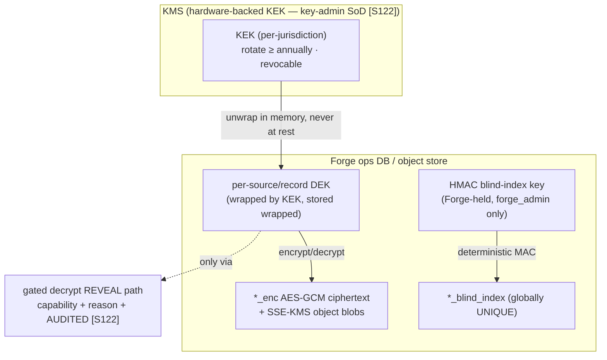
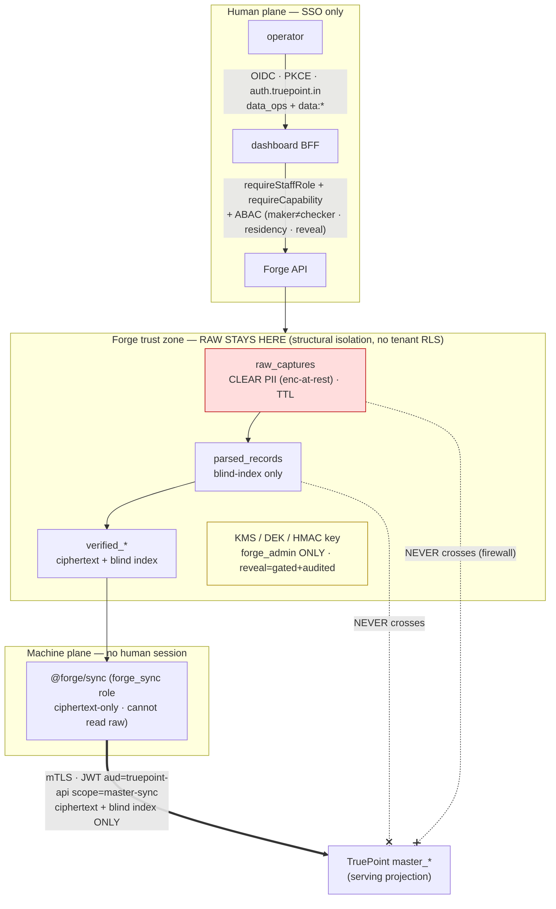

# 14 — Security & Access Control

> **Canonical contract:** this doc is the **security authority** for TruePoint Forge — it owns the deep
> enforcement design that every neighbor defers to it: the **human identity plane** (operator SSO via
> OIDC against `auth.truepoint.in` → the shipped `data_ops` staff role + `data:*` capabilities, with a
> hybrid **RBAC+ABAC** policy layer whose load-bearing predicate is **maker ≠ checker**), the **machine
> identity plane** (the `forge_sync` system principal — a client-credentials service JWT
> `aud=truepoint-api`, `scope=master-sync`, on mTLS, short-lived + auto-rotated, **never** a human
> session), the **least-privilege DB-role policy** (the *no single role reads raw PII **and** writes
> production* invariant), **untrusted raw-payload handling** (no-eval parsers, JSONB-injection & SSRF
> guards), the **KMS envelope-encryption** key hierarchy + custody, the **raw-layer PII posture**
> (minimization · encrypt-at-rest · retention TTL · no clear PII in a queryable column), **DSAR /
> right-to-erasure** across all four layers with production propagation, **audit completeness &
> tamper-evidence**, the **STRIDE threat model + controls**, the **legal / ToS / abuse register**
> (co-owned with ADR-0046), and the **SOC 2 / GDPR / CCPA / DPDP** compliance mapping. **Locking ADRs:
> ADR-0046** (raw API interception — this doc co-owns its legal/ToS/abuse register and owns the DPIA,
> LIA, retention, residency, and access-control detail its `Detail:` line points here) **and ADR-0047**
> (the system-principal isolation for the sync). **Security has final say** (CLAUDE.md precedence rule).

This doc is the **owner of the deep security detail**; it does **not** restate what a neighbor owns.
The **DB role-grant matrix** and the `forge_audit_log` / `sync_outbox` / `retention_policies` table
shapes are owned by `05-database-design` (`§DB roles`, `§Group 11`, `§Partitioning & retention`) — this
doc owns the *policy, key custody, and CI-enforced invariants* over them. The **maker-checker gate
mechanics** are owned by `10-verification-and-approval-workflow`; this doc owns only the
separation-of-duties *enforcement primitive*. The **sync wire contract + the machine-principal
handshake** are owned by `11-database-synchronization-engine` (`§4`); this doc owns the **issuer /
verifier, key custody, rotation, and ABAC scope policy** that `11 §4` explicitly hands here. The **trust
boundaries at a glance** and the **compliance firewall as an architectural invariant** are drawn by
`03-system-architecture`; this doc turns them into *enforcement*. Current-state TruePoint facts cite
`_context/ecosystem-facts.md` by `§`; industry practice cites `[S#]` in `_context/research-corpus.md`;
frozen vocabulary is `_context/decision-ledger.md` (L1–L11).

---

## Objectives

1. Fix the **two identity planes** — human operators (SSO → `data_ops` + `data:*`) and the machine sync
   principal (scoped client-credentials JWT) — and the **hybrid RBAC+ABAC** authorization model that
   sits over both, with **maker ≠ checker** as a code-level, server-enforced predicate.
2. Own the **least-privilege DB-role policy** (`05 §DB roles`) as a *security* invariant: **no single
   role reads raw PII and writes the production CRM**, key-admin/developer SoD, and CI grant-tests that
   assert it — not a style choice but a compliance control [S121][S122].
3. Make **untrusted raw payloads** safe: declarative, **no-`eval`** parsers; JSONB-injection and
   size/depth-bomb guards; and an **SSRF egress guard** so no worker ever fetches a payload-derived URL
   into the internal network.
4. Specify **secrets & KMS envelope encryption** (per-source/record DEK wrapped by a KMS KEK, rotation,
   revocation, custody, and a **gated, audited decrypt reveal path**), and the **raw-layer PII posture**
   (minimization, encrypt-at-rest, short retention TTL, no clear PII queryable).
5. Design the **cross-layer DSAR / right-to-erasure** orchestrator (`raw_captures + parsed_records +
   verified_records`) and its **propagation to production** via the `verified.suppressed` fan-out (link
   `11 §5`), satisfying GDPR Art 17's *verifiable, irreversible, reach-the-raw-layer, ≤1-month* duty
   [S117].
6. Fix the **isolation model for an internal, staff-only tool** (structural per-layer roles + capability
   gating + residency, **not** tenant RLS) while preserving **tenant/workspace attribution** for
   consent, audit, and DSAR; specify **audit completeness & tamper-evidence**; present a **STRIDE
   threat model + controls table**, **co-own ADR-0046's legal/ToS/abuse register**, and map **SOC 2 /
   GDPR / CCPA / DPDP** — registering the security gaps (`G-FORGE-1401…1413`), risks, milestones, and OQs.

Non-goals: the DB role-grant matrix + audit/retention table shapes (`05`), the maker-checker state
machine (`10`), the sync wire contract + system-principal handshake table (`11 §4`), the ADR texts
(`ADR-0046`/`ADR-0047`), and the scale/topology of the pooler and autoscaler (`17-scalability`).

---

## Industry practice (cited [S#])

**Authorization is hybrid RBAC+ABAC; separation-of-duties is an ABAC predicate, not a permission.**
NIST SP 800-162 defines ABAC over subject/object/action/environment attributes against a Boolean
policy; pure RBAC suffers **role explosion** at scale, so enterprises deploy a **hybrid** — coarse RBAC
roles plus ABAC conditions for data-sensitivity, residency, and environment [S115]. Critically, ABAC
expresses **separation-of-duties as a policy comparing a subject attribute to a resource-owner
attribute** — *no user may approve their own request* — the exact enforcement primitive for
maker-checker at the verified→production gate [S115]. Maker-checker requires **≥2 distinct individuals**
and the initiator can **never** approve their own request, enforced at the **code level, not just
permissions** [S57], with ISO/IEC 27001 Annex A 5.3 giving it a formal compliance basis [S59].

**Non-human identity is a first-class, short-lived, scoped credential — never a static shared token.**
Zero-trust service-to-service auth **splits identity from authorization**: a cryptographic workload
identity (SPIFFE X.509/JWT SVID, over **mTLS**) answers *"is this really service X?"* while a **scoped
client-credentials** grant answers *"can X do Y?"* [S119]. Practice sets intentionally **short (~1-day)
certificate lifetimes with automated proactive rotation**, eliminating long-lived static service
secrets [S120].

**Least-privilege + envelope encryption + KMS key-admin SoD are what SOC 2 auditors actually check.**
SOC 2 rests on five Trust Services Criteria (Security, Availability, Processing Integrity,
Confidentiality, Privacy); a Type II report evaluates design **and** operating effectiveness over a
6–12-month window [S121]. Auditors expect fine-grained distinct roles + federated login/MFA under the
shared-responsibility model [S121], and **encryption at rest + in transit via a centralized KMS**, at-
least-annual **key rotation**, revocation, **separation of duties between key admins and
developers/security**, and **audit logging of all key events** — an **envelope-encryption** scheme (a
per-record/tenant DEK wrapped by a KMS KEK) satisfies this [S122].

**Erasure must be verifiable, irreversible, reach the raw layer, and land within a month.** GDPR Art 17
erasure must be *"verifiable and irreversible,"* though regulators accept that immutable backups may be
put *"beyond use"* and overwritten within the normal retention cycle rather than destroyed on demand —
so erasure must reach the **raw layer** with **short retention + tombstoning** so raw PII ages out of
backups [S117]; controllers must respond **without undue delay and within one month** [S117].

**Aggregating scraped PII with no lawful basis is directly penalized — transparency is a standalone
duty.** The Dutch DPA fined **Clearview €30.5M** for scraping images into an aggregated DB with **no
Art 6 lawful basis** and held that a company's own **business interest is *not* GDPR "legitimate
interest"** [S116]; Clearview *separately* breached transparency/access (Arts 12/14/15) by not informing
subjects — an aggregated-PII store with **no subject-notice/lookup path is a standalone violation even
with a lawful basis** [S116]. GDPR **Art 14** requires informing a subject whose PII was obtained *not
from them*, generally within one month [S16]. **India DPDP §7** makes **consent the primary ground**
with a closed "legitimate uses" list and **no legitimate-interest balancing**; the Data Fiduciary stays
liable regardless of processor contract — India-origin data is **highest-restriction** [S118].

**Append-only is not tamper-evident; provenance distinguishes AI from human.** Tamper-evident audit logs
use **hash-chaining** or **Merkle trees** (O(log n) inclusion/consistency proofs), and tamper-evidence
**only holds if the Merkle root is externally anchored** — append-only storage alone is **not**
tamper-evident [S91]. W3C PROV's **Agent** distinguishes an **AI-extractor** from a **human
maker/checker**, and `hadPrimarySource` ties a verified field to the intercepted raw response [S89].
The MAIN-world interception legal picture — Meta v. Bright Data (ToS breach exists **while logged in**),
hiQ's ~$500K loss on contract/misappropriation despite the narrow-CFAA "win," and Van Buren narrowing
CFAA to public data — is the register this doc co-owns [S11][S10][S12][S19].

---

## Current-state — what already exists in TruePoint (cite `ecosystem-facts`)

Forge's security model is a **reuse-and-extend** of shipped TruePoint machinery, with two deliberate
inversions (no tenant RLS; a machine write-path into the golden universe).

| Shipped surface (`ecosystem-facts`) | What it gives Forge | The gap this doc closes |
|---|---|---|
| **Staff RBAC** — `data_ops` staff role + `data:read\|manage\|review\|export` caps (`staffCapability.ts`); `super_admin` implies all; enforced by `requireStaffRole` / `requireCapability` middleware (§C) | the operator identity + the exact capability vocabulary the ABAC layer keys off | SSO mapping (`decision-ledger` L6) + a **hybrid RBAC+ABAC** policy with maker≠checker/residency predicates — no ABAC layer today (`G-FORGE-1401`) [S115] |
| **Tx scopes** — `withTenantTx` (RLS, GUCs), `withPrivilegedTx` (BYPASSRLS, DSAR), `withErTx` (`leadwolf_er`, Layer-0), `withPlatformTx` (audited); fail-closed GUC idiom `NULLIF(current_setting(…,true),'')::uuid` (§D) | the transaction-scope + fail-closed idiom Forge mirrors as `withIngestTx`/`withParserTx`/`withErTx`/`withForgeAppTx`/`withSyncTx`/`withForgeAdminTx` (`05 §DB roles`) | the **per-layer least-privilege role policy** + the *no-raw-PII-and-production* invariant as a CI-enforced control (`G-FORGE-506` deep-owner) [S121] |
| **PII scheme** — channel PII as `bytea` AES-GCM `*_enc` + **globally-unique HMAC `*_blind_index`**; `content_hash` UNIQUE (§B) | the encrypt-at-rest + blind-index primitives the whole pipeline honors verbatim | the **KMS key hierarchy, rotation, custody, and gated decrypt reveal path** behind those bytes (`05 §Envelope encryption` defers here, `G-FORGE-1406`) [S122] |
| **`/api/v1/ingest` scope trust boundary** — `envelope.scope.tenantId === session tenantId` else `403 scope_mismatch`; scope re-pinned to the token; `checkCaptureRate` 2,000/min **fails open** (a scraping throttle, **not** a security control) (§A) | the input-trust + scope-pin pattern the capture edge reuses | Forge's edge is **staff-only** (no tenant session) and needs a **real DoS control** (fail-closed limiter), payload validation, and SSRF/JSONB guards — none exist (`G-FORGE-1404/1405`) |
| **Audit** — tenant `audit_log` (closed enum); **`platform_audit_log`** immutable, written in-tx by `withPlatformTx`/`recordPlatformEvent` (`client.ts:121-178`, ADR-0032) (§C) | the immutable-in-tx audit idiom Forge's **`forge_audit_log`** mirrors | **hash-chain + external Merkle anchoring** + **decrypt-reveal auditing** — append-only ≠ tamper-evident (`05 §Group 11` defers here, `G-FORGE-1410`) [S91] |
| **ADR-0045 extension token** — `aud=chrome-extension://<id>`, `scope ["extension"]`, separate session family, **no platform-admin bit**, human companion-window mint; `EXTENSION_ORIGINS` allow-list (§E) | the **isolation template** to contrast against for the machine sync principal | the sync principal is **machine-only** client-credentials + mTLS + rotation — a distinct, higher-value credential class (`11 §4` defers the issuer/verifier here, `G-FORGE-1402`) [S119] |
| **`master_*`** — seven **system-owned, NOT RLS-scoped** tables; isolation is **structural** (no grant to `leadwolf_app`) (§B) | the precedent for Forge's **deliberate inversion** away from tenant RLS | Forge extends structural isolation to **all four layers** + **residency tagging**; attribution (not tenant isolation) is the model (`G-FORGE-1403`) |

**The one-line summary of the gap.** TruePoint ships the *primitives* — a staff role vocabulary, tx
scopes with a fail-closed idiom, the AES-GCM + blind-index PII scheme, an immutable in-tx audit log, and
a scoped-token isolation template — but Forge has **no ABAC policy layer, no machine-principal issuer,
no key hierarchy/custody, no untrusted-payload guards, no cross-layer DSAR orchestrator, no
tamper-evident audit, and no authored DPIA/LIA**. This doc is that security spine.

---

## Design

### 1 — The human identity plane: SSO → `data_ops` + `data:*` + hybrid RBAC/ABAC

Operators authenticate **only** via SSO — OIDC against `auth.truepoint.in`, PKCE redirect, in-memory
access token, silent refresh, `fetchWithAuth` — mirroring `apps/admin`'s shipped auth client
(`decision-ledger` L6, `ecosystem-facts §C`). The token maps to the **existing** `data_ops` staff role
and `data:read|manage|review|export` capabilities; **no new capability** is introduced unless one has
no TruePoint analog (any new capability is flagged in Open questions, `decision-ledger` L6). There is no
password/local-account path; the dashboard is a UX surface, **not** a security boundary — the `apps/api`
BFF re-checks `requireStaffRole` + `requireCapability` on every call (`ecosystem-facts §C`).

Coarse RBAC is necessary but insufficient — it cannot express *"the checker must differ from the maker,"
"India-origin data may only be processed under a consent gate,"* or *"decrypt is reserved."* Over RBAC
we add an **ABAC** policy layer [S115] evaluated per request:

| Predicate | Rule | Enforced where | Grounding |
|---|---|---|---|
| **maker ≠ checker** (SoD) | executor asserts `requested_by_user_id != decided_by_user_id` **server-side** before it runs | `withForgeAdminTx` promotion executor (`10 §3`) | [S57][S59][S115] |
| **capability** | action requires the mapped `data:*` cap (`review`/`manage`/`export`) | `requireCapability` middleware (§C) | [S121] |
| **residency / jurisdiction** | India-origin (DPDP §7) → consent-gated processing class; EU → Art 14 obligations attach | policy check on `region`/`jurisdiction` (`05` `verified_persons`) | [S118][S16] |
| **decrypt reveal** | reading `*_enc` clear PII requires an explicit, capability-gated, **audited** reveal — never implicit | gated reveal path (§5), `forge_admin` custody | [S122] |
| **environment** | interception-origin data honors the global kill-switch + per-tenant flag (ADR-0046 #4) | capture-edge policy | ADR-0046 |

The policy is **default-deny**: an action with no matching allow rule is refused, and the ABAC
evaluation is itself audited (§9). This is the RBAC+ABAC hybrid NIST prescribes to avoid role explosion
while still expressing data-sensitivity and SoD conditions [S115].

### 2 — The machine identity plane: the `forge_sync` system principal (contrast ADR-0045)

The sync into the golden universe is a **machine-only** write path — the single highest-value credential
in the estate, because it writes the entire `master_*` graph (`11`, `ADR-0047` Costs). It does **not**
run the human `authn → tenancy → requireRole` chain; a **service-auth** middleware verifies a
client-credentials **service JWT** (`aud=truepoint-api`, `scope=master-sync`) over **mTLS**. `11 §4`
owns the wire handshake and the property-by-property contrast with ADR-0045; **this doc owns the issuer,
verifier, key custody, rotation, and revocation** that `11 §4` hands here.

- **Issuer / verifier.** A dedicated service-credential issuer (candidate: an internal OIDC
  client-credentials endpoint on `auth.truepoint.in`, or a SPIFFE/SPIRE SVID — depth is **OQ-R18**
  [S119]) mints a short-lived JWT with **exactly** `aud=truepoint-api` + `scope=master-sync` and **no
  platform-admin bit, no user id, no tenant/workspace GUC**. The `/master-sync` verifier checks
  signature, `aud`, `scope`, `exp`, and the mTLS client-cert binding — and **rejects any token carrying
  a human session claim** (the disjointness is asserted, not assumed).
- **Short-lived + auto-rotated.** Credential lifetime is intentionally short (~1 day) with **automated
  proactive rotation** — never a long-lived static shared secret [S120]. Rotation is zero-downtime
  (overlapping validity windows); a leaked credential expires fast and can be **revoked** immediately
  (issuer revocation list / short cache TTL).
- **Least-privilege on the wire.** The principal maps to the `forge_sync` DB role — which can read
  `verified_*` **ciphertext + blind index only** and **cannot read `raw_captures`** (`05 §DB roles`,
  the [S121] separation). It never holds a decrypt grant.
- **Misuse monitoring.** Because this credential writes the golden graph, its use is monitored for
  anomalies (volume spikes, off-hours dispatch, unexpected source IP); alerting is a first-class SLO,
  not optional (`ADR-0047` Costs, `G-FORGE-1402`).

Both ADR-0045's extension token and this principal isolate a non-human/limited-scope caller from the
human surface; the sync principal goes **further** — no session at all, a distinct high-value credential,
mTLS + short rotation + misuse alerting **mandatory** (`11 §4` table).

### 3 — Least-privilege DB roles & the *no-raw-PII-and-production* invariant

The **role-grant matrix is owned by `05 §DB roles`** (`forge_ingest` / `_parser` / `_er` / `_app` /
`_sync` / `_admin`, each on its `with*Tx` scope). This doc owns it as a **security invariant** and its
**CI enforcement**. The load-bearing property [S121]:

> **No single DB role both reads raw PII and reaches the production CRM.** `forge_ingest` (writes
> `raw_captures`) and `forge_sync` (pushes `verified_*` to production) are **disjoint** — neither can do
> the other's job, and neither can decrypt.

Enforcement is not documentation — it is a **CI grant-test** asserting the disjoint/least-privilege
matrix (mirroring TruePoint's `ALL_RETRY_POLICIES`-style asserted-invariant test, `ecosystem-facts §C`;
`05 G-FORGE-506`): the test fails the build if `forge_ingest` gains `SELECT` on `verified_*`, if
`forge_sync` gains `SELECT` on `raw_captures`, or if any role but `forge_admin` gains the KMS-decrypt or
HMAC-key grant. Key-admin/developer SoD [S122] is likewise structural: **only `forge_admin`** (on
`withForgeAdminTx`, the `leadwolf_admin`/BYPASS analog) holds migrations, DSAR/erasure, and the sole
`UPDATE/DELETE` on `forge_audit_log`; developers and `forge_app` never hold decrypt. The fail-closed GUC
idiom `NULLIF(current_setting(…,true),'')::uuid` (`§D`) is reused so a missing scope denies rather than
leaks.

### 4 — Untrusted raw-payload handling: no-eval, JSONB-injection, SSRF

Every `raw_payload` is **attacker-influenced** — it is verbatim JSON from a page the extension
intercepted (or an uploaded blob), so it is treated as hostile at every stage (defense-in-depth, even
though it arrives from a first-party operator).

- **No `eval`, no dynamic parser.** Parsers are **declarative, in-repo, versioned code** — never
  `eval()` of the payload and never a remotely-supplied parser body. This is the security reading of
  ADR-0046 #5 (extraction rules in-repo; signed remote config may **kill/flag only**, never swap
  extraction) — the store-reviewed build is the behavior that runs, which is both anti-tamper and the
  property that keeps collected scope legally reviewable.
- **JSONB-injection & structural DoS.** The large verbatim blob lives in the **object store** (pointer
  in row), not queryable JSONB (`03 §Container`, `05`); small inline JSONB is written **only via
  parameterized inserts** — a query is **never** built by interpolating payload keys or a client-
  supplied JSON path. Per-record and per-envelope **byte caps** + a **max nesting depth** reject
  depth/size-bomb payloads at the edge (mirrors envelope-v2 size caps, `decision-ledger` L3), so a
  hostile document cannot exhaust the JSON parser or the row.
- **SSRF egress guard.** Payloads carry URLs (`consentContext.sourceUrl`, avatar/logo links, endpoints).
  **No worker fetches a payload-derived URL by default.** Where a fetch is genuinely required (e.g. a
  future asset pull), it goes through an **egress allowlist proxy** that resolves DNS itself, **blocks
  RFC-1918 / link-local / loopback / cloud-metadata (169.254.169.254) targets**, disallows redirects to
  private ranges, and strips credentials — so a crafted `raw_payload` can never pivot into the internal
  network or the instance metadata service (`G-FORGE-1404`).
- **Content-hash integrity.** The apply and every stage reject an item whose `content_hash` does not
  match its payload (`11 §Security`), so a tampered payload with a stale hash is dropped, not applied.
- **Secret redaction at the source.** The capture-SDK redacts `Authorization`/`Bearer`/`csrf`/cookie
  headers and token-shaped fields **before** the payload crosses the isolated-world → network boundary
  (ADR-0046 #2), so provider/session secrets never enter `raw_captures` in the first place.

### 5 — Secrets & KMS envelope encryption

`05 §Envelope encryption` states the scheme and **defers the deep design here**. Forge holds its **own**
key hierarchy (never TruePoint's), reachable **only** by `forge_admin`:



| Control | Design | Grounding |
|---|---|---|
| Envelope encryption | a **per-source/record DEK** wrapped by a **KMS KEK**; only wrapped DEKs at rest; unwrap in memory per operation | [S122] |
| At rest | channel PII as `bytea` AES-GCM `*_enc`; large raw blobs as **SSE-KMS** object-store objects; blind index is HMAC, not reversible | [S122]; `§B` |
| In transit | TLS everywhere; **mTLS** on the Forge↔CRM sync (§2) | [S119][S122] |
| Rotation / revocation | KEK rotated **≥ annually** + on suspicion; DEK re-wrap on KEK rotation; sync credential ~daily (§2) | [S122][S120] |
| Key-admin SoD | **only `forge_admin`** holds KMS-decrypt + HMAC-key grants; developers/`forge_app`/`forge_sync` never do; all key events audited | [S122] |
| Gated reveal | decrypting `*_enc` to clear PII is a **separate, capability-gated, reason-logged, audited** path — never implicit on read; not granted to `forge_app`/`forge_sync` | [S122]; `05` |

Provider/API secrets (Apollo/ZoomInfo/Reacher/Twilio, `03`) live in KMS/secrets-manager, **never on a
client**, and are scoped to the `forge_parser`/worker path only.

### 6 — The raw-layer PII posture

`raw_captures` is the **only** layer holding **clear** PII (verbatim intercepted payloads), so it is the
sharpest-edged asset in Forge and the primary erasure target. `05 §PII posture` fixes the per-layer
table; this doc owns the *posture rationale + controls*:

| Layer | Clear PII? | Control (this doc owns the enforcement) |
|---|---|---|
| **raw_captures** (bronze) | **yes** (verbatim) | **encrypt-at-rest** (SSE-KMS blob + column-encrypted inline JSONB); **minimization** (in-repo endpoint allowlist + secret redaction + field minimization, ADR-0046 #2); **short retention TTL** + tombstoning (§7); staff-only, `forge_ingest`/`forge_parser` reach it, `forge_sync` **cannot**; **no clear PII in a queryable column** (blob is opaque) |
| **parsed_records** (silver) | **no channel PII** | only `email_blind_index`/`phone_blind_index` (HMAC) for ER blocking — a match-against mint with **no revealable value** (`§B`); low-sensitivity identity fields (name/title) in clear as in `master_persons` |
| **verified_*** (gold) | ciphertext only | `bytea` AES-GCM `*_enc` + globally-unique HMAC `*_blind_index` — exact mirror of `master_emails`/`master_phones` (`masterGraph.ts:227-278`) |
| **the wire / master_*** | ciphertext only | ciphertext + blind index **only** cross the firewall; clear PII **never** (`11 §Security`, `03 §firewall`) |

The **firewall is a data-classification invariant**: clear PII exists in exactly one place
(`raw_captures`, encrypted), is progressively minimized to blind-index-only by silver, and only
ciphertext+blind-index ever leaves Forge — so the production CRM holds derived, minimized golden records
and **never** a verbatim authenticated-session capture (ADR-0046 #3, the compliance firewall).

### 7 — DSAR / right-to-erasure across all four layers + production propagation

GDPR Art 17 (and CCPA "right to delete" / DPDP erasure) requires erasure that is **verifiable,
irreversible, reaches the raw layer, and completes within one month** [S117]. Because clear PII is
minimized to a **blind index** in every layer but bronze, the blind index **is** the subject-lookup key
across the whole estate — a subject's email/phone is HMAC'd once and located everywhere.

```mermaid
sequenceDiagram
    autonumber
    participant SUB as Data subject / DSAR intake
    participant ORCH as Forge DSAR orchestrator<br/>(withForgeAdminTx · forge_admin)
    participant RAW as raw_captures (bronze)
    participant PAR as parsed_records (silver)
    participant VER as verified_* (gold)
    participant OB as sync_outbox
    participant TP as TruePoint master_* (production)

    SUB->>ORCH: erasure request (email/phone/subject)
    ORCH->>ORCH: HMAC → blind_index (subject-lookup key, §B)
    ORCH->>RAW: locate by fan-out FK; set status='erased',<br/>DELETE object blob (reach the raw layer) [S117]
    ORCH->>PAR: tombstone rows by blind_index / raw FK cascade
    ORCH->>VER: set is_suppressed=true; null revealable *_enc
    ORCH->>OB: emit verified.suppressed (same tx as VER change) [S20]
    OB-->>TP: /master-sync apply → master_persons.is_suppressed=true<br/>drop from masked search (11 §5)
    ORCH-->>SUB: completion record within 1 month (audited) [S117]
    Note over RAW,TP: verifiable + irreversible + reaches raw + propagates to production
```

- **Cross-layer reach.** The orchestrator (privileged, `withForgeAdminTx`) resolves the blind index and
  fans out: `raw_captures` blob **deleted** + row `status='erased'` (the [S117] reach-the-raw duty,
  ADR-0046 R3/R4, `ADR-0046 G-FORGE-4605`); `parsed_records` tombstoned via the `raw_capture_id` cascade;
  `verified_*` `is_suppressed=true` with revealable ciphertext nulled.
- **Production propagation is narrow and owned by `11 §5`.** The gold change emits a
  **`verified.suppressed`** event **in the same transaction**, which the sync applies as
  `master_persons.is_suppressed=true` + drop-from-masked-search — this doc **does not** restate the
  fan-out mechanics (`11 §5` owns them); it owns the **cross-layer orchestration + the ≤1-month SLA +
  the verifiability/audit** [S117].
- **Suppress vs hard-erase.** A DSAR normally maps to `is_suppressed` on `master_*`; a hard row-delete
  is a **privileged reconciliation-repair** op, not an ordinary sync item (`11 §5`, open question).
- **Backups.** Immutable backups are put **"beyond use"** and overwritten within the normal retention
  cycle rather than surgically edited — the regulator-accepted posture [S117]; the raw TTL guarantees
  raw PII ages out of backups.
- **Art 15 access / Art 14 notice.** The same blind-index subject index answers **access** requests and
  underpins the **Art 14 notification** mechanism (ADR-0046 R4, `G-FORGE-1409`) — an aggregated-PII store
  with no subject-lookup path is itself a violation [S116].

### 8 — Isolation & attribution for an internal, staff-only tool

Forge has **no customer tenants of its own** and, like `master_*`, is **not RLS/tenant-scoped** — a
deliberate inversion (`ecosystem-facts §B`, `05 §DB roles`). Isolation and attribution are **different
axes**, and conflating them is the trap this section closes:

- **Isolation is structural, not tenant-based.** The boundary is **per-layer DB role + capability +
  residency** (§1/§3), not an `app.current_tenant_id` RLS predicate. Adding tenancy factories here would
  be wrong (the master graph is system-owned); the security control is the disjoint role matrix + ABAC.
- **Attribution is preserved.** Even without tenant isolation, every capture carries **provenance** —
  who captured it (`capturedByUserId`), for which TruePoint tenant/workspace the operator/extension was
  acting (envelope scope, `consentContext`), under what basis — so the record is attributable for
  **consent (Art 6 LIA), audit, and DSAR** (§7/§9). Attribution answers *"whose data, on whose behalf,
  under what basis"*; it is **not** an access-isolation boundary.
- **Residency is the one hard partition.** `region`/`jurisdiction` tags (`05` `verified_persons`) drive
  the ABAC residency predicate (§1): India-origin data is highest-restriction (DPDP §7,
  consent-or-not-processable [S118]) and processed only under a consent gate; EU data attaches Art 14
  obligations. Residency is enforced at the policy layer, not as tenant RLS.
- **The per-tenant interception flag** (ADR-0046 #4) is the one place a *customer* tenant identity gates
  Forge behavior — capture runs for a tenant only when its flag + the global kill-switch permit.

### 9 — Audit completeness & tamper-evidence

Forge mirrors TruePoint's immutable-in-tx audit idiom (`platform_audit_log` / `recordPlatformEvent`,
`§C`) as **`forge_audit_log`** (schema owned by `05 §Group 11`). This doc owns **completeness** and
**tamper-evidence**:

- **Completeness.** Every security-relevant event is an audited action with a **closed vocabulary**
  (`capture.landed`, `parse.completed`, `merge.decided`, `review.approved`, `sync.dispatched`,
  `erasure.executed`, plus this doc's additions: `pii.revealed`, `key.rotated`, `role.granted`,
  `abac.denied`, `credential.minted`). The load-bearing additions are: **every decrypt/reveal** (who,
  which subject, why — §5), **every DSAR step** (§7), **every sync dispatch/apply** (`11 §Security`,
  audited on **both** sides — `forge_audit_log` + TruePoint `platform_audit_log`), and **every ABAC
  denial**. The event records `actor_kind` (human operator vs machine principal = a PROV **Agent**,
  [S89]).
- **Tamper-evidence.** Append-only is **not** tamper-evident [S91]. Each `forge_audit_log` row is
  **hash-chained** to its predecessor and each monthly partition's **Merkle root is externally
  anchored** (a write-once external store) so the chain cannot be silently rewritten — the property that
  makes the log defensible for SOC 2, DSAR proof, and breach forensics (`05 G-FORGE-504`, this doc is the
  security deep-owner, `G-FORGE-1410`) [S91]. Only `forge_admin` may `UPDATE/DELETE` the table (§3), and
  even that is itself audited.

### 10 — Trust boundaries & the STRIDE threat model

The security-zone view **refines** `03`'s architecture boundary with the *credentials, key custody, and
data-classification* that enforce it (it does not restate `03`'s dataflow):



**STRIDE threat model + controls** (Forge-specific threats; controls cite the section that owns them):

| STRIDE | Threat (Forge-specific) | Control | Grounding |
|---|---|---|---|
| **Spoofing** | forged sync credential writes the golden graph; operator impersonation | mTLS + scoped short-lived JWT + revocation + misuse alerting (§2); SSO-only, no local accounts (§1) | [S119][S120] |
| **Tampering** | altered raw payload applied; audit log rewritten; parser swapped remotely | `content_hash` integrity check (§4); hash-chained + Merkle-anchored audit (§9); in-repo parsers, kill/flag-only signed config (§4) | [S91]; ADR-0046 #5 |
| **Repudiation** | operator/machine denies an approve/merge/reveal/erase | append-only, tamper-evident, `actor_kind` PROV-Agent audit of every decision + reveal + dispatch (§9) | [S91][S89] |
| **Information disclosure** | clear PII leaks to production or to a low-priv role; SSRF exfiltration | firewall (ciphertext-only wire, §6); disjoint role matrix + gated decrypt (§3/§5); SSRF egress guard (§4) | [S121][S122] |
| **Denial of service** | payload size/depth bomb; capture flood (`checkCaptureRate` **fails open**, §A) | edge byte/depth caps (§4); a **fail-closed** DoS limiter distinct from the scraping throttle; per-stage queue isolation (`12`) | [S72] |
| **Elevation of privilege** | maker self-approves; `forge_app` gains decrypt; sync token gains admin bit | server-side maker≠checker ABAC (§1); CI grant-test disjointness (§3); JWT scope has **no** platform-admin bit (§2) | [S57][S115][S121] |

### 11 — Legal / ToS / abuse risk register (co-owned with ADR-0046)

ADR-0046 owns the **decision** and the full R1–R8 register; this doc **co-owns** it as the **security
enforcement + GA-gate** view — mapping each legal theory to the control this doc builds, and flagging the
**GA-blocking** items (Ledger **OQ-2** / research **OQ-R1**). *This is not restated for color — it is the
control mapping counsel signs against.*

| # (ADR-0046) | Legal theory & precedent | Security control this doc owns | GA-blocking? |
|---|---|---|---|
| **R1** — ToS breach (logged-in scraping) | Meta v. Bright Data: breach exists **while logged in** — Forge's fact pattern; hiQ's ~$500K loss [S11][S10][S19] | compliance **firewall** (raw quarantined, §6); passive own-session capture only; DARK + per-tenant gate | **yes** — counsel |
| **R2** — CFAA "without authorization" (US) | Van Buren/hiQ narrowed CFAA to public data; behind-auth is weaker shield [S12] | no credential theft / barrier circumvention; own-session only; legal review of logged-in posture | yes |
| **R3** — GDPR Art 6, no lawful basis | Clearview €30.5M; business interest ≠ legitimate interest [S116] | **per-source Art 6(1)(f) LIA before collection** (`G-FORGE-1411`); minimization (§4/§6); short retention TTL (§7); DPIA | **yes** — DPO |
| **R4** — GDPR Art 14 notice (indirect PII) | Clearview breached Arts 12/14/15; ≤1-month notice [S16][S116] | Art 14 mechanism + **blind-index subject-lookup index** spanning all layers (§7, `G-FORGE-1409`) | **yes** |
| **R5** — India DPDP §7 (consent-primary) | no legitimate-interest escape; fiduciary liable [S118] | residency tag → highest-restriction **consent-gate** ABAC predicate (§1/§8); shortest TTL (§7) | yes |
| **R6** — Chrome Web Store Limited Use / single-purpose | bars resale to "information resellers"; 2026 tightening [S14][S15] | user-consent/own-data single-purpose framing; off-store fallback (ADR-0046 R6, OQ-R2) | — (store) |
| **R7** — account/anti-bot risk to the user | interception is a detected technique class [S13] | **passive** capture only (no synthetic nav/replay/pagination); rate posture | — |
| **R8** — reversal of a documented decision (governance) | ADR-0043 #4 rejected this on the record [ADR-0043] | ADR-0046 **openly amends**, scoped + gated + firewalled + security-gated GA | — |

**Posture, stated honestly:** the firewall + gating + minimization + retention + the GA-blocking
DPIA/LIA gate **bound** the exposure — **none makes interception legal by assertion**. R1/R3/R4/R5 are
carried as **GA-blocking** items requiring counsel + DPO sign-off (ADR-0046 #6). *Build dark; enable no
tenant until the gate clears* (security has final say).

### 12 — Compliance mapping (SOC 2 / GDPR / CCPA / DPDP)

| Framework | Obligation | Forge control (owning §) | Grounding |
|---|---|---|---|
| **SOC 2** | 5 TSC; Type II design+operating effectiveness over 6–12 mo | Security (§1–§4), Confidentiality (§5/§6), Processing Integrity (versioned parsers + DQ gate, `08`/`10`), Privacy (§7), Availability (`17`) | [S121] |
| **SOC 2 — encryption** | KMS at-rest+in-transit, rotation, revocation, key-admin SoD, key-event audit | envelope encryption + KMS custody + rotation + SoD + audited key events (§5/§9) | [S122] |
| **GDPR** | Art 6 basis; Art 14 notice; Art 15 access; Art 17 erasure; Art 32 security; Art 35 DPIA | LIA (§11); Art 14 mechanism + subject index (§7); reach-the-raw erasure ≤1 mo (§7); encryption + least-privilege (§3–§6); DPIA (`G-FORGE-1411`) | [S116][S117][S16] |
| **CCPA/CPRA** | notice at collection; right to know/delete; "sell/share" limits; **data-broker registration** | delete = the Art-17 orchestrator (§7); know = subject index (§7); firewall limits onward disclosure (§6); broker-registration flagged for counsel (OQ below) | — (parallels [S117]) |
| **DPDP (India)** | consent-primary (§7); no legitimate-interest; fiduciary liability | residency tag → consent-gate ABAC predicate (§1/§8); highest-restriction TTL (§7) | [S118] |

CCPA specifics (data-broker registration under the Delete Act; "sale/share" characterization of
enriched B2B data) are **not** settled by the corpus and are routed to counsel (open question) rather
than asserted here.

---

## Security considerations

This *is* the security doc; the capstone is the set of **load-bearing invariants** where **security has
final say** (CLAUDE.md precedence) and no other skill's convenience or structure may override:

1. **The firewall holds by construction.** Clear PII lives in exactly one encrypted layer
   (`raw_captures`) and **only** ciphertext + blind index ever crosses to production — verified by a
   data-diff / contract test that excludes raw fields by design (§6, `03`/`11`). *No proposal to route a
   raw payload to the CRM is acceptable without re-opening ADR-0046 **and** ADR-0047.*
2. **Disjoint least-privilege is CI-enforced.** No role reads raw PII **and** writes production; the
   grant-test is a red-build gate, not a doc (§3).
3. **Maker ≠ checker is server-side and un-bypassable.** A UI cannot grant it; the executor asserts it
   before it runs (§1, `10`).
4. **The machine principal is machine-only, scoped, short-lived, mTLS, and never carries a human
   session or admin bit** (§2).
5. **Decrypt is a gated, audited reveal** — never implicit on read (§5/§9).
6. **Erasure reaches the raw layer and completes ≤1 month, verifiably** (§7).
7. **Interception does not GA until legal + DPIA sign-off** (§11, ADR-0046 #6) — GA-blocking, not
   planning-blocking.

Where design (convenience), architecture (structure), or platform (throughput) tension any of these,
**security wins** — the file-size/feature-folder rules never justify skipping tenant/PII isolation, a
missing grant-test, input validation, or the firewall (CLAUDE.md precedence).

---

## Scalability considerations

Deep capacity/topology is owned by `17-scalability`; the security controls must hold **at scale**:

- **ABAC evaluation is per-request** — the policy is a cheap, cached, in-process decision (attributes on
  the session + resource), not a network hop; default-deny with a small allow set keeps it O(1) [S115].
- **Envelope encryption scales by DEK locality** — per-source/record DEKs mean rotation re-wraps keys,
  not re-encrypts petabytes; only wrapped DEKs touch the DB (§5) [S122].
- **Audit volume** — `forge_audit_log` is monthly-partitioned with **per-partition Merkle anchoring**
  (`05`), so tamper-evidence cost is O(log n) proofs, not a full re-hash [S91].
- **DSAR at scale** — the blind index is the **single indexed lookup key** across all layers, so a
  subject fan-out is index scans, not full-table scans (§7); erasure sweeps ride the monthly raw
  partitions for cheap cold-tier deletion (`05 §Partitioning`).
- **DoS control must be fail-closed** — `checkCaptureRate` fails **open** (a scraping throttle, §A), so
  the security limiter on the capture edge is a **distinct, fail-closed** control; per-stage queue
  isolation contains a flood to one stage (`12`).

---

## Risks & mitigations

Security gaps use **`G-FORGE-1401…1413`** (unique across the suite, `decision-ledger` L9), mapped to parent
`G-FORGE-0x`/ADR gaps and to `28-enterprise-readiness-audit.md` where a TruePoint gap is relevant.

| Risk / gap | Area | L × I | Mitigation (cite) | Parent |
|---|---|---|---|---|
| **G-FORGE-1401** — no Forge ABAC layer over `data_ops`/`data:*` (maker≠checker/residency/reveal predicates) | security | High × High | hybrid RBAC+ABAC policy, default-deny, per-request (§1) [S115] | G-FORGE-209 |
| **G-FORGE-1402** — no system-principal **issuer/verifier** for the `aud=truepoint-api` `scope=master-sync` JWT; no mTLS/rotation/revocation/misuse-alerting | security | High × High | scoped client-credentials JWT + mTLS + short rotation + revocation + misuse SLO (§2) [S119][S120] | G-FORGE-1102 |
| **G-FORGE-1403** — no residency/jurisdiction processing gate (India highest-restriction) | security / data | Med × High | ABAC residency predicate + consent gate + shortest TTL (§8/§7) [S118] | G-FORGE-1206 |
| **G-FORGE-1404** — no SSRF egress guard; a payload-derived URL fetch could pivot to internal/metadata | security | Med × High | no default fetch; allowlist egress proxy blocking RFC-1918/link-local/metadata (§4) | — |
| **G-FORGE-1405** — no-eval/JSONB-injection/size-depth hardening on untrusted payloads unspecified | security | Med × High | declarative in-repo parsers, parameterized JSONB, byte/depth caps, hash integrity (§4) [S81] | G-FORGE-4604 |
| **G-FORGE-1406** — KMS key hierarchy (DEK⨯KEK), rotation, revocation, custody, gated decrypt reveal not built | security | High × High | envelope encryption + `forge_admin`-only custody + audited reveal (§5) [S122] | G-FORGE-503 |
| **G-FORGE-1407** — no cross-layer DSAR/erasure orchestrator spanning raw→parsed→verified + production fan-out | security / data | High × High | blind-index subject index + `withForgeAdminTx` fan-out + `verified.suppressed` (§7, `11 §5`) [S117] | G-FORGE-1205 |
| **G-FORGE-1408** — raw-layer retention TTL value unset + tombstoning sweep unbuilt (Art 17 reach-the-raw) | security / data | Med × High | short TTL + tombstoning; India shortest; sweep on monthly partitions (§6/§7) [S117] | G-FORGE-4605 |
| **G-FORGE-1409** — GDPR Art 14 notification mechanism + subject-lookup index unbuilt | security / legal | Med × High | Art 14 mechanism on the blind-index subject index (§7) [S16][S116] | G-FORGE-1205 |
| **G-FORGE-1410** — audit is append-only but **not** tamper-evident; decrypt/reveal not audited | security / ops | Med × High | hash-chain + external Merkle anchoring + reveal/key-event auditing (§9) [S91] | G-FORGE-504 |
| **G-FORGE-1411** — DPIA + per-source Art 6(1)(f) LIA not authored (**GA-blocking**) | security / legal | High × High | DPIA + LIA before collection; counsel + DPO gate (§11, ADR-0046 #6) [S116] | G-FORGE-4601 |
| **G-FORGE-1412** — STRIDE controls not verified end-to-end in CI (grant-disjointness, firewall data-diff, SSRF, JWT-scope) | security | Med × Med | CI security suite asserting each control (§3/§4/§10) [S128] | G-FORGE-506 |
| **G-FORGE-1413** — CCPA/CPRA data-broker registration + "sale/share" posture unresolved | legal | Med × Med | counsel review; flag as OQ, do not assert (§12) | — |
| Compromised sync credential writes the golden graph | security | Low × High | mTLS + short rotation + scope enforcement + misuse alerting (§2) [S119][S120] | G-FORGE-1402 |
| Clear PII leaks past the firewall | security | Low × High | ciphertext-only wire + disjoint roles + data-diff test (§3/§6) | G-FORGE-1407 |

---

## Milestones

Security work threads through every `M-FORGE-*` phase (`03`); this doc owns the **security exit criteria**.

| Milestone | Delivers (security) | Exit criterion |
|---|---|---|
| **M-FORGE-A — Foundation** | SSO → `data_ops` mapping; the six DB roles + **CI grant-test disjointness**; KMS key hierarchy + custody; edge payload guards (byte/depth caps, SSRF) | a captured payload lands under `forge_ingest` only; the grant-test is green; no role reads raw **and** writes production [S121] |
| **M-FORGE-B/C — Parse/Extract/Resolve** | no-eval declarative parsers; blind-index-only silver; ABAC residency predicate | a hostile payload cannot `eval`/SSRF/JSONB-inject; India-origin data is consent-gated (§4/§8) |
| **M-FORGE-D — Verify** | maker≠checker ABAC in the promotion executor; decrypt reveal = gated + audited | no promotion by maker==checker (server-enforced); every reveal is audited [S57][S122] |
| **M-FORGE-E — Sync Egress** | system-principal issuer/verifier + mTLS + rotation; both-sided sync audit; firewall data-diff test | the sync uses a scoped machine JWT (no session); a firewall test proves no raw field crosses (§2/§6) |
| **M-FORGE-F — Operate** | hash-chain + Merkle anchoring; cross-layer DSAR orchestrator; misuse alerting; DPIA/LIA authored | a DSAR erases raw→parsed→verified + suppresses production ≤1 mo, verifiably; DPIA signed before GA [S117] |

---

## Deliverables

1. The **two-plane identity model** (human SSO → `data_ops`+`data:*`+ABAC; machine `forge_sync`
   principal) and the **hybrid RBAC+ABAC policy** with maker≠checker/residency/reveal predicates (§1/§2).
2. The **least-privilege DB-role security invariant** + the **CI grant-test** enforcing
   *no-raw-PII-and-production* and key-admin SoD (§3).
3. The **untrusted-payload hardening** spec (no-eval, JSONB-injection, size/depth, **SSRF egress
   guard**) (§4).
4. The **KMS envelope-encryption key hierarchy + custody + gated audited reveal** (§5) and the
   **raw-layer PII posture** (minimization · encrypt-at-rest · TTL · no clear PII queryable) (§6).
5. The **cross-layer DSAR/erasure orchestrator** + production propagation (§7, handing the fan-out to
   `11 §5`) and the **isolation-vs-attribution** model for an internal tool (§8).
6. **Audit completeness + tamper-evidence** (hash-chain + Merkle anchoring + reveal/key auditing) (§9);
   the **trust-boundary diagram + STRIDE controls** (§10); the **co-owned legal/ToS/abuse register**
   (§11); the **SOC 2 / GDPR / CCPA / DPDP** mapping (§12); and the gap register `G-FORGE-1401…1413`.

---

## Success criteria

1. **The firewall is provable, not asserted** — a CI data-diff / contract test shows no
   `raw_captures`/`parsed_records` field is reachable from production (§6). ✅
2. **Disjoint least-privilege holds under CI** — the grant-test fails the build if any role reads raw
   PII **and** writes production, or if decrypt escapes `forge_admin` (§3) [S121]. ✅
3. **Maker ≠ checker is server-enforced** — no promotion runs when `requested_by == decided_by` (§1)
   [S57]. ✅
4. **The machine sync uses a scoped, short-lived, mTLS system principal** — never a human/tenant
   session, no admin bit; a leaked token expires/revokes fast (§2) [S119][S120]. ✅
5. **Clear PII is encrypted, minimized, and single-homed** — it exists only in encrypted `raw_captures`,
   is blind-index-only by silver, and never crosses the firewall in clear (§5/§6). ✅
6. **A DSAR erases across all four layers + suppresses production, verifiably, ≤1 month** (§7) [S117].
   ✅
7. **The audit is tamper-evident** — hash-chained + externally-anchored, with every decrypt/dispatch/
   erasure recorded and `actor_kind` distinguishing human from machine (§9) [S91][S89]. ✅
8. **No security decision is answered from first principles where a `§`/`[S#]` grounds it** — every
   reuse cites `ecosystem-facts`, every best practice cites `[S#]` (CLAUDE.md mandatory-read rule). ✅

---

## Future expansion

- **Full SPIFFE/SPIRE workload identity (OQ-R18).** Graduate the `forge_sync` principal from mTLS +
  scoped client-credentials JWT to auto-issued short-lived X.509 SVIDs [S119][S120].
- **Field-level decay TTL + re-verification (OQ-R14).** As "verified" records decay (~2.5%/mo [S6]), a
  per-field TTL re-opens stale records — a security-adjacent freshness control that also bounds how long
  minimized PII is retained downstream.
- **Confidential compute / tokenization for reveal.** Move the decrypt reveal path into an enclave or a
  tokenization service so clear PII never materializes in an application process.
- **Automated DPIA evidence + continuous compliance.** Wire the SOC 2 / GDPR control evidence
  (grant-tests, key-event logs, DSAR SLAs) into a continuous-compliance dashboard for the Type II window
  [S121].
- **CCPA data-broker registration workflow** once counsel resolves the "sale/share" characterization
  (§12, OQ below).

---

## Open questions

The full register lives in `_context/decision-ledger.md` (L11, OQ-1…6) and `01`'s research register
(OQ-R1…20); the security-shaping ones surface here.

- **OQ-2 (Ledger) / OQ-R1 (research) — interception legal + DPIA sign-off (GA-blocking).** The Art
  6(1)(f) LIA, Art 14 mechanism, DPDP §7 posture, and DPIA (§11, ADR-0046 #6) need counsel + DPO — the
  single largest GA gate in the Forge suite. This doc owns the *enforcement*; counsel owns the *verdict*.
  [S116][S118][S16][S17]
- **OQ-R18 / Ledger L5 — service-identity depth.** mTLS + scoped client-credentials JWT (this doc) vs
  full SPIFFE/SPIRE for the `forge_sync` principal (§2). [S119][S120]
- **OQ-4 — raw-blob substrate** (object store vs JSONB) directly shapes the **encrypt-at-rest** control
  (SSE-KMS blob vs column-encrypted JSONB, §5/§6) and the **retention TTL** value below. [S82]
- **OQ-5 — retirement of TruePoint's dark `chrome_extension` connector** and its `/api/v1/ingest` DOM
  path — a residual attack surface once capture pivots to Forge (`ecosystem-facts §A/§E`).
- **OQ-6 — `@forge/capture-sdk` single-sourcing.** The **secret-redaction + size/PII guard** is a
  security boundary; sharing the SDK verbatim with the extension vs forking changes where that boundary
  is enforced and reviewed (§4, ADR-0046 #2).
- **New (this doc) — raw-layer retention TTL value.** The specific TTL that satisfies Art 17
  reach-the-raw [S117] while preserving enough window for reprocessing/reparse is unset (co-owned with
  ADR-0046 / OQ-4); India-origin gets the shortest (§6/§7). **G-FORGE-1408.**
- **New (this doc) — suppress vs hard-erase on production.** Whether a DSAR always maps to
  `is_suppressed` on `master_*` or a class of erasure requires a privileged hard row-delete
  reconciliation-repair op (jointly with `11 §5`). [S117]
- **New (this doc) — CCPA/CPRA data-broker registration + "sale/share" characterization** of enriched
  B2B golden records — needs counsel; not assertable from the corpus (§12). **G-FORGE-1413.**
- **New (this doc) — any Forge-specific capability.** If SSO mapping surfaces a data-ops action with no
  `data:*` analog (e.g. `data:reveal` for the decrypt path), it is flagged here before introduction
  (`decision-ledger` L6). Candidate: a distinct **`data:reveal`** capability gating §5.
